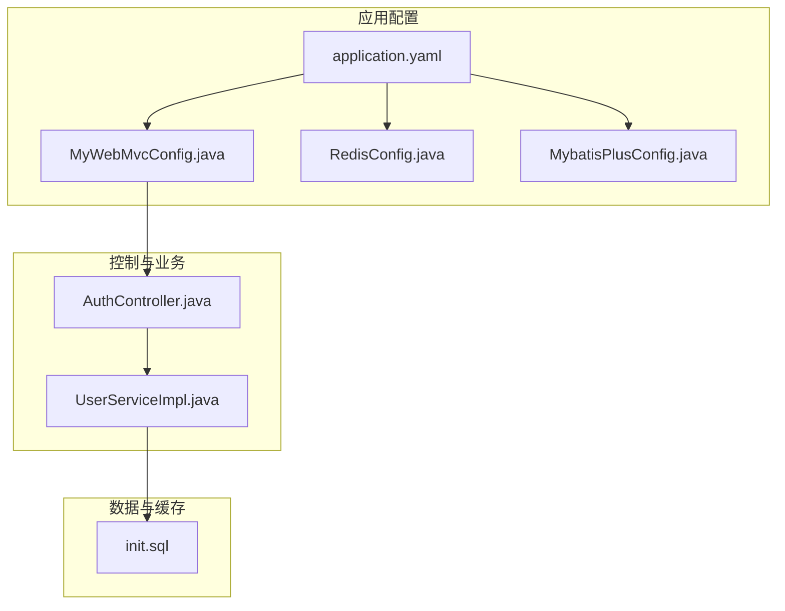
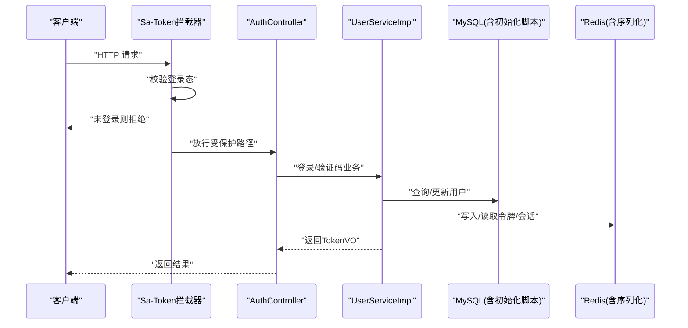
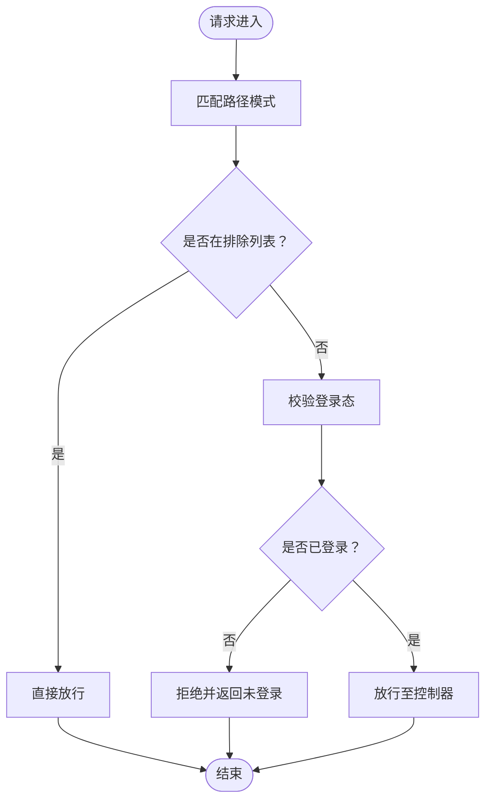
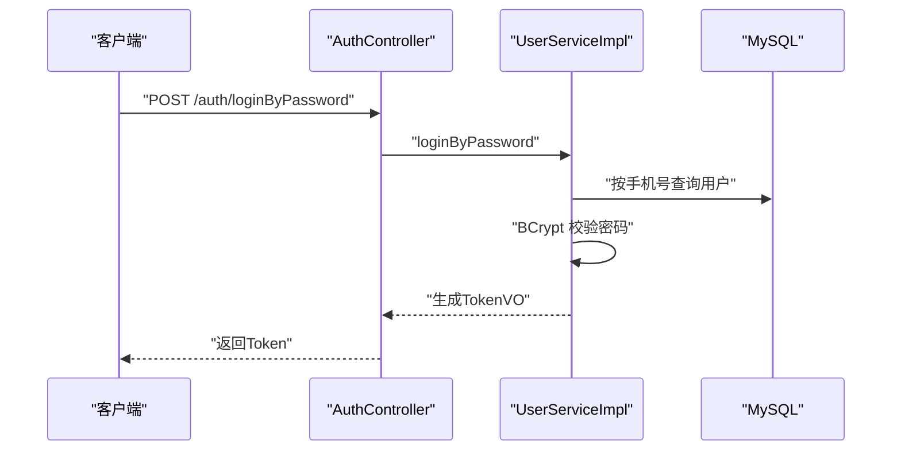
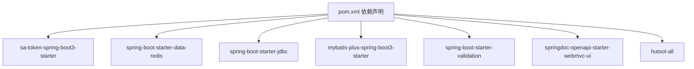

# 安全配置与最佳实践

<cite>
**本文引用的文件**
- [application.yaml](file://chuan-bill-server/src/main/resources/application.yaml)
- [MyWebMvcConfig.java](file://chuan-bill-server/src/main/java/com/samoy/chuanbillserver/config/MyWebMvcConfig.java)
- [RedisConfig.java](file://chuan-bill-server/src/main/java/com/samoy/chuanbillserver/config/RedisConfig.java)
- [MybatisPlusConfig.java](file://chuan-bill-server/src/main/java/com/samoy/chuanbillserver/config/MybatisPlusConfig.java)
- [pom.xml](file://chuan-bill-server/pom.xml)
- [AuthController.java](file://chuan-bill-server/src/main/java/com/samoy/chuanbillserver/controller/AuthController.java)
- [UserServiceImpl.java](file://chuan-bill-server/src/main/java/com/samoy/chuanbillserver/service/impl/UserServiceImpl.java)
- [init.sql](file://chuan-bill-server/init.sql)
</cite>

## 目录
1. [简介](#简介)
2. [项目结构](#项目结构)
3. [核心组件](#核心组件)
4. [架构总览](#架构总览)
5. [详细组件分析](#详细组件分析)
6. [依赖分析](#依赖分析)
7. [性能考虑](#性能考虑)
8. [故障排查指南](#故障排查指南)
9. [结论](#结论)
10. [附录](#附录)

## 简介
本文件面向“小川记账”后端服务的安全配置与最佳实践，聚焦以下方面：
- Spring Security 与统一鉴权（基于 Sa-Token）的配置要点
- CORS 与安全响应头建议（当前工程未显式配置）
- 会话与令牌管理策略
- 数据库安全配置（连接池、SQL 注入防护、权限最小化）
- Redis 安全配置（认证、网络隔离、数据持久化）
- 日志与审计（访问日志、安全事件日志、敏感信息脱敏）
- 安全配置检查清单（生产基线、定期评估、漏洞扫描）
- 安全配置模板与部署安全指南

说明：当前仓库中未发现显式的 Spring Security 或 CORS 配置类；统一鉴权通过 Sa-Token 实现，拦截器对路径进行保护。后续章节将结合现有代码与通用安全实践给出可落地的加固建议。

## 项目结构
后端采用 Spring Boot 工程，关键安全相关模块分布如下：
- 配置层：application.yaml（数据库、Redis、OpenAPI 文档、Sa-Token）、MyWebMvcConfig（拦截器注册）
- 数据访问层：Mybatis-Plus 配置、Mapper/XML
- 缓存层：RedisConfig（序列化与连接工厂）
- 控制层：AuthController（认证相关接口）
- 业务层：UserServiceImpl（登录、密码校验、脱敏）
- 初始化脚本：init.sql（数据库结构与默认数据）

图表来源
- [application.yaml:1-51](file://chuan-bill-server/src/main/resources/application.yaml#L1-L51)
- [MyWebMvcConfig.java:1-21](file://chuan-bill-server/src/main/java/com/samoy/chuanbillserver/config/MyWebMvcConfig.java#L1-L21)
- [RedisConfig.java:1-32](file://chuan-bill-server/src/main/java/com/samoy/chuanbillserver/config/RedisConfig.java#L1-L32)
- [MybatisPlusConfig.java:1-18](file://chuan-bill-server/src/main/java/com/samoy/chuanbillserver/config/MybatisPlusConfig.java#L1-L18)
- [AuthController.java:1-66](file://chuan-bill-server/src/main/java/com/samoy/chuanbillserver/controller/AuthController.java#L1-L66)
- [UserServiceImpl.java:1-192](file://chuan-bill-server/src/main/java/com/samoy/chuanbillserver/service/impl/UserServiceImpl.java#L1-L192)
- [init.sql:1-326](file://chuan-bill-server/init.sql#L1-L326)

章节来源
- [application.yaml:1-51](file://chuan-bill-server/src/main/resources/application.yaml#L1-L51)
- [MyWebMvcConfig.java:1-21](file://chuan-bill-server/src/main/java/com/samoy/chuanbillserver/config/MyWebMvcConfig.java#L1-L21)
- [RedisConfig.java:1-32](file://chuan-bill-server/src/main/java/com/samoy/chuanbillserver/config/RedisConfig.java#L1-L32)
- [MybatisPlusConfig.java:1-18](file://chuan-bill-server/src/main/java/com/samoy/chuanbillserver/config/MybatisPlusConfig.java#L1-L18)
- [AuthController.java:1-66](file://chuan-bill-server/src/main/java/com/samoy/chuanbillserver/controller/AuthController.java#L1-L66)
- [UserServiceImpl.java:1-192](file://chuan-bill-server/src/main/java/com/samoy/chuanbillserver/service/impl/UserServiceImpl.java#L1-L192)
- [init.sql:1-326](file://chuan-bill-server/init.sql#L1-L326)

## 核心组件
- 统一鉴权与拦截器：通过 Sa-Token 的拦截器对所有受保护路径进行登录态校验，开放认证与文档相关路径。
- 数据库与连接池：使用 Spring Boot Starter JDBC + Druid/Hikari（由 Starter 自动装配），配置在 application.yaml 中。
- Redis：使用 Spring Boot Data Redis，自定义 RedisTemplate 序列化策略，支持 Sa-Token 与业务缓存。
- MyBatis-Plus：分页插件与逻辑删除配置，提升查询安全性与数据完整性。
- 认证流程：AuthController 提供密码登录、短信登录与验证码发送接口；UserServiceImpl 使用 BCrypt 进行密码校验与哈希存储，并对用户信息进行脱敏。

章节来源
- [MyWebMvcConfig.java:10-19](file://chuan-bill-server/src/main/java/com/samoy/chuanbillserver/config/MyWebMvcConfig.java#L10-L19)
- [application.yaml:4-21](file://chuan-bill-server/src/main/resources/application.yaml#L4-L21)
- [RedisConfig.java:14-29](file://chuan-bill-server/src/main/java/com/samoy/chuanbillserver/config/RedisConfig.java#L14-L29)
- [MybatisPlusConfig.java:12-15](file://chuan-bill-server/src/main/java/com/samoy/chuanbillserver/config/MybatisPlusConfig.java#L12-L15)
- [AuthController.java:35-64](file://chuan-bill-server/src/main/java/com/samoy/chuanbillserver/controller/AuthController.java#L35-L64)
- [UserServiceImpl.java:40-83](file://chuan-bill-server/src/main/java/com/samoy/chuanbillserver/service/impl/UserServiceImpl.java#L40-L83)

## 架构总览
下图展示从客户端到控制器、业务与数据层的整体调用链路及安全控制点。

图表来源
- [MyWebMvcConfig.java:12-18](file://chuan-bill-server/src/main/java/com/samoy/chuanbillserver/config/MyWebMvcConfig.java#L12-L18)
- [AuthController.java:35-64](file://chuan-bill-server/src/main/java/com/samoy/chuanbillserver/controller/AuthController.java#L35-L64)
- [UserServiceImpl.java:40-83](file://chuan-bill-server/src/main/java/com/samoy/chuanbillserver/service/impl/UserServiceImpl.java#L40-L83)
- [application.yaml:4-21](file://chuan-bill-server/src/main/resources/application.yaml#L4-L21)
- [init.sql:14-31](file://chuan-bill-server/init.sql#L14-L31)

## 详细组件分析

### 统一鉴权与拦截器（Sa-Token）
- 拦截范围：对所有路径进行登录态校验，排除认证、OpenAPI 文档相关路径。
- 登录态：使用 Sa-Token 的 StpUtil.login 与令牌管理，令牌名、超时等在 application.yaml 中配置。
- 建议：结合 Spring Security 的 CSRF、XSS、CSP 等安全头进行补充（当前工程未显式配置）。

图表来源
- [MyWebMvcConfig.java:12-18](file://chuan-bill-server/src/main/java/com/samoy/chuanbillserver/config/MyWebMvcConfig.java#L12-L18)
- [application.yaml:23-30](file://chuan-bill-server/src/main/resources/application.yaml#L23-L30)

章节来源
- [MyWebMvcConfig.java:10-19](file://chuan-bill-server/src/main/java/com/samoy/chuanbillserver/config/MyWebMvcConfig.java#L10-L19)
- [application.yaml:23-30](file://chuan-bill-server/src/main/resources/application.yaml#L23-L30)

### 认证与密码安全（BCrypt、脱敏）
- 密码存储：使用 BCrypt 对密码进行哈希存储，避免明文或弱加密。
- 登录流程：密码登录与短信登录分别校验密码与验证码；首次登录若用户不存在则自动创建。
- 脱敏输出：用户信息返回时对手机号进行中间部分脱敏。
- 建议：引入验证码有效期与失败次数限制、滑动验证码或图形验证码以降低暴力破解风险。

图表来源
- [AuthController.java:35-39](file://chuan-bill-server/src/main/java/com/samoy/chuanbillserver/controller/AuthController.java#L35-L39)
- [UserServiceImpl.java:40-61](file://chuan-bill-server/src/main/java/com/samoy/chuanbillserver/service/impl/UserServiceImpl.java#L40-L61)
- [init.sql:14-31](file://chuan-bill-server/init.sql#L14-L31)

章节来源
- [AuthController.java:35-39](file://chuan-bill-server/src/main/java/com/samoy/chuanbillserver/controller/AuthController.java#L35-L39)
- [UserServiceImpl.java:40-61](file://chuan-bill-server/src/main/java/com/samoy/chuanbillserver/service/impl/UserServiceImpl.java#L40-L61)
- [init.sql:14-31](file://chuan-bill-server/init.sql#L14-L31)

### 数据库安全配置
- 连接与驱动：使用 MySQL Connector/J，通过 application.yaml 配置 URL、用户名、密码。
- 连接池：由 spring-boot-starter-jdbc 自动装配（常见为 Hikari），建议在生产环境显式配置连接池参数（最大连接数、空闲超时、获取等待时间等）。
- SQL 注入防护：MyBatis-Plus 提供分页插件与条件构造器，推荐优先使用参数化查询与分页插件，避免拼接 SQL。
- 权限最小化：数据库账号仅授予必要权限（如只读/写入特定库表），并启用 SSL 连接（当前 application.yaml 中关闭了 SSL，建议在生产开启）。
- 逻辑删除：配置逻辑删除字段，避免误删造成数据丢失。

章节来源
- [application.yaml:4-8](file://chuan-bill-server/src/main/resources/application.yaml#L4-L8)
- [MybatisPlusConfig.java:12-15](file://chuan-bill-server/src/main/java/com/samoy/chuanbillserver/config/MybatisPlusConfig.java#L12-L15)
- [init.sql:14-31](file://chuan-bill-server/init.sql#L14-L31)

### Redis 安全配置
- 认证：application.yaml 支持设置 Redis 密码；建议在生产环境强制开启密码认证。
- 网络隔离：Redis 服务器应部署在内网或专用子网，仅允许应用服务器访问；禁止公网暴露。
- 连接池：通过 Spring Boot Data Redis 自动装配连接池；建议限制最大连接数、空闲连接、超时时间。
- 序列化：RedisConfig 使用 JSON 序列化，注意敏感字段不要落盘或需额外加密。
- 持久化：RDB/AOF 只在需要时开启，且仅在可信网络；生产建议开启 RDB 快照与 AOF 追加，但需配合强口令与网络隔离。

章节来源
- [application.yaml:10-21](file://chuan-bill-server/src/main/resources/application.yaml#L10-L21)
- [RedisConfig.java:14-29](file://chuan-bill-server/src/main/java/com/samoy/chuanbillserver/config/RedisConfig.java#L14-L29)

### 日志与审计
- 访问日志：建议启用 Nginx/网关访问日志与 Spring Boot Actuator 的访问日志（如需），记录请求方法、URL、IP、状态码、耗时。
- 安全日志：记录登录尝试、令牌刷新、权限变更、异常登录等事件；建议接入集中式日志系统（如 ELK/Splunk）。
- 敏感信息脱敏：UserServiceImpl 已对手机号进行脱敏；建议对日志中的手机号、密码、令牌等字段统一脱敏策略。
- 审计追踪：对关键操作（修改密码、删除账户、权限变更）进行审计留痕。

章节来源
- [UserServiceImpl.java:154-156](file://chuan-bill-server/src/main/java/com/samoy/chuanbillserver/service/impl/UserServiceImpl.java#L154-L156)

### OpenAPI 文档与安全
- 当前配置启用了 OpenAPI 与 Swagger UI；建议在生产关闭 UI 访问或限制访问源。
- 在生产环境建议移除或隐藏文档路径，防止泄露接口细节。

章节来源
- [application.yaml:41-47](file://chuan-bill-server/src/main/resources/application.yaml#L41-L47)
- [pom.xml:137-141](file://chuan-bill-server/pom.xml#L137-L141)

## 依赖分析
- Sa-Token：提供统一鉴权、会话管理与 Redis 集成。
- MyBatis-Plus：提供分页、逻辑删除与代码生成能力。
- Spring Boot Starter Data Redis：提供 Redis 客户端与连接池。
- Spring Boot Starter JDBC：提供数据库连接与连接池。
- Hutool：提供常用工具（如手机号脱敏、哈希等）。
- DashScope SDK：OCR 等第三方能力集成。

图表来源
- [pom.xml:51-168](file://chuan-bill-server/pom.xml#L51-L168)

章节来源
- [pom.xml:51-168](file://chuan-bill-server/pom.xml#L51-L168)

## 性能考虑
- 连接池参数：合理设置最大连接数、空闲连接、最大等待时间，避免资源争用。
- Redis 序列化：JSON 序列化开销较高，建议对热点键采用更高效序列化或压缩策略。
- 分页查询：MyBatis-Plus 分页插件默认 MySQL，确保索引覆盖与 LIMIT 优化。
- 缓存命中：对高频读取的数据增加缓存，减少数据库压力；对敏感数据谨慎缓存。

## 故障排查指南
- 登录失败：检查手机号是否存在、密码是否正确、验证码是否有效；确认 Sa-Token 令牌是否过期。
- 数据库连接异常：核对 application.yaml 中的数据库 URL、用户名、密码；确认网络连通性与防火墙策略。
- Redis 连接异常：核对主机、端口、密码；确认网络隔离与 ACL 规则。
- OpenAPI 文档不可见：确认生产环境已关闭 UI 访问或限制来源。
- 日志脱敏问题：检查脱敏规则与日志输出格式，确保敏感字段被替换。

章节来源
- [UserServiceImpl.java:40-61](file://chuan-bill-server/src/main/java/com/samoy/chuanbillserver/service/impl/UserServiceImpl.java#L40-L61)
- [application.yaml:4-21](file://chuan-bill-server/src/main/resources/application.yaml#L4-L21)
- [application.yaml:41-47](file://chuan-bill-server/src/main/resources/application.yaml#L41-L47)

## 结论
本项目已具备基础的统一鉴权与密码安全能力，但在生产环境中仍需补齐：
- 显式配置 Spring Security 的 CORS、CSRF、安全响应头
- 强化数据库与 Redis 的认证与网络隔离
- 完善日志与审计体系，落实敏感信息脱敏
- 建立安全配置检查清单与定期评估机制

## 附录

### 安全配置检查清单（生产基线）
- 网络与边界
  - Redis 仅内网访问，禁止公网暴露
  - 数据库仅内网访问，启用 SSL 连接
  - 开启 WAF/防火墙，限制来源 IP
- 认证与授权
  - 启用 Sa-Token 令牌刷新与失效策略
  - 引入验证码频率限制与失败锁定
  - 对 OpenAPI 文档路径进行访问控制
- 数据与缓存
  - Redis 强密码认证，禁用不安全命令
  - 连接池参数按峰值压测调优
  - 对敏感字段进行缓存加密或不缓存
- 日志与审计
  - 开启访问日志与安全事件日志
  - 统一脱敏策略，避免敏感信息落盘
  - 审计关键操作并保留足够留存期
- 运维与合规
  - 定期漏洞扫描与渗透测试
  - 代码与依赖版本升级策略
  - 备份与恢复演练

### 安全配置模板与部署指南
- 数据库安全模板
  - 连接串：启用 SSL，设置最小 TLS 版本
  - 用户权限：最小权限原则，分离只读与写入账号
  - 连接池：设置最大连接数、空闲超时、获取等待时间
- Redis 安全模板
  - 开启 requirepass，禁止未认证访问
  - 使用 ACL 限制命令与通道
  - 关闭危险命令（如 FLUSHALL/FLUSHDB）
- 日志与审计模板
  - 访问日志：记录时间戳、客户端 IP、方法、URL、状态码、耗时
  - 安全日志：登录尝试、令牌刷新、权限变更、异常行为
  - 脱敏规则：手机号中间位、身份证号、银行卡号等
- 部署安全指南
  - 使用容器编排平台的 Secrets 管理敏感变量
  - 生产分支与发布流程自动化，禁止明文配置
  - 定期巡检与基线对比，形成安全报告