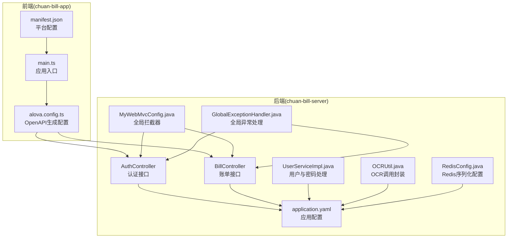
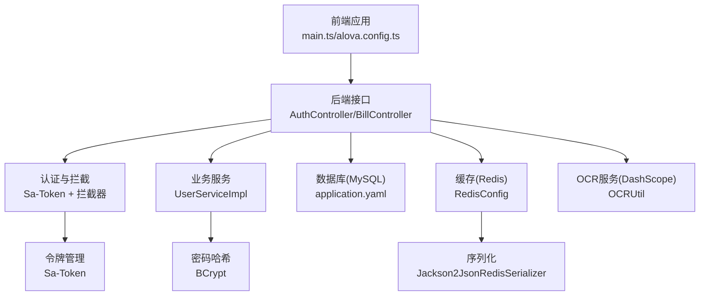
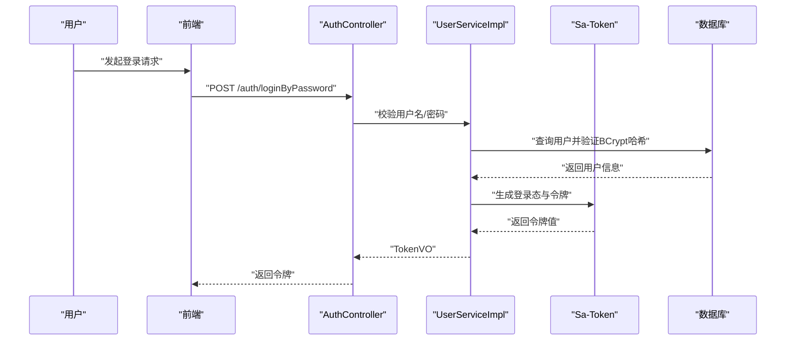
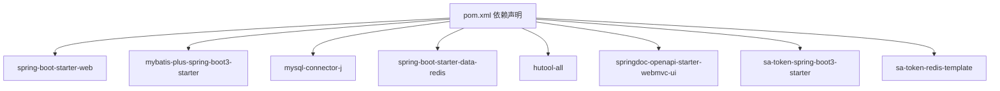
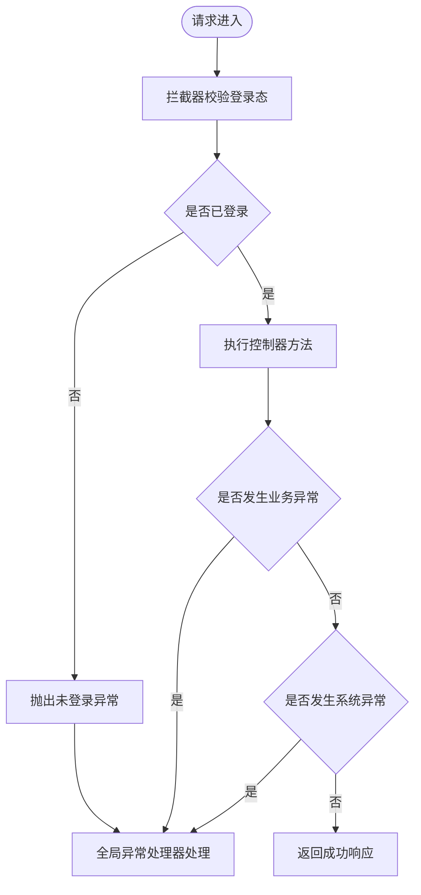
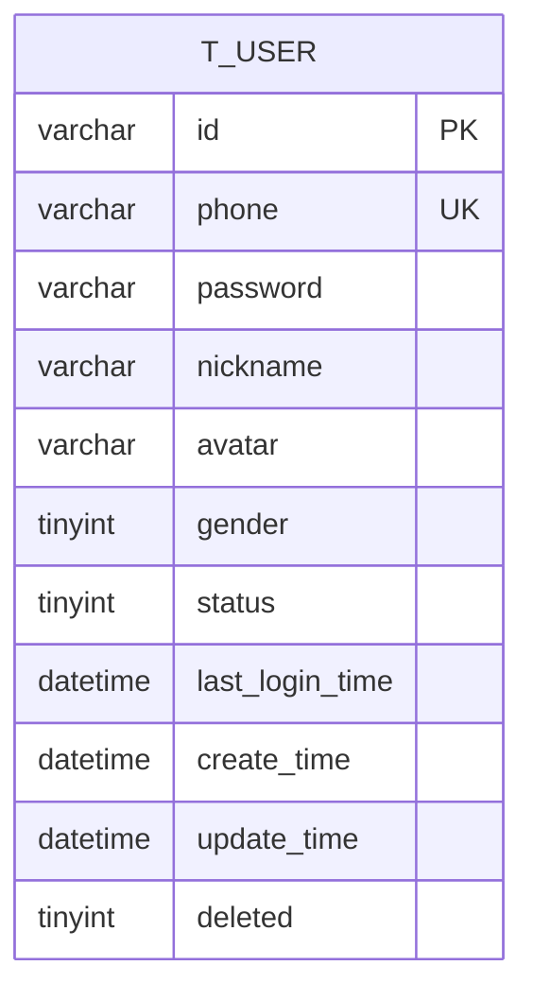

# 数据安全

<cite>
**本文引用的文件**
- [application.yaml](file://chuan-bill-server/src/main/resources/application.yaml)
- [RedisConfig.java](file://chuan-bill-server/src/main/java/com/samoy/chuanbillserver/config/RedisConfig.java)
- [OCRUtil.java](file://chuan-bill-server/src/main/java/com/samoy/chuanbillserver/utils/OCRUtil.java)
- [User.java](file://chuan-bill-server/src/main/java/com/samoy/chuanbillserver/entity/User.java)
- [UserServiceImpl.java](file://chuan-bill-server/src/main/java/com/samoy/chuanbillserver/service/impl/UserServiceImpl.java)
- [MyWebMvcConfig.java](file://chuan-bill-server/src/main/java/com/samoy/chuanbillserver/config/MyWebMvcConfig.java)
- [GlobalExceptionHandler.java](file://chuan-bill-server/src/main/java/com/samoy/chuanbillserver/expection/GlobalExceptionHandler.java)
- [pom.xml](file://chuan-bill-server/pom.xml)
- [init.sql](file://chuan-bill-server/init.sql)
- [AuthController.java](file://chuan-bill-server/src/main/java/com/samoy/chuanbillserver/controller/AuthController.java)
- [BillController.java](file://chuan-bill-server/src/main/java/com/samoy/chuanbillserver/controller/BillController.java)
- [manifest.json](file://chuan-bill-app/src/manifest.json)
- [main.ts](file://chuan-bill-app/src/main.ts)
- [alova.config.ts](file://chuan-bill-app/alova.config.ts)
</cite>

## 目录
1. [简介](#简介)
2. [项目结构](#项目结构)
3. [核心组件](#核心组件)
4. [架构总览](#架构总览)
5. [详细组件分析](#详细组件分析)
6. [依赖分析](#依赖分析)
7. [性能考虑](#性能考虑)
8. [故障排查指南](#故障排查指南)
9. [结论](#结论)
10. [附录](#附录)

## 简介
本文件面向“小川记账”项目的整体数据安全，围绕数据传输安全、数据存储安全、敏感信息保护、隐私保护与合规、安全配置与密钥管理、备份与恢复、以及数据泄露预防与应急响应等方面，结合代码库现状进行系统化梳理与建议。由于当前仓库中未发现显式的HTTPS/SSL/TLS配置与数据库连接加密、Redis缓存加密、支付信息加密、OCR识别数据处理加密等实现，本文在“现状分析”基础上提供可落地的安全加固方案与最佳实践。

## 项目结构
- 后端（Spring Boot）位于 chuan-bill-server，负责认证授权、账单管理、OCR调用、数据库与Redis交互等。
- 前端（Vue 3 + UniApp）位于 chuan-bill-app，负责接口生成、路由与状态管理，通过 Swagger/OpenAPI 文档生成器对接后端接口。

图表来源
- [main.ts:1-16](file://chuan-bill-app/src/main.ts#L1-L16)
- [manifest.json:1-84](file://chuan-bill-app/src/manifest.json#L1-L84)
- [alova.config.ts:1-85](file://chuan-bill-app/alova.config.ts#L1-L85)
- [AuthController.java:1-66](file://chuan-bill-server/src/main/java/com/samoy/chuanbillserver/controller/AuthController.java#L1-L66)
- [BillController.java:1-91](file://chuan-bill-server/src/main/java/com/samoy/chuanbillserver/controller/BillController.java#L1-L91)
- [application.yaml:1-51](file://chuan-bill-server/src/main/resources/application.yaml#L1-L51)
- [RedisConfig.java:1-32](file://chuan-bill-server/src/main/java/com/samoy/chuanbillserver/config/RedisConfig.java#L1-L32)
- [OCRUtil.java:1-37](file://chuan-bill-server/src/main/java/com/samoy/chuanbillserver/utils/OCRUtil.java#L1-L37)
- [UserServiceImpl.java:1-192](file://chuan-bill-server/src/main/java/com/samoy/chuanbillserver/service/impl/UserServiceImpl.java#L1-L192)
- [MyWebMvcConfig.java:1-21](file://chuan-bill-server/src/main/java/com/samoy/chuanbillserver/config/MyWebMvcConfig.java#L1-L21)
- [GlobalExceptionHandler.java:1-50](file://chuan-bill-server/src/main/java/com/samoy/chuanbillserver/expection/GlobalExceptionHandler.java#L1-L50)

章节来源
- [main.ts:1-16](file://chuan-bill-app/src/main.ts#L1-L16)
- [manifest.json:1-84](file://chuan-bill-app/src/manifest.json#L1-L84)
- [alova.config.ts:1-85](file://chuan-bill-app/alova.config.ts#L1-L85)
- [AuthController.java:1-66](file://chuan-bill-server/src/main/java/com/samoy/chuanbillserver/controller/AuthController.java#L1-L66)
- [BillController.java:1-91](file://chuan-bill-server/src/main/java/com/samoy/chuanbillserver/controller/BillController.java#L1-L91)
- [application.yaml:1-51](file://chuan-bill-server/src/main/resources/application.yaml#L1-L51)
- [RedisConfig.java:1-32](file://chuan-bill-server/src/main/java/com/samoy/chuanbillserver/config/RedisConfig.java#L1-L32)
- [OCRUtil.java:1-37](file://chuan-bill-server/src/main/java/com/samoy/chuanbillserver/utils/OCRUtil.java#L1-L37)
- [UserServiceImpl.java:1-192](file://chuan-bill-server/src/main/java/com/samoy/chuanbillserver/service/impl/UserServiceImpl.java#L1-L192)
- [MyWebMvcConfig.java:1-21](file://chuan-bill-server/src/main/java/com/samoy/chuanbillserver/config/MyWebMvcConfig.java#L1-L21)
- [GlobalExceptionHandler.java:1-50](file://chuan-bill-server/src/main/java/com/samoy/chuanbillserver/expection/GlobalExceptionHandler.java#L1-L50)

## 核心组件
- 认证与会话：基于 Sa-Token 的全局拦截器与登录态校验，拦截所有受保护路径。
- 用户与密码：使用 BCrypt 进行密码哈希存储；手机号脱敏展示。
- 数据库与Redis：通过 Spring Boot 自动装配连接；Redis 序列化采用 JSON。
- OCR 与外部服务：DashScope SDK 调用，密钥通过环境变量注入。
- 接口文档：OpenAPI/Swagger 文档生成与访问控制。

章节来源
- [MyWebMvcConfig.java:1-21](file://chuan-bill-server/src/main/java/com/samoy/chuanbillserver/config/MyWebMvcConfig.java#L1-L21)
- [UserServiceImpl.java:1-192](file://chuan-bill-server/src/main/java/com/samoy/chuanbillserver/service/impl/UserServiceImpl.java#L1-L192)
- [RedisConfig.java:1-32](file://chuan-bill-server/src/main/java/com/samoy/chuanbillserver/config/RedisConfig.java#L1-L32)
- [OCRUtil.java:1-37](file://chuan-bill-server/src/main/java/com/samoy/chuanbillserver/utils/OCRUtil.java#L1-L37)
- [application.yaml:1-51](file://chuan-bill-server/src/main/resources/application.yaml#L1-L51)

## 架构总览
下图展示了从前端到后端、数据库与Redis、以及外部OCR服务的整体数据流与安全边界。

图表来源
- [main.ts:1-16](file://chuan-bill-app/src/main.ts#L1-L16)
- [alova.config.ts:1-85](file://chuan-bill-app/alova.config.ts#L1-L85)
- [AuthController.java:1-66](file://chuan-bill-server/src/main/java/com/samoy/chuanbillserver/controller/AuthController.java#L1-L66)
- [BillController.java:1-91](file://chuan-bill-server/src/main/java/com/samoy/chuanbillserver/controller/BillController.java#L1-L91)
- [MyWebMvcConfig.java:1-21](file://chuan-bill-server/src/main/java/com/samoy/chuanbillserver/config/MyWebMvcConfig.java#L1-L21)
- [UserServiceImpl.java:1-192](file://chuan-bill-server/src/main/java/com/samoy/chuanbillserver/service/impl/UserServiceImpl.java#L1-L192)
- [application.yaml:1-51](file://chuan-bill-server/src/main/resources/application.yaml#L1-L51)
- [RedisConfig.java:1-32](file://chuan-bill-server/src/main/java/com/samoy/chuanbillserver/config/RedisConfig.java#L1-L32)
- [OCRUtil.java:1-37](file://chuan-bill-server/src/main/java/com/samoy/chuanbillserver/utils/OCRUtil.java#L1-L37)

## 详细组件分析

### 认证与会话安全
- 全局拦截器对所有受保护路径进行登录态校验，除认证、Swagger 文档等白名单路径外，默认拦截。
- 使用 Sa-Token 生成随机令牌，设置超时与日志开关，便于审计与追踪。

图表来源
- [AuthController.java:1-66](file://chuan-bill-server/src/main/java/com/samoy/chuanbillserver/controller/AuthController.java#L1-L66)
- [UserServiceImpl.java:1-192](file://chuan-bill-server/src/main/java/com/samoy/chuanbillserver/service/impl/UserServiceImpl.java#L1-L192)
- [MyWebMvcConfig.java:1-21](file://chuan-bill-server/src/main/java/com/samoy/chuanbillserver/config/MyWebMvcConfig.java#L1-L21)

章节来源
- [MyWebMvcConfig.java:1-21](file://chuan-bill-server/src/main/java/com/samoy/chuanbillserver/config/MyWebMvcConfig.java#L1-L21)
- [UserServiceImpl.java:1-192](file://chuan-bill-server/src/main/java/com/samoy/chuanbillserver/service/impl/UserServiceImpl.java#L1-L192)
- [AuthController.java:1-66](file://chuan-bill-server/src/main/java/com/samoy/chuanbillserver/controller/AuthController.java#L1-L66)

### 数据库与Redis安全现状
- 数据库连接：通过 application.yaml 注入环境变量，当前未见显式启用 SSL/TLS 连接参数。
- Redis：使用默认连接与 JSON 序列化，未见启用网络层加密或密码认证配置。
- 建议：启用数据库 TLS 连接、Redis AUTH 与网络隔离、最小权限访问。

章节来源
- [application.yaml:1-51](file://chuan-bill-server/src/main/resources/application.yaml#L1-L51)
- [RedisConfig.java:1-32](file://chuan-bill-server/src/main/java/com/samoy/chuanbillserver/config/RedisConfig.java#L1-L32)

### 敏感信息保护现状
- 用户密码：使用 BCrypt 哈希存储，避免明文保存。
- 手机号：对外展示时进行脱敏处理。
- OCR密钥：通过环境变量注入，避免硬编码。

章节来源
- [UserServiceImpl.java:1-192](file://chuan-bill-server/src/main/java/com/samoy/chuanbillserver/service/impl/UserServiceImpl.java#L1-L192)
- [User.java:1-94](file://chuan-bill-server/src/main/java/com/samoy/chuanbillserver/entity/User.java#L1-L94)
- [OCRUtil.java:1-37](file://chuan-bill-server/src/main/java/com/samoy/chuanbillserver/utils/OCRUtil.java#L1-L37)

### 隐私保护与合规现状
- 个人信息脱敏：手机号在用户资料查询时脱敏显示。
- 访问审计：Sa-Token 日志开启，便于追踪登录与访问行为。
- 合规性：当前未见专门的隐私政策、数据留存策略或审计日志持久化实现。

章节来源
- [UserServiceImpl.java:1-192](file://chuan-bill-server/src/main/java/com/samoy/chuanbillserver/service/impl/UserServiceImpl.java#L1-L192)
- [MyWebMvcConfig.java:1-21](file://chuan-bill-server/src/main/java/com/samoy/chuanbillserver/config/MyWebMvcConfig.java#L1-L21)

### 数据传输安全现状
- 前端通过 Swagger/OpenAPI 生成器对接后端接口，未见 HTTPS/SSL/TLS 配置证据。
- 建议：在生产环境强制 HTTPS、启用 HSTS、禁用不安全协议与降级。

章节来源
- [alova.config.ts:1-85](file://chuan-bill-app/alova.config.ts#L1-L85)
- [manifest.json:1-84](file://chuan-bill-app/src/manifest.json#L1-L84)

### 数据存储安全现状
- 数据库存储：未见字段级加密实现，建议对敏感字段（如手机号、账单备注）实施透明数据加密（TDE）或应用层加密。
- Redis 缓存：未见启用加密通道或认证，建议启用 AUTH 并限制网络访问。

章节来源
- [application.yaml:1-51](file://chuan-bill-server/src/main/resources/application.yaml#L1-L51)
- [RedisConfig.java:1-32](file://chuan-bill-server/src/main/java/com/samoy/chuanbillserver/config/RedisConfig.java#L1-L32)

### 支付信息与OCR数据处理现状
- 支付信息：当前未见专门的支付字段加密或脱敏逻辑。
- OCR识别：OCR调用通过 DashScope SDK，密钥从环境变量注入，建议对图片数据在传输与存储阶段进行最小化与脱敏处理。

章节来源
- [OCRUtil.java:1-37](file://chuan-bill-server/src/main/java/com/samoy/chuanbillserver/utils/OCRUtil.java#L1-L37)
- [application.yaml:48-51](file://chuan-bill-server/src/main/resources/application.yaml#L48-L51)

## 依赖分析
后端依赖包括 Spring Web、MyBatis-Plus、MySQL驱动、Redis、Hutool、OpenAPI/Swagger、Sa-Token 等。这些依赖为认证、ORM、文档生成与缓存提供了基础能力，但需额外配置以满足数据安全要求。

图表来源
- [pom.xml:1-226](file://chuan-bill-server/pom.xml#L1-L226)

章节来源
- [pom.xml:1-226](file://chuan-bill-server/pom.xml#L1-L226)

## 性能考虑
- Redis 序列化采用 Jackson2JsonRedisSerializer，JSON 序列化在大数据量场景下可能带来 CPU 开销，建议评估压缩策略与连接池参数。
- Sa-Token 登录态与拦截器对每次请求进行校验，建议结合网关或边缘缓存优化热点用户的鉴权开销。
- 数据库连接池与分页插件已在配置中启用，建议配合慢查询日志与索引优化。

## 故障排查指南
- 未登录访问：全局异常处理器捕获 NotLoginException 并返回统一错误码。
- 业务异常：业务异常被捕获并返回具体错误码与消息。
- 其他异常：兜底异常记录日志并返回通用提示。

图表来源
- [MyWebMvcConfig.java:1-21](file://chuan-bill-server/src/main/java/com/samoy/chuanbillserver/config/MyWebMvcConfig.java#L1-L21)
- [GlobalExceptionHandler.java:1-50](file://chuan-bill-server/src/main/java/com/samoy/chuanbillserver/expection/GlobalExceptionHandler.java#L1-L50)

章节来源
- [GlobalExceptionHandler.java:1-50](file://chuan-bill-server/src/main/java/com/samoy/chuanbillserver/expection/GlobalExceptionHandler.java#L1-L50)

## 结论
- 当前项目在认证与拦截、密码哈希、手机号脱敏、OCR密钥注入等方面具备一定安全基础。
- 在 HTTPS/SSL、数据库与Redis加密、敏感字段加密、支付信息保护、隐私合规与审计方面尚有较大提升空间。
- 建议优先完成传输层加密、连接加密、密钥管理与最小权限访问，并逐步引入字段级加密与审计日志。

## 附录

### 数据安全配置指南（基于现状的加固清单）
- 传输安全
  - 生产环境强制 HTTPS，启用 HSTS 与安全重定向。
  - 禁用不安全协议与降级，确保 TLS 版本与套件符合安全基线。
- 存储安全
  - 数据库连接：启用 SSL/TLS 连接参数，使用强密码与最小权限账户。
  - Redis：启用 AUTH、网络隔离、仅允许受信主机访问。
  - 敏感字段加密：对手机号、账单备注等字段实施应用层加密或数据库透明加密。
- 敏感信息保护
  - 密钥管理：使用环境变量或密钥管理服务（KMS），定期轮换。
  - 支付信息：对涉及支付的字段进行加密存储与最小化采集。
  - OCR数据：传输与存储阶段进行最小化与脱敏处理。
- 隐私与合规
  - 实施数据留存策略与用户撤回权机制，完善隐私政策。
  - 建立访问审计日志并定期归档与审查。
- 备份与恢复
  - 制定加密备份策略与恢复演练计划，确保备份介质安全。
- 泄露预防与应急响应
  - 建立事件分级与上报流程，快速定位与阻断风险源。
  - 对外披露遵循法律法规与内部流程，及时通知受影响用户。

### 数据模型与敏感字段映射（参考）

图表来源
- [init.sql:14-31](file://chuan-bill-server/init.sql#L14-L31)

章节来源
- [init.sql:1-326](file://chuan-bill-server/init.sql#L1-L326)