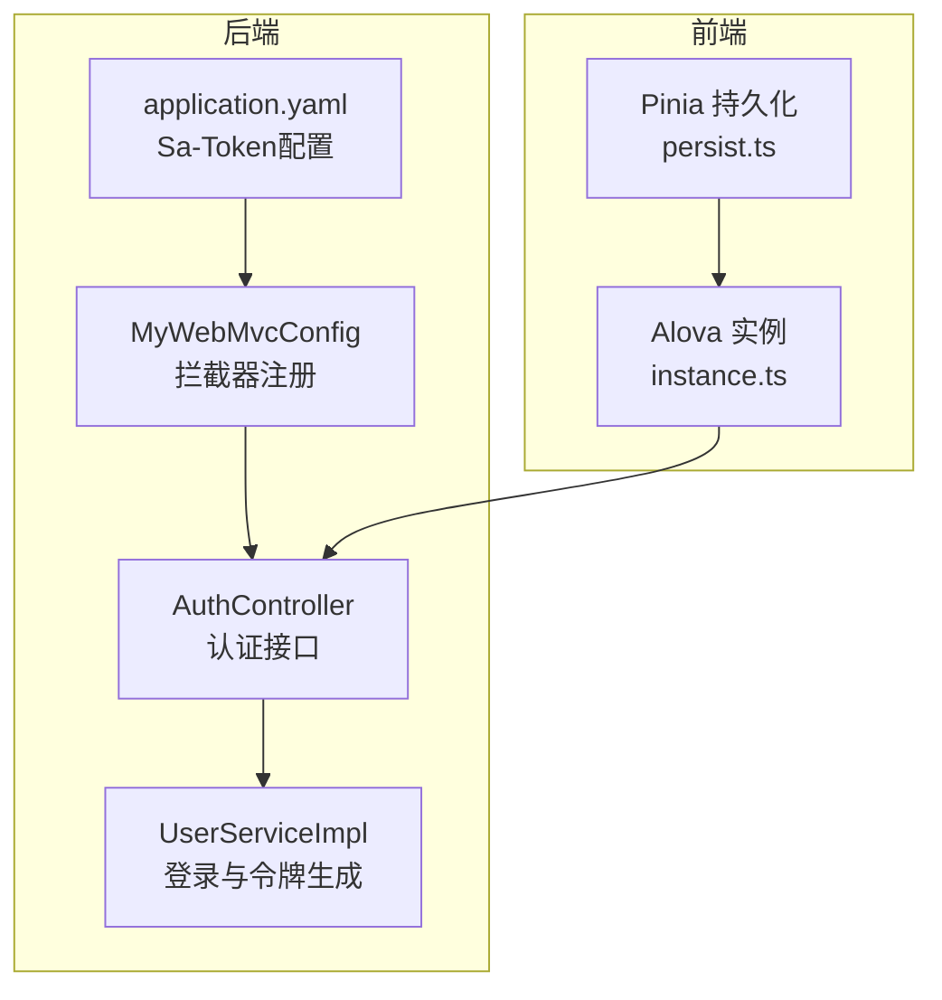
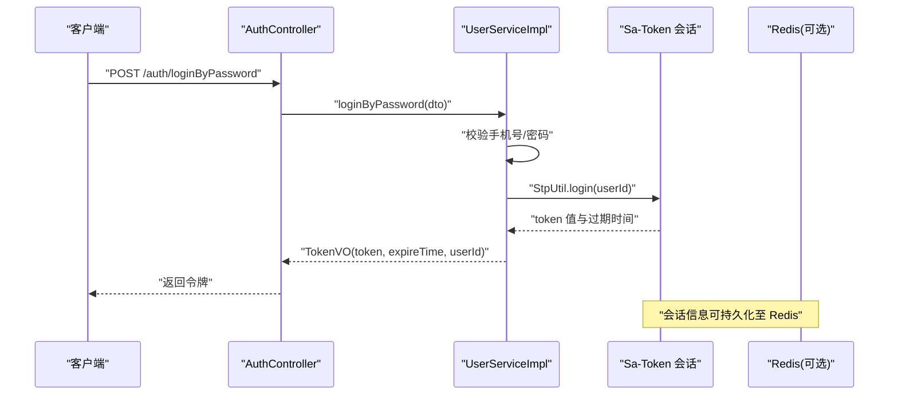
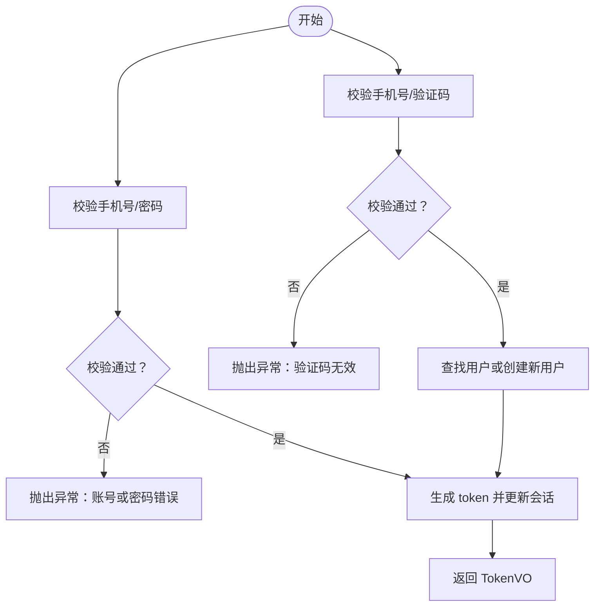
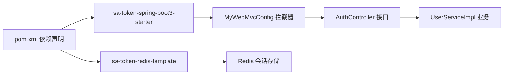

# 认证与授权

<cite>
**本文引用的文件**
- [AuthController.java](file://chuan-bill-server/src/main/java/com/samoy/chuanbillserver/controller/AuthController.java)
- [UserServiceImpl.java](file://chuan-bill-server/src/main/java/com/samoy/chuanbillserver/service/impl/UserServiceImpl.java)
- [MyWebMvcConfig.java](file://chuan-bill-server/src/main/java/com/samoy/chuanbillserver/config/MyWebMvcConfig.java)
- [application.yaml](file://chuan-bill-server/src/main/resources/application.yaml)
- [LoginByPasswordDTO.java](file://chuan-bill-server/src/main/java/com/samoy/chuanbillserver/dto/LoginByPasswordDTO.java)
- [LoginByPhoneDTO.java](file://chuan-bill-server/src/main/java/com/samoy/chuanbillserver/dto/LoginByPhoneDTO.java)
- [SendCodeDTO.java](file://chuan-bill-server/src/main/java/com/samoy/chuanbillserver/dto/SendCodeDTO.java)
- [TokenVO.java](file://chuan-bill-server/src/main/java/com/samoy/chuanbillserver/vo/TokenVO.java)
- [pom.xml](file://chuan-bill-server/pom.xml)
- [instance.ts](file://chuan-bill-app/src/api/core/instance.ts)
- [persist.ts](file://chuan-bill-app/src/store/persist.ts)
</cite>

## 目录
1. [简介](#简介)
2. [项目结构](#项目结构)
3. [核心组件](#核心组件)
4. [架构总览](#架构总览)
5. [详细组件分析](#详细组件分析)
6. [依赖分析](#依赖分析)
7. [性能考虑](#性能考虑)
8. [故障排查指南](#故障排查指南)
9. [结论](#结论)
10. [附录](#附录)

## 简介
本文件面向“小川记账”的认证与授权模块，聚焦于后端基于 Sa-Token 的集成配置与运行机制，以及前后端在令牌发放、校验、存储与刷新方面的协作方式。内容涵盖：
- Sa-Token 集成配置：token 名称、超时、并发控制等参数的含义与影响
- JWT 令牌管理：生成、验证、刷新策略与会话模型
- 权限控制：基于 Sa-Token 的会话拦截与登录态判定
- 用户认证流程：从登录到令牌发放的完整链路
- 最佳实践：安全参数调优、会话安全设置、令牌存储策略
- 常见问题排查与解决方案

## 项目结构
认证与授权相关代码主要分布在后端 Spring Boot 工程与前端 UniApp 应用中：
- 后端
  - 控制层：认证接口入口
  - 业务层：登录逻辑、令牌生成与会话管理
  - 配置层：拦截器注册、Sa-Token 全局配置
  - DTO/VO：请求与响应数据结构
- 前端
  - 请求实例：统一请求配置与拦截
  - 状态持久化：本地存储与 Pinia 持久化插件

图表来源
- [AuthController.java:1-66](file://chuan-bill-server/src/main/java/com/samoy/chuanbillserver/controller/AuthController.java#L1-L66)
- [UserServiceImpl.java:1-192](file://chuan-bill-server/src/main/java/com/samoy/chuanbillserver/service/impl/UserServiceImpl.java#L1-L192)
- [MyWebMvcConfig.java:1-21](file://chuan-bill-server/src/main/java/com/samoy/chuanbillserver/config/MyWebMvcConfig.java#L1-L21)
- [application.yaml:23-31](file://chuan-bill-server/src/main/resources/application.yaml#L23-L31)
- [instance.ts:1-63](file://chuan-bill-app/src/api/core/instance.ts#L1-L63)
- [persist.ts:1-39](file://chuan-bill-app/src/store/persist.ts#L1-L39)

章节来源
- [AuthController.java:1-66](file://chuan-bill-server/src/main/java/com/samoy/chuanbillserver/controller/AuthController.java#L1-L66)
- [UserServiceImpl.java:1-192](file://chuan-bill-server/src/main/java/com/samoy/chuanbillserver/service/impl/UserServiceImpl.java#L1-L192)
- [MyWebMvcConfig.java:1-21](file://chuan-bill-server/src/main/java/com/samoy/chuanbillserver/config/MyWebMvcConfig.java#L1-L21)
- [application.yaml:1-51](file://chuan-bill-server/src/main/resources/application.yaml#L1-L51)
- [instance.ts:1-63](file://chuan-bill-app/src/api/core/instance.ts#L1-L63)
- [persist.ts:1-39](file://chuan-bill-app/src/store/persist.ts#L1-L39)

## 核心组件
- 认证控制器：提供密码登录、手机验证码登录与发送验证码接口
- 用户服务实现：完成登录校验、令牌生成与会话建立
- MVC 拦截器：统一登录态校验，排除认证与文档路径
- Sa-Token 配置：token 名称、超时、并发控制等全局参数
- 数据传输对象：登录请求与验证码发送请求的数据结构
- 响应对象：令牌响应结构，包含 token、过期时间、用户标识等

章节来源
- [AuthController.java:1-66](file://chuan-bill-server/src/main/java/com/samoy/chuanbillserver/controller/AuthController.java#L1-L66)
- [UserServiceImpl.java:40-83](file://chuan-bill-server/src/main/java/com/samoy/chuanbillserver/service/impl/UserServiceImpl.java#L40-L83)
- [MyWebMvcConfig.java:10-20](file://chuan-bill-server/src/main/java/com/samoy/chuanbillserver/config/MyWebMvcConfig.java#L10-L20)
- [application.yaml:23-31](file://chuan-bill-server/src/main/resources/application.yaml#L23-L31)
- [LoginByPasswordDTO.java:1-19](file://chuan-bill-server/src/main/java/com/samoy/chuanbillserver/dto/LoginByPasswordDTO.java#L1-L19)
- [LoginByPhoneDTO.java:1-17](file://chuan-bill-server/src/main/java/com/samoy/chuanbillserver/dto/LoginByPhoneDTO.java#L1-L17)
- [SendCodeDTO.java:1-14](file://chuan-bill-server/src/main/java/com/samoy/chuanbillserver/dto/SendCodeDTO.java#L1-L14)
- [TokenVO.java:1-21](file://chuan-bill-server/src/main/java/com/samoy/chuanbillserver/vo/TokenVO.java#L1-L21)

## 架构总览
后端通过 Sa-Token 在内存/Redis 中维护会话，MVC 拦截器对受保护资源进行统一登录态校验；前端通过 Alova 统一发起请求并在本地持久化用户信息与令牌。

图表来源
- [AuthController.java:35-39](file://chuan-bill-server/src/main/java/com/samoy/chuanbillserver/controller/AuthController.java#L35-L39)
- [UserServiceImpl.java:40-61](file://chuan-bill-server/src/main/java/com/samoy/chuanbillserver/service/impl/UserServiceImpl.java#L40-L61)
- [application.yaml:23-31](file://chuan-bill-server/src/main/resources/application.yaml#L23-L31)

## 详细组件分析

### Sa-Token 集成与配置
- token 名称：通过配置项设置令牌在请求头或 Cookie 中的键名，便于前后端约定传递方式
- 超时配置：token 的有效期，到期后需重新登录或刷新
- 并发控制：多端登录策略、最大会话数限制与互斥登录行为
- 会话模型：基于 StpUtil 的登录态管理，支持会话查询、注销、权限判定等
- Redis 集成：通过 sa-token-redis-template 将会话持久化至 Redis，提升分布式能力

章节来源
- [application.yaml:23-31](file://chuan-bill-server/src/main/resources/application.yaml#L23-L31)
- [pom.xml:62-78](file://chuan-bill-server/pom.xml#L62-L78)
- [UserServiceImpl.java:174-190](file://chuan-bill-server/src/main/java/com/samoy/chuanbillserver/service/impl/UserServiceImpl.java#L174-L190)
- [MyWebMvcConfig.java:12-19](file://chuan-bill-server/src/main/java/com/samoy/chuanbillserver/config/MyWebMvcConfig.java#L12-L19)

### JWT 令牌管理机制
- 生成：登录成功后由 Sa-Token 生成 token 值，并记录会话信息
- 验证：拦截器统一校验登录态，未登录请求被拒绝
- 刷新：当前实现未显式提供刷新接口，建议结合 Sa-Token 的自动续期与会话保持策略

章节来源
- [AuthController.java:35-51](file://chuan-bill-server/src/main/java/com/samoy/chuanbillserver/controller/AuthController.java#L35-L51)
- [UserServiceImpl.java:174-190](file://chuan-bill-server/src/main/java/com/samoy/chuanbillserver/service/impl/UserServiceImpl.java#L174-L190)
- [MyWebMvcConfig.java:12-19](file://chuan-bill-server/src/main/java/com/samoy/chuanbillserver/config/MyWebMvcConfig.java#L12-L19)

### 权限控制策略
- 登录拦截：通过 SaInterceptor 对所有受保护路径进行登录态校验
- 路径排除：认证接口、OpenAPI 文档路径不参与拦截
- 会话管理：基于 StpUtil 的登录、注销、会话查询与权限判定

章节来源
- [MyWebMvcConfig.java:12-19](file://chuan-bill-server/src/main/java/com/samoy/chuanbillserver/config/MyWebMvcConfig.java#L12-L19)

### 用户认证流程
- 密码登录：校验手机号与密码，成功后生成 token 并返回
- 手机验证码登录：校验验证码，若用户不存在则自动注册，再生成 token
- 发送验证码：向指定手机号发送短信验证码

图表来源
- [UserServiceImpl.java:40-83](file://chuan-bill-server/src/main/java/com/samoy/chuanbillserver/service/impl/UserServiceImpl.java#L40-L83)
- [LoginByPasswordDTO.java:12-17](file://chuan-bill-server/src/main/java/com/samoy/chuanbillserver/dto/LoginByPasswordDTO.java#L12-L17)
- [LoginByPhoneDTO.java:11-15](file://chuan-bill-server/src/main/java/com/samoy/chuanbillserver/dto/LoginByPhoneDTO.java#L11-L15)

### 前端令牌存储与请求处理
- Alova 实例：统一设置请求头、内容类型、时间戳防缓存等
- 本地存储：通过 Pinia 持久化插件将状态写入本地存储，便于页面刷新后恢复
- 令牌注入：当前示例在请求前手动注入 token 头部，建议改为从本地存储读取并动态注入

章节来源
- [instance.ts:15-37](file://chuan-bill-app/src/api/core/instance.ts#L15-L37)
- [persist.ts:12-33](file://chuan-bill-app/src/store/persist.ts#L12-L33)

## 依赖分析
后端依赖 Sa-Token 与 RedisTemplate 进行会话管理，Spring MVC 注册 Sa-Token 拦截器以实现统一登录态校验。

图表来源
- [pom.xml:62-78](file://chuan-bill-server/pom.xml#L62-L78)
- [MyWebMvcConfig.java:12-19](file://chuan-bill-server/src/main/java/com/samoy/chuanbillserver/config/MyWebMvcConfig.java#L12-L19)
- [AuthController.java:19-22](file://chuan-bill-server/src/main/java/com/samoy/chuanbillserver/controller/AuthController.java#L19-L22)
- [UserServiceImpl.java:34-35](file://chuan-bill-server/src/main/java/com/samoy/chuanbillserver/service/impl/UserServiceImpl.java#L34-L35)

章节来源
- [pom.xml:62-78](file://chuan-bill-server/pom.xml#L62-L78)
- [MyWebMvcConfig.java:10-20](file://chuan-bill-server/src/main/java/com/samoy/chuanbillserver/config/MyWebMvcConfig.java#L10-L20)
- [AuthController.java:19-22](file://chuan-bill-server/src/main/java/com/samoy/chuanbillserver/controller/AuthController.java#L19-L22)
- [UserServiceImpl.java:34-35](file://chuan-bill-server/src/main/java/com/samoy/chuanbillserver/service/impl/UserServiceImpl.java#L34-L35)

## 性能考虑
- 会话持久化：启用 Redis 可提升多实例部署下的会话共享与一致性
- 并发登录：合理设置最大会话数与互斥登录策略，避免资源争用
- 超时策略：根据业务场景调整 token 有效期与主动超时，平衡安全与体验
- 拦截开销：拦截器对所有受保护路径生效，建议仅覆盖必要范围并避免重复校验

## 故障排查指南
- 登录失败
  - 检查手机号/密码是否符合校验规则
  - 确认用户是否存在且状态正常
  - 查看业务异常枚举对应的错误码
- 令牌无效
  - 确认请求头是否携带正确的 token 键名
  - 核对 token 是否过期或被注销
  - 若启用 Redis，检查会话是否被清理
- 前端无法携带令牌
  - 确认 Alova 实例是否正确注入 token
  - 检查本地存储中是否存在 token
  - 避免硬编码 token，改用动态读取

章节来源
- [UserServiceImpl.java:40-83](file://chuan-bill-server/src/main/java/com/samoy/chuanbillserver/service/impl/UserServiceImpl.java#L40-L83)
- [instance.ts:15-37](file://chuan-bill-app/src/api/core/instance.ts#L15-L37)
- [persist.ts:12-33](file://chuan-bill-app/src/store/persist.ts#L12-L33)

## 结论
本项目采用 Sa-Token 作为认证与会话管理的核心组件，配合拦截器实现统一登录态校验。后端负责登录校验与令牌生成，前端负责请求封装与本地存储。建议后续完善令牌刷新与权限细化策略，持续优化会话超时与并发控制参数，确保系统在安全性与可用性之间取得平衡。

## 附录

### Sa-Token 关键配置项说明
- token 名称：用于标识令牌的键名，前后端需一致
- 超时：token 有效期（秒），到期后需重新登录
- 并发：多端登录策略与最大会话数控制
- 主动超时：会话空闲超时（秒），-1 表示不主动超时
- 会话模型：基于 StpUtil 的登录态管理
- Redis：开启后会话持久化至 Redis，支持分布式

章节来源
- [application.yaml:23-31](file://chuan-bill-server/src/main/resources/application.yaml#L23-L31)