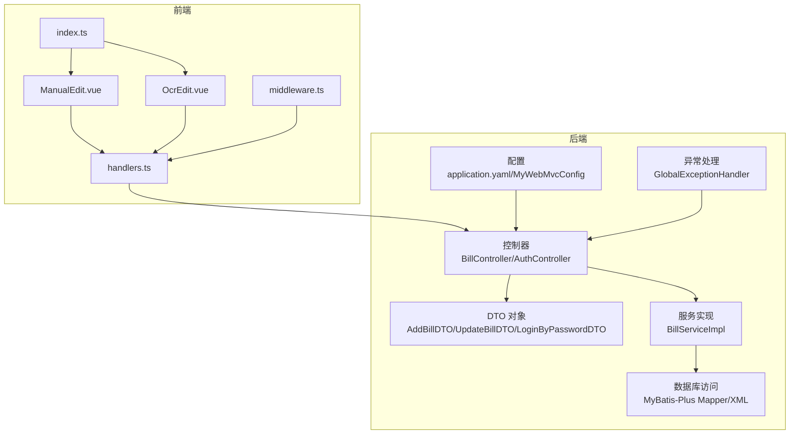
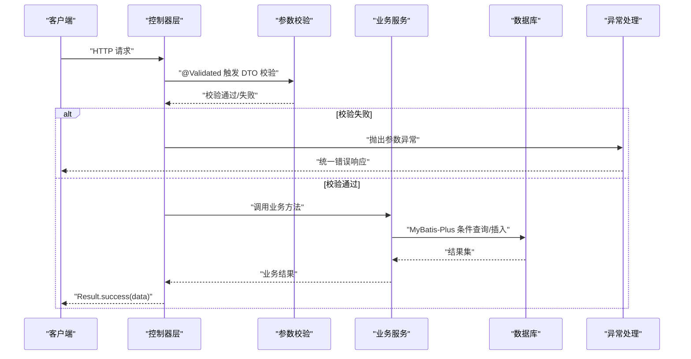
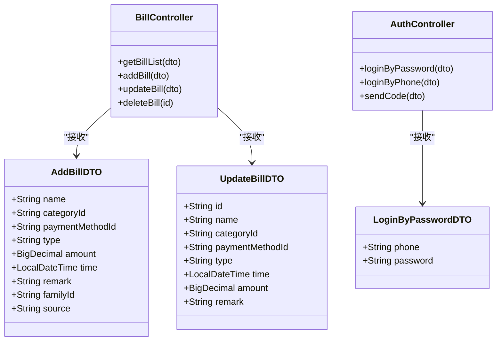
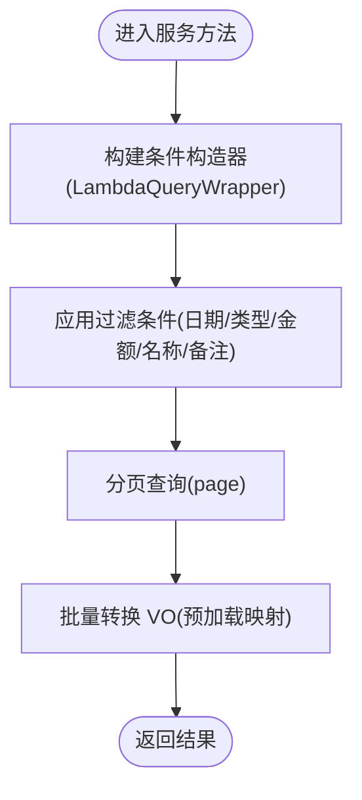
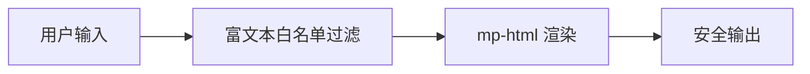
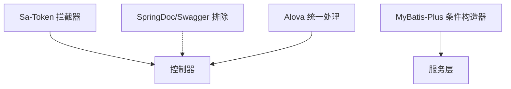

# 输入验证与输出编码

<cite>
**本文引用的文件**
- [AddBillDTO.java](file://chuan-bill-server/src/main/java/com/samoy/chuanbillserver/dto/AddBillDTO.java)
- [UpdateBillDTO.java](file://chuan-bill-server/src/main/java/com/samoy/chuanbillserver/dto/UpdateBillDTO.java)
- [LoginByPasswordDTO.java](file://chuan-bill-server/src/main/java/com/samoy/chuanbillserver/dto/LoginByPasswordDTO.java)
- [BillController.java](file://chuan-bill-server/src/main/java/com/samoy/chuanbillserver/controller/BillController.java)
- [AuthController.java](file://chuan-bill-server/src/main/java/com/samoy/chuanbillserver/controller/AuthController.java)
- [GlobalExceptionHandler.java](file://chuan-bill-server/src/main/java/com/samoy/chuanbillserver/expection/GlobalExceptionHandler.java)
- [Result.java](file://chuan-bill-server/src/main/java/com/samoy/chuanbillserver/result/Result.java)
- [MyWebMvcConfig.java](file://chuan-bill-server/src/main/java/com/samoy/chuanbillserver/config/MyWebMvcConfig.java)
- [application.yaml](file://chuan-bill-server/src/main/resources/application.yaml)
- [BillServiceImpl.java](file://chuan-bill-server/src/main/java/com/samoy/chuanbillserver/service/impl/BillServiceImpl.java)
- [OCRUtil.java](file://chuan-bill-server/src/main/java/com/samoy/chuanbillserver/utils/OCRUtil.java)
- [handlers.ts](file://chuan-bill-app/src/api/core/handlers.ts)
- [middleware.ts](file://chuan-bill-app/src/api/core/middleware.ts)
- [index.ts](file://chuan-bill-app/src/utils/index.ts)
- [ManualEdit.vue](file://chuan-bill-app/src/pages/bill/components/ManualEdit.vue)
- [OcrEdit.vue](file://chuan-bill-app/src/pages/bill/components/OcrEdit.vue)
</cite>

## 目录
1. [简介](#简介)
2. [项目结构](#项目结构)
3. [核心组件](#核心组件)
4. [架构总览](#架构总览)
5. [详细组件分析](#详细组件分析)
6. [依赖分析](#依赖分析)
7. [性能考虑](#性能考虑)
8. [故障排查指南](#故障排查指南)
9. [结论](#结论)
10. [附录](#附录)

## 简介
本文件聚焦“小川记账”的输入验证与输出编码安全实践，覆盖以下方面：
- 参数验证机制：DTO 对象验证、注解驱动验证、自定义验证规则
- SQL 注入防护：预编译语句使用、ORM 框架安全配置、动态 SQL 风险控制
- XSS 攻击防护：HTML 转义、内容安全策略（CSP）、富文本安全处理
- CSRF 防护机制：令牌验证、同源策略、请求来源检查
- 输入输出编码最佳实践：字符编码处理、特殊字符过滤、输出上下文适配
- 常见安全漏洞检测与修复方法

## 项目结构
后端采用 Spring Boot + MyBatis-Plus，前端采用 Vue3 + UniApp（mp-weixin）。安全相关能力主要分布在：
- 后端 DTO 参数校验、控制器层统一校验、全局异常处理、拦截器鉴权
- 前端请求响应处理、加载中间件、工具函数与组件

图表来源
- [BillController.java:1-91](file://chuan-bill-server/src/main/java/com/samoy/chuanbillserver/controller/BillController.java#L1-91)
- [AuthController.java:1-66](file://chuan-bill-server/src/main/java/com/samoy/chuanbillserver/controller/AuthController.java#L1-66)
- [AddBillDTO.java:1-44](file://chuan-bill-server/src/main/java/com/samoy/chuanbillserver/dto/AddBillDTO.java#L1-44)
- [UpdateBillDTO.java:1-39](file://chuan-bill-server/src/main/java/com/samoy/chuanbillserver/dto/UpdateBillDTO.java#L1-39)
- [LoginByPasswordDTO.java:1-19](file://chuan-bill-server/src/main/java/com/samoy/chuanbillserver/dto/LoginByPasswordDTO.java#L1-19)
- [BillServiceImpl.java:1-244](file://chuan-bill-server/src/main/java/com/samoy/chuanbillserver/service/impl/BillServiceImpl.java#L1-244)
- [MyWebMvcConfig.java:1-21](file://chuan-bill-server/src/main/java/com/samoy/chuanbillserver/config/MyWebMvcConfig.java#L1-21)
- [application.yaml:1-51](file://chuan-bill-server/src/main/resources/application.yaml#L1-51)
- [GlobalExceptionHandler.java:1-50](file://chuan-bill-server/src/main/java/com/samoy/chuanbillserver/expection/GlobalExceptionHandler.java#L1-50)
- [handlers.ts:1-105](file://chuan-bill-app/src/api/core/handlers.ts#L1-105)
- [middleware.ts:1-93](file://chuan-bill-app/src/api/core/middleware.ts#L1-93)
- [index.ts:1-79](file://chuan-bill-app/src/utils/index.ts#L1-79)
- [ManualEdit.vue:1-174](file://chuan-bill-app/src/pages/bill/components/ManualEdit.vue#L1-174)
- [OcrEdit.vue:1-167](file://chuan-bill-app/src/pages/bill/components/OcrEdit.vue#L1-167)

章节来源
- [BillController.java:1-91](file://chuan-bill-server/src/main/java/com/samoy/chuanbillserver/controller/BillController.java#L1-91)
- [AuthController.java:1-66](file://chuan-bill-server/src/main/java/com/samoy/chuanbillserver/controller/AuthController.java#L1-66)
- [application.yaml:1-51](file://chuan-bill-server/src/main/resources/application.yaml#L1-51)

## 核心组件
- DTO 参数验证：通过 Jakarta Bean Validation 注解对请求参数进行强约束，涵盖必填、长度、格式、数值范围等
- 控制器统一校验：在控制器方法上使用 @Validated，确保进入业务逻辑前完成参数校验
- 全局异常处理：集中捕获未登录、业务异常与其他系统异常，统一封装响应
- 拦截器鉴权：基于 Sa-Token 的全局拦截器，保护受保护资源
- ORM 安全：MyBatis-Plus 使用条件构造器与分页插件，避免原生拼接 SQL
- 前端请求处理：统一响应处理与错误处理，结合加载中间件优化用户体验

章节来源
- [AddBillDTO.java:14-42](file://chuan-bill-server/src/main/java/com/samoy/chuanbillserver/dto/AddBillDTO.java#L14-L42)
- [UpdateBillDTO.java:13-37](file://chuan-bill-server/src/main/java/com/samoy/chuanbillserver/dto/UpdateBillDTO.java#L13-L37)
- [LoginByPasswordDTO.java:13-17](file://chuan-bill-server/src/main/java/com/samoy/chuanbillserver/dto/LoginByPasswordDTO.java#L13-L17)
- [BillController.java:39-63](file://chuan-bill-server/src/main/java/com/samoy/chuanbillserver/controller/BillController.java#L39-L63)
- [GlobalExceptionHandler.java:20-48](file://chuan-bill-server/src/main/java/com/samoy/chuanbillserver/expection/GlobalExceptionHandler.java#L20-L48)
- [MyWebMvcConfig.java:12-19](file://chuan-bill-server/src/main/java/com/samoy/chuanbillserver/config/MyWebMvcConfig.java#L12-L19)
- [BillServiceImpl.java:51-88](file://chuan-bill-server/src/main/java/com/samoy/chuanbillserver/service/impl/BillServiceImpl.java#L51-L88)

## 架构总览
后端安全控制链路如下：
- 请求进入控制器 → 参数 DTO 校验 → 业务服务执行 → 数据持久化 → 统一响应封装
- 异常处理贯穿整个链路，保证错误信息不泄露敏感细节
- 前端通过 Alova 统一处理响应与错误，结合加载中间件提升交互体验

图表来源
- [BillController.java:39-63](file://chuan-bill-server/src/main/java/com/samoy/chuanbillserver/controller/BillController.java#L39-L63)
- [AddBillDTO.java:14-42](file://chuan-bill-server/src/main/java/com/samoy/chuanbillserver/dto/AddBillDTO.java#L14-L42)
- [UpdateBillDTO.java:13-37](file://chuan-bill-server/src/main/java/com/samoy/chuanbillserver/dto/UpdateBillDTO.java#L13-L37)
- [BillServiceImpl.java:126-141](file://chuan-bill-server/src/main/java/com/samoy/chuanbillserver/service/impl/BillServiceImpl.java#L126-L141)
- [GlobalExceptionHandler.java:32-36](file://chuan-bill-server/src/main/java/com/samoy/chuanbillserver/expection/GlobalExceptionHandler.java#L32-L36)

## 详细组件分析

### DTO 参数验证与注解驱动验证
- 必填与长度：使用 @NotBlank、@Size 对字符串字段进行非空与长度限制
- 数值范围与格式：使用 @DecimalMin、@Digits、@Pattern 对金额、类型枚举、手机号等进行约束
- 时间格式：使用 @JsonFormat 指定时间序列化格式，避免解析歧义
- 控制器集成：在控制器方法参数上使用 @Validated，确保进入业务逻辑前完成校验

图表来源
- [AddBillDTO.java:14-42](file://chuan-bill-server/src/main/java/com/samoy/chuanbillserver/dto/AddBillDTO.java#L14-L42)
- [UpdateBillDTO.java:13-37](file://chuan-bill-server/src/main/java/com/samoy/chuanbillserver/dto/UpdateBillDTO.java#L13-L37)
- [LoginByPasswordDTO.java:13-17](file://chuan-bill-server/src/main/java/com/samoy/chuanbillserver/dto/LoginByPasswordDTO.java#L13-L17)
- [BillController.java:39-63](file://chuan-bill-server/src/main/java/com/samoy/chuanbillserver/controller/BillController.java#L39-L63)
- [AuthController.java:37-50](file://chuan-bill-server/src/main/java/com/samoy/chuanbillserver/controller/AuthController.java#L37-L50)

章节来源
- [AddBillDTO.java:14-42](file://chuan-bill-server/src/main/java/com/samoy/chuanbillserver/dto/AddBillDTO.java#L14-L42)
- [UpdateBillDTO.java:25-33](file://chuan-bill-server/src/main/java/com/samoy/chuanbillserver/dto/UpdateBillDTO.java#L25-L33)
- [LoginByPasswordDTO.java:13-17](file://chuan-bill-server/src/main/java/com/samoy/chuanbillserver/dto/LoginByPasswordDTO.java#L13-L17)
- [BillController.java:39-63](file://chuan-bill-server/src/main/java/com/samoy/chuanbillserver/controller/BillController.java#L39-L63)
- [AuthController.java:37-50](file://chuan-bill-server/src/main/java/com/samoy/chuanbillserver/controller/AuthController.java#L37-L50)

### SQL 注入防护与 ORM 安全配置
- 预编译与条件构造器：服务层使用 LambdaQueryWrapper 构造查询条件，避免字符串拼接
- 分页与排序：使用 MyBatis-Plus 分页插件与排序，确保边界可控
- 动态 SQL 风险控制：未发现直接拼接 SQL 的实现；若后续扩展需严格限制可变片段
- 配置项：MyBatis-Plus 日志与逻辑删除配置，便于审计与安全排查

图表来源
- [BillServiceImpl.java:51-88](file://chuan-bill-server/src/main/java/com/samoy/chuanbillserver/service/impl/BillServiceImpl.java#L51-L88)
- [BillServiceImpl.java:221-242](file://chuan-bill-server/src/main/java/com/samoy/chuanbillserver/service/impl/BillServiceImpl.java#L221-L242)

章节来源
- [BillServiceImpl.java:51-88](file://chuan-bill-server/src/main/java/com/samoy/chuanbillserver/service/impl/BillServiceImpl.java#L51-L88)
- [application.yaml:32-39](file://chuan-bill-server/src/main/resources/application.yaml#L32-L39)

### XSS 攻击防护
- HTML 转义：后端返回的纯文本字段未见显式转义处理，建议在渲染层对不可信内容进行上下文适配的转义
- 内容安全策略（CSP）：未在后端配置 CSP 头，建议在网关或服务器层增加 CSP 策略头
- 富文本安全处理：前端使用 mp-html 组件渲染富文本，建议对富文本输入进行白名单过滤与标签清理

图表来源
- [OcrEdit.vue:1-167](file://chuan-bill-app/src/pages/bill/components/OcrEdit.vue#L1-L167)
- [application.yaml:1-51](file://chuan-bill-server/src/main/resources/application.yaml#L1-L51)

章节来源
- [OcrEdit.vue:1-167](file://chuan-bill-app/src/pages/bill/components/OcrEdit.vue#L1-L167)
- [application.yaml:1-51](file://chuan-bill-server/src/main/resources/application.yaml#L1-L51)

### CSRF 防护机制
- 令牌验证：后端未启用 CSRF 令牌校验，建议引入 Spring Security CSRF 或 Sa-Token CSRF 扩展
- 同源策略：前端通过 Alova 统一处理跨域与来源检查，建议在后端增加 Origin 校验
- 请求来源检查：建议在网关或拦截器中增加 Referer/Origin 校验，防止跨站请求伪造

章节来源
- [MyWebMvcConfig.java:12-19](file://chuan-bill-server/src/main/java/com/samoy/chuanbillserver/config/MyWebMvcConfig.java#L12-L19)
- [handlers.ts:42-51](file://chuan-bill-app/src/api/core/handlers.ts#L42-L51)

### 输入输出编码最佳实践
- 字符编码处理：数据库连接使用 UTF-8，确保前后端一致
- 特殊字符过滤：富文本输入建议采用白名单过滤；普通文本输入建议长度与格式约束
- 输出上下文适配：HTML 输出应进行上下文适配的转义；JSON 输出由框架自动处理

章节来源
- [application.yaml:6-6](file://chuan-bill-server/src/main/resources/application.yaml#L6-L6)
- [index.ts:23-78](file://chuan-bill-app/src/utils/index.ts#L23-L78)

### 常见安全漏洞检测与修复
- 参数注入：通过 DTO 注解与 @Validated 严格限制输入范围，避免越界与格式错误
- 未授权访问：全局拦截器强制登录校验，受保护路径不放行未登录请求
- 业务异常：统一异常处理返回业务码与消息，避免泄露内部错误细节
- 前端错误处理：Alova 统一错误处理与加载中间件，提升用户体验并减少误操作

章节来源
- [GlobalExceptionHandler.java:20-48](file://chuan-bill-server/src/main/java/com/samoy/chuanbillserver/expection/GlobalExceptionHandler.java#L20-L48)
- [handlers.ts:34-104](file://chuan-bill-app/src/api/core/handlers.ts#L34-L104)
- [middleware.ts:49-93](file://chuan-bill-app/src/api/core/middleware.ts#L49-L93)

## 依赖分析
后端安全相关依赖与配置：
- Sa-Token：全局拦截器与登录校验
- SpringDoc/Swagger：接口文档，排除在鉴权之外
- MyBatis-Plus：条件构造器与分页插件
- Alova（前端）：统一请求与响应处理

图表来源
- [MyWebMvcConfig.java:12-19](file://chuan-bill-server/src/main/java/com/samoy/chuanbillserver/config/MyWebMvcConfig.java#L12-L19)
- [application.yaml:41-47](file://chuan-bill-server/src/main/resources/application.yaml#L41-L47)
- [BillServiceImpl.java:51-88](file://chuan-bill-server/src/main/java/com/samoy/chuanbillserver/service/impl/BillServiceImpl.java#L51-L88)
- [handlers.ts:34-68](file://chuan-bill-app/src/api/core/handlers.ts#L34-L68)

章节来源
- [MyWebMvcConfig.java:12-19](file://chuan-bill-server/src/main/java/com/samoy/chuanbillserver/config/MyWebMvcConfig.java#L12-L19)
- [application.yaml:41-47](file://chuan-bill-server/src/main/resources/application.yaml#L41-L47)

## 性能考虑
- DTO 校验前置：减少无效请求进入业务层，降低数据库压力
- 批量预加载：服务层对分类与支付方式进行批量查询，避免 N+1 查询
- 分页与排序：合理设置分页大小与排序字段，避免大结果集扫描
- 前端加载中间件：延迟显示加载状态，减少频繁闪烁与重复请求

章节来源
- [BillServiceImpl.java:90-122](file://chuan-bill-server/src/main/java/com/samoy/chuanbillserver/service/impl/BillServiceImpl.java#L90-L122)
- [middleware.ts:7-22](file://chuan-bill-app/src/api/core/middleware.ts#L7-L22)

## 故障排查指南
- 401/403 未登录：前端统一跳转登录页并提示“登录已过期”，检查令牌有效性与过期时间
- 参数校验失败：查看 DTO 注解提示信息，确认请求体字段是否符合约束
- 业务异常：根据 ResultEnum 返回码定位具体业务错误，检查权限与数据存在性
- 数据库连接：确认字符集与时区配置，避免乱码与时间偏差

章节来源
- [handlers.ts:42-51](file://chuan-bill-app/src/api/core/handlers.ts#L42-L51)
- [GlobalExceptionHandler.java:20-36](file://chuan-bill-server/src/main/java/com/samoy/chuanbillserver/expection/GlobalExceptionHandler.java#L20-L36)
- [application.yaml:6-6](file://chuan-bill-server/src/main/resources/application.yaml#L6-L6)

## 结论
本项目在输入验证与输出编码方面具备较为完善的基础设施：
- 后端通过 DTO 注解与 @Validated 实现强约束参数校验
- 全局拦截器与异常处理保障了访问控制与错误信息统一
- ORM 层使用条件构造器与分页插件，有效降低 SQL 注入风险
- 前端通过 Alova 统一处理响应与错误，提升交互体验

建议进一步强化：
- 前端富文本白名单过滤与 HTML 上下文转义
- 后端 CSP 头配置与 CSRF 令牌校验
- 网关层 Origin/Referer 校验与请求来源检查

## 附录
- 前端组件与工具函数路径参考：
  - [ManualEdit.vue:1-174](file://chuan-bill-app/src/pages/bill/components/ManualEdit.vue#L1-L174)
  - [OcrEdit.vue:1-167](file://chuan-bill-app/src/pages/bill/components/OcrEdit.vue#L1-L167)
  - [handlers.ts:1-105](file://chuan-bill-app/src/api/core/handlers.ts#L1-105)
  - [middleware.ts:1-93](file://chuan-bill-app/src/api/core/middleware.ts#L1-93)
  - [index.ts:1-79](file://chuan-bill-app/src/utils/index.ts#L1-79)