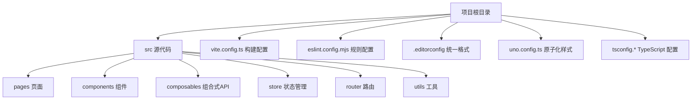
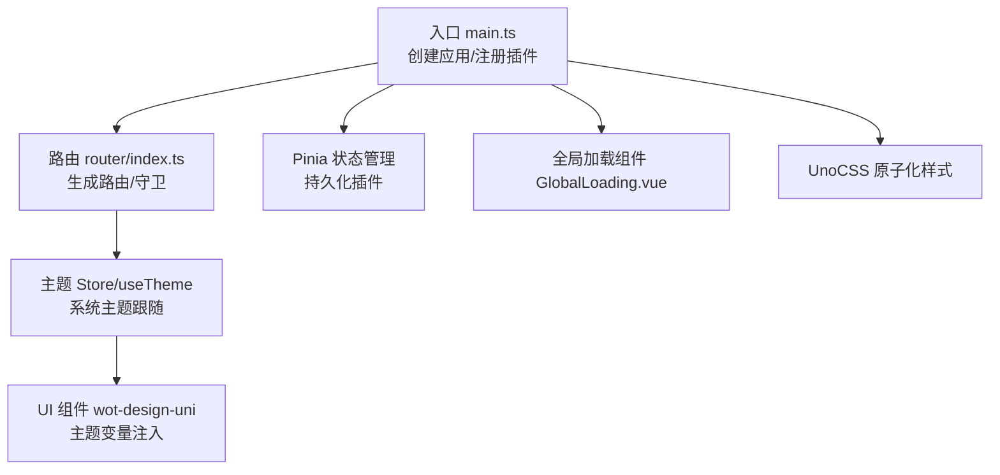
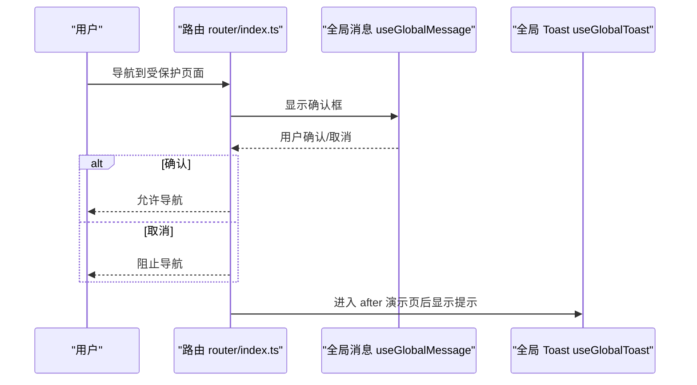
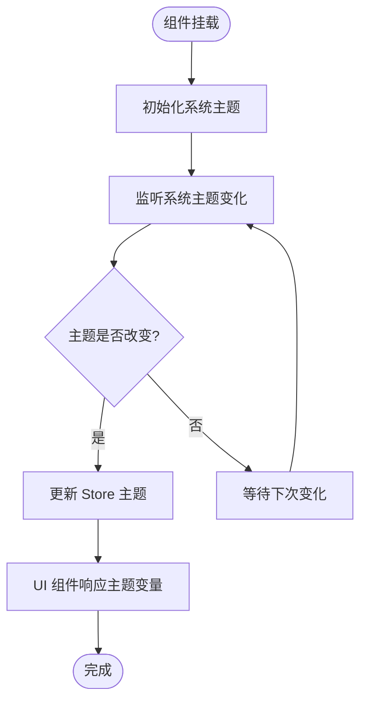
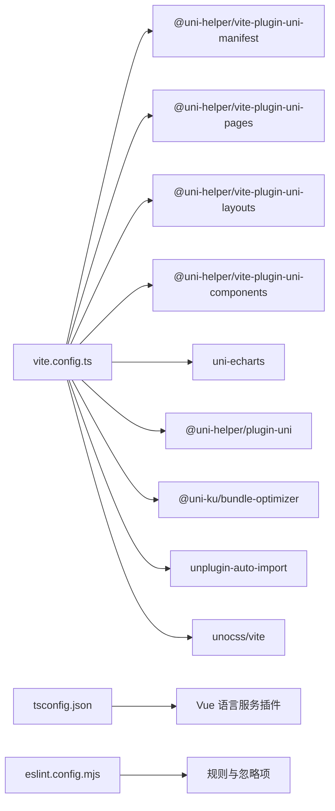

# 代码规范

<cite>
**本文引用的文件**
- [.editorconfig](file://chuan-bill-app/.editorconfig)
- [eslint.config.mjs](file://chuan-bill-app/eslint.config.mjs)
- [package.json](file://chuan-bill-app/package.json)
- [vite.config.ts](file://chuan-bill-app/vite.config.ts)
- [uno.config.ts](file://chuan-bill-app/uno.config.ts)
- [tsconfig.base.json](file://chuan-bill-app/tsconfig.base.json)
- [tsconfig.json](file://chuan-bill-app/tsconfig.json)
- [src/main.ts](file://chuan-bill-app/src/main.ts)
- [src/App.vue](file://chuan-bill-app/src/App.vue)
- [src/router/index.ts](file://chuan-bill-app/src/router/index.ts)
- [src/store/themeStore.ts](file://chuan-bill-app/src/store/themeStore.ts)
- [src/composables/useTheme.ts](file://chuan-bill-app/src/composables/useTheme.ts)
- [src/components/GlobalLoading.vue](file://chuan-bill-app/src/components/GlobalLoading.vue)
- [src/composables/types/theme.ts](file://chuan-bill-app/src/composables/types/theme.ts)
- [src/auto-imports.d.ts](file://chuan-bill-app/src/auto-imports.d.ts)
- [src/components.d.ts](file://chuan-bill-app/src/components.d.ts)
- [src/env.d.ts](file://chuan-bill-app/src/env.d.ts)
- [src/shims.d.ts](file://chuan-bill-app/src/shims.d.ts)
</cite>

## 目录
1. [简介](#简介)
2. [项目结构](#项目结构)
3. [核心组件](#核心组件)
4. [架构总览](#架构总览)
5. [详细组件分析](#详细组件分析)
6. [依赖分析](#依赖分析)
7. [性能考虑](#性能考虑)
8. [故障排查指南](#故障排查指南)
9. [结论](#结论)
10. [附录](#附录)

## 简介
本文件为“小川记账”项目的代码规范文档，面向前端与全栈开发者，系统性地给出 JavaScript/TypeScript 编码规范、Vue 组件开发规范、CSS/SCSS 样式规范、ESLint 规则、EditorConfig 统一配置、TypeScript 类型定义与自动导入配置、组件类型声明规范，并辅以流程图与时序图帮助理解与落地执行。

## 项目结构
本项目采用 uni-app + Vue 3 + TypeScript + Vite 的技术栈，结合 Pinia 状态管理、UnoCSS 原子化样式、自动导入与组件解析插件，形成统一的工程化规范。关键目录与职责概览：
- src：源代码根目录，包含页面、组件、路由、状态、工具等
- vite.config.ts：构建与开发服务器配置，含自动导入、组件解析、UnoCSS、打包优化等插件
- eslint.config.mjs：基于 @uni-helper/eslint-config 的 ESLint 配置，含规则覆盖与忽略项
- .editorconfig：统一编辑器缩进、换行、字符集等基础格式
- uno.config.ts：UnoCSS 配置，含 presetUni、图标预设与转换器
- tsconfig.*：TypeScript 基础与编译选项，含路径别名、类型声明、Vue 语言服务插件

图表来源
- [vite.config.ts:17-80](file://chuan-bill-app/vite.config.ts#L17-L80)
- [eslint.config.mjs:1-18](file://chuan-bill-app/eslint.config.mjs#L1-L18)
- [.editorconfig:1-10](file://chuan-bill-app/.editorconfig#L1-L10)
- [uno.config.ts:10-38](file://chuan-bill-app/uno.config.ts#L10-L38)
- [tsconfig.json:19-29](file://chuan-bill-app/tsconfig.json#L19-L29)

章节来源
- [vite.config.ts:17-80](file://chuan-bill-app/vite.config.ts#L17-L80)
- [eslint.config.mjs:1-18](file://chuan-bill-app/eslint.config.mjs#L1-L18)
- [.editorconfig:1-10](file://chuan-bill-app/.editorconfig#L1-L10)
- [uno.config.ts:10-38](file://chuan-bill-app/uno.config.ts#L10-L38)
- [tsconfig.json:19-29](file://chuan-bill-app/tsconfig.json#L19-L29)

## 核心组件
- 应用入口与全局注入：在应用入口中创建 SSR App、注册路由与 Pinia，并启用 UnoCSS。
- 路由系统：基于虚拟页面生成路由表，提供全局导航守卫与后置钩子，便于统一日志与提示。
- 主题系统：通过 Store 与组合式 API 实现系统主题跟随与变更监听，提供主题变量供 UI 组件使用。
- 全局加载组件：封装 Toast 组件，适配不同平台差异，实现全局加载状态管理。

章节来源
- [src/main.ts:1-16](file://chuan-bill-app/src/main.ts#L1-L16)
- [src/router/index.ts:1-80](file://chuan-bill-app/src/router/index.ts#L1-L80)
- [src/store/themeStore.ts:1-75](file://chuan-bill-app/src/store/themeStore.ts#L1-L75)
- [src/composables/useTheme.ts:1-71](file://chuan-bill-app/src/composables/useTheme.ts#L1-L71)
- [src/components/GlobalLoading.vue:1-47](file://chuan-bill-app/src/components/GlobalLoading.vue#L1-L47)

## 架构总览
下图展示从入口到页面渲染、路由守卫、主题系统与全局组件的整体交互关系。

图表来源
- [src/main.ts:1-16](file://chuan-bill-app/src/main.ts#L1-L16)
- [src/router/index.ts:1-80](file://chuan-bill-app/src/router/index.ts#L1-L80)
- [src/store/themeStore.ts:1-75](file://chuan-bill-app/src/store/themeStore.ts#L1-L75)
- [src/composables/useTheme.ts:1-71](file://chuan-bill-app/src/composables/useTheme.ts#L1-L71)
- [src/components/GlobalLoading.vue:1-47](file://chuan-bill-app/src/components/GlobalLoading.vue#L1-L47)
- [uno.config.ts:10-38](file://chuan-bill-app/uno.config.ts#L10-L38)

## 详细组件分析

### JavaScript/TypeScript 编码规范
- 命名约定
  - 变量与函数：采用小驼峰命名；常量使用大写下划线或全大写（根据上下文语义）。
  - 类型与接口：首字母大写，如 ThemeMode、ThemeState；枚举值使用全大写。
  - 文件与模块：模块名使用小写短横线分隔，如 theme-store.ts；导出统一使用命名导出。
- 函数定义规范
  - 优先使用箭头函数表达简洁逻辑；复杂函数建议拆分为多个职责单一的小函数。
  - 异步函数明确返回 Promise 类型；避免在同步函数中混用异步操作。
  - 参数顺序：必填参数在前，可选参数在后；对象参数建议使用解构并提供默认值。
- 类与接口设计
  - 接口用于描述对象形状，尽量保持只读与最小必要字段；避免在接口中定义方法。
  - 类用于封装状态与行为，优先使用组合式 API（如 useXxx）替代类。
- 错误处理
  - 使用 try/catch 或 Promise.catch 处理异步错误；对外暴露统一错误信息。
  - 对于可预期的业务异常，抛出自定义错误类型或返回 Result 结构。
- 代码组织
  - 将公共逻辑抽取为独立函数或组合式 API；避免重复代码。
  - 使用类型断言需谨慎，优先通过类型推导与严格模式减少断言使用。

章节来源
- [src/composables/types/theme.ts:1-47](file://chuan-bill-app/src/composables/types/theme.ts#L1-L47)
- [src/store/themeStore.ts:1-75](file://chuan-bill-app/src/store/themeStore.ts#L1-L75)
- [src/composables/useTheme.ts:1-71](file://chuan-bill-app/src/composables/useTheme.ts#L1-L71)

### Vue 组件开发规范
- 组件命名
  - 文件名采用帕斯卡命名，如 GlobalLoading.vue；导出组件名称与文件名一致。
  - 全局组件注册：通过 vite 插件自动生成类型声明，避免手写重复声明。
- props 定义
  - 明确 props 类型与默认值；对可选属性提供合理默认值。
  - 避免在 props 中直接修改外部状态，应通过事件向上反馈。
- 事件处理
  - 使用 emits 明确声明向外派发的事件；事件命名采用 kebab-case。
  - 在模板中绑定事件时，使用小括号语法；避免在模板中直接调用副作用函数。
- 生命周期管理
  - 在 onBeforeMount/onMounted 中进行初始化与订阅；在 onUnmounted 中清理订阅与定时器。
  - 对于平台特定逻辑（如微信小程序），使用条件编译块包裹，避免在非目标平台执行。
- 模板与样式
  - 使用 scoped 或原子化样式（UnoCSS）隔离样式；避免深层选择器。
  - 在 App.vue 中集中定义全局样式与主题背景，按暗色主题类名切换。

章节来源
- [src/components/GlobalLoading.vue:1-47](file://chuan-bill-app/src/components/GlobalLoading.vue#L1-L47)
- [src/App.vue:1-16](file://chuan-bill-app/src/App.vue#L1-L16)
- [src/components.d.ts:8-39](file://chuan-bill-app/src/components.d.ts#L8-L39)

### CSS/SCSS 样式规范
- 命名规范
  - 使用 BEM 或语义化命名；避免使用 id 选择器；类名使用短横线分隔。
  - 主题相关样式通过 wot-design-uni 的主题变量注入，避免硬编码颜色。
- 层级结构
  - 全局样式集中在 App.vue 或 UnoCSS 预设中；页面内样式局部作用域化。
  - 使用原子化类名（UnoCSS）提升复用性与一致性。
- 响应式设计
  - 使用媒体查询或 UnoCSS 断点工具；移动端优先，避免过度依赖固定像素。
  - 通过 CSS 变量与主题系统动态适配深浅色模式。

章节来源
- [src/App.vue:5-15](file://chuan-bill-app/src/App.vue#L5-L15)
- [uno.config.ts:32-37](file://chuan-bill-app/uno.config.ts#L32-L37)

### ESLint 配置规则
- 规则来源
  - 基于 @uni-helper/eslint-config，扩展 UnoCSS 支持与自定义规则覆盖。
- 关键规则
  - 关闭 no-console：允许在开发阶段输出调试信息。
  - 忽略无限制制注释警告：在特定场景下可临时放宽规则限制。
- 忽略范围
  - 忽略 uni_modules 内部依赖、文档站点构建产物、Markdown 文件。
- 执行方式
  - 提供 lint 与 lint:fix 脚本，配合 lint-staged 在提交时自动修复。

章节来源
- [eslint.config.mjs:1-18](file://chuan-bill-app/eslint.config.mjs#L1-L18)
- [package.json:53-54](file://chuan-bill-app/package.json#L53-L54)
- [package.json:131-133](file://chuan-bill-app/package.json#L131-L133)

### EditorConfig 统一配置
- 统一规则
  - 字符集：UTF-8
  - 缩进：空格，大小为 2
  - 行结束符：LF
  - 末尾插入换行：开启
  - 去除行尾空白：开启
- 作用范围
  - 适用于所有文件（[*]）

章节来源
- [.editorconfig:1-10](file://chuan-bill-app/.editorconfig#L1-L10)

### TypeScript 类型定义最佳实践
- 严格模式
  - 启用 strict、skipLibCheck，提升类型安全与编译性能。
  - 使用 @vue/tsconfig 基础配置，确保与 Vue 生态兼容。
- 路径别名与类型声明
  - 配置 baseUrl 与 paths，使用 @/* 作为别名。
  - 在 tsconfig.json 中声明 types 与 Vue 语言服务插件，增强 Volar 类型体验。
- 类型声明文件
  - auto-imports.d.ts：由 unplugin-auto-import 自动生成，无需手写。
  - components.d.ts：由 vite-plugin-uni-components 自动生成，统一全局组件类型。
  - env.d.ts 与 shims.d.ts：补充环境与 Vue 扩展类型。

章节来源
- [tsconfig.base.json:1-11](file://chuan-bill-app/tsconfig.base.json#L1-L11)
- [tsconfig.json:3-18](file://chuan-bill-app/tsconfig.json#L3-L18)
- [tsconfig.json:19-29](file://chuan-bill-app/tsconfig.json#L19-L29)
- [src/auto-imports.d.ts:1-702](file://chuan-bill-app/src/auto-imports.d.ts#L1-L702)
- [src/components.d.ts:1-39](file://chuan-bill-app/src/components.d.ts#L1-L39)
- [src/env.d.ts:1-2](file://chuan-bill-app/src/env.d.ts#L1-L2)
- [src/shims.d.ts:1-7](file://chuan-bill-app/src/shims.d.ts#L1-L7)

### 自动导入与组件类型声明
- 自动导入
  - 通过 AutoImport 插件自动导入 Vue、@vueuse/core、Pinia、uni-app、wot-design-uni、alova 等常用 API。
  - 支持从指定目录扫描 composable、store、utils、api，模板中亦可直接使用。
- 组件类型声明
  - 通过 UniComponents 插件解析 wot-design-uni 与业务组件，生成 components.d.ts。
  - 支持目录作为命名空间，提升组件引用的一致性。

章节来源
- [vite.config.ts:51-65](file://chuan-bill-app/vite.config.ts#L51-L65)
- [vite.config.ts:33-38](file://chuan-bill-app/vite.config.ts#L33-L38)
- [src/auto-imports.d.ts:1-702](file://chuan-bill-app/src/auto-imports.d.ts#L1-L702)
- [src/components.d.ts:1-39](file://chuan-bill-app/src/components.d.ts#L1-L39)

### 路由与导航守卫流程

图表来源
- [src/router/index.ts:24-77](file://chuan-bill-app/src/router/index.ts#L24-L77)

章节来源
- [src/router/index.ts:1-80](file://chuan-bill-app/src/router/index.ts#L1-L80)

### 主题系统工作流

图表来源
- [src/composables/useTheme.ts:43-62](file://chuan-bill-app/src/composables/useTheme.ts#L43-L62)
- [src/store/themeStore.ts:68-72](file://chuan-bill-app/src/store/themeStore.ts#L68-L72)

章节来源
- [src/composables/useTheme.ts:1-71](file://chuan-bill-app/src/composables/useTheme.ts#L1-L71)
- [src/store/themeStore.ts:1-75](file://chuan-bill-app/src/store/themeStore.ts#L1-L75)

## 依赖分析
- 构建与开发
  - Vite 插件链：uni-manifest、uni-pages、uni-layouts、uni-components、uni-echarts、uni、bundle-optimizer、AutoImport、UnoCSS。
- 类型与语言服务
  - @uni-helper/uni-types 与 Vue 语言服务插件，提升 Volar 类型体验。
- 质量保障
  - @uni-helper/eslint-config 与 UnoCSS ESLint 规则，结合 lint-staged 提交前修复。

图表来源
- [vite.config.ts:22-69](file://chuan-bill-app/vite.config.ts#L22-L69)
- [tsconfig.json:19-21](file://chuan-bill-app/tsconfig.json#L19-L21)
- [eslint.config.mjs:1-18](file://chuan-bill-app/eslint.config.mjs#L1-L18)

章节来源
- [vite.config.ts:17-80](file://chuan-bill-app/vite.config.ts#L17-L80)
- [tsconfig.json:19-29](file://chuan-bill-app/tsconfig.json#L19-L29)
- [eslint.config.mjs:1-18](file://chuan-bill-app/eslint.config.mjs#L1-L18)

## 性能考虑
- 依赖预优化
  - 开发环境下排除 wot-design-uni、uni-echarts 依赖，减少首次启动时间。
- 平台优化
  - 在微信小程序平台启用 bundle-optimizer，降低包体体积。
- 样式与资源
  - 使用 UnoCSS 原子化类名，减少重复样式与体积；按需引入图标集合。
- 状态管理
  - Pinia Store 使用持久化插件，避免频繁重算与重复请求。

章节来源
- [vite.config.ts:19-21](file://chuan-bill-app/vite.config.ts#L19-L21)
- [vite.config.ts:46-49](file://chuan-bill-app/vite.config.ts#L46-L49)
- [uno.config.ts:10-38](file://chuan-bill-app/uno.config.ts#L10-L38)
- [src/main.ts:6-8](file://chuan-bill-app/src/main.ts#L6-L8)

## 故障排查指南
- ESLint 报错
  - 若出现规则冲突，检查 eslint.config.mjs 的 rules 与 ignores；必要时在文件顶部添加注释禁用单行规则。
  - 使用 npm run lint:fix 或在提交前执行 lint-staged。
- 类型错误
  - 确保 tsconfig.json 的 Vue 语言服务插件已启用；若组件类型缺失，检查 vite.config.ts 的 uni-components 插件与 components.d.ts 是否生成。
- 主题不生效
  - 检查 useTheme 是否在 onBeforeMount 中初始化；确认系统主题监听回调是否正确设置。
- 全局加载组件异常
  - 检查平台条件编译块与 Toast 组件的 selector；确保 currentPage 与 currentPath 匹配。

章节来源
- [eslint.config.mjs:6-15](file://chuan-bill-app/eslint.config.mjs#L6-L15)
- [package.json:53-54](file://chuan-bill-app/package.json#L53-L54)
- [package.json:131-133](file://chuan-bill-app/package.json#L131-L133)
- [vite.config.ts:33-38](file://chuan-bill-app/vite.config.ts#L33-L38)
- [src/composables/useTheme.ts:43-62](file://chuan-bill-app/src/composables/useTheme.ts#L43-L62)
- [src/components/GlobalLoading.vue:9-15](file://chuan-bill-app/src/components/GlobalLoading.vue#L9-L15)

## 结论
本规范围绕“统一配置、类型安全、组件化与自动化”的理念，结合工程化插件与脚本命令，形成可执行、可落地的开发标准。建议团队在日常开发中：
- 严格遵守命名与类型规范，减少隐式类型与断言滥用；
- 优先使用组合式 API 与自动导入，提升可维护性；
- 利用路由守卫与主题系统统一处理导航与外观；
- 通过 ESLint 与 EditorConfig 保证代码风格一致。

## 附录
- 常用脚本
  - 开发：npm run dev 或 npm run dev:mp-weixin
  - 构建：npm run build 或 npm run build:mp-weixin
  - 类型检查：npm run type-check
  - 代码检查与修复：npm run lint / npm run lint:fix
- UnoCSS 主题变量
  - 通过 uno.config.ts 的 theme.colors.primary 注入全局主色变量，供组件与样式使用。

章节来源
- [package.json:11-55](file://chuan-bill-app/package.json#L11-L55)
- [uno.config.ts:32-37](file://chuan-bill-app/uno.config.ts#L32-L37)