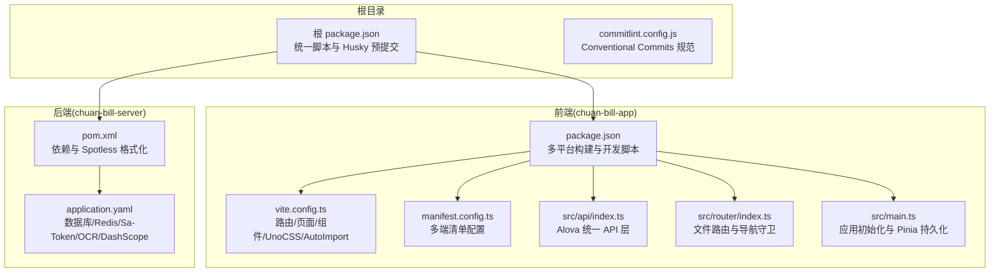
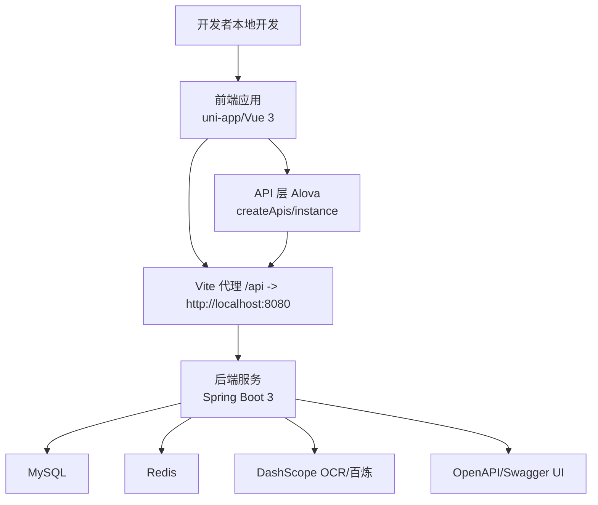
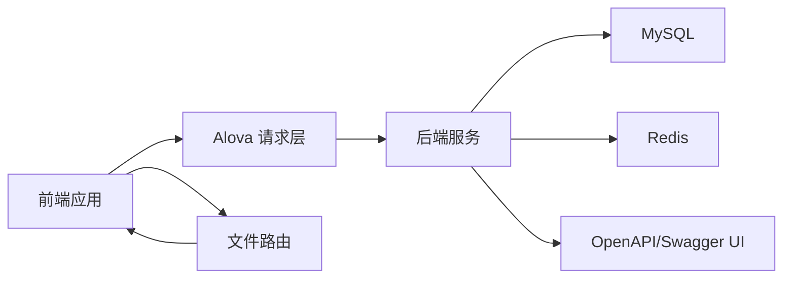

# 团队协作规范

<cite>
**本文引用的文件**
- [PRD.md](file://PRD.md)
- [CLAUDE.md](file://CLAUDE.md)
- [commitlint.config.js](file://commitlint.config.js)
- [package.json](file://package.json)
- [chuan-bill-app/package.json](file://chuan-bill-app/package.json)
- [chuan-bill-server/pom.xml](file://chuan-bill-server/pom.xml)
- [chuan-bill-server/src/main/resources/application.yaml](file://chuan-bill-server/src/main/resources/application.yaml)
- [chuan-bill-app/vite.config.ts](file://chuan-bill-app/vite.config.ts)
- [chuan-bill-app/src/api/index.ts](file://chuan-bill-app/src/api/index.ts)
- [chuan-bill-app/src/main.ts](file://chuan-bill-app/src/main.ts)
- [chuan-bill-app/src/router/index.ts](file://chuan-bill-app/src/router/index.ts)
- [chuan-bill-app/manifest.config.ts](file://chuan-bill-app/manifest.config.ts)
</cite>

## 目录
1. [引言](#引言)
2. [项目结构](#项目结构)
3. [核心组件](#核心组件)
4. [架构总览](#架构总览)
5. [详细组件分析](#详细组件分析)
6. [依赖分析](#依赖分析)
7. [性能考虑](#性能考虑)
8. [故障排查指南](#故障排查指南)
9. [结论](#结论)
10. [附录](#附录)

## 引言
本规范面向“小川记账”项目团队，旨在统一团队在沟通协作、代码贡献、项目管理、冲突解决、知识分享、角色职责与协作工具等方面的实践，提升交付质量与效率。本规范以仓库现有工程配置与文档为基础，结合实际开发流程制定，既保证可落地，又兼顾可扩展性。

## 项目结构
小川记账采用双端同构的单仓多包结构：
- 前端应用：基于 uni-app/Vue 3/TypeScript 的跨平台移动应用，位于 chuan-bill-app/
- 后端服务：基于 Spring Boot 3/Java 17 的 REST 服务，位于 chuan-bill-server/

根目录提供统一脚手架与工作流配置，支持并发启动前后端、统一代码风格检查与提交规范。

**图示来源**
- [package.json:1-29](file://package.json#L1-L29)
- [commitlint.config.js:1-4](file://commitlint.config.js#L1-L4)
- [chuan-bill-app/package.json:1-135](file://chuan-bill-app/package.json#L1-L135)
- [chuan-bill-app/vite.config.ts:1-80](file://chuan-bill-app/vite.config.ts#L1-L80)
- [chuan-bill-app/manifest.config.ts:1-100](file://chuan-bill-app/manifest.config.ts#L1-L100)
- [chuan-bill-app/src/api/index.ts:1-19](file://chuan-bill-app/src/api/index.ts#L1-L19)
- [chuan-bill-app/src/router/index.ts:1-80](file://chuan-bill-app/src/router/index.ts#L1-L80)
- [chuan-bill-app/src/main.ts:1-16](file://chuan-bill-app/src/main.ts#L1-L16)
- [chuan-bill-server/pom.xml:1-226](file://chuan-bill-server/pom.xml#L1-L226)
- [chuan-bill-server/src/main/resources/application.yaml:1-51](file://chuan-bill-server/src/main/resources/application.yaml#L1-L51)

**章节来源**
- [package.json:1-29](file://package.json#L1-L29)
- [chuan-bill-app/package.json:1-135](file://chuan-bill-app/package.json#L1-L135)
- [chuan-bill-server/pom.xml:1-226](file://chuan-bill-server/pom.xml#L1-L226)

## 核心组件
- 统一提交规范：基于 Conventional Commits，配合 commitlint 与 Husky 预提交钩子，确保提交信息可读、可追踪。
- 前后端统一脚本：根 package.json 提供并发启动、统一 lint 的命令，便于本地联调与 CI。
- 前端工程化：Vite 插件链路覆盖路由、页面、布局、组件自动注册、UnoCSS、AutoImport、ECharts 集成与代理。
- 后端工程化：Maven 管理依赖与格式化（Spotless），统一响应体与异常处理，Sa-Token 统一鉴权。
- API 层：Alova 统一请求封装与 mock，支持 OpenAPI 生成与类型安全。
- 路由与导航：文件路由 + 导航守卫 + 全局反馈组件，保障用户体验与一致性。

**章节来源**
- [commitlint.config.js:1-4](file://commitlint.config.js#L1-L4)
- [package.json:6-16](file://package.json#L6-L16)
- [chuan-bill-app/vite.config.ts:22-79](file://chuan-bill-app/vite.config.ts#L22-L79)
- [chuan-bill-server/pom.xml:197-221](file://chuan-bill-server/pom.xml#L197-L221)
- [chuan-bill-app/src/api/index.ts:1-19](file://chuan-bill-app/src/api/index.ts#L1-L19)
- [chuan-bill-app/src/router/index.ts:21-59](file://chuan-bill-app/src/router/index.ts#L21-L59)

## 架构总览
下图展示了从本地开发到多端构建的关键路径，以及前后端交互与统一 API 层的关系。

**图示来源**
- [chuan-bill-app/vite.config.ts:70-78](file://chuan-bill-app/vite.config.ts#L70-L78)
- [chuan-bill-app/src/api/index.ts:1-19](file://chuan-bill-app/src/api/index.ts#L1-L19)
- [chuan-bill-server/src/main/resources/application.yaml:41-49](file://chuan-bill-server/src/main/resources/application.yaml#L41-L49)
- [chuan-bill-server/pom.xml:128-141](file://chuan-bill-server/pom.xml#L128-L141)

## 详细组件分析

### 1. 团队沟通规范
- 会议制度
  - 每日站会：固定时间同步进展、阻塞项与风险；建议使用项目看板标注“进行中/已完成”。
  - 双周回顾：回顾迭代成果、问题复盘与改进计划；输出会议纪要至共享文档。
  - 冲突评审会：涉及重大技术决策或跨模块变更时，组织专题评审会并形成决议。
- 沟通渠道
  - 即时沟通：企业微信/钉钉群用于日常协作与问题澄清。
  - 文档沉淀：PRD、设计稿、API 文档、技术方案集中存放于仓库文档区。
  - 问题跟踪：Issue/需求卡片统一命名与标签，便于检索与回溯。
- 决策流程
  - 小范围变更：负责人评估后执行，必要时在站会同步。
  - 中等影响变更：在评审会形成结论，更新相关文档并同步团队。
  - 重大影响变更：形成方案与风险评估，经产品/技术负责人审批后执行。
- 问题升级机制
  - 自检：提交前本地验证（单元/集成/接口）。
  - 同伴：代码审查与交叉验证。
  - 技术负责人：无法达成一致时由技术负责人裁决。
  - 产品负责人：涉及需求取舍与排期时由产品负责人协调。

### 2. 代码贡献规范
- Fork 流程
  - Fork 主仓库至个人账号，创建独立分支进行开发。
  - 定期与上游主分支同步，保持基线一致。
- 分支策略
  - 主分支：仅接受通过审查的合并请求。
  - 功能分支：feature/前缀，如 feature/new-report。
  - 修复分支：fix/前缀，如 fix/login-bug。
  - 预发布分支：release/vX.Y.Z，用于最终验证。
- 提交规范
  - 使用 Conventional Commits，参考 commitlint 配置。
  - 提交信息需清晰描述变更动机、范围与影响。
- 代码审查标准
  - 正确性：逻辑正确、边界条件覆盖、异常处理完善。
  - 可读性：命名规范、注释清晰、复杂逻辑拆分。
  - 性能与安全：避免热点路径阻塞、敏感信息脱敏、鉴权校验到位。
  - 兼容性：接口变更需向后兼容或明确迁移指引。
- 提交前检查
  - 前端：ESLint 修复、类型检查通过、本地构建通过。
  - 后端：Spotless 格式化、单元测试通过、接口文档可用。

**章节来源**
- [commitlint.config.js:1-4](file://commitlint.config.js#L1-L4)
- [package.json:7-16](file://package.json#L7-L16)
- [chuan-bill-app/package.json:53-54](file://chuan-bill-app/package.json#L53-L54)
- [chuan-bill-server/pom.xml:197-221](file://chuan-bill-server/pom.xml#L197-L221)

### 3. 项目管理规范
- 任务分配
  - 以用户故事形式拆解需求，明确验收标准与风险点。
  - 按能力与负载均衡分配，避免单点瓶颈。
- 进度跟踪
  - 使用看板（Jira/Tapd/Teambition）可视化任务状态。
  - 每日站会同步阻塞项与次日计划。
- 里程碑管理
  - 按季度/迭代设定里程碑目标，定期回顾与调整。
  - 里程碑交付物包括：功能清单、测试用例、部署清单、回滚预案。
- 风险管理
  - 识别技术债、依赖风险、人员流动等，制定应对措施与预案。
  - 对高风险任务设置“技术预研”阶段，降低不确定性。

### 4. 冲突解决机制
- 分歧处理
  - 首先在小组内充分讨论，收集数据与证据支撑观点。
  - 若仍无法达成一致，提请技术负责人仲裁。
- 技术决策
  - 以“可维护性、可扩展性、稳定性”为首要原则。
  - 重要决策需形成技术备忘录并纳入知识库。
- 团队协商流程
  - 问题登记 → 初步评估 → 方案征集 → 专家评审 → 决策公告 → 执行与复盘。

### 5. 知识分享制度
- 技术分享会
  - 每两周一次，主题围绕架构演进、新技术探索、踩坑总结。
  - 形成分享材料与视频归档，便于新人学习。
- 文档维护
  - PRD、API 文档、部署手册、故障案例库持续更新。
  - 新人入职一周内完成文档阅读与环境搭建。
- 经验总结
  - 每个迭代结束后输出“复盘报告”，沉淀方法论与工具。

### 6. 角色职责划分
- 开发角色
  - 负责功能开发、单元测试、代码审查与缺陷修复。
  - 参与设计评审与技术方案制定。
- 测试角色
  - 设计测试用例、执行回归测试、提供自动化测试支持。
  - 输出缺陷报告与风险评估。
- 运维角色
  - 负责部署、监控、日志分析与应急响应。
  - 维护 CI/CD 流水线与发布策略。
- 产品角色
  - 负责需求定义、优先级排序与验收把关。
  - 组织需求评审与用户反馈收集。

### 7. 协作工具使用指南
- 项目管理工具
  - Jira/Tapd：任务卡片、史诗/故事拆分、燃尽图。
- 文档协作
  - Notion/Wiki：PRD、API 文档、设计稿、FAQ。
- 在线会议
  - 企业微信/钉钉：每日站会、评审会、复盘会。
- 版本控制
  - Git：遵循分支策略与提交规范，合并前必须审查。

### 8. 团队文化建设与激励机制
- 文化建设
  - 鼓励提问与分享，营造开放包容的技术氛围。
  - 设立“最佳实践奖”“技术创新奖”等荣誉。
- 激励机制
  - 月度优秀贡献者：公开表扬与小礼品。
  - 年度技术贡献：晋升加分与培训机会。

## 依赖分析
- 前端依赖链
  - uni-app 生态（多端编译）、Alova（请求层）、Pinia（状态管理）、UnoCSS（原子化样式）、VueUse（组合式工具）。
  - Vite 插件链：页面/布局/组件自动注册、ECharts、AutoImport、Bundle Optimizer。
- 后端依赖链
  - Spring Boot Web、MyBatis-Plus、Sa-Token、Redis、OpenAPI/Swagger、Spotless 格式化。
- API 与路由
  - Alova 统一生成 API，前端通过 createApis 注入类型与配置；路由基于文件系统自动生成，支持子包与虚拟路由。

**图示来源**
- [chuan-bill-app/src/api/index.ts:1-19](file://chuan-bill-app/src/api/index.ts#L1-L19)
- [chuan-bill-app/src/router/index.ts:1-80](file://chuan-bill-app/src/router/index.ts#L1-L80)
- [chuan-bill-server/src/main/resources/application.yaml:41-49](file://chuan-bill-server/src/main/resources/application.yaml#L41-L49)

**章节来源**
- [chuan-bill-app/vite.config.ts:22-69](file://chuan-bill-app/vite.config.ts#L22-L69)
- [chuan-bill-server/pom.xml:51-168](file://chuan-bill-server/pom.xml#L51-L168)

## 性能考虑
- 前端性能
  - 依赖懒加载与子包拆分，减少首屏体积。
  - UnoCSS 按需引入，避免全局样式污染。
  - 图表组件按需加载，避免不必要的渲染。
- 后端性能
  - Redis 缓存热点数据，降低数据库压力。
  - MyBatis-Plus 分页查询与软删除，避免全表扫描。
  - Sa-Token 令牌存储于 Redis，支持分布式会话。
- 网络与接口
  - Alova 统一错误处理与重试策略，提升鲁棒性。
  - OpenAPI 自动生成接口契约，减少前后端耦合。

## 故障排查指南
- 常见问题定位
  - 前端：查看 Vite 控制台与网络面板，确认代理与跨域配置；检查 Alova 错误处理器与全局反馈组件。
  - 后端：查看 Actuator 指标与日志，确认数据库/Redis 连接与 OCR 配置。
- 本地联调
  - 使用根脚本并发启动前后端，确保端口不冲突。
  - 如遇端口占用，调整后端端口或关闭占用进程。
- 环境变量
  - 数据库与 Redis 连接参数、DashScope API Key 等需在环境变量中配置。

**章节来源**
- [package.json:10-16](file://package.json#L10-L16)
- [chuan-bill-server/src/main/resources/application.yaml:4-21](file://chuan-bill-server/src/main/resources/application.yaml#L4-L21)
- [chuan-bill-app/vite.config.ts:70-78](file://chuan-bill-app/vite.config.ts#L70-L78)

## 结论
本规范以仓库现有工程化配置为依据，结合团队实际需求，建立了从沟通、贡献、管理到冲突解决与知识分享的完整协作体系。建议在实施过程中持续迭代，确保规范与实践同步演进，推动项目高质量交付与团队高效协作。

## 附录
- 术语
  - 前端：指 chuan-bill-app/ 下的 uni-app 应用。
  - 后端：指 chuan-bill-server/ 下的 Spring Boot 服务。
  - Alova：前端统一请求层与 mock 框架。
  - Sa-Token：后端统一鉴权框架。
  - Spotless：后端代码格式化工具。
- 参考文档
  - PRD：项目需求与功能边界说明。
  - CLAUDE：项目概览、命令与编码约定。