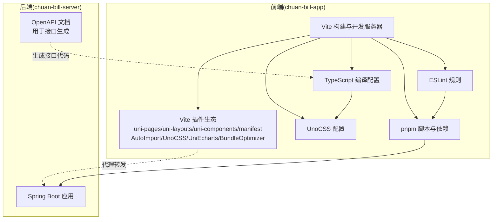
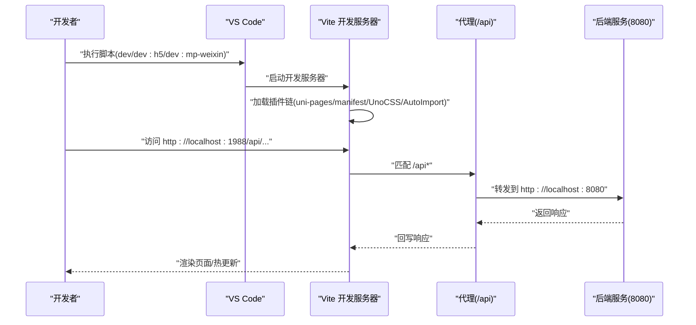
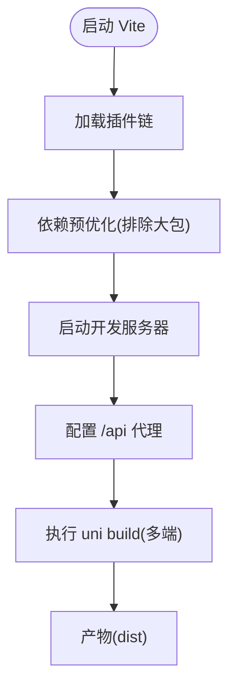
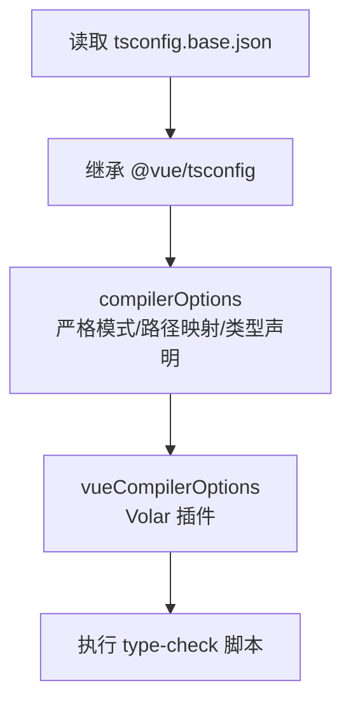
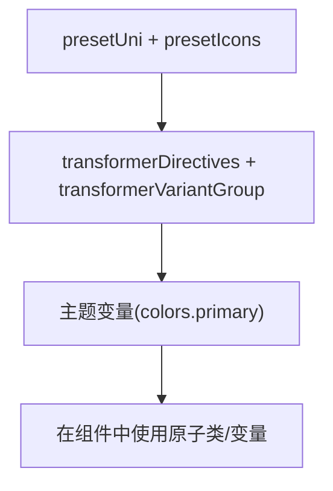
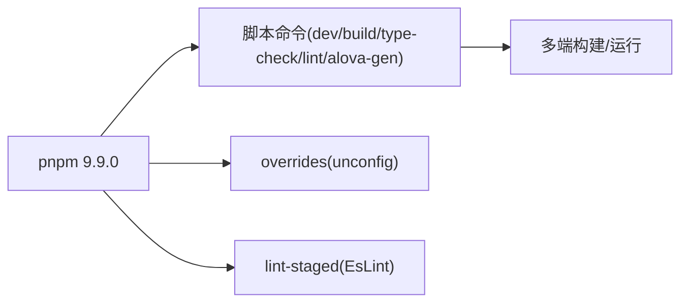
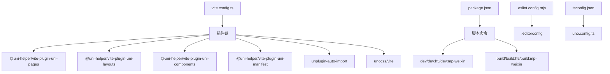

# 开发工具配置

<cite>
**本文引用的文件**
- [vite.config.ts](file://chuan-bill-app/vite.config.ts)
- [tsconfig.json](file://chuan-bill-app/tsconfig.json)
- [tsconfig.base.json](file://chuan-bill-app/tsconfig.base.json)
- [uno.config.ts](file://chuan-bill-app/uno.config.ts)
- [package.json](file://chuan-bill-app/package.json)
- [eslint.config.mjs](file://chuan-bill-app/eslint.config.mjs)
- [.editorconfig](file://chuan-bill-app/.editorconfig)
- [manifest.config.ts](file://chuan-bill-app/manifest.config.ts)
- [pages.config.ts](file://chuan-bill-app/pages.config.ts)
- [alova.config.ts](file://chuan-bill-app/alova.config.ts)
</cite>

## 目录
1. [简介](#简介)
2. [项目结构](#项目结构)
3. [核心组件](#核心组件)
4. [架构总览](#架构总览)
5. [详细组件分析](#详细组件分析)
6. [依赖关系分析](#依赖关系分析)
7. [性能考虑](#性能考虑)
8. [故障排除指南](#故障排除指南)
9. [结论](#结论)
10. [附录](#附录)

## 简介
本指南面向“小川记账”项目的前端与全栈开发团队，聚焦于 VS Code 开发环境、Vite 构建工具、TypeScript 编译、UnoCSS 原子化 CSS、包管理与脚本命令、以及开发调试技巧与故障排除。内容基于仓库中的实际配置文件整理而成，帮助开发者快速搭建一致且高效的开发工具链。

## 项目结构
本项目采用“多端统一”的架构：前端基于 uni-app/Vite，后端基于 Spring Boot。前端工程位于 chuan-bill-app，后端工程位于 chuan-bill-server。前端通过 Vite 驱动，结合一系列 uni-helper 生态插件实现页面、布局、组件、清单等自动化生成；同时集成 UnoCSS 实现原子化样式与主题变量；TypeScript 提供强类型支持；ESLint 保障代码风格；pnpm 管理依赖与脚本命令。

**图示来源**
- [vite.config.ts:17-79](file://chuan-bill-app/vite.config.ts#L17-L79)
- [uno.config.ts:10-37](file://chuan-bill-app/uno.config.ts#L10-L37)
- [tsconfig.json:1-30](file://chuan-bill-app/tsconfig.json#L1-L30)
- [eslint.config.mjs:1-18](file://chuan-bill-app/eslint.config.mjs#L1-L18)
- [package.json:11-56](file://chuan-bill-app/package.json#L11-L56)
- [alova.config.ts:8-84](file://chuan-bill-app/alova.config.ts#L8-L84)

**章节来源**
- [package.json:1-135](file://chuan-bill-app/package.json#L1-L135)
- [vite.config.ts:1-80](file://chuan-bill-app/vite.config.ts#L1-L80)
- [tsconfig.json:1-30](file://chuan-bill-app/tsconfig.json#L1-L30)
- [uno.config.ts:1-38](file://chuan-bill-app/uno.config.ts#L1-L38)
- [eslint.config.mjs:1-18](file://chuan-bill-app/eslint.config.mjs#L1-L18)
- [.editorconfig:1-10](file://chuan-bill-app/.editorconfig#L1-L10)
- [manifest.config.ts:1-100](file://chuan-bill-app/manifest.config.ts#L1-L100)
- [pages.config.ts:1-43](file://chuan-bill-app/pages.config.ts#L1-L43)
- [alova.config.ts:1-85](file://chuan-bill-app/alova.config.ts#L1-L85)

## 核心组件
- Vite 构建与开发服务器：启用基础路径、依赖预优化、代理到后端、插件链路。
- uni-helper 生态：自动页面/布局/组件/清单生成，根目录注入，按需打包优化。
- UnoCSS：内置 presetUni 与图标预设、指令与变体转换器、主题颜色变量。
- TypeScript：扩展基础配置、路径映射、类型声明、Vue 编译器选项。
- ESLint：基于 @uni-helper/eslint-config，开启 UnoCSS 规则，忽略特定目录。
- 包管理：pnpm 脚本覆盖多端构建与运行模式，统一版本与引擎要求。
- 接口生成：Alova Wormhole 基于 OpenAPI 自动化生成接口与类型。

**章节来源**
- [vite.config.ts:17-79](file://chuan-bill-app/vite.config.ts#L17-L79)
- [uno.config.ts:10-37](file://chuan-bill-app/uno.config.ts#L10-L37)
- [tsconfig.json:1-30](file://chuan-bill-app/tsconfig.json#L1-L30)
- [eslint.config.mjs:1-18](file://chuan-bill-app/eslint.config.mjs#L1-L18)
- [package.json:11-56](file://chuan-bill-app/package.json#L11-L56)
- [alova.config.ts:8-84](file://chuan-bill-app/alova.config.ts#L8-L84)

## 架构总览
下图展示从开发到构建的关键流程：VS Code 启动 Vite 开发服务器，请求经由代理转发至后端；前端通过 AutoImport 注入常用 API，组件解析由 uni-components 与 Volar 插件辅助；UnoCSS 在开发时即时生成原子类，构建时进行优化；TypeScript 进行类型检查与编译输出。

**图示来源**
- [vite.config.ts:70-78](file://chuan-bill-app/vite.config.ts#L70-L78)
- [package.json:11-56](file://chuan-bill-app/package.json#L11-L56)

## 详细组件分析

### VS Code 开发环境配置
- 推荐插件
  - ESLint：基于仓库 ESLint 配置，自动修复与提示。
  - Vue Language Features (Volar)：配合 @uni-helper 的 Vue 类型增强插件。
  - UnoCSS：提供原子类智能提示与校验。
  - EditorConfig for VS Code：遵循 .editorconfig 统一编码规范。
  - Prettier：可选，与 ESLint 冲突时建议禁用格式化功能，仅保留检查。
- 工作区设置
  - 使用 .editorconfig 统一缩进、换行、字符集等。
  - 在 VS Code 设置中启用“ESLint: Auto Fix On Save”，保持与 lint-staged 一致。
- 调试配置
  - H5 开发：使用浏览器调试，结合 Vite 的 source map。
  - 多端调试：通过 uni 命令在目标平台运行，结合对应 IDE 或真机调试。
  - 网络监控：利用浏览器 Network 面板观察 /api 代理请求与响应。
  - 错误追踪：启用 Source Map，结合控制台堆栈定位问题。

**章节来源**
- [eslint.config.mjs:1-18](file://chuan-bill-app/eslint.config.mjs#L1-L18)
- [tsconfig.json:19-22](file://chuan-bill-app/tsconfig.json#L19-L22)
- [uno.config.ts:10-37](file://chuan-bill-app/uno.config.ts#L10-L37)
- [.editorconfig:1-10](file://chuan-bill-app/.editorconfig#L1-L10)

### Vite 构建工具配置
- 开发服务器
  - 基础路径：相对路径，适配多端部署。
  - 依赖预优化：开发环境下排除部分大体积库以加速启动。
- 代理配置
  - 将 /api 前缀请求转发至本地后端服务，支持路径重写。
- 插件配置
  - 清单/页面/布局/组件：自动生成与类型声明，提升多端一致性。
  - AutoImport：自动导入 Vue/Pinia/UniApp/Router/Wot UI 等常用 API。
  - UnoCSS：原子化样式与主题变量。
  - UniEcharts：图表组件按需引入。
  - BundleOptimizer：微信小程序端启用按需打包优化。
- 构建优化
  - 通过 BundleOptimizer 与按需组件解析减少包体。
  - 代理与类型检查在开发阶段生效，生产构建由 uni build 统一处理。

**图示来源**
- [vite.config.ts:17-79](file://chuan-bill-app/vite.config.ts#L17-L79)

**章节来源**
- [vite.config.ts:17-79](file://chuan-bill-app/vite.config.ts#L17-L79)

### TypeScript 编译配置
- 基础配置
  - 扩展 @vue/tsconfig 基础项，启用严格模式与跳过库检查。
  - 路径映射：@/* 指向 src，便于模块导入。
- 类型声明
  - 引入 DCloud、Mini Types、Uni Types、Wot UI 全局类型与 uni-echarts。
- Vue 编译器
  - 通过 @uni-helper/uni-types/volar-plugin 提升 uni-app 组件的类型支持。
- 类型检查
  - 通过脚本执行 vue-tsc 进行无 emit 的类型检查，保证构建前质量。

**图示来源**
- [tsconfig.base.json:1-11](file://chuan-bill-app/tsconfig.base.json#L1-L11)
- [tsconfig.json:1-30](file://chuan-bill-app/tsconfig.json#L1-L30)

**章节来源**
- [tsconfig.base.json:1-11](file://chuan-bill-app/tsconfig.base.json#L1-L11)
- [tsconfig.json:1-30](file://chuan-bill-app/tsconfig.json#L1-L30)

### UnoCSS 原子化 CSS 配置
- 预设与转换器
  - presetUni：适配 uni-app 场景的原子化预设。
  - presetIcons：图标集合与额外属性配置。
  - transformerDirectives/transformerVariantGroup：指令与变体分组支持。
- 主题变量
  - 定义 primary 颜色变量，通过 CSS 变量在组件中使用。
- 条件编译
  - pages.config.ts 中使用条件编译指令控制不同平台的 tabbar 行为。

**图示来源**
- [uno.config.ts:10-37](file://chuan-bill-app/uno.config.ts#L10-L37)
- [pages.config.ts:21-42](file://chuan-bill-app/pages.config.ts#L21-L42)

**章节来源**
- [uno.config.ts:1-38](file://chuan-bill-app/uno.config.ts#L1-L38)
- [pages.config.ts:1-43](file://chuan-bill-app/pages.config.ts#L1-L43)

### 包管理工具配置（pnpm）
- 版本与引擎
  - 使用 pnpm 9.9.0，Node 引擎要求较高版本。
- 脚本命令
  - dev/build：统一入口，支持多端与模式切换（h5、mp-weixin、app 等）。
  - type-check：类型检查。
  - lint/fix：ESLint 检查与自动修复。
  - alova-gen：基于 OpenAPI 生成接口与类型。
- 依赖管理
  - overrides：对 unconfig 进行版本覆盖，避免冲突。
  - lint-staged：提交前自动 ESLint 修复。

**图示来源**
- [package.json:6-10](file://chuan-bill-app/package.json#L6-L10)
- [package.json:11-56](file://chuan-bill-app/package.json#L11-L56)
- [package.json:126-134](file://chuan-bill-app/package.json#L126-L134)

**章节来源**
- [package.json:1-135](file://chuan-bill-app/package.json#L1-L135)

### 开发调试技巧
- 断点调试
  - 在 Vite 开发服务器中使用浏览器断点，结合 Source Map 定位源码。
- 网络监控
  - 利用 /api 代理观察请求头、路径重写与响应状态。
- 性能分析
  - 使用浏览器性能面板分析首屏与交互耗时；关注组件懒加载与资源体积。
- 错误追踪
  - 启用严格类型检查与 ESLint 规则，减少运行期错误；结合控制台堆栈定位。

**章节来源**
- [vite.config.ts:70-78](file://chuan-bill-app/vite.config.ts#L70-L78)
- [eslint.config.mjs:1-18](file://chuan-bill-app/eslint.config.mjs#L1-L18)
- [tsconfig.json:19-22](file://chuan-bill-app/tsconfig.json#L19-L22)

### 开发工具链集成方案
- VS Code + ESLint + Volar + UnoCSS：统一代码风格与类型体验。
- Alova + OpenAPI：自动生成接口与类型，降低前后端耦合。
- Vite + uni-helper：多端一致的页面/布局/组件/清单生成。
- pnpm + lint-staged：提交前质量把关。

**章节来源**
- [alova.config.ts:8-84](file://chuan-bill-app/alova.config.ts#L8-L84)
- [eslint.config.mjs:1-18](file://chuan-bill-app/eslint.config.mjs#L1-L18)
- [vite.config.ts:22-68](file://chuan-bill-app/vite.config.ts#L22-L68)

## 依赖关系分析
- Vite 插件链与多端能力：通过 uni-pages/uni-layouts/uni-components/manifest 等插件，形成页面、布局、组件与清单的自动化体系。
- 类型与样式：TypeScript 与 UnoCSS 协同，前者提供类型安全，后者提供原子化样式与主题变量。
- 脚本与代理：package.json 脚本统一入口，vite.config.ts 代理连接前后端。
- ESLint 与编辑规范：eslint.config.mjs 与 .editorconfig 保障一致性。

**图示来源**
- [vite.config.ts:17-79](file://chuan-bill-app/vite.config.ts#L17-L79)
- [package.json:11-56](file://chuan-bill-app/package.json#L11-L56)
- [eslint.config.mjs:1-18](file://chuan-bill-app/eslint.config.mjs#L1-L18)
- [tsconfig.json:1-30](file://chuan-bill-app/tsconfig.json#L1-L30)
- [uno.config.ts:10-37](file://chuan-bill-app/uno.config.ts#L10-L37)

**章节来源**
- [vite.config.ts:17-79](file://chuan-bill-app/vite.config.ts#L17-L79)
- [package.json:11-56](file://chuan-bill-app/package.json#L11-L56)
- [eslint.config.mjs:1-18](file://chuan-bill-app/eslint.config.mjs#L1-L18)
- [tsconfig.json:1-30](file://chuan-bill-app/tsconfig.json#L1-L30)
- [uno.config.ts:10-37](file://chuan-bill-app/uno.config.ts#L10-L37)

## 性能考虑
- 依赖预优化：排除大包，缩短冷启动时间。
- 按需打包：BundleOptimizer 与组件解析减少冗余代码。
- 代理直连：避免中间层开销，提升开发联调效率。
- 类型检查前置：通过 type-check 脚本在构建前发现问题，减少运行时错误。

**章节来源**
- [vite.config.ts:19-21](file://chuan-bill-app/vite.config.ts#L19-L21)
- [vite.config.ts:46-49](file://chuan-bill-app/vite.config.ts#L46-L49)
- [package.json:52](file://chuan-bill-app/package.json#L52)

## 故障排除指南
- 代理失败
  - 确认后端服务已启动并监听 8080。
  - 检查 /api 代理规则与路径重写逻辑。
- 类型报错
  - 执行 type-check 脚本，逐条修复类型问题。
  - 确保 Volar 插件与 @uni-helper 的 Vue 类型插件已启用。
- ESLint 报错
  - 使用 lint 与 lint:fix 脚本修复常见问题。
  - 如遇规则冲突，可在 eslint.config.mjs 中调整规则或忽略路径。
- 多端构建异常
  - 使用对应平台脚本（如 dev:mp-weixin、build:mp-weixin）确认目标平台配置。
  - 检查 manifest.config.ts 与 pages.config.ts 的平台差异化设置。
- UnoCSS 不生效
  - 确认 UnoCSS 插件已加载，检查主题变量与原子类使用方式。

**章节来源**
- [vite.config.ts:70-78](file://chuan-bill-app/vite.config.ts#L70-L78)
- [package.json:52](file://chuan-bill-app/package.json#L52)
- [eslint.config.mjs:1-18](file://chuan-bill-app/eslint.config.mjs#L1-L18)
- [manifest.config.ts:1-100](file://chuan-bill-app/manifest.config.ts#L1-L100)
- [pages.config.ts:1-43](file://chuan-bill-app/pages.config.ts#L1-L43)
- [uno.config.ts:10-37](file://chuan-bill-app/uno.config.ts#L10-L37)

## 结论
本指南基于仓库现有配置，系统梳理了 VS Code、Vite、TypeScript、UnoCSS、包管理与调试实践。建议团队在日常协作中统一使用上述工具链与脚本，确保跨端一致性与开发效率。

## 附录
- 常用脚本速览
  - 开发：dev、dev:h5、dev:mp-weixin、dev:app
  - 构建：build、build:h5、build:mp-weixin、build:app
  - 质量：type-check、lint、lint:fix
  - 接口：alova-gen
- 平台差异
  - manifest.config.ts 与 pages.config.ts 提供多端差异化配置，注意条件编译指令的使用。

**章节来源**
- [package.json:11-56](file://chuan-bill-app/package.json#L11-L56)
- [manifest.config.ts:1-100](file://chuan-bill-app/manifest.config.ts#L1-L100)
- [pages.config.ts:1-43](file://chuan-bill-app/pages.config.ts#L1-L43)