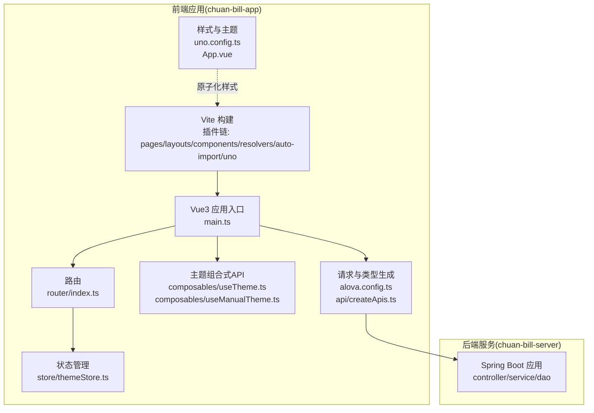
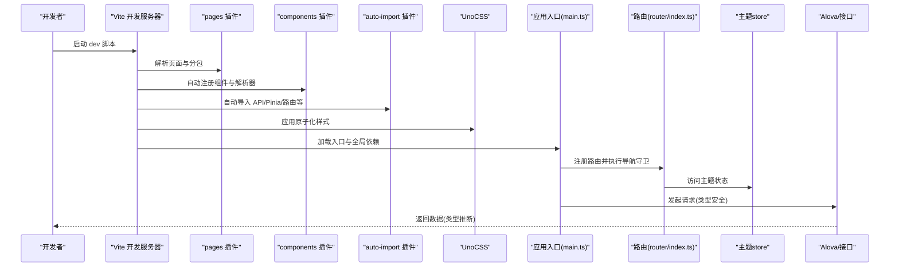
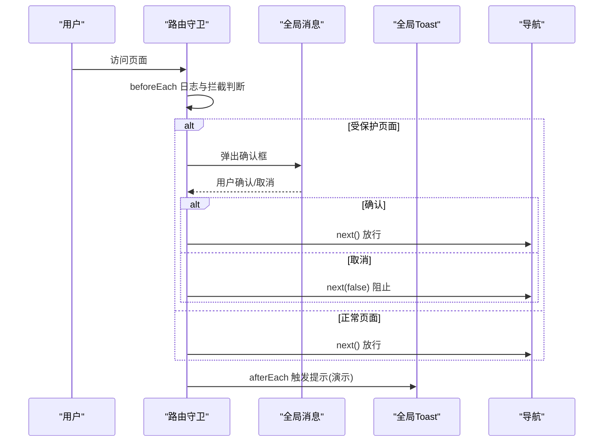
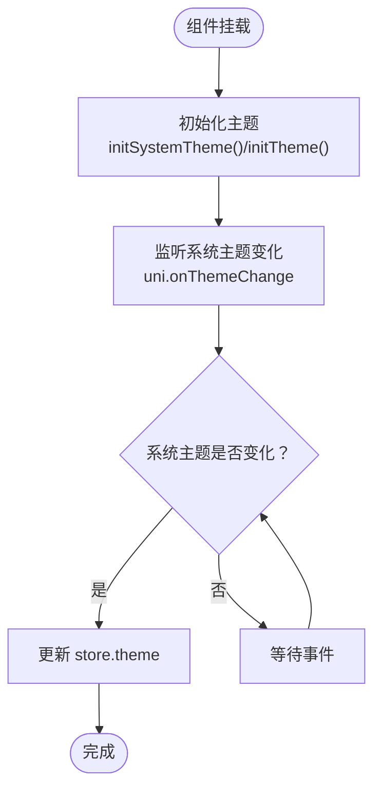
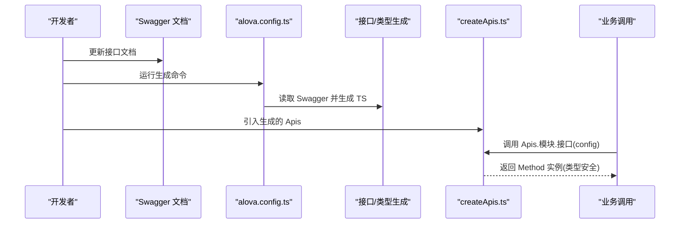
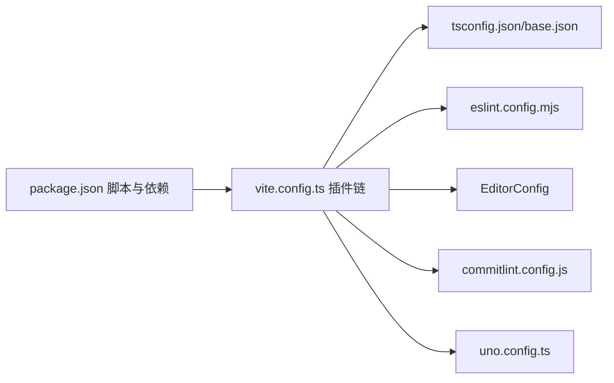

# 开发指南

<cite>
**本文引用的文件**
- [package.json](file://chuan-bill-app/package.json)
- [eslint.config.mjs](file://chuan-bill-app/eslint.config.mjs)
- [tsconfig.json](file://chuan-bill-app/tsconfig.json)
- [tsconfig.base.json](file://chuan-bill-app/tsconfig.base.json)
- [vite.config.ts](file://chuan-bill-app/vite.config.ts)
- [uno.config.ts](file://chuan-bill-app/uno.config.ts)
- [.editorconfig](file://chuan-bill-app/.editorconfig)
- [commitlint.config.js](file://commitlint.config.js)
- [alova.config.ts](file://chuan-bill-app/alova.config.ts)
- [src/main.ts](file://chuan-bill-app/src/main.ts)
- [src/App.vue](file://chuan-bill-app/src/App.vue)
- [src/router/index.ts](file://chuan-bill-app/src/router/index.ts)
- [src/store/themeStore.ts](file://chuan-bill-app/src/store/themeStore.ts)
- [src/composables/useTheme.ts](file://chuan-bill-app/src/composables/useTheme.ts)
- [src/composables/useManualTheme.ts](file://chuan-bill-app/src/composables/useManualTheme.ts)
- [src/api/createApis.ts](file://chuan-bill-app/src/api/createApis.ts)
</cite>

## 目录
1. [简介](#简介)
2. [项目结构](#项目结构)
3. [核心组件](#核心组件)
4. [架构总览](#架构总览)
5. [详细组件分析](#详细组件分析)
6. [依赖分析](#依赖分析)
7. [性能考虑](#性能考虑)
8. [故障排查指南](#故障排查指南)
9. [结论](#结论)
10. [附录](#附录)

## 简介
本开发指南面向“小川记账”项目的前端与全栈开发者，系统性地梳理并规范以下内容：
- JavaScript/TypeScript 编码规范与最佳实践
- Vue 组件开发规范（含 uni-app/Vue3 场景）
- CSS/SCSS 样式规范与原子化工具 UnoCSS 使用
- Git 提交规范与变更管理流程
- 开发流程与工作流（分支管理、代码审查、版本发布、变更管理）
- 开发工具配置（VS Code 插件、ESLint、Prettier、EditorConfig）
- TypeScript 类型定义管理、自动导入与组件类型声明
- 开发环境配置、调试技巧、问题排查方法
- 代码质量检查、静态分析工具使用、持续集成建议

## 项目结构
项目采用多端一体化工程（uni-app），前端基于 Vue3 + TypeScript + Vite，配合 Pinia 状态管理、Alova 请求库、UnoCSS 原子化样式与 UI 组件库（wot-design-uni）。后端为 Spring Boot 项目，前后端通过本地代理进行联调。

图表来源
- [vite.config.ts:17-80](file://chuan-bill-app/vite.config.ts#L17-L80)
- [src/main.ts:1-16](file://chuan-bill-app/src/main.ts#L1-L16)
- [src/router/index.ts:1-80](file://chuan-bill-app/src/router/index.ts#L1-L80)
- [src/store/themeStore.ts:1-75](file://chuan-bill-app/src/store/themeStore.ts#L1-L75)
- [src/composables/useTheme.ts:1-71](file://chuan-bill-app/src/composables/useTheme.ts#L1-L71)
- [src/composables/useManualTheme.ts:1-143](file://chuan-bill-app/src/composables/useManualTheme.ts#L1-L143)
- [alova.config.ts:1-85](file://chuan-bill-app/alova.config.ts#L1-L85)
- [src/api/createApis.ts:1-95](file://chuan-bill-app/src/api/createApis.ts#L1-L95)
- [uno.config.ts:1-38](file://chuan-bill-app/uno.config.ts#L1-L38)
- [src/App.vue:1-16](file://chuan-bill-app/src/App.vue#L1-L16)

章节来源
- [package.json:1-135](file://chuan-bill-app/package.json#L1-L135)
- [vite.config.ts:17-80](file://chuan-bill-app/vite.config.ts#L17-L80)
- [src/main.ts:1-16](file://chuan-bill-app/src/main.ts#L1-L16)

## 核心组件
- 构建与插件体系：Vite 配置集中于 vite.config.ts，启用 pages、layouts、components 自动注册与解析器、自动导入、UnoCSS、echarts 集成、bundle 优化等。
- 应用入口与全局注入：main.ts 创建 SSR 应用，注册路由与 Pinia，并引入全局样式。
- 路由：基于虚拟 pages 生成路由，提供全局前置/后置守卫示例。
- 状态：主题状态 store 与组合式 API，支持系统主题跟随与手动主题切换。
- 请求与类型：Alova 配置对接 OpenAPI/Swagger，自动生成 TS 接口与类型，createApis 提供运行时方法构造。
- 样式：UnoCSS 预设与主题变量，App.vue 中定义页面容器基础样式与深色背景。

章节来源
- [vite.config.ts:17-80](file://chuan-bill-app/vite.config.ts#L17-L80)
- [src/main.ts:1-16](file://chuan-bill-app/src/main.ts#L1-L16)
- [src/router/index.ts:1-80](file://chuan-bill-app/src/router/index.ts#L1-L80)
- [src/store/themeStore.ts:1-75](file://chuan-bill-app/src/store/themeStore.ts#L1-L75)
- [src/composables/useTheme.ts:1-71](file://chuan-bill-app/src/composables/useTheme.ts#L1-L71)
- [src/composables/useManualTheme.ts:1-143](file://chuan-bill-app/src/composables/useManualTheme.ts#L1-L143)
- [alova.config.ts:1-85](file://chuan-bill-app/alova.config.ts#L1-L85)
- [src/api/createApis.ts:1-95](file://chuan-bill-app/src/api/createApis.ts#L1-L95)
- [uno.config.ts:1-38](file://chuan-bill-app/uno.config.ts#L1-L38)
- [src/App.vue:1-16](file://chuan-bill-app/src/App.vue#L1-L16)

## 架构总览
下图展示从开发到构建的关键路径与工具链交互：

图表来源
- [vite.config.ts:17-80](file://chuan-bill-app/vite.config.ts#L17-L80)
- [src/main.ts:1-16](file://chuan-bill-app/src/main.ts#L1-L16)
- [src/router/index.ts:1-80](file://chuan-bill-app/src/router/index.ts#L1-L80)
- [src/store/themeStore.ts:1-75](file://chuan-bill-app/src/store/themeStore.ts#L1-L75)
- [alova.config.ts:1-85](file://chuan-bill-app/alova.config.ts#L1-L85)

## 详细组件分析

### 路由与导航守卫
- 路由由 pages 插件动态生成，支持主包与分包页面合并。
- 提供全局 beforeEach/afterEach 示例，演示日志记录与受保护页面拦截。
- 导航守卫中可结合全局消息/提示组件进行用户交互。

图表来源
- [src/router/index.ts:21-79](file://chuan-bill-app/src/router/index.ts#L21-L79)

章节来源
- [src/router/index.ts:1-80](file://chuan-bill-app/src/router/index.ts#L1-L80)

### 主题系统（简化版与完整版）
- 简化版 useTheme：仅跟随系统主题，自动监听系统主题变化并在组件生命周期内初始化。
- 完整版 useManualTheme：支持手动切换暗黑模式、主题色选择、跟随系统、持久化用户设置；在 onShow 时同步导航栏颜色。

图表来源
- [src/composables/useTheme.ts:39-70](file://chuan-bill-app/src/composables/useTheme.ts#L39-L70)
- [src/composables/useManualTheme.ts:83-115](file://chuan-bill-app/src/composables/useManualTheme.ts#L83-L115)
- [src/store/themeStore.ts:68-72](file://chuan-bill-app/src/store/themeStore.ts#L68-L72)

章节来源
- [src/composables/useTheme.ts:1-71](file://chuan-bill-app/src/composables/useTheme.ts#L1-L71)
- [src/composables/useManualTheme.ts:1-143](file://chuan-bill-app/src/composables/useManualTheme.ts#L1-L143)
- [src/store/themeStore.ts:1-75](file://chuan-bill-app/src/store/themeStore.ts#L1-L75)

### 请求与类型生成（Alova + Swagger/OpenAPI）
- alova.config.ts 配置 Swagger 平台输入、输出目录、类型生成、过滤过时接口等。
- createApis.ts 提供运行时方法构造与类型推断，支持路径参数替换、FormData 自动转换。
- 通过脚本生成接口与类型，避免手写重复代码，提升类型安全。

图表来源
- [alova.config.ts:8-84](file://chuan-bill-app/alova.config.ts#L8-L84)
- [src/api/createApis.ts:65-95](file://chuan-bill-app/src/api/createApis.ts#L65-L95)

章节来源
- [alova.config.ts:1-85](file://chuan-bill-app/alova.config.ts#L1-L85)
- [src/api/createApis.ts:1-95](file://chuan-bill-app/src/api/createApis.ts#L1-L95)

### 样式与主题（UnoCSS + App.vue）
- uno.config.ts 配置 presetUni、图标预设与变体转换器，统一设计令牌。
- App.vue 定义页面容器基础样式与深色背景，配合主题 store 的 themeVars 使用 wot-design-uni 的主题变量。

章节来源
- [uno.config.ts:1-38](file://chuan-bill-app/uno.config.ts#L1-L38)
- [src/App.vue:1-16](file://chuan-bill-app/src/App.vue#L1-L16)

## 依赖分析
- 构建与插件：Vite 插件链负责页面/布局/组件自动发现与解析、自动导入、UnoCSS、echarts 集成、bundle 优化。
- 类型与编译：tsconfig.json 与 tsconfig.base.json 统一编译选项与路径别名，Volar 插件增强 uni-app 组件类型支持。
- 质量与规范：ESLint 配置基于 @uni-helper，EditorConfig 统一行尾与缩进；commitlint 基于 conventional 提交规范。

图表来源
- [package.json:11-56](file://chuan-bill-app/package.json#L11-L56)
- [vite.config.ts:17-80](file://chuan-bill-app/vite.config.ts#L17-L80)
- [tsconfig.json:1-30](file://chuan-bill-app/tsconfig.json#L1-L30)
- [eslint.config.mjs:1-18](file://chuan-bill-app/eslint.config.mjs#L1-L18)
- [.editorconfig:1-10](file://chuan-bill-app/.editorconfig#L1-L10)
- [commitlint.config.js:1-4](file://commitlint.config.js#L1-L4)
- [uno.config.ts:1-38](file://chuan-bill-app/uno.config.ts#L1-L38)

章节来源
- [package.json:1-135](file://chuan-bill-app/package.json#L1-L135)
- [eslint.config.mjs:1-18](file://chuan-bill-app/eslint.config.mjs#L1-L18)
- [.editorconfig:1-10](file://chuan-bill-app/.editorconfig#L1-L10)
- [commitlint.config.js:1-4](file://commitlint.config.js#L1-L4)

## 性能考虑
- 依赖预优化：开发环境下排除部分大型依赖以加速启动。
- bundle 优化：按平台启用优化器，减少包体积。
- 图标与样式：按需加载图标集合，避免全量引入。
- 路由与组件：利用 pages/components 插件自动注册，减少手动引入成本与冗余依赖。

章节来源
- [vite.config.ts:19-21](file://chuan-bill-app/vite.config.ts#L19-L21)
- [vite.config.ts:46-49](file://chuan-bill-app/vite.config.ts#L46-L49)
- [uno.config.ts:15-26](file://chuan-bill-app/uno.config.ts#L15-L26)

## 故障排查指南
- ESLint 报错
  - 确认规则未被过度限制，必要时在配置中调整忽略或规则级别。
  - 使用脚本修复或在编辑器中启用保存自动修复。
- UnoCSS 样式不生效
  - 检查是否正确引入 uno.css，确认类名拼写与变体语法。
  - 若使用图标，确认图标集合已正确配置或按需导入。
- 路由跳转异常
  - 查看导航守卫日志，确认受保护页面拦截逻辑与 next() 调用是否正确。
- 主题切换无效
  - 检查系统主题监听是否注册，确认 store 状态更新与组件响应式绑定。
- 请求类型错误
  - 确认 Swagger 文档地址与版本，重新生成接口与类型文件。
- 代理与跨域
  - 检查 vite 代理配置与后端服务端口一致性。

章节来源
- [eslint.config.mjs:1-18](file://chuan-bill-app/eslint.config.mjs#L1-L18)
- [uno.config.ts:1-38](file://chuan-bill-app/uno.config.ts#L1-L38)
- [src/router/index.ts:24-59](file://chuan-bill-app/src/router/index.ts#L24-L59)
- [src/composables/useTheme.ts:46-52](file://chuan-bill-app/src/composables/useTheme.ts#L46-L52)
- [alova.config.ts:16](file://chuan-bill-app/alova.config.ts#L16)
- [vite.config.ts:70-78](file://chuan-bill-app/vite.config.ts#L70-L78)

## 结论
本指南围绕“小川记账”的技术栈与工程化实践，提供了从编码规范、组件开发、样式与主题、请求与类型、到开发流程与质量保障的完整方案。建议团队在日常协作中严格遵循本规范，持续完善 CI/CD 与自动化测试，确保代码质量与交付效率。

## 附录

### A. 编码规范与最佳实践
- JavaScript/TypeScript
  - 使用严格模式与明确的类型注解，优先使用 readonly、非空断言与类型守卫。
  - 避免魔法数字与字符串，使用枚举或常量替代。
  - 函数单一职责，避免副作用，合理拆分组合式 API。
- Vue 组件
  - 使用 <script setup> 与组合式 API，保持模板简洁。
  - 组件命名采用帕斯卡命名，文件夹内含 .vue/.json/.wxml/.wxss 对应文件。
  - 合理使用 provide/inject 与 emits，避免深层 props 下钻。
- CSS/SCSS
  - 优先使用 UnoCSS 原子类，减少自定义样式。
  - 深色与浅色主题变量通过 themeVars 传递，避免硬编码颜色。
- Git 提交
  - 使用约定式提交，参考 commitlint 配置。
  - 提交信息清晰描述变更目的与影响范围。

章节来源
- [eslint.config.mjs:1-18](file://chuan-bill-app/eslint.config.mjs#L1-L18)
- [commitlint.config.js:1-4](file://commitlint.config.js#L1-L4)
- [uno.config.ts:32-36](file://chuan-bill-app/uno.config.ts#L32-L36)

### B. 开发流程与工作流
- 分支管理
  - 主分支：release/热修复
  - 开发分支：develop
  - 功能分支：feature/xxx
  - 修复分支：fix/xxx
- 代码审查
  - PR 必须通过 ESLint、类型检查与最小可运行验证。
  - 至少一名 reviewer 通过后方可合并。
- 版本发布
  - 使用标准版本号工具，变更日志自动生成。
- 变更管理
  - 接口变更需同步更新 Swagger 并重新生成类型。

章节来源
- [package.json:52-55](file://chuan-bill-app/package.json#L52-L55)

### C. 开发工具配置
- VS Code 插件（建议）
  - ESLint、Vue Language Features (Volar)、UnoCSS、Prettier、EditorConfig
- ESLint
  - 基于 @uni-helper 配置，按需调整规则与忽略项。
- Prettier
  - 与 ESLint 冲突时以 ESLint 为准，或使用 lint-staged 在提交前统一格式化。
- EditorConfig
  - 统一缩进、换行与尾随空白处理。

章节来源
- [eslint.config.mjs:1-18](file://chuan-bill-app/eslint.config.mjs#L1-L18)
- [.editorconfig:1-10](file://chuan-bill-app/.editorconfig#L1-L10)
- [package.json:131-133](file://chuan-bill-app/package.json#L131-L133)

### D. TypeScript 类型定义管理
- 路径别名与类型声明
  - 通过 tsconfig.json 配置 @/* 路径与类型声明文件。
  - Volar 插件增强 uni-app 组件类型支持。
- 自动导入类型
  - auto-imports.d.ts 与 components.d.ts 由插件生成，避免手动维护。
- 组件类型声明
  - 组件 JSON 与 wxml/wxss 文件与 .vue 成对存在，确保类型与渲染一致。

章节来源
- [tsconfig.json:1-30](file://chuan-bill-app/tsconfig.json#L1-L30)
- [tsconfig.base.json:1-11](file://chuan-bill-app/tsconfig.base.json#L1-L11)
- [vite.config.ts:33-38](file://chuan-bill-app/vite.config.ts#L33-L38)
- [vite.config.ts:51-65](file://chuan-bill-app/vite.config.ts#L51-L65)

### E. 开发环境配置与调试
- 本地代理
  - vite.server.proxy 将 /api 前缀转发至后端服务。
- 调试技巧
  - 在路由守卫与主题监听处添加日志，观察生命周期钩子触发顺序。
  - 使用浏览器/微信开发者工具 Network 面板查看请求与响应。
- 问题排查
  - 逐步缩小范围：先检查插件链是否生效，再定位路由/状态/请求问题。

章节来源
- [vite.config.ts:70-78](file://chuan-bill-app/vite.config.ts#L70-L78)
- [src/router/index.ts:24-79](file://chuan-bill-app/src/router/index.ts#L24-L79)
- [src/composables/useTheme.ts:46-62](file://chuan-bill-app/src/composables/useTheme.ts#L46-L62)

### F. 代码质量检查与静态分析
- ESLint
  - 脚本 lint 与 lint:fix，结合 lint-staged 在提交前自动修复。
- 类型检查
  - 脚本 type-check，确保无编译错误。
- 静态分析
  - 建议引入 SonarQube 或类似工具进行覆盖率与复杂度分析。

章节来源
- [package.json:53-54](file://chuan-bill-app/package.json#L53-L54)
- [eslint.config.mjs:1-18](file://chuan-bill-app/eslint.config.mjs#L1-L18)

### G. 持续集成（CI）建议
- 触发条件
  - push develop/release/* 与 pull_request
- 步骤建议
  - 安装依赖（pnpm）、安装 uni 依赖、类型检查、ESLint、构建（各平台）、单元测试（如存在）、产物上传
- 平台
  - GitHub Actions/Azure Pipelines/Jenkins 等

章节来源
- [package.json:11-56](file://chuan-bill-app/package.json#L11-L56)