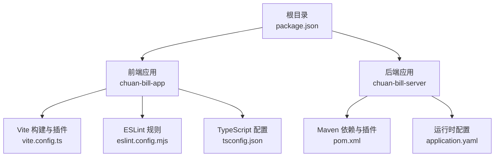
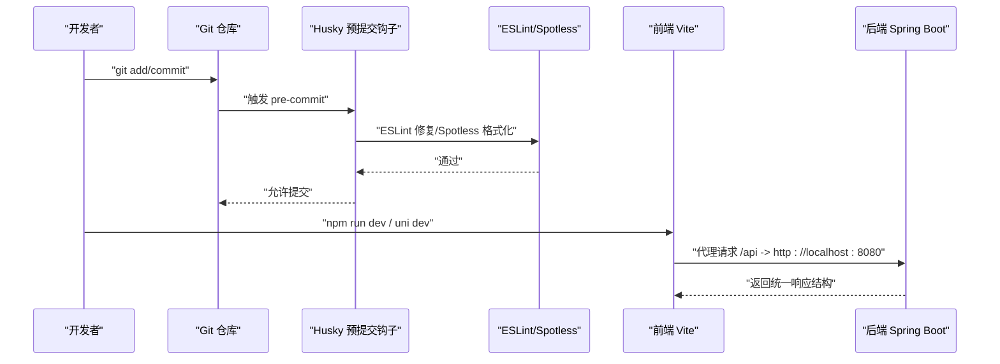
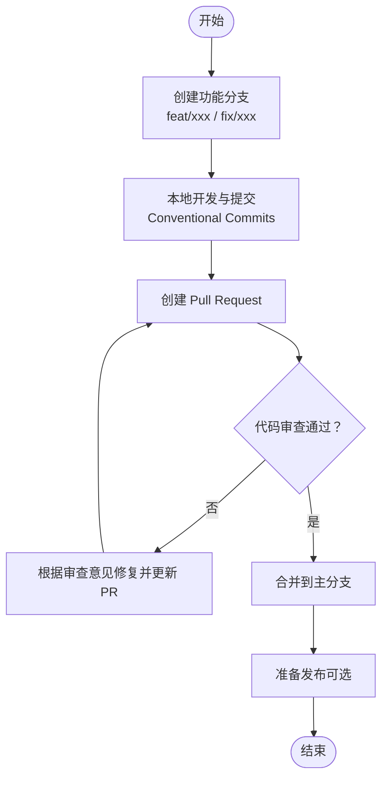
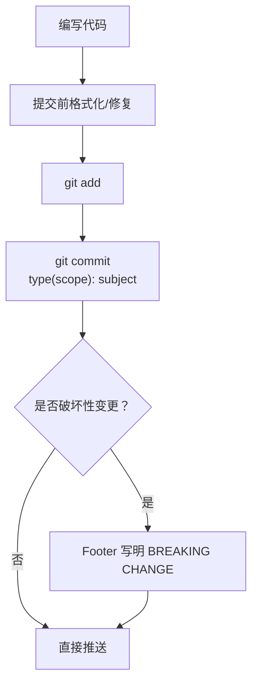
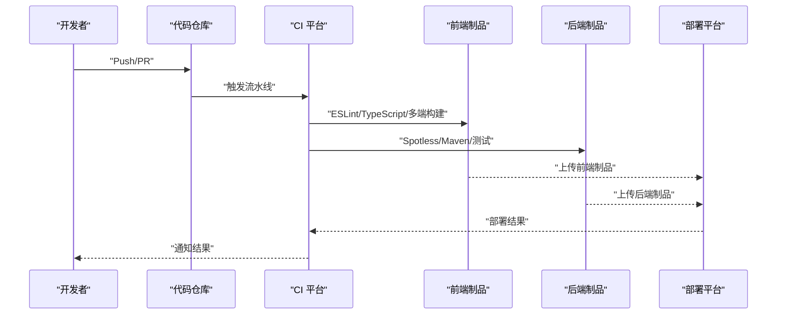
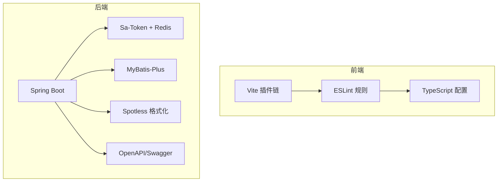

# 开发流程

<cite>
**本文引用的文件**
- [package.json](file://package.json)
- [commitlint.config.js](file://commitlint.config.js)
- [PRD.md](file://PRD.md)
- [CLAUDE.md](file://CLAUDE.md)
- [chuan-bill-app/package.json](file://chuan-bill-app/package.json)
- [chuan-bill-server/pom.xml](file://chuan-bill-server/pom.xml)
- [chuan-bill-app/.gitignore](file://chuan-bill-app/.gitignore)
- [chuan-bill-server/.gitignore](file://chuan-bill-server/.gitignore)
- [chuan-bill-app/vite.config.ts](file://chuan-bill-app/vite.config.ts)
- [chuan-bill-app/eslint.config.mjs](file://chuan-bill-app/eslint.config.mjs)
- [chuan-bill-app/tsconfig.json](file://chuan-bill-app/tsconfig.json)
- [chuan-bill-server/src/main/resources/application.yaml](file://chuan-bill-server/src/main/resources/application.yaml)
</cite>

## 目录
1. [引言](#引言)
2. [项目结构](#项目结构)
3. [核心组件](#核心组件)
4. [架构总览](#架构总览)
5. [详细组件分析](#详细组件分析)
6. [依赖分析](#依赖分析)
7. [性能考虑](#性能考虑)
8. [故障排查指南](#故障排查指南)
9. [结论](#结论)
10. [附录](#附录)

## 引言
本文件面向“小川记账”项目团队，提供一套完整的开发流程规范，覆盖分支管理、代码审查、版本发布、变更管理、提交规范、持续集成与部署、开发工作流与最佳实践。文档基于仓库现有配置与约定进行提炼，并结合前后端技术栈给出可落地的流程建议。

## 项目结构
项目采用双应用单仓（Monorepo）结构：
- 前端应用：chuan-bill-app（uni-app/Vue 3/TypeScript，跨平台移动应用）
- 后端应用：chuan-bill-server（Spring Boot 3/Java 17，MySQL + Redis）

根目录提供统一脚本与工具链，分别驱动前后端开发、格式化与校验；各子项目拥有独立的包管理与构建配置。

**图示来源**
- [package.json:1-29](file://package.json#L1-L29)
- [chuan-bill-app/vite.config.ts:1-80](file://chuan-bill-app/vite.config.ts#L1-L80)
- [chuan-bill-app/eslint.config.mjs:1-18](file://chuan-bill-app/eslint.config.mjs#L1-L18)
- [chuan-bill-app/tsconfig.json:1-30](file://chuan-bill-app/tsconfig.json#L1-L30)
- [chuan-bill-server/pom.xml:1-226](file://chuan-bill-server/pom.xml#L1-L226)
- [chuan-bill-server/src/main/resources/application.yaml:1-51](file://chuan-bill-server/src/main/resources/application.yaml#L1-L51)

**章节来源**
- [package.json:1-29](file://package.json#L1-L29)
- [PRD.md:1-168](file://PRD.md#L1-L168)
- [CLAUDE.md:1-78](file://CLAUDE.md#L1-L78)

## 核心组件
- 提交规范与校验
  - 使用 Commitlint + Conventional Commits，确保提交消息标准化。
  - 根 husky 预提交钩子配合 lint-staged，前端在提交前自动 ESLint 修复，后端使用 Spotless 应用格式化。
- 代码质量与风格
  - 前端：ESLint + @uni-helper/eslint-config；TypeScript 严格模式；UnoCSS。
  - 后端：Spotless + Palantir Java Format；Lombok；MyBatis-Plus。
- 构建与运行
  - 前端：Vite + uni-app 插件生态；多端构建命令；代理指向后端 8080。
  - 后端：Spring Boot Maven 插件；OpenAPI/Swagger 文档；Redis + Sa-Token 认证。
- 版本与发布
  - 根脚本统一启动与校验；后端使用 Maven 插件；前端可引入 standard-version 进行语义化版本管理（需在前端工程中启用）。

**章节来源**
- [commitlint.config.js:1-4](file://commitlint.config.js#L1-L4)
- [chuan-bill-app/package.json:11-56](file://chuan-bill-app/package.json#L11-L56)
- [chuan-bill-server/pom.xml:171-223](file://chuan-bill-server/pom.xml#L171-L223)
- [chuan-bill-app/vite.config.ts:70-79](file://chuan-bill-app/vite.config.ts#L70-L79)
- [chuan-bill-server/src/main/resources/application.yaml:1-51](file://chuan-bill-server/src/main/resources/application.yaml#L1-L51)

## 架构总览
下图展示从开发者提交到本地开发环境运行的整体流程，以及前后端交互路径。

**图示来源**
- [package.json:6-16](file://package.json#L6-L16)
- [commitlint.config.js:1-4](file://commitlint.config.js#L1-L4)
- [chuan-bill-app/package.json:11-56](file://chuan-bill-app/package.json#L11-L56)
- [chuan-bill-app/vite.config.ts:70-79](file://chuan-bill-app/vite.config.ts#L70-L79)
- [chuan-bill-server/pom.xml:171-223](file://chuan-bill-server/pom.xml#L171-L223)

## 详细组件分析

### Git 分支管理策略
- 主分支保护
  - master/main 仅允许通过 Pull Request 合并，禁止直接推送。
  - 合并前必须通过 CI 校验（lint、测试、格式化检查）。
- 功能分支命名规范
  - feat/xxx：新增功能
  - fix/xxx：缺陷修复
  - docs/xxx：文档更新
  - refactor/xxx：重构但不改变行为
  - chore/xxx：构建流程、依赖更新等杂项
- 热修复分支
  - hotfix/xxx：紧急修复线上问题，从 release/tag 分支切出，修复后同时合并回 main 与 develop，并打补丁标签。

[本图为概念性流程示意，无需图示来源]

### 代码审查流程
- Pull Request 模板
  - 必填字段：变更描述、影响范围、测试验证、风险评估、回滚预案。
- 审查清单
  - 代码风格与规范符合性（ESLint/Spotless）。
  - 单元测试与集成测试覆盖率与通过率。
  - 性能与安全性评估（内存泄漏、SQL 注入、鉴权绕过等）。
  - 文档与注释完整性。
- 合并策略
  - 仅允许 Squash 合并，保持提交历史整洁。
  - 合并后自动触发 CI，失败需立即修复。

[本节为通用流程说明，无需章节来源]

### 版本发布流程
- 版本号规则（语义化版本）
  - 主版本号：破坏性变更
  - 次版本号：向下兼容的功能新增
  - 修订号：向下兼容的问题修正
- 发布准备
  - 更新 CHANGELOG，核对已合并的 PR 类型。
  - 前端可使用 standard-version 生成版本文件与标签（需在前端工程启用）。
- 发布步骤
  - 在主分支上创建 tag（vX.Y.Z），触发 CI 构建与制品打包。
  - 后端使用 Maven 插件生成可执行包；前端多端构建产物归档。
- 回滚机制
  - 若发布后出现严重问题，回滚至最近稳定 tag，重新打补丁版本并发布。

[本节为通用流程说明，无需章节来源]

### 变更管理流程
- 需求变更评估
  - 影响分析：涉及模块、接口、数据库、第三方依赖。
  - 风险评估：性能、安全、兼容性、回归风险。
- 测试验证
  - 自动化测试：单元测试、集成测试、端到端测试。
  - 手工测试：关键路径与边界场景。
- 变更实施
  - 小步快跑，尽早集成，尽早验证。
  - 对接口与数据库变更做好兼容与迁移策略。

[本节为通用流程说明，无需章节来源]

### 提交规范与 Conventional Commits
- 提交消息格式
  - type(scope): subject
  - body（可选）：详细说明变更动机与影响。
  - footer（可选）：破坏性变更说明与关闭 Issue。
- 类型定义
  - feat：新增功能
  - fix：缺陷修复
  - docs：文档更新
  - style：不影响逻辑的样式调整
  - refactor：重构但不改变行为
  - perf：性能优化
  - test：测试相关
  - build：构建流程、外部依赖等
  - ci：CI 相关
  - chore：杂务
- 破坏性变更
  - 在 Footer 中使用 BREAKING CHANGE:，并在 type 后标注 !

**图示来源**
- [commitlint.config.js:1-4](file://commitlint.config.js#L1-L4)

**章节来源**
- [commitlint.config.js:1-4](file://commitlint.config.js#L1-L4)
- [package.json:6-16](file://package.json#L6-L16)
- [chuan-bill-app/package.json:112-133](file://chuan-bill-app/package.json#L112-L133)
- [chuan-bill-server/pom.xml:197-221](file://chuan-bill-server/pom.xml#L197-L221)

### 持续集成与部署
- 根脚本统一入口
  - pnpm start：并发启动前端与后端。
  - pnpm lint / pnpm lint:fix：统一前后端代码质量检查与修复。
- 前端 CI 关键点
  - ESLint 检查与修复（lint-staged）。
  - TypeScript 类型检查（vue-tsc）。
  - 多端构建（微信小程序、App、H5）。
- 后端 CI 关键点
  - Spotless 格式化检查与应用。
  - Maven 构建与测试（Surefire/Failsafe）。
  - OpenAPI/Swagger 文档可用性检查。
- 部署建议
  - 前端：静态资源托管（CDN/对象存储），支持灰度与蓝绿发布。
  - 后端：容器化镜像，滚动更新，健康检查，灰度流量切换。

**图示来源**
- [package.json:6-16](file://package.json#L6-L16)
- [chuan-bill-app/package.json:11-56](file://chuan-bill-app/package.json#L11-L56)
- [chuan-bill-server/pom.xml:171-223](file://chuan-bill-server/pom.xml#L171-L223)

**章节来源**
- [package.json:6-16](file://package.json#L6-L16)
- [chuan-bill-app/package.json:11-56](file://chuan-bill-app/package.json#L11-L56)
- [chuan-bill-server/pom.xml:171-223](file://chuan-bill-server/pom.xml#L171-L223)

### 开发工作流图与最佳实践
- 工作流图
  - 从分支创建到 PR 合并再到发布的完整闭环。
- 最佳实践
  - 提交前先执行 lint 与类型检查。
  - 小步提交，频繁同步主分支，减少冲突。
  - 为每个功能编写最小可测用例。
  - 使用一致的命名与目录结构，降低认知负担。

[本图为概念性流程示意，无需图示来源]

**章节来源**
- [PRD.md:160-168](file://PRD.md#L160-L168)
- [CLAUDE.md:48-78](file://CLAUDE.md#L48-L78)

## 依赖分析
- 前端依赖与配置
  - Vite 插件链：页面、布局、组件自动注册、UnoCSS、ECharts、Bundle Optimizer。
  - ESLint 规则：基于 @uni-helper/eslint-config，开启 Unocss 规则。
  - TypeScript：严格模式与路径别名配置。
- 后端依赖与配置
  - Spring Boot 3 + Sa-Token + Redis + MyBatis-Plus。
  - Spotless + Palantir Java Format。
  - OpenAPI/Swagger 文档生成。

**图示来源**
- [chuan-bill-app/vite.config.ts:22-69](file://chuan-bill-app/vite.config.ts#L22-L69)
- [chuan-bill-app/eslint.config.mjs:1-18](file://chuan-bill-app/eslint.config.mjs#L1-L18)
- [chuan-bill-app/tsconfig.json:1-30](file://chuan-bill-app/tsconfig.json#L1-L30)
- [chuan-bill-server/pom.xml:51-169](file://chuan-bill-server/pom.xml#L51-L169)
- [chuan-bill-server/src/main/resources/application.yaml:1-51](file://chuan-bill-server/src/main/resources/application.yaml#L1-L51)

**章节来源**
- [chuan-bill-app/vite.config.ts:1-80](file://chuan-bill-app/vite.config.ts#L1-L80)
- [chuan-bill-app/eslint.config.mjs:1-18](file://chuan-bill-app/eslint.config.mjs#L1-L18)
- [chuan-bill-app/tsconfig.json:1-30](file://chuan-bill-app/tsconfig.json#L1-L30)
- [chuan-bill-server/pom.xml:1-226](file://chuan-bill-server/pom.xml#L1-L226)
- [chuan-bill-server/src/main/resources/application.yaml:1-51](file://chuan-bill-server/src/main/resources/application.yaml#L1-L51)

## 性能考虑
- 前端
  - 使用 Bundle Optimizer 针对微信小程序优化体积。
  - UnoCSS 按需引入与 Tree-shaking。
  - ECharts 按需加载与懒编译。
- 后端
  - Redis 缓存热点数据与会话。
  - MyBatis-Plus 分页与软删除，避免全表扫描。
  - Sa-Token 令牌存储于 Redis，支持分布式共享。

[本节为通用指导，无需章节来源]

## 故障排查指南
- 提交被拒绝
  - 检查提交消息是否符合 Conventional Commits。
  - 确认 pre-commit 钩子已安装且通过 ESLint/Spotless。
- 本地联调失败
  - 检查 Vite 代理是否正确指向后端 8080。
  - 确认后端数据库与 Redis 连接参数。
- 构建失败
  - 前端：TypeScript 类型错误或 ESLint 报错。
  - 后端：Spotless 格式化失败或 Maven 插件报错。

**章节来源**
- [package.json:6-16](file://package.json#L6-L16)
- [chuan-bill-app/vite.config.ts:70-79](file://chuan-bill-app/vite.config.ts#L70-L79)
- [chuan-bill-server/src/main/resources/application.yaml:1-51](file://chuan-bill-server/src/main/resources/application.yaml#L1-L51)

## 结论
本文件基于仓库现有配置，给出了“小川记账”项目的开发流程规范与最佳实践。建议团队在实际执行中补充 CI/CD 流水线与发布策略细节，并在前端工程中启用 standard-version 以完善版本管理闭环。

## 附录
- 常用命令速查
  - 根：pnpm start、pnpm lint、pnpm lint:fix
  - 前端：pnpm dev / uni dev、pnpm build、pnpm lint、pnpm type-check
  - 后端：mvn spring-boot:run、mvn spotless:check / mvn spotless:apply
- 配置文件要点
  - 前端：vite.config.ts（代理）、eslint.config.mjs（规则）、tsconfig.json（路径别名）
  - 后端：pom.xml（依赖与插件）、application.yaml（数据源与缓存）

**章节来源**
- [CLAUDE.md:12-29](file://CLAUDE.md#L12-L29)
- [chuan-bill-app/vite.config.ts:70-79](file://chuan-bill-app/vite.config.ts#L70-L79)
- [chuan-bill-app/eslint.config.mjs:1-18](file://chuan-bill-app/eslint.config.mjs#L1-L18)
- [chuan-bill-app/tsconfig.json:1-30](file://chuan-bill-app/tsconfig.json#L1-L30)
- [chuan-bill-server/pom.xml:171-223](file://chuan-bill-server/pom.xml#L171-L223)
- [chuan-bill-server/src/main/resources/application.yaml:1-51](file://chuan-bill-server/src/main/resources/application.yaml#L1-L51)