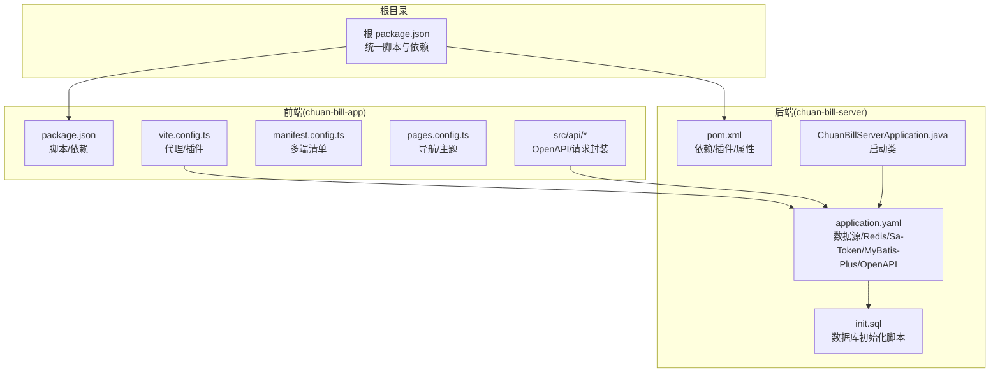
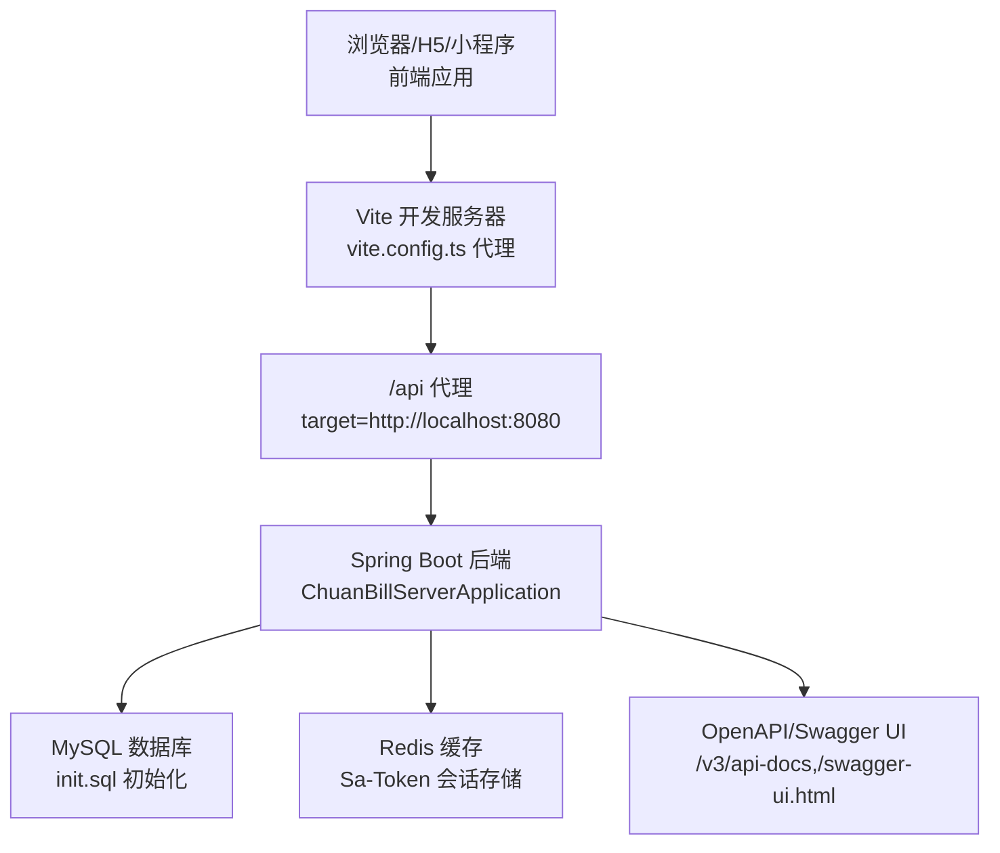
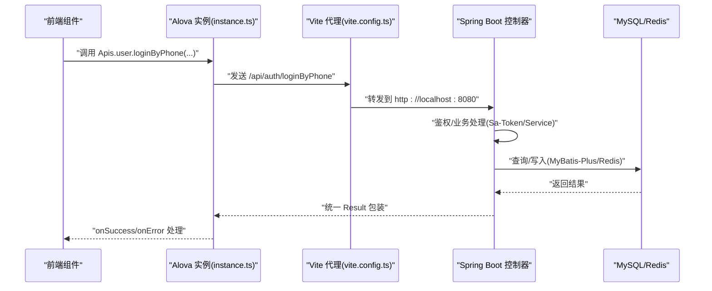
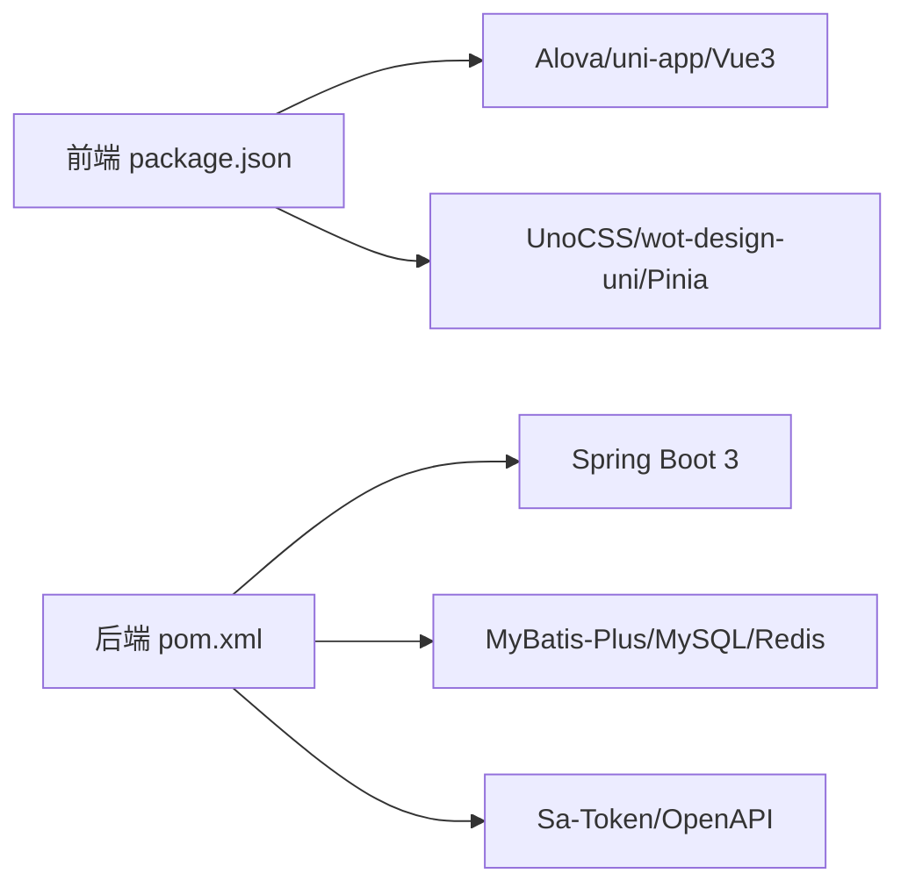

# 快速开始

<cite>
**本文引用的文件**
- [pom.xml](file://chuan-bill-server/pom.xml)
- [application.yaml](file://chuan-bill-server/src/main/resources/application.yaml)
- [init.sql](file://chuan-bill-server/init.sql)
- [ChuanBillServerApplication.java](file://chuan-bill-server/src/main/java/com/samoy/chuanbillserver/ChuanBillServerApplication.java)
- [package.json（根）](file://package.json)
- [package.json（前端）](file://chuan-bill-app/package.json)
- [vite.config.ts](file://chuan-bill-app/vite.config.ts)
- [manifest.config.ts](file://chuan-bill-app/manifest.config.ts)
- [pages.config.ts](file://chuan-bill-app/pages.config.ts)
- [.npmrc（前端）](file://chuan-bill-app/.npmrc)
- [apiDefinitions.ts](file://chuan-bill-app/src/api/apiDefinitions.ts)
- [createApis.ts](file://chuan-bill-app/src/api/createApis.ts)
- [instance.ts（前端API实例）](file://chuan-bill-app/src/api/core/instance.ts)
- [README（前端）](file://chuan-bill-app/README.md)
- [PRD.md](file://PRD.md)
- [CLAUDE.md](file://CLAUDE.md)
</cite>

## 目录
1. [简介](#简介)
2. [项目结构](#项目结构)
3. [核心组件](#核心组件)
4. [架构总览](#架构总览)
5. [详细组件分析](#详细组件分析)
6. [依赖关系分析](#依赖关系分析)
7. [性能考虑](#性能考虑)
8. [故障排查指南](#故障排查指南)
9. [结论](#结论)
10. [附录](#附录)

## 简介
本指南面向首次接触“小川记账”项目的开发者，提供从环境准备、项目克隆、依赖安装、数据库初始化，到前后端开发环境启动的完整流程，以及常见问题的解决方案。项目采用前后端分离的 Monorepo 结构：前端基于 uni-app/Vue 3/TypeScript，后端基于 Spring Boot 3/JDK 17/MySQL/Redis，通过 Vite 代理与后端联调。

## 项目结构
- 根目录提供统一的脚本与 Husky 配置，便于同时启动前后端与统一代码检查。
- 前端工程位于 chuan-bill-app，采用 Vite + uni-app 生态，页面与组件通过插件自动生成与加载。
- 后端工程位于 chuan-bill-server，采用 Spring Boot 3、MyBatis-Plus、Sa-Token、OpenAPI 等技术栈。

图示来源
- [package.json（根）:1-29](file://package.json#L1-L29)
- [package.json（前端）:1-135](file://chuan-bill-app/package.json#L1-L135)
- [vite.config.ts:1-80](file://chuan-bill-app/vite.config.ts#L1-L80)
- [manifest.config.ts:1-100](file://chuan-bill-app/manifest.config.ts#L1-L100)
- [pages.config.ts:1-43](file://chuan-bill-app/pages.config.ts#L1-L43)
- [pom.xml:1-226](file://chuan-bill-server/pom.xml#L1-L226)
- [ChuanBillServerApplication.java:1-15](file://chuan-bill-server/src/main/java/com/samoy/chuanbillserver/ChuanBillServerApplication.java#L1-L15)
- [application.yaml:1-51](file://chuan-bill-server/src/main/resources/application.yaml#L1-L51)
- [init.sql:1-326](file://chuan-bill-server/init.sql#L1-L326)

章节来源
- [package.json（根）:1-29](file://package.json#L1-L29)
- [package.json（前端）:1-135](file://chuan-bill-app/package.json#L1-L135)
- [vite.config.ts:1-80](file://chuan-bill-app/vite.config.ts#L1-L80)
- [manifest.config.ts:1-100](file://chuan-bill-app/manifest.config.ts#L1-L100)
- [pages.config.ts:1-43](file://chuan-bill-app/pages.config.ts#L1-L43)
- [pom.xml:1-226](file://chuan-bill-server/pom.xml#L1-L226)
- [ChuanBillServerApplication.java:1-15](file://chuan-bill-server/src/main/java/com/samoy/chuanbillserver/ChuanBillServerApplication.java#L1-L15)
- [application.yaml:1-51](file://chuan-bill-server/src/main/resources/application.yaml#L1-L51)
- [init.sql:1-326](file://chuan-bill-server/init.sql#L1-L326)

## 核心组件
- 前端 API 层：基于 Alova 的请求封装与 OpenAPI 定义，统一处理鉴权头、GET 防缓存、Mock 请求与响应拦截。
- 后端配置层：Spring Boot 应用通过 application.yaml 注入数据源、Redis、Sa-Token、MyBatis-Plus、OpenAPI 等配置。
- 数据库初始化：init.sql 提供完整的建库建表与系统默认类目/支付方式初始化数据。
- 开发脚本：根 package.json 提供一键启动前后端、统一代码检查与修复的脚本。

章节来源
- [apiDefinitions.ts:1-38](file://chuan-bill-app/src/api/apiDefinitions.ts#L1-L38)
- [createApis.ts:1-95](file://chuan-bill-app/src/api/createApis.ts#L1-L95)
- [instance.ts（前端API实例）:1-63](file://chuan-bill-app/src/api/core/instance.ts#L1-L63)
- [application.yaml:1-51](file://chuan-bill-server/src/main/resources/application.yaml#L1-L51)
- [init.sql:1-326](file://chuan-bill-server/init.sql#L1-L326)
- [package.json（根）:1-29](file://package.json#L1-L29)

## 架构总览
前后端通过 Vite 代理进行联调：前端在开发环境下将 /api 前缀请求转发至后端服务地址，后端提供 REST 接口并通过 OpenAPI/Swagger 进行文档化。

图示来源
- [vite.config.ts:70-78](file://chuan-bill-app/vite.config.ts#L70-L78)
- [ChuanBillServerApplication.java:1-15](file://chuan-bill-server/src/main/java/com/samoy/chuanbillserver/ChuanBillServerApplication.java#L1-L15)
- [application.yaml:1-51](file://chuan-bill-server/src/main/resources/application.yaml#L1-L51)
- [init.sql:1-326](file://chuan-bill-server/init.sql#L1-L326)

## 详细组件分析

### 前端开发环境启动
- 启动命令
  - H5 开发：在 chuan-bill-app 目录下执行开发脚本
  - 微信小程序开发：在 chuan-bill-app 目录下执行对应平台脚本
  - 根目录一键启动：使用根 package.json 的并发启动脚本
- 关键配置
  - Vite 代理：将 /api 前缀转发至后端服务地址
  - 多端清单：manifest.config.ts 配置各平台特性与权限
  - 页面与 Tabbar：pages.config.ts 定义导航样式与 Tab 列表
  - API 定义与生成：apiDefinitions.ts 与 createApis.ts 基于 OpenAPI 生成请求方法
- 注意事项
  - 确保后端服务已启动，否则前端代理无法访问接口
  - 如需切换环境变量，可在 .env 文件中配置 VITE_API_BASE_URL

章节来源
- [package.json（根）:6-16](file://package.json#L6-L16)
- [package.json（前端）:11-56](file://chuan-bill-app/package.json#L11-L56)
- [vite.config.ts:17-80](file://chuan-bill-app/vite.config.ts#L17-L80)
- [manifest.config.ts:12-99](file://chuan-bill-app/manifest.config.ts#L12-L99)
- [pages.config.ts:3-42](file://chuan-bill-app/pages.config.ts#L3-L42)
- [apiDefinitions.ts:19-37](file://chuan-bill-app/src/api/apiDefinitions.ts#L19-L37)
- [createApis.ts:65-76](file://chuan-bill-app/src/api/createApis.ts#L65-L76)
- [instance.ts（前端API实例）:7-60](file://chuan-bill-app/src/api/core/instance.ts#L7-L60)

### 后端开发环境启动
- 启动命令
  - 使用 Maven 插件直接运行 Spring Boot 应用
  - 或在 chuan-bill-server 目录下使用 IDE 启动主类
- 关键配置
  - JDK 版本：Java 17
  - 数据源：MySQL 驱动与连接参数
  - Redis：连接参数与连接池配置
  - Sa-Token：令牌名、超时、日志等
  - MyBatis-Plus：逻辑删除字段、日志输出
  - OpenAPI/Swagger：接口文档路径
- 注意事项
  - 确保数据库与 Redis 服务可用
  - 如需使用 DashScope OCR，需配置对应的环境变量

章节来源
- [pom.xml:29-31](file://chuan-bill-server/pom.xml#L29-L31)
- [application.yaml:4-51](file://chuan-bill-server/src/main/resources/application.yaml#L4-L51)
- [ChuanBillServerApplication.java:7-14](file://chuan-bill-server/src/main/java/com/samoy/chuanbillserver/ChuanBillServerApplication.java#L7-L14)

### 数据库初始化
- 初始化脚本
  - 提供完整的建库建表与索引
  - 包含系统默认类目与支付方式的初始化数据
- 执行步骤
  - 在 MySQL 中执行 init.sql，创建数据库与表结构
  - 确保数据库字符集与排序规则符合脚本要求
- 注意事项
  - 若已有同名库/表，建议先清理再执行
  - 如需自定义初始数据，可在执行后追加 INSERT

章节来源
- [init.sql:1-326](file://chuan-bill-server/init.sql#L1-L326)

### API 请求流程（前端 → 后端）

图示来源
- [instance.ts（前端API实例）:15-51](file://chuan-bill-app/src/api/core/instance.ts#L15-L51)
- [vite.config.ts:70-78](file://chuan-bill-app/vite.config.ts#L70-L78)
- [application.yaml:23-31](file://chuan-bill-server/src/main/resources/application.yaml#L23-L31)

## 依赖关系分析
- 前端依赖
  - uni-app/Vue 3/TypeScript 生态与 Vite
  - Alova 作为请求库，配合 OpenAPI 生成器
  - UnoCSS、wot-design-uni、Pinia、VueUse 等
- 后端依赖
  - Spring Boot 3、MyBatis-Plus、Sa-Token、Redis、MySQL 驱动
  - OpenAPI/Swagger 文档、Spotless 代码格式化、Lombok

图示来源
- [package.json（前端）:57-125](file://chuan-bill-app/package.json#L57-L125)
- [pom.xml:51-169](file://chuan-bill-server/pom.xml#L51-L169)

章节来源
- [package.json（前端）:1-135](file://chuan-bill-app/package.json#L1-L135)
- [pom.xml:1-226](file://chuan-bill-server/pom.xml#L1-L226)

## 性能考虑
- 前端
  - Vite 依赖预优化与按需组件加载，减少首屏体积
  - GET 请求附加时间戳防缓存，避免静态资源缓存问题
  - UnoCSS 原子化 CSS，提升样式编译效率
- 后端
  - MyBatis-Plus 分页与索引设计，结合 init.sql 中的索引提升查询性能
  - Sa-Token + Redis 存储令牌，降低数据库压力
  - OpenAPI 文档辅助接口调试，减少无效请求

章节来源
- [vite.config.ts:19-21](file://chuan-bill-app/vite.config.ts#L19-L21)
- [instance.ts（前端API实例）:23-26](file://chuan-bill-app/src/api/core/instance.ts#L23-L26)
- [application.yaml:32-39](file://chuan-bill-server/src/main/resources/application.yaml#L32-L39)

## 故障排查指南
- 端口冲突
  - 前端：Vite 默认端口被占用时，可在 Vite 配置中调整端口或关闭占用进程
  - 后端：Spring Boot 默认端口被占用时，可通过 JVM 参数或配置文件修改端口
- 数据库连接问题
  - 检查 application.yaml 中的数据库 URL、用户名、密码是否正确
  - 确认 init.sql 已成功执行，数据库与表存在
- 依赖安装失败
  - 前端：使用 pnpm 并确保 Node 版本满足 package.json 中 engines 要求；若遇到 peer 依赖冲突，可参考 .npmrc 的配置
  - 后端：使用 Maven 3.6+，JDK 17；若格式化检查失败，使用提供的 Spotless 命令修复
- 代理请求失败
  - 确认后端服务已启动且监听在 http://localhost:8080
  - 检查 Vite 代理配置是否指向正确的后端地址
- OpenAPI/Swagger 文档不可用
  - 确认 application.yaml 中的 OpenAPI 路径配置正确，且后端已启动

章节来源
- [vite.config.ts:70-78](file://chuan-bill-app/vite.config.ts#L70-L78)
- [application.yaml:4-51](file://chuan-bill-server/src/main/resources/application.yaml#L4-L51)
- [init.sql:1-326](file://chuan-bill-server/init.sql#L1-L326)
- [package.json（前端）:8-10](file://chuan-bill-app/package.json#L8-L10)
- [.npmrc（前端）:1-5](file://chuan-bill-app/.npmrc#L1-L5)
- [pom.xml:171-223](file://chuan-bill-server/pom.xml#L171-L223)

## 结论
按照本指南完成环境准备、项目克隆、依赖安装与数据库初始化后，即可通过根脚本或分别进入前后端目录启动开发服务。遇到问题时，优先检查端口、数据库连接与代理配置。项目提供了完善的脚手架与配置，便于快速迭代与团队协作。

## 附录

### 环境准备与安装步骤
- Node.js
  - 版本要求：满足前端 package.json 中 engines 的版本范围
  - 安装方式：推荐使用官方安装包或 nvm
- pnpm
  - 作为包管理器，确保版本与项目匹配
- JDK 17
  - Spring Boot 3 要求 JDK 17 或以上
- MySQL
  - 执行 init.sql 完成建库建表与初始化数据
- Redis（可选但推荐）
  - 用于 Sa-Token 会话存储与缓存

章节来源
- [package.json（前端）:8-10](file://chuan-bill-app/package.json#L8-L10)
- [pom.xml:30-31](file://chuan-bill-server/pom.xml#L30-L31)
- [init.sql:1-326](file://chuan-bill-server/init.sql#L1-L326)
- [application.yaml:9-21](file://chuan-bill-server/src/main/resources/application.yaml#L9-L21)

### 项目克隆与依赖安装
- 克隆仓库后，在根目录执行统一脚本以启动前后端或进行代码检查
- 前端依赖安装：在 chuan-bill-app 目录下使用 pnpm 安装
- 后端依赖安装：在 chuan-bill-server 目录下使用 Maven 安装

章节来源
- [package.json（根）:6-16](file://package.json#L6-L16)
- [package.json（前端）:1-135](file://chuan-bill-app/package.json#L1-L135)
- [pom.xml:1-226](file://chuan-bill-server/pom.xml#L1-L226)

### 数据库初始化具体操作
- 在 MySQL 中执行 init.sql，创建数据库与表结构
- 确保数据库字符集与排序规则符合脚本要求
- 如需自定义初始数据，可在执行后追加 INSERT

章节来源
- [init.sql:1-326](file://chuan-bill-server/init.sql#L1-L326)

### 前端开发环境启动命令
- H5 开发：在 chuan-bill-app 目录执行开发脚本
- 微信小程序开发：在 chuan-bill-app 目录执行对应平台脚本
- 根目录一键启动：使用根 package.json 的并发启动脚本

章节来源
- [package.json（根）:8-10](file://package.json#L8-L10)
- [package.json（前端）:11-31](file://chuan-bill-app/package.json#L11-L31)

### 后端开发环境启动命令
- 在 chuan-bill-server 目录使用 Maven 插件运行 Spring Boot 应用
- 或使用 IDE 启动主类

章节来源
- [ChuanBillServerApplication.java:11-13](file://chuan-bill-server/src/main/java/com/samoy/chuanbillserver/ChuanBillServerApplication.java#L11-L13)
- [pom.xml:186-196](file://chuan-bill-server/pom.xml#L186-L196)

### 关键配置文件说明
- 前端
  - vite.config.ts：代理与插件配置
  - manifest.config.ts：多端清单与权限配置
  - pages.config.ts：导航栏与 Tabbar 配置
  - apiDefinitions.ts / createApis.ts：OpenAPI 定义与请求生成
  - instance.ts：Alova 实例与请求/响应拦截
- 后端
  - application.yaml：数据源、Redis、Sa-Token、MyBatis-Plus、OpenAPI 等配置
  - init.sql：数据库初始化脚本

章节来源
- [vite.config.ts:17-80](file://chuan-bill-app/vite.config.ts#L17-L80)
- [manifest.config.ts:12-99](file://chuan-bill-app/manifest.config.ts#L12-L99)
- [pages.config.ts:3-42](file://chuan-bill-app/pages.config.ts#L3-L42)
- [apiDefinitions.ts:19-37](file://chuan-bill-app/src/api/apiDefinitions.ts#L19-L37)
- [createApis.ts:65-76](file://chuan-bill-app/src/api/createApis.ts#L65-L76)
- [instance.ts（前端API实例）:7-60](file://chuan-bill-app/src/api/core/instance.ts#L7-L60)
- [application.yaml:4-51](file://chuan-bill-server/src/main/resources/application.yaml#L4-L51)
- [init.sql:1-326](file://chuan-bill-server/init.sql#L1-L326)

### 项目结构概览
- 根目录：统一脚本与 Husky 配置
- chuan-bill-app：前端工程（uni-app/Vue 3/TypeScript）
- chuan-bill-server：后端工程（Spring Boot 3/JDK 17）

章节来源
- [CLAUDE.md:7-10](file://CLAUDE.md#L7-L10)
- [PRD.md:1-168](file://PRD.md#L1-L168)