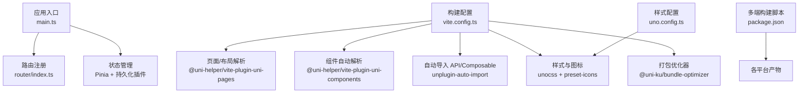
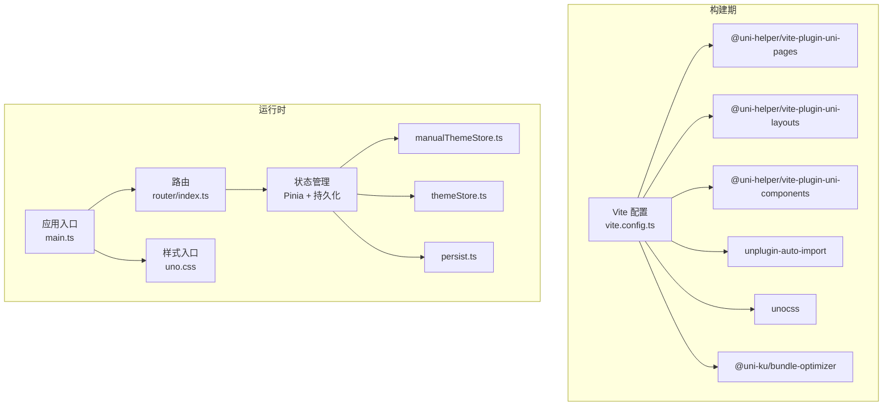
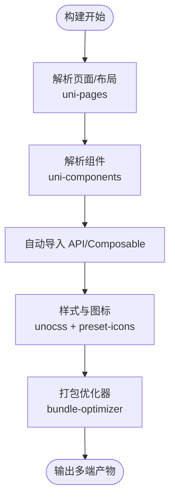
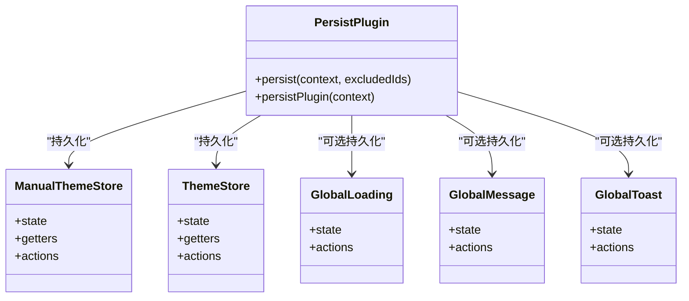
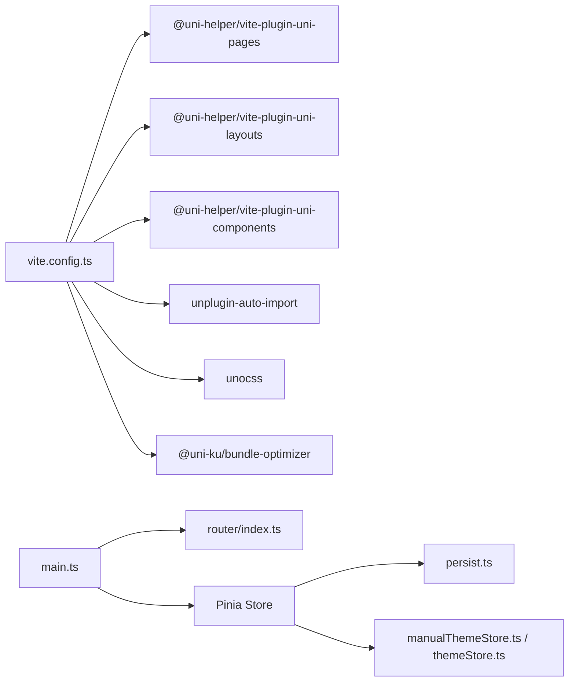

# 前端性能优化

<cite>
**本文引用的文件**
- [vite.config.ts](file://chuan-bill-app/vite.config.ts)
- [uno.config.ts](file://chuan-bill-app/uno.config.ts)
- [package.json](file://chuan-bill-app/package.json)
- [main.ts](file://chuan-bill-app/src/main.ts)
- [index.ts](file://chuan-bill-app/src/router/index.ts)
- [persist.ts](file://chuan-bill-app/src/store/persist.ts)
- [manualThemeStore.ts](file://chuan-bill-app/src/store/manualThemeStore.ts)
- [themeStore.ts](file://chuan-bill-app/src/store/themeStore.ts)
- [App.vue](file://chuan-bill-app/src/App.vue)
- [index.vue](file://chuan-bill-app/src/pages/bill/index.vue)
- [index.vue](file://chuan-bill-app/src/pages/statistics/index.vue)
- [useGlobalLoading.ts](file://chuan-bill-app/src/composables/useGlobalLoading.ts)
- [useGlobalMessage.ts](file://chuan-bill-app/src/composables/useGlobalMessage.ts)
- [useGlobalToast.ts](file://chuan-bill-app/src/composables/useGlobalToast.ts)
</cite>

## 目录
1. 引言
2. 项目结构
3. 核心组件
4. 架构总览
5. 详细组件分析
6. 依赖关系分析
7. 性能考量
8. 故障排查指南
9. 结论
10. 附录

## 引言
本指南面向“小川记账”前端团队，聚焦于在 Vite 构建体系与 Vue 3/Pinia 生态下的系统性性能优化实践。内容覆盖构建期优化（代码分割、懒加载、Tree Shaking、依赖预构建）、组件级优化（路由懒加载、keep-alive 缓存、虚拟滚动、图片懒加载）、样式与资源优化（UnoCSS 按需、图标与字体优化）、状态管理优化（Pinia 持久化、状态分片、响应式数据优化）、移动端性能（WebView 与触摸优化、内存泄漏防护）、以及性能监控与用户体验优化策略。

## 项目结构
该项目采用多端统一的 uni-app 3 + Vite 工程，核心目录与职责概览如下：
- 构建与插件：vite.config.ts 配置构建、插件链（pages/layout/components 解析、自动导入、UnoCSS、图表、打包优化器等）。
- 样式与图标：uno.config.ts 配置 UnoCSS 与图标集合，结合按需引入减少体积。
- 应用入口：main.ts 注册路由、Pinia、全局样式。
- 路由：基于 virtual:uni-pages 的动态路由生成与导航守卫。
- 状态管理：Pinia Store 及自定义持久化插件，按需持久化与排除策略。
- 页面与布局：pages/* 与 layouts/*，配合组件库与 UI 组件按需加载。
- 平台构建：package.json 提供多端构建脚本（微信小程序、H5、App 等）。

图示来源
- [vite.config.ts:17-79](file://chuan-bill-app/vite.config.ts#L17-L79)
- [uno.config.ts:10-37](file://chuan-bill-app/uno.config.ts#L10-L37)
- [main.ts:6-15](file://chuan-bill-app/src/main.ts#L6-L15)
- [package.json:11-55](file://chuan-bill-app/package.json#L11-L55)

章节来源
- [vite.config.ts:17-79](file://chuan-bill-app/vite.config.ts#L17-L79)
- [uno.config.ts:10-37](file://chuan-bill-app/uno.config.ts#L10-L37)
- [package.json:11-55](file://chuan-bill-app/package.json#L11-L55)
- [main.ts:6-15](file://chuan-bill-app/src/main.ts#L6-L15)

## 核心组件
- 构建与插件链：通过 Vite 插件链实现页面/布局/组件自动发现、自动导入、UnoCSS、打包优化器等能力，提升开发效率与产物体积。
- 路由与导航：基于虚拟页面生成路由表，结合导航守卫进行日志与拦截演示，便于扩展权限控制与埋点。
- 状态管理：Pinia + 自定义持久化插件，支持按 store id 排除持久化，避免敏感或临时数据写入缓存。
- 样式与图标：UnoCSS 按需引入与图标变体，减少未使用样式的体积；图标集合按需异步加载以降低首屏负担。
- 页面与布局：页面内组件按需引入，配合 UI 组件库按需解析，减少无关组件打包。

章节来源
- [vite.config.ts:22-68](file://chuan-bill-app/vite.config.ts#L22-L68)
- [index.ts:21-79](file://chuan-bill-app/src/router/index.ts#L21-L79)
- [persist.ts:12-38](file://chuan-bill-app/src/store/persist.ts#L12-L38)
- [uno.config.ts:10-37](file://chuan-bill-app/uno.config.ts#L10-L37)

## 架构总览
整体架构围绕“构建期优化 + 运行时优化”的双轴展开：构建期通过插件链与配置减少冗余代码与资源；运行时通过状态分片、懒加载、缓存策略与资源优化提升交互流畅度与首屏速度。

图示来源
- [vite.config.ts:17-79](file://chuan-bill-app/vite.config.ts#L17-L79)
- [main.ts:4-15](file://chuan-bill-app/src/main.ts#L4-L15)
- [index.ts:21-79](file://chuan-bill-app/src/router/index.ts#L21-L79)
- [manualThemeStore.ts:9-150](file://chuan-bill-app/src/store/manualThemeStore.ts#L9-L150)
- [themeStore.ts:10-74](file://chuan-bill-app/src/store/themeStore.ts#L10-L74)
- [persist.ts:12-38](file://chuan-bill-app/src/store/persist.ts#L12-L38)

## 详细组件分析

### 构建优化策略
- 代码分割与路由懒加载
  - 使用 @uni-helper/vite-plugin-uni-pages 自动生成路由，结合页面级组件按需引入，天然形成页面级代码分割。
  - 建议：将高频但非首屏使用的页面或大组件进一步拆分为动态 import，以获得更细粒度的分包。
- Tree Shaking 与自动导入
  - unplugin-auto-import 自动导入 Vue/Pinia/UniApp API 与自定义 composable，避免手动引入导致的副作用与未使用代码残留。
  - 建议：确保第三方库导出为 ES Module，避免打包器误判为副作用模块。
- 依赖预构建与排除
  - optimizeDeps.exclude 在开发环境排除大型依赖（如 wot-design-uni、uni-echarts），缩短冷启动时间。
  - 建议：生产环境可开启预构建缓存，平衡首次构建与二次构建时间。
- 打包优化器
  - @uni-ku/bundle-optimizer 针对小程序平台启用，减少包体与提升运行时性能。
  - 建议：结合平台差异（微信/支付宝/字节等）评估启用范围与日志开关。

图示来源
- [vite.config.ts:22-68](file://chuan-bill-app/vite.config.ts#L22-L68)

章节来源
- [vite.config.ts:17-79](file://chuan-bill-app/vite.config.ts#L17-L79)

### 组件级优化技术
- Vue 组件懒加载
  - 页面内组件按需引入，已在工程中体现；建议对大组件（如图表、富文本、复杂表单）进一步使用动态 import 实现按需加载。
  - 示例路径参考：[index.vue:1-54](file://chuan-bill-app/src/pages/bill/index.vue#L1-L54) 中对 QuickBillModal 的按需引入。
- keep-alive 缓存策略
  - 对频繁切换但状态稳定的页面（如首页、统计页）启用 keep-alive 缓存，减少重复渲染与请求。
  - 建议：结合路由元信息与页面生命周期，精细化控制缓存命中与失效策略。
- 虚拟滚动实现
  - 列表类页面（账单列表）建议引入虚拟滚动组件，限制可视区域内节点数量，显著降低 DOM 与重排压力。
  - 可结合现有 UI 组件库（如 wot-design-uni）提供的滚动容器或自研虚拟列表。
- 图片懒加载
  - 使用原生 lazy 属性与占位图，结合 CDN 与合适的图片格式（WebP/AVIF）与尺寸裁剪，减少带宽与内存占用。

章节来源
- [index.vue:1-54](file://chuan-bill-app/src/pages/bill/index.vue#L1-L54)
- [index.vue:1-23](file://chuan-bill-app/src/pages/statistics/index.vue#L1-L23)

### 样式与资源优化
- UnoCSS 按需引入
  - 通过 presetUni 与 transformerDirectives/transformerVariantGroup，按需生成样式，避免全量引入。
  - 建议：关闭未使用的变体与属性化开关，减少规则数量。
- 图标优化
  - presetIcons 支持图标变体与额外属性；建议仅引入实际使用的图标集合，按需异步加载以降低首屏体积。
- 字体优化
  - 优先使用系统字体与变量字体，必要时采用子集化字体与字体回退策略，避免阻塞渲染。
- 资源压缩与缓存
  - 构建阶段启用压缩与哈希命名；多端构建脚本中区分开发/生产模式，合理设置缓存头与版本号策略。

章节来源
- [uno.config.ts:10-37](file://chuan-bill-app/uno.config.ts#L10-L37)

### 状态管理优化
- Pinia Store 持久化配置
  - 自定义持久化插件支持按 store id 排除持久化（如 temp），避免敏感或临时数据写入缓存。
  - 建议：对大对象状态进行分片，仅持久化必要字段；在插件订阅中做深拷贝与去抖，降低存储压力。
- 状态分片与响应式数据优化
  - 将主题、全局弹窗、消息等状态拆分为独立 store，避免单一 store 过大导致的响应式开销。
  - 建议：使用 getters 计算派生状态，减少重复计算；对频繁更新的状态使用局部响应式与浅比较。

图示来源
- [persist.ts:12-38](file://chuan-bill-app/src/store/persist.ts#L12-L38)
- [manualThemeStore.ts:9-150](file://chuan-bill-app/src/store/manualThemeStore.ts#L9-L150)
- [themeStore.ts:10-74](file://chuan-bill-app/src/store/themeStore.ts#L10-L74)
- [useGlobalLoading.ts:13-37](file://chuan-bill-app/src/composables/useGlobalLoading.ts#L13-L37)
- [useGlobalMessage.ts:14-52](file://chuan-bill-app/src/composables/useGlobalMessage.ts#L14-L52)
- [useGlobalToast.ts:13-61](file://chuan-bill-app/src/composables/useGlobalToast.ts#L13-L61)

章节来源
- [persist.ts:12-38](file://chuan-bill-app/src/store/persist.ts#L12-L38)
- [manualThemeStore.ts:9-150](file://chuan-bill-app/src/store/manualThemeStore.ts#L9-L150)
- [themeStore.ts:10-74](file://chuan-bill-app/src/store/themeStore.ts#L10-L74)
- [useGlobalLoading.ts:13-37](file://chuan-bill-app/src/composables/useGlobalLoading.ts#L13-L37)
- [useGlobalMessage.ts:14-52](file://chuan-bill-app/src/composables/useGlobalMessage.ts#L14-L52)
- [useGlobalToast.ts:13-61](file://chuan-bill-app/src/composables/useGlobalToast.ts#L13-L61)

### 移动端性能优化
- WebView 与触摸优化
  - 启用触摸反馈与防抖点击，避免重复提交；对长列表使用 transform 与 will-change 提升滚动性能。
- 内存泄漏防护
  - 在页面离开时清理定时器、事件监听与全局状态；对大数组/对象使用弱引用或分块处理。
- 多端构建与差异化优化
  - 依据平台特性（微信/支付宝/字节/快应用/H5）调整打包策略与 polyfill，减少不必要的垫片与兼容代码。

章节来源
- [package.json:11-55](file://chuan-bill-app/package.json#L11-L55)

### 性能监控与用户体验优化
- 性能监控工具
  - 使用 uni-app 提供的性能面板与网络面板，结合浏览器/开发者工具的性能分析，定位卡顿与白屏。
- 性能指标
  - FP/FCP/LCP/FID/CLS 等指标在 H5 环境可采集；小程序端关注首屏渲染与接口耗时。
- 用户体验优化
  - 预加载关键资源、骨架屏与占位图、下拉刷新与上拉加载的节流、错误兜底与重试机制。

## 依赖关系分析
- 构建期依赖
  - @uni-helper/* 系列插件负责页面/布局/组件解析；unocss 与 unplugin-auto-import 提升开发与产物质量。
- 运行时依赖
  - vue、pinia、@wot-ui/router、wot-design-uni、uni-echarts 等构成核心运行时生态。
- 多端构建
  - package.json 提供多端构建脚本，覆盖微信/支付宝/字节/快应用/H5/App 等平台。

图示来源
- [vite.config.ts:22-68](file://chuan-bill-app/vite.config.ts#L22-L68)
- [main.ts:4-15](file://chuan-bill-app/src/main.ts#L4-L15)
- [index.ts:21-79](file://chuan-bill-app/src/router/index.ts#L21-L79)
- [persist.ts:12-38](file://chuan-bill-app/src/store/persist.ts#L12-L38)
- [manualThemeStore.ts:9-150](file://chuan-bill-app/src/store/manualThemeStore.ts#L9-L150)
- [themeStore.ts:10-74](file://chuan-bill-app/src/store/themeStore.ts#L10-L74)

章节来源
- [vite.config.ts:22-68](file://chuan-bill-app/vite.config.ts#L22-L68)
- [main.ts:4-15](file://chuan-bill-app/src/main.ts#L4-L15)
- [index.ts:21-79](file://chuan-bill-app/src/router/index.ts#L21-L79)
- [persist.ts:12-38](file://chuan-bill-app/src/store/persist.ts#L12-L38)
- [manualThemeStore.ts:9-150](file://chuan-bill-app/src/store/manualThemeStore.ts#L9-L150)
- [themeStore.ts:10-74](file://chuan-bill-app/src/store/themeStore.ts#L10-L74)

## 性能考量
- 构建期
  - 通过 optimizeDeps.exclude 与 bundle-optimizer 降低首屏体积与启动时间。
  - 自动导入减少样板代码，Tree Shaking 清理未使用模块。
- 运行时
  - keep-alive 缓存与组件懒加载降低重复渲染与网络请求。
  - Pinia 分片与持久化策略减少全局状态同步成本。
- 资源与样式
  - UnoCSS 按需与图标异步加载减少未使用资源。
- 移动端
  - 针对不同平台的差异化构建与 WebView 优化，提升滑动与交互流畅度。

## 故障排查指南
- 构建异常
  - 检查 optimizeDeps.exclude 与依赖版本兼容性；确认 @uni-ku/bundle-optimizer 的启用平台条件。
- 样式问题
  - UnoCSS 规则缺失时，检查 preset 与 transformer 配置；图标未显示时，确认图标集合是否按需异步加载。
- 状态异常
  - 持久化未生效时，核对 store id 是否在排除列表；深拷贝与订阅逻辑是否正确。
- 路由与导航
  - 导航守卫中的拦截逻辑影响性能时，建议移除或降级日志级别；确保 afterEach 钩子无阻塞操作。

章节来源
- [vite.config.ts:19-21](file://chuan-bill-app/vite.config.ts#L19-L21)
- [uno.config.ts:10-37](file://chuan-bill-app/uno.config.ts#L10-L37)
- [persist.ts:12-38](file://chuan-bill-app/src/store/persist.ts#L12-L38)
- [index.ts:24-59](file://chuan-bill-app/src/router/index.ts#L24-L59)

## 结论
通过在构建期与运行时双线并进的优化策略，小川记账可在多端环境下实现更小的包体、更快的首屏与更顺滑的交互体验。建议持续以指标驱动优化迭代，结合平台特性与用户反馈不断调优。

## 附录
- 多端构建脚本参考：[package.json:11-55](file://chuan-bill-app/package.json#L11-L55)
- 应用入口与全局样式：[main.ts:4-15](file://chuan-bill-app/src/main.ts#L4-L15)，[App.vue:1-16](file://chuan-bill-app/src/App.vue#L1-L16)