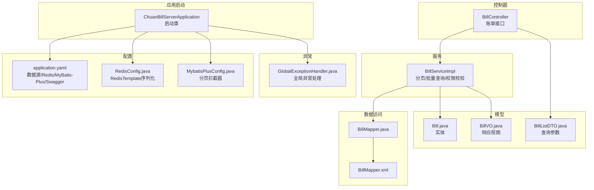
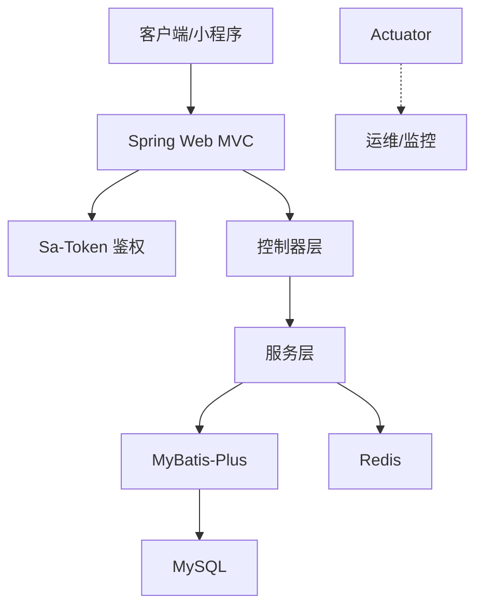
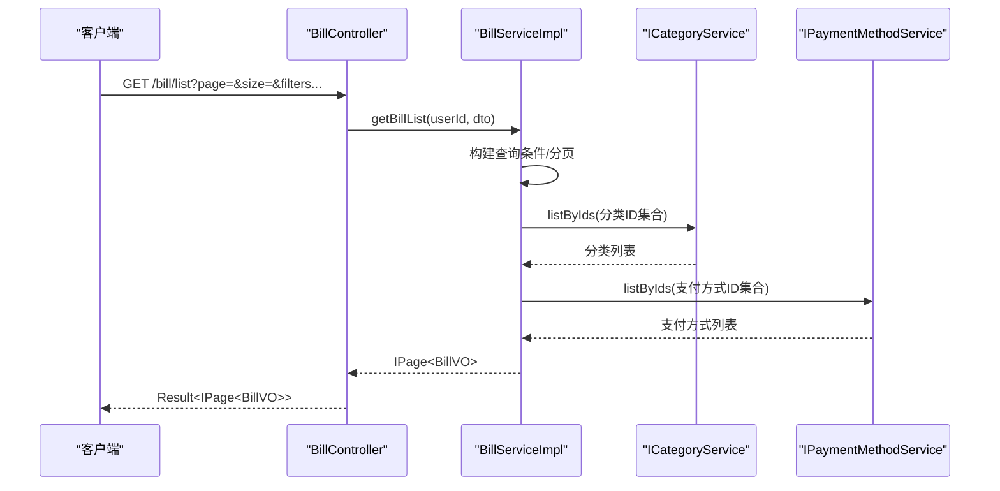
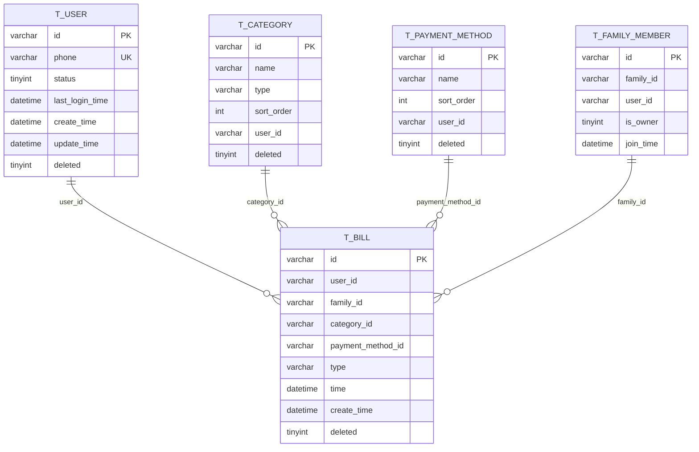
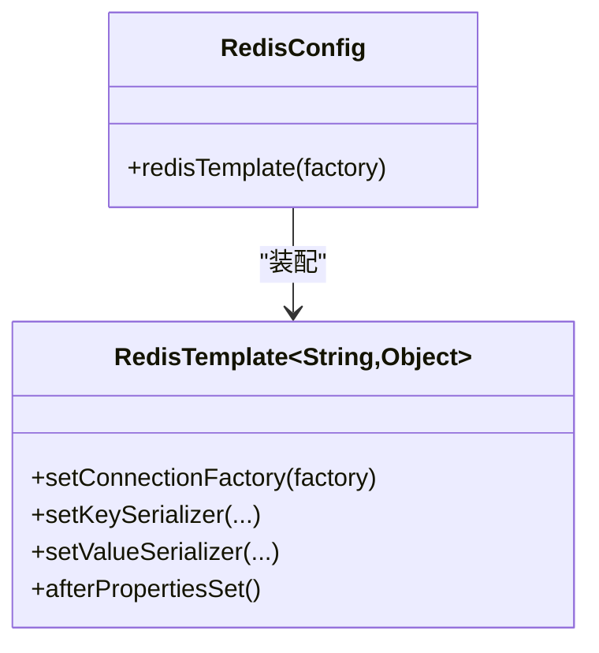
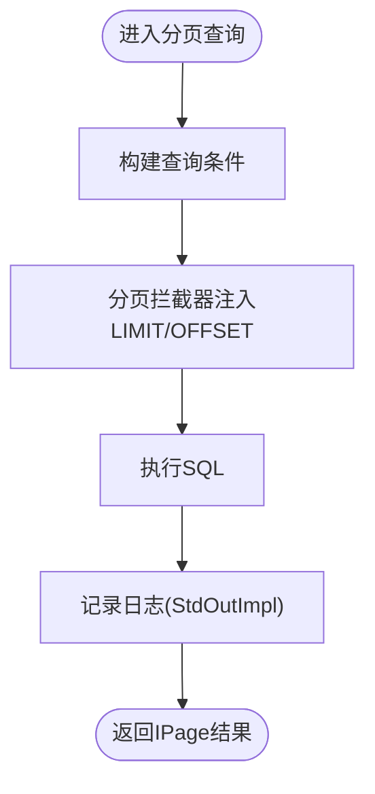
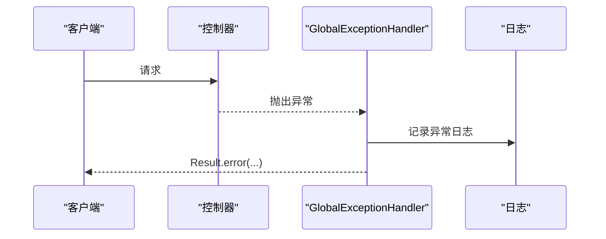
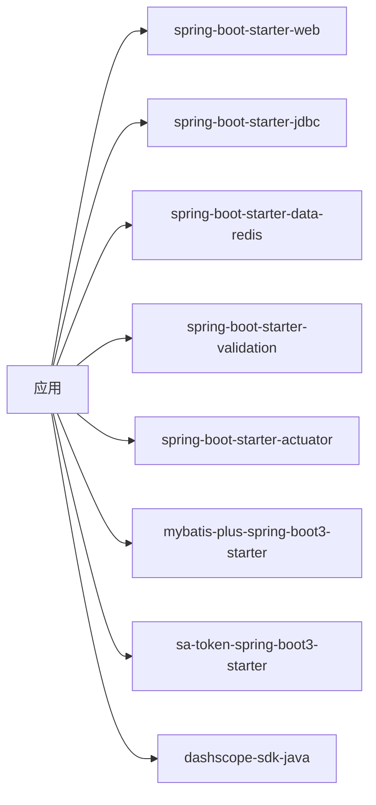

# 后端性能优化

<cite>
**本文引用的文件**
- [application.yaml](file://chuan-bill-server/src/main/resources/application.yaml)
- [pom.xml](file://chuan-bill-server/pom.xml)
- [init.sql](file://chuan-bill-server/init.sql)
- [RedisConfig.java](file://chuan-bill-server/src/main/java/com/samoy/chuanbillserver/config/RedisConfig.java)
- [MybatisPlusConfig.java](file://chuan-bill-server/src/main/java/com/samoy/chuanbillserver/config/MybatisPlusConfig.java)
- [ChuanBillServerApplication.java](file://chuan-bill-server/src/main/java/com/samoy/chuanbillserver/ChuanBillServerApplication.java)
- [BillController.java](file://chuan-bill-server/src/main/java/com/samoy/chuanbillserver/controller/BillController.java)
- [BillServiceImpl.java](file://chuan-bill-server/src/main/java/com/samoy/chuanbillserver/service/impl/BillServiceImpl.java)
- [BillMapper.java](file://chuan-bill-server/src/main/java/com/samoy/chuanbillserver/dao/BillMapper.java)
- [BillMapper.xml](file://chuan-bill-server/src/main/resources/mapper/BillMapper.xml)
- [Bill.java](file://chuan-bill-server/src/main/java/com/samoy/chuanbillserver/entity/Bill.java)
- [BillListDTO.java](file://chuan-bill-server/src/main/java/com/samoy/chuanbillserver/dto/BillListDTO.java)
- [BillVO.java](file://chuan-bill-server/src/main/java/com/samoy/chuanbillserver/vo/BillVO.java)
- [GlobalExceptionHandler.java](file://chuan-bill-server/src/main/java/com/samoy/chuanbillserver/expection/GlobalExceptionHandler.java)
</cite>

## 目录
1. [简介](#简介)
2. [项目结构](#项目结构)
3. [核心组件](#核心组件)
4. [架构总览](#架构总览)
5. [详细组件分析](#详细组件分析)
6. [依赖分析](#依赖分析)
7. [性能考虑](#性能考虑)
8. [故障排查指南](#故障排查指南)
9. [结论](#结论)
10. [附录](#附录)

## 简介
本指南面向“小川记账”后端，围绕 Spring Boot 性能优化展开，覆盖 JVM 参数、线程池与连接池、缓存策略、数据库查询与索引、批量操作、Redis 缓存优化、异步处理、服务降级与熔断、微服务与负载均衡、分布式缓存、以及性能监控与瓶颈分析方法。文档以仓库现有配置与代码为依据，结合最佳实践给出可落地的优化建议。

## 项目结构
后端采用 Spring Boot 3 + MyBatis-Plus 架构，主要模块包括：
- 配置层：应用配置、Redis 序列化配置、MyBatis-Plus 分页拦截器
- 控制器层：REST 接口定义与鉴权集成
- 服务层：业务逻辑与批量查询优化
- 数据访问层：基于 MyBatis-Plus 的 Mapper 接口
- 实体与 VO/DTO：数据模型与传输对象
- 异常处理：全局异常统一返回

**图表来源**
- [ChuanBillServerApplication.java:1-15](file://chuan-bill-server/src/main/java/com/samoy/chuanbillserver/ChuanBillServerApplication.java#L1-L15)
- [application.yaml:1-51](file://chuan-bill-server/src/main/resources/application.yaml#L1-L51)
- [RedisConfig.java:1-32](file://chuan-bill-server/src/main/java/com/samoy/chuanbillserver/config/RedisConfig.java#L1-L32)
- [MybatisPlusConfig.java:1-18](file://chuan-bill-server/src/main/java/com/samoy/chuanbillserver/config/MybatisPlusConfig.java#L1-L18)
- [BillController.java:1-91](file://chuan-bill-server/src/main/java/com/samoy/chuanbillserver/controller/BillController.java#L1-L91)
- [BillServiceImpl.java:1-244](file://chuan-bill-server/src/main/java/com/samoy/chuanbillserver/service/impl/BillServiceImpl.java#L1-L244)
- [BillMapper.java:1-15](file://chuan-bill-server/src/main/java/com/samoy/chuanbillserver/dao/BillMapper.java#L1-L15)
- [BillMapper.xml:1-6](file://chuan-bill-server/src/main/resources/mapper/BillMapper.xml#L1-L6)
- [Bill.java:1-113](file://chuan-bill-server/src/main/java/com/samoy/chuanbillserver/entity/Bill.java#L1-L113)
- [BillListDTO.java:1-42](file://chuan-bill-server/src/main/java/com/samoy/chuanbillserver/dto/BillListDTO.java#L1-L42)
- [BillVO.java:1-44](file://chuan-bill-server/src/main/java/com/samoy/chuanbillserver/vo/BillVO.java#L1-L44)
- [GlobalExceptionHandler.java:1-50](file://chuan-bill-server/src/main/java/com/samoy/chuanbillserver/expection/GlobalExceptionHandler.java#L1-L50)

**章节来源**
- [ChuanBillServerApplication.java:1-15](file://chuan-bill-server/src/main/java/com/samoy/chuanbillserver/ChuanBillServerApplication.java#L1-L15)
- [application.yaml:1-51](file://chuan-bill-server/src/main/resources/application.yaml#L1-L51)

## 核心组件
- 应用配置与外部依赖
  - 数据源与 Redis：通过环境变量注入，Redis 连接池较小，默认仅 8 并发
  - MyBatis-Plus：开启分页插件，日志输出便于开发调试
  - Swagger/OpenAPI：接口文档路径与开关
- Redis 序列化：键值采用字符串序列化，值采用 JSON 序列化，适合通用对象存储
- MyBatis-Plus 分页：MySQL 分页拦截器，避免全表扫描
- 控制器与服务：账单接口支持分页与多条件筛选；服务层对分类与支付方式进行批量查询，减少 N+1

**章节来源**
- [application.yaml:1-51](file://chuan-bill-server/src/main/resources/application.yaml#L1-L51)
- [pom.xml:1-226](file://chuan-bill-server/pom.xml#L1-L226)
- [RedisConfig.java:1-32](file://chuan-bill-server/src/main/java/com/samoy/chuanbillserver/config/RedisConfig.java#L1-L32)
- [MybatisPlusConfig.java:1-18](file://chuan-bill-server/src/main/java/com/samoy/chuanbillserver/config/MybatisPlusConfig.java#L1-L18)
- [BillController.java:1-91](file://chuan-bill-server/src/main/java/com/samoy/chuanbillserver/controller/BillController.java#L1-L91)
- [BillServiceImpl.java:1-244](file://chuan-bill-server/src/main/java/com/samoy/chuanbillserver/service/impl/BillServiceImpl.java#L1-L244)

## 架构总览
后端整体为单体应用，采用 Spring MVC + MyBatis-Plus + MySQL + Redis 的经典组合。鉴权使用 Sa-Token，Actuator 提供健康检查与指标导出能力。

**图表来源**
- [application.yaml:1-51](file://chuan-bill-server/src/main/resources/application.yaml#L1-L51)
- [pom.xml:50-168](file://chuan-bill-server/pom.xml#L50-L168)
- [ChuanBillServerApplication.java:1-15](file://chuan-bill-server/src/main/java/com/samoy/chuanbillserver/ChuanBillServerApplication.java#L1-L15)

## 详细组件分析

### 组件一：账单分页与批量查询优化
- 分页查询：控制器接收查询参数，服务层构造条件并分页
- 批量查询：服务层先收集需要的分类与支付方式 ID，再一次性批量查询，避免 N+1
- 权限校验：所有变更操作均校验账单归属用户，防止越权

**图表来源**
- [BillController.java:37-42](file://chuan-bill-server/src/main/java/com/samoy/chuanbillserver/controller/BillController.java#L37-L42)
- [BillServiceImpl.java:50-123](file://chuan-bill-server/src/main/java/com/samoy/chuanbillserver/service/impl/BillServiceImpl.java#L50-L123)

**章节来源**
- [BillController.java:1-91](file://chuan-bill-server/src/main/java/com/samoy/chuanbillserver/controller/BillController.java#L1-L91)
- [BillServiceImpl.java:1-244](file://chuan-bill-server/src/main/java/com/samoy/chuanbillserver/service/impl/BillServiceImpl.java#L1-L244)
- [BillListDTO.java:1-42](file://chuan-bill-server/src/main/java/com/samoy/chuanbillserver/dto/BillListDTO.java#L1-L42)
- [BillVO.java:1-44](file://chuan-bill-server/src/main/java/com/samoy/chuanbillserver/vo/BillVO.java#L1-L44)

### 组件二：数据库模型与索引设计
- 账单表 t_bill：按用户、家庭、时间、类型、类目、支付方式建立索引，满足高频查询
- 用户、类目、支付方式、家庭成员等表均有必要索引，支撑分页与筛选
- 建议：对常用过滤字段（如 user_id、family_id、time）保持高选择性；避免冗余索引

**图表来源**
- [init.sql:14-201](file://chuan-bill-server/init.sql#L14-L201)

**章节来源**
- [init.sql:1-326](file://chuan-bill-server/init.sql#L1-L326)
- [Bill.java:1-113](file://chuan-bill-server/src/main/java/com/samoy/chuanbillserver/entity/Bill.java#L1-L113)

### 组件三：Redis 缓存配置与序列化
- 连接池：默认 8 并发，连接等待为阻塞不限时，可能成为瓶颈
- 序列化：键值使用字符串，值使用 JSON，适合通用对象
- 建议：结合业务热点数据做缓存预热；为热点对象设置合理过期时间；避免大对象频繁序列化

**图表来源**
- [RedisConfig.java:1-32](file://chuan-bill-server/src/main/java/com/samoy/chuanbillserver/config/RedisConfig.java#L1-L32)
- [application.yaml:10-21](file://chuan-bill-server/src/main/resources/application.yaml#L10-L21)

**章节来源**
- [RedisConfig.java:1-32](file://chuan-bill-server/src/main/java/com/samoy/chuanbillserver/config/RedisConfig.java#L1-L32)
- [application.yaml:10-21](file://chuan-bill-server/src/main/resources/application.yaml#L10-L21)

### 组件四：MyBatis-Plus 分页与 SQL 优化
- 分页拦截器：自动为分页查询注入 LIMIT，避免全表扫描
- 日志：开发阶段开启标准输出日志，便于定位慢 SQL
- 建议：对复杂联表查询使用原生 SQL 或 XML 片段；为高频字段建立复合索引；避免 SELECT *；使用只读事务优化只读查询

**图表来源**
- [MybatisPlusConfig.java:1-18](file://chuan-bill-server/src/main/java/com/samoy/chuanbillserver/config/MybatisPlusConfig.java#L1-L18)
- [application.yaml:32-39](file://chuan-bill-server/src/main/resources/application.yaml#L32-L39)

**章节来源**
- [MybatisPlusConfig.java:1-18](file://chuan-bill-server/src/main/java/com/samoy/chuanbillserver/config/MybatisPlusConfig.java#L1-L18)
- [application.yaml:32-39](file://chuan-bill-server/src/main/resources/application.yaml#L32-L39)

### 组件五：全局异常处理与可观测性
- 全局异常：统一返回 Result，区分未登录、业务异常与其他异常
- Actuator：提供健康检查、指标导出，便于接入 APM
- 建议：为关键链路埋点；结合日志与指标进行根因分析

**图表来源**
- [GlobalExceptionHandler.java:1-50](file://chuan-bill-server/src/main/java/com/samoy/chuanbillserver/expection/GlobalExceptionHandler.java#L1-L50)
- [pom.xml:55-56](file://chuan-bill-server/pom.xml#L55-L56)

**章节来源**
- [GlobalExceptionHandler.java:1-50](file://chuan-bill-server/src/main/java/com/samoy/chuanbillserver/expection/GlobalExceptionHandler.java#L1-L50)
- [pom.xml:55-56](file://chuan-bill-server/pom.xml#L55-L56)

## 依赖分析
- Spring Boot Starter：Web、JDBC、Redis、Validation、Actuator
- MyBatis-Plus：分页、代码生成、JSQlParser
- Sa-Token：鉴权与会话管理
- DashScope SDK：OCR 等 AI 能力
- Lombok：简化实体类
- DevTools：开发热部署

**图表来源**
- [pom.xml:51-168](file://chuan-bill-server/pom.xml#L51-L168)

**章节来源**
- [pom.xml:1-226](file://chuan-bill-server/pom.xml#L1-L226)

## 性能考虑

### JVM 参数配置
- 堆大小：建议设置初始堆与最大堆，避免频繁 GC
- GC 策略：优先使用 G1 或 ZGC（取决于 JDK 版本），降低停顿
- 元空间：确保足够大，避免类加载失败
- JIT 优化：保留默认即可，必要时开启编译跟踪定位热点

[本节为通用指导，不直接分析具体文件]

### 线程池优化
- Web 线程池：由 Tomcat/NIO 默认线程池处理，建议结合压测调整
- 自定义线程池：对耗 CPU 或 IO 密集任务拆分线程池，避免相互影响
- 拒绝策略：使用 CallerRunsPolicy 保证关键请求不丢失

[本节为通用指导，不直接分析具体文件]

### 连接池配置
- MySQL 连接池：HikariCP 默认配置较优，建议根据 QPS 调整最大连接数与空闲连接
- Redis 连接池：当前仅 8，并发高时易阻塞；建议扩容并设置合理的超时与重试

**章节来源**
- [application.yaml:4-8](file://chuan-bill-server/src/main/resources/application.yaml#L4-L8)
- [application.yaml:16-21](file://chuan-bill-server/src/main/resources/application.yaml#L16-L21)

### 缓存策略
- 缓存穿透：对空值也做短时缓存，或使用布隆过滤器
- 缓存击穿：热点键设置互斥锁或独立永不过期键
- 缓存雪崩：为过期时间增加抖动，避免同时失效
- 热点数据：预热 + 多级缓存（本地 + 远程）

[本节为通用指导，不直接分析具体文件]

### 数据库性能优化
- SQL 查询优化：避免隐式转换、使用 EXPLAIN 分析执行计划
- 索引设计：复合索引遵循最左前缀原则；对高频过滤字段建立索引
- 批量操作：使用批量插入/更新，减少往返；分批处理大数据集
- 读写分离：高并发下引入从库读取，主库写入

**章节来源**
- [init.sql:133-158](file://chuan-bill-server/init.sql#L133-L158)
- [BillServiceImpl.java:90-120](file://chuan-bill-server/src/main/java/com/samoy/chuanbillserver/service/impl/BillServiceImpl.java#L90-L120)

### 异步处理优化
- 异步任务：对非关键路径（如日志、通知）异步化
- 消息队列：订单、通知等可靠性场景引入 MQ
- 并发控制：令牌桶/漏桶限流，保护下游

[本节为通用指导，不直接分析具体文件]

### 服务降级与熔断
- 熔断：对下游依赖设置超时与失败阈值，快速失败
- 降级：返回兜底数据或简化流程，保障核心功能
- 限流：网关或服务端限流，保护系统

[本节为通用指导，不直接分析具体文件]

### 微服务与分布式缓存
- 微服务拆分：按业务域拆分，减少耦合
- 负载均衡：Nginx/网关 + 服务发现
- 分布式缓存：Redis 集群 + 哨兵，提升可用性

[本节为通用指导，不直接分析具体文件]

### 性能监控与瓶颈分析
- 指标：QPS、P99 延迟、错误率、GC 时间、连接池使用率
- APM：SkyWalking/Jaeger + Prometheus/Grafana
- 方法：压力测试 + 灰度发布 + 回滚预案

[本节为通用指导，不直接分析具体文件]

## 故障排查指南
- 未登录/鉴权失败：检查 Sa-Token 配置与 Token 传递
- 业务异常：查看全局异常处理返回码与日志
- 数据库慢查询：开启慢日志，使用 EXPLAIN 分析
- Redis 阻塞：检查连接池配置与序列化开销
- 分页性能差：确认索引是否命中，避免不必要的排序与函数

**章节来源**
- [GlobalExceptionHandler.java:1-50](file://chuan-bill-server/src/main/java/com/samoy/chuanbillserver/expection/GlobalExceptionHandler.java#L1-L50)
- [application.yaml:23-30](file://chuan-bill-server/src/main/resources/application.yaml#L23-L30)

## 结论
本项目具备良好的基础配置与清晰的分层结构。建议优先从数据库索引与批量查询优化入手，配合 Redis 连接池扩容与缓存策略完善，逐步引入异步与限流机制，并完善监控与压测体系，持续迭代性能表现。

## 附录

### 关键配置清单
- 数据源与 Redis：通过环境变量注入，连接池默认较小
- MyBatis-Plus：开启分页与日志输出
- Swagger：接口文档路径与开关
- Actuator：健康检查与指标导出

**章节来源**
- [application.yaml:1-51](file://chuan-bill-server/src/main/resources/application.yaml#L1-L51)
- [pom.xml:55-56](file://chuan-bill-server/pom.xml#L55-L56)