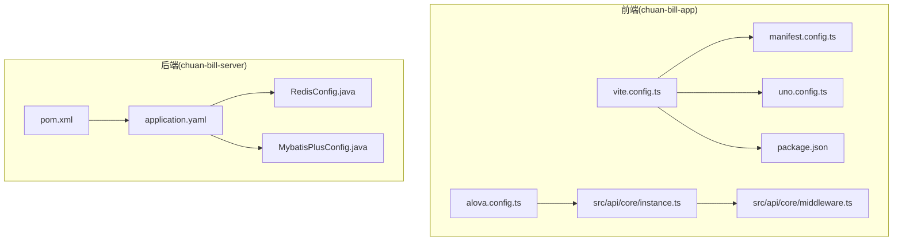
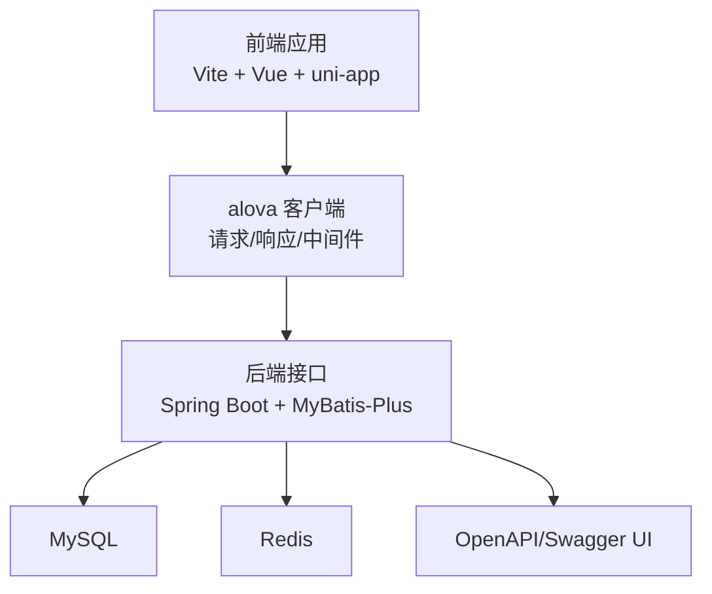
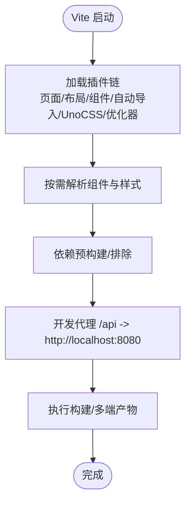
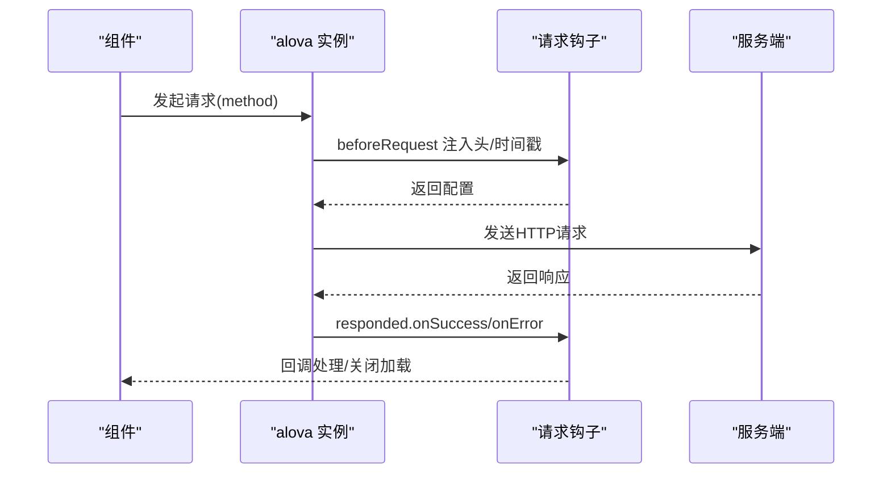
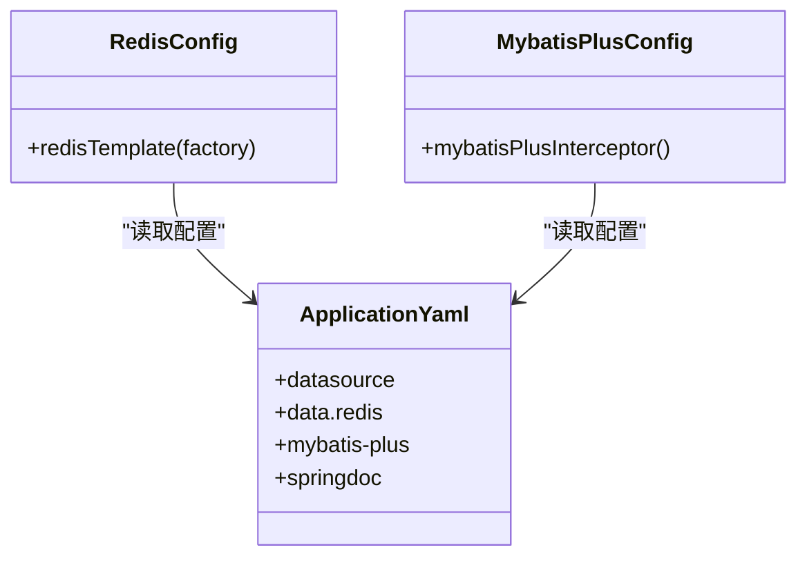
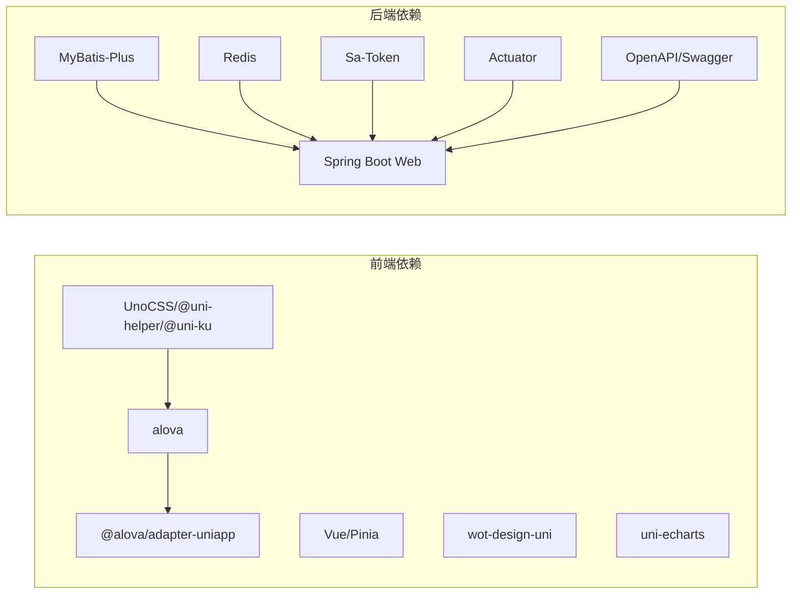

# 性能优化

<cite>
**本文引用的文件**
- [vite.config.ts](file://chuan-bill-app/vite.config.ts)
- [alova.config.ts](file://chuan-bill-app/alova.config.ts)
- [package.json](file://chuan-bill-app/package.json)
- [uno.config.ts](file://chuan-bill-app/uno.config.ts)
- [manifest.config.ts](file://chuan-bill-app/manifest.config.ts)
- [instance.ts](file://chuan-bill-app/src/api/core/instance.ts)
- [middleware.ts](file://chuan-bill-app/src/api/core/middleware.ts)
- [application.yaml](file://chuan-bill-server/src/main/resources/application.yaml)
- [RedisConfig.java](file://chuan-bill-server/src/main/java/com/samoy/chuanbillserver/config/RedisConfig.java)
- [MybatisPlusConfig.java](file://chuan-bill-server/src/main/java/com/samoy/chuanbillserver/config/MybatisPlusConfig.java)
- [pom.xml](file://chuan-bill-server/pom.xml)
</cite>

## 目录
1. [简介](#简介)
2. [项目结构](#项目结构)
3. [核心组件](#核心组件)
4. [架构总览](#架构总览)
5. [详细组件分析](#详细组件分析)
6. [依赖分析](#依赖分析)
7. [性能考虑](#性能考虑)
8. [故障排查指南](#故障排查指南)
9. [结论](#结论)
10. [附录](#附录)

## 简介
本指南面向“小川记账”项目的前端与后端性能优化，覆盖构建与打包优化、代码分割与懒加载、缓存策略、图片与字体优化、网络请求优化（含alova客户端）、数据库与缓存优化、连接池与异步处理、内存与CPU优化、并发优化、性能监控与测试、以及移动端与WebView的离线策略。文档在每个涉及具体实现细节的章节提供“章节来源”，以便读者定位到仓库中的真实配置与代码。

## 项目结构
- 前端工程位于 chuan-bill-app，采用 Vite + Vue 3 + uni-app 生态，通过 @uni-helper 系列插件与 @uni-ku/bundle-optimizer 进行页面、组件、布局与包体积优化，并集成 UnoCSS、自动导入等能力。
- 后端工程位于 chuan-bill-server，基于 Spring Boot 3 + MyBatis-Plus，使用 Actuator、Redis、Sa-Token、OpenAPI/Swagger 等技术栈，提供 REST 接口与文档。

图表来源
- [vite.config.ts:17-80](file://chuan-bill-app/vite.config.ts#L17-L80)
- [alova.config.ts:1-85](file://chuan-bill-app/alova.config.ts#L1-L85)
- [package.json:1-135](file://chuan-bill-app/package.json#L1-L135)
- [uno.config.ts:1-38](file://chuan-bill-app/uno.config.ts#L1-L38)
- [manifest.config.ts:63-63](file://chuan-bill-app/manifest.config.ts#L63-L63)
- [instance.ts:1-63](file://chuan-bill-app/src/api/core/instance.ts#L1-L63)
- [middleware.ts:1-93](file://chuan-bill-app/src/api/core/middleware.ts#L1-L93)
- [application.yaml:1-51](file://chuan-bill-server/src/main/resources/application.yaml#L1-L51)
- [RedisConfig.java:1-32](file://chuan-bill-server/src/main/java/com/samoy/chuanbillserver/config/RedisConfig.java#L1-L32)
- [MybatisPlusConfig.java:1-18](file://chuan-bill-server/src/main/java/com/samoy/chuanbillserver/config/MybatisPlusConfig.java#L1-L18)
- [pom.xml:1-226](file://chuan-bill-server/pom.xml#L1-L226)

章节来源
- [vite.config.ts:17-80](file://chuan-bill-app/vite.config.ts#L17-L80)
- [package.json:1-135](file://chuan-bill-app/package.json#L1-L135)

## 核心组件
- 前端构建与优化：Vite 插件链、按需组件解析、自动导入、UnoCSS、bundle 优化器、开发代理与依赖预构建。
- 网络层：alova 客户端实例、请求拦截、响应处理、全局加载中间件、Mock 适配。
- 后端配置：Redis 连接池与序列化、MyBatis-Plus 分页拦截器、Actuator 指标、Swagger/OpenAPI 文档。
- 构建产物与平台：manifest 优化开关、多端构建脚本。

章节来源
- [vite.config.ts:17-80](file://chuan-bill-app/vite.config.ts#L17-L80)
- [alova.config.ts:1-85](file://chuan-bill-app/alova.config.ts#L1-L85)
- [instance.ts:1-63](file://chuan-bill-app/src/api/core/instance.ts#L1-L63)
- [middleware.ts:1-93](file://chuan-bill-app/src/api/core/middleware.ts#L1-L93)
- [application.yaml:1-51](file://chuan-bill-server/src/main/resources/application.yaml#L1-L51)
- [RedisConfig.java:1-32](file://chuan-bill-server/src/main/java/com/samoy/chuanbillserver/config/RedisConfig.java#L1-L32)
- [MybatisPlusConfig.java:1-18](file://chuan-bill-server/src/main/java/com/samoy/chuanbillserver/config/MybatisPlusConfig.java#L1-L18)
- [pom.xml:1-226](file://chuan-bill-server/pom.xml#L1-L226)

## 架构总览
前端通过 Vite 构建，使用 @uni-helper 插件体系与 @uni-ku/bundle-optimizer 实现包体优化；网络层基于 alova，统一处理请求与响应；后端通过 Spring Boot 提供接口，使用 MyBatis-Plus、Redis、Sa-Token 等提升性能与稳定性；Actuator 开启后可暴露运行时指标，便于监控。

图表来源
- [vite.config.ts:17-80](file://chuan-bill-app/vite.config.ts#L17-L80)
- [alova.config.ts:1-85](file://chuan-bill-app/alova.config.ts#L1-L85)
- [application.yaml:1-51](file://chuan-bill-server/src/main/resources/application.yaml#L1-L51)
- [pom.xml:50-169](file://chuan-bill-server/pom.xml#L50-L169)

## 详细组件分析

### 前端构建与打包优化
- 插件链与优化
  - 页面/布局/组件插件：自动生成路由、布局与组件声明，减少手工维护成本。
  - 组件自动解析：Wot 设计与 ECharts 解析器按需引入，避免全量引入。
  - bundle 优化器：针对微信小程序平台启用优化，降低包体与运行时开销。
  - 自动导入：自动导入 Vue、@vueuse、Pinia、uni-app 与 wot-router 等常用模块，减少重复 import。
  - UnoCSS：原子化样式，按需生成，减少 CSS 体积。
  - 依赖预构建：开发模式下排除部分依赖，缩短冷启动时间。
  - 开发代理：本地 H5 开发时代理 /api 到后端 8080。
- 产物与平台
  - 多端构建脚本齐全，支持 H5、小程序、App 等平台。
  - manifest.optimization 开关可用于开启/关闭平台侧优化项。

图表来源
- [vite.config.ts:17-80](file://chuan-bill-app/vite.config.ts#L17-L80)
- [uno.config.ts:1-38](file://chuan-bill-app/uno.config.ts#L1-L38)
- [package.json:11-56](file://chuan-bill-app/package.json#L11-L56)
- [manifest.config.ts:63-63](file://chuan-bill-app/manifest.config.ts#L63-L63)

章节来源
- [vite.config.ts:17-80](file://chuan-bill-app/vite.config.ts#L17-L80)
- [uno.config.ts:1-38](file://chuan-bill-app/uno.config.ts#L1-L38)
- [package.json:11-56](file://chuan-bill-app/package.json#L11-L56)
- [manifest.config.ts:63-63](file://chuan-bill-app/manifest.config.ts#L63-L63)

### 代码分割与懒加载
- 页面级懒加载：通过 @uni-helper/vite-plugin-uni-pages 与路由配置，页面按需加载。
- 组件级懒加载：按需组件解析器仅在使用时引入，减少首屏体积。
- 动态导入：建议对大模块、图表、富文本等进行动态导入，结合路由守卫与骨架屏优化首屏体验。

章节来源
- [vite.config.ts:25-38](file://chuan-bill-app/vite.config.ts#L25-L38)

### 缓存策略
- 构建期缓存：Vite 默认缓存依赖与模块解析结果，减少二次构建时间。
- 运行时缓存：当前 alova 实例已关闭全局缓存，避免重复请求命中缓存导致的状态不一致问题；如需缓存，请在具体场景中使用中间件或局部缓存策略。
- 资源缓存：静态资源由构建工具生成带哈希名，配合 CDN/服务器缓存头策略长期缓存。

章节来源
- [vite.config.ts:19-21](file://chuan-bill-app/vite.config.ts#L19-L21)
- [instance.ts:56-60](file://chuan-bill-app/src/api/core/instance.ts#L56-L60)

### 图片与字体优化
- 图片：建议使用 WebP/JPEG2000 等现代格式；对图标使用 SVG 或 UnoCSS 图标能力；对大图采用懒加载与尺寸裁剪。
- 字体：优先使用系统字体与变量字体；通过 UnoCSS 的字体类按需使用，避免全量字体包。

章节来源
- [uno.config.ts:1-38](file://chuan-bill-app/uno.config.ts#L1-L38)

### 网络请求优化（alova 客户端）
- 客户端配置
  - baseURL：根据环境变量动态配置，H5 下自动拼接 /api。
  - 请求头：统一注入 Content-Type 与 token，GET 请求附加时间戳参数防止缓存。
  - 超时：默认 30 秒，可根据接口特性调整。
  - 响应处理：成功/失败/完成回调集中处理，便于统一提示与日志。
- 中间件
  - 全局加载中间件：支持延迟显示加载指示器，避免频繁请求造成闪烁。
  - 延迟加载中间件：在快速请求场景下减少 UI 抖动。
- Mock 适配：开发阶段可使用 mockAdapter，提高联调效率。

图表来源
- [instance.ts:15-51](file://chuan-bill-app/src/api/core/instance.ts#L15-L51)
- [middleware.ts:49-87](file://chuan-bill-app/src/api/core/middleware.ts#L49-L87)

章节来源
- [alova.config.ts:1-85](file://chuan-bill-app/alova.config.ts#L1-L85)
- [instance.ts:1-63](file://chuan-bill-app/src/api/core/instance.ts#L1-L63)
- [middleware.ts:1-93](file://chuan-bill-app/src/api/core/middleware.ts#L1-L93)

### 请求合并、防抖与节流
- 建议在高频输入/滚动/搜索等场景使用防抖/节流中间件，减少无效请求。
- 对于多字段联动查询，可将多个请求合并为单次请求，或使用批量接口。
- 结合 Alova 的 usePagination/useRequest，合理设置缓存与重试策略。

章节来源
- [middleware.ts:1-93](file://chuan-bill-app/src/api/core/middleware.ts#L1-L93)

### 错误重试机制
- 当前未配置自动重试，可在 useRequest 中增加 retry 策略（指数退避、最大次数）。
- 对网络波动与服务瞬断场景，建议区分幂等与非幂等请求，谨慎重试。

章节来源
- [instance.ts:56-60](file://chuan-bill-app/src/api/core/instance.ts#L56-L60)

### 后端性能优化（Spring Boot）
- Redis 缓存
  - 连接池：lettuce 默认池大小较小，建议根据 QPS 与并发调优 max-active/max-idle。
  - 序列化：字符串键与 JSON 值序列化，注意对象字段变更的兼容性。
- MyBatis-Plus
  - 分页拦截器：MySQL 分页内核，确保大数据量列表分页性能。
  - 日志：StdOutImpl 便于开发调试，生产建议切换为更轻量的日志实现。
- Actuator 指标
  - 开启 actuator，暴露 JVM、进程、HTTP 请求等指标，结合外部监控系统。
- Swagger/OpenAPI
  - 启用 API 文档与 UI，便于前后端联调与接口可视化。

图表来源
- [RedisConfig.java:1-32](file://chuan-bill-server/src/main/java/com/samoy/chuanbillserver/config/RedisConfig.java#L1-L32)
- [MybatisPlusConfig.java:1-18](file://chuan-bill-server/src/main/java/com/samoy/chuanbillserver/config/MybatisPlusConfig.java#L1-L18)
- [application.yaml:1-51](file://chuan-bill-server/src/main/resources/application.yaml#L1-L51)

章节来源
- [application.yaml:1-51](file://chuan-bill-server/src/main/resources/application.yaml#L1-L51)
- [RedisConfig.java:1-32](file://chuan-bill-server/src/main/java/com/samoy/chuanbillserver/config/RedisConfig.java#L1-L32)
- [MybatisPlusConfig.java:1-18](file://chuan-bill-server/src/main/java/com/samoy/chuanbillserver/config/MybatisPlusConfig.java#L1-L18)
- [pom.xml:50-169](file://chuan-bill-server/pom.xml#L50-L169)

### 数据库查询优化
- 使用分页拦截器限制一次性返回数据量。
- 为高频查询字段建立索引，避免全表扫描。
- 批量写入与事务合并，减少往返次数。
- 对复杂报表使用物化视图或缓存热点数据。

章节来源
- [MybatisPlusConfig.java:10-16](file://chuan-bill-server/src/main/java/com/samoy/chuanbillserver/config/MybatisPlusConfig.java#L10-L16)

### 异步处理与并发优化
- 对耗时任务（OCR、文件上传、报表计算）使用异步或消息队列解耦。
- 控制并发度，避免线程池饱和与上下文切换开销过大。
- 使用信号量/限流器保护下游依赖。

章节来源
- [application.yaml:16-21](file://chuan-bill-server/src/main/resources/application.yaml#L16-L21)

### 内存管理与垃圾回收优化
- 后端：合理设置堆大小与 GC 策略，关注 Full GC 触发频率与停顿时间。
- 前端：避免闭包持有长生命周期引用，及时清理事件监听与定时器，减少内存泄漏。

章节来源
- [application.yaml:16-21](file://chuan-bill-server/src/main/resources/application.yaml#L16-L21)

### CPU 使用率优化
- 减少主线程阻塞操作，将计算密集型任务迁移到 Web Workers 或服务端。
- 合理使用虚拟列表、懒渲染与可视区域裁剪。

章节来源
- [vite.config.ts:19-21](file://chuan-bill-app/vite.config.ts#L19-L21)

### 移动端与 WebView 性能优化
- 包体优化：启用 @uni-ku/bundle-optimizer，按平台裁剪与压缩。
- 资源优化：图片 WebP 化、字体子集化、样式按需。
- 离线缓存：利用 manifest.optimization 与 Service Worker（如需）缓存静态资源与接口数据。
- WebView：禁用不必要的 JS/CSS 注入，减少 DOM 数量，避免过度重绘与回流。

章节来源
- [vite.config.ts:46-49](file://chuan-bill-app/vite.config.ts#L46-L49)
- [manifest.config.ts:63-63](file://chuan-bill-app/manifest.config.ts#L63-L63)

## 依赖分析
- 前端依赖：alova、@alova/adapter-uniapp、Vue、Pinia、wot-design-uni、uni-echarts、UnoCSS、@uni-helper 系列插件、@uni-ku/bundle-optimizer。
- 后端依赖：Spring Boot Starter Web、MyBatis-Plus、Redis、Sa-Token、Actuator、OpenAPI/Swagger、Hutool、Lombok、Velocity。

图表来源
- [package.json:57-87](file://chuan-bill-app/package.json#L57-L87)
- [pom.xml:50-169](file://chuan-bill-server/pom.xml#L50-L169)

章节来源
- [package.json:57-87](file://chuan-bill-app/package.json#L57-L87)
- [pom.xml:50-169](file://chuan-bill-server/pom.xml#L50-L169)

## 性能考虑
- 构建与打包
  - 使用按需组件与自动导入，减少冗余代码。
  - 启用 bundle 优化器与 UnoCSS，降低包体与样式体积。
  - 依赖预构建与排除策略，缩短开发冷启动。
- 网络
  - 关闭全局缓存，避免状态不一致；在需要的场景使用局部缓存与中间件。
  - 统一超时与错误处理，结合防抖/节流与请求合并。
- 数据库与缓存
  - 分页与索引优化，Redis 连接池与序列化策略按压测结果调优。
  - 对热点数据设置 TTL 与降级策略。
- 并发与异步
  - 合理设置线程池与队列长度，避免过载。
  - 将耗时任务异步化，使用幂等设计与补偿机制。
- 监控与测试
  - 开启 Actuator 指标，采集 JVM、HTTP、业务指标。
  - 前端使用浏览器性能面板与 Network 面板，后端使用 APM 工具与慢查询日志。

章节来源
- [vite.config.ts:19-21](file://chuan-bill-app/vite.config.ts#L19-L21)
- [instance.ts:56-60](file://chuan-bill-app/src/api/core/instance.ts#L56-L60)
- [application.yaml:16-21](file://chuan-bill-server/src/main/resources/application.yaml#L16-L21)
- [pom.xml:50-169](file://chuan-bill-server/pom.xml#L50-L169)

## 故障排查指南
- 前端
  - 请求失败：检查 baseURL、headers 注入、Mock 适配器是否生效。
  - 加载闪烁：调整全局加载中间件的延迟阈值。
  - 构建缓慢：确认依赖预构建排除策略与插件链顺序。
- 后端
  - Redis 连接异常：检查 host/port/password 与连接池配置。
  - SQL 性能差：查看慢查询日志与索引使用情况。
  - 指标缺失：确认 Actuator 是否启用与暴露端点权限。

章节来源
- [instance.ts:15-51](file://chuan-bill-app/src/api/core/instance.ts#L15-L51)
- [middleware.ts:49-87](file://chuan-bill-app/src/api/core/middleware.ts#L49-L87)
- [application.yaml:10-21](file://chuan-bill-server/src/main/resources/application.yaml#L10-L21)
- [pom.xml:50-169](file://chuan-bill-server/pom.xml#L50-L169)

## 结论
通过前端构建优化、网络层中间件与缓存策略、后端 Redis/MyBatis-Plus/Actuator 的配置与调优，以及移动端与 WebView 的资源与包体优化，小川记账可在多端环境下获得更流畅的用户体验与更高的吞吐能力。建议持续以指标驱动优化，结合压测与 APM 工具迭代改进。

## 附录
- 前端构建脚本与多端命令参考：[package.json:11-56](file://chuan-bill-app/package.json#L11-L56)
- 后端依赖与插件清单参考：[pom.xml:50-169](file://chuan-bill-server/pom.xml#L50-L169)