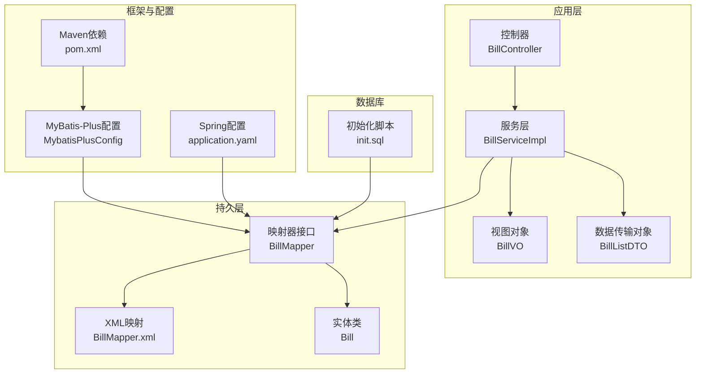
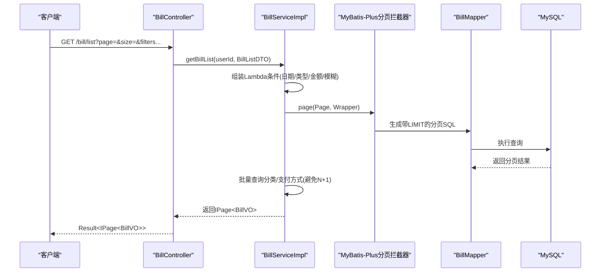
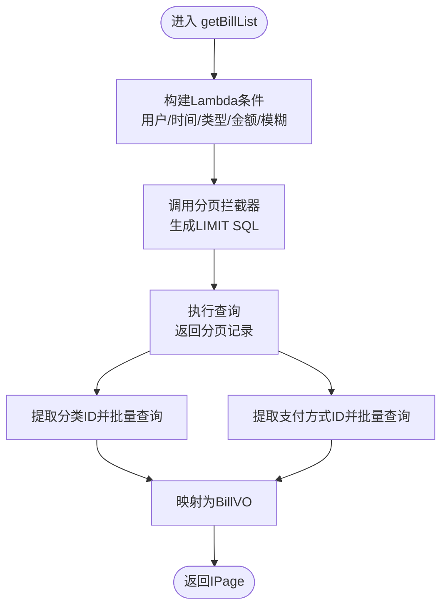
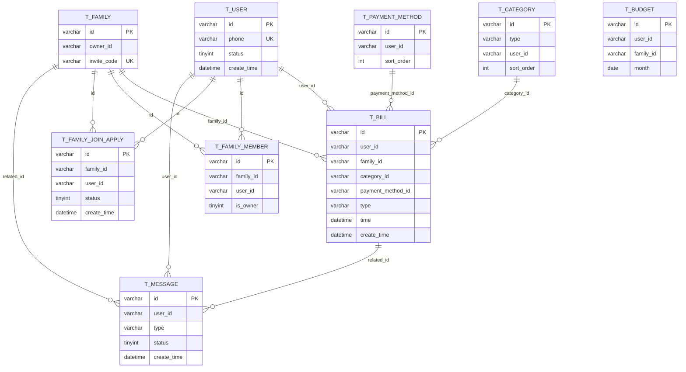
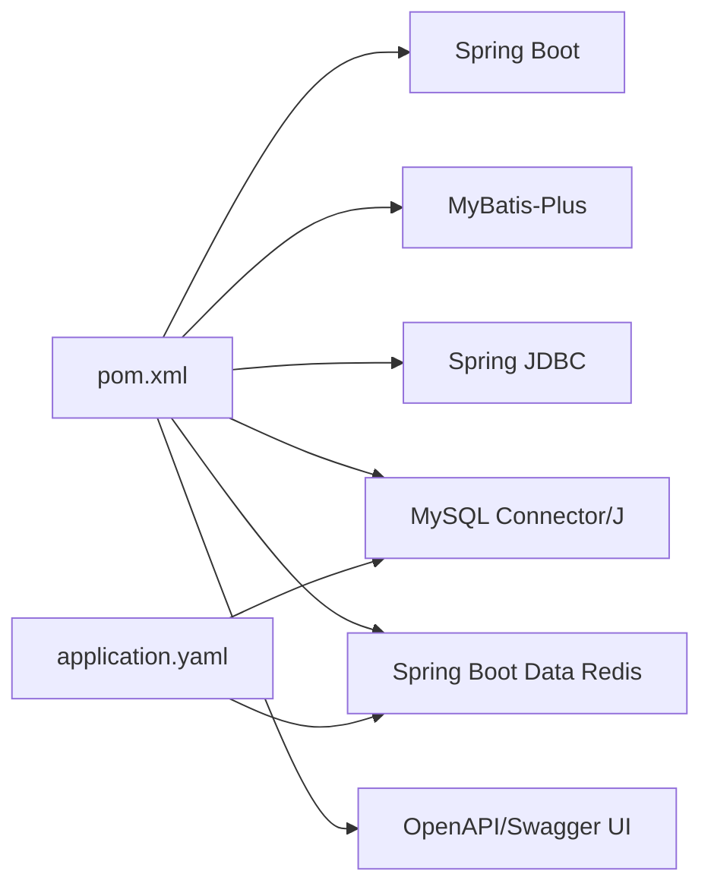

# 数据库优化

<cite>
**本文引用的文件**
- [application.yaml](file://chuan-bill-server/src/main/resources/application.yaml)
- [pom.xml](file://chuan-bill-server/pom.xml)
- [init.sql](file://chuan-bill-server/init.sql)
- [MybatisPlusConfig.java](file://chuan-bill-server/src/main/java/com/samoy/chuanbillserver/config/MybatisPlusConfig.java)
- [BillMapper.xml](file://chuan-bill-server/src/main/resources/mapper/BillMapper.xml)
- [Bill.java](file://chuan-bill-server/src/main/java/com/samoy/chuanbillserver/entity/Bill.java)
- [BillMapper.java](file://chuan-bill-server/src/main/java/com/samoy/chuanbillserver/dao/BillMapper.java)
- [BillServiceImpl.java](file://chuan-bill-server/src/main/java/com/samoy/chuanbillserver/service/impl/BillServiceImpl.java)
- [BillController.java](file://chuan-bill-server/src/main/java/com/samoy/chuanbillserver/controller/BillController.java)
- [BillListDTO.java](file://chuan-bill-server/src/main/java/com/samoy/chuanbillserver/dto/BillListDTO.java)
- [BillVO.java](file://chuan-bill-server/src/main/java/com/samoy/chuanbillserver/vo/BillVO.java)
- [CategoryMapper.java](file://chuan-bill-server/src/main/java/com/samoy/chuanbillserver/dao/CategoryMapper.java)
- [UserMapper.java](file://chuan-bill-server/src/main/java/com/samoy/chuanbillserver/dao/UserMapper.java)
</cite>

## 目录
1. [简介](#简介)
2. [项目结构](#项目结构)
3. [核心组件](#核心组件)
4. [架构总览](#架构总览)
5. [详细组件分析](#详细组件分析)
6. [依赖分析](#依赖分析)
7. [性能考量](#性能考量)
8. [故障排查指南](#故障排查指南)
9. [结论](#结论)
10. [附录](#附录)

## 简介
本指南面向“小川记账”后端数据库优化，聚焦于MySQL性能优化策略与工程实践，结合现有代码与配置，给出可落地的索引优化、查询计划分析、慢查询日志、查询优化器使用建议；同时覆盖连接池优化（HikariCP）、SQL语句优化（复杂查询重构、子查询与JOIN优化、LIMIT优化）、数据库结构优化（表分区、垂直/水平分表、数据归档）、事务优化（隔离级别、死锁预防、长事务处理）、监控指标与容量规划、备份恢复与读写分离/主从复制优化等主题。

## 项目结构
后端基于Spring Boot + MyBatis-Plus，数据库连接通过Spring配置注入，使用MyBatis-Plus分页插件，账单模块为主要业务入口之一。整体结构如下：

**图表来源**
- [BillController.java:1-91](file://chuan-bill-server/src/main/java/com/samoy/chuanbillserver/controller/BillController.java#L1-L91)
- [BillServiceImpl.java:1-244](file://chuan-bill-server/src/main/java/com/samoy/chuanbillserver/service/impl/BillServiceImpl.java#L1-L244)
- [BillMapper.java:1-15](file://chuan-bill-server/src/main/java/com/samoy/chuanbillserver/dao/BillMapper.java#L1-L15)
- [BillMapper.xml:1-6](file://chuan-bill-server/src/main/resources/mapper/BillMapper.xml#L1-L6)
- [Bill.java:1-113](file://chuan-bill-server/src/main/java/com/samoy/chuanbillserver/entity/Bill.java#L1-L113)
- [MybatisPlusConfig.java:1-18](file://chuan-bill-server/src/main/java/com/samoy/chuanbillserver/config/MybatisPlusConfig.java#L1-L18)
- [application.yaml:1-51](file://chuan-bill-server/src/main/resources/application.yaml#L1-L51)
- [pom.xml:1-226](file://chuan-bill-server/pom.xml#L1-L226)
- [init.sql:1-326](file://chuan-bill-server/init.sql#L1-L326)

**章节来源**
- [application.yaml:1-51](file://chuan-bill-server/src/main/resources/application.yaml#L1-L51)
- [pom.xml:1-226](file://chuan-bill-server/pom.xml#L1-L226)
- [init.sql:1-326](file://chuan-bill-server/init.sql#L1-L326)
- [MybatisPlusConfig.java:1-18](file://chuan-bill-server/src/main/java/com/samoy/chuanbillserver/config/MybatisPlusConfig.java#L1-L18)
- [BillMapper.xml:1-6](file://chuan-bill-server/src/main/resources/mapper/BillMapper.xml#L1-L6)
- [Bill.java:1-113](file://chuan-bill-server/src/main/java/com/samoy/chuanbillserver/entity/Bill.java#L1-L113)
- [BillMapper.java:1-15](file://chuan-bill-server/src/main/java/com/samoy/chuanbillserver/dao/BillMapper.java#L1-L15)
- [BillServiceImpl.java:1-244](file://chuan-bill-server/src/main/java/com/samoy/chuanbillserver/service/impl/BillServiceImpl.java#L1-L244)
- [BillController.java:1-91](file://chuan-bill-server/src/main/java/com/samoy/chuanbillserver/controller/BillController.java#L1-L91)
- [BillListDTO.java:1-42](file://chuan-bill-server/src/main/java/com/samoy/chuanbillserver/dto/BillListDTO.java#L1-L42)
- [BillVO.java:1-44](file://chuan-bill-server/src/main/java/com/samoy/chuanbillserver/vo/BillVO.java#L1-L44)

## 核心组件
- 数据源与连接池：通过Spring配置注入MySQL驱动、URL、账号密码；当前未显式配置HikariCP参数，使用默认值。
- ORM与分页：MyBatis-Plus配置了MySQL分页插件，账单服务使用Lambda条件构造器与分页封装。
- 实体与映射：账单实体映射到t_bill表，包含常用查询字段索引；Mapper接口与XML映射文件预留扩展空间。
- 控制器与DTO/VO：控制器接收分页与筛选参数，服务层进行权限校验与批量关联查询，避免N+1问题。

**章节来源**
- [application.yaml:4-8](file://chuan-bill-server/src/main/resources/application.yaml#L4-L8)
- [MybatisPlusConfig.java:9-17](file://chuan-bill-server/src/main/java/com/samoy/chuanbillserver/config/MybatisPlusConfig.java#L9-L17)
- [BillServiceImpl.java:50-123](file://chuan-bill-server/src/main/java/com/samoy/chuanbillserver/service/impl/BillServiceImpl.java#L50-L123)
- [Bill.java:24-112](file://chuan-bill-server/src/main/java/com/samoy/chuanbillserver/entity/Bill.java#L24-L112)
- [BillMapper.xml:1-6](file://chuan-bill-server/src/main/resources/mapper/BillMapper.xml#L1-L6)
- [BillController.java:37-42](file://chuan-bill-server/src/main/java/com/samoy/chuanbillserver/controller/BillController.java#L37-L42)
- [BillListDTO.java:10-41](file://chuan-bill-server/src/main/java/com/samoy/chuanbillserver/dto/BillListDTO.java#L10-L41)
- [BillVO.java:11-43](file://chuan-bill-server/src/main/java/com/samoy/chuanbillserver/vo/BillVO.java#L11-L43)

## 架构总览
下图展示从控制器到数据库的关键调用链路与优化关注点（索引、分页、批量加载）：

**图表来源**
- [BillController.java:37-42](file://chuan-bill-server/src/main/java/com/samoy/chuanbillserver/controller/BillController.java#L37-L42)
- [BillServiceImpl.java:50-123](file://chuan-bill-server/src/main/java/com/samoy/chuanbillserver/service/impl/BillServiceImpl.java#L50-L123)
- [MybatisPlusConfig.java:11-16](file://chuan-bill-server/src/main/java/com/samoy/chuanbillserver/config/MybatisPlusConfig.java#L11-L16)
- [BillMapper.java:1-15](file://chuan-bill-server/src/main/java/com/samoy/chuanbillserver/dao/BillMapper.java#L1-L15)

## 详细组件分析

### 账单查询与分页优化
- 分页插件：已启用MySQL分页拦截器，确保分页SQL具备LIMIT子句，避免全表扫描。
- 查询条件：按用户维度+时间维度组合过滤，优先利用复合索引(user_id,time)与(time)索引。
- 关联查询：列表页采用“先分页再批量加载关联资源”的策略，避免N+1查询，提升IO效率。
- DTO约束：对日期、金额、分页参数进行严格校验，减少无效请求带来的数据库压力。

**图表来源**
- [BillServiceImpl.java:50-123](file://chuan-bill-server/src/main/java/com/samoy/chuanbillserver/service/impl/BillServiceImpl.java#L50-L123)
- [BillListDTO.java:10-41](file://chuan-bill-server/src/main/java/com/samoy/chuanbillserver/dto/BillListDTO.java#L10-L41)
- [MybatisPlusConfig.java:11-16](file://chuan-bill-server/src/main/java/com/samoy/chuanbillserver/config/MybatisPlusConfig.java#L11-L16)

**章节来源**
- [BillServiceImpl.java:50-123](file://chuan-bill-server/src/main/java/com/samoy/chuanbillserver/service/impl/BillServiceImpl.java#L50-L123)
- [BillListDTO.java:10-41](file://chuan-bill-server/src/main/java/com/samoy/chuanbillserver/dto/BillListDTO.java#L10-L41)
- [MybatisPlusConfig.java:11-16](file://chuan-bill-server/src/main/java/com/samoy/chuanbillserver/config/MybatisPlusConfig.java#L11-L16)

### 数据库结构与索引现状
- 用户表：手机号唯一、状态、创建时间等索引，满足登录与统计场景。
- 类目/支付方式：类型、用户维度、排序字段索引，支撑快速筛选与排序。
- 家庭/成员/申请：唯一组合索引与常用查询字段索引，保障关系完整性与查询效率。
- 账单表：用户/家庭/类目/支付方式/类型/时间/创建时间等多维索引，特别是(user_id,time)与(family_id,time)复合索引，利于按用户或家庭的时间序列查询。

**图表来源**
- [init.sql:14-326](file://chuan-bill-server/init.sql#L14-L326)

**章节来源**
- [init.sql:14-326](file://chuan-bill-server/init.sql#L14-L326)

### 连接池与HikariCP优化
- 当前配置：未显式配置HikariCP参数，使用默认值；Spring JDBC Starter与MySQL Connector J已引入。
- 建议配置项（基于业务特征）：
  - 连接池大小：根据并发请求数与数据库承载能力设定；结合Actuator监控CPU/内存/连接池指标动态调整。
  - 连接超时：合理设置连接获取超时与空闲回收时间，避免长时间占用。
  - 连接泄漏防护：开启连接池健康检查与泄漏检测，定期巡检连接生命周期。
  - 连接池监控：集成Actuator暴露连接池指标，结合Prometheus/Grafana可视化。

**章节来源**
- [application.yaml:4-8](file://chuan-bill-server/src/main/resources/application.yaml#L4-L8)
- [pom.xml:103-107](file://chuan-bill-server/pom.xml#L103-L107)
- [pom.xml:55-56](file://chuan-bill-server/pom.xml#L55-L56)

### SQL语句优化要点
- 复杂查询重构：优先使用条件合并与索引覆盖，避免函数包裹列导致索引失效。
- 子查询优化：尽量改写为JOIN，减少嵌套层级；必要时使用WITH子句（MySQL 8.0+）提升可读性。
- JOIN优化：明确ON条件与过滤顺序，优先过滤小表；避免笛卡尔积。
- LIMIT优化：配合ORDER BY与WHERE使用，确保排序字段有索引；分页大偏移时考虑“游标翻页”或“基于上次最大ID”的分段查询。

**章节来源**
- [BillServiceImpl.java:50-88](file://chuan-bill-server/src/main/java/com/samoy/chuanbillserver/service/impl/BillServiceImpl.java#L50-L88)
- [MybatisPlusConfig.java:11-16](file://chuan-bill-server/src/main/java/com/samoy/chuanbillserver/config/MybatisPlusConfig.java#L11-L16)

### 数据库结构优化策略
- 表分区：针对账单表按时间分区（如按月），提升范围查询与归档效率。
- 垂直分表：将大字段（如备注）拆分至独立表，降低主表行宽，改善IO。
- 水平分表：按用户ID哈希或取模分片，结合路由规则实现读写分离。
- 数据归档：对历史账单定期归档至冷存储，清理过期数据，保持热表轻量化。

**章节来源**
- [init.sql:131-158](file://chuan-bill-server/init.sql#L131-L158)

### 事务优化方案
- 隔离级别：默认REPEATABLE READ满足大多数场景；对强一致需求使用SERIALIZABLE，但需权衡性能。
- 死锁预防：统一更新顺序、缩短事务时长、避免在事务中进行交互等待。
- 长事务处理：拆分大事务、及时提交；对批处理任务采用队列化异步执行。

**章节来源**
- [BillServiceImpl.java:126-173](file://chuan-bill-server/src/main/java/com/samoy/chuanbillserver/service/impl/BillServiceImpl.java#L126-L173)

### 监控指标与容量规划
- 监控指标：连接池活跃/空闲连接数、平均等待时间、超时次数；慢查询数量与耗时分布；QPS/TPS、响应时间、错误率。
- 工具使用：Actuator暴露指标，Prometheus抓取，Grafana看板；Explain分析执行计划；慢查询日志定位热点SQL。
- 容量规划：基于峰值QPS与SLA估算连接池大小与实例规格；预留扩容余量与灾备节点。

**章节来源**
- [application.yaml:55-56](file://chuan-bill-server/src/main/resources/application.yaml#L55-L56)
- [pom.xml:136-141](file://chuan-bill-server/pom.xml#L136-L141)

### 备份恢复与读写分离/主从复制
- 备份恢复：定期全量+增量备份，验证恢复流程；对敏感字段加密存储。
- 读写分离：写库承担新增/更新/删除；读库承担查询，按标签路由；注意最终一致性。
- 主从复制：配置半同步复制，设置延迟阈值告警；监控复制延迟与故障切换。

**章节来源**
- [application.yaml:4-8](file://chuan-bill-server/src/main/resources/application.yaml#L4-L8)

## 依赖分析
- 框架与ORM：Spring Boot、MyBatis-Plus、MySQL Connector/J。
- 连接池：Spring JDBC Starter（默认HikariCP）。
- 文档：OpenAPI/Swagger UI。
- 缓存：Redis（用于会话与热点数据，非本文重点）。

**图表来源**
- [pom.xml:51-168](file://chuan-bill-server/pom.xml#L51-L168)
- [application.yaml:1-51](file://chuan-bill-server/src/main/resources/application.yaml#L1-L51)

**章节来源**
- [pom.xml:51-168](file://chuan-bill-server/pom.xml#L51-L168)
- [application.yaml:1-51](file://chuan-bill-server/src/main/resources/application.yaml#L1-L51)

## 性能考量
- 索引设计：围绕高频查询（用户/家庭+时间、类型、金额范围、模糊匹配）建立单列与复合索引，避免全表扫描。
- 查询计划：使用EXPLAIN分析SQL执行路径，关注回表次数、临时表与排序开销。
- 慢查询日志：开启并定期分析，结合业务热点优化索引与SQL。
- 连接池：根据并发与RT目标调优连接池参数，避免过度连接导致上下文切换与锁竞争。
- 批量与分页：列表页采用批量加载关联资源，分页LIMIT配合合适索引，避免深分页。

**章节来源**
- [init.sql:131-158](file://chuan-bill-server/init.sql#L131-L158)
- [BillServiceImpl.java:50-123](file://chuan-bill-server/src/main/java/com/samoy/chuanbillserver/service/impl/BillServiceImpl.java#L50-L123)
- [MybatisPlusConfig.java:11-16](file://chuan-bill-server/src/main/java/com/samoy/chuanbillserver/config/MybatisPlusConfig.java#L11-L16)

## 故障排查指南
- 连接池异常：检查连接池指标与超时日志，核对数据库最大连接数与网络延迟。
- 慢查询定位：启用慢查询日志，筛选耗时Top SQL，结合EXPLAIN优化索引。
- N+1问题：确认服务层是否采用批量查询关联资源，避免循环逐条查询。
- 权限与数据隔离：核对控制器与服务层的用户ID校验逻辑，防止越权访问。

**章节来源**
- [BillController.java:37-42](file://chuan-bill-server/src/main/java/com/samoy/chuanbillserver/controller/BillController.java#L37-L42)
- [BillServiceImpl.java:144-173](file://chuan-bill-server/src/main/java/com/samoy/chuanbillserver/service/impl/BillServiceImpl.java#L144-L173)

## 结论
本项目已具备良好的基础：明确的分页插件、合理的实体与索引设计、以及清晰的控制器-服务-映射职责划分。后续优化应围绕以下主线展开：完善连接池参数与监控、强化索引与查询计划分析、实施SQL优化与结构优化策略、健全事务治理与容量规划，并配套完善的备份恢复与读写分离/主从复制方案，以实现高可靠、高性能、可扩展的数据库体系。

## 附录
- 快速检查清单
  - 是否为高频查询字段建立合适索引？
  - 分页查询是否使用LIMIT且命中索引？
  - 是否存在N+1查询？是否已批量加载关联资源？
  - 连接池参数是否与业务负载匹配？
  - 是否开启慢查询日志并定期分析？
  - 是否制定备份恢复与主从复制策略？