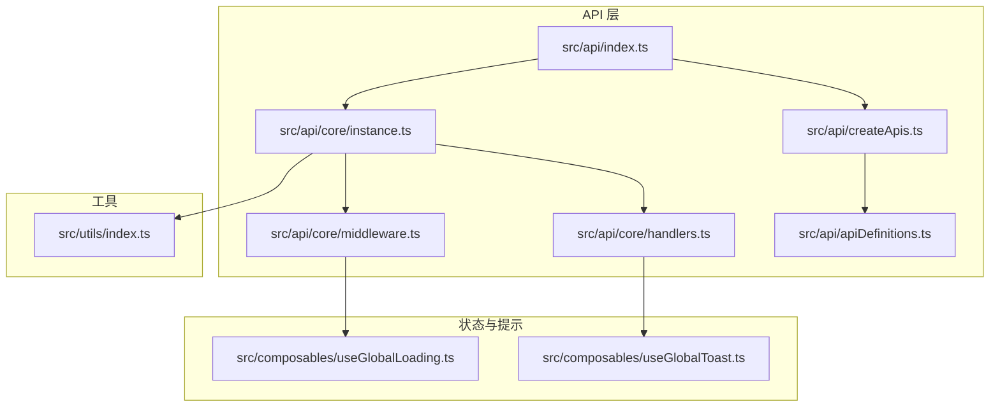
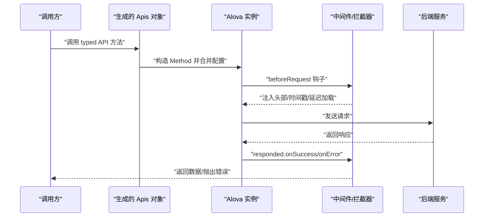
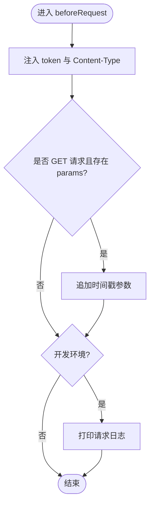
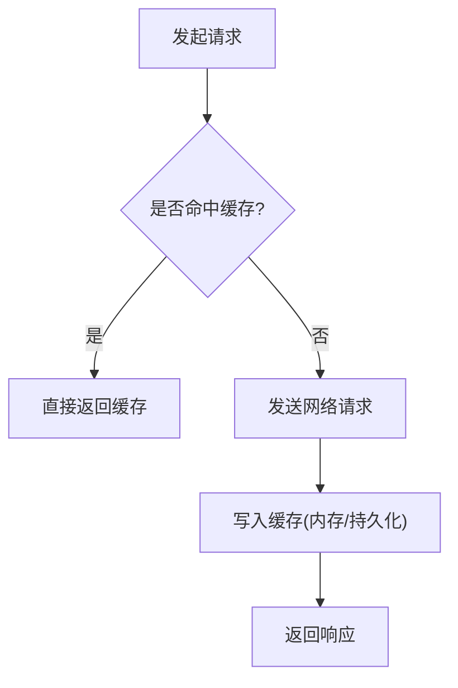
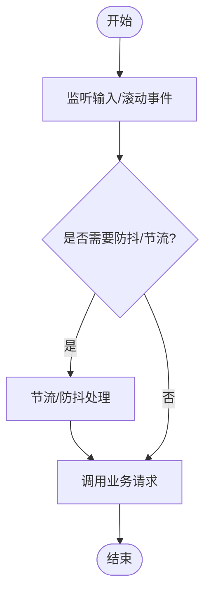
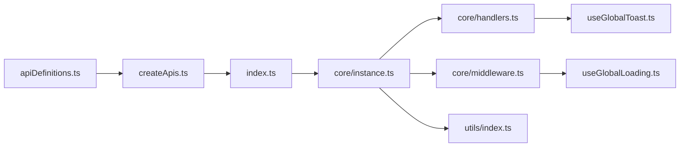

# 网络请求优化

<cite>
**本文引用的文件**
- [alova.config.ts](file://chuan-bill-app/alova.config.ts)
- [src/api/index.ts](file://chuan-bill-app/src/api/index.ts)
- [src/api/createApis.ts](file://chuan-bill-app/src/api/createApis.ts)
- [src/api/apiDefinitions.ts](file://chuan-bill-app/src/api/apiDefinitions.ts)
- [src/api/core/instance.ts](file://chuan-bill-app/src/api/core/instance.ts)
- [src/api/core/handlers.ts](file://chuan-bill-app/src/api/core/handlers.ts)
- [src/api/core/middleware.ts](file://chuan-bill-app/src/api/core/middleware.ts)
- [src/composables/useGlobalLoading.ts](file://chuan-bill-app/src/composables/useGlobalLoading.ts)
- [src/composables/useGlobalToast.ts](file://chuan-bill-app/src/composables/useGlobalToast.ts)
- [src/utils/index.ts](file://chuan-bill-app/src/utils/index.ts)
</cite>

## 目录
1. [引言](#引言)
2. [项目结构](#项目结构)
3. [核心组件](#核心组件)
4. [架构总览](#架构总览)
5. [详细组件分析](#详细组件分析)
6. [依赖关系分析](#依赖关系分析)
7. [性能考量](#性能考量)
8. [故障排查指南](#故障排查指南)
9. [结论](#结论)
10. [附录](#附录)

## 引言
本指南面向“小川记账”前端网络层，聚焦于基于 Alova 的网络请求优化实践。内容覆盖客户端配置优化（请求/响应拦截器、超时与错误处理）、请求合并与缓存策略、防抖节流在高频交互中的应用、HTTP 缓存策略、WebSocket 连接优化建议、CDN 与静态资源优化、HTTPS 性能优化，以及网络监控与性能分析方法。文档以仓库现有实现为基础，结合可扩展的最佳实践，帮助开发者系统性提升网络性能与稳定性。

## 项目结构
前端网络层主要由以下模块构成：
- Alova 实例与适配器：统一的请求入口与平台适配
- 接口生成与调用：通过 OpenAPI 描述自动生成类型化 API，并按标签组织
- 拦截器与中间件：请求前处理、响应处理、加载态中间件
- 全局提示与状态：全局 Toast 与 Loading 状态管理
- 工具函数：通用能力（如路径获取）

图表来源
- [src/api/index.ts:1-19](file://chuan-bill-app/src/api/index.ts#L1-L19)
- [src/api/createApis.ts:1-95](file://chuan-bill-app/src/api/createApis.ts#L1-L95)
- [src/api/apiDefinitions.ts:1-38](file://chuan-bill-app/src/api/apiDefinitions.ts#L1-L38)
- [src/api/core/instance.ts:1-63](file://chuan-bill-app/src/api/core/instance.ts#L1-L63)
- [src/api/core/handlers.ts:1-105](file://chuan-bill-app/src/api/core/handlers.ts#L1-L105)
- [src/api/core/middleware.ts:1-93](file://chuan-bill-app/src/api/core/middleware.ts#L1-L93)
- [src/composables/useGlobalLoading.ts:1-38](file://chuan-bill-app/src/composables/useGlobalLoading.ts#L1-L38)
- [src/composables/useGlobalToast.ts:1-62](file://chuan-bill-app/src/composables/useGlobalToast.ts#L1-L62)
- [src/utils/index.ts:1-79](file://chuan-bill-app/src/utils/index.ts#L1-L79)

章节来源
- [src/api/index.ts:1-19](file://chuan-bill-app/src/api/index.ts#L1-L19)
- [src/api/createApis.ts:1-95](file://chuan-bill-app/src/api/createApis.ts#L1-L95)
- [src/api/apiDefinitions.ts:1-38](file://chuan-bill-app/src/api/apiDefinitions.ts#L1-L38)
- [src/api/core/instance.ts:1-63](file://chuan-bill-app/src/api/core/instance.ts#L1-L63)
- [src/api/core/handlers.ts:1-105](file://chuan-bill-app/src/api/core/handlers.ts#L1-L105)
- [src/api/core/middleware.ts:1-93](file://chuan-bill-app/src/api/core/middleware.ts#L1-L93)
- [src/composables/useGlobalLoading.ts:1-38](file://chuan-bill-app/src/composables/useGlobalLoading.ts#L1-L38)
- [src/composables/useGlobalToast.ts:1-62](file://chuan-bill-app/src/composables/useGlobalToast.ts#L1-L62)
- [src/utils/index.ts:1-79](file://chuan-bill-app/src/utils/index.ts#L1-L79)

## 核心组件
- Alova 实例与适配器
  - 统一配置 baseURL、适配器、拦截器、响应处理、超时与缓存策略
  - 在请求前注入通用头部、Content-Type、GET 请求时间戳参数，开发环境打印请求日志
- 接口生成与调用
  - 基于 OpenAPI/Swagger 自动生成 API 定义与类型，按标签组织，支持路径参数替换与 FormData 自动转换
- 拦截器与中间件
  - 响应成功/失败处理、401/403 统一跳转登录、网络/超时/业务错误分类提示
  - 加载态中间件：延迟显示加载、全局加载态控制
- 全局提示与状态
  - 全局 Toast 与 Loading 状态管理，支持页面级状态与默认配置合并

章节来源
- [src/api/core/instance.ts:7-60](file://chuan-bill-app/src/api/core/instance.ts#L7-L60)
- [src/api/core/handlers.ts:34-104](file://chuan-bill-app/src/api/core/handlers.ts#L34-L104)
- [src/api/createApis.ts:22-62](file://chuan-bill-app/src/api/createApis.ts#L22-L62)
- [src/api/core/middleware.ts:7-92](file://chuan-bill-app/src/api/core/middleware.ts#L7-L92)
- [src/composables/useGlobalLoading.ts:13-37](file://chuan-bill-app/src/composables/useGlobalLoading.ts#L13-L37)
- [src/composables/useGlobalToast.ts:13-61](file://chuan-bill-app/src/composables/useGlobalToast.ts#L13-L61)

## 架构总览
下图展示从调用方到服务端的整体链路，以及关键优化点的落位位置。

图表来源
- [src/api/createApis.ts:65-72](file://chuan-bill-app/src/api/createApis.ts#L65-L72)
- [src/api/core/instance.ts:15-51](file://chuan-bill-app/src/api/core/instance.ts#L15-L51)
- [src/api/core/handlers.ts:34-104](file://chuan-bill-app/src/api/core/handlers.ts#L34-L104)

## 详细组件分析

### Alova 客户端配置优化
- 请求拦截器配置
  - 注入通用 token 与 Content-Type；对 GET 请求追加时间戳参数以避免缓存
  - 开发环境下打印请求与环境信息，便于调试
- 响应拦截器设计
  - 统一处理 401/403 登录态失效，触发全局提示并跳转登录
  - 分类处理网络错误、超时、业务错误，统一抛出 ApiError 以便上层捕获
- 请求超时设置
  - 全局超时设为较长时长，避免常规请求被误判超时
- 错误重试机制
  - 当前未实现自动重试；可在中间件或业务层按需引入指数退避重试策略

图表来源
- [src/api/core/instance.ts:15-36](file://chuan-bill-app/src/api/core/instance.ts#L15-L36)

章节来源
- [src/api/core/instance.ts:7-60](file://chuan-bill-app/src/api/core/instance.ts#L7-L60)
- [src/api/core/handlers.ts:34-104](file://chuan-bill-app/src/api/core/handlers.ts#L34-L104)

### 请求合并策略
- 批量请求处理
  - 可通过并发发送多个 Method 并统一处理结果；注意避免重复请求与竞态
- 请求去重
  - 基于 Method.key 或 URL+参数构建唯一键，缓存中命中即复用
- 缓存策略实现
  - 当前实例禁用了本地缓存（cacheFor=null），若需启用可改为具体策略或函数式缓存配置
  - 可结合 Alova 内置的内存/持久化缓存模式与标签化缓存进行精细化控制

图表来源
- [src/api/core/instance.ts:56-60](file://chuan-bill-app/src/api/core/instance.ts#L56-L60)

章节来源
- [src/api/core/instance.ts:56-60](file://chuan-bill-app/src/api/core/instance.ts#L56-L60)

### 防抖节流技术应用
- 输入框防抖
  - 对高频输入事件（如搜索）采用防抖策略，减少无效请求
- 滚动事件优化
  - 对滚动事件使用节流，降低计算与请求频率
- 频繁操作处理
  - 结合延迟加载中间件，避免快速点击导致的闪烁与重复请求

图表来源
- [src/api/core/middleware.ts:7-21](file://chuan-bill-app/src/api/core/middleware.ts#L7-L21)

章节来源
- [src/api/core/middleware.ts:7-21](file://chuan-bill-app/src/api/core/middleware.ts#L7-L21)

### HTTP 缓存策略
- 强缓存配置
  - 对静态资源与不常变更的接口，建议服务端设置合理的 Cache-Control 与 ETag/Last-Modified
- 协商缓存
  - 利用 ETag/If-None-Match 或 Last-Modified/If-Modified-Since 减少带宽
- Cache-Control 头设置
  - 静态资源可设置较长 max-age 与 public；接口建议区分 no-store/no-cache 与可缓存场景

说明：以上为通用策略建议，具体实现需配合服务端配置。

### WebSocket 连接优化
- 长连接管理
  - 统一连接池与命名空间，避免重复连接
- 心跳检测
  - 定期发送 ping，接收 pong；超时则主动断开并上报
- 断线重连机制
  - 指数退避重连，最大重试次数与等待上限，避免雪崩

说明：当前仓库未见 WebSocket 相关实现，上述为通用优化建议。

### CDN 加速与静态资源优化
- CDN 加速
  - 将静态资源（JS/CSS/图片）接入 CDN，提升首屏与二次访问速度
- 静态资源优化
  - 启用 Gzip/Brotli 压缩、开启长期缓存、资源分片与并行下载
- HTTPS 性能优化
  - 启用 HTTP/2、ALPN、OCSP Stapling；合理配置证书链与缓存

说明：以上为通用优化建议，需结合部署环境配置。

### 网络监控与性能分析
- 网络监控工具
  - 使用浏览器 Network 面板与性能面板，观察请求耗时、DNS、TLS、首包时间
- 请求性能分析
  - 关注 TTFB、传输时间、解析渲染时间；定位瓶颈（网络/服务/前端）
- 网络延迟优化策略
  - 合理设置超时、启用压缩、减少请求数、合并与去重、预取与懒加载

说明：以上为通用实践建议，需结合实际监控工具使用。

## 依赖关系分析
- 模块耦合
  - Apis 由 createApis 基于 apiDefinitions 动态生成，依赖 Alova 实例
  - instance 聚合拦截器与响应处理，middleware 与 handlers 为其补充
  - 全局提示与状态通过 Composables 提供，被 handlers 与 middleware 使用
- 外部依赖
  - @alova/adapter-uniapp、alova/vue、wot-design-uni 组件库

图表来源
- [src/api/apiDefinitions.ts:19-37](file://chuan-bill-app/src/api/apiDefinitions.ts#L19-L37)
- [src/api/createApis.ts:22-72](file://chuan-bill-app/src/api/createApis.ts#L22-L72)
- [src/api/index.ts:5-18](file://chuan-bill-app/src/api/index.ts#L5-L18)
- [src/api/core/instance.ts:1-63](file://chuan-bill-app/src/api/core/instance.ts#L1-L63)
- [src/api/core/handlers.ts:1-105](file://chuan-bill-app/src/api/core/handlers.ts#L1-L105)
- [src/api/core/middleware.ts:1-93](file://chuan-bill-app/src/api/core/middleware.ts#L1-L93)
- [src/composables/useGlobalLoading.ts:1-38](file://chuan-bill-app/src/composables/useGlobalLoading.ts#L1-L38)
- [src/composables/useGlobalToast.ts:1-62](file://chuan-bill-app/src/composables/useGlobalToast.ts#L1-L62)
- [src/utils/index.ts:1-79](file://chuan-bill-app/src/utils/index.ts#L1-L79)

章节来源
- [src/api/createApis.ts:22-72](file://chuan-bill-app/src/api/createApis.ts#L22-L72)
- [src/api/core/instance.ts:1-63](file://chuan-bill-app/src/api/core/instance.ts#L1-L63)
- [src/api/core/handlers.ts:1-105](file://chuan-bill-app/src/api/core/handlers.ts#L1-L105)
- [src/api/core/middleware.ts:1-93](file://chuan-bill-app/src/api/core/middleware.ts#L1-L93)
- [src/composables/useGlobalLoading.ts:1-38](file://chuan-bill-app/src/composables/useGlobalLoading.ts#L1-L38)
- [src/composables/useGlobalToast.ts:1-62](file://chuan-bill-app/src/composables/useGlobalToast.ts#L1-L62)
- [src/utils/index.ts:1-79](file://chuan-bill-app/src/utils/index.ts#L1-L79)

## 性能考量
- 请求拦截与响应处理
  - 避免在拦截器中执行重型同步逻辑，必要时异步化
  - 合理设置超时，避免长时间阻塞 UI
- 缓存策略
  - 对读多写少的数据启用缓存；对实时性要求高的接口禁用缓存
  - 使用标签化缓存与失效策略，确保数据一致性
- 中间件与全局提示
  - 延迟加载中间件可减少闪烁；注意及时清理定时器与状态
- 防抖节流
  - 根据业务场景选择合适的阈值，兼顾体验与性能

## 故障排查指南
- 常见问题
  - 登录态失效：401/403 统一跳转登录，检查 token 注入与刷新策略
  - 网络错误：检查网络适配器与代理设置，确认域名与证书
  - 超时错误：调整超时阈值，优化服务端响应时间
- 定位手段
  - 开启开发环境日志，查看请求与响应详情
  - 使用浏览器 Network 面板分析 TTFB、传输耗时
  - 结合全局 Toast 与 Loading 状态判断交互异常

章节来源
- [src/api/core/handlers.ts:70-104](file://chuan-bill-app/src/api/core/handlers.ts#L70-L104)
- [src/api/core/instance.ts:28-36](file://chuan-bill-app/src/api/core/instance.ts#L28-L36)

## 结论
本指南基于仓库现有 Alova 网络层实现，总结了请求拦截器、响应处理、缓存与中间件等关键优化点，并提供了防抖节流、HTTP 缓存、CDN 与 HTTPS 优化、网络监控与性能分析的通用实践建议。建议在保持现有拦截器与中间件稳定性的基础上，逐步引入请求去重、缓存策略细化、指数退避重试与 WebSocket 优化，持续提升用户体验与系统稳定性。

## 附录
- 接口生成配置
  - 基于 Swagger/OpenAPI 自动化生成接口与类型，支持过滤与转换
- 使用建议
  - 在业务层按需组合中间件与拦截器，避免过度耦合
  - 对高频交互场景优先采用防抖/节流与延迟加载中间件

章节来源
- [alova.config.ts:8-84](file://chuan-bill-app/alova.config.ts#L8-L84)