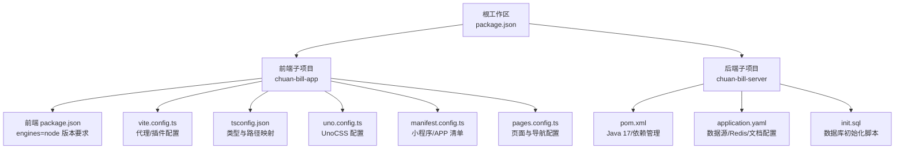
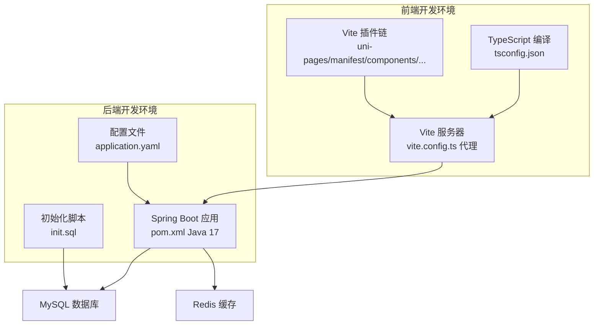
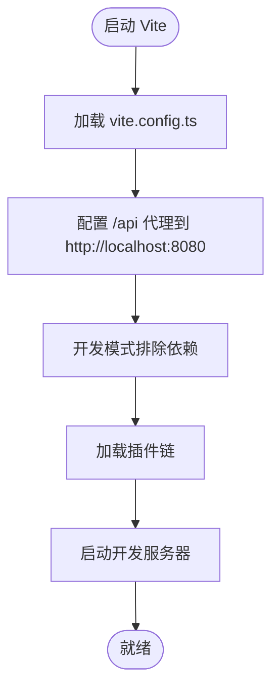
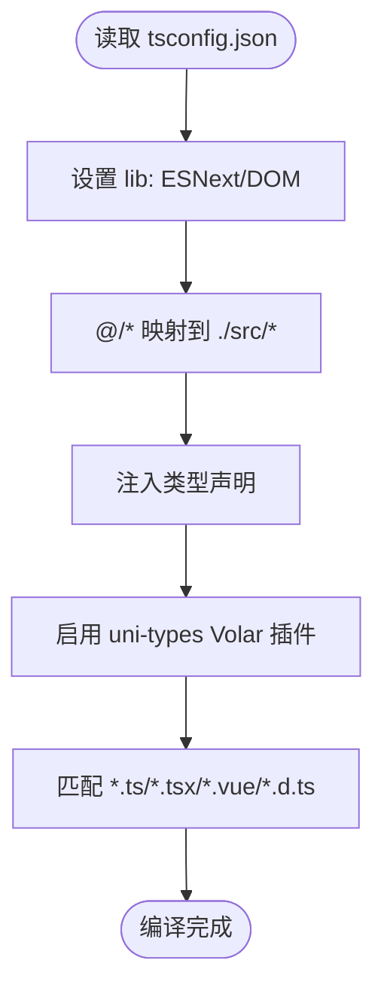
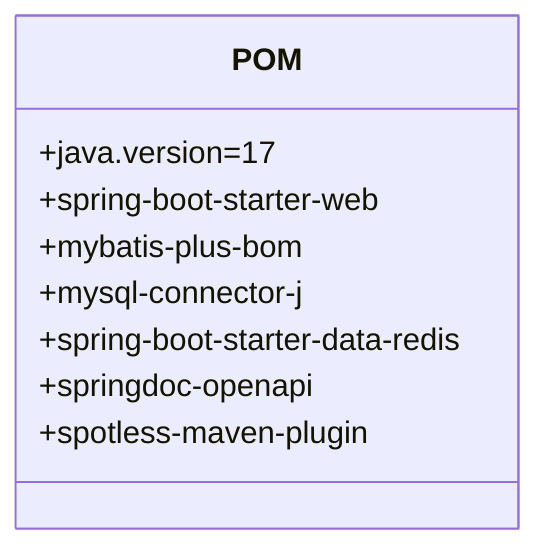
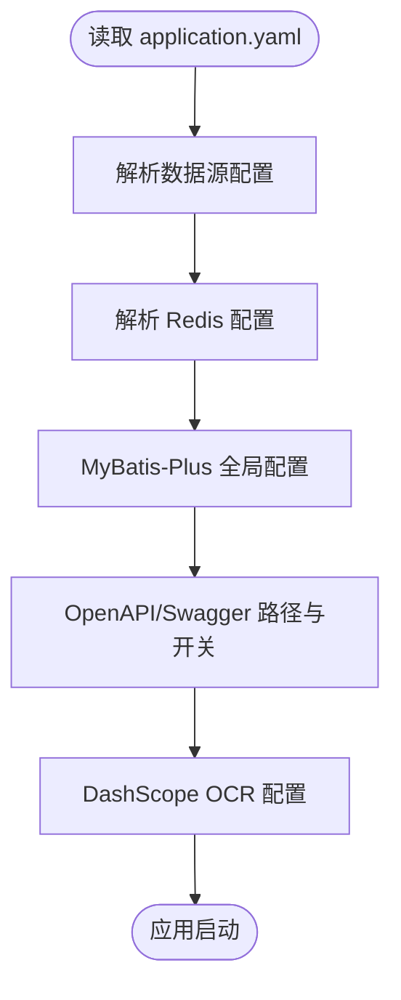
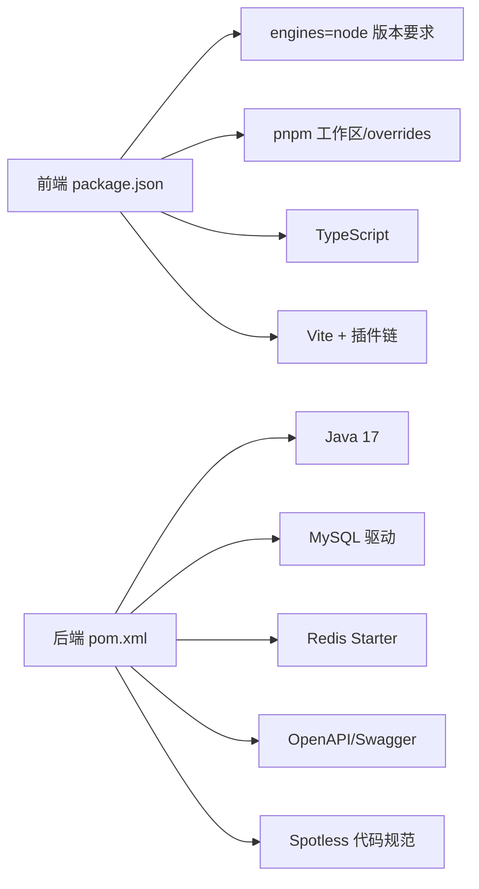

# 开发环境问题

<cite>
**本文引用的文件**
- [根 package.json](file://package.json)
- [前端 package.json](file://chuan-bill-app/package.json)
- [前端 vite.config.ts](file://chuan-bill-app/vite.config.ts)
- [前端 tsconfig.json](file://chuan-bill-app/tsconfig.json)
- [前端 uno.config.ts](file://chuan-bill-app/uno.config.ts)
- [前端 manifest.config.ts](file://chuan-bill-app/manifest.config.ts)
- [前端 pages.config.ts](file://chuan-bill-app/pages.config.ts)
- [前端 .npmrc](file://chuan-bill-app/.npmrc)
- [后端 pom.xml](file://chuan-bill-server/pom.xml)
- [后端 application.yaml](file://chuan-bill-server/src/main/resources/application.yaml)
- [后端 init.sql](file://chuan-bill-server/init.sql)
- [根 .gitignore](file://chuan-bill-app/.gitignore)
</cite>

## 目录
1. [简介](#简介)
2. [项目结构](#项目结构)
3. [核心组件](#核心组件)
4. [架构总览](#架构总览)
5. [详细组件分析](#详细组件分析)
6. [依赖关系分析](#依赖关系分析)
7. [性能考虑](#性能考虑)
8. [故障排除指南](#故障排除指南)
9. [结论](#结论)
10. [附录](#附录)

## 简介
本指南面向“小川记账”项目的开发者，聚焦于开发环境常见问题与系统化排障流程，覆盖以下主题：
- Node.js 版本兼容性与引擎要求
- pnpm 包管理器安装失败与版本冲突
- Vite 构建配置与代理、依赖优化问题
- TypeScript 编译与类型声明问题
- Java 17 环境与 Maven 依赖下载问题
- IDE 配置建议（VS Code 插件、调试、热重载）
- 各平台（Windows/macOS/Linux）差异与注意事项（权限、路径分隔符、文件锁定）

本指南提供可操作的诊断步骤、定位方法与修复建议，并辅以可视化图示帮助快速定位问题。

## 项目结构
项目采用前后端分离的多模块结构：
- 根目录包含统一的脚本与工作区配置
- 前端子项目位于 chuan-bill-app，基于 uni-app/Vite/TypeScript
- 后端子项目位于 chuan-bill-server，基于 Spring Boot/Maven/Java 17

图表来源
- [根 package.json:1-29](file://package.json#L1-L29)
- [前端 package.json:1-135](file://chuan-bill-app/package.json#L1-L135)
- [前端 vite.config.ts:1-80](file://chuan-bill-app/vite.config.ts#L1-L80)
- [前端 tsconfig.json:1-30](file://chuan-bill-app/tsconfig.json#L1-L30)
- [前端 uno.config.ts:1-38](file://chuan-bill-app/uno.config.ts#L1-L38)
- [前端 manifest.config.ts:1-100](file://chuan-bill-app/manifest.config.ts#L1-L100)
- [前端 pages.config.ts:1-43](file://chuan-bill-app/pages.config.ts#L1-L43)
- [后端 pom.xml:1-226](file://chuan-bill-server/pom.xml#L1-L226)
- [后端 application.yaml:1-51](file://chuan-bill-server/src/main/resources/application.yaml#L1-L51)
- [后端 init.sql:1-326](file://chuan-bill-server/init.sql#L1-L326)

章节来源
- [根 package.json:1-29](file://package.json#L1-L29)
- [前端 package.json:1-135](file://chuan-bill-app/package.json#L1-L135)
- [后端 pom.xml:1-226](file://chuan-bill-server/pom.xml#L1-L226)

## 核心组件
- 前端工程
  - 引擎要求：Node.js 版本需满足前端 package.json 中 engines 的范围
  - 构建工具：Vite + uni-app 插件生态
  - 类型系统：TypeScript + Vue 单文件组件类型支持
  - UI 生态：wot-design-uni、uni-echarts、UnoCSS
- 后端工程
  - 运行时：Java 17
  - 构建工具：Maven（Spring Boot）
  - 数据访问：MyBatis-Plus + MySQL + Redis
  - 文档：OpenAPI/Swagger

章节来源
- [前端 package.json:8-10](file://chuan-bill-app/package.json#L8-L10)
- [前端 vite.config.ts:17-80](file://chuan-bill-app/vite.config.ts#L17-L80)
- [前端 tsconfig.json:1-30](file://chuan-bill-app/tsconfig.json#L1-L30)
- [后端 pom.xml:29-31](file://chuan-bill-server/pom.xml#L29-L31)
- [后端 application.yaml:1-51](file://chuan-bill-server/src/main/resources/application.yaml#L1-L51)

## 架构总览
下图展示开发环境中的关键交互：前端 Vite 代理到后端 Spring Boot，后端通过数据源与 Redis 提供服务，数据库初始化脚本在首次启动时执行。

图表来源
- [前端 vite.config.ts:70-78](file://chuan-bill-app/vite.config.ts#L70-L78)
- [前端 tsconfig.json:1-30](file://chuan-bill-app/tsconfig.json#L1-L30)
- [后端 pom.xml:29-31](file://chuan-bill-server/pom.xml#L29-L31)
- [后端 application.yaml:1-51](file://chuan-bill-server/src/main/resources/application.yaml#L1-L51)
- [后端 init.sql:1-326](file://chuan-bill-server/init.sql#L1-L326)

## 详细组件分析

### 前端 Vite 配置分析
- 代理配置：将 /api 前缀转发至本地后端服务，便于开发联调
- 依赖优化：开发模式下排除部分组件库以加速依赖扫描
- 插件链：包含页面/布局/组件自动注册、清单生成、UnoCSS、自动导入、图表集成等
- 平台适配：通过环境检测对特定平台进行优化

图表来源
- [前端 vite.config.ts:17-80](file://chuan-bill-app/vite.config.ts#L17-L80)

章节来源
- [前端 vite.config.ts:17-80](file://chuan-bill-app/vite.config.ts#L17-L80)

### TypeScript 编译配置分析
- 路径别名：通过 baseUrl 与 paths 实现 @/* 到 src 的映射
- 类型声明：引入 uni-app、小程序类型、UI 组件全局类型
- Vue 编译器选项：启用 uni-types 的 Volar 插件以获得更好的类型体验
- 包含范围：按扩展名匹配 ts/tsx/vue/d.ts 文件

图表来源
- [前端 tsconfig.json:1-30](file://chuan-bill-app/tsconfig.json#L1-L30)

章节来源
- [前端 tsconfig.json:1-30](file://chuan-bill-app/tsconfig.json#L1-L30)

### 后端 Maven/Java 配置分析
- Java 版本：属性中固定为 17
- 依赖管理：使用 Spring Boot 父 POM 与 Bom 管理版本
- 关键依赖：Web、MyBatis-Plus、MySQL 驱动、Redis、OpenAPI/Swagger、代码格式化插件等
- 构建插件：编译器、Spring Boot、Spotless（代码风格）

图表来源
- [后端 pom.xml:29-169](file://chuan-bill-server/pom.xml#L29-L169)

章节来源
- [后端 pom.xml:29-169](file://chuan-bill-server/pom.xml#L29-L169)

### 数据库与缓存配置分析
- 数据源：默认连接本地 MySQL，支持环境变量覆盖
- Redis：默认连接本地 Redis，支持环境变量覆盖
- MyBatis-Plus：逻辑删除字段、日志输出配置
- OpenAPI/Swagger：接口文档路径与开关
- 百炼 OCR：API Key 与 App ID 通过环境变量注入

图表来源
- [后端 application.yaml:1-51](file://chuan-bill-server/src/main/resources/application.yaml#L1-L51)

章节来源
- [后端 application.yaml:1-51](file://chuan-bill-server/src/main/resources/application.yaml#L1-L51)

## 依赖关系分析
- 前端依赖
  - Node 引擎：需满足 engines 范围
  - 包管理：pnpm，存在工作区与 overrides
  - 类型与构建：TypeScript、Vite、uni-app 生态
- 后端依赖
  - Java 17 固定版本
  - Maven 生命周期与插件链
  - 外部服务：MySQL、Redis

图表来源
- [前端 package.json:8-10](file://chuan-bill-app/package.json#L8-L10)
- [前端 package.json:126-130](file://chuan-bill-app/package.json#L126-L130)
- [后端 pom.xml:29-169](file://chuan-bill-server/pom.xml#L29-L169)

章节来源
- [前端 package.json:8-10](file://chuan-bill-app/package.json#L8-L10)
- [后端 pom.xml:29-169](file://chuan-bill-server/pom.xml#L29-L169)

## 性能考虑
- Vite 依赖优化：开发模式排除大型 UI 库可显著缩短扫描时间
- 插件链顺序：将高频改动的插件置于前部，减少重复扫描
- TypeScript 编译：合理拆分 include 排除，避免全量扫描
- UnoCSS：按需引入图标集合，减少初始体积
- 后端启动：DevTools 仅开发阶段启用，避免生产开销

## 故障排除指南

### 一、Node.js 版本兼容性问题
- 症状
  - 安装或运行时报“不支持的引擎”或“版本过低”
  - Vite/TypeScript 编译异常
- 诊断步骤
  - 检查前端 engines 要求与当前 Node 版本是否匹配
  - 使用版本管理工具（nvm/fnm）切换到受支持版本
  - 清理 node_modules 与 pnpm-store 后重试
- 修复建议
  - 升级到满足 engines 的 Node 版本
  - 若使用 pnpm，确保其版本与 packageManager 一致
- 平台差异
  - Windows/macOS/Linux 均适用同一规则；注意 shell/PowerShell 对版本命令的支持差异

章节来源
- [前端 package.json:8-10](file://chuan-bill-app/package.json#L8-L10)

### 二、pnpm 包管理器安装失败
- 症状
  - 安装依赖报错、peer 依赖冲突、安装卡住
- 诊断步骤
  - 检查 .npmrc 中的严格策略与提升配置
  - 查看 pnpm 版本与 packageManager 是否一致
  - 清理 pnpm-store 与 node_modules 后重试
- 修复建议
  - 在 .npmrc 中按需调整 strict-peer-dependencies、shamefully-hoist
  - 使用 pnpm install --frozen-lockfile 或升级锁文件
- 平台差异
  - Windows 权限不足可能导致安装失败，需以管理员身份或调整用户权限
  - Linux/macOS 注意磁盘空间与 inode 限制

章节来源
- [前端 .npmrc:1-5](file://chuan-bill-app/.npmrc#L1-L5)
- [根 package.json:21-21](file://package.json#L21-L21)

### 三、Vite 构建配置错误
- 症状
  - 代理无效、跨域失败、页面无法热更新
- 诊断步骤
  - 检查 vite.config.ts 中的 server.proxy 配置与目标地址
  - 确认 optimizeDeps.exclude 是否影响了必要依赖
  - 验证插件顺序与 d.ts 自动生成路径
- 修复建议
  - 将代理目标改为实际后端端口（默认 8080），并开启 changeOrigin
  - 如使用特定平台优化，确认 isMpWeixin 等环境判断
- 平台差异
  - Windows 防火墙可能拦截 localhost 代理
  - macOS/Linux 可能存在端口占用，需更换端口

章节来源
- [前端 vite.config.ts:70-78](file://chuan-bill-app/vite.config.ts#L70-L78)
- [前端 vite.config.ts:19-21](file://chuan-bill-app/vite.config.ts#L19-L21)

### 四、TypeScript 编译错误
- 症状
  - 类型检查失败、Volar 报错、路径别名解析失败
- 诊断步骤
  - 检查 tsconfig.json 的 baseUrl、paths 与类型声明
  - 确认 Vue 编译器插件已启用
  - 验证 d.ts 自动生成位置与内容
- 修复建议
  - 保持 @/* 到 src 的映射一致
  - 确保类型声明（uni-app、小程序、UI 组件）均已正确注入
- 平台差异
  - 路径分隔符大小写敏感性在 macOS/Linux 更严格

章节来源
- [前端 tsconfig.json:1-30](file://chuan-bill-app/tsconfig.json#L1-L30)

### 五、Java 17 环境配置问题
- 症状
  - 编译失败提示不支持的 Java 版本
  - 运行时报错找不到符号或类版本不匹配
- 诊断步骤
  - 检查 pom.xml 中的 java.version 属性
  - 确认 IDE 与终端使用的 JDK 版本
- 修复建议
  - 安装并切换到 Java 17
  - 在 IDE 中设置项目 SDK 与编译级别
- 平台差异
  - Windows/macOS/Linux 均需保证 JAVA_HOME 与 PATH 正确

章节来源
- [后端 pom.xml:29-31](file://chuan-bill-server/pom.xml#L29-L31)

### 六、Maven 依赖下载失败
- 症状
  - 依赖解析超时、下载失败、代理受限
- 诊断步骤
  - 检查网络与代理设置
  - 确认 Maven 仓库镜像与认证配置
- 修复建议
  - 使用国内镜像源或配置代理
  - 清理本地仓库缓存后重试
- 平台差异
  - Windows 防火墙/企业代理可能阻断下载

章节来源
- [后端 pom.xml:171-223](file://chuan-bill-server/pom.xml#L171-L223)

### 七、数据库与缓存连接问题
- 症状
  - 启动报错无法连接数据库或 Redis
- 诊断步骤
  - 检查 application.yaml 中的环境变量是否设置
  - 确认 init.sql 是否成功执行
- 修复建议
  - 设置 MYSQL_URL/MYSQL_USERNAME/MYSQL_PASSWORD/REDIS_* 等环境变量
  - 首次启动时确保数据库存在且初始化脚本可用
- 平台差异
  - Windows/macOS/Linux 需确保本地服务已启动

章节来源
- [后端 application.yaml:4-22](file://chuan-bill-server/src/main/resources/application.yaml#L4-L22)
- [后端 init.sql:1-326](file://chuan-bill-server/init.sql#L1-L326)

### 八、IDE 配置建议（VS Code）
- 插件推荐
  - Vue Language Features (Volar)、ESLint、TypeScript Importer
  - uni-helper 生态相关插件（pages、manifest、components）
- 调试配置
  - 前端：配置 Vite 启动任务与断点
  - 后端：Spring Boot 应用直接运行或远程调试
- 热重载问题排查
  - 确认 Vite server.host 与 IDE 调试端口未冲突
  - 检查代理配置与浏览器缓存

章节来源
- [前端 vite.config.ts:70-78](file://chuan-bill-app/vite.config.ts#L70-L78)
- [前端 tsconfig.json:19-22](file://chuan-bill-app/tsconfig.json#L19-L22)

### 九、平台特定问题与解决方案
- Windows
  - 权限：以管理员运行终端或调整用户权限
  - 路径：统一使用正斜杠或 Node path 模块处理
  - 文件锁定：关闭占用端口的进程或重启资源管理器
- macOS
  - 权限：使用 chown/chmod 修正目录权限
  - 文件锁定：检查 Finder/Quick Look 进程占用
- Linux
  - 权限：sudo 或使用合适的用户组
  - 文件锁定：lsof/netstat 查找占用端口的进程

章节来源
- [根 .gitignore:1-22](file://chuan-bill-app/.gitignore#L1-L22)

## 结论
本指南提供了从 Node.js、pnpm、Vite、TypeScript 到 Java 17、Maven、数据库与缓存的全栈开发环境排障路径。遵循“先版本后配置、先基础后高级”的诊断顺序，通常可在较短时间内定位并解决问题。建议团队统一版本与配置，结合 CI/CD 自动化减少环境漂移。

## 附录

### A. 常见问题快速对照表
- Node 版本不满足 engines：升级 Node
- pnpm 安装失败：清理缓存与 node_modules，检查 .npmrc
- Vite 代理失效：核对 server.proxy 与目标端口
- TypeScript 报错：检查 tsconfig.json 与类型声明
- Java 版本不符：切换到 Java 17
- Maven 下载失败：配置镜像/代理，清理本地仓库
- 数据库/Redis 连接失败：设置环境变量并执行 init.sql

### B. 一键重置脚本（建议）
- 前端：删除 node_modules/.vite、pnpm-lock.yaml，重新 install
- 后端：mvn clean、删除 target、重新 build
- 通用：清空 pnpm-store，重启终端