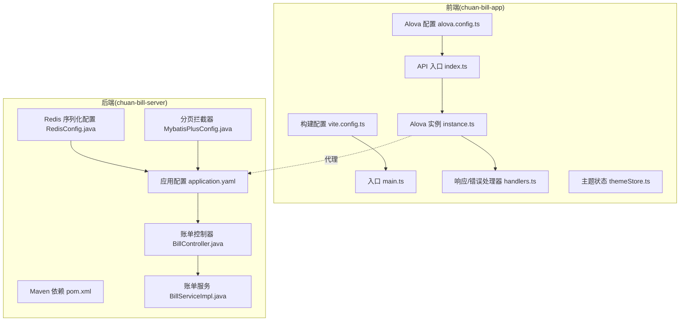
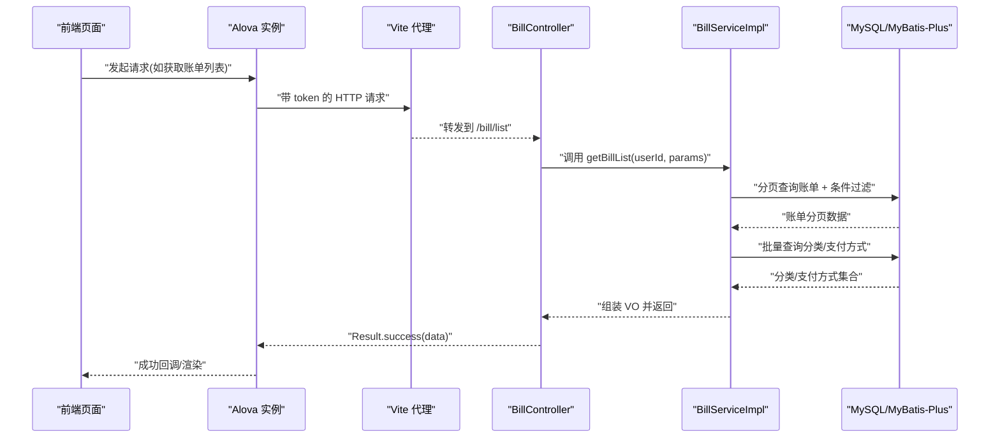
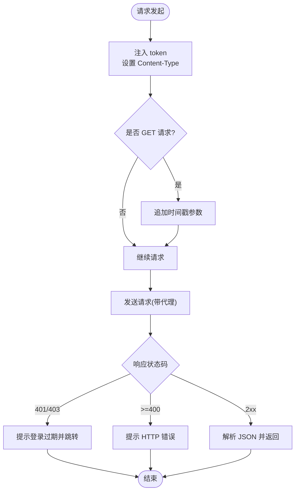
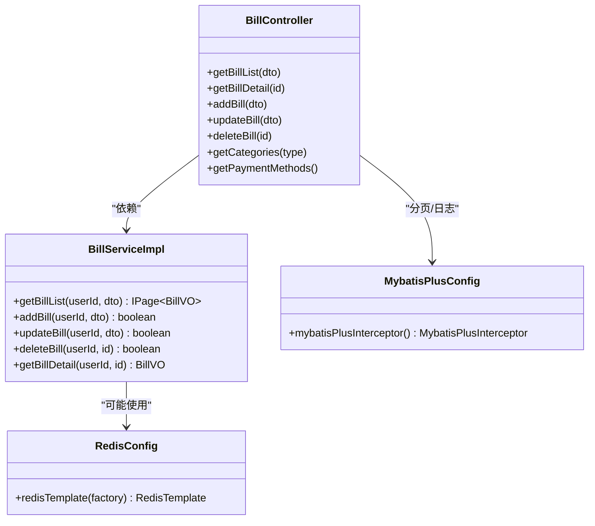
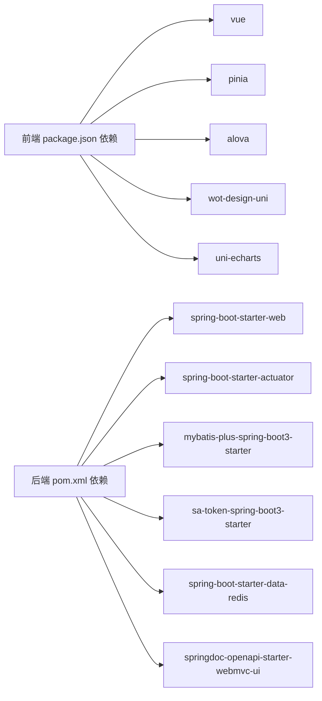

# 性能问题诊断

<cite>
**本文引用的文件**
- [main.ts](file://chuan-bill-app/src/main.ts)
- [vite.config.ts](file://chuan-bill-app/vite.config.ts)
- [alova.config.ts](file://chuan-bill-app/alova.config.ts)
- [index.ts](file://chuan-bill-app/src/api/index.ts)
- [instance.ts](file://chuan-bill-app/src/api/core/instance.ts)
- [handlers.ts](file://chuan-bill-app/src/api/core/handlers.ts)
- [themeStore.ts](file://chuan-bill-app/src/store/themeStore.ts)
- [application.yaml](file://chuan-bill-server/src/main/resources/application.yaml)
- [pom.xml](file://chuan-bill-server/pom.xml)
- [RedisConfig.java](file://chuan-bill-server/src/main/java/com/samoy/chuanbillserver/config/RedisConfig.java)
- [MybatisPlusConfig.java](file://chuan-bill-server/src/main/java/com/samoy/chuanbillserver/config/MybatisPlusConfig.java)
- [BillController.java](file://chuan-bill-server/src/main/java/com/samoy/chuanbillserver/controller/BillController.java)
- [BillServiceImpl.java](file://chuan-bill-server/src/main/java/com/samoy/chuanbillserver/service/impl/BillServiceImpl.java)
- [package.json](file://chuan-bill-app/package.json)
</cite>

## 目录
1. [简介](#简介)
2. [项目结构](#项目结构)
3. [核心组件](#核心组件)
4. [架构总览](#架构总览)
5. [详细组件分析](#详细组件分析)
6. [依赖分析](#依赖分析)
7. [性能考量](#性能考量)
8. [故障排除指南](#故障排除指南)
9. [结论](#结论)
10. [附录](#附录)

## 简介
本指南面向“小川记账”项目的性能问题诊断与优化，覆盖前端与后端两大侧重点：
- 前端：内存泄漏检测、组件渲染性能分析、网络请求优化、缓存策略效果评估
- 后端：数据库查询优化、Redis缓存命中率分析、线程池配置、JVM内存分析
同时提供可落地的性能监控指标与阈值建议，并给出定位瓶颈的方法与优化策略（代码、配置、基础设施）。

## 项目结构
项目采用前后端分离架构：
- 前端基于 Vue 3 + Vite + Pinia + Aloha（uni-app 适配），通过代理访问后端 API
- 后端基于 Spring Boot 3 + MyBatis-Plus + Sa-Token + Actuator，提供 REST 接口与文档

图表来源
- [main.ts:1-16](file://chuan-bill-app/src/main.ts#L1-L16)
- [vite.config.ts:17-80](file://chuan-bill-app/vite.config.ts#L17-L80)
- [alova.config.ts:8-84](file://chuan-bill-app/alova.config.ts#L8-L84)
- [index.ts:1-19](file://chuan-bill-app/src/api/index.ts#L1-L19)
- [instance.ts:7-63](file://chuan-bill-app/src/api/core/instance.ts#L7-L63)
- [handlers.ts:34-105](file://chuan-bill-app/src/api/core/handlers.ts#L34-L105)
- [application.yaml:1-51](file://chuan-bill-server/src/main/resources/application.yaml#L1-L51)
- [pom.xml:51-169](file://chuan-bill-server/pom.xml#L51-L169)
- [RedisConfig.java:12-31](file://chuan-bill-server/src/main/java/com/samoy/chuanbillserver/config/RedisConfig.java#L12-L31)
- [MybatisPlusConfig.java:9-17](file://chuan-bill-server/src/main/java/com/samoy/chuanbillserver/config/MybatisPlusConfig.java#L9-L17)
- [BillController.java:23-91](file://chuan-bill-server/src/main/java/com/samoy/chuanbillserver/controller/BillController.java#L23-L91)
- [BillServiceImpl.java:42-123](file://chuan-bill-server/src/main/java/com/samoy/chuanbillserver/service/impl/BillServiceImpl.java#L42-L123)

章节来源
- [main.ts:1-16](file://chuan-bill-app/src/main.ts#L1-L16)
- [vite.config.ts:17-80](file://chuan-bill-app/vite.config.ts#L17-L80)
- [alova.config.ts:8-84](file://chuan-bill-app/alova.config.ts#L8-L84)
- [index.ts:1-19](file://chuan-bill-app/src/api/index.ts#L1-L19)
- [instance.ts:7-63](file://chuan-bill-app/src/api/core/instance.ts#L7-L63)
- [handlers.ts:34-105](file://chuan-bill-app/src/api/core/handlers.ts#L34-L105)
- [application.yaml:1-51](file://chuan-bill-server/src/main/resources/application.yaml#L1-L51)
- [pom.xml:51-169](file://chuan-bill-server/pom.xml#L51-L169)
- [RedisConfig.java:12-31](file://chuan-bill-server/src/main/java/com/samoy/chuanbillserver/config/RedisConfig.java#L12-L31)
- [MybatisPlusConfig.java:9-17](file://chuan-bill-server/src/main/java/com/samoy/chuanbillserver/config/MybatisPlusConfig.java#L9-L17)
- [BillController.java:23-91](file://chuan-bill-server/src/main/java/com/samoy/chuanbillserver/controller/BillController.java#L23-L91)
- [BillServiceImpl.java:42-123](file://chuan-bill-server/src/main/java/com/samoy/chuanbillserver/service/impl/BillServiceImpl.java#L42-L123)

## 核心组件
- 前端应用启动与状态管理：应用在入口处创建 SSR 应用实例，挂载路由与 Pinia；Pinia 已启用持久化插件，用于本地存储状态。
- 构建与开发体验：Vite 插件链包含页面/布局/组件自动导入、UnoCSS、ECharts、Bundle Optimizer（微信小程序平台启用）以及代理配置，便于本地联调。
- 网络层：Alova 实例集中配置 baseURL、请求头注入、Content-Type 规范化、GET 请求时间戳防缓存、统一响应/错误处理、默认超时与禁用缓存。
- 后端配置：Spring Boot YAML 配置数据源、Redis 连接参数与连接池、MyBatis-Plus 日志与分页插件、OpenAPI/Swagger 文档路径。
- 业务接口：账单控制器提供列表、详情、增删改、分类与支付方式查询；服务层实现分页查询、批量关联数据预加载，避免 N+1 查询。

章节来源
- [main.ts:6-15](file://chuan-bill-app/src/main.ts#L6-L15)
- [vite.config.ts:22-79](file://chuan-bill-app/vite.config.ts#L22-L79)
- [alova.config.ts:8-84](file://chuan-bill-app/alova.config.ts#L8-L84)
- [index.ts:1-19](file://chuan-bill-app/src/api/index.ts#L1-L19)
- [instance.ts:7-63](file://chuan-bill-app/src/api/core/instance.ts#L7-L63)
- [handlers.ts:34-105](file://chuan-bill-app/src/api/core/handlers.ts#L34-L105)
- [application.yaml:4-51](file://chuan-bill-server/src/main/resources/application.yaml#L4-L51)
- [BillController.java:37-90](file://chuan-bill-server/src/main/java/com/samoy/chuanbillserver/controller/BillController.java#L37-L90)
- [BillServiceImpl.java:50-123](file://chuan-bill-server/src/main/java/com/samoy/chuanbillserver/service/impl/BillServiceImpl.java#L50-L123)

## 架构总览
前端通过 Alova 发起请求，经由 Vite 开发服务器代理转发至后端；后端控制器接收请求，鉴权后调用服务层，服务层执行分页与关联数据预加载，最终返回统一结果对象。

图表来源
- [instance.ts:15-37](file://chuan-bill-app/src/api/core/instance.ts#L15-L37)
- [vite.config.ts:70-78](file://chuan-bill-app/vite.config.ts#L70-L78)
- [BillController.java:37-42](file://chuan-bill-server/src/main/java/com/samoy/chuanbillserver/controller/BillController.java#L37-L42)
- [BillServiceImpl.java:50-123](file://chuan-bill-server/src/main/java/com/samoy/chuanbillserver/service/impl/BillServiceImpl.java#L50-L123)

## 详细组件分析

### 前端网络层与缓存策略
- 请求头与安全：在请求前注入 token；对 POST/PUT/PATCH 自动设置 Content-Type；GET 请求附加时间戳参数防止浏览器缓存。
- 统一处理：成功/失败/完成回调集中处理，开发环境打印请求与响应日志，便于定位问题。
- 缓存策略：全局禁用 Alova 缓存，确保数据一致性但可能增加网络负载。
- 代理与跨域：开发阶段通过 Vite 代理将 /api 前缀转发到后端地址，避免跨域问题。

图表来源
- [instance.ts:15-37](file://chuan-bill-app/src/api/core/instance.ts#L15-L37)
- [handlers.ts:34-68](file://chuan-bill-app/src/api/core/handlers.ts#L34-L68)
- [vite.config.ts:70-78](file://chuan-bill-app/vite.config.ts#L70-L78)

章节来源
- [instance.ts:7-63](file://chuan-bill-app/src/api/core/instance.ts#L7-L63)
- [handlers.ts:34-105](file://chuan-bill-app/src/api/core/handlers.ts#L34-L105)
- [vite.config.ts:70-78](file://chuan-bill-app/vite.config.ts#L70-L78)

### 后端数据库与缓存配置
- 数据源与连接池：MySQL 驱动与 JDBC Starter；Redis 连接参数与连接池大小（最大活跃、空闲、等待）。
- MyBatis-Plus：开启分页插件（MySQL），并启用日志输出，便于排查慢查询。
- Redis 序列化：自定义 RedisTemplate，键使用字符串序列化，值使用 Jackson2Json 序列化，提升读写效率。
- 控制器与服务：控制器统一鉴权获取用户 ID，服务层进行分页与批量关联查询，避免 N+1。

图表来源
- [BillController.java:23-91](file://chuan-bill-server/src/main/java/com/samoy/chuanbillserver/controller/BillController.java#L23-L91)
- [BillServiceImpl.java:42-123](file://chuan-bill-server/src/main/java/com/samoy/chuanbillserver/service/impl/BillServiceImpl.java#L42-L123)
- [RedisConfig.java:12-31](file://chuan-bill-server/src/main/java/com/samoy/chuanbillserver/config/RedisConfig.java#L12-L31)
- [MybatisPlusConfig.java:9-17](file://chuan-bill-server/src/main/java/com/samoy/chuanbillserver/config/MybatisPlusConfig.java#L9-L17)

章节来源
- [application.yaml:4-51](file://chuan-bill-server/src/main/resources/application.yaml#L4-L51)
- [pom.xml:51-169](file://chuan-bill-server/pom.xml#L51-L169)
- [RedisConfig.java:12-31](file://chuan-bill-server/src/main/java/com/samoy/chuanbillserver/config/RedisConfig.java#L12-L31)
- [MybatisPlusConfig.java:9-17](file://chuan-bill-server/src/main/java/com/samoy/chuanbillserver/config/MybatisPlusConfig.java#L9-L17)
- [BillController.java:37-90](file://chuan-bill-server/src/main/java/com/samoy/chuanbillserver/controller/BillController.java#L37-L90)
- [BillServiceImpl.java:50-123](file://chuan-bill-server/src/main/java/com/samoy/chuanbillserver/service/impl/BillServiceImpl.java#L50-L123)

## 依赖分析
- 前端：Vue 3、Pinia、Alova、wot-design-uni、uni-echarts、UnoCSS、Vite 插件生态；开发脚本覆盖多端构建与代理。
- 后端：Spring Boot Web、Actuator、MyBatis-Plus、Sa-Token、Redis、Swagger/OpenAPI、Hutool、Lombok 等。

图表来源
- [package.json:57-87](file://chuan-bill-app/package.json#L57-L87)
- [pom.xml:51-169](file://chuan-bill-server/pom.xml#L51-L169)

章节来源
- [package.json:57-87](file://chuan-bill-app/package.json#L57-L87)
- [pom.xml:51-169](file://chuan-bill-server/pom.xml#L51-L169)

## 性能考量
以下为通用性能指标与阈值建议（可根据实际环境调整）：
- 页面加载时间：首屏资源加载 ≤ 2 秒；交互页面切换 ≤ 1 秒
- API 响应时间：95 分位 ≤ 200ms；99 分位 ≤ 500ms
- 数据库查询耗时：单条 SQL ≤ 50ms；分页查询 ≤ 200ms
- 内存使用量：前端应用常驻内存峰值 ≤ 80MB；后端 JVM 堆内使用率 ≤ 70%
- Redis 命中率：≥ 90%（结合监控指标评估）

说明：当前仓库未内置具体监控埋点与阈值配置，建议在后续迭代中接入性能监控平台（如 APM、Prometheus/Grafana、Sentry 等）并设置告警规则。

## 故障排除指南

### 前端性能诊断
- 内存泄漏检测
  - 使用浏览器开发者工具的 Memory 面板定期快照对比，关注未释放的对象与闭包引用
  - 检查组件生命周期钩子（如 onUnload/destroyed）是否正确清理定时器、事件监听与订阅
  - 关注 Pinia Store 的持久化插件使用是否导致不必要的状态增长
- 组件渲染性能分析
  - 使用 Performance 面板录制交互过程，观察长任务与重排重绘
  - 对高频列表组件启用虚拟滚动与懒加载，减少一次性渲染的数据量
  - 避免在模板中进行复杂计算，将派生数据放入 getter 或 computed
- 网络请求优化
  - 当前已禁用 Alova 缓存，若业务允许可考虑按需启用缓存并设置合理过期策略
  - GET 请求已追加时间戳防缓存，确认是否所有场景都需要防缓存
  - 统一错误处理已包含网络错误与超时提示，建议在 UI 层增加重试与降级策略
- 缓存策略效果评估
  - 评估本地缓存（如 IndexedDB/Storage）与 Alova 缓存的组合使用
  - 对静态资源与第三方依赖启用长效缓存，结合构建产物指纹化

章节来源
- [instance.ts:15-37](file://chuan-bill-app/src/api/core/instance.ts#L15-L37)
- [handlers.ts:70-105](file://chuan-bill-app/src/api/core/handlers.ts#L70-L105)
- [main.ts:6-15](file://chuan-bill-app/src/main.ts#L6-L15)

### 后端性能诊断
- 数据库查询优化
  - 利用 MyBatis-Plus 日志输出定位慢查询，结合数据库 EXPLAIN 分析索引使用情况
  - 服务层已实现批量关联查询，避免 N+1；建议为常用过滤字段（如用户 ID、时间、分类 ID）建立复合索引
  - 分页查询注意排序字段与过滤条件的索引匹配，避免全表扫描
- Redis 缓存命中率分析
  - 通过 Redis INFO 命令查看 keyspace hits/misses，结合业务热点数据评估缓存策略
  - 当前 RedisTemplate 序列化配置合理，建议对热数据设置 TTL 并使用 pipeline 批量操作
- 线程池配置
  - Spring MVC 默认线程池满足一般场景；若出现高并发阻塞，可考虑自定义 WebServer 容器线程池参数
- JVM 内存分析
  - 启用 Actuator 并暴露健康与指标端点，结合 JFR/JMC/VisualVM 等工具分析堆栈与 GC 行为
  - 关注 Full GC 频率与停顿时间，必要时调整堆大小与 GC 策略

章节来源
- [application.yaml:4-51](file://chuan-bill-server/src/main/resources/application.yaml#L4-L51)
- [pom.xml:51-169](file://chuan-bill-server/pom.xml#L51-L169)
- [RedisConfig.java:12-31](file://chuan-bill-server/src/main/java/com/samoy/chuanbillserver/config/RedisConfig.java#L12-L31)
- [MybatisPlusConfig.java:9-17](file://chuan-bill-server/src/main/java/com/samoy/chuanbillserver/config/MybatisPlusConfig.java#L9-L17)
- [BillServiceImpl.java:50-123](file://chuan-bill-server/src/main/java/com/samoy/chuanbillserver/service/impl/BillServiceImpl.java#L50-L123)

### 性能瓶颈定位方法
- 前端
  - 使用 Performance/Network 面板定位白屏、首屏慢、接口耗时长等问题
  - 结合 Alova 日志与后端接口日志交叉验证请求链路
- 后端
  - 使用 Actuator 指标与数据库慢查询日志交叉分析
  - 对热点接口进行压测，识别 CPU、IO、锁竞争瓶颈
- 基础设施
  - 检查网络延迟、DNS 解析、CDN 加速与边缘节点质量
  - 评估数据库连接池与 Redis 连接池容量是否充足

### 优化建议
- 代码层面
  - 前端：拆分大组件、减少深层嵌套、避免重复渲染；服务端：合并多次查询、减少对象拷贝
- 配置层面
  - 前端：按需启用 Alova 缓存、合理设置超时与重试；后端：调整分页大小、优化索引、启用 Redis 缓存热点
- 基础设施层面
  - 前端：启用 Gzip/压缩、CDN 加速、资源分片；后端：扩容数据库与 Redis、优化网络拓扑

## 结论
本指南提供了从前端到后端的性能诊断路径与优化策略。建议在现有基础上完善监控与告警体系，持续跟踪关键指标，形成闭环优化流程，以保障用户体验与系统稳定性。

## 附录
- 常用命令参考
  - 前端开发与构建：参见前端 package.json 脚本
  - 后端打包与运行：使用 Maven 插件进行编译与打包

章节来源
- [package.json:11-55](file://chuan-bill-app/package.json#L11-L55)
- [pom.xml:171-223](file://chuan-bill-server/pom.xml#L171-L223)