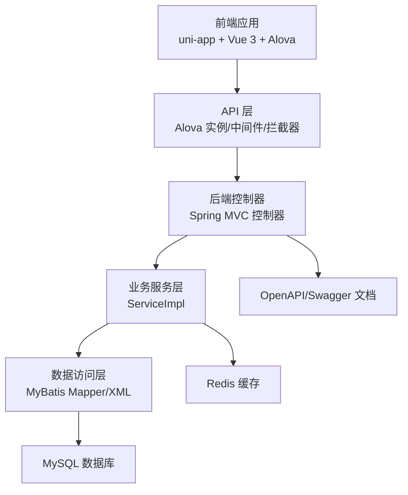
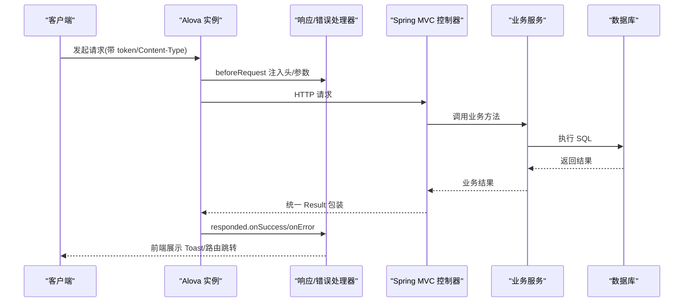
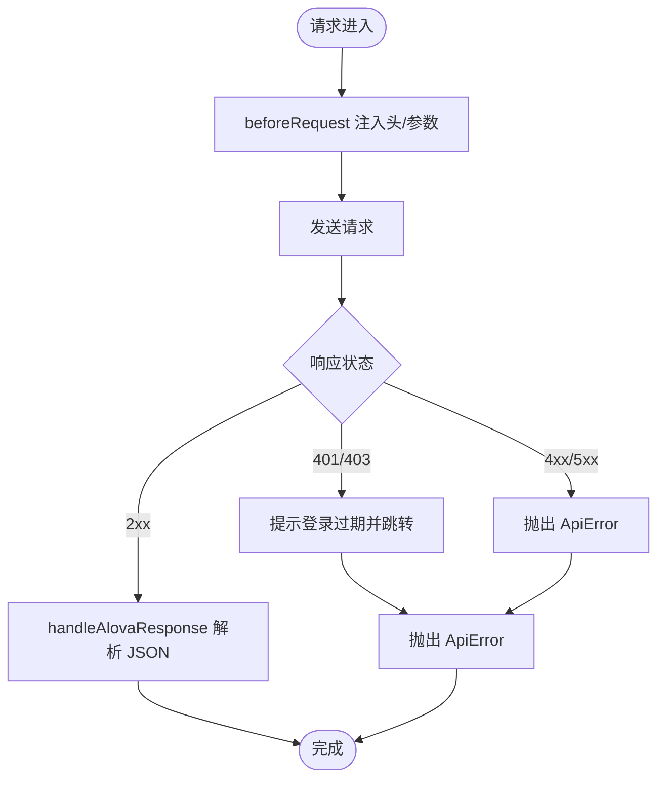
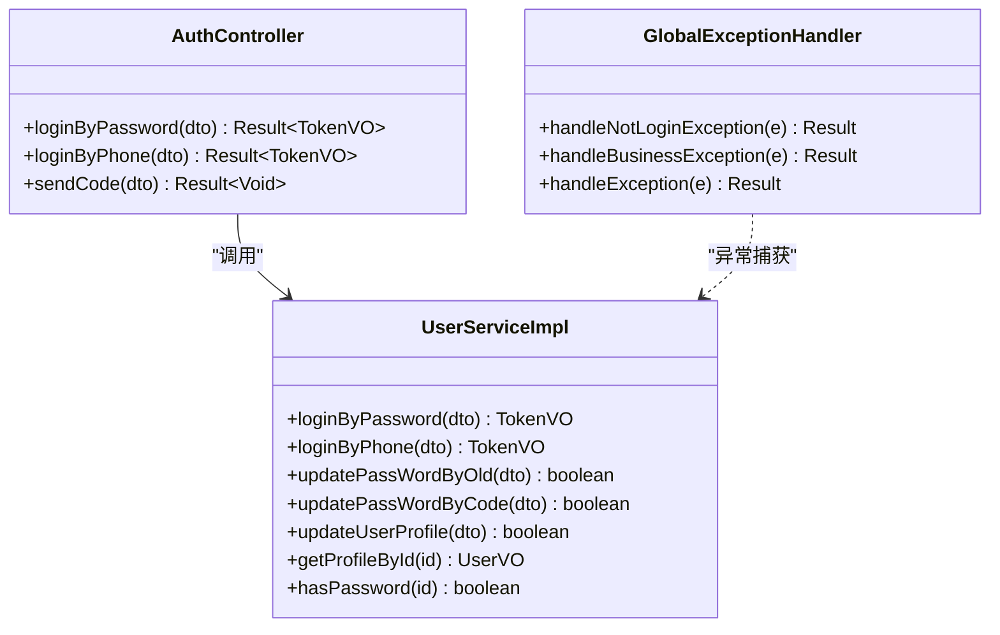
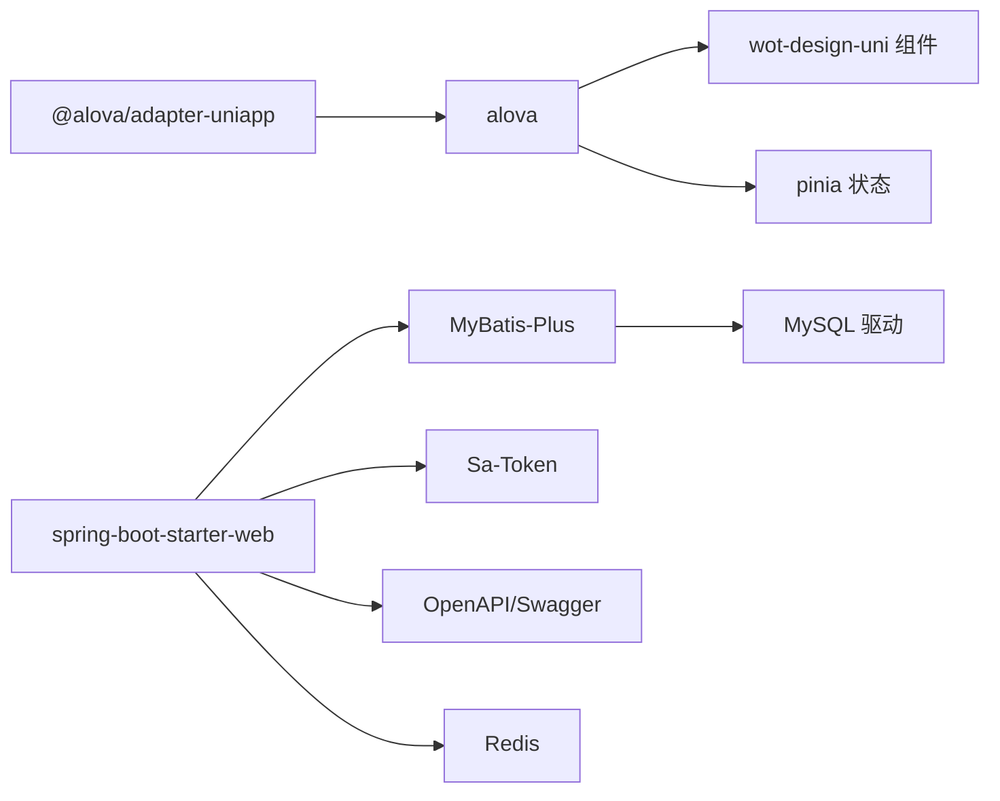
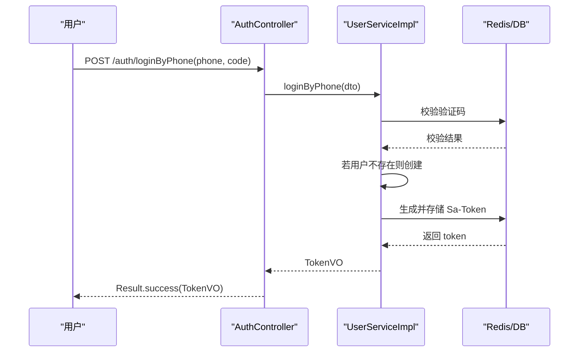

# 故障排除

<cite>
**本文引用的文件**
- [chuan-bill-app/src/api/index.ts](file://chuan-bill-app/src/api/index.ts)
- [chuan-bill-app/src/api/createApis.ts](file://chuan-bill-app/src/api/createApis.ts)
- [chuan-bill-app/src/api/core/instance.ts](file://chuan-bill-app/src/api/core/instance.ts)
- [chuan-bill-app/src/api/core/handlers.ts](file://chuan-bill-app/src/api/core/handlers.ts)
- [chuan-bill-app/src/api/core/middleware.ts](file://chuan-bill-app/src/api/core/middleware.ts)
- [chuan-bill-app/src/utils/index.ts](file://chuan-bill-app/src/utils/index.ts)
- [chuan-bill-app/src/store/themeStore.ts](file://chuan-bill-app/src/store/themeStore.ts)
- [chuan-bill-app/src/composables/useGlobalToast.ts](file://chuan-bill-app/src/composables/useGlobalToast.ts)
- [chuan-bill-app/src/composables/useGlobalLoading.ts](file://chuan-bill-app/src/composables/useGlobalLoading.ts)
- [chuan-bill-app/package.json](file://chuan-bill-app/package.json)
- [chuan-bill-server/src/main/java/com/samoy/chuanbillserver/expection/GlobalExceptionHandler.java](file://chuan-bill-server/src/main/java/com/samoy/chuanbillserver/expection/GlobalExceptionHandler.java)
- [chuan-bill-server/src/main/java/com/samoy/chuanbillserver/expection/BusinessException.java](file://chuan-bill-server/src/main/java/com/samoy/chuanbillserver/expection/BusinessException.java)
- [chuan-bill-server/src/main/java/com/samoy/chuanbillserver/result/ResultEnum.java](file://chuan-bill-server/src/main/java/com/samoy/chuanbillserver/result/ResultEnum.java)
- [chuan-bill-server/src/main/java/com/samoy/chuanbillserver/controller/AuthController.java](file://chuan-bill-server/src/main/java/com/samoy/chuanbillserver/controller/AuthController.java)
- [chuan-bill-server/src/main/java/com/samoy/chuanbillserver/service/impl/UserServiceImpl.java](file://chuan-bill-server/src/main/java/com/samoy/chuanbillserver/service/impl/UserServiceImpl.java)
- [chuan-bill-server/src/main/resources/application.yaml](file://chuan-bill-server/src/main/resources/application.yaml)
- [chuan-bill-server/pom.xml](file://chuan-bill-server/pom.xml)
</cite>

## 目录
1. [简介](#简介)
2. [项目结构](#项目结构)
3. [核心组件](#核心组件)
4. [架构总览](#架构总览)
5. [详细组件分析](#详细组件分析)
6. [依赖分析](#依赖分析)
7. [性能考虑](#性能考虑)
8. [故障排除指南](#故障排除指南)
9. [结论](#结论)
10. [附录](#附录)

## 简介
本指南面向“小川记账”项目的开发与运维人员，提供系统化的故障排除方法与实践建议。内容覆盖开发环境问题、编译错误、运行时异常、API 调用失败、数据库连接问题、网络诊断、日志分析、性能分析、紧急处理流程与监控告警配置等。同时解释错误码含义与处理方式，并给出调试技巧与工具使用建议。

## 项目结构
项目采用前后端分离架构：
- 前端（小程序/H5/多端）基于 uni-app + Vue 3 + Alova，统一发起 HTTP 请求并通过拦截器与响应处理器处理错误与加载态。
- 后端基于 Spring Boot + MyBatis-Plus + Sa-Token，提供 REST 接口与统一异常处理；通过 Swagger/OpenAPI 提供接口文档。

图表来源
- [chuan-bill-app/src/api/core/instance.ts:1-63](file://chuan-bill-app/src/api/core/instance.ts#L1-L63)
- [chuan-bill-server/src/main/java/com/samoy/chuanbillserver/controller/AuthController.java:1-66](file://chuan-bill-server/src/main/java/com/samoy/chuanbillserver/controller/AuthController.java#L1-L66)
- [chuan-bill-server/src/main/java/com/samoy/chuanbillserver/service/impl/UserServiceImpl.java:1-192](file://chuan-bill-server/src/main/java/com/samoy/chuanbillserver/service/impl/UserServiceImpl.java#L1-L192)
- [chuan-bill-server/src/main/resources/application.yaml:1-51](file://chuan-bill-server/src/main/resources/application.yaml#L1-L51)

章节来源
- [chuan-bill-app/src/api/core/instance.ts:1-63](file://chuan-bill-app/src/api/core/instance.ts#L1-L63)
- [chuan-bill-server/src/main/resources/application.yaml:1-51](file://chuan-bill-server/src/main/resources/application.yaml#L1-L51)

## 核心组件
- Alova 实例与拦截器：负责请求前注入头、防缓存参数、统一超时、开发环境日志打印、统一响应与错误处理。
- API 生成与代理：根据 apiDefinitions 动态生成可调用的 Apis 对象，支持路径参数替换与 FormData 自动转换。
- 中间件：提供延迟加载与全局加载中间件，避免快速请求导致的闪烁，提升用户体验。
- 统一异常处理：后端通过 GlobalExceptionHandler 捕获未登录、业务异常与通用异常，返回 Result 结构。
- 错误码体系：ResultEnum 定义了 HTTP 语义错误、系统错误与业务错误码，便于前端统一处理。
- 认证与用户服务：AuthController 提供登录与验证码发送接口；UserServiceImpl 实现密码/验证码登录、密码更新、用户资料查询等。

章节来源
- [chuan-bill-app/src/api/index.ts:1-19](file://chuan-bill-app/src/api/index.ts#L1-L19)
- [chuan-bill-app/src/api/createApis.ts:1-95](file://chuan-bill-app/src/api/createApis.ts#L1-L95)
- [chuan-bill-app/src/api/core/instance.ts:1-63](file://chuan-bill-app/src/api/core/instance.ts#L1-L63)
- [chuan-bill-app/src/api/core/middleware.ts:1-93](file://chuan-bill-app/src/api/core/middleware.ts#L1-L93)
- [chuan-bill-app/src/api/core/handlers.ts:1-105](file://chuan-bill-app/src/api/core/handlers.ts#L1-L105)
- [chuan-bill-server/src/main/java/com/samoy/chuanbillserver/expection/GlobalExceptionHandler.java:1-50](file://chuan-bill-server/src/main/java/com/samoy/chuanbillserver/expection/GlobalExceptionHandler.java#L1-L50)
- [chuan-bill-server/src/main/java/com/samoy/chuanbillserver/result/ResultEnum.java:1-56](file://chuan-bill-server/src/main/java/com/samoy/chuanbillserver/result/ResultEnum.java#L1-L56)
- [chuan-bill-server/src/main/java/com/samoy/chuanbillserver/controller/AuthController.java:1-66](file://chuan-bill-server/src/main/java/com/samoy/chuanbillserver/controller/AuthController.java#L1-L66)
- [chuan-bill-server/src/main/java/com/samoy/chuanbillserver/service/impl/UserServiceImpl.java:1-192](file://chuan-bill-server/src/main/java/com/samoy/chuanbillserver/service/impl/UserServiceImpl.java#L1-L192)

## 架构总览
从前端到后端的关键交互流程如下：

图表来源
- [chuan-bill-app/src/api/core/instance.ts:15-51](file://chuan-bill-app/src/api/core/instance.ts#L15-L51)
- [chuan-bill-app/src/api/core/handlers.ts:34-104](file://chuan-bill-app/src/api/core/handlers.ts#L34-L104)
- [chuan-bill-server/src/main/java/com/samoy/chuanbillserver/controller/AuthController.java:35-64](file://chuan-bill-server/src/main/java/com/samoy/chuanbillserver/controller/AuthController.java#L35-L64)
- [chuan-bill-server/src/main/java/com/samoy/chuanbillserver/service/impl/UserServiceImpl.java:40-83](file://chuan-bill-server/src/main/java/com/samoy/chuanbillserver/service/impl/UserServiceImpl.java#L40-L83)

## 详细组件分析

### 前端 API 与拦截器
- Alova 实例配置要点
  - 基础地址与适配器：根据环境变量设置 baseURL，使用 @alova/adapter-uniapp 适配小程序/H5。
  - 请求前钩子：注入 token、设置 Content-Type、GET 请求加时间戳防缓存；开发模式下打印请求与环境信息。
  - 响应钩子：统一 onSuccess/onError 处理；onComplete 可做清理。
  - 超时与缓存：默认超时较长，缓存策略设为 null。
- 响应与错误处理
  - handleAlovaResponse：处理 401/403 跳转登录；HTTP 错误弹出 Toast；开发模式记录响应。
  - handleAlovaError：区分 NetworkError/TimeoutError/ApiError/未知错误，统一提示并抛出。
- 中间件
  - 延迟加载与全局加载：避免快速请求闪烁；支持自定义延迟与文案。
- API 生成
  - createApis：根据 apiDefinitions 生成可调用对象；支持路径参数替换与 FormData 转换。

图表来源
- [chuan-bill-app/src/api/core/instance.ts:15-51](file://chuan-bill-app/src/api/core/instance.ts#L15-L51)
- [chuan-bill-app/src/api/core/handlers.ts:34-104](file://chuan-bill-app/src/api/core/handlers.ts#L34-L104)

章节来源
- [chuan-bill-app/src/api/core/instance.ts:1-63](file://chuan-bill-app/src/api/core/instance.ts#L1-L63)
- [chuan-bill-app/src/api/core/handlers.ts:1-105](file://chuan-bill-app/src/api/core/handlers.ts#L1-L105)
- [chuan-bill-app/src/api/core/middleware.ts:1-93](file://chuan-bill-app/src/api/core/middleware.ts#L1-L93)
- [chuan-bill-app/src/api/createApis.ts:22-63](file://chuan-bill-app/src/api/createApis.ts#L22-L63)

### 后端控制器与服务
- 认证控制器
  - /auth/loginByPassword：手机号+密码登录，返回 TokenVO。
  - /auth/loginByPhone：手机号+验证码登录，不存在则自动注册。
  - /auth/sendCode：发送短信验证码。
- 用户服务
  - 密码登录：校验手机号/密码，生成 Sa-Token 并返回 TokenVO。
  - 验证码登录：校验验证码，不存在则创建用户。
  - 密码更新：支持旧密码验证与验证码两种方式。
  - 用户资料查询：脱敏手机号后返回用户信息。
- 统一异常处理
  - 未登录：返回 401 对应 Result。
  - 业务异常：按 BusinessException.code 返回。
  - 其他异常：返回通用系统异常提示。

图表来源
- [chuan-bill-server/src/main/java/com/samoy/chuanbillserver/controller/AuthController.java:1-66](file://chuan-bill-server/src/main/java/com/samoy/chuanbillserver/controller/AuthController.java#L1-L66)
- [chuan-bill-server/src/main/java/com/samoy/chuanbillserver/service/impl/UserServiceImpl.java:1-192](file://chuan-bill-server/src/main/java/com/samoy/chuanbillserver/service/impl/UserServiceImpl.java#L1-L192)
- [chuan-bill-server/src/main/java/com/samoy/chuanbillserver/expection/GlobalExceptionHandler.java:1-50](file://chuan-bill-server/src/main/java/com/samoy/chuanbillserver/expection/GlobalExceptionHandler.java#L1-L50)

章节来源
- [chuan-bill-server/src/main/java/com/samoy/chuanbillserver/controller/AuthController.java:1-66](file://chuan-bill-server/src/main/java/com/samoy/chuanbillserver/controller/AuthController.java#L1-L66)
- [chuan-bill-server/src/main/java/com/samoy/chuanbillserver/service/impl/UserServiceImpl.java:1-192](file://chuan-bill-server/src/main/java/com/samoy/chuanbillserver/service/impl/UserServiceImpl.java#L1-L192)
- [chuan-bill-server/src/main/java/com/samoy/chuanbillserver/expection/GlobalExceptionHandler.java:1-50](file://chuan-bill-server/src/main/java/com/samoy/chuanbillserver/expection/GlobalExceptionHandler.java#L1-L50)

## 依赖分析
- 前端依赖
  - @alova/adapter-uniapp：适配 uni-app 的请求适配器。
  - alova：声明式 HTTP 客户端，配合 vueHook 管理状态。
  - wot-design-uni：UI 组件库，提供 Toast/Loading 组件。
  - pinia：状态管理。
- 后端依赖
  - spring-boot-starter-web：Web 服务。
  - mybatis-plus-spring-boot3-starter：ORM。
  - sa-token-spring-boot3-starter：鉴权。
  - springdoc-openapi-starter-webmvc-ui：OpenAPI/Swagger。
  - mysql-connector-j：MySQL 驱动。
  - spring-boot-starter-data-redis：Redis。

图表来源
- [chuan-bill-app/package.json:57-87](file://chuan-bill-app/package.json#L57-L87)
- [chuan-bill-server/pom.xml:51-169](file://chuan-bill-server/pom.xml#L51-L169)

章节来源
- [chuan-bill-app/package.json:1-135](file://chuan-bill-app/package.json#L1-L135)
- [chuan-bill-server/pom.xml:1-226](file://chuan-bill-server/pom.xml#L1-L226)

## 性能考虑
- 前端
  - 避免频繁请求：使用延迟加载中间件减少闪烁与抖动。
  - 缓存策略：当前禁用缓存，确保数据一致性；如需优化可结合业务场景开启合适缓存。
  - 超时设置：默认较长超时，可根据网络环境调整。
- 后端
  - MyBatis 日志：StdOutImpl 输出 SQL，便于定位慢查询。
  - Redis 连接池：合理配置最大活跃/空闲与等待时间。
  - Actuator：启用健康检查与指标导出，便于监控。
- 网络
  - 基础地址与代理：确认 VITE_API_BASE_URL 正确，避免跨域与代理问题。
  - CDN/静态资源：H5 环境注意资源加载与缓存策略。

章节来源
- [chuan-bill-app/src/api/core/instance.ts:56-60](file://chuan-bill-app/src/api/core/instance.ts#L56-L60)
- [chuan-bill-app/src/api/core/middleware.ts:1-93](file://chuan-bill-app/src/api/core/middleware.ts#L1-L93)
- [chuan-bill-server/src/main/resources/application.yaml:32-47](file://chuan-bill-server/src/main/resources/application.yaml#L32-L47)

## 故障排除指南

### 一、开发环境问题
- 症状
  - 开发命令无法启动、端口占用、H5 端口冲突。
- 诊断步骤
  - 检查 package.json 中 dev:* 脚本是否正确。
  - 确认 Node 版本满足要求（引擎字段）。
  - 关闭占用端口进程或切换端口。
- 处理方案
  - 使用 pnpm run dev:h5 或指定平台脚本启动。
  - 如需 SSR，使用 dev:h5:ssr 脚本。

章节来源
- [chuan-bill-app/package.json:11-55](file://chuan-bill-app/package.json#L11-L55)

### 二、编译错误
- 症状
  - TypeScript 报错、ESLint 规则冲突、类型检查失败。
- 诊断步骤
  - 运行 type-check 检查类型。
  - 使用 lint 与 lint:fix 修复可自动修复问题。
- 处理方案
  - 修复类型错误或补充缺失类型。
  - 遵循 ESLint 规则，必要时调整规则配置。

章节来源
- [chuan-bill-app/package.json:52-55](file://chuan-bill-app/package.json#L52-L55)

### 三、运行时异常
- 前端
  - 症状：请求失败、登录过期、网络错误、超时。
  - 诊断：查看控制台日志（开发模式会打印请求与响应）、检查 token 是否存在、Content-Type 是否正确。
  - 处理：handleAlovaError 已统一提示；401/403 会触发路由跳转至登录页。
- 后端
  - 症状：接口报 401/4xx/5xx。
  - 诊断：查看 GlobalExceptionHandler 日志与返回码；确认 Sa-Token 令牌有效性。
  - 处理：根据 ResultEnum 与 BusinessException.code 返回对应提示。

章节来源
- [chuan-bill-app/src/api/core/handlers.ts:34-104](file://chuan-bill-app/src/api/core/handlers.ts#L34-L104)
- [chuan-bill-server/src/main/java/com/samoy/chuanbillserver/expection/GlobalExceptionHandler.java:14-48](file://chuan-bill-server/src/main/java/com/samoy/chuanbillserver/expection/GlobalExceptionHandler.java#L14-L48)

### 四、API 调用失败
- 症状
  - 接口 404、405、422、429、502/504。
- 诊断
  - 检查 apiDefinitions 与路径参数是否匹配；确认 baseURL 与环境变量。
  - 查看 Swagger/OpenAPI 文档确认接口签名与参数。
- 处理
  - 修正路径参数与请求体；根据 ResultEnum 提示用户重试或联系管理员。

章节来源
- [chuan-bill-app/src/api/createApis.ts:22-63](file://chuan-bill-app/src/api/createApis.ts#L22-L63)
- [chuan-bill-server/src/main/resources/application.yaml:41-47](file://chuan-bill-server/src/main/resources/application.yaml#L41-L47)

### 五、数据库连接问题
- 症状
  - 启动时报数据库连接失败、SQL 执行异常。
- 诊断
  - 检查 application.yaml 中 MYSQL_URL/USERNAME/PASSWORD。
  - 确认 MySQL 服务可用、网络可达、账号权限正常。
- 处理
  - 修改环境变量或 application.yaml；重启服务。

章节来源
- [chuan-bill-server/src/main/resources/application.yaml:4-8](file://chuan-bill-server/src/main/resources/application.yaml#L4-L8)

### 六、网络诊断
- 前端
  - 症状：H5 环境请求被拦截、跨域失败。
  - 诊断：确认 baseURL 与 #ifdef H5 的处理逻辑；检查代理与 CORS。
- 后端
  - 症状：外部服务调用失败、网关错误。
  - 诊断：查看 Actuator 健康检查、日志与超时配置。

章节来源
- [chuan-bill-app/src/api/core/instance.ts:8-36](file://chuan-bill-app/src/api/core/instance.ts#L8-L36)
- [chuan-bill-server/pom.xml:55-56](file://chuan-bill-server/pom.xml#L55-L56)

### 七、日志分析
- 前端
  - 开发模式会在控制台打印请求与响应；错误时打印错误上下文。
- 后端
  - GlobalExceptionHandler 记录异常信息；MyBatis StdOutImpl 输出 SQL。
  - Actuator 指标可用于运行时观测。

章节来源
- [chuan-bill-app/src/api/core/instance.ts:28-36](file://chuan-bill-app/src/api/core/instance.ts#L28-L36)
- [chuan-bill-app/src/api/core/handlers.ts:71-77](file://chuan-bill-app/src/api/core/handlers.ts#L71-L77)
- [chuan-bill-server/src/main/resources/application.yaml:38-40](file://chuan-bill-server/src/main/resources/application.yaml#L38-L40)
- [chuan-bill-server/pom.xml:55-56](file://chuan-bill-server/pom.xml#L55-L56)

### 八、性能问题诊断
- 内存泄漏检测
  - 前端：使用浏览器开发者工具的内存快照对比，关注组件卸载与事件解绑。
  - 后端：使用 JVM 堆分析工具定位对象保留链。
- CPU 使用率分析
  - 前端：使用性能面板录制交互，定位长任务与重渲染。
  - 后端：使用 jstack/jprofiler 定位热点线程。
- 网络延迟分析
  - 使用浏览器网络面板查看请求耗时、DNS、TLS、TTFB；后端结合 Actuator 指标。
- 数据库慢查询定位
  - 启用慢查询日志与 EXPLAIN；结合 MyBatis 日志与 Redis 命中率分析。

章节来源
- [chuan-bill-server/src/main/resources/application.yaml:38-40](file://chuan-bill-server/src/main/resources/application.yaml#L38-L40)

### 九、错误码含义与处理
- HTTP 状态码
  - 400：请求参数错误；401：未授权；403：被拒绝；404：资源不存在；405：方法不允许；422：参数校验失败；429：请求过于频繁；500：服务器内部错误；502/504：网关错误。
- 业务异常码（节选）
  - 用户相关：1001 用户不存在、1002 用户被禁用、1003 密码错误、1004/1005 验证码错误/过期、1006/1007 密码/手机号为空。
  - 账单相关：2001 账单不存在、2002/2003/2004 无权查看/修改/删除、2101 OCR识别失败。
  - 文件相关：3001 文件不存在、3002 上传失败。
- 处理建议
  - 前端根据 code 与 message 提示用户并引导重试或补全信息。
  - 后端通过 BusinessException 抛出精确错误码，便于前端统一处理。

章节来源
- [chuan-bill-server/src/main/java/com/samoy/chuanbillserver/result/ResultEnum.java:6-56](file://chuan-bill-server/src/main/java/com/samoy/chuanbillserver/result/ResultEnum.java#L6-L56)
- [chuan-bill-server/src/main/java/com/samoy/chuanbillserver/expection/BusinessException.java:1-36](file://chuan-bill-server/src/main/java/com/samoy/chuanbillserver/expection/BusinessException.java#L1-L36)

### 十、调试技巧与工具使用
- 浏览器开发者工具
  - Console：查看请求/响应日志与错误堆栈。
  - Network：分析请求耗时、状态码、Headers、Body。
  - Performance/Memory：分析性能与内存。
- Vue DevTools
  - 观察组件状态、Props、事件流；Pinia Store 状态变更。
- Postman
  - 直接调用 /auth/* 与业务接口，构造请求体与 Headers（含 token）。
- 数据库查询分析
  - 使用 EXPLAIN 分析慢 SQL；结合 MyBatis 日志定位问题。

章节来源
- [chuan-bill-app/src/api/core/instance.ts:28-36](file://chuan-bill-app/src/api/core/instance.ts#L28-L36)
- [chuan-bill-server/src/main/resources/application.yaml:41-47](file://chuan-bill-server/src/main/resources/application.yaml#L41-L47)

### 十一、紧急处理流程
- 立即措施
  - 停止对外发布异常版本；回滚到上一个稳定版本。
  - 检查数据库与 Redis 连接，恢复服务。
- 诊断与修复
  - 快速定位错误码与异常堆栈；修复代码或配置。
  - 对外公告：说明影响范围、预计恢复时间。
- 恢复验证
  - 回归测试关键路径（登录、账单、文件上传）。
  - 观察日志与监控指标，确认恢复正常。

章节来源
- [chuan-bill-server/src/main/java/com/samoy/chuanbillserver/expection/GlobalExceptionHandler.java:14-48](file://chuan-bill-server/src/main/java/com/samoy/chuanbillserver/expection/GlobalExceptionHandler.java#L14-L48)

### 十二、监控告警配置
- 建议指标
  - 前端：请求失败率、首屏加载时间、白屏时间、JS 异常数。
  - 后端：接口 QPS/错误率/延迟、数据库连接数/慢查询、Redis 命中率、JVM GC 时间。
- 告警阈值
  - 错误率超过 1% 持续 5 分钟；延迟 P95 超过 2 秒；数据库连接空闲超时。
- 工具建议
  - 前端：Sentry/百度统计/微信小程序性能监控。
  - 后端：Prometheus/Grafana/Pinpoint/JProfiler。

章节来源
- [chuan-bill-server/pom.xml:55-56](file://chuan-bill-server/pom.xml#L55-L56)
- [chuan-bill-server/src/main/resources/application.yaml:38-40](file://chuan-bill-server/src/main/resources/application.yaml#L38-L40)

## 结论
本指南提供了从开发环境、编译、运行时异常、API 调用、数据库连接到性能与监控的全链路故障排除方法。建议团队建立标准化的日志规范、错误码体系与监控告警机制，结合工具链快速定位与解决问题，保障系统稳定性与用户体验。

## 附录

### A. 常见问题清单与参考路径
- 症状：H5 端跨域失败
  - 参考：[chuan-bill-app/src/api/core/instance.ts:8-36](file://chuan-bill-app/src/api/core/instance.ts#L8-L36)
- 症状：登录后立即 401
  - 参考：[chuan-bill-app/src/api/core/handlers.ts:42-51](file://chuan-bill-app/src/api/core/handlers.ts#L42-L51)
- 症状：数据库连接失败
  - 参考：[chuan-bill-server/src/main/resources/application.yaml:4-8](file://chuan-bill-server/src/main/resources/application.yaml#L4-L8)
- 症状：接口 422 参数校验失败
  - 参考：[chuan-bill-server/src/main/java/com/samoy/chuanbillserver/expection/GlobalExceptionHandler.java:32-36](file://chuan-bill-server/src/main/java/com/samoy/chuanbillserver/expection/GlobalExceptionHandler.java#L32-L36)
- 症状：验证码登录失败
  - 参考：[chuan-bill-server/src/main/java/com/samoy/chuanbillserver/service/impl/UserServiceImpl.java:64-83](file://chuan-bill-server/src/main/java/com/samoy/chuanbillserver/service/impl/UserServiceImpl.java#L64-L83)

### B. 关键流程图（API 登录序列）

图表来源
- [chuan-bill-server/src/main/java/com/samoy/chuanbillserver/controller/AuthController.java:47-51](file://chuan-bill-server/src/main/java/com/samoy/chuanbillserver/controller/AuthController.java#L47-L51)
- [chuan-bill-server/src/main/java/com/samoy/chuanbillserver/service/impl/UserServiceImpl.java:64-83](file://chuan-bill-server/src/main/java/com/samoy/chuanbillserver/service/impl/UserServiceImpl.java#L64-L83)