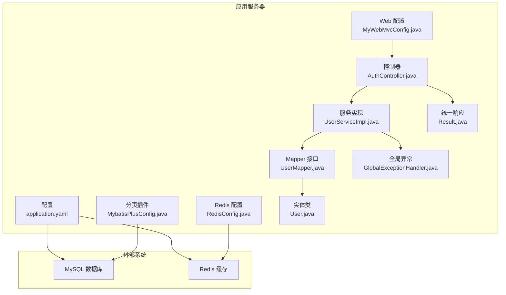
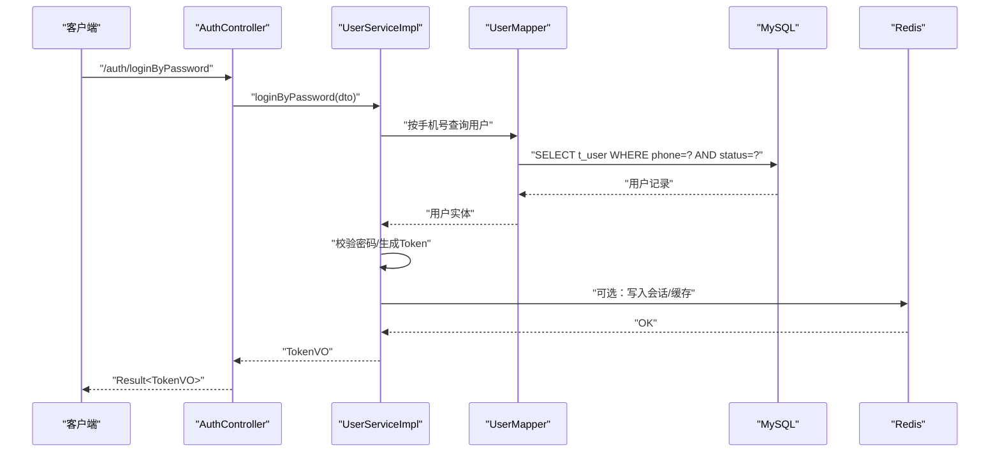
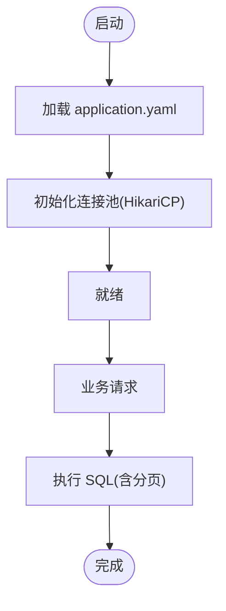
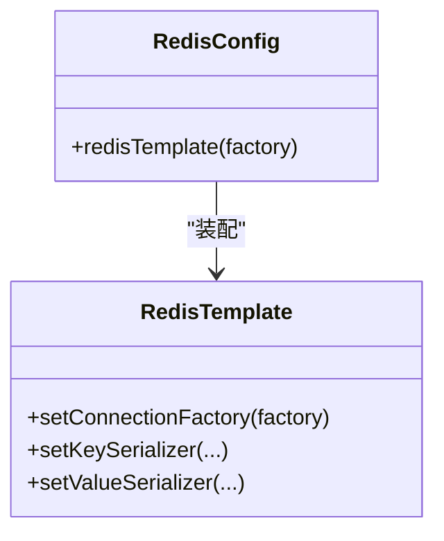
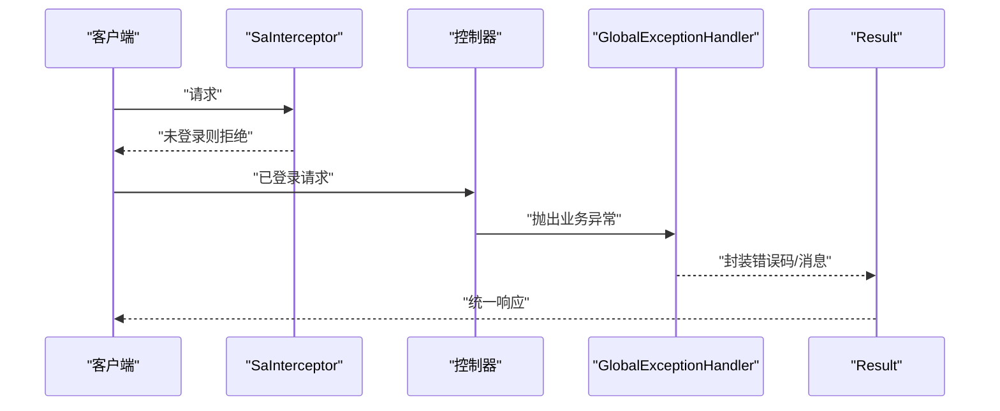
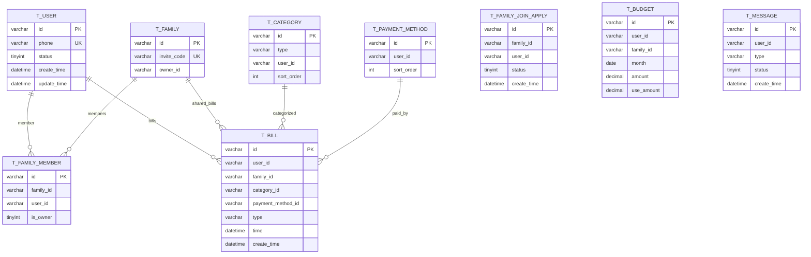
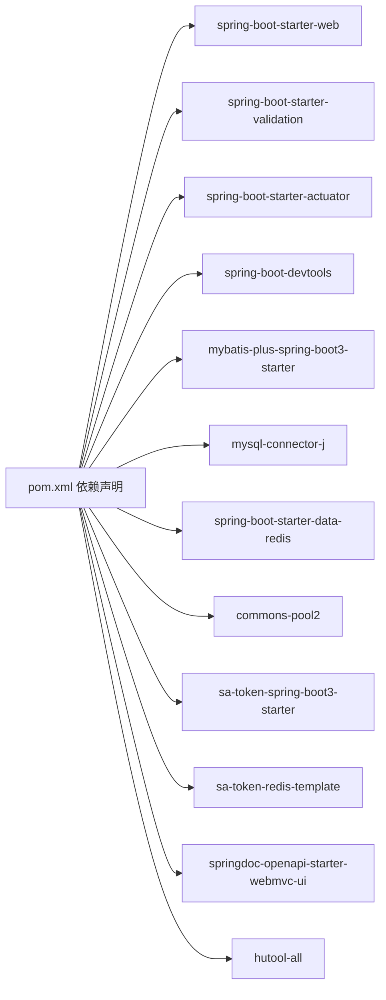

# 网络与数据库问题

<cite>
**本文引用的文件**
- [application.yaml](file://chuan-bill-server/src/main/resources/application.yaml)
- [pom.xml](file://chuan-bill-server/pom.xml)
- [init.sql](file://chuan-bill-server/init.sql)
- [RedisConfig.java](file://chuan-bill-server/src/main/java/com/samoy/chuanbillserver/config/RedisConfig.java)
- [MybatisPlusConfig.java](file://chuan-bill-server/src/main/java/com/samoy/chuanbillserver/config/MybatisPlusConfig.java)
- [MyWebMvcConfig.java](file://chuan-bill-server/src/main/java/com/samoy/chuanbillserver/config/MyWebMvcConfig.java)
- [GlobalExceptionHandler.java](file://chuan-bill-server/src/main/java/com/samoy/chuanbillserver/expection/GlobalExceptionHandler.java)
- [UserMapper.java](file://chuan-bill-server/src/main/java/com/samoy/chuanbillserver/dao/UserMapper.java)
- [User.java](file://chuan-bill-server/src/main/java/com/samoy/chuanbillserver/entity/User.java)
- [UserServiceImpl.java](file://chuan-bill-server/src/main/java/com/samoy/chuanbillserver/service/impl/UserServiceImpl.java)
- [Result.java](file://chuan-bill-server/src/main/java/com/samoy/chuanbillserver/result/Result.java)
- [AuthController.java](file://chuan-bill-server/src/main/java/com/samoy/chuanbillserver/controller/AuthController.java)
</cite>

## 目录
1. [简介](#简介)
2. [项目结构](#项目结构)
3. [核心组件](#核心组件)
4. [架构总览](#架构总览)
5. [详细组件分析](#详细组件分析)
6. [依赖关系分析](#依赖关系分析)
7. [性能考量](#性能考量)
8. [故障排除指南](#故障排除指南)
9. [结论](#结论)
10. [附录](#附录)

## 简介
本指南聚焦于“小川记账”项目的网络与数据库问题排查与优化，覆盖以下主题：
- 数据库连接问题诊断与解决：MySQL 连接超时、连接池配置、死锁检测、慢查询分析
- Redis 缓存问题排查：连接失败、数据过期、缓存穿透、缓存雪崩的预防与处理
- 网络问题诊断工具与方法：DNS 解析、SSL 证书验证、代理配置、防火墙规则
- SQL 优化与索引设计：基于现有表结构给出优化建议与事务处理策略
- 备份恢复与灾难恢复：基于初始化脚本与配置的可操作流程

## 项目结构
后端采用 Spring Boot + MyBatis-Plus + Sa-Token + SpringDoc（OpenAPI/Swagger）技术栈，数据库与缓存通过环境变量注入，具备基础的全局异常处理与统一响应封装。

图表来源
- [application.yaml:1-51](file://chuan-bill-server/src/main/resources/application.yaml#L1-L51)
- [MyWebMvcConfig.java:1-21](file://chuan-bill-server/src/main/java/com/samoy/chuanbillserver/config/MyWebMvcConfig.java#L1-L21)
- [RedisConfig.java:1-32](file://chuan-bill-server/src/main/java/com/samoy/chuanbillserver/config/RedisConfig.java#L1-L32)
- [MybatisPlusConfig.java:1-18](file://chuan-bill-server/src/main/java/com/samoy/chuanbillserver/config/MybatisPlusConfig.java#L1-L18)
- [AuthController.java:1-66](file://chuan-bill-server/src/main/java/com/samoy/chuanbillserver/controller/AuthController.java#L1-L66)
- [UserServiceImpl.java:1-192](file://chuan-bill-server/src/main/java/com/samoy/chuanbillserver/service/impl/UserServiceImpl.java#L1-L192)
- [UserMapper.java:1-15](file://chuan-bill-server/src/main/java/com/samoy/chuanbillserver/dao/UserMapper.java#L1-L15)
- [User.java:1-94](file://chuan-bill-server/src/main/java/com/samoy/chuanbillserver/entity/User.java#L1-L94)
- [GlobalExceptionHandler.java:1-50](file://chuan-bill-server/src/main/java/com/samoy/chuanbillserver/expection/GlobalExceptionHandler.java#L1-L50)
- [Result.java:1-50](file://chuan-bill-server/src/main/java/com/samoy/chuanbillserver/result/Result.java#L1-L50)

章节来源
- [application.yaml:1-51](file://chuan-bill-server/src/main/resources/application.yaml#L1-L51)
- [pom.xml:1-226](file://chuan-bill-server/pom.xml#L1-L226)

## 核心组件
- 数据源与缓存配置：通过环境变量注入 MySQL 与 Redis 的连接参数，包含连接超时、连接池大小等关键参数。
- 认证与权限：Sa-Token 拦截器对所有请求进行登录校验，除开放路径外。
- ORM 与分页：MyBatis-Plus 提供通用 Mapper 与分页插件，支持 MySQL。
- 统一响应与异常：Result 封装统一返回结构；GlobalExceptionHandler 统一处理未登录、业务与系统异常。
- 初始化脚本：init.sql 提供完整的建库建表与系统默认数据初始化。

章节来源
- [application.yaml:4-21](file://chuan-bill-server/src/main/resources/application.yaml#L4-L21)
- [MyWebMvcConfig.java:10-20](file://chuan-bill-server/src/main/java/com/samoy/chuanbillserver/config/MyWebMvcConfig.java#L10-L20)
- [MybatisPlusConfig.java:9-17](file://chuan-bill-server/src/main/java/com/samoy/chuanbillserver/config/MybatisPlusConfig.java#L9-L17)
- [Result.java:8-50](file://chuan-bill-server/src/main/java/com/samoy/chuanbillserver/result/Result.java#L8-L50)
- [GlobalExceptionHandler.java:10-50](file://chuan-bill-server/src/main/java/com/samoy/chuanbillserver/expection/GlobalExceptionHandler.java#L10-L50)
- [init.sql:1-326](file://chuan-bill-server/init.sql#L1-L326)

## 架构总览
下图展示从客户端到后端、再到数据库与缓存的整体交互路径，以及异常与响应的统一出口。

图表来源
- [AuthController.java:35-39](file://chuan-bill-server/src/main/java/com/samoy/chuanbillserver/controller/AuthController.java#L35-L39)
- [UserServiceImpl.java:41-61](file://chuan-bill-server/src/main/java/com/samoy/chuanbillserver/service/impl/UserServiceImpl.java#L41-L61)
- [UserMapper.java:1-15](file://chuan-bill-server/src/main/java/com/samoy/chuanbillserver/dao/UserMapper.java#L1-L15)
- [User.java:23-92](file://chuan-bill-server/src/main/java/com/samoy/chuanbillserver/entity/User.java#L23-L92)
- [application.yaml:4-21](file://chuan-bill-server/src/main/resources/application.yaml#L4-L21)

## 详细组件分析

### 数据库连接与连接池
- 连接参数：驱动、URL、用户名、密码通过环境变量注入；URL 中包含时区与字符集设置。
- 连接池：Spring Boot JDBC Starter 默认 HikariCP；可通过 application.yaml 调整连接池大小、空闲、等待时间等。
- MyBatis-Plus：分页插件配置为 MySQL，确保分页 SQL 适配。

图表来源
- [application.yaml:4-21](file://chuan-bill-server/src/main/resources/application.yaml#L4-L21)
- [MybatisPlusConfig.java:10-17](file://chuan-bill-server/src/main/java/com/samoy/chuanbillserver/config/MybatisPlusConfig.java#L10-L17)

章节来源
- [application.yaml:4-21](file://chuan-bill-server/src/main/resources/application.yaml#L4-L21)
- [MybatisPlusConfig.java:9-17](file://chuan-bill-server/src/main/java/com/samoy/chuanbillserver/config/MybatisPlusConfig.java#L9-L17)

### Redis 缓存配置与序列化
- 连接：通过 application.yaml 注入 host/port/password/timeout/database。
- 序列化：RedisConfig 使用字符串键与 JSON 值序列化，保证跨语言与可读性。
- 连接池：Apache Commons Pool2 提供连接池能力。

图表来源
- [RedisConfig.java:13-30](file://chuan-bill-server/src/main/java/com/samoy/chuanbillserver/config/RedisConfig.java#L13-L30)
- [application.yaml:9-21](file://chuan-bill-server/src/main/resources/application.yaml#L9-L21)

章节来源
- [RedisConfig.java:1-32](file://chuan-bill-server/src/main/java/com/samoy/chuanbillserver/config/RedisConfig.java#L1-L32)
- [application.yaml:9-21](file://chuan-bill-server/src/main/resources/application.yaml#L9-L21)
- [pom.xml:74-78](file://chuan-bill-server/pom.xml#L74-L78)

### 认证拦截与全局异常
- 拦截器：MyWebMvcConfig 对所有请求进行 Sa-Token 登录校验，开放 /auth、Swagger 路径。
- 全局异常：GlobalExceptionHandler 统一处理未登录、业务异常与系统异常，返回 Result 结构。

图表来源
- [MyWebMvcConfig.java:10-20](file://chuan-bill-server/src/main/java/com/samoy/chuanbillserver/config/MyWebMvcConfig.java#L10-L20)
- [GlobalExceptionHandler.java:12-48](file://chuan-bill-server/src/main/java/com/samoy/chuanbillserver/expection/GlobalExceptionHandler.java#L12-L48)
- [Result.java:12-50](file://chuan-bill-server/src/main/java/com/samoy/chuanbillserver/result/Result.java#L12-L50)

章节来源
- [MyWebMvcConfig.java:1-21](file://chuan-bill-server/src/main/java/com/samoy/chuanbillserver/config/MyWebMvcConfig.java#L1-L21)
- [GlobalExceptionHandler.java:1-50](file://chuan-bill-server/src/main/java/com/samoy/chuanbillserver/expection/GlobalExceptionHandler.java#L1-L50)
- [Result.java:1-50](file://chuan-bill-server/src/main/java/com/samoy/chuanbillserver/result/Result.java#L1-L50)

### 数据模型与索引
- 用户表、类目表、支付方式表、家庭表、家庭成员表、家庭加入申请表、账单表、预算表、消息表均在 init.sql 中定义。
- 关键字段与索引：手机号唯一索引、状态/创建时间索引、多字段组合索引（如用户+时间、家庭+时间）等，支撑高频查询与范围查询。

图表来源
- [init.sql:14-201](file://chuan-bill-server/init.sql#L14-L201)

章节来源
- [init.sql:1-326](file://chuan-bill-server/init.sql#L1-L326)

## 依赖关系分析
- Spring Boot Starter：web、validation、actuator、devtools、dotenv（可选）
- MyBatis-Plus：starter、generator、jsqlparser、分页插件
- 数据库：MySQL Connector/J
- 缓存：Spring Boot Data Redis、Commons Pool2
- 权限：Sa-Token（starter + redis-template）
- 工具：Hutool
- 文档：SpringDoc OpenAPI

图表来源
- [pom.xml:51-168](file://chuan-bill-server/pom.xml#L51-L168)

章节来源
- [pom.xml:1-226](file://chuan-bill-server/pom.xml#L1-L226)

## 性能考量
- 连接池配置：根据并发与 QPS 调整最大活跃连接数、最大空闲、最小空闲与最大等待时间；避免连接泄漏与饥饿。
- 分页与索引：优先使用覆盖索引与复合索引；避免 SELECT *，仅取必要字段；对高频过滤字段建立索引。
- 缓存策略：热点数据加缓存，设置合理过期时间；对冷数据及时淘汰；避免缓存击穿与穿透。
- SQL 优化：避免隐式转换、函数包裹索引列、不必要的排序与大偏移分页；使用 EXPLAIN 分析执行计划。
- 事务策略：短事务、减少锁持有时间；避免长事务与跨表大事务；合理设置隔离级别。

## 故障排除指南

### 一、数据库连接问题
- 症状
  - 连接超时：应用日志出现连接获取超时或连接断开
  - 连接池耗尽：大量排队等待连接
  - 死锁：事务执行报错，提示死锁
  - 慢查询：接口响应时间飙升
- 诊断步骤
  - 连接超时与池配置
    - 检查 application.yaml 中数据库连接参数与连接池配置项
    - 查看连接池指标（HikariCP 默认暴露在 actuator 端点）
  - 死锁检测
    - 在 MySQL 中开启通用日志或慢查询日志定位冲突 SQL
    - 使用 SHOW ENGINE INNODB STATUS 观察最近一次死锁详情
  - 慢查询分析
    - 开启慢查询日志，设置阈值
    - 使用 EXPLAIN 分析高耗时 SQL，检查索引使用情况
- 解决建议
  - 调整连接池参数，增加最大连接数与空闲连接，缩短最大等待时间
  - 优化热点查询 SQL，补充缺失索引；拆分复杂事务
  - 对高频写入场景采用批量提交与幂等设计

章节来源
- [application.yaml:4-21](file://chuan-bill-server/src/main/resources/application.yaml#L4-L21)
- [pom.xml:103-107](file://chuan-bill-server/pom.xml#L103-L107)

### 二、Redis 缓存问题
- 症状
  - 连接失败：连接超时、认证失败
  - 数据过期：频繁失效导致缓存命中率低
  - 缓存穿透：查询不存在数据造成后端压力
  - 缓存雪崩：大量键同时过期引发后端瞬时压力
- 诊断步骤
  - 连接失败
    - 检查 application.yaml 中 host/port/password/timeout/database
    - 使用 redis-cli 测试连通性与鉴权
  - 数据过期
    - 校验 TTL 设置与更新策略
    - 观察热点键的访问模式
  - 缓存穿透
    - 校验空值缓存与布隆过滤器策略
  - 缓存雪崩
    - 检查过期时间是否集中；引入随机抖动
- 解决建议
  - 合理设置过期时间与自动续期
  - 对空值做短期缓存；对热点数据双写一致性
  - 对过期时间加随机值；降级熔断

章节来源
- [application.yaml:9-21](file://chuan-bill-server/src/main/resources/application.yaml#L9-L21)
- [RedisConfig.java:1-32](file://chuan-bill-server/src/main/java/com/samoy/chuanbillserver/config/RedisConfig.java#L1-L32)
- [pom.xml:74-78](file://chuan-bill-server/pom.xml#L74-L78)

### 三、网络问题诊断
- DNS 解析
  - 使用 nslookup/dig 检查域名解析；确认本地 hosts 与系统解析顺序
- SSL 证书
  - 使用 openssl s_client 验证证书链与过期时间；检查系统时间与时区
- 代理与防火墙
  - 确认代理配置与放行端口；检查防火墙策略与安全组规则
- 工具与命令
  - telnet/nc：测试端口连通
  - curl/openssl：验证 HTTPS 与证书
  - ss/netstat：排查监听与连接状态

### 四、SQL 优化与索引设计
- 建议
  - 为高频过滤字段建立单列或复合索引
  - 使用覆盖索引减少回表
  - 避免在 WHERE 子句中对索引列使用函数或隐式转换
  - 控制 JOIN 层级与连接字段类型一致
- 索引设计原则
  - 区分度高且常用作过滤的字段优先
  - 复合索引遵循“最左前缀”原则
  - 定期评估索引使用率，清理无效索引
- 事务处理策略
  - 短事务、快速提交
  - 合理设置隔离级别，避免长事务
  - 对并发写入场景使用乐观锁或队列削峰

章节来源
- [init.sql:14-201](file://chuan-bill-server/init.sql#L14-L201)

### 五、备份恢复与灾难恢复
- 备份策略
  - 全量备份：定期导出数据库（mysqldump 或物理备份）
  - 增量备份：开启 binlog 并定期归档
  - Redis：RDB 快照与 AOF 日志结合
- 恢复流程
  - MySQL：停止服务 -> 恢复全量 -> 应用增量 -> 启动服务并校验
  - Redis：恢复 RDB -> 启动服务 -> 校验数据
- 灾难恢复预案
  - 多地容灾：异地部署与自动化切换
  - 降级策略：缓存降级、只读接口保留、熔断限流
  - 回滚机制：版本化发布与灰度回滚

章节来源
- [init.sql:1-326](file://chuan-bill-server/init.sql#L1-L326)
- [application.yaml:4-21](file://chuan-bill-server/src/main/resources/application.yaml#L4-L21)

## 结论
本指南基于项目现有配置与代码，提供了从连接参数、连接池、缓存序列化、认证拦截到统一异常与响应的全链路视图，并针对数据库与缓存常见问题给出了可操作的诊断与优化建议。建议在生产环境中结合监控与压测持续迭代配置与 SQL。

## 附录
- 关键配置项速查
  - 数据库：driver-class-name、url、username、password
  - Redis：host、port、database、password、timeout、连接池参数
  - Sa-Token：token 名称、超时、并发与日志
  - MyBatis-Plus：分页插件与日志实现
- 参考文件
  - [application.yaml:1-51](file://chuan-bill-server/src/main/resources/application.yaml#L1-L51)
  - [pom.xml:1-226](file://chuan-bill-server/pom.xml#L1-L226)
  - [init.sql:1-326](file://chuan-bill-server/init.sql#L1-L326)