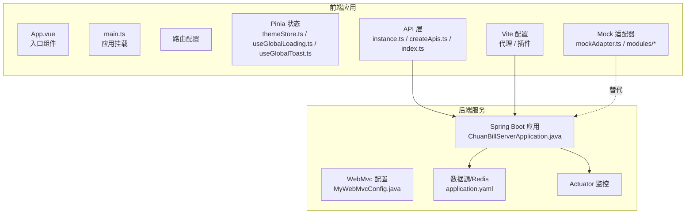
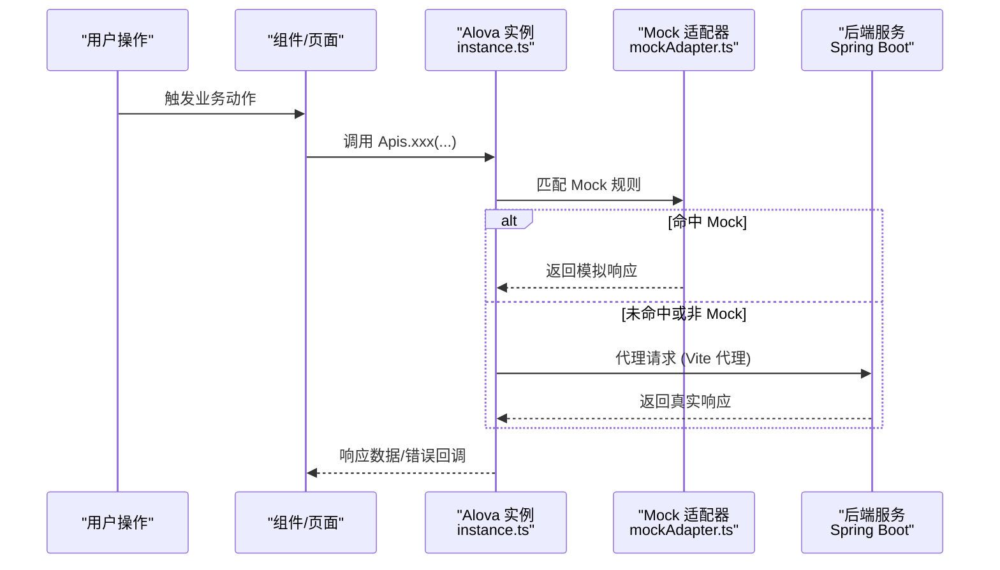
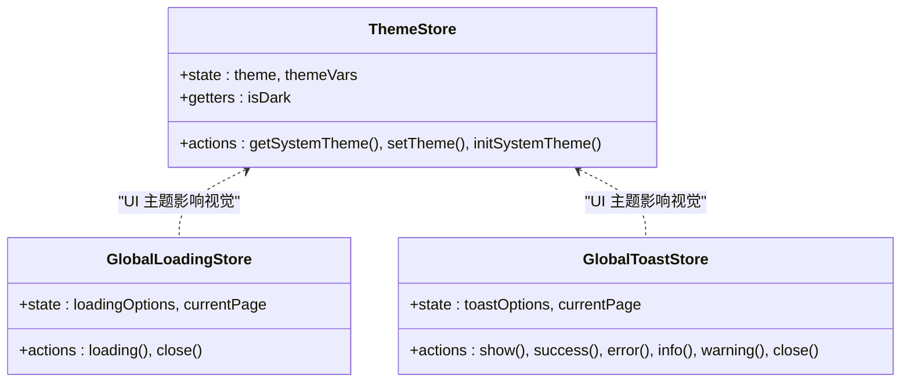
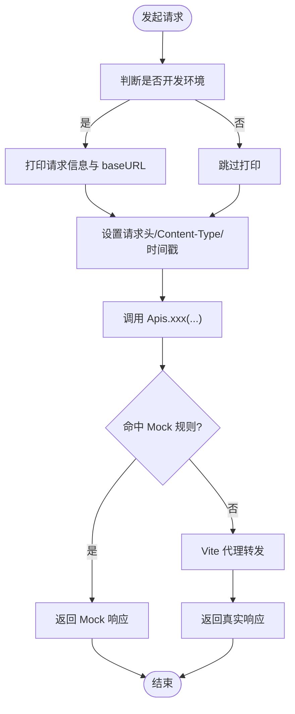
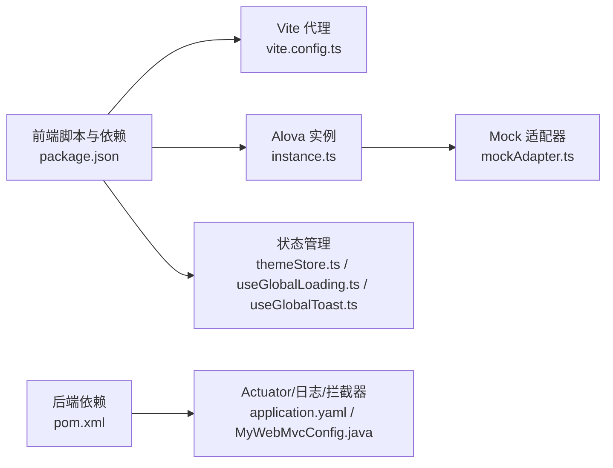

# 调试工具与技巧

<cite>
**本文引用的文件**
- [package.json](file://chuan-bill-app/package.json)
- [vite.config.ts](file://chuan-bill-app/vite.config.ts)
- [main.ts](file://chuan-bill-app/src/main.ts)
- [App.vue](file://chuan-bill-app/src/App.vue)
- [index.ts](file://chuan-bill-app/src/api/index.ts)
- [createApis.ts](file://chuan-bill-app/src/api/createApis.ts)
- [instance.ts](file://chuan-bill-app/src/api/core/instance.ts)
- [middleware.ts](file://chuan-bill-app/src/api/core/middleware.ts)
- [mockAdapter.ts](file://chuan-bill-app/src/api/mock/mockAdapter.ts)
- [common.ts](file://chuan-bill-app/src/api/mock/modules/common.ts)
- [user.ts](file://chuan-bill-app/src/api/mock/modules/user.ts)
- [themeStore.ts](file://chuan-bill-app/src/store/themeStore.ts)
- [useGlobalLoading.ts](file://chuan-bill-app/src/composables/useGlobalLoading.ts)
- [useGlobalToast.ts](file://chuan-bill-app/src/composables/useGlobalToast.ts)
- [pom.xml](file://chuan-bill-server/pom.xml)
- [application.yaml](file://chuan-bill-server/src/main/resources/application.yaml)
- [ChuanBillServerApplication.java](file://chuan-bill-server/src/main/java/com/samoy/chuanbillserver/ChuanBillServerApplication.java)
- [MyWebMvcConfig.java](file://chuan-bill-server/src/main/java/com/samoy/chuanbillserver/config/MyWebMvcConfig.java)
</cite>

## 目录
1. 引言
2. 项目结构
3. 核心组件
4. 架构总览
5. 详细组件分析
6. 依赖分析
7. 性能考虑
8. 故障排除指南
9. 结论
10. 附录

## 引言
本指南面向“小川记账”项目的前端与后端开发者，聚焦于调试工具与技巧的实操性建议，覆盖以下方面：
- 浏览器开发者工具：网络面板、控制台、性能、内存快照
- Vue DevTools：组件树、状态、事件、性能
- Postman：请求构造、响应分析、环境变量、自动化测试
- 后端调试：Spring Boot Actuator、日志级别、远程调试
- 移动端调试：微信开发者工具、真机调试、性能分析

本指南结合代码库中的实际实现（如 Alova 请求实例、Mock 适配器、代理配置、Pinia 状态等）给出可落地的调试策略。

## 项目结构
项目由两部分组成：
- 前端应用（基于 uni-app/Vue 3 + Vite）：负责页面、路由、状态、API 调用与 Mock
- 后端服务（Spring Boot 3 + Actuator）：提供 REST 接口、权限拦截、数据库与 Redis 连接

图示来源
- [main.ts:1-16](file://chuan-bill-app/src/main.ts#L1-L16)
- [App.vue:1-16](file://chuan-bill-app/src/App.vue#L1-L16)
- [instance.ts:1-63](file://chuan-bill-app/src/api/core/instance.ts#L1-L63)
- [createApis.ts:1-95](file://chuan-bill-app/src/api/createApis.ts#L1-L95)
- [index.ts:1-19](file://chuan-bill-app/src/api/index.ts#L1-L19)
- [mockAdapter.ts:1-48](file://chuan-bill-app/src/api/mock/mockAdapter.ts#L1-L48)
- [vite.config.ts:1-80](file://chuan-bill-app/vite.config.ts#L1-L80)
- [ChuanBillServerApplication.java:1-15](file://chuan-bill-server/src/main/java/com/samoy/chuanbillserver/ChuanBillServerApplication.java#L1-L15)
- [MyWebMvcConfig.java:1-21](file://chuan-bill-server/src/main/java/com/samoy/chuanbillserver/config/MyWebMvcConfig.java#L1-L21)
- [application.yaml:1-51](file://chuan-bill-server/src/main/resources/application.yaml#L1-L51)

章节来源
- [package.json:1-135](file://chuan-bill-app/package.json#L1-L135)
- [vite.config.ts:1-80](file://chuan-bill-app/vite.config.ts#L1-L80)
- [main.ts:1-16](file://chuan-bill-app/src/main.ts#L1-L16)
- [App.vue:1-16](file://chuan-bill-app/src/App.vue#L1-L16)
- [instance.ts:1-63](file://chuan-bill-app/src/api/core/instance.ts#L1-L63)
- [createApis.ts:1-95](file://chuan-bill-app/src/api/createApis.ts#L1-L95)
- [index.ts:1-19](file://chuan-bill-app/src/api/index.ts#L1-L19)
- [mockAdapter.ts:1-48](file://chuan-bill-app/src/api/mock/mockAdapter.ts#L1-L48)
- [ChuanBillServerApplication.java:1-15](file://chuan-bill-server/src/main/java/com/samoy/chuanbillserver/ChuanBillServerApplication.java#L1-L15)
- [MyWebMvcConfig.java:1-21](file://chuan-bill-server/src/main/java/com/samoy/chuanbillserver/config/MyWebMvcConfig.java#L1-L21)
- [application.yaml:1-51](file://chuan-bill-server/src/main/resources/application.yaml#L1-L51)

## 核心组件
- 前端应用入口与状态
  - 应用挂载与路由、Pinia 注册在应用入口完成，便于统一调试生命周期与状态变更
- API 层
  - Alova 实例集中配置 baseURL、请求头、超时、缓存策略、请求/响应钩子
  - 通过 createApis 动态生成 API 方法，支持路径参数替换与表单数据转换
- Mock 体系
  - 统一的 mockAdapter 聚合各模块，支持延迟、日志、路径匹配模式
- Vite 开发服务器
  - 本地代理到后端 8080 端口，便于前后联调
- 后端服务
  - Spring Boot Actuator 开启监控端点
  - Sa-Token 拦截器全局鉴权，Swagger/OpenAPI 文档可用

章节来源
- [main.ts:1-16](file://chuan-bill-app/src/main.ts#L1-L16)
- [instance.ts:1-63](file://chuan-bill-app/src/api/core/instance.ts#L1-L63)
- [createApis.ts:1-95](file://chuan-bill-app/src/api/createApis.ts#L1-L95)
- [index.ts:1-19](file://chuan-bill-app/src/api/index.ts#L1-L19)
- [mockAdapter.ts:1-48](file://chuan-bill-app/src/api/mock/mockAdapter.ts#L1-L48)
- [vite.config.ts:70-78](file://chuan-bill-app/vite.config.ts#L70-L78)
- [pom.xml:55-168](file://chuan-bill-server/pom.xml#L55-L168)
- [application.yaml:1-51](file://chuan-bill-server/src/main/resources/application.yaml#L1-L51)

## 架构总览
前端通过 Alova 发起请求，开发模式下经 Vite 代理转发至后端；生产模式下 Alova 的 baseURL 生效。Mock 适配器在开发环境下优先返回模拟数据，同时保留真实 HTTP 适配器兜底。

图示来源
- [instance.ts:1-63](file://chuan-bill-app/src/api/core/instance.ts#L1-L63)
- [mockAdapter.ts:1-48](file://chuan-bill-app/src/api/mock/mockAdapter.ts#L1-L48)
- [vite.config.ts:70-78](file://chuan-bill-app/vite.config.ts#L70-L78)

## 详细组件分析

### 组件树与状态调试（Vue DevTools）
- 组件树分析
  - 使用组件树查看页面层级、布局组件与业务组件关系，定位渲染热点与重复更新节点
- 状态检查
  - Pinia Store：主题、全局加载、全局 Toast 等状态可通过 DevTools 的“组件”和“状态”面板观察
  - 主题状态：useThemeStore 提供系统主题读取与初始化逻辑
  - 全局加载/提示：useGlobalLoading/useGlobalToast 提供统一的加载与提示状态
- 事件追踪
  - 在组件事件绑定处设置断点，结合控制台输出定位事件触发链路
- 性能监控
  - 利用 DevTools 的性能面板记录重渲染、计算耗时，配合代码中的响应式数据变更点进行优化

图示来源
- [themeStore.ts:1-75](file://chuan-bill-app/src/store/themeStore.ts#L1-L75)
- [useGlobalLoading.ts:1-38](file://chuan-bill-app/src/composables/useGlobalLoading.ts#L1-L38)
- [useGlobalToast.ts:1-62](file://chuan-bill-app/src/composables/useGlobalToast.ts#L1-L62)

章节来源
- [themeStore.ts:1-75](file://chuan-bill-app/src/store/themeStore.ts#L1-L75)
- [useGlobalLoading.ts:1-38](file://chuan-bill-app/src/composables/useGlobalLoading.ts#L1-L38)
- [useGlobalToast.ts:1-62](file://chuan-bill-app/src/composables/useGlobalToast.ts#L1-L62)

### API 调用与 Mock 调试（Alova）
- 请求实例与代理
  - Alova 实例集中配置 baseURL、请求头、Content-Type、GET 时间戳防缓存、超时与缓存策略
  - Vite 代理将 /api 前缀请求转发至本地 8080 端口，便于联调
- 动态 API 生成
  - createApis 通过 apiDefinitions 生成方法，支持路径参数替换与 FormData 自动转换
- Mock 适配器
  - mockAdapter 聚合 common、user、pet、store 模块，支持随机延迟、开发日志、路径匹配模式
- 调试要点
  - 开发环境打印请求与 baseURL，便于核对请求目标
  - 使用中间件统一处理加载态，避免频繁闪烁
  - 对异常场景（400/404/409 等）进行边界测试

图示来源
- [instance.ts:15-36](file://chuan-bill-app/src/api/core/instance.ts#L15-L36)
- [createApis.ts:22-62](file://chuan-bill-app/src/api/createApis.ts#L22-L62)
- [mockAdapter.ts:28-45](file://chuan-bill-app/src/api/mock/mockAdapter.ts#L28-L45)
- [vite.config.ts:70-78](file://chuan-bill-app/vite.config.ts#L70-L78)

章节来源
- [instance.ts:1-63](file://chuan-bill-app/src/api/core/instance.ts#L1-L63)
- [createApis.ts:1-95](file://chuan-bill-app/src/api/createApis.ts#L1-L95)
- [index.ts:1-19](file://chuan-bill-app/src/api/index.ts#L1-L19)
- [mockAdapter.ts:1-48](file://chuan-bill-app/src/api/mock/mockAdapter.ts#L1-L48)
- [common.ts:1-31](file://chuan-bill-app/src/api/mock/modules/common.ts#L1-L31)
- [user.ts:1-305](file://chuan-bill-app/src/api/mock/modules/user.ts#L1-L305)
- [vite.config.ts:70-78](file://chuan-bill-app/vite.config.ts#L70-L78)

### 中间件与加载态调试
- 延迟加载中间件
  - 控制 loading 状态，避免快速请求导致的闪烁
- 全局加载中间件
  - 支持自定义延迟与文案，统一处理请求生命周期内的加载态
- 调试建议
  - 在复杂页面或批量请求场景下启用全局加载中间件
  - 结合 useGlobalLoading 与 useGlobalToast 观察状态变化

章节来源
- [middleware.ts:1-93](file://chuan-bill-app/src/api/core/middleware.ts#L1-L93)
- [useGlobalLoading.ts:1-38](file://chuan-bill-app/src/composables/useGlobalLoading.ts#L1-L38)
- [useGlobalToast.ts:1-62](file://chuan-bill-app/src/composables/useGlobalToast.ts#L1-L62)

### 后端调试（Spring Boot）
- Actuator 监控
  - 开启 Actuator，访问健康检查、指标与线程转储等端点，辅助排查运行时问题
- 日志级别
  - application.yaml 中 MyBatis 输出 SQL 日志，便于定位数据库层问题
- 权限拦截
  - Sa-Token 拦截器对除开放路径外的所有请求进行登录校验
- Swagger/OpenAPI
  - OpenAPI 文档与 Swagger UI 可用于接口文档与联调验证

章节来源
- [pom.xml:55-168](file://chuan-bill-server/pom.xml#L55-L168)
- [application.yaml:1-51](file://chuan-bill-server/src/main/resources/application.yaml#L1-L51)
- [MyWebMvcConfig.java:1-21](file://chuan-bill-server/src/main/java/com/samoy/chuanbillserver/config/MyWebMvcConfig.java#L1-L21)

## 依赖分析
- 前端
  - uni-app/Vue 3 + Vite + Pinia + Alova + Mock + UnoCSS + 插件生态
  - 通过 Vite 代理与 Alova baseURL 协同工作
- 后端
  - Spring Boot + Actuator + Sa-Token + MyBatis Plus + Redis + OpenAPI/Swagger

图示来源
- [package.json:1-135](file://chuan-bill-app/package.json#L1-L135)
- [vite.config.ts:1-80](file://chuan-bill-app/vite.config.ts#L1-L80)
- [instance.ts:1-63](file://chuan-bill-app/src/api/core/instance.ts#L1-L63)
- [mockAdapter.ts:1-48](file://chuan-bill-app/src/api/mock/mockAdapter.ts#L1-L48)
- [themeStore.ts:1-75](file://chuan-bill-app/src/store/themeStore.ts#L1-L75)
- [useGlobalLoading.ts:1-38](file://chuan-bill-app/src/composables/useGlobalLoading.ts#L1-L38)
- [useGlobalToast.ts:1-62](file://chuan-bill-app/src/composables/useGlobalToast.ts#L1-L62)
- [pom.xml:55-168](file://chuan-bill-server/pom.xml#L55-L168)
- [application.yaml:1-51](file://chuan-bill-server/src/main/resources/application.yaml#L1-L51)
- [MyWebMvcConfig.java:1-21](file://chuan-bill-server/src/main/java/com/samoy/chuanbillserver/config/MyWebMvcConfig.java#L1-L21)

章节来源
- [package.json:1-135](file://chuan-bill-app/package.json#L1-L135)
- [pom.xml:55-168](file://chuan-bill-server/pom.xml#L55-L168)

## 性能考虑
- 前端
  - 使用中间件统一加载态，减少 UI 抖动
  - Alova 缓存策略设为关闭，避免缓存干扰调试
  - 开发环境打印请求信息，便于定位慢请求
- 后端
  - Actuator 指标与日志结合，定位慢查询与高并发瓶颈
  - Sa-Token 与拦截器确保请求路径正确性，减少无效请求

章节来源
- [instance.ts:56-60](file://chuan-bill-app/src/api/core/instance.ts#L56-L60)
- [middleware.ts:49-93](file://chuan-bill-app/src/api/core/middleware.ts#L49-L93)
- [application.yaml:32-47](file://chuan-bill-server/src/main/resources/application.yaml#L32-L47)

## 故障排除指南

### 浏览器开发者工具
- 网络面板分析
  - 关注请求路径、状态码、响应体大小与耗时
  - 使用“保持网络面板刷新”与“禁用缓存”复现问题
  - 对比 Mock 与真实接口差异，确认代理是否生效
- 控制台调试
  - 查看请求日志与 baseURL 输出，确认目标服务地址
  - 检查全局加载与提示状态是否按预期切换
- 性能分析
  - 使用性能面板记录重渲染、事件循环与长任务
  - 定位组件渲染热点与不必要的重复计算
- 内存快照
  - 对比操作前后的堆快照，识别未释放的监听器或大对象

章节来源
- [instance.ts:28-36](file://chuan-bill-app/src/api/core/instance.ts#L28-L36)
- [vite.config.ts:70-78](file://chuan-bill-app/vite.config.ts#L70-L78)
- [useGlobalLoading.ts:1-38](file://chuan-bill-app/src/composables/useGlobalLoading.ts#L1-L38)
- [useGlobalToast.ts:1-62](file://chuan-bill-app/src/composables/useGlobalToast.ts#L1-L62)

### Vue DevTools 高级用法
- 组件树分析
  - 定位布局与业务组件层级，识别深层嵌套导致的重渲染
- 状态检查
  - 观察 Pinia 状态变更轨迹，确认主题与加载态切换逻辑
- 事件追踪
  - 在事件绑定处设置断点，结合控制台输出定位事件链路
- 性能监控
  - 使用 DevTools 的性能面板记录重渲染，结合代码优化

章节来源
- [themeStore.ts:1-75](file://chuan-bill-app/src/store/themeStore.ts#L1-L75)
- [useGlobalLoading.ts:1-38](file://chuan-bill-app/src/composables/useGlobalLoading.ts#L1-L38)
- [useGlobalToast.ts:1-62](file://chuan-bill-app/src/composables/useGlobalToast.ts#L1-L62)

### Postman 调试最佳实践
- 请求构造
  - 使用环境变量管理 baseURL、token 与参数
  - 通过预请求脚本注入动态参数（如时间戳、签名）
- 响应分析
  - 使用 Tests 脚本断言状态码、字段存在与数据格式
- 自动化测试
  - 将常用接口封装为集合，执行集合以回归关键流程
- 环境变量管理
  - 开发/测试/生产三套环境，隔离数据与凭据

（本节为通用实践说明，不直接分析具体文件）

### 后端调试技巧
- Spring Boot Actuator
  - 访问健康检查与指标端点，观察 JVM、线程、HTTP 请求统计
- 日志级别调整
  - 在 application.yaml 中开启 SQL 日志，定位慢查询
- 远程调试配置
  - 启动参数添加远程调试端口，IDE 连接后设置断点
- 权限与拦截
  - Sa-Token 拦截器确保受保护接口的登录状态，排除鉴权问题

章节来源
- [pom.xml:55-168](file://chuan-bill-server/pom.xml#L55-L168)
- [application.yaml:1-51](file://chuan-bill-server/src/main/resources/application.yaml#L1-L51)
- [MyWebMvcConfig.java:1-21](file://chuan-bill-server/src/main/java/com/samoy/chuanbillserver/config/MyWebMvcConfig.java#L1-L21)

### 移动端调试
- 微信开发者工具
  - 使用“真机调试”与“性能分析”，关注首屏渲染与网络请求
  - 通过“调试器”查看控制台与网络面板
- 真机调试
  - 通过内网穿透或局域网共享，结合浏览器开发者工具进行联调
- 性能分析工具
  - 使用系统自带性能分析器，定位主线程阻塞与内存泄漏

（本节为通用实践说明，不直接分析具体文件）

## 结论
本指南围绕“小川记账”的前端与后端调试场景，提供了从工具使用到代码实现的全链路建议。通过合理利用浏览器开发者工具、Vue DevTools、Alova/Mock、Vite 代理、Actuator 与 Sa-Token 等能力，可以高效定位并解决开发与联调过程中的常见问题。建议在日常开发中固化调试流程与断点策略，持续优化性能与稳定性。

## 附录
- 常用命令
  - 前端开发：启动 H5/小程序多端开发与构建
  - 后端开发：Spring Boot 应用启动与热部署

章节来源
- [package.json:11-55](file://chuan-bill-app/package.json#L11-L55)
- [ChuanBillServerApplication.java:1-15](file://chuan-bill-server/src/main/java/com/samoy/chuanbillserver/ChuanBillServerApplication.java#L1-L15)