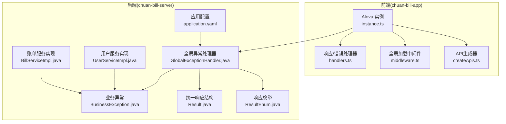
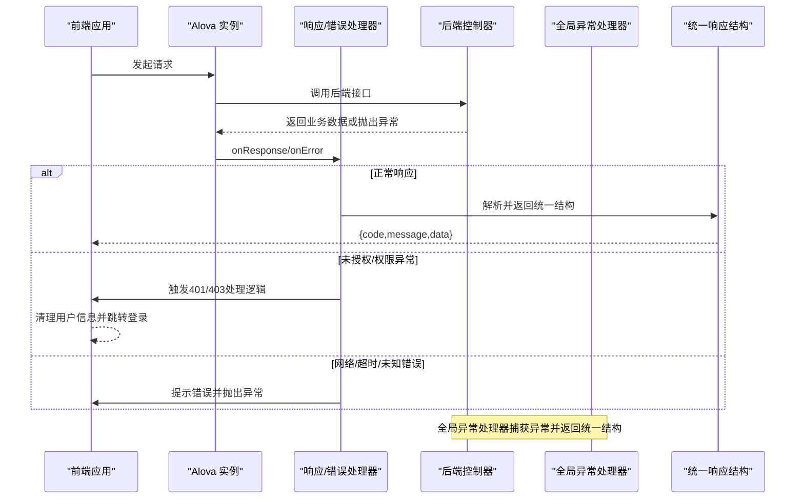
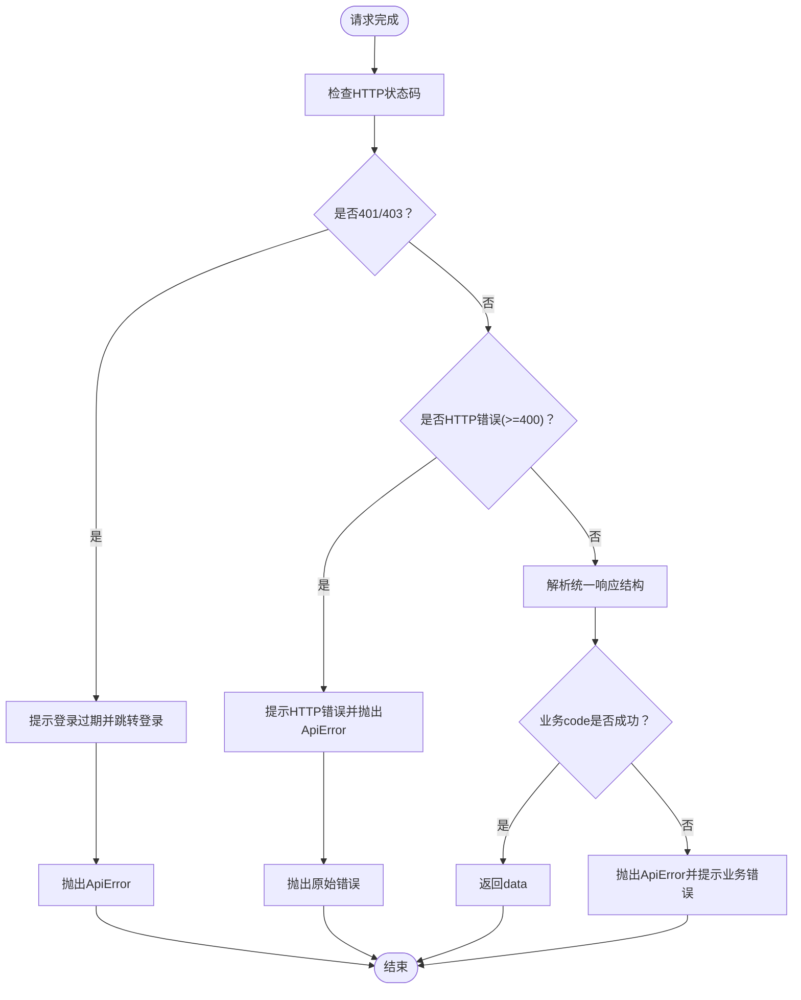
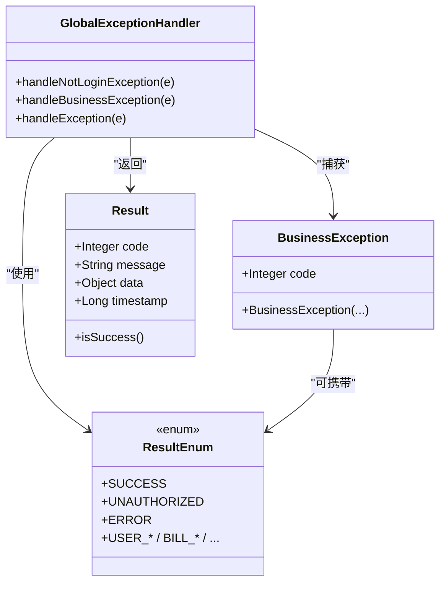
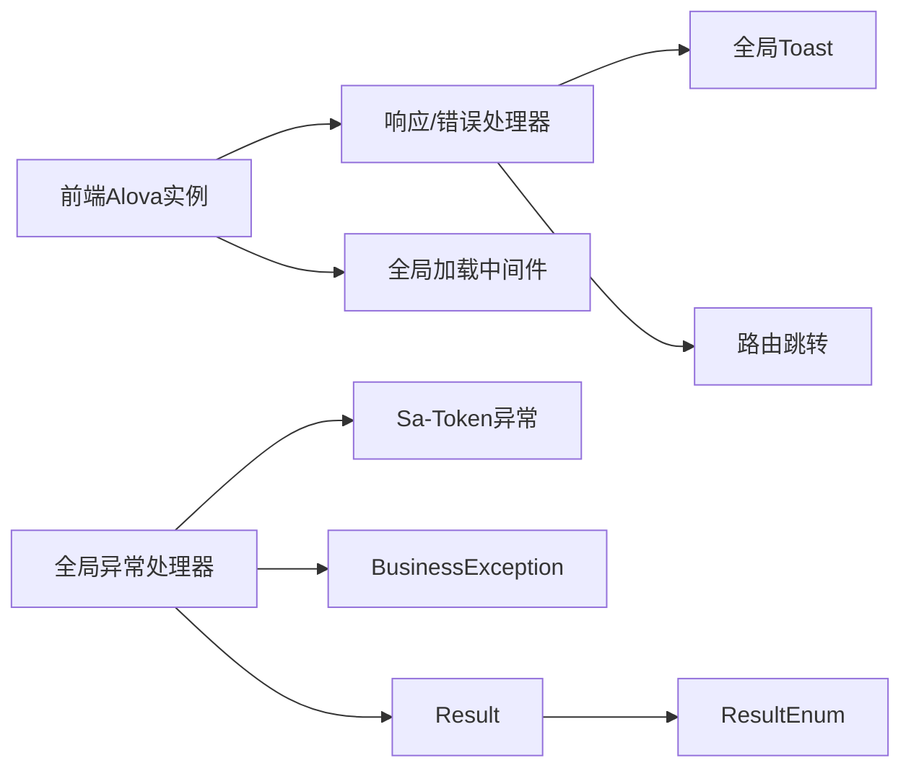

# 运行时异常

<cite>
**本文引用的文件**
- [前端响应与错误处理器 handlers.ts](file://chuan-bill-app/src/api/core/handlers.ts)
- [前端请求实例与拦截器 instance.ts](file://chuan-bill-app/src/api/core/instance.ts)
- [前端全局加载中间件 middleware.ts](file://chuan-bill-app/src/api/core/middleware.ts)
- [前端API生成 createApis.ts](file://chuan-bill-app/src/api/createApis.ts)
- [后端全局异常处理器 GlobalExceptionHandler.java](file://chuan-bill-server/src/main/java/com/samoy/chuanbillserver/expection/GlobalExceptionHandler.java)
- [后端业务异常 BusinessException.java](file://chuan-bill-server/src/main/java/com/samoy/chuanbillserver/expection/BusinessException.java)
- [后端统一响应结构 Result.java](file://chuan-bill-server/src/main/java/com/samoy/chuanbillserver/result/Result.java)
- [后端统一响应枚举 ResultEnum.java](file://chuan-bill-server/src/main/java/com/samoy/chuanbillserver/result/ResultEnum.java)
- [后端认证控制器 AuthController.java](file://chuan-bill-server/src/main/java/com/samoy/chuanbillserver/controller/AuthController.java)
- [后端账单控制器 BillController.java](file://chuan-bill-server/src/main/java/com/samoy/chuanbillserver/controller/BillController.java)
- [后端用户服务实现 UserServiceImpl.java](file://chuan-bill-server/src/main/java/com/samoy/chuanbillserver/service/impl/UserServiceImpl.java)
- [后端账单服务实现 BillServiceImpl.java](file://chuan-bill-server/src/main/java/com/samoy/chuanbillserver/service/impl/BillServiceImpl.java)
- [后端应用配置 application.yaml](file://chuan-bill-server/src/main/resources/application.yaml)
</cite>

## 目录
1. [简介](#简介)
2. [项目结构](#项目结构)
3. [核心组件](#核心组件)
4. [架构总览](#架构总览)
5. [详细组件分析](#详细组件分析)
6. [依赖分析](#依赖分析)
7. [性能考虑](#性能考虑)
8. [故障排除指南](#故障排除指南)
9. [结论](#结论)
10. [附录](#附录)

## 简介
本指南聚焦于小川记账项目的运行时异常处理与故障排除，覆盖前端API错误处理机制（401/403未授权、网络错误、超时错误、业务异常）与后端全局异常处理器（BusinessException业务异常、参数校验异常、权限异常）。文档提供错误码对照表、处理策略、日志分析示例与最佳实践，帮助开发者快速定位与解决问题。

## 项目结构
小川记账采用前后端分离架构：
- 前端基于 Vue + Alova，通过自定义适配器与拦截器统一处理响应与错误，并提供全局加载中间件。
- 后端基于 Spring Boot + Sa-Token，通过@RestControllerAdvice统一捕获异常并返回标准响应结构。

图表来源
- [前端请求实例与拦截器 instance.ts:1-63](file://chuan-bill-app/src/api/core/instance.ts#L1-L63)
- [前端响应与错误处理器 handlers.ts:1-105](file://chuan-bill-app/src/api/core/handlers.ts#L1-L105)
- [前端全局加载中间件 middleware.ts:1-93](file://chuan-bill-app/src/api/core/middleware.ts#L1-L93)
- [前端API生成 createApis.ts:1-95](file://chuan-bill-app/src/api/createApis.ts#L1-L95)
- [后端全局异常处理器 GlobalExceptionHandler.java:1-50](file://chuan-bill-server/src/main/java/com/samoy/chuanbillserver/expection/GlobalExceptionHandler.java#L1-L50)
- [后端业务异常 BusinessException.java:1-36](file://chuan-bill-server/src/main/java/com/samoy/chuanbillserver/expection/BusinessException.java#L1-L36)
- [后端统一响应结构 Result.java:1-50](file://chuan-bill-server/src/main/java/com/samoy/chuanbillserver/result/Result.java#L1-L50)
- [后端统一响应枚举 ResultEnum.java:1-56](file://chuan-bill-server/src/main/java/com/samoy/chuanbillserver/result/ResultEnum.java#L1-L56)
- [后端用户服务实现 UserServiceImpl.java:1-192](file://chuan-bill-server/src/main/java/com/samoy/chuanbillserver/service/impl/UserServiceImpl.java#L1-L192)
- [后端账单服务实现 BillServiceImpl.java:1-244](file://chuan-bill-server/src/main/java/com/samoy/chuanbillserver/service/impl/BillServiceImpl.java#L1-L244)
- [后端应用配置 application.yaml:1-51](file://chuan-bill-server/src/main/resources/application.yaml#L1-L51)

章节来源
- [前端请求实例与拦截器 instance.ts:1-63](file://chuan-bill-app/src/api/core/instance.ts#L1-L63)
- [后端全局异常处理器 GlobalExceptionHandler.java:1-50](file://chuan-bill-server/src/main/java/com/samoy/chuanbillserver/expection/GlobalExceptionHandler.java#L1-L50)

## 核心组件
- 前端Alova实例：配置基础URL、适配器、请求头、缓存策略、超时时间与拦截器。
- 响应/错误处理器：统一解析后端返回结构，处理401/403未授权、HTTP错误、网络/超时错误与业务异常。
- 全局加载中间件：延迟显示加载状态，避免快速请求闪烁。
- 后端全局异常处理器：捕获未登录、业务异常与其他异常，统一返回Result结构。
- 统一响应结构与枚举：定义标准响应字段与HTTP/业务错误码。

章节来源
- [前端响应与错误处理器 handlers.ts:1-105](file://chuan-bill-app/src/api/core/handlers.ts#L1-L105)
- [前端全局加载中间件 middleware.ts:1-93](file://chuan-bill-app/src/api/core/middleware.ts#L1-L93)
- [后端全局异常处理器 GlobalExceptionHandler.java:1-50](file://chuan-bill-server/src/main/java/com/samoy/chuanbillserver/expection/GlobalExceptionHandler.java#L1-L50)
- [后端统一响应结构 Result.java:1-50](file://chuan-bill-server/src/main/java/com/samoy/chuanbillserver/result/Result.java#L1-L50)
- [后端统一响应枚举 ResultEnum.java:1-56](file://chuan-bill-server/src/main/java/com/samoy/chuanbillserver/result/ResultEnum.java#L1-L56)

## 架构总览
前端通过Alova发起请求，后端通过@RestControllerAdvice统一处理异常，最终以统一的Result结构返回给前端。前端在响应阶段与错误阶段分别处理不同类型的异常并给出用户提示。

图表来源
- [前端请求实例与拦截器 instance.ts:1-63](file://chuan-bill-app/src/api/core/instance.ts#L1-L63)
- [前端响应与错误处理器 handlers.ts:1-105](file://chuan-bill-app/src/api/core/handlers.ts#L1-L105)
- [后端全局异常处理器 GlobalExceptionHandler.java:1-50](file://chuan-bill-server/src/main/java/com/samoy/chuanbillserver/expection/GlobalExceptionHandler.java#L1-L50)
- [后端统一响应结构 Result.java:1-50](file://chuan-bill-server/src/main/java/com/samoy/chuanbillserver/result/Result.java#L1-L50)

## 详细组件分析

### 前端API错误处理机制
- 401/403未授权：在响应阶段检测HTTP状态码，触发全局Toast提示并跳转至登录页；在错误阶段对ApiError进行二次处理，确保一致的未授权行为。
- 网络错误：识别NetworkError类型，提示“网络错误，请检查您的网络连接”。
- 超时错误：识别TimeoutError类型，提示“请求超时，请重试”。
- 业务异常：当后端返回非2xx且包含业务错误码时，前端抛出ApiError，由全局Toast展示错误消息。

图表来源
- [前端响应与错误处理器 handlers.ts:34-104](file://chuan-bill-app/src/api/core/handlers.ts#L34-L104)
- [前端请求实例与拦截器 instance.ts:39-60](file://chuan-bill-app/src/api/core/instance.ts#L39-L60)

章节来源
- [前端响应与错误处理器 handlers.ts:1-105](file://chuan-bill-app/src/api/core/handlers.ts#L1-L105)
- [前端请求实例与拦截器 instance.ts:1-63](file://chuan-bill-app/src/api/core/instance.ts#L1-L63)

### 后端全局异常处理器工作原理
- 未登录异常：捕获NotLoginException，返回UNAUTHORIZED对应的统一响应。
- 业务异常：捕获BusinessException，返回其携带的业务code与message。
- 其他异常：捕获Exception，返回系统异常提示。

图表来源
- [后端全局异常处理器 GlobalExceptionHandler.java:1-50](file://chuan-bill-server/src/main/java/com/samoy/chuanbillserver/expection/GlobalExceptionHandler.java#L1-L50)
- [后端业务异常 BusinessException.java:1-36](file://chuan-bill-server/src/main/java/com/samoy/chuanbillserver/expection/BusinessException.java#L1-L36)
- [后端统一响应结构 Result.java:1-50](file://chuan-bill-server/src/main/java/com/samoy/chuanbillserver/result/Result.java#L1-L50)
- [后端统一响应枚举 ResultEnum.java:1-56](file://chuan-bill-server/src/main/java/com/samoy/chuanbillserver/result/ResultEnum.java#L1-L56)

章节来源
- [后端全局异常处理器 GlobalExceptionHandler.java:1-50](file://chuan-bill-server/src/main/java/com/samoy/chuanbillserver/expection/GlobalExceptionHandler.java#L1-L50)
- [后端业务异常 BusinessException.java:1-36](file://chuan-bill-server/src/main/java/com/samoy/chuanbillserver/expection/BusinessException.java#L1-L36)
- [后端统一响应结构 Result.java:1-50](file://chuan-bill-server/src/main/java/com/samoy/chuanbillserver/result/Result.java#L1-L50)
- [后端统一响应枚举 ResultEnum.java:1-56](file://chuan-bill-server/src/main/java/com/samoy/chuanbillserver/result/ResultEnum.java#L1-L56)

### 参数校验异常与权限异常
- 参数校验异常：Spring MVC在控制器层通过@Validated对DTO进行参数校验，校验失败会抛出异常，由全局异常处理器捕获并返回对应错误码（如422）。
- 权限异常：控制器通过Sa-Token获取登录用户ID，若业务逻辑发现越权（如非本人账单），抛出BusinessException，前端收到业务错误码并提示。

章节来源
- [后端认证控制器 AuthController.java:1-66](file://chuan-bill-server/src/main/java/com/samoy/chuanbillserver/controller/AuthController.java#L1-L66)
- [后端账单控制器 BillController.java:1-91](file://chuan-bill-server/src/main/java/com/samoy/chuanbillserver/controller/BillController.java#L1-L91)
- [后端用户服务实现 UserServiceImpl.java:1-192](file://chuan-bill-server/src/main/java/com/samoy/chuanbillserver/service/impl/UserServiceImpl.java#L1-L192)
- [后端账单服务实现 BillServiceImpl.java:1-244](file://chuan-bill-server/src/main/java/com/samoy/chuanbillserver/service/impl/BillServiceImpl.java#L1-L244)

## 依赖分析
- 前端Alova实例依赖：
  - 适配器：@alova/adapter-uniapp（用于小程序/UniApp环境）
  - 拦截器：beforeRequest（设置token、Content-Type、GET防缓存）、responded.onSuccess/onError（统一处理响应与错误）
  - 中间件：全局加载中间件（可选）
- 后端全局异常处理器依赖：
  - Sa-Token：提供未登录异常类型
  - BusinessException：业务异常载体
  - Result/ResultEnum：统一响应结构与错误码

图表来源
- [前端请求实例与拦截器 instance.ts:1-63](file://chuan-bill-app/src/api/core/instance.ts#L1-L63)
- [前端响应与错误处理器 handlers.ts:1-105](file://chuan-bill-app/src/api/core/handlers.ts#L1-L105)
- [后端全局异常处理器 GlobalExceptionHandler.java:1-50](file://chuan-bill-server/src/main/java/com/samoy/chuanbillserver/expection/GlobalExceptionHandler.java#L1-L50)
- [后端统一响应结构 Result.java:1-50](file://chuan-bill-server/src/main/java/com/samoy/chuanbillserver/result/Result.java#L1-L50)
- [后端统一响应枚举 ResultEnum.java:1-56](file://chuan-bill-server/src/main/java/com/samoy/chuanbillserver/result/ResultEnum.java#L1-L56)

章节来源
- [前端请求实例与拦截器 instance.ts:1-63](file://chuan-bill-app/src/api/core/instance.ts#L1-L63)
- [后端全局异常处理器 GlobalExceptionHandler.java:1-50](file://chuan-bill-server/src/main/java/com/samoy/chuanbillserver/expection/GlobalExceptionHandler.java#L1-L50)

## 性能考虑
- 前端：
  - 关闭全局缓存（cacheFor=null）避免陈旧数据影响调试与测试。
  - 合理设置超时时间（默认30秒），避免长时间阻塞。
  - 使用延迟加载中间件减少快速请求的闪烁。
- 后端：
  - MyBatis-Plus开启日志便于开发调试，生产建议关闭或降级。
  - Sa-Token配置合理的token超时时间，平衡安全与体验。

章节来源
- [前端请求实例与拦截器 instance.ts:56-60](file://chuan-bill-app/src/api/core/instance.ts#L56-L60)
- [后端应用配置 application.yaml:32-39](file://chuan-bill-server/src/main/resources/application.yaml#L32-L39)

## 故障排除指南

### 前端常见问题与处理
- 401/403未授权
  - 现象：出现“登录已过期，请重新登录！”提示并自动跳转登录页。
  - 排查要点：确认token是否正确注入、是否过期、是否被清理。
  - 处置建议：在拦截器中检查headers.token设置；确认后端token配置与前端保持一致。
- 网络错误
  - 现象：提示“网络错误，请检查您的网络连接”。
  - 排查要点：检查设备网络、代理设置、域名与证书；确认baseURL配置。
- 请求超时
  - 现象：提示“请求超时，请重试”。
  - 排查要点：检查后端服务健康状况、数据库连接、Redis连接；适当调整超时时间。
- 业务异常
  - 现象：提示具体业务错误（如“用户不存在”、“无权修改此账单”）。
  - 排查要点：查看后端日志中的业务异常堆栈；核对DTO参数与权限校验逻辑。

章节来源
- [前端响应与错误处理器 handlers.ts:42-101](file://chuan-bill-app/src/api/core/handlers.ts#L42-L101)
- [前端请求实例与拦截器 instance.ts:15-27](file://chuan-bill-app/src/api/core/instance.ts#L15-L27)

### 后端常见问题与处理
- 未登录异常
  - 现象：返回UNAUTHORIZED错误码。
  - 排查要点：确认请求头中token是否存在且有效；检查Sa-Token配置。
- 业务异常
  - 现象：返回对应业务错误码与message。
  - 排查要点：定位抛出BusinessException的位置，核对参数校验与权限判断。
- 其他异常
  - 现象：返回系统异常提示。
  - 排查要点：查看全局异常日志，定位具体异常类型与堆栈。

章节来源
- [后端全局异常处理器 GlobalExceptionHandler.java:20-48](file://chuan-bill-server/src/main/java/com/samoy/chuanbillserver/expection/GlobalExceptionHandler.java#L20-L48)
- [后端业务异常 BusinessException.java:6-35](file://chuan-bill-server/src/main/java/com/samoy/chuanbillserver/expection/BusinessException.java#L6-L35)

### 错误码对照表与处理策略
- HTTP状态码（客户端错误）
  - 400：请求参数错误
  - 401：请求未授权
  - 403：请求被拒绝
  - 404：请求资源不存在
  - 405：请求方法不允许
  - 422：请求参数校验失败
  - 429：请求过于频繁
  - 500：服务器内部错误
  - 502：网关错误
  - 503：服务不可用
  - 504：网关超时
- 业务状态码（用户相关）
  - 1001：用户不存在
  - 1002：用户已被禁用
  - 1003：密码错误
  - 1004：验证码错误
  - 1005：验证码已过期
  - 1006：手机号或密码不能为空
  - 1007：手机号不能为空
  - 1008：密码不能为空
  - 1009：密码未设置
- 业务状态码（账单相关）
  - 2001：账单不存在
  - 2002：无权查看此账单
  - 2003：无权修改此账单
  - 2004：无权删除此账单
  - 2101：账单OCR识别失败
- 业务状态码（文件相关）
  - 3001：文件不存在
  - 3002：文件上传失败

处理策略
- 4xx类：前端提示用户修正参数或权限不足；必要时引导重新登录。
- 5xx类：前端提示稍后重试；后端排查服务与中间件（数据库、Redis、AI服务）。
- 业务异常：前端根据具体业务码提示用户；后端完善日志与监控告警。

章节来源
- [后端统一响应枚举 ResultEnum.java:6-46](file://chuan-bill-server/src/main/java/com/samoy/chuanbillserver/result/ResultEnum.java#L6-L46)

### 实际错误日志分析示例
- 前端日志
  - 开发模式下会在控制台打印请求与响应详情，便于定位问题。
  - 示例路径参考：[前端请求实例与拦截器 instance.ts:28-36](file://chuan-bill-app/src/api/core/instance.ts#L28-L36)
- 后端日志
  - 全局异常处理器会记录异常信息，便于快速定位。
  - 示例路径参考：[后端全局异常处理器 GlobalExceptionHandler.java:22-47](file://chuan-bill-server/src/main/java/com/samoy/chuanbillserver/expection/GlobalExceptionHandler.java#L22-L47)
- 应用配置
  - Sa-Token、MyBatis-Plus、Swagger等配置影响异常行为与可观测性。
  - 示例路径参考：[后端应用配置 application.yaml:23-47](file://chuan-bill-server/src/main/resources/application.yaml#L23-L47)

章节来源
- [前端请求实例与拦截器 instance.ts:28-36](file://chuan-bill-app/src/api/core/instance.ts#L28-L36)
- [后端全局异常处理器 GlobalExceptionHandler.java:22-47](file://chuan-bill-server/src/main/java/com/samoy/chuanbillserver/expection/GlobalExceptionHandler.java#L22-L47)
- [后端应用配置 application.yaml:23-47](file://chuan-bill-server/src/main/resources/application.yaml#L23-L47)

## 结论
小川记账通过前后端统一的异常处理与响应结构，实现了清晰的错误传播与用户体验保障。前端侧通过Alova拦截器与全局处理器覆盖了常见的运行时异常场景，后端侧通过全局异常处理器保证了错误的一致性与可追踪性。结合本文提供的错误码对照表与日志分析示例，开发者可以高效定位并解决运行时异常问题。

## 附录
- 前端API生成器：通过apiDefinitions与createApis生成类型安全的API调用方法，便于统一管理与扩展。
- 后端控制器：围绕认证、账单等核心功能提供REST接口，配合全局异常处理与权限校验。

章节来源
- [前端API生成 createApis.ts:65-95](file://chuan-bill-app/src/api/createApis.ts#L65-L95)
- [后端认证控制器 AuthController.java:19-66](file://chuan-bill-server/src/main/java/com/samoy/chuanbillserver/controller/AuthController.java#L19-L66)
- [后端账单控制器 BillController.java:23-91](file://chuan-bill-server/src/main/java/com/samoy/chuanbillserver/controller/BillController.java#L23-L91)