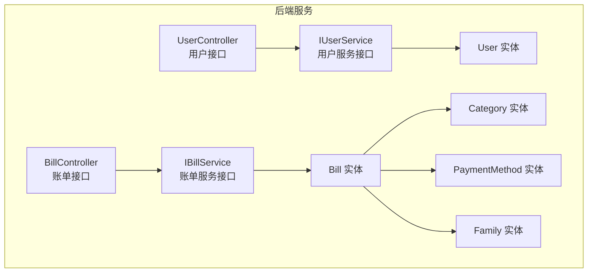
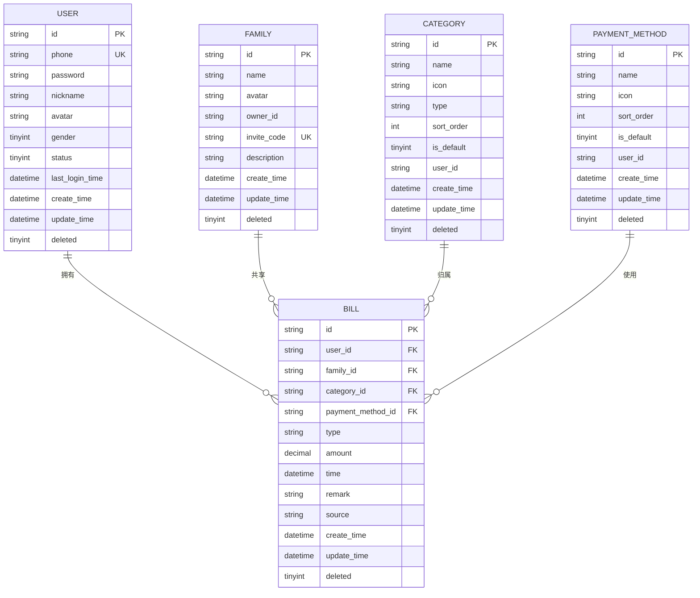
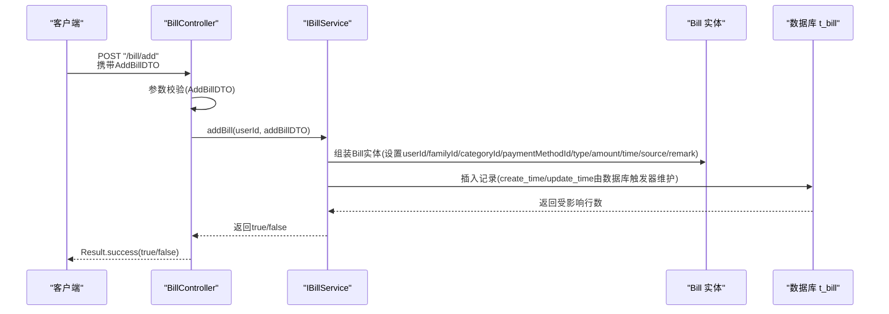
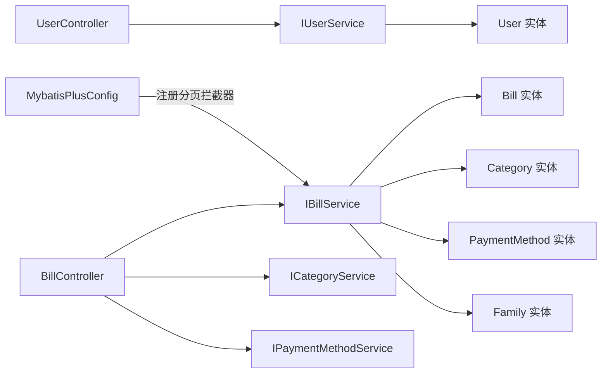

# 实体关系模型

<cite>
**本文引用的文件**
- [User.java](file://chuan-bill-server/src/main/java/com/samoy/chuanbillserver/entity/User.java)
- [Bill.java](file://chuan-bill-server/src/main/java/com/samoy/chuanbillserver/entity/Bill.java)
- [Family.java](file://chuan-bill-server/src/main/java/com/samoy/chuanbillserver/entity/Family.java)
- [Category.java](file://chuan-bill-server/src/main/java/com/samoy/chuanbillserver/entity/Category.java)
- [PaymentMethod.java](file://chuan-bill-server/src/main/java/com/samoy/chuanbillserver/entity/PaymentMethod.java)
- [init.sql](file://chuan-bill-server/init.sql)
- [UserController.java](file://chuan-bill-server/src/main/java/com/samoy/chuanbillserver/controller/UserController.java)
- [BillController.java](file://chuan-bill-server/src/main/java/com/samoy/chuanbillserver/controller/BillController.java)
- [IUserService.java](file://chuan-bill-server/src/main/java/com/samoy/chuanbillserver/service/IUserService.java)
- [IBillService.java](file://chuan-bill-server/src/main/java/com/samoy/chuanbillserver/service/IBillService.java)
- [AddBillDTO.java](file://chuan-bill-server/src/main/java/com/samoy/chuanbillserver/dto/AddBillDTO.java)
- [CategoryVO.java](file://chuan-bill-server/src/main/java/com/samoy/chuanbillserver/vo/CategoryVO.java)
- [PaymentMethodVO.java](file://chuan-bill-server/src/main/java/com/samoy/chuanbillserver/vo/PaymentMethodVO.java)
- [MybatisPlusConfig.java](file://chuan-bill-server/src/main/java/com/samoy/chuanbillserver/config/MybatisPlusConfig.java)
</cite>

## 目录
1. [简介](#简介)
2. [项目结构](#项目结构)
3. [核心实体](#核心实体)
4. [架构总览](#架构总览)
5. [详细组件分析](#详细组件分析)
6. [依赖分析](#依赖分析)
7. [性能考虑](#性能考虑)
8. [故障排查指南](#故障排查指南)
9. [结论](#结论)
10. [附录](#附录)

## 简介
本文件面向“小川记账”后端实体关系模型，聚焦于核心实体：User（用户）、Bill（账单）、Family（家庭）、Category（分类）、PaymentMethod（支付方式）。文档从实体属性设计、数据类型选择、业务规则约束出发，系统梳理实体间的一对一、一对多、多对多关系，解释主键生成策略（UUID vs 自增）、外键约束设计与级联策略、继承与抽象基类设计、通用字段抽取、实体序列化与JSON映射策略、字段校验注解使用，以及实体生命周期管理、软删除与审计字段设计。

## 项目结构
后端采用Spring Boot + MyBatis-Plus架构，实体位于entity包，数据库初始化脚本位于根目录init.sql，控制器与服务接口分别位于controller与service包，DTO/VO用于接口层的数据传输与校验。

图表来源
- [UserController.java:17-61](file://chuan-bill-server/src/main/java/com/samoy/chuanbillserver/controller/UserController.java#L17-L61)
- [BillController.java:23-90](file://chuan-bill-server/src/main/java/com/samoy/chuanbillserver/controller/BillController.java#L23-L90)
- [IUserService.java:17-74](file://chuan-bill-server/src/main/java/com/samoy/chuanbillserver/service/IUserService.java#L17-L74)
- [IBillService.java:19-65](file://chuan-bill-server/src/main/java/com/samoy/chuanbillserver/service/IBillService.java#L19-L65)
- [User.java:24-93](file://chuan-bill-server/src/main/java/com/samoy/chuanbillserver/entity/User.java#L24-L93)
- [Bill.java:25-112](file://chuan-bill-server/src/main/java/com/samoy/chuanbillserver/entity/Bill.java#L25-L112)
- [Family.java:24-81](file://chuan-bill-server/src/main/java/com/samoy/chuanbillserver/entity/Family.java#L24-L81)
- [Category.java:24-87](file://chuan-bill-server/src/main/java/com/samoy/chuanbillserver/entity/Category.java#L24-L87)
- [PaymentMethod.java:24-81](file://chuan-bill-server/src/main/java/com/samoy/chuanbillserver/entity/PaymentMethod.java#L24-L81)

章节来源
- [UserController.java:17-61](file://chuan-bill-server/src/main/java/com/samoy/chuanbillserver/controller/UserController.java#L17-L61)
- [BillController.java:23-90](file://chuan-bill-server/src/main/java/com/samoy/chuanbillserver/controller/BillController.java#L23-L90)
- [IUserService.java:17-74](file://chuan-bill-server/src/main/java/com/samoy/chuanbillserver/service/IUserService.java#L17-L74)
- [IBillService.java:19-65](file://chuan-bill-server/src/main/java/com/samoy/chuanbillserver/service/IBillService.java#L19-L65)

## 核心实体
本节逐项解析User、Bill、Family、Category、PaymentMethod五个核心实体的属性、数据类型、业务规则与约束，并结合数据库脚本验证。

- User（用户）
  - 主键：id（字符串，长度64），对应表t_user主键
  - 关键字段：phone（唯一索引）、password、nickname、avatar、gender、status、lastLoginTime、createTime、updateTime、deleted
  - 业务规则：
    - phone唯一性约束（唯一索引）
    - gender取值范围0/1/2（未知/男/女）
    - status启用/禁用（布尔语义的tinyint）
    - deleted软删除标志（布尔语义的tinyint）
  - 审计字段：create_time、update_time（自动维护）

- Bill（账单）
  - 主键：id（字符串，长度64），对应表t_bill主键
  - 外键字段：user_id、family_id、category_id、payment_method_id
  - 关键字段：name、type（income/expense）、amount（金额，保留两位小进制）、time（账单日期）、remark、source（manual/ocr/voice）、createTime、updateTime、deleted
  - 业务规则：
    - amount必须大于0，整数最多10位，小数最多2位
    - type仅允许income或expense
    - source仅允许manual/ocr/voice
    - time默认当前时间
    - deleted软删除标志
  - 审计字段：create_time、update_time（自动维护）

- Family（家庭）
  - 主键：id（字符串，长度64），对应表t_family主键
  - 关键字段：name、avatar、owner_id、invite_code（唯一索引）、description、createTime、updateTime、deleted
  - 业务规则：
    - invite_code唯一性约束（唯一索引）
    - deleted软删除标志
  - 审计字段：create_time、update_time（自动维护）

- Category（分类）
  - 主键：id（字符串，长度64），对应表t_category主键
  - 关键字段：name、icon、type（income/expense）、sort_order、is_default、user_id（为空表示系统预设类目）、createTime、updateTime、deleted
  - 业务规则：
    - type仅允许income或expense
    - is_default布尔语义（tinyint）
    - sort_order越小越靠前
    - user_id为空表示系统默认类目
    - deleted软删除标志
  - 审计字段：create_time、update_time（自动维护）

- PaymentMethod（支付方式）
  - 主键：id（字符串，长度64），对应表t_payment_method主键
  - 关键字段：name、icon、sort_order、is_default、user_id（为空表示系统预设支付方式）、createTime、updateTime、deleted
  - 业务规则：
    - is_default布尔语义（tinyint）
    - sort_order越小越靠前
    - user_id为空表示系统默认支付方式
    - deleted软删除标志
  - 审计字段：create_time、update_time（自动维护）

章节来源
- [User.java:24-93](file://chuan-bill-server/src/main/java/com/samoy/chuanbillserver/entity/User.java#L24-L93)
- [Bill.java:25-112](file://chuan-bill-server/src/main/java/com/samoy/chuanbillserver/entity/Bill.java#L25-L112)
- [Family.java:24-81](file://chuan-bill-server/src/main/java/com/samoy/chuanbillserver/entity/Family.java#L24-L81)
- [Category.java:24-87](file://chuan-bill-server/src/main/java/com/samoy/chuanbillserver/entity/Category.java#L24-L87)
- [PaymentMethod.java:24-81](file://chuan-bill-server/src/main/java/com/samoy/chuanbillserver/entity/PaymentMethod.java#L24-L81)
- [init.sql:15-31](file://chuan-bill-server/init.sql#L15-L31)
- [init.sql:133-158](file://chuan-bill-server/init.sql#L133-L158)
- [init.sql:74-87](file://chuan-bill-server/init.sql#L74-L87)
- [init.sql:36-51](file://chuan-bill-server/init.sql#L36-L51)
- [init.sql:56-69](file://chuan-bill-server/init.sql#L56-L69)

## 架构总览
下图展示实体关系与典型API调用流程，体现用户、账单、家庭、分类、支付方式之间的关联与控制流。

图表来源
- [User.java:24-93](file://chuan-bill-server/src/main/java/com/samoy/chuanbillserver/entity/User.java#L24-L93)
- [Family.java:24-81](file://chuan-bill-server/src/main/java/com/samoy/chuanbillserver/entity/Family.java#L24-L81)
- [Category.java:24-87](file://chuan-bill-server/src/main/java/com/samoy/chuanbillserver/entity/Category.java#L24-L87)
- [PaymentMethod.java:24-81](file://chuan-bill-server/src/main/java/com/samoy/chuanbillserver/entity/PaymentMethod.java#L24-L81)
- [Bill.java:25-112](file://chuan-bill-server/src/main/java/com/samoy/chuanbillserver/entity/Bill.java#L25-L112)
- [init.sql:15-31](file://chuan-bill-server/init.sql#L15-L31)
- [init.sql:74-87](file://chuan-bill-server/init.sql#L74-L87)
- [init.sql:133-158](file://chuan-bill-server/init.sql#L133-L158)
- [init.sql:36-51](file://chuan-bill-server/init.sql#L36-L51)
- [init.sql:56-69](file://chuan-bill-server/init.sql#L56-L69)

## 详细组件分析

### User（用户）实体
- 设计要点
  - 主键：字符串型id，长度64；与数据库t_user主键一致
  - 唯一索引：phone
  - 审计字段：create_time、update_time（自动维护）
  - 软删除：deleted布尔语义
  - 业务字段：gender（0/1/2）、status（启用/禁用）、lastLoginTime
- 序列化与JSON映射
  - 使用Lombok注解生成getter/setter/toString，便于JSON序列化
- 生命周期与软删除
  - deleted字段用于逻辑删除，查询时应过滤deleted=0

章节来源
- [User.java:24-93](file://chuan-bill-server/src/main/java/com/samoy/chuanbillserver/entity/User.java#L24-L93)
- [init.sql:15-31](file://chuan-bill-server/init.sql#L15-L31)

### Bill（账单）实体
- 设计要点
  - 主键：字符串型id，长度64
  - 外键：user_id（用户）、family_id（家庭，共享账单时存在）、category_id（分类）、payment_method_id（支付方式）
  - 金额：amount为decimal(12,2)，满足最大10位整数+2位小数
  - 时间：time默认当前时间
  - 来源：source枚举manual/ocr/voice
  - 类型：type枚举income/expense
  - 审计字段：create_time、update_time（自动维护）
  - 软删除：deleted布尔语义
- DTO校验
  - AddBillDTO对name、type、amount、time、remark、familyId、source进行非空、格式与长度校验
- 序列化与JSON映射
  - 使用Lombok注解生成getter/setter/toString；time字段通过@JsonFormat进行序列化格式控制
- 生命周期与软删除
  - deleted字段用于逻辑删除；查询时应过滤deleted=0

章节来源
- [Bill.java:25-112](file://chuan-bill-server/src/main/java/com/samoy/chuanbillserver/entity/Bill.java#L25-L112)
- [AddBillDTO.java:12-43](file://chuan-bill-server/src/main/java/com/samoy/chuanbillserver/dto/AddBillDTO.java#L12-L43)
- [init.sql:133-158](file://chuan-bill-server/init.sql#L133-L158)

### Family（家庭）实体
- 设计要点
  - 主键：字符串型id，长度64
  - 唯一索引：invite_code
  - 审计字段：create_time、update_time（自动维护）
  - 软删除：deleted布尔语义
- 序列化与JSON映射
  - 使用Lombok注解生成getter/setter/toString
- 生命周期与软删除
  - deleted字段用于逻辑删除；查询时应过滤deleted=0

章节来源
- [Family.java:24-81](file://chuan-bill-server/src/main/java/com/samoy/chuanbillserver/entity/Family.java#L24-L81)
- [init.sql:74-87](file://chuan-bill-server/init.sql#L74-L87)

### Category（分类）实体
- 设计要点
  - 主键：字符串型id，长度64
  - 关键字段：type（income/expense）、sort_order（越小越靠前）、is_default（布尔语义）、user_id（为空表示系统预设）
  - 审计字段：create_time、update_time（自动维护）
  - 软删除：deleted布尔语义
- 序列化与JSON映射
  - 使用Lombok注解生成getter/setter/toString
- 生命周期与软删除
  - deleted字段用于逻辑删除；查询时应过滤deleted=0

章节来源
- [Category.java:24-87](file://chuan-bill-server/src/main/java/com/samoy/chuanbillserver/entity/Category.java#L24-L87)
- [init.sql:36-51](file://chuan-bill-server/init.sql#L36-L51)

### PaymentMethod（支付方式）实体
- 设计要点
  - 主键：字符串型id，长度64
  - 关键字段：sort_order（越小越靠前）、is_default（布尔语义）、user_id（为空表示系统预设）
  - 审计字段：create_time、update_time（自动维护）
  - 软删除：deleted布尔语义
- 序列化与JSON映射
  - 使用Lombok注解生成getter/setter/toString
- 生命周期与软删除
  - deleted字段用于逻辑删除；查询时应过滤deleted=0

章节来源
- [PaymentMethod.java:24-81](file://chuan-bill-server/src/main/java/com/samoy/chuanbillserver/entity/PaymentMethod.java#L24-L81)
- [init.sql:56-69](file://chuan-bill-server/init.sql#L56-L69)

### API工作流（以账单为例）
以下序列图展示从控制器到服务再到实体的典型调用链，体现参数校验、鉴权、业务处理与持久化。

图表来源
- [BillController.java:52-57](file://chuan-bill-server/src/main/java/com/samoy/chuanbillserver/controller/BillController.java#L52-L57)
- [AddBillDTO.java:12-43](file://chuan-bill-server/src/main/java/com/samoy/chuanbillserver/dto/AddBillDTO.java#L12-L43)
- [IBillService.java:37-37](file://chuan-bill-server/src/main/java/com/samoy/chuanbillserver/service/IBillService.java#L37-L37)
- [Bill.java:25-112](file://chuan-bill-server/src/main/java/com/samoy/chuanbillserver/entity/Bill.java#L25-L112)
- [init.sql:133-158](file://chuan-bill-server/init.sql#L133-L158)

## 依赖分析
- 控制器依赖服务接口
  - UserController依赖IUserService
  - BillController依赖IBillService、ICategoryService、IPaymentMethodService
- 服务接口依赖实体
  - IUserService、IBillService扩展IService<Entity>，直接面向实体
- 实体依赖MyBatis-Plus注解
  - @TableName、@TableId、@TableField用于映射表结构
- 分页插件
  - MybatisPlusConfig注册分页拦截器，支撑IPage分页查询

图表来源
- [UserController.java:22-23](file://chuan-bill-server/src/main/java/com/samoy/chuanbillserver/controller/UserController.java#L22-L23)
- [BillController.java:28-35](file://chuan-bill-server/src/main/java/com/samoy/chuanbillserver/controller/BillController.java#L28-L35)
- [IUserService.java:17-74](file://chuan-bill-server/src/main/java/com/samoy/chuanbillserver/service/IUserService.java#L17-L74)
- [IBillService.java:19-65](file://chuan-bill-server/src/main/java/com/samoy/chuanbillserver/service/IBillService.java#L19-L65)
- [MybatisPlusConfig.java:10-17](file://chuan-bill-server/src/main/java/com/samoy/chuanbillserver/config/MybatisPlusConfig.java#L10-L17)

章节来源
- [UserController.java:22-23](file://chuan-bill-server/src/main/java/com/samoy/chuanbillserver/controller/UserController.java#L22-L23)
- [BillController.java:28-35](file://chuan-bill-server/src/main/java/com/samoy/chuanbillserver/controller/BillController.java#L28-L35)
- [IUserService.java:17-74](file://chuan-bill-server/src/main/java/com/samoy/chuanbillserver/service/IUserService.java#L17-L74)
- [IBillService.java:19-65](file://chuan-bill-server/src/main/java/com/samoy/chuanbillserver/service/IBillService.java#L19-L65)
- [MybatisPlusConfig.java:10-17](file://chuan-bill-server/src/main/java/com/samoy/chuanbillserver/config/MybatisPlusConfig.java#L10-L17)

## 性能考虑
- 索引设计
  - t_user(phone唯一索引)、t_category(type/user_id/sort_order)、t_payment_method(user_id/sort_order)、t_family(invite_code唯一索引)、t_bill(user_id/family_id/category_id/payment_method_id/type/time/create_time)
  - 建议：按查询条件覆盖常见过滤字段，避免全表扫描
- 分页与排序
  - MyBatis-Plus分页拦截器已启用，建议结合索引优化分页查询
- 软删除
  - 查询时统一过滤deleted=0，避免返回已删除记录
- JSON序列化
  - 对时间字段使用@JsonFormat统一格式，减少前端解析成本

[本节为通用指导，不直接分析具体文件]

## 故障排查指南
- 常见问题与定位
  - 重复手机号：t_user.phone唯一索引冲突，需检查AddBillDTO与用户注册/登录流程
  - 金额格式错误：AddBillDTO.amount校验失败，需确保整数≤10位、小数≤2位
  - 类型非法：AddBillDTO.type/source校验失败，需确保为income/expense或manual/ocr/voice
  - 外键缺失：Bill.user_id/family_id/category_id/payment_method_id为空或无效
- 排查步骤
  - 检查DTO参数与注解校验
  - 核对数据库索引与约束
  - 查看实体字段与表结构一致性
  - 确认软删除过滤逻辑

章节来源
- [AddBillDTO.java:14-42](file://chuan-bill-server/src/main/java/com/samoy/chuanbillserver/dto/AddBillDTO.java#L14-L42)
- [init.sql:15-31](file://chuan-bill-server/init.sql#L15-L31)
- [init.sql:36-51](file://chuan-bill-server/init.sql#L36-L51)
- [init.sql:56-69](file://chuan-bill-server/init.sql#L56-L69)
- [init.sql:133-158](file://chuan-bill-server/init.sql#L133-L158)

## 结论
本实体关系模型围绕用户、账单、家庭、分类、支付方式五大核心实体展开，采用字符串型主键与软删除策略，结合数据库索引与MyBatis-Plus分页插件，兼顾易用性与性能。通过DTO/VO与注解校验，保证接口层数据质量与一致性。建议后续在审计日志、级联策略与跨表事务方面进一步完善。

[本节为总结性内容，不直接分析具体文件]

## 附录

### 主键与外键设计
- 主键策略
  - 实体主键均为字符串型（长度64），与数据库表主键一致
- 外键关系
  - Bill.user_id → User.id
  - Bill.family_id → Family.id
  - Bill.category_id → Category.id
  - Bill.payment_method_id → PaymentMethod.id
- 级联策略
  - 当前实体未显式声明级联删除/更新策略，遵循数据库外键约束；建议在业务层谨慎处理级联删除

章节来源
- [Bill.java:38-63](file://chuan-bill-server/src/main/java/com/samoy/chuanbillserver/entity/Bill.java#L38-L63)
- [User.java:31-32](file://chuan-bill-server/src/main/java/com/samoy/chuanbillserver/entity/User.java#L31-L32)
- [Family.java:31-32](file://chuan-bill-server/src/main/java/com/samoy/chuanbillserver/entity/Family.java#L31-L32)
- [Category.java:31-32](file://chuan-bill-server/src/main/java/com/samoy/chuanbillserver/entity/Category.java#L31-L32)
- [PaymentMethod.java:31-32](file://chuan-bill-server/src/main/java/com/samoy/chuanbillserver/entity/PaymentMethod.java#L31-L32)

### 审计字段与软删除
- 审计字段
  - create_time、update_time由数据库触发器自动维护（默认CURRENT_TIMESTAMP，更新时ON UPDATE CURRENT_TIMESTAMP）
- 软删除
  - deleted字段（布尔语义tinyint）用于逻辑删除，查询时应过滤deleted=0

章节来源
- [User.java:79-92](file://chuan-bill-server/src/main/java/com/samoy/chuanbillserver/entity/User.java#L79-L92)
- [Bill.java:98-111](file://chuan-bill-server/src/main/java/com/samoy/chuanbillserver/entity/Bill.java#L98-L111)
- [Family.java:67-80](file://chuan-bill-server/src/main/java/com/samoy/chuanbillserver/entity/Family.java#L67-L80)
- [Category.java:73-86](file://chuan-bill-server/src/main/java/com/samoy/chuanbillserver/entity/Category.java#L73-L86)
- [PaymentMethod.java:67-80](file://chuan-bill-server/src/main/java/com/samoy/chuanbillserver/entity/PaymentMethod.java#L67-L80)
- [init.sql:25-26](file://chuan-bill-server/init.sql#L25-L26)
- [init.sql:146-147](file://chuan-bill-server/init.sql#L146-L147)
- [init.sql:82-83](file://chuan-bill-server/init.sql#L82-L83)
- [init.sql:45-46](file://chuan-bill-server/init.sql#L45-L46)
- [init.sql:64-65](file://chuan-bill-server/init.sql#L64-L65)

### 实体序列化与JSON映射
- Lombok注解
  - @Getter/@Setter/@ToString简化序列化
- 时间字段格式
  - AddBillDTO.time使用@JsonFormat(pattern="yyyy-MM-dd HH:mm")统一序列化格式
- VO映射
  - CategoryVO、PaymentMethodVO用于接口返回，字段与实体保持一致

章节来源
- [Bill.java:21-23](file://chuan-bill-server/src/main/java/com/samoy/chuanbillserver/entity/Bill.java#L21-L23)
- [AddBillDTO.java:30-32](file://chuan-bill-server/src/main/java/com/samoy/chuanbillserver/dto/AddBillDTO.java#L30-L32)
- [CategoryVO.java:8-29](file://chuan-bill-server/src/main/java/com/samoy/chuanbillserver/vo/CategoryVO.java#L8-L29)
- [PaymentMethodVO.java:8-26](file://chuan-bill-server/src/main/java/com/samoy/chuanbillserver/vo/PaymentMethodVO.java#L8-L26)

### 字段校验注解使用
- AddBillDTO
  - @NotBlank/@Size：name、categoryId、type、remark
  - @Pattern：type（income/expense）、source（manual/ocr/voice）
  - @NotNull/@DecimalMin/@Digits：amount
  - @JsonFormat：time
- DTO校验在控制器层生效，确保进入服务层前的数据合法性

章节来源
- [AddBillDTO.java:12-43](file://chuan-bill-server/src/main/java/com/samoy/chuanbillserver/dto/AddBillDTO.java#L12-L43)