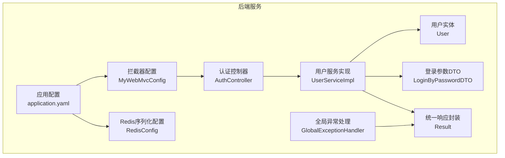
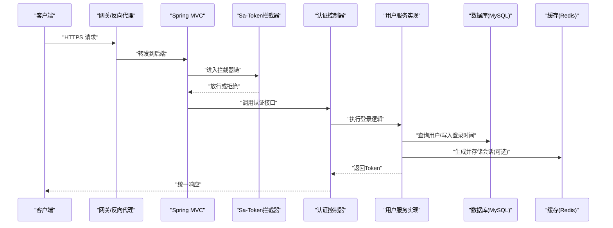
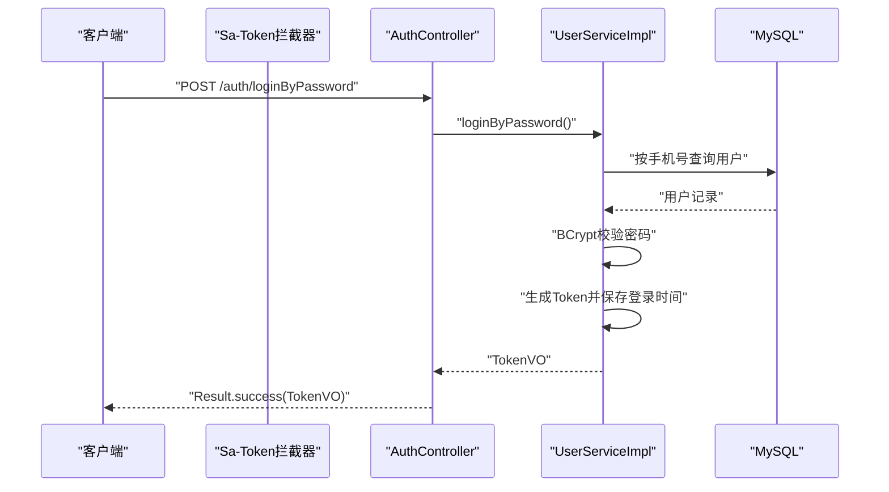
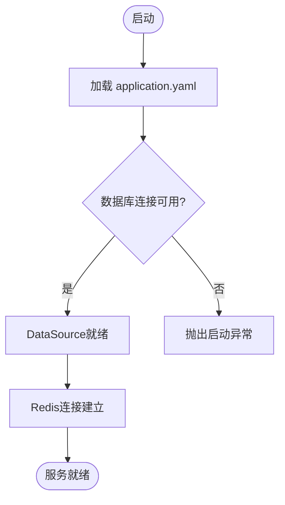
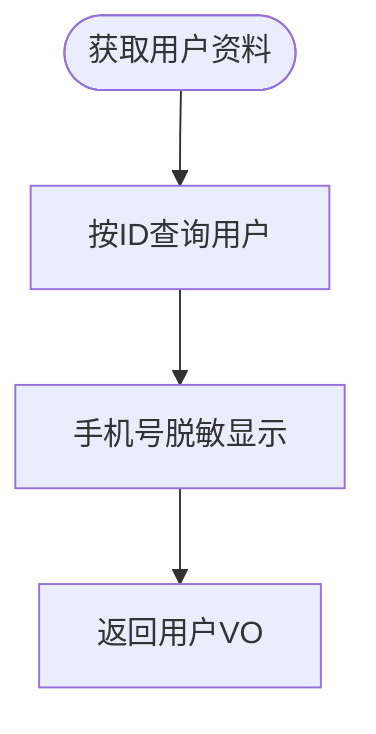
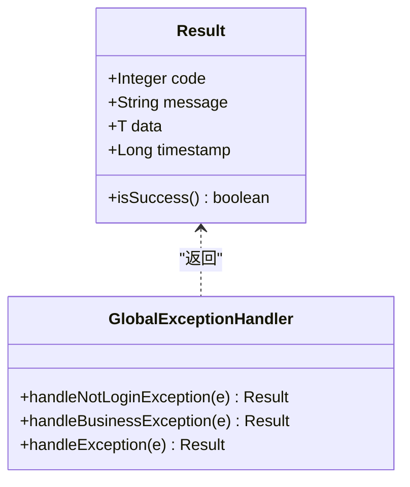
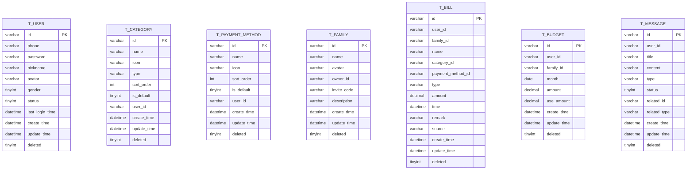
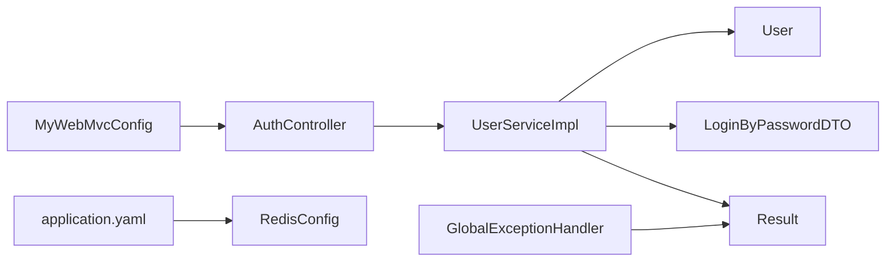

# 数据安全与备份

<cite>
**本文引用的文件**
- [application.yaml](file://chuan-bill-server/src/main/resources/application.yaml)
- [MyWebMvcConfig.java](file://chuan-bill-server/src/main/java/com/samoy/chuanbillserver/config/MyWebMvcConfig.java)
- [RedisConfig.java](file://chuan-bill-server/src/main/java/com/samoy/chuanbillserver/config/RedisConfig.java)
- [GlobalExceptionHandler.java](file://chuan-bill-server/src/main/java/com/samoy/chuanbillserver/expection/GlobalExceptionHandler.java)
- [AuthController.java](file://chuan-bill-server/src/main/java/com/samoy/chuanbillserver/controller/AuthController.java)
- [UserServiceImpl.java](file://chuan-bill-server/src/main/java/com/samoy/chuanbillserver/service/impl/UserServiceImpl.java)
- [User.java](file://chuan-bill-server/src/main/java/com/samoy/chuanbillserver/entity/User.java)
- [LoginByPasswordDTO.java](file://chuan-bill-server/src/main/java/com/samoy/chuanbillserver/dto/LoginByPasswordDTO.java)
- [Result.java](file://chuan-bill-server/src/main/java/com/samoy/chuanbillserver/result/Result.java)
- [init.sql](file://chuan-bill-server/init.sql)
</cite>

## 目录
1. [引言](#引言)
2. [项目结构](#项目结构)
3. [核心组件](#核心组件)
4. [架构总览](#架构总览)
5. [详细组件分析](#详细组件分析)
6. [依赖分析](#依赖分析)
7. [性能考虑](#性能考虑)
8. [故障排查指南](#故障排查指南)
9. [结论](#结论)
10. [附录](#附录)

## 引言
本文件面向“小川记账”的数据安全与备份，围绕以下目标展开：传输层加密、存储层加密、敏感数据脱敏；访问控制机制（数据库用户权限、IP白名单、连接频率限制）；备份策略（全量/增量/实时）与灾难恢复（RTO/RPO、故障切换、恢复验证）；数据完整性（校验与一致性、事务回滚）；安全审计（操作日志、异常行为检测、合规报告）；以及数据迁移、版本升级、清理与归档、漏洞评估与渗透测试、安全事件响应流程。本文以代码库为依据，结合现有实现与可扩展建议，形成可落地的安全保障方案。

## 项目结构
后端采用 Spring Boot + MyBatis-Plus 架构，核心安全相关配置集中在应用配置、Web 拦截器、Redis 序列化与全局异常处理中；认证与会话由 Sa-Token 提供；数据库与缓存通过环境变量注入；初始化 SQL 定义了完整的业务表结构与系统默认数据。

图表来源
- [application.yaml:1-51](file://chuan-bill-server/src/main/resources/application.yaml#L1-L51)
- [MyWebMvcConfig.java:1-21](file://chuan-bill-server/src/main/java/com/samoy/chuanbillserver/config/MyWebMvcConfig.java#L1-L21)
- [RedisConfig.java:1-32](file://chuan-bill-server/src/main/java/com/samoy/chuanbillserver/config/RedisConfig.java#L1-L32)
- [AuthController.java:1-66](file://chuan-bill-server/src/main/java/com/samoy/chuanbillserver/controller/AuthController.java#L1-L66)
- [UserServiceImpl.java:1-192](file://chuan-bill-server/src/main/java/com/samoy/chuanbillserver/service/impl/UserServiceImpl.java#L1-L192)
- [User.java:1-94](file://chuan-bill-server/src/main/java/com/samoy/chuanbillserver/entity/User.java#L1-L94)
- [LoginByPasswordDTO.java:1-19](file://chuan-bill-server/src/main/java/com/samoy/chuanbillserver/dto/LoginByPasswordDTO.java#L1-L19)
- [Result.java:1-50](file://chuan-bill-server/src/main/java/com/samoy/chuanbillserver/result/Result.java#L1-L50)
- [GlobalExceptionHandler.java:1-50](file://chuan-bill-server/src/main/java/com/samoy/chuanbillserver/expection/GlobalExceptionHandler.java#L1-L50)

章节来源
- [application.yaml:1-51](file://chuan-bill-server/src/main/resources/application.yaml#L1-L51)
- [MyWebMvcConfig.java:1-21](file://chuan-bill-server/src/main/java/com/samoy/chuanbillserver/config/MyWebMvcConfig.java#L1-L21)
- [RedisConfig.java:1-32](file://chuan-bill-server/src/main/java/com/samoy/chuanbillserver/config/RedisConfig.java#L1-L32)
- [AuthController.java:1-66](file://chuan-bill-server/src/main/java/com/samoy/chuanbillserver/controller/AuthController.java#L1-L66)
- [UserServiceImpl.java:1-192](file://chuan-bill-server/src/main/java/com/samoy/chuanbillserver/service/impl/UserServiceImpl.java#L1-L192)
- [User.java:1-94](file://chuan-bill-server/src/main/java/com/samoy/chuanbillserver/entity/User.java#L1-L94)
- [LoginByPasswordDTO.java:1-19](file://chuan-bill-server/src/main/java/com/samoy/chuanbillserver/dto/LoginByPasswordDTO.java#L1-L19)
- [Result.java:1-50](file://chuan-bill-server/src/main/java/com/samoy/chuanbillserver/result/Result.java#L1-L50)
- [GlobalExceptionHandler.java:1-50](file://chuan-bill-server/src/main/java/com/samoy/chuanbillserver/expection/GlobalExceptionHandler.java#L1-L50)

## 核心组件
- 认证与会话：基于 Sa-Token 的登录态管理，拦截器对所有受保护路径生效，除认证、Swagger 文档路径外。
- 数据库与缓存：通过环境变量注入 MySQL 与 Redis 连接信息；Redis 使用 JSON 序列化。
- 统一响应与异常处理：统一封装返回结构，集中处理未登录、业务异常与系统异常。
- 敏感数据处理：手机号在查询用户资料时进行脱敏展示；密码采用 BCrypt 哈希存储。

章节来源
- [MyWebMvcConfig.java:10-20](file://chuan-bill-server/src/main/java/com/samoy/chuanbillserver/config/MyWebMvcConfig.java#L10-L20)
- [application.yaml:4-21](file://chuan-bill-server/src/main/resources/application.yaml#L4-L21)
- [RedisConfig.java:14-30](file://chuan-bill-server/src/main/java/com/samoy/chuanbillserver/config/RedisConfig.java#L14-L30)
- [GlobalExceptionHandler.java:12-48](file://chuan-bill-server/src/main/java/com/samoy/chuanbillserver/expection/GlobalExceptionHandler.java#L12-L48)
- [UserServiceImpl.java:147-157](file://chuan-bill-server/src/main/java/com/samoy/chuanbillserver/service/impl/UserServiceImpl.java#L147-L157)
- [UserServiceImpl.java:41-61](file://chuan-bill-server/src/main/java/com/samoy/chuanbillserver/service/impl/UserServiceImpl.java#L41-L61)

## 架构总览
下图展示了从客户端到后端服务、数据库与缓存的整体交互，以及安全控制点：

图表来源
- [MyWebMvcConfig.java:12-19](file://chuan-bill-server/src/main/java/com/samoy/chuanbillserver/config/MyWebMvcConfig.java#L12-L19)
- [AuthController.java:35-51](file://chuan-bill-server/src/main/java/com/samoy/chuanbillserver/controller/AuthController.java#L35-L51)
- [UserServiceImpl.java:174-190](file://chuan-bill-server/src/main/java/com/samoy/chuanbillserver/service/impl/UserServiceImpl.java#L174-L190)
- [application.yaml:4-21](file://chuan-bill-server/src/main/resources/application.yaml#L4-L21)
- [RedisConfig.java:14-30](file://chuan-bill-server/src/main/java/com/samoy/chuanbillserver/config/RedisConfig.java#L14-L30)

## 详细组件分析

### 认证与会话（Sa-Token）
- 拦截器对所有路径生效，排除认证、OpenAPI/Swagger 路径，确保登录态校验覆盖核心业务。
- 登录成功后生成 Token 并写入会话上下文，超时与并发策略由配置决定。

图表来源
- [MyWebMvcConfig.java:12-19](file://chuan-bill-server/src/main/java/com/samoy/chuanbillserver/config/MyWebMvcConfig.java#L12-L19)
- [AuthController.java:35-51](file://chuan-bill-server/src/main/java/com/samoy/chuanbillserver/controller/AuthController.java#L35-L51)
- [UserServiceImpl.java:41-61](file://chuan-bill-server/src/main/java/com/samoy/chuanbillserver/service/impl/UserServiceImpl.java#L41-L61)
- [UserServiceImpl.java:174-190](file://chuan-bill-server/src/main/java/com/samoy/chuanbillserver/service/impl/UserServiceImpl.java#L174-L190)

章节来源
- [MyWebMvcConfig.java:10-20](file://chuan-bill-server/src/main/java/com/samoy/chuanbillserver/config/MyWebMvcConfig.java#L10-L20)
- [AuthController.java:19-66](file://chuan-bill-server/src/main/java/com/samoy/chuanbillserver/controller/AuthController.java#L19-L66)
- [UserServiceImpl.java:41-61](file://chuan-bill-server/src/main/java/com/samoy/chuanbillserver/service/impl/UserServiceImpl.java#L41-L61)
- [UserServiceImpl.java:174-190](file://chuan-bill-server/src/main/java/com/samoy/chuanbillserver/service/impl/UserServiceImpl.java#L174-L190)

### 数据库与缓存配置
- 数据源与 Redis 通过环境变量注入，便于在不同环境隔离配置。
- Redis 使用 JSON 序列化，适合存储复杂对象；连接池参数可调优。

图表来源
- [application.yaml:4-21](file://chuan-bill-server/src/main/resources/application.yaml#L4-L21)
- [RedisConfig.java:14-30](file://chuan-bill-server/src/main/java/com/samoy/chuanbillserver/config/RedisConfig.java#L14-L30)

章节来源
- [application.yaml:4-21](file://chuan-bill-server/src/main/resources/application.yaml#L4-L21)
- [RedisConfig.java:14-30](file://chuan-bill-server/src/main/java/com/samoy/chuanbillserver/config/RedisConfig.java#L14-L30)

### 敏感数据脱敏与密码存储
- 手机号在返回用户资料时进行中间部分隐藏处理。
- 密码采用 BCrypt 哈希存储，登录时进行哈希比对。

图表来源
- [UserServiceImpl.java:147-157](file://chuan-bill-server/src/main/java/com/samoy/chuanbillserver/service/impl/UserServiceImpl.java#L147-L157)

章节来源
- [UserServiceImpl.java:147-157](file://chuan-bill-server/src/main/java/com/samoy/chuanbillserver/service/impl/UserServiceImpl.java#L147-L157)
- [UserServiceImpl.java:41-61](file://chuan-bill-server/src/main/java/com/samoy/chuanbillserver/service/impl/UserServiceImpl.java#L41-L61)

### 统一响应与异常处理
- 统一返回结构包含 code/message/data/timestamp。
- 全局异常处理对未登录、业务异常与系统异常分别处理，避免敏感信息泄露。

图表来源
- [Result.java:12-49](file://chuan-bill-server/src/main/java/com/samoy/chuanbillserver/result/Result.java#L12-L49)
- [GlobalExceptionHandler.java:20-48](file://chuan-bill-server/src/main/java/com/samoy/chuanbillserver/expection/GlobalExceptionHandler.java#L20-L48)

章节来源
- [Result.java:12-49](file://chuan-bill-server/src/main/java/com/samoy/chuanbillserver/result/Result.java#L12-L49)
- [GlobalExceptionHandler.java:12-48](file://chuan-bill-server/src/main/java/com/samoy/chuanbillserver/expection/GlobalExceptionHandler.java#L12-L48)

### 数据模型与初始化
- 初始化脚本定义了用户、类目、支付方式、家庭、账单、预算、消息等表结构及索引。
- 系统默认类目与支付方式通过初始化数据插入，确保新环境快速可用。

图表来源
- [init.sql:14-326](file://chuan-bill-server/init.sql#L14-L326)

章节来源
- [init.sql:14-326](file://chuan-bill-server/init.sql#L14-L326)

## 依赖分析
- 组件耦合度低：认证、服务、实体、DTO、响应与异常处理模块职责清晰。
- 外部依赖：MySQL、Redis、Sa-Token、Hutool、MyBatis-Plus、OpenAPI/Swagger。
- 可能的改进：引入数据库用户权限最小化、IP 白名单、连接频率限制等。

图表来源
- [MyWebMvcConfig.java:12-19](file://chuan-bill-server/src/main/java/com/samoy/chuanbillserver/config/MyWebMvcConfig.java#L12-L19)
- [AuthController.java:35-51](file://chuan-bill-server/src/main/java/com/samoy/chuanbillserver/controller/AuthController.java#L35-L51)
- [UserServiceImpl.java:41-61](file://chuan-bill-server/src/main/java/com/samoy/chuanbillserver/service/impl/UserServiceImpl.java#L41-L61)
- [User.java:24-94](file://chuan-bill-server/src/main/java/com/samoy/chuanbillserver/entity/User.java#L24-L94)
- [LoginByPasswordDTO.java:11-18](file://chuan-bill-server/src/main/java/com/samoy/chuanbillserver/dto/LoginByPasswordDTO.java#L11-L18)
- [Result.java:12-49](file://chuan-bill-server/src/main/java/com/samoy/chuanbillserver/result/Result.java#L12-L49)
- [application.yaml:4-21](file://chuan-bill-server/src/main/resources/application.yaml#L4-L21)
- [RedisConfig.java:14-30](file://chuan-bill-server/src/main/java/com/samoy/chuanbillserver/config/RedisConfig.java#L14-L30)
- [GlobalExceptionHandler.java:20-48](file://chuan-bill-server/src/main/java/com/samoy/chuanbillserver/expection/GlobalExceptionHandler.java#L20-L48)

章节来源
- [MyWebMvcConfig.java:12-19](file://chuan-bill-server/src/main/java/com/samoy/chuanbillserver/config/MyWebMvcConfig.java#L12-L19)
- [AuthController.java:35-51](file://chuan-bill-server/src/main/java/com/samoy/chuanbillserver/controller/AuthController.java#L35-L51)
- [UserServiceImpl.java:41-61](file://chuan-bill-server/src/main/java/com/samoy/chuanbillserver/service/impl/UserServiceImpl.java#L41-L61)
- [User.java:24-94](file://chuan-bill-server/src/main/java/com/samoy/chuanbillserver/entity/User.java#L24-L94)
- [LoginByPasswordDTO.java:11-18](file://chuan-bill-server/src/main/java/com/samoy/chuanbillserver/dto/LoginByPasswordDTO.java#L11-L18)
- [Result.java:12-49](file://chuan-bill-server/src/main/java/com/samoy/chuanbillserver/result/Result.java#L12-L49)
- [application.yaml:4-21](file://chuan-bill-server/src/main/resources/application.yaml#L4-L21)
- [RedisConfig.java:14-30](file://chuan-bill-server/src/main/java/com/samoy/chuanbillserver/config/RedisConfig.java#L14-L30)
- [GlobalExceptionHandler.java:20-48](file://chuan-bill-server/src/main/java/com/samoy/chuanbillserver/expection/GlobalExceptionHandler.java#L20-L48)

## 性能考虑
- 连接池与超时：合理设置数据库与 Redis 连接池大小、最大等待时间，避免阻塞。
- 缓存命中：热点数据放入 Redis，减少数据库压力；注意序列化开销。
- 分页与索引：查询接口使用分页与合适索引，避免全表扫描。
- 会话并发：Sa-Token 并发策略与主动过期策略需结合业务峰值评估。

## 故障排查指南
- 未登录/鉴权失败：检查拦截器是否正确排除 Swagger 路径，确认 Token 是否携带与有效。
- 登录异常：核对手机号与密码格式、验证码校验、密码哈希比对。
- 数据库连接失败：检查 MYSQL_URL/MYSQL_USERNAME/MYSQL_PASSWORD 环境变量。
- Redis 连接问题：检查 REDIS_HOST/PORT/PASSWORD 与网络连通性。
- 统一异常：关注全局异常处理器输出，定位业务异常与系统异常原因。

章节来源
- [MyWebMvcConfig.java:12-19](file://chuan-bill-server/src/main/java/com/samoy/chuanbillserver/config/MyWebMvcConfig.java#L12-L19)
- [GlobalExceptionHandler.java:20-48](file://chuan-bill-server/src/main/java/com/samoy/chuanbillserver/expection/GlobalExceptionHandler.java#L20-L48)
- [application.yaml:4-21](file://chuan-bill-server/src/main/resources/application.yaml#L4-L21)

## 结论
当前实现已具备基础认证与会话、统一响应与异常处理、敏感数据脱敏与密码哈希等安全能力。为进一步完善数据安全与备份体系，建议补充传输层加密（TLS）、存储层加密、数据库用户最小权限、IP 白名单与连接频率限制、备份与灾备策略、数据完整性校验与事务回滚、安全审计与合规报告、以及漏洞评估与应急响应流程。

## 附录

### 数据加密策略
- 传输层加密（TLS/SSL）
  - 在网关/反向代理层强制启用 HTTPS，确保客户端与服务端通信加密。
  - 后端与数据库、缓存之间的连接也应启用 TLS（MySQL 与 Redis 的 TLS 配置需在相应驱动/客户端支持的前提下开启）。
- 存储层加密
  - 对敏感字段（如手机号、密码）在数据库层面启用透明数据加密（TDE），或使用字段级加密。
  - 密钥管理采用密钥管理系统（KMS），定期轮换。
- 敏感数据脱敏
  - 已在用户资料返回时对手机号进行中间位隐藏；建议在日志与导出场景同样脱敏。

章节来源
- [UserServiceImpl.java:147-157](file://chuan-bill-server/src/main/java/com/samoy/chuanbillserver/service/impl/UserServiceImpl.java#L147-L157)

### 访问控制机制
- 数据库用户权限管理
  - 为不同环境（开发/测试/生产）配置最小权限账户，仅授予必要 DML/DQL 权限。
  - 禁止在生产使用高权限账户（如 root）直连应用。
- IP 白名单配置
  - 在网关/反向代理层配置允许访问的客户端 IP 白名单，拒绝未授权来源。
- 连接频率限制
  - 在网关层对认证接口与高频接口设置速率限制（QPS/分钟级），防暴力破解与滥用。

### 数据备份策略
- 全量备份
  - 周期性执行数据库全量备份（如每周日凌晨），并校验备份文件完整性。
- 增量备份
  - 基于二进制日志（binlog）进行增量备份，缩短 RPO。
- 实时备份
  - 结合主从复制与自动故障切换，实现近实时数据保护。

### 灾难恢复计划（RTO/RPO）
- RTO/RPO 目标
  - RTO：核心业务不超过 4 小时；RPO：核心业务不超过 15 分钟。
- 故障切换流程
  - 主库故障时，自动/手动切换至备用库，更新 DNS/负载均衡指向。
  - 验证数据一致性与业务可用性。
- 数据恢复验证
  - 定期进行备份恢复演练，验证备份文件可恢复性与数据一致性。

### 数据完整性保证
- 校验和机制
  - 对关键数据（账单、预算）计算校验和，定期巡检与告警。
- 数据一致性检查
  - 建立一致性检查任务，比对关键表主键、计数与汇总字段。
- 事务回滚策略
  - 关键交易（转账、修改预算）使用数据库事务，失败自动回滚并记录审计日志。

### 安全审计
- 操作日志记录
  - 记录用户登录、登出、修改密码、删除账户、批量导入/导出等高风险操作。
- 异常行为检测
  - 基于阈值与规则引擎检测异常登录（多地区、多设备、频繁失败）与异常操作。
- 合规性报告生成
  - 自动生成合规报告（如 GDPR 数据主体访问请求处理记录），满足审计要求。

### 数据迁移与版本升级
- 数据迁移
  - 升级前先做全量备份；灰度发布，逐步迁移；迁移后进行一致性校验。
- 版本升级
  - 采用蓝绿/滚动部署，配合健康检查与回滚策略。
- 清理与归档
  - 建立数据生命周期策略：历史数据归档、冷数据迁移、定期清理过期数据。

### 安全评估与事件响应
- 安全漏洞评估
  - 定期进行代码审计、依赖漏洞扫描、数据库弱口令与权限检查。
- 渗透测试
  - 在测试环境开展渗透测试，修复高危漏洞后方可上线。
- 安全事件响应流程
  - 建立事件分级、处置流程、通知机制与复盘闭环。