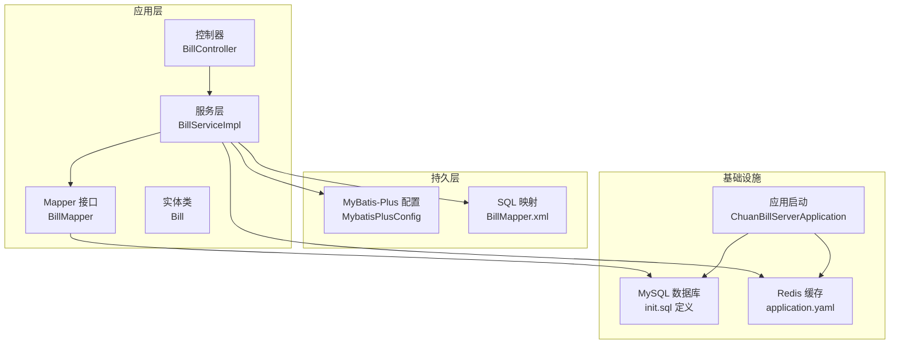
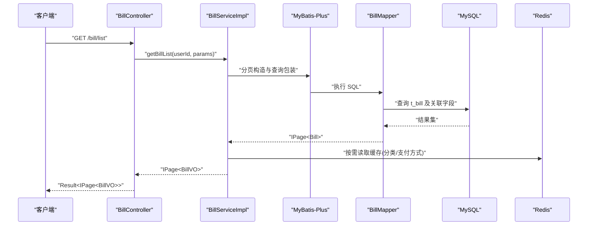
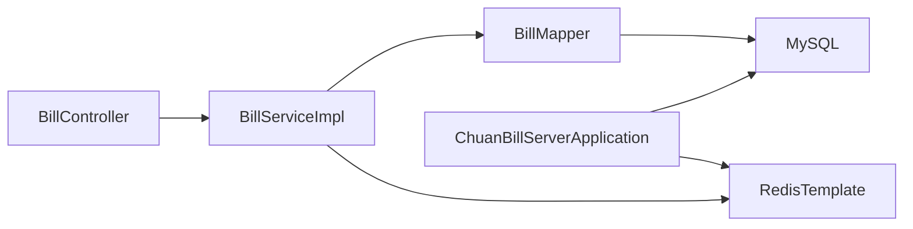

# 数据库性能优化

<cite>
**本文引用的文件**
- [application.yaml](file://chuan-bill-server/src/main/resources/application.yaml)
- [init.sql](file://chuan-bill-server/init.sql)
- [pom.xml](file://chuan-bill-server/pom.xml)
- [MybatisPlusConfig.java](file://chuan-bill-server/src/main/java/com/samoy/chuanbillserver/config/MybatisPlusConfig.java)
- [RedisConfig.java](file://chuan-bill-server/src/main/java/com/samoy/chuanbillserver/config/RedisConfig.java)
- [Bill.java](file://chuan-bill-server/src/main/java/com/samoy/chuanbillserver/entity/Bill.java)
- [BillMapper.java](file://chuan-bill-server/src/main/java/com/samoy/chuanbillserver/dao/BillMapper.java)
- [BillMapper.xml](file://chuan-bill-server/src/main/resources/mapper/BillMapper.xml)
- [BillServiceImpl.java](file://chuan-bill-server/src/main/java/com/samoy/chuanbillserver/service/impl/BillServiceImpl.java)
- [BillController.java](file://chuan-bill-server/src/main/java/com/samoy/chuanbillserver/controller/BillController.java)
- [UserServiceImpl.java](file://chuan-bill-server/src/main/java/com/samoy/chuanbillserver/service/impl/UserServiceImpl.java)
- [ChuanBillServerApplication.java](file://chuan-bill-server/src/main/java/com/samoy/chuanbillserver/ChuanBillServerApplication.java)
</cite>

## 目录
1. [简介](#简介)
2. [项目结构](#项目结构)
3. [核心组件](#核心组件)
4. [架构总览](#架构总览)
5. [详细组件分析](#详细组件分析)
6. [依赖分析](#依赖分析)
7. [性能考虑](#性能考虑)
8. [故障排查指南](#故障排查指南)
9. [结论](#结论)
10. [附录](#附录)

## 简介
本文件面向“小川记账”数据库性能优化，结合现有代码与配置，系统化提出查询性能优化、写入性能优化、连接池与缓存策略、数据库参数调优、分库分表与读写分离、监控与瓶颈定位、以及维护与碎片整理等优化建议。目标是在不改变业务逻辑的前提下，提升查询效率、降低写入延迟、增强并发能力，并确保系统长期稳定运行。

## 项目结构
后端基于 Spring Boot 3 + MyBatis-Plus，采用 MySQL 作为主存储，Redis 作为缓存与会话存储，Actuator 提供健康检查与指标导出。数据库初始化脚本定义了核心表及索引，应用通过 MyBatis-Plus 的分页插件与逻辑删除配置进行统一管理。

图表来源
- [BillController.java:1-91](file://chuan-bill-server/src/main/java/com/samoy/chuanbillserver/controller/BillController.java#L1-L91)
- [BillServiceImpl.java:1-244](file://chuan-bill-server/src/main/java/com/samoy/chuanbillserver/service/impl/BillServiceImpl.java#L1-L244)
- [BillMapper.java:1-15](file://chuan-bill-server/src/main/java/com/samoy/chuanbillserver/dao/BillMapper.java#L1-L15)
- [BillMapper.xml:1-6](file://chuan-bill-server/src/main/resources/mapper/BillMapper.xml#L1-L6)
- [MybatisPlusConfig.java:1-18](file://chuan-bill-server/src/main/java/com/samoy/chuanbillserver/config/MybatisPlusConfig.java#L1-L18)
- [application.yaml:1-51](file://chuan-bill-server/src/main/resources/application.yaml#L1-L51)
- [init.sql:1-326](file://chuan-bill-server/init.sql#L1-L326)
- [ChuanBillServerApplication.java:1-15](file://chuan-bill-server/src/main/java/com/samoy/chuanbillserver/ChuanBillServerApplication.java#L1-L15)

章节来源
- [application.yaml:1-51](file://chuan-bill-server/src/main/resources/application.yaml#L1-L51)
- [init.sql:1-326](file://chuan-bill-server/init.sql#L1-L326)
- [pom.xml:1-226](file://chuan-bill-server/pom.xml#L1-L226)
- [ChuanBillServerApplication.java:1-15](file://chuan-bill-server/src/main/java/com/samoy/chuanbillserver/ChuanBillServerApplication.java#L1-L15)

## 核心组件
- 应用配置与连接
  - 数据源与 Redis 连接在配置文件中集中管理，便于统一调整连接池与超时参数。
  - Actuator 依赖已引入，可用于暴露指标与健康检查。
- ORM 与分页
  - MyBatis-Plus 分页插件已启用，支持 MySQL。
  - 逻辑删除字段与值在全局配置中声明，避免误删与全表扫描。
- 实体与映射
  - 实体类与表字段一一对应；Mapper XML 当前为空，主要依赖注解与自动映射。
- 控制器与服务
  - 控制器负责鉴权与请求转发；服务层实现业务逻辑与关联查询的批量化处理，减少 N+1。

章节来源
- [application.yaml:1-51](file://chuan-bill-server/src/main/resources/application.yaml#L1-L51)
- [MybatisPlusConfig.java:1-18](file://chuan-bill-server/src/main/java/com/samoy/chuanbillserver/config/MybatisPlusConfig.java#L1-L18)
- [Bill.java:1-113](file://chuan-bill-server/src/main/java/com/samoy/chuanbillserver/entity/Bill.java#L1-L113)
- [BillMapper.java:1-15](file://chuan-bill-server/src/main/java/com/samoy/chuanbillserver/dao/BillMapper.java#L1-L15)
- [BillMapper.xml:1-6](file://chuan-bill-server/src/main/resources/mapper/BillMapper.xml#L1-L6)
- [BillServiceImpl.java:1-244](file://chuan-bill-server/src/main/java/com/samoy/chuanbillserver/service/impl/BillServiceImpl.java#L1-L244)
- [BillController.java:1-91](file://chuan-bill-server/src/main/java/com/samoy/chuanbillserver/controller/BillController.java#L1-L91)

## 架构总览
下图展示从控制器到服务、Mapper、数据库与缓存的整体交互路径，以及分页与逻辑删除的关键节点。

图表来源
- [BillController.java:37-42](file://chuan-bill-server/src/main/java/com/samoy/chuanbillserver/controller/BillController.java#L37-L42)
- [BillServiceImpl.java:50-123](file://chuan-bill-server/src/main/java/com/samoy/chuanbillserver/service/impl/BillServiceImpl.java#L50-L123)
- [MybatisPlusConfig.java:10-16](file://chuan-bill-server/src/main/java/com/samoy/chuanbillserver/config/MybatisPlusConfig.java#L10-L16)
- [BillMapper.java:1-15](file://chuan-bill-server/src/main/java/com/samoy/chuanbillserver/dao/BillMapper.java#L1-L15)
- [application.yaml:4-21](file://chuan-bill-server/src/main/resources/application.yaml#L4-L21)

## 详细组件分析

### 查询性能优化
- 索引优化策略
  - t_bill 已有针对 user_id、family_id、category_id、payment_method_id、type、time、create_time 的单列与复合索引，满足常见查询模式。
  - 建议补充覆盖索引以减少回表：例如 (user_id, time, type, deleted)、(family_id, time, deleted)，以支撑高频分页与筛选。
  - 对于模糊查询（名称、备注），建议评估全文索引或专用搜索中间件，避免 LIKE '%keyword%' 导致索引失效。
- 查询计划分析
  - 使用 EXPLAIN 分析关键 SQL，确认是否命中预期索引、是否存在临时表与 filesort。
  - 关注重复条件与排序字段组合，避免选择性低的过滤条件前置。
- 慢查询识别与处理
  - 结合慢日志与 APM 工具定位慢查询；对热点查询增加缓存或物化视图。
  - 对于聚合类查询（统计报表），建议异步落库或使用列式存储中间件。

章节来源
- [init.sql:130-158](file://chuan-bill-server/init.sql#L130-L158)
- [BillServiceImpl.java:50-88](file://chuan-bill-server/src/main/java/com/samoy/chuanbillserver/service/impl/BillServiceImpl.java#L50-L88)

### 写入性能优化
- 批量插入策略
  - MyBatis-Plus 支持批量插入，建议在导入、OCR 批量写入等场景使用批量提交，减少往返开销。
  - 合理控制批次大小，避免单次事务过大导致锁竞争与日志膨胀。
- 事务优化
  - 将多个写操作包裹在单个事务中，减少提交次数；对只读查询可降级隔离级别。
  - 对热点行写入进行去抖动与合并，避免高并发下的尾部延迟。
- 锁竞争减少
  - 通过合理设计主键与分区策略，降低行级锁冲突。
  - 对写多读少的数据采用追加式写法，配合归档与冷热分离。

章节来源
- [pom.xml:80-95](file://chuan-bill-server/pom.xml#L80-L95)
- [BillServiceImpl.java:125-141](file://chuan-bill-server/src/main/java/com/samoy/chuanbillserver/service/impl/BillServiceImpl.java#L125-L141)

### 数据库连接池优化
- 连接池配置
  - 当前配置位于 application.yaml，建议根据 QPS 与并发线程数调整最大连接数、空闲连接与等待队列。
  - 设置合理的连接生命周期与空闲回收策略，避免连接泄漏。
- 连接泄漏检测
  - 引入连接池监控与告警；对长时间未释放的连接进行追踪与回收。
- 连接复用策略
  - 在服务层复用 DataSource，避免频繁创建连接；对只读查询可使用只读副本。

章节来源
- [application.yaml:4-21](file://chuan-bill-server/src/main/resources/application.yaml#L4-L21)

### 缓存策略设计
- MyBatis 二级缓存
  - 当前未启用二级缓存，若开启需谨慎处理缓存一致性与失效策略。
- Redis 缓存集成
  - 已配置 RedisTemplate，建议对分类、支付方式等静态/低频变更数据进行缓存。
  - 对热点账单列表与详情做 L1/L2 缓存，结合 TTL 与互斥锁避免缓存击穿。
- 缓存失效策略
  - 基于事件驱动的失效（写操作后主动失效相关键）；对批量导入/修改采用批量失效。
  - 对于跨用户共享数据，采用命名空间隔离与细粒度失效。

章节来源
- [application.yaml:10-21](file://chuan-bill-server/src/main/resources/application.yaml#L10-L21)
- [RedisConfig.java:1-32](file://chuan-bill-server/src/main/java/com/samoy/chuanbillserver/config/RedisConfig.java#L1-L32)
- [BillServiceImpl.java:90-122](file://chuan-bill-server/src/main/java/com/samoy/chuanbillserver/service/impl/BillServiceImpl.java#L90-L122)

### 数据库参数调优
- innodb_buffer_pool_size
  - 建议占物理内存 50%-70%，结合热点表与索引大小评估。
- max_connections
  - 与连接池最大连接数匹配，预留系统级连接与复制连接。
- query_cache_size
  - MySQL 8.0 已移除查询缓存，建议改用应用层缓存或查询重写。
- 其他关键参数
  - innodb_log_file_size、innodb_flush_log_at_trx_commit、innodb_flush_method 等需结合写入特征与可靠性需求调优。

章节来源
- [application.yaml:4-21](file://chuan-bill-server/src/main/resources/application.yaml#L4-L21)

### 分库分表策略、读写分离与数据归档
- 分库分表
  - 按用户维度水平拆分账单表，路由键为 user_id；家庭账单可独立分片或与用户表关联。
  - 对历史数据按月/年归档至冷存储，保留热数据在热库。
- 读写分离
  - 主库写入，从库承担报表与明细查询；对强一致读写场景使用主库直连。
- 数据归档
  - 建立定时任务清理过期数据；对统计类数据建立物化视图或汇总表。

章节来源
- [init.sql:130-158](file://chuan-bill-server/init.sql#L130-L158)
- [BillServiceImpl.java:50-88](file://chuan-bill-server/src/main/java/com/samoy/chuanbillserver/service/impl/BillServiceImpl.java#L50-L88)

### 性能监控指标、APM 工具集成与瓶颈定位
- 指标体系
  - 数据库：QPS、TP99、连接数、锁等待、缓冲池命中率、磁盘 IO。
  - 应用：请求耗时、错误率、线程池排队长度、GC 时间占比。
- APM 集成
  - Spring Boot Actuator + Prometheus/Grafana；或 SkyWalking/OpenTelemetry。
- 瓶颈定位
  - 通过慢查询日志与分布式链路追踪定位热点模块与 SQL；结合缓存命中率与连接池饱和度判断是否为 I/O 或 CPU 瓶颈。

章节来源
- [pom.xml:53-56](file://chuan-bill-server/pom.xml#L53-L56)
- [application.yaml:1-51](file://chuan-bill-server/src/main/resources/application.yaml#L1-L51)

### 维护任务、统计信息更新与碎片整理
- 统计信息更新
  - 定期更新表与索引统计信息，保证优化器选择最优执行计划。
- 碎片整理
  - 对大表执行重建索引或在线 DDL，减少页分裂与碎片。
- 其他维护
  - 清理慢日志与二进制日志，控制磁盘占用；定期备份与恢复演练。

章节来源
- [init.sql:1-326](file://chuan-bill-server/init.sql#L1-L326)

## 依赖分析
- 组件耦合
  - 控制器依赖服务；服务依赖 Mapper 与外部服务（分类、支付方式）；Mapper 依赖数据库；服务与 Redis 交互。
- 外部依赖
  - MyBatis-Plus、MySQL 驱动、Redis Starter、Actuator、Swagger/OpenAPI。

图表来源
- [BillController.java:1-91](file://chuan-bill-server/src/main/java/com/samoy/chuanbillserver/controller/BillController.java#L1-L91)
- [BillServiceImpl.java:1-244](file://chuan-bill-server/src/main/java/com/samoy/chuanbillserver/service/impl/BillServiceImpl.java#L1-L244)
- [BillMapper.java:1-15](file://chuan-bill-server/src/main/java/com/samoy/chuanbillserver/dao/BillMapper.java#L1-L15)
- [application.yaml:4-21](file://chuan-bill-server/src/main/resources/application.yaml#L4-L21)
- [ChuanBillServerApplication.java:1-15](file://chuan-bill-server/src/main/java/com/samoy/chuanbillserver/ChuanBillServerApplication.java#L1-L15)

章节来源
- [pom.xml:51-168](file://chuan-bill-server/pom.xml#L51-L168)
- [application.yaml:1-51](file://chuan-bill-server/src/main/resources/application.yaml#L1-L51)

## 性能考虑
- 查询侧
  - 利用现有索引与分页插件，避免全表扫描；对高频过滤条件建立复合索引。
  - 对关联查询采用批量预加载，减少 N+1。
- 写入侧
  - 批量写入与事务合并；热点写入去抖动；必要时引入消息队列削峰。
- 缓存侧
  - 对静态/低频数据启用缓存；对热点数据采用多级缓存与失效策略。
- 连接池与线程
  - 合理设置连接池参数；避免阻塞与死锁；监控线程池饱和度。

[本节为通用指导，无需列出具体文件来源]

## 故障排查指南
- 常见问题
  - 查询慢：检查 EXPLAIN、索引缺失、锁等待。
  - 写入卡顿：检查事务大小、锁竞争、磁盘 IO。
  - 缓存穿透/击穿：完善缓存策略与互斥锁。
  - 连接池溢出：增大最大连接数或优化 SQL。
- 工具与手段
  - 慢查询日志、APM 链路追踪、数据库性能视图、操作系统监控。

章节来源
- [BillServiceImpl.java:90-122](file://chuan-bill-server/src/main/java/com/samoy/chuanbillserver/service/impl/BillServiceImpl.java#L90-L122)
- [application.yaml:4-21](file://chuan-bill-server/src/main/resources/application.yaml#L4-L21)

## 结论
通过对现有配置与代码的分析，建议优先完成以下工作：完善索引覆盖、启用缓存与连接池监控、引入 APM 与指标体系、制定分库分表与读写分离方案，并持续进行统计信息更新与碎片整理。上述措施将显著提升查询与写入性能，增强系统的可扩展性与稳定性。

[本节为总结性内容，无需列出具体文件来源]

## 附录
- 快速检查清单
  - 确认热点查询已命中索引且无文件排序。
  - 确认连接池参数与实际负载匹配。
  - 确认缓存命中率与失效策略有效。
  - 确认慢查询日志与 APM 已启用并持续观察。
  - 确认分库分表与归档策略已落地。

[本节为辅助性内容，无需列出具体文件来源]