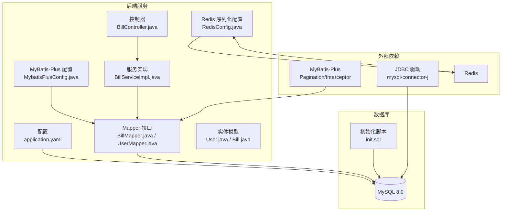
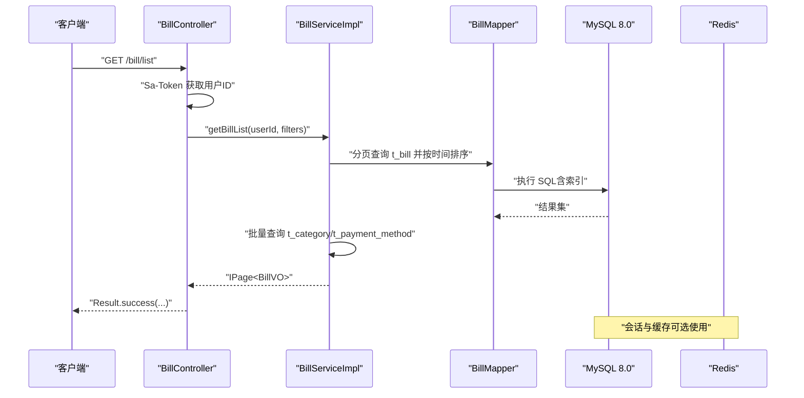
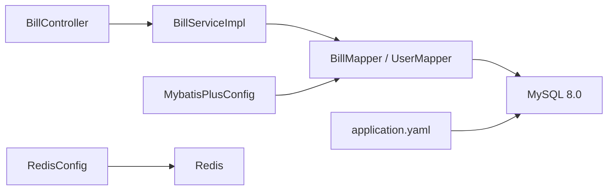
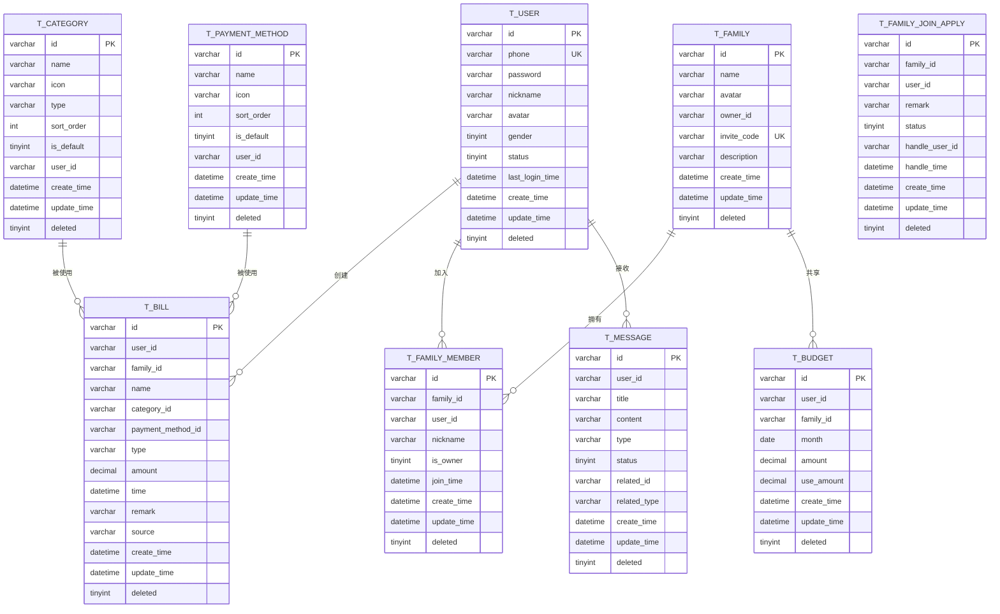

# 数据库架构设计

<cite>
**本文引用的文件**
- [init.sql](file://chuan-bill-server/init.sql)
- [application.yaml](file://chuan-bill-server/src/main/resources/application.yaml)
- [pom.xml](file://chuan-bill-server/pom.xml)
- [MybatisPlusConfig.java](file://chuan-bill-server/src/main/java/com/samoy/chuanbillserver/config/MybatisPlusConfig.java)
- [RedisConfig.java](file://chuan-bill-server/src/main/java/com/samoy/chuanbillserver/config/RedisConfig.java)
- [User.java](file://chuan-bill-server/src/main/java/com/samoy/chuanbillserver/entity/User.java)
- [Bill.java](file://chuan-bill-server/src/main/java/com/samoy/chuanbillserver/entity/Bill.java)
- [BillMapper.java](file://chuan-bill-server/src/main/java/com/samoy/chuanbillserver/dao/BillMapper.java)
- [UserMapper.java](file://chuan-bill-server/src/main/java/com/samoy/chuanbillserver/dao/UserMapper.java)
- [BillServiceImpl.java](file://chuan-bill-server/src/main/java/com/samoy/chuanbillserver/service/impl/BillServiceImpl.java)
- [BillController.java](file://chuan-bill-server/src/main/java/com/samoy/chuanbillserver/controller/BillController.java)
</cite>

## 目录
1. [引言](#引言)
2. [项目结构](#项目结构)
3. [核心组件](#核心组件)
4. [架构总览](#架构总览)
5. [详细组件分析](#详细组件分析)
6. [依赖关系分析](#依赖关系分析)
7. [性能考量](#性能考量)
8. [故障排查指南](#故障排查指南)
9. [结论](#结论)
10. [附录](#附录)

## 引言
本文件面向“小川记账”数据库架构设计，基于仓库中的数据库初始化脚本与后端配置，系统化阐述数据库整体设计理念、连接与事务管理、数据一致性保障、安全配置、性能监控与优化、备份恢复与高可用、版本与迁移管理以及容量规划建议。目标是帮助开发者与运维人员快速理解并落地数据库层面的设计与实践。

## 项目结构
后端采用 Spring Boot + MyBatis-Plus 技术栈，数据库通过 JDBC 连接，使用 MySQL 8.0 驱动；Redis 作为缓存与会话存储。数据库初始化脚本定义了完整的表结构、索引与系统预设数据，应用配置文件集中管理数据源、MyBatis-Plus 逻辑删除与日志输出、OpenAPI 文档等。

图表来源
- [application.yaml:1-51](file://chuan-bill-server/src/main/resources/application.yaml#L1-L51)
- [MybatisPlusConfig.java:1-18](file://chuan-bill-server/src/main/java/com/samoy/chuanbillserver/config/MybatisPlusConfig.java#L1-L18)
- [RedisConfig.java:1-31](file://chuan-bill-server/src/main/java/com/samoy/chuanbillserver/config/RedisConfig.java#L1-L31)
- [BillController.java:1-91](file://chuan-bill-server/src/main/java/com/samoy/chuanbillserver/controller/BillController.java#L1-L91)
- [BillServiceImpl.java:1-244](file://chuan-bill-server/src/main/java/com/samoy/chuanbillserver/service/impl/BillServiceImpl.java#L1-L244)
- [BillMapper.java:1-15](file://chuan-bill-server/src/main/java/com/samoy/chuanbillserver/dao/BillMapper.java#L1-L15)
- [UserMapper.java:1-15](file://chuan-bill-server/src/main/java/com/samoy/chuanbillserver/dao/UserMapper.java#L1-L15)
- [User.java:1-94](file://chuan-bill-server/src/main/java/com/samoy/chuanbillserver/entity/User.java#L1-L94)
- [Bill.java:1-113](file://chuan-bill-server/src/main/java/com/samoy/chuanbillserver/entity/Bill.java#L1-L113)
- [init.sql:1-326](file://chuan-bill-server/init.sql#L1-L326)
- [pom.xml:97-107](file://chuan-bill-server/pom.xml#L97-L107)

章节来源
- [application.yaml:1-51](file://chuan-bill-server/src/main/resources/application.yaml#L1-L51)
- [pom.xml:97-107](file://chuan-bill-server/pom.xml#L97-L107)
- [init.sql:1-326](file://chuan-bill-server/init.sql#L1-L326)

## 核心组件
- 数据库初始化与表结构
  - 初始化脚本定义数据库、字符集、存储引擎与各业务表结构，包含主键、唯一键、普通索引及系统预设数据。
  - 关键表：用户表、类目表、支付方式表、家庭表、家庭成员表、家庭加入申请表、账单表、预算表、消息表。
- 数据访问层
  - 使用 MyBatis-Plus 的 BaseMapper 接口，结合实体类注解映射表字段，实现通用 CRUD。
- 服务层
  - 以 BillServiceImpl 为例，封装分页查询、多条件过滤、批量关联查询（避免 N+1）、权限校验与 VO 转换。
- 控制器层
  - 基于 Sa-Token 获取登录用户 ID，调用服务完成业务操作，并通过 Swagger 文档暴露接口。
- 配置层
  - application.yaml 集中配置数据源、Redis、MyBatis-Plus 逻辑删除与日志输出。
  - MybatisPlusConfig 注册分页拦截器。
  - RedisConfig 自定义序列化策略。

章节来源
- [init.sql:1-326](file://chuan-bill-server/init.sql#L1-L326)
- [BillMapper.java:1-15](file://chuan-bill-server/src/main/java/com/samoy/chuanbillserver/dao/BillMapper.java#L1-L15)
- [UserMapper.java:1-15](file://chuan-bill-server/src/main/java/com/samoy/chuanbillserver/dao/UserMapper.java#L1-L15)
- [User.java:1-94](file://chuan-bill-server/src/main/java/com/samoy/chuanbillserver/entity/User.java#L1-L94)
- [Bill.java:1-113](file://chuan-bill-server/src/main/java/com/samoy/chuanbillserver/entity/Bill.java#L1-L113)
- [BillServiceImpl.java:1-244](file://chuan-bill-server/src/main/java/com/samoy/chuanbillserver/service/impl/BillServiceImpl.java#L1-L244)
- [BillController.java:1-91](file://chuan-bill-server/src/main/java/com/samoy/chuanbillserver/controller/BillController.java#L1-L91)
- [application.yaml:1-51](file://chuan-bill-server/src/main/resources/application.yaml#L1-L51)
- [MybatisPlusConfig.java:1-18](file://chuan-bill-server/src/main/java/com/samoy/chuanbillserver/config/MybatisPlusConfig.java#L1-L18)
- [RedisConfig.java:1-31](file://chuan-bill-server/src/main/java/com/samoy/chuanbillserver/config/RedisConfig.java#L1-L31)

## 架构总览
下图展示数据库与后端的交互关系：控制器接收请求，经服务层进行业务校验与数据组装，通过 Mapper 访问数据库，MyBatis-Plus 提供分页与逻辑删除能力；Redis 用于会话与缓存。

图表来源
- [BillController.java:37-42](file://chuan-bill-server/src/main/java/com/samoy/chuanbillserver/controller/BillController.java#L37-L42)
- [BillServiceImpl.java:50-123](file://chuan-bill-server/src/main/java/com/samoy/chuanbillserver/service/impl/BillServiceImpl.java#L50-L123)
- [BillMapper.java:1-15](file://chuan-bill-server/src/main/java/com/samoy/chuanbillserver/dao/BillMapper.java#L1-L15)
- [application.yaml:4-8](file://chuan-bill-server/src/main/resources/application.yaml#L4-L8)

## 详细组件分析

### 数据库整体设计理念
- MySQL 8.0 选择
  - 版本特性：支持窗口函数、CTE、JSON 函数、更优的查询优化器、更强的安全与审计能力。
  - 与驱动兼容：mysql-connector-j 已覆盖 MySQL 8.0。
- 字符集与排序规则
  - 初始化脚本显式指定数据库字符集为 utf8mb4，并设置排序规则为 utf8mb4_unicode_ci，确保表情符号与多语言正确存储与比较。
- 存储引擎
  - 所有表 ENGINE=InnoDB，具备 ACID、行级锁、外键约束、崩溃恢复等特性，适合高并发写入与强一致需求。

章节来源
- [init.sql:6-8](file://chuan-bill-server/init.sql#L6-L8)
- [pom.xml:97-101](file://chuan-bill-server/pom.xml#L97-L101)

### 数据库连接池与事务管理
- 连接池
  - 后端使用 Spring Boot Starter JDBC，默认集成 HikariCP；在 application.yaml 中未显式配置连接池参数，遵循默认行为。
- 事务管理
  - Spring 声明式事务默认传播行为适用于单实例服务；跨服务或分布式事务需引入 Seata 或 Saga 等中间件（本仓库未涉及）。
- 逻辑删除
  - MyBatis-Plus 全局配置逻辑删除字段为 deleted，值与非删除值在配置中定义，Mapper 层自动屏蔽逻辑删除记录。

章节来源
- [application.yaml:4-8](file://chuan-bill-server/src/main/resources/application.yaml#L4-L8)
- [application.yaml:32-39](file://chuan-bill-server/src/main/resources/application.yaml#L32-L39)
- [MybatisPlusConfig.java:10-17](file://chuan-bill-server/src/main/java/com/samoy/chuanbillserver/config/MybatisPlusConfig.java#L10-L17)

### 数据一致性保证机制
- 主键与唯一性
  - 用户表 phone 唯一索引、家庭表 invite_code 唯一索引、预算表用户/家庭+月份唯一索引，防止重复与冲突。
- 外键约束
  - 初始化脚本未声明外键约束，业务一致性通过应用层校验与事务控制保障；若需强约束，可在生产环境补充外键。
- 读写分离与隔离级别
  - 默认读已提交；如需更强一致性，可在关键路径上提升隔离级别或使用悲观锁/乐观锁策略。
- 并发控制
  - InnoDB 行级锁与 MVCC 保障高并发下的数据一致性；对热点数据建议配合 Redis 缓存与限流。

章节来源
- [init.sql:28](file://chuan-bill-server/init.sql#L28)
- [init.sql:85](file://chuan-bill-server/init.sql#L85)
- [init.sql:176-178](file://chuan-bill-server/init.sql#L176-L178)

### 数据库安全配置
- 用户权限管理
  - application.yaml 中通过环境变量注入用户名与密码；建议在生产环境使用只读账号用于查询、写账号用于写入，并最小化权限。
- 连接加密
  - 当前 URL 未启用 SSL；生产建议开启 TLS 并配置 serverTimezone 与时区一致。
- SQL 注入防护
  - 使用 MyBatis-Plus 的 LambdaQueryWrapper 与参数化查询，避免字符串拼接；控制器参数使用校验注解，降低异常输入风险。

章节来源
- [application.yaml:6](file://chuan-bill-server/src/main/resources/application.yaml#L6)
- [BillServiceImpl.java:50-87](file://chuan-bill-server/src/main/java/com/samoy/chuanbillserver/service/impl/BillServiceImpl.java#L50-L87)
- [BillController.java:39](file://chuan-bill-server/src/main/java/com/samoy/chuanbillserver/controller/BillController.java#L39)

### 性能监控与慢查询
- 慢查询日志
  - 建议在 MySQL 实例开启慢查询日志与阈值设置，结合 init.sql 中的索引设计评估命中率。
- 连接数限制
  - 通过 max_connections、back_log、thread_cache_size 等参数控制并发；后端连接池大小与数据库最大连接数需匹配。
- 索引与查询
  - t_bill 对 user_id/time、family_id/time 等组合索引有利于分页与范围查询；避免全表扫描。

章节来源
- [init.sql:149-158](file://chuan-bill-server/init.sql#L149-L158)

### 备份恢复与高可用
- 备份策略
  - 建议采用物理备份（如 Percona XtraBackup）与逻辑备份（mysqldump）相结合，定期校验恢复流程。
- 主从复制
  - 配置二进制日志、唯一 server-id、增量同步与延迟监控；读写分离可由中间件或应用侧路由实现。
- 高可用
  - 基于 Keepalived/VRRP 或 Proxy 层（如 MaxScale/ProxySQL）实现 VIP 切换；配合半同步复制降低丢数据风险。

（本节为通用实践建议，不直接对应具体代码文件）

### 版本管理、迁移与容量规划
- 版本管理
  - 使用 Git 管理 init.sql 与 DDL 变更；每次变更打标签并记录影响面。
- 迁移策略
  - 采用灰度发布与回滚计划；DDL 变更在维护窗口执行，必要时使用 pt-online-schema-change 降低锁等待。
- 容量规划
  - 基于 t_bill 增长速率估算存储与 IO；热点表（t_bill、t_user）优先扩容与索引优化；预留 30% 空间与性能余量。

（本节为通用实践建议，不直接对应具体代码文件）

## 依赖关系分析
- 组件耦合
  - 控制器依赖服务；服务依赖 Mapper；Mapper 依赖数据库；Redis 为可选依赖。
- 外部依赖
  - mysql-connector-j、MyBatis-Plus、Spring Boot JDBC、Redis 客户端。
- 潜在环路
  - 无循环依赖；模块职责清晰。

图表来源
- [BillController.java:26-36](file://chuan-bill-server/src/main/java/com/samoy/chuanbillserver/controller/BillController.java#L26-L36)
- [BillServiceImpl.java:42-48](file://chuan-bill-server/src/main/java/com/samoy/chuanbillserver/service/impl/BillServiceImpl.java#L42-L48)
- [BillMapper.java:1-15](file://chuan-bill-server/src/main/java/com/samoy/chuanbillserver/dao/BillMapper.java#L1-L15)
- [UserMapper.java:1-15](file://chuan-bill-server/src/main/java/com/samoy/chuanbillserver/dao/UserMapper.java#L1-L15)
- [application.yaml:4-8](file://chuan-bill-server/src/main/resources/application.yaml#L4-L8)
- [MybatisPlusConfig.java:10-17](file://chuan-bill-server/src/main/java/com/samoy/chuanbillserver/config/MybatisPlusConfig.java#L10-L17)
- [RedisConfig.java:12-31](file://chuan-bill-server/src/main/java/com/samoy/chuanbillserver/config/RedisConfig.java#L12-L31)

章节来源
- [pom.xml:97-107](file://chuan-bill-server/pom.xml#L97-L107)
- [application.yaml:1-51](file://chuan-bill-server/src/main/resources/application.yaml#L1-L51)

## 性能考量
- 查询优化
  - 列出 t_bill 的查询按时间倒序，结合 user_id/time、family_id/time 索引可显著减少扫描。
  - 分页查询通过 MyBatis-Plus 分页插件实现，避免一次性加载大量数据。
- 写入优化
  - 批量插入系统预设数据（类目、支付方式）减少往返；注意幂等性。
- 缓存策略
  - RedisConfig 提供 JSON 序列化模板，可用于热点数据缓存与会话存储；结合 Sa-Token 实现鉴权缓存。
- 日志与可观测性
  - MyBatis-Plus 日志输出便于开发调试；生产建议接入统一日志平台与 APM。

章节来源
- [BillServiceImpl.java:50-123](file://chuan-bill-server/src/main/java/com/samoy/chuanbillserver/service/impl/BillServiceImpl.java#L50-L123)
- [MybatisPlusConfig.java:10-17](file://chuan-bill-server/src/main/java/com/samoy/chuanbillserver/config/MybatisPlusConfig.java#L10-L17)
- [RedisConfig.java:12-31](file://chuan-bill-server/src/main/java/com/samoy/chuanbillserver/config/RedisConfig.java#L12-L31)
- [application.yaml:38-39](file://chuan-bill-server/src/main/resources/application.yaml#L38-L39)

## 故障排查指南
- 连接失败
  - 检查 MYSQL_URL、MYSQL_USERNAME、MYSQL_PASSWORD 环境变量；确认 MySQL 服务可达与防火墙放行。
- SQL 执行异常
  - 查看 MyBatis-Plus 日志输出定位 SQL；核对 LambdaQueryWrapper 条件与实体字段映射。
- 逻辑删除导致“数据消失”
  - 确认 deleted 字段与逻辑删除值配置一致；必要时临时关闭逻辑删除进行排查。
- Redis 相关问题
  - 核对 RedisConfig 序列化配置与连接参数；检查连接池大小与超时设置。

章节来源
- [application.yaml:4-8](file://chuan-bill-server/src/main/resources/application.yaml#L4-L8)
- [application.yaml:32-39](file://chuan-bill-server/src/main/resources/application.yaml#L32-L39)
- [RedisConfig.java:12-31](file://chuan-bill-server/src/main/java/com/samoy/chuanbillserver/config/RedisConfig.java#L12-L31)

## 结论
本架构以 MySQL 8.0 为核心，结合 utf8mb4 字符集与 InnoDB 存储引擎，满足多语言与高并发写入需求；通过 MyBatis-Plus 的逻辑删除与分页插件，兼顾易用性与性能；应用层通过 Sa-Token 与 Redis 实现鉴权与缓存。建议在生产环境中完善连接加密、慢查询治理、主从复制与高可用方案，并建立规范化的版本与迁移流程。

## 附录
- 数据模型概览（基于初始化脚本）

图表来源
- [init.sql:15-31](file://chuan-bill-server/init.sql#L15-L31)
- [init.sql:36-51](file://chuan-bill-server/init.sql#L36-L51)
- [init.sql:56-69](file://chuan-bill-server/init.sql#L56-L69)
- [init.sql:74-87](file://chuan-bill-server/init.sql#L74-L87)
- [init.sql:92-107](file://chuan-bill-server/init.sql#L92-L107)
- [init.sql:112-128](file://chuan-bill-server/init.sql#L112-L128)
- [init.sql:133-158](file://chuan-bill-server/init.sql#L133-L158)
- [init.sql:163-178](file://chuan-bill-server/init.sql#L163-L178)
- [init.sql:183-201](file://chuan-bill-server/init.sql#L183-L201)