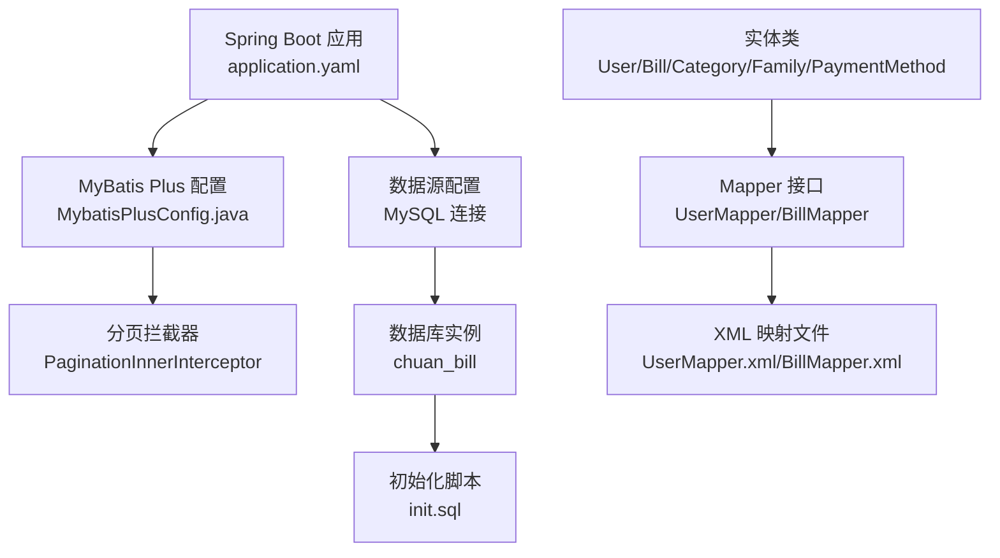
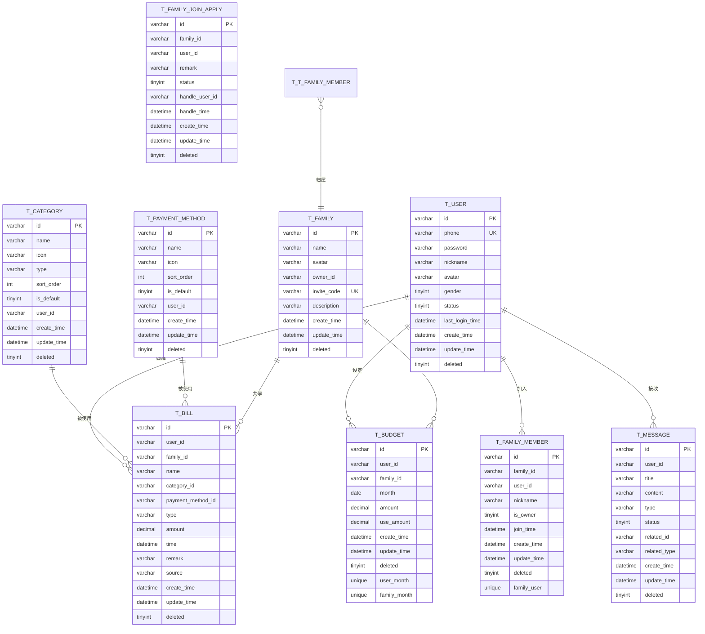
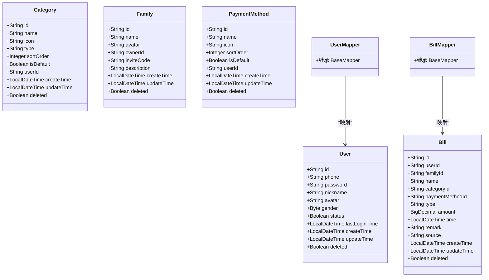
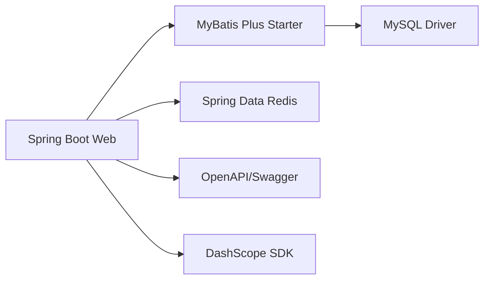

# 数据库设计

<cite>
**本文引用的文件**
- [init.sql](file://chuan-bill-server/init.sql)
- [application.yaml](file://chuan-bill-server/src/main/resources/application.yaml)
- [pom.xml](file://chuan-bill-server/pom.xml)
- [MybatisPlusConfig.java](file://chuan-bill-server/src/main/java/com/samoy/chuanbillserver/config/MybatisPlusConfig.java)
- [User.java](file://chuan-bill-server/src/main/java/com/samoy/chuanbillserver/entity/User.java)
- [Bill.java](file://chuan-bill-server/src/main/java/com/samoy/chuanbillserver/entity/Bill.java)
- [Category.java](file://chuan-bill-server/src/main/java/com/samoy/chuanbillserver/entity/Category.java)
- [Family.java](file://chuan-bill-server/src/main/java/com/samoy/chuanbillserver/entity/Family.java)
- [PaymentMethod.java](file://chuan-bill-server/src/main/java/com/samoy/chuanbillserver/entity/PaymentMethod.java)
- [UserMapper.java](file://chuan-bill-server/src/main/java/com/samoy/chuanbillserver/dao/UserMapper.java)
- [BillMapper.java](file://chuan-bill-server/src/main/java/com/samoy/chuanbillserver/dao/BillMapper.java)
- [UserMapper.xml](file://chuan-bill-server/src/main/resources/mapper/UserMapper.xml)
- [BillMapper.xml](file://chuan-bill-server/src/main/resources/mapper/BillMapper.xml)
</cite>

## 目录
1. [简介](#简介)
2. [项目结构](#项目结构)
3. [核心组件](#核心组件)
4. [架构总览](#架构总览)
5. [详细组件分析](#详细组件分析)
6. [依赖分析](#依赖分析)
7. [性能考量](#性能考量)
8. [故障排查指南](#故障排查指南)
9. [结论](#结论)
10. [附录](#附录)

## 简介
本文件为“小川记账”数据库设计的全面数据模型文档，覆盖数据库架构、实体关系模型（ERD）、字段与约束、MyBatis Plus配置与Mapper设计、性能优化策略、数据初始化与迁移方案，以及数据安全与监控建议。目标是帮助开发者与运维人员快速理解并高效维护该数据库。

## 项目结构
数据库相关的核心位置集中在后端服务模块中：
- 初始化脚本：chuan-bill-server/init.sql
- Spring Boot配置：chuan-bill-server/src/main/resources/application.yaml
- MyBatis Plus分页配置：chuan-bill-server/src/main/java/com/samoy/chuanbillserver/config/MybatisPlusConfig.java
- 实体类：chuan-bill-server/src/main/java/com/samoy/chuanbillserver/entity/*.java
- Mapper接口：chuan-bill-server/src/main/java/com/samoy/chuanbillserver/dao/*.java
- XML映射文件：chuan-bill-server/src/main/resources/mapper/*.xml
- Maven依赖：chuan-bill-server/pom.xml

图表来源
- [application.yaml:1-51](file://chuan-bill-server/src/main/resources/application.yaml#L1-L51)
- [MybatisPlusConfig.java:1-18](file://chuan-bill-server/src/main/java/com/samoy/chuanbillserver/config/MybatisPlusConfig.java#L1-L18)
- [UserMapper.java:1-15](file://chuan-bill-server/src/main/java/com/samoy/chuanbillserver/dao/UserMapper.java#L1-L15)
- [BillMapper.java:1-15](file://chuan-bill-server/src/main/java/com/samoy/chuanbillserver/dao/BillMapper.java#L1-L15)
- [UserMapper.xml:1-6](file://chuan-bill-server/src/main/resources/mapper/UserMapper.xml#L1-L6)
- [BillMapper.xml:1-6](file://chuan-bill-server/src/main/resources/mapper/BillMapper.xml#L1-L6)
- [init.sql:1-326](file://chuan-bill-server/init.sql#L1-L326)

章节来源
- [application.yaml:1-51](file://chuan-bill-server/src/main/resources/application.yaml#L1-L51)
- [pom.xml:1-226](file://chuan-bill-server/pom.xml#L1-L226)

## 核心组件
本项目采用“逻辑删除 + 分页 + 统一配置”的数据访问模式，核心组件如下：
- 数据库：MySQL（字符集utf8mb4，排序规则utf8mb4_unicode_ci）
- ORM框架：MyBatis Plus（逻辑删除、自动填充、分页）
- 数据源：Spring Boot JDBC + MySQL Connector/J
- 缓存：Redis（用于会话与缓存）

关键配置要点：
- 逻辑删除字段：deleted（0未删除，1已删除）
- 分页插件：PaginationInnerInterceptor（MySQL）
- OpenAPI/Swagger：springdoc-openapi
- DashScope OCR：集成百炼OCR能力

章节来源
- [application.yaml:1-51](file://chuan-bill-server/src/main/resources/application.yaml#L1-L51)
- [MybatisPlusConfig.java:1-18](file://chuan-bill-server/src/main/java/com/samoy/chuanbillserver/config/MybatisPlusConfig.java#L1-L18)
- [pom.xml:1-226](file://chuan-bill-server/pom.xml#L1-L226)

## 架构总览
数据库层以“用户-账单-家庭-分类-支付方式”为核心实体，围绕这些实体构建ERD，并通过索引与约束保障数据一致性与查询效率。

图表来源
- [init.sql:12-201](file://chuan-bill-server/init.sql#L12-L201)

## 详细组件分析

### 用户表 t_user
- 设计思路
  - 主键：id（字符串型用户标识）
  - 唯一索引：phone（手机号唯一）
  - 辅助索引：status、create_time
  - 逻辑删除：deleted
- 字段与类型
  - id: varchar(64)，主键
  - phone: varchar(11)，唯一
  - password: varchar(128)，可空
  - nickname/avatar/gender/status: 语义明确
  - last_login_time: 记录最近登录时间
  - create_time/update_time: 自动时间戳
  - deleted: 逻辑删除标志
- 业务规则
  - 注册需唯一手机号
  - 状态0禁用不可登录
  - 删除采用软删

章节来源
- [init.sql:15-31](file://chuan-bill-server/init.sql#L15-L31)
- [User.java:24-93](file://chuan-bill-server/src/main/java/com/samoy/chuanbillserver/entity/User.java#L24-L93)

### 账单表 t_bill
- 设计思路
  - 主键：id
  - 复合索引：user_id+time、family_id+time，支撑按用户/家庭的时间序列查询
  - 单列索引：user_id、family_id、category_id、payment_method_id、type、time、create_time
  - 逻辑删除：deleted
- 字段与类型
  - user_id/family_id/category_id/payment_method_id/type/amount/time/source/remark：业务字段
  - 时间字段：time 默认当前时间
- 业务规则
  - 支持个人账单与家庭共享账单
  - type枚举值控制收入/支出
  - source记录账单来源（手动/OCR/语音/导入）

章节来源
- [init.sql:133-158](file://chuan-bill-server/init.sql#L133-L158)
- [Bill.java:24-112](file://chuan-bill-server/src/main/java/com/samoy/chuanbillserver/entity/Bill.java#L24-L112)

### 分类表 t_category
- 设计思路
  - 主键：id；辅助索引：type、user_id、sort_order
  - 支持系统默认类目（user_id为空）与用户自定义类目
- 字段与类型
  - type: 枚举式字符串（income/expense）
  - sort_order: 数字越小越靠前
- 业务规则
  - 默认类目is_default=1
  - 用户可自定义类目并调整排序

章节来源
- [init.sql:36-51](file://chuan-bill-server/init.sql#L36-L51)
- [Category.java:24-87](file://chuan-bill-server/src/main/java/com/samoy/chuanbillserver/entity/Category.java#L24-L87)

### 支付方式表 t_payment_method
- 设计思路
  - 主键：id；辅助索引：user_id、sort_order
  - 支持系统默认支付方式（user_id为空）与用户自定义
- 字段与类型
  - sort_order：数字越小越靠前
  - is_default：默认支付方式
- 业务规则
  - 默认支付方式is_default=1
  - 用户可自定义并排序

章节来源
- [init.sql:56-69](file://chuan-bill-server/init.sql#L56-L69)
- [PaymentMethod.java:24-81](file://chuan-bill-server/src/main/java/com/samoy/chuanbillserver/entity/PaymentMethod.java#L24-L81)

### 家庭表 t_family 与成员表 t_family_member
- 设计思路
  - 家庭表：主键id；唯一索引invite_code；索引owner_id
  - 成员表：主键id；唯一索引(family_id,user_id)；索引family_id、user_id、is_owner
  - 关系：一个家庭有多个成员，成员可拥有户主身份
- 业务规则
  - 邀请码用于加入家庭
  - 成员加入时间join_time记录

章节来源
- [init.sql:74-107](file://chuan-bill-server/init.sql#L74-L107)
- [Family.java:24-81](file://chuan-bill-server/src/main/java/com/samoy/chuanbillserver/entity/Family.java#L24-L81)

### 家庭加入申请表 t_family_join_apply
- 设计思路
  - 主键id；索引family_id、user_id、status、create_time
  - 记录申请状态与处理人、处理时间
- 业务规则
  - status枚举：待处理/同意/拒绝

章节来源
- [init.sql:112-128](file://chuan-bill-server/init.sql#L112-L128)

### 预算表 t_budget
- 设计思路
  - 主键id；索引user_id、family_id
  - 唯一索引：(user_id,month)、(family_id,month)
  - 存储当月第一天的日期
- 业务规则
  - amount为预算总额，use_amount为已使用金额

章节来源
- [init.sql:163-178](file://chuan-bill-server/init.sql#L163-L178)

### 消息表 t_message
- 设计思路
  - 主键id；索引user_id、type、status、create_time、user_id+status
  - 支持系统消息、家庭消息、账单消息、预算消息
- 业务规则
  - related_id/related_type与消息类型关联

章节来源
- [init.sql:183-201](file://chuan-bill-server/init.sql#L183-L201)

### 数据访问层（MyBatis Plus）
- 配置概览
  - 逻辑删除：deleted字段统一处理
  - 分页：PaginationInnerInterceptor（MySQL）
  - 日志：StdOutImpl输出SQL
- Mapper设计
  - 使用BaseMapper接口，无需XML即可实现通用CRUD
  - 当前UserMapper.xml/BillMapper.xml为空，保留扩展空间
- 实体映射
  - @TableName与@TableId/@TableField映射表与字段

图表来源
- [User.java:24-93](file://chuan-bill-server/src/main/java/com/samoy/chuanbillserver/entity/User.java#L24-L93)
- [Bill.java:24-112](file://chuan-bill-server/src/main/java/com/samoy/chuanbillserver/entity/Bill.java#L24-L112)
- [Category.java:24-87](file://chuan-bill-server/src/main/java/com/samoy/chuanbillserver/entity/Category.java#L24-L87)
- [Family.java:24-81](file://chuan-bill-server/src/main/java/com/samoy/chuanbillserver/entity/Family.java#L24-L81)
- [PaymentMethod.java:24-81](file://chuan-bill-server/src/main/java/com/samoy/chuanbillserver/entity/PaymentMethod.java#L24-L81)
- [UserMapper.java:14](file://chuan-bill-server/src/main/java/com/samoy/chuanbillserver/dao/UserMapper.java#L14)
- [BillMapper.java:14](file://chuan-bill-server/src/main/java/com/samoy/chuanbillserver/dao/BillMapper.java#L14)

章节来源
- [application.yaml:32-39](file://chuan-bill-server/src/main/resources/application.yaml#L32-L39)
- [MybatisPlusConfig.java:10-17](file://chuan-bill-server/src/main/java/com/samoy/chuanbillserver/config/MybatisPlusConfig.java#L10-L17)
- [UserMapper.java:14](file://chuan-bill-server/src/main/java/com/samoy/chuanbillserver/dao/UserMapper.java#L14)
- [BillMapper.java:14](file://chuan-bill-server/src/main/java/com/samoy/chuanbillserver/dao/BillMapper.java#L14)
- [UserMapper.xml:1-6](file://chuan-bill-server/src/main/resources/mapper/UserMapper.xml#L1-L6)
- [BillMapper.xml:1-6](file://chuan-bill-server/src/main/resources/mapper/BillMapper.xml#L1-L6)

## 依赖分析
- MyBatis Plus依赖链
  - spring-boot-starter-web
  - mybatis-plus-spring-boot3-starter
  - mysql-connector-j
  - spring-boot-starter-data-redis（会话与缓存）
  - springdoc-openapi（API文档）
  - dashscope-sdk-java（OCR能力）
- Maven管理
  - 依赖版本由BOM统一管理，确保兼容性

图表来源
- [pom.xml:51-168](file://chuan-bill-server/pom.xml#L51-L168)

章节来源
- [pom.xml:1-226](file://chuan-bill-server/pom.xml#L1-L226)

## 性能考量
- 索引策略
  - 用户表：phone唯一索引、status与create_time辅助索引
  - 账单表：user_id+time、family_id+time复合索引，配合user_id、family_id、category_id、payment_method_id、type、time、create_time单列索引
  - 分类与支付方式：user_id与sort_order索引，支持用户维度与排序
  - 家庭与成员：invite_code唯一索引、成员表多维索引（含唯一组合）
  - 预算表：(user_id,month)与(family_id,month)唯一索引
  - 消息表：user_id、type、status、create_time及user_id+status复合索引
- 查询优化
  - 利用复合索引覆盖常见查询条件（如按用户/家庭+时间范围）
  - 逻辑删除字段统一过滤，避免全表扫描
- 分页处理
  - 启用PaginationInnerInterceptor，自动改写SQL为LIMIT分页
- 写入优化
  - 批量插入系统默认类目与支付方式，减少多次往返
- 缓存建议
  - Redis缓存热点数据（如用户信息、常用支付方式、近期账单列表）

章节来源
- [init.sql:15-326](file://chuan-bill-server/init.sql#L15-L326)
- [MybatisPlusConfig.java:10-17](file://chuan-bill-server/src/main/java/com/samoy/chuanbillserver/config/MybatisPlusConfig.java#L10-L17)
- [application.yaml:32-39](file://chuan-bill-server/src/main/resources/application.yaml#L32-L39)

## 故障排查指南
- 逻辑删除导致“查不到数据”
  - 确认查询未被全局逻辑删除拦截器屏蔽，或显式传入不忽略逻辑删除的条件
- 分页异常
  - 检查是否正确引入分页插件与Page参数传递
- 索引失效
  - 避免在索引列上使用函数或隐式转换；尽量使用复合索引的最左前缀匹配
- 并发问题
  - 对唯一键冲突（如手机号）进行捕获与友好提示
- 数据一致性
  - 家庭成员与户主权限：确保成员表is_owner与家庭表owner_id一致

章节来源
- [application.yaml:32-39](file://chuan-bill-server/src/main/resources/application.yaml#L32-L39)
- [MybatisPlusConfig.java:10-17](file://chuan-bill-server/src/main/java/com/samoy/chuanbillserver/config/MybatisPlusConfig.java#L10-L17)

## 结论
本数据库设计以“清晰的实体边界、合理的索引策略、统一的逻辑删除与分页配置”为核心，兼顾了业务扩展性与查询性能。结合系统默认类目与支付方式的初始化，能够快速落地并满足日常记账场景需求。后续可在缓存、审计日志与监控告警方面进一步完善。

## 附录

### 数据初始化脚本说明
- 初始化数据库与字符集
- 创建核心表（用户、账单、分类、支付方式、家庭、成员、申请、预算、消息）
- 插入系统默认类目（收入/支出各7项）
- 插入系统默认支付方式（微信、支付宝、现金、银行卡、信用卡、花呗、其他）

章节来源
- [init.sql:1-326](file://chuan-bill-server/init.sql#L1-L326)

### 种子数据设计
- 默认类目：按类型划分，排序字段决定展示顺序
- 默认支付方式：按常用度排序，支持扩展
- 建议：新增类目/支付方式时保持is_default与sort_order的合理性

章节来源
- [init.sql:206-325](file://chuan-bill-server/init.sql#L206-L325)

### 数据迁移方案
- 版本化迁移
  - 采用独立SQL脚本按版本增量迁移，记录迁移时间与版本号
- 逻辑回滚
  - 重要变更采用“新增字段+默认值+迁移数据+切换逻辑”的两阶段策略
- 兼容性测试
  - 在测试环境验证索引、查询计划与分页行为

[本节为通用实践建议，不直接分析具体文件]

### 数据安全与备份恢复
- 数据安全
  - 密码字段建议加密存储（当前schema允许password字段存在）
  - 传输层启用TLS，最小权限原则
- 备份与恢复
  - 建议采用mysqldump或Percona XtraBackup定期全备与增量备份
  - 恢复流程应包含校验与灰度验证
- 监控与告警
  - 关键指标：慢查询、连接数、锁等待、磁盘与CPU
  - 建议接入Prometheus/Grafana与告警平台

[本节为通用实践建议，不直接分析具体文件]