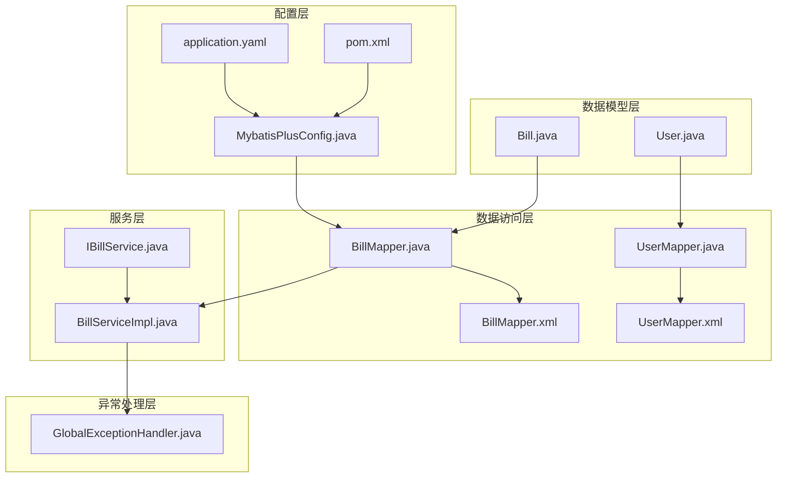
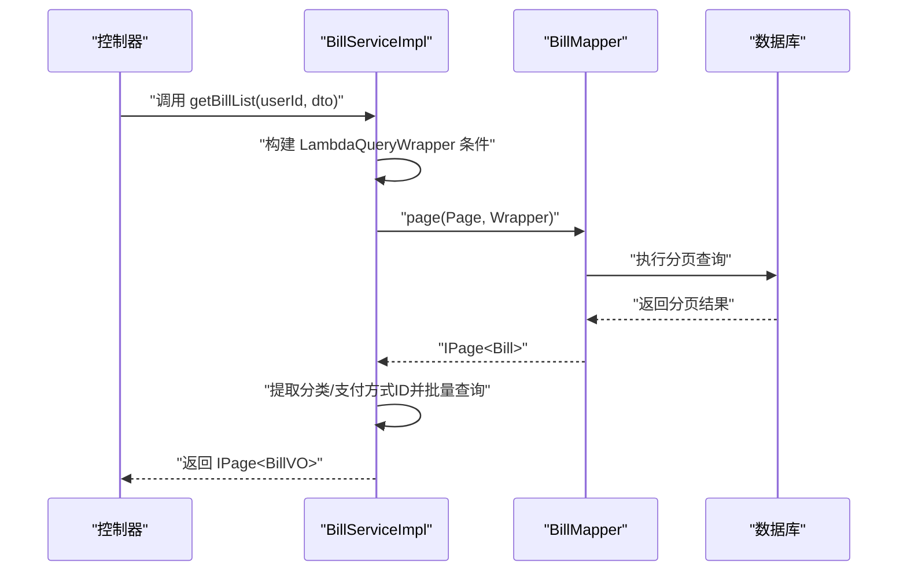
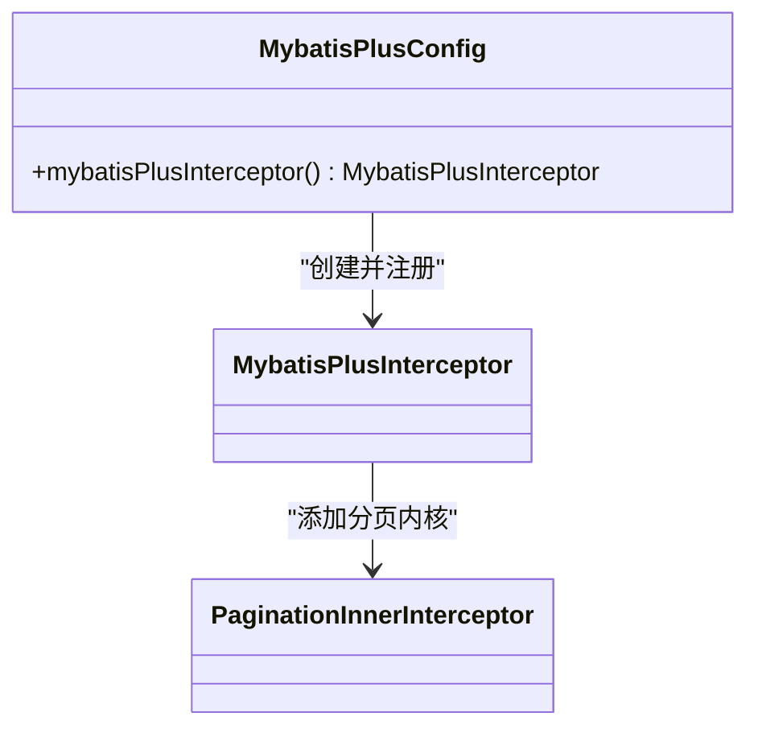
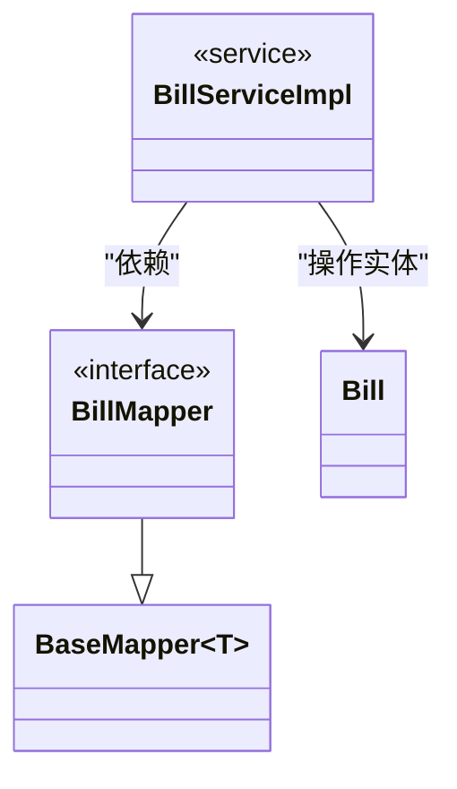
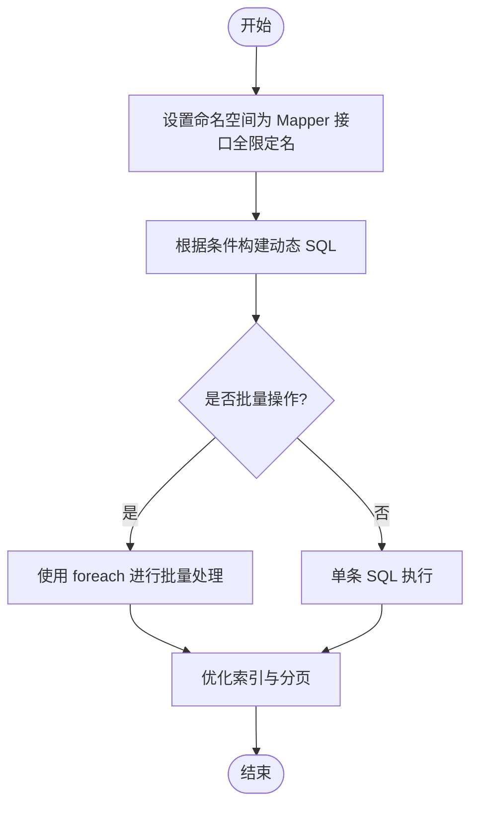
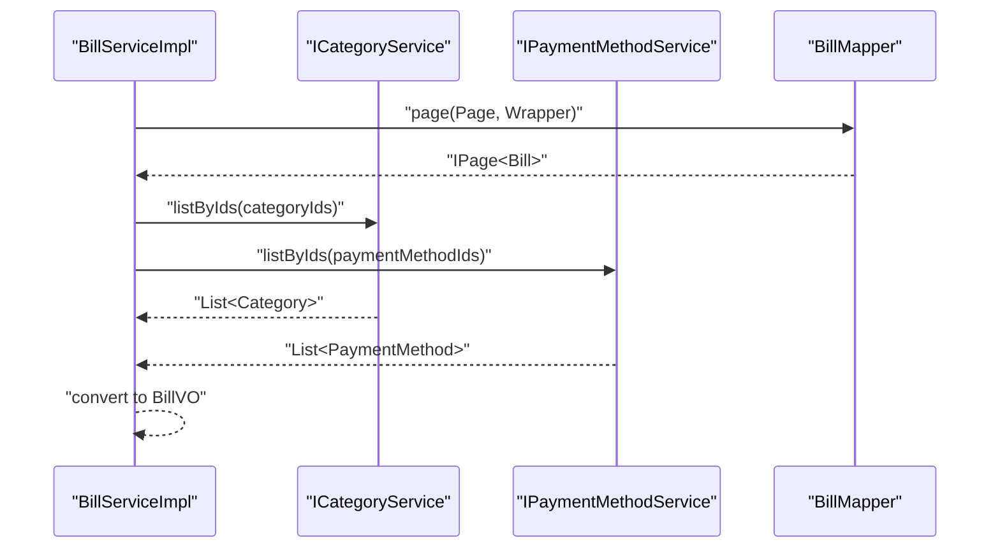
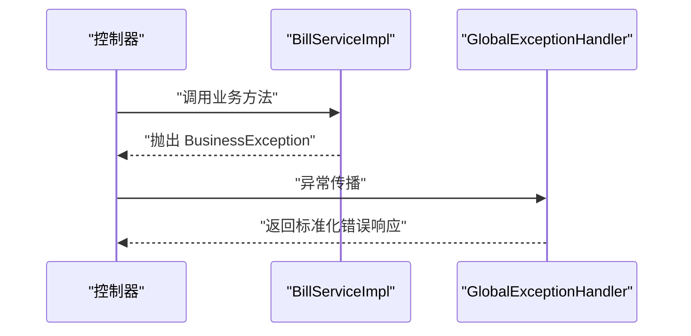
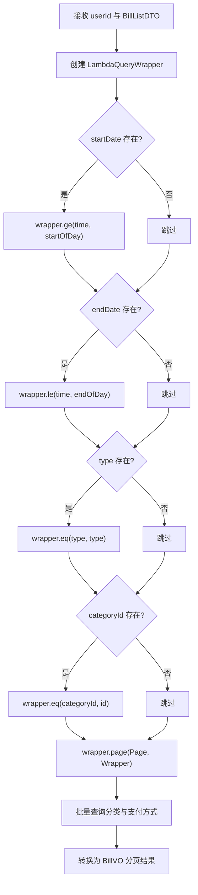
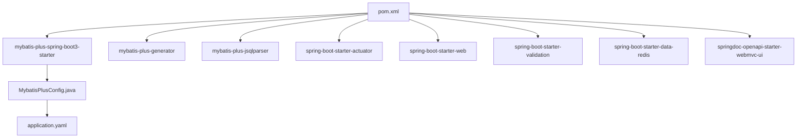

# 数据访问层实现

<cite>
**本文引用的文件**
- [MybatisPlusConfig.java](file://chuan-bill-server/src/main/java/com/samoy/chuanbillserver/config/MybatisPlusConfig.java)
- [application.yaml](file://chuan-bill-server/src/main/resources/application.yaml)
- [pom.xml](file://chuan-bill-server/pom.xml)
- [BillMapper.java](file://chuan-bill-server/src/main/java/com/samoy/chuanbillserver/dao/BillMapper.java)
- [UserMapper.java](file://chuan-bill-server/src/main/java/com/samoy/chuanbillserver/dao/UserMapper.java)
- [Bill.java](file://chuan-bill-server/src/main/java/com/samoy/chuanbillserver/entity/Bill.java)
- [User.java](file://chuan-bill-server/src/main/java/com/samoy/chuanbillserver/entity/User.java)
- [BillMapper.xml](file://chuan-bill-server/src/main/resources/mapper/BillMapper.xml)
- [UserMapper.xml](file://chuan-bill-server/src/main/resources/mapper/UserMapper.xml)
- [IBillService.java](file://chuan-bill-server/src/main/java/com/samoy/chuanbillserver/service/IBillService.java)
- [BillServiceImpl.java](file://chuan-bill-server/src/main/java/com/samoy/chuanbillserver/service/impl/BillServiceImpl.java)
- [GlobalExceptionHandler.java](file://chuan-bill-server/src/main/java/com/samoy/chuanbillserver/expection/GlobalExceptionHandler.java)
</cite>

## 目录
1. [简介](#简介)
2. [项目结构](#项目结构)
3. [核心组件](#核心组件)
4. [架构总览](#架构总览)
5. [详细组件分析](#详细组件分析)
6. [依赖分析](#依赖分析)
7. [性能考虑](#性能考虑)
8. [故障排查指南](#故障排查指南)
9. [结论](#结论)
10. [附录](#附录)

## 简介
本文件面向“小川记账”项目的后端数据访问层，围绕 MyBatis Plus 的自动配置、分页插件、逻辑删除等能力，系统梳理 DAO 层 Mapper 接口设计、泛型参数与基础 CRUD 实现；解析 XML 映射文件的编写规范与 SQL 优化要点；阐述 Service 层与 DAO 层的职责划分、事务管理策略与异常处理机制；并给出分页查询、条件构造器与 Lambda 表达式的使用范式，以及复杂查询优化、缓存策略集成、批量操作性能优化、测试策略与数据权限控制、租户隔离、审计日志等实践建议。

## 项目结构
数据访问层位于 chuan-bill-server 模块中，采用典型的分层架构：
- 配置层：MyBatis Plus 拦截器与全局配置
- 数据模型层：实体类与数据库表映射
- 数据访问层：Mapper 接口与 XML 映射
- 服务层：Service 接口与实现，封装业务流程与事务
- 异常处理层：统一异常处理与错误响应

**图表来源**
- [MybatisPlusConfig.java:1-18](file://chuan-bill-server/src/main/java/com/samoy/chuanbillserver/config/MybatisPlusConfig.java#L1-L18)
- [application.yaml:1-51](file://chuan-bill-server/src/main/resources/application.yaml#L1-L51)
- [pom.xml:1-226](file://chuan-bill-server/pom.xml#L1-L226)
- [Bill.java:1-113](file://chuan-bill-server/src/main/java/com/samoy/chuanbillserver/entity/Bill.java#L1-L113)
- [User.java:1-94](file://chuan-bill-server/src/main/java/com/samoy/chuanbillserver/entity/User.java#L1-L94)
- [BillMapper.java:1-15](file://chuan-bill-server/src/main/java/com/samoy/chuanbillserver/dao/BillMapper.java#L1-L15)
- [UserMapper.java:1-15](file://chuan-bill-server/src/main/java/com/samoy/chuanbillserver/dao/UserMapper.java#L1-L15)
- [BillMapper.xml:1-6](file://chuan-bill-server/src/main/resources/mapper/BillMapper.xml#L1-L6)
- [UserMapper.xml:1-6](file://chuan-bill-server/src/main/resources/mapper/UserMapper.xml#L1-L6)
- [IBillService.java:1-66](file://chuan-bill-server/src/main/java/com/samoy/chuanbillserver/service/IBillService.java#L1-L66)
- [BillServiceImpl.java:1-244](file://chuan-bill-server/src/main/java/com/samoy/chuanbillserver/service/impl/BillServiceImpl.java#L1-L244)
- [GlobalExceptionHandler.java:1-50](file://chuan-bill-server/src/main/java/com/samoy/chuanbillserver/expection/GlobalExceptionHandler.java#L1-L50)

**章节来源**
- [MybatisPlusConfig.java:1-18](file://chuan-bill-server/src/main/java/com/samoy/chuanbillserver/config/MybatisPlusConfig.java#L1-L18)
- [application.yaml:1-51](file://chuan-bill-server/src/main/resources/application.yaml#L1-L51)
- [pom.xml:1-226](file://chuan-bill-server/pom.xml#L1-L226)

## 核心组件
- MyBatis Plus 自动配置与拦截器
  - 在配置类中注册 MybatisPlusInterceptor，并添加分页内核 PaginationInnerInterceptor（MySQL）。
  - application.yaml 中开启逻辑删除字段与值、开启 MyBatis 日志输出。
- Mapper 接口设计
  - 基于 BaseMapper<T>，泛型参数为实体类，继承后即可获得通用 CRUD 能力。
  - 通过 XML 文件扩展复杂 SQL 或自定义 SQL。
- 实体类映射
  - 使用注解标注表名与字段映射，统一逻辑删除字段命名与值。
- Service 层职责
  - 封装业务流程、参数校验、权限校验、异常处理与 VO 转换。
  - 列表查询中使用 LambdaQueryWrapper 构建条件，结合分页插件实现分页。
  - 通过批量查询减少 N+1 查询，提升性能。

**章节来源**
- [MybatisPlusConfig.java:10-16](file://chuan-bill-server/src/main/java/com/samoy/chuanbillserver/config/MybatisPlusConfig.java#L10-L16)
- [application.yaml:32-39](file://chuan-bill-server/src/main/resources/application.yaml#L32-L39)
- [BillMapper.java](file://chuan-bill-server/src/main/java/com/samoy/chuanbillserver/dao/BillMapper.java#L14)
- [UserMapper.java](file://chuan-bill-server/src/main/java/com/samoy/chuanbillserver/dao/UserMapper.java#L14)
- [Bill.java:24-112](file://chuan-bill-server/src/main/java/com/samoy/chuanbillserver/entity/Bill.java#L24-L112)
- [User.java:23-93](file://chuan-bill-server/src/main/java/com/samoy/chuanbillserver/entity/User.java#L23-L93)
- [IBillService.java:19-65](file://chuan-bill-server/src/main/java/com/samoy/chuanbillserver/service/IBillService.java#L19-L65)
- [BillServiceImpl.java:50-123](file://chuan-bill-server/src/main/java/com/samoy/chuanbillserver/service/impl/BillServiceImpl.java#L50-L123)

## 架构总览
数据访问层整体交互流程如下：

**图表来源**
- [BillServiceImpl.java:50-123](file://chuan-bill-server/src/main/java/com/samoy/chuanbillserver/service/impl/BillServiceImpl.java#L50-L123)
- [BillMapper.java](file://chuan-bill-server/src/main/java/com/samoy/chuanbillserver/dao/BillMapper.java#L14)

## 详细组件分析

### MyBatis Plus 配置与插件
- 自动配置
  - 通过 MybatisPlusInterceptor 注册拦截器，实现分页、逻辑删除、性能分析等能力的统一接入。
- 分页插件
  - 使用 PaginationInnerInterceptor 并指定数据库类型为 MySQL，确保分页 SQL 正确生成。
- 逻辑删除
  - 在 application.yaml 中配置逻辑删除字段名与删除值，实体类中对应字段需标注逻辑删除注解。
- 性能分析插件
  - 当前配置未显式启用性能分析插件，可在拦截器中按需添加 inner 插件以启用慢 SQL 记录与统计。

**图表来源**
- [MybatisPlusConfig.java:10-16](file://chuan-bill-server/src/main/java/com/samoy/chuanbillserver/config/MybatisPlusConfig.java#L10-L16)

**章节来源**
- [MybatisPlusConfig.java:10-16](file://chuan-bill-server/src/main/java/com/samoy/chuanbillserver/config/MybatisPlusConfig.java#L10-L16)
- [application.yaml:32-39](file://chuan-bill-server/src/main/resources/application.yaml#L32-L39)

### Mapper 接口设计与泛型参数
- 设计原则
  - 继承 BaseMapper<T>，泛型为实体类，即可获得基础 CRUD 能力。
  - 仅定义领域方法或通过 XML 扩展复杂 SQL，避免重复实现。
- 泛型参数配置
  - Mapper 接口泛型为实体类，保证 MyBatis Plus 能正确推断表名、主键与字段映射。
- 基础 CRUD 实现
  - 通过 ServiceImpl<Mapper, Entity> 继承，即可复用通用 CRUD 方法，如 save、updateById、removeById、page 等。

**图表来源**
- [BillMapper.java](file://chuan-bill-server/src/main/java/com/samoy/chuanbillserver/dao/BillMapper.java#L14)
- [BillServiceImpl.java](file://chuan-bill-server/src/main/java/com/samoy/chuanbillserver/service/impl/BillServiceImpl.java#L42)

**章节来源**
- [BillMapper.java](file://chuan-bill-server/src/main/java/com/samoy/chuanbillserver/dao/BillMapper.java#L14)
- [UserMapper.java](file://chuan-bill-server/src/main/java/com/samoy/chuanbillserver/dao/UserMapper.java#L14)
- [BillServiceImpl.java](file://chuan-bill-server/src/main/java/com/samoy/chuanbillserver/service/impl/BillServiceImpl.java#L42)

### XML 映射文件编写规范
- 命名空间与接口绑定
  - mapper 的 namespace 必须与 Mapper 接口全限定名一致，便于 MyBatis 自动绑定。
- SQL 优化与动态 SQL
  - 对于复杂查询，优先使用动态 SQL 构建器（如 trim、where、set、foreach），避免硬编码 SQL。
  - 合理使用索引字段参与 WHERE 条件，避免全表扫描。
- 批量操作
  - 使用 foreach 批量插入或更新，减少网络往返与事务开销。
- 与实体类字段映射
  - 字段命名与实体类注解保持一致，避免大小写与下划线差异导致的映射失败。

**图表来源**
- [BillMapper.xml](file://chuan-bill-server/src/main/resources/mapper/BillMapper.xml#L3)
- [UserMapper.xml](file://chuan-bill-server/src/main/resources/mapper/UserMapper.xml#L3)

**章节来源**
- [BillMapper.xml:1-6](file://chuan-bill-server/src/main/resources/mapper/BillMapper.xml#L1-L6)
- [UserMapper.xml:1-6](file://chuan-bill-server/src/main/resources/mapper/UserMapper.xml#L1-L6)

### Service 层与 DAO 层职责划分
- DAO 层（Mapper）
  - 负责与数据库交互，提供基础 CRUD 与复杂 SQL 查询能力。
  - 通过 XML 扩展 SQL，遵循“少即是多”的原则，尽量不引入业务逻辑。
- Service 层（ServiceImpl）
  - 负责业务编排、参数校验、权限校验、异常处理与 VO 转换。
  - 列表查询中使用 LambdaQueryWrapper 构建条件，结合分页插件实现分页。
  - 通过批量查询减少 N+1 查询，提升性能。

**图表来源**
- [BillServiceImpl.java:88-122](file://chuan-bill-server/src/main/java/com/samoy/chuanbillserver/service/impl/BillServiceImpl.java#L88-L122)

**章节来源**
- [IBillService.java:19-65](file://chuan-bill-server/src/main/java/com/samoy/chuanbillserver/service/IBillService.java#L19-L65)
- [BillServiceImpl.java:50-123](file://chuan-bill-server/src/main/java/com/samoy/chuanbillserver/service/impl/BillServiceImpl.java#L50-L123)

### 事务管理策略与异常处理机制
- 事务管理
  - Service 层方法通常需要开启事务，确保业务原子性。可通过 Spring 声明式事务或编程式事务管理。
  - 对于批量写入与跨表更新，务必在同一个事务中完成。
- 异常处理
  - 使用统一异常处理器捕获业务异常与未登录异常，返回标准化错误响应。
  - 业务异常通过自定义 BusinessException 抛出，携带错误码与消息。

**图表来源**
- [BillServiceImpl.java:146-151](file://chuan-bill-server/src/main/java/com/samoy/chuanbillserver/service/impl/BillServiceImpl.java#L146-L151)
- [GlobalExceptionHandler.java:32-36](file://chuan-bill-server/src/main/java/com/samoy/chuanbillserver/expection/GlobalExceptionHandler.java#L32-L36)

**章节来源**
- [GlobalExceptionHandler.java:10-49](file://chuan-bill-server/src/main/java/com/samoy/chuanbillserver/expection/GlobalExceptionHandler.java#L10-L49)
- [BillServiceImpl.java:146-151](file://chuan-bill-server/src/main/java/com/samoy/chuanbillserver/service/impl/BillServiceImpl.java#L146-L151)

### 分页查询实现与条件构造器使用
- 分页查询
  - 使用 Page 对象与 LambdaQueryWrapper 构造查询条件，调用 Mapper 的 page 方法返回分页结果。
- 条件构造器
  - 使用 LambdaQueryWrapper 的 eq、ge、le、like 等方法，配合 Lambda 表达式简化字段引用。
- Lambda 表达式简化
  - 通过实体类字段的 Lambda 引用，避免硬编码字符串，降低重构风险。

**图表来源**
- [BillServiceImpl.java:50-123](file://chuan-bill-server/src/main/java/com/samoy/chuanbillserver/service/impl/BillServiceImpl.java#L50-L123)

**章节来源**
- [BillServiceImpl.java:50-123](file://chuan-bill-server/src/main/java/com/samoy/chuanbillserver/service/impl/BillServiceImpl.java#L50-L123)

### 复杂查询优化方案、缓存策略集成与批量操作性能优化
- 复杂查询优化
  - 为高频查询字段建立合适索引，避免 SELECT *，只取必要字段。
  - 使用 LIMIT 与分页参数控制结果集大小，避免一次性加载过多数据。
- 缓存策略集成
  - 对热点数据（如字典类：分类、支付方式）进行批量查询并缓存到 Map，避免 N+1 查询。
  - 结合 Redis 缓存热点数据，降低数据库压力。
- 批量操作性能优化
  - 使用批量插入/更新，减少网络往返。
  - 控制批处理大小，避免内存溢出。

**章节来源**
- [BillServiceImpl.java:90-121](file://chuan-bill-server/src/main/java/com/samoy/chuanbillserver/service/impl/BillServiceImpl.java#L90-L121)

### 数据访问层测试策略、Mock 数据准备与性能基准测试
- 测试策略
  - 单元测试覆盖 Service 层核心逻辑，使用 Mockito 模拟 Mapper 与外部服务。
  - 集成测试验证 SQL 正确性与分页、条件查询行为。
- Mock 数据准备
  - 使用 H2 内存数据库或 Testcontainers 启动 MySQL 容器，初始化测试数据。
- 性能基准测试
  - 使用 JMH 或数据库压测工具对分页查询、批量插入/更新进行基准测试，评估不同批大小与索引策略的影响。

[本节为通用实践指导，无需特定文件引用]

### 数据权限控制、租户隔离与审计日志记录
- 数据权限控制
  - 在 Service 层对用户 ID 进行校验，确保只能访问自身数据。
- 租户隔离
  - 在实体类与查询条件中增加租户字段，所有查询默认带上租户过滤。
- 审计日志记录
  - 在 Service 层或 AOP 中记录关键操作（新增、修改、删除）的审计日志，包含操作人、时间、影响数据等。

**章节来源**
- [BillServiceImpl.java:149-152](file://chuan-bill-server/src/main/java/com/samoy/chuanbillserver/service/impl/BillServiceImpl.java#L149-L152)

## 依赖分析
- Maven 依赖
  - MyBatis Plus Starter 与 Generator、JSqlParser 分页依赖均已声明。
  - Spring Boot Starter Web、Validation、Redis、OpenAPI 等依赖齐全。
- 配置依赖
  - application.yaml 中的 mybatis-plus.global-config.db-config 与 configuration 项为 MyBatis Plus 提供全局配置。

**图表来源**
- [pom.xml:80-141](file://chuan-bill-server/pom.xml#L80-L141)
- [MybatisPlusConfig.java:10-16](file://chuan-bill-server/src/main/java/com/samoy/chuanbillserver/config/MybatisPlusConfig.java#L10-L16)
- [application.yaml:32-39](file://chuan-bill-server/src/main/resources/application.yaml#L32-L39)

**章节来源**
- [pom.xml:33-168](file://chuan-bill-server/pom.xml#L33-L168)
- [application.yaml:32-39](file://chuan-bill-server/src/main/resources/application.yaml#L32-L39)

## 性能考虑
- SQL 优化
  - 使用 EXPLAIN 分析慢查询，确保 WHERE、ORDER BY、JOIN 字段有索引。
  - 避免在 WHERE 中对字段进行函数计算，防止索引失效。
- 分页性能
  - 大数据量分页使用“游标分页”或“基于索引的 limit+offset”策略，减少深度分页带来的性能损耗。
- 批量操作
  - 合理设置批大小，避免单次提交过大导致内存压力。
- 缓存与降级
  - 对热点读取使用缓存，写操作采用异步刷新或延迟双删策略，保证最终一致性。

[本节为通用性能指导，无需特定文件引用]

## 故障排查指南
- 未登录或会话失效
  - 全局异常处理器捕获 NotLoginException，返回未授权错误。
- 业务异常
  - 自定义 BusinessException 携带错误码与消息，统一由全局异常处理器返回。
- SQL 日志
  - application.yaml 中开启 MyBatis 日志输出，便于定位 SQL 问题。

**章节来源**
- [GlobalExceptionHandler.java:20-36](file://chuan-bill-server/src/main/java/com/samoy/chuanbillserver/expection/GlobalExceptionHandler.java#L20-L36)
- [application.yaml:38-39](file://chuan-bill-server/src/main/resources/application.yaml#L38-L39)

## 结论
本数据访问层以 MyBatis Plus 为核心，通过自动配置与拦截器实现分页与逻辑删除等通用能力；DAO 层基于 BaseMapper 提供基础 CRUD，XML 映射文件用于扩展复杂 SQL；Service 层承担业务编排与性能优化，采用批量查询与缓存策略减少 N+1 查询；异常处理与日志配置保障了系统的可观测性与稳定性。后续可按需引入乐观锁插件、性能分析插件与租户隔离策略，进一步完善数据访问层能力。

## 附录
- 关键实体与映射
  - 账单实体与用户实体均通过注解标注表名与字段映射，支持逻辑删除。
- Mapper 与 XML
  - Mapper 接口命名空间与 XML 文件一一对应，便于 MyBatis 自动绑定。
- Service 接口与实现
  - Service 接口继承 IService，实现类通过 ServiceImpl 复用通用 CRUD，同时实现业务逻辑与性能优化。

**章节来源**
- [Bill.java:24-112](file://chuan-bill-server/src/main/java/com/samoy/chuanbillserver/entity/Bill.java#L24-L112)
- [User.java:23-93](file://chuan-bill-server/src/main/java/com/samoy/chuanbillserver/entity/User.java#L23-L93)
- [BillMapper.xml](file://chuan-bill-server/src/main/resources/mapper/BillMapper.xml#L3)
- [UserMapper.xml](file://chuan-bill-server/src/main/resources/mapper/UserMapper.xml#L3)
- [IBillService.java:19-65](file://chuan-bill-server/src/main/java/com/samoy/chuanbillserver/service/IBillService.java#L19-L65)
- [BillServiceImpl.java](file://chuan-bill-server/src/main/java/com/samoy/chuanbillserver/service/impl/BillServiceImpl.java#L42)