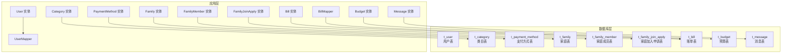
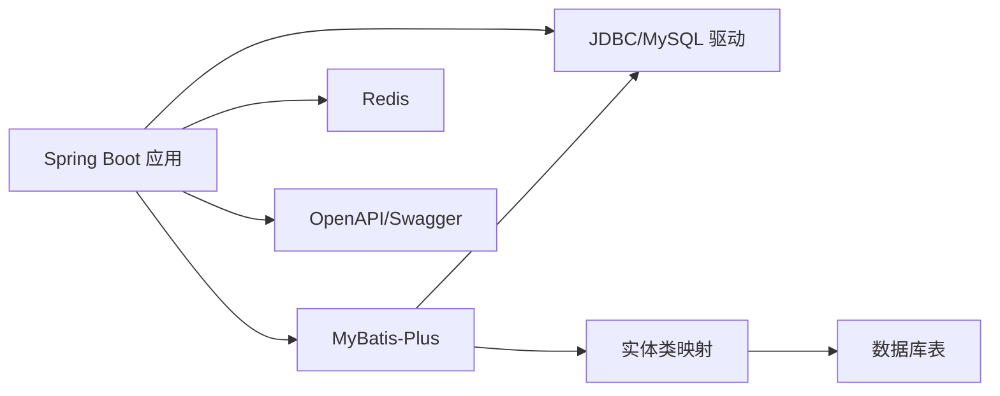

# 表结构设计

<cite>
**本文引用的文件**
- [init.sql](file://chuan-bill-server/init.sql)
- [application.yaml](file://chuan-bill-server/src/main/resources/application.yaml)
- [User.java](file://chuan-bill-server/src/main/java/com/samoy/chuanbillserver/entity/User.java)
- [Category.java](file://chuan-bill-server/src/main/java/com/samoy/chuanbillserver/entity/Category.java)
- [PaymentMethod.java](file://chuan-bill-server/src/main/java/com/samoy/chuanbillserver/entity/PaymentMethod.java)
- [Family.java](file://chuan-bill-server/src/main/java/com/samoy/chuanbillserver/entity/Family.java)
- [FamilyMember.java](file://chuan-bill-server/src/main/java/com/samoy/chuanbillserver/entity/FamilyMember.java)
- [FamilyJoinApply.java](file://chuan-bill-server/src/main/java/com/samoy/chuanbillserver/entity/FamilyJoinApply.java)
- [Bill.java](file://chuan-bill-server/src/main/java/com/samoy/chuanbillserver/entity/Bill.java)
- [Budget.java](file://chuan-bill-server/src/main/java/com/samoy/chuanbillserver/entity/Budget.java)
- [Message.java](file://chuan-bill-server/src/main/java/com/samoy/chuanbillserver/entity/Message.java)
- [UserMapper.java](file://chuan-bill-server/src/main/java/com/samoy/chuanbillserver/dao/UserMapper.java)
- [BillMapper.java](file://chuan-bill-server/src/main/java/com/samoy/chuanbillserver/dao/BillMapper.java)
- [pom.xml](file://chuan-bill-server/pom.xml)
</cite>

## 目录
1. [简介](#简介)
2. [项目结构](#项目结构)
3. [核心组件](#核心组件)
4. [架构总览](#架构总览)
5. [详细组件分析](#详细组件分析)
6. [依赖分析](#依赖分析)
7. [性能考虑](#性能考虑)
8. [故障排查指南](#故障排查指南)
9. [结论](#结论)
10. [附录](#附录)

## 简介
本文件面向“小川记账”系统的数据库表结构设计，基于仓库中的初始化脚本与实体类映射，系统化梳理各表字段定义、数据类型、长度限制、默认值、主键与唯一约束、索引策略、业务语义、枚举值与状态管理、分区分表建议、字符集与存储引擎、表结构演进与兼容性、数据完整性与约束冲突处理、系统预设数据插入策略等。目标是帮助开发者与运维人员快速理解并安全地维护该数据库。

## 项目结构
- 数据库初始化脚本位于服务端工程中，定义了完整的建表与索引、唯一约束以及系统预设数据插入。
- 实体类通过 MyBatis-Plus 注解映射到对应表，字段名与注释与建表脚本保持一致。
- 应用配置文件声明了逻辑删除字段、MyBatis-Plus 全局配置等，影响查询与软删除行为。
- Maven 依赖包含 MyBatis-Plus、MySQL 驱动、Redis、OpenAPI 文档等，支撑表结构与业务实现。



图表来源
- [init.sql:15-326](file://chuan-bill-server/init.sql#L15-L326)
- [User.java:23-93](file://chuan-bill-server/src/main/java/com/samoy/chuanbillserver/entity/User.java#L23-L93)
- [Category.java:23-86](file://chuan-bill-server/src/main/java/com/samoy/chuanbillserver/entity/Category.java#L23-L86)
- [PaymentMethod.java:23-79](file://chuan-bill-server/src/main/java/com/samoy/chuanbillserver/entity/PaymentMethod.java#L23-L79)
- [Family.java:23-79](file://chuan-bill-server/src/main/java/com/samoy/chuanbillserver/entity/Family.java#L23-L79)
- [FamilyMember.java:23-79](file://chuan-bill-server/src/main/java/com/samoy/chuanbillserver/entity/FamilyMember.java#L23-L79)
- [FamilyJoinApply.java:23-85](file://chuan-bill-server/src/main/java/com/samoy/chuanbillserver/entity/FamilyJoinApply.java#L23-L85)
- [Bill.java:24-111](file://chuan-bill-server/src/main/java/com/samoy/chuanbillserver/entity/Bill.java#L24-L111)
- [Budget.java:25-81](file://chuan-bill-server/src/main/java/com/samoy/chuanbillserver/entity/Budget.java#L25-L81)
- [Message.java:23-91](file://chuan-bill-server/src/main/java/com/samoy/chuanbillserver/entity/Message.java#L23-L91)
- [UserMapper.java:14-14](file://chuan-bill-server/src/main/java/com/samoy/chuanbillserver/dao/UserMapper.java#L14-L14)
- [BillMapper.java:14-14](file://chuan-bill-server/src/main/java/com/samoy/chuanbillserver/dao/BillMapper.java#L14-L14)

章节来源
- [init.sql:1-326](file://chuan-bill-server/init.sql#L1-L326)
- [application.yaml:32-39](file://chuan-bill-server/src/main/resources/application.yaml#L32-L39)

## 核心组件
- 数据库层：包含用户、类目、支付方式、家庭、家庭成员、家庭加入申请、账单、预算、消息等九张核心表。
- 实体层：每个表均对应一个实体类，采用 MyBatis-Plus 注解映射，字段名与注释与建表脚本一致。
- 配置层：应用配置文件开启逻辑删除字段、统一时间戳字段行为，影响查询与软删除。
- 运行依赖：MyBatis-Plus、MySQL 驱动、Redis、OpenAPI 文档等。

章节来源
- [init.sql:15-326](file://chuan-bill-server/init.sql#L15-L326)
- [User.java:23-93](file://chuan-bill-server/src/main/java/com/samoy/chuanbillserver/entity/User.java#L23-L93)
- [application.yaml:32-39](file://chuan-bill-server/src/main/resources/application.yaml#L32-L39)
- [pom.xml:80-107](file://chuan-bill-server/pom.xml#L80-L107)

## 架构总览
下图展示表之间的关系与关键外键约束（基于建表脚本中的字段与注释推断）：

```mermaid
erDiagram
t_user ||--o{ t_family_member : "拥有"
t_family ||--o{ t_family_member : "包含"
t_family ||--o{ t_family_join_apply : "接收申请"
t_user ||--o{ t_family_join_apply : "处理申请"
t_user ||--o{ t_bill : "产生"
t_family ||--o{ t_bill : "共享"
t_category ||--o{ t_bill : "归属"
t_payment_method ||--o{ t_bill : "使用"
t_user ||--o{ t_budget : "设定"
t_family ||--o{ t_budget : "共享"
t_user ||--o{ t_message : "接收"
t_user {
varchar id PK
varchar phone UK
tinyint status
datetime create_time
}
t_category {
varchar id PK
varchar name
varchar type
int sort_order
varchar user_id
}
t_payment_method {
varchar id PK
varchar name
int sort_order
varchar user_id
}
t_family {
varchar id PK
varchar owner_id
varchar invite_code UK
}
t_family_member {
varchar id PK
varchar family_id
varchar user_id
tinyint is_owner
unique(family_id,user_id)
}
t_family_join_apply {
varchar id PK
varchar family_id
varchar user_id
tinyint status
datetime create_time
}
t_bill {
varchar id PK
varchar user_id
varchar family_id
varchar category_id
varchar payment_method_id
varchar type
datetime time
datetime create_time
unique(user_id,time)
unique(family_id,time)
}
t_budget {
varchar id PK
varchar user_id
varchar family_id
date month
unique(user_id,month)
unique(family_id,month)
}
t_message {
varchar id PK
varchar user_id
varchar type
tinyint status
datetime create_time
unique(user_id,status)
}
```

图表来源
- [init.sql:15-326](file://chuan-bill-server/init.sql#L15-L326)

## 详细组件分析

### 用户表 t_user
- 主键设计：VARCHAR(64)，采用业务 UUID 主键，便于分布式环境下的全局唯一性与跨系统引用。
- 唯一约束：手机号 phone 唯一索引，确保账号唯一性。
- 索引策略：按 status、create_time 建立普通索引，支持状态筛选与按创建时间排序。
- 字段与类型：手机号、昵称、头像、性别、状态、最后登录时间、创建/更新时间、逻辑删除。
- 默认值：状态默认启用；时间字段默认 CURRENT_TIMESTAMP；逻辑删除默认 0。
- 业务含义：承载用户身份、认证与基础资料；配合手机号唯一约束保证注册幂等。
- 枚举与状态：性别取值 0/1/2；状态取值 0/1；逻辑删除 0/1。
- 约束冲突：手机号唯一冲突需在上层处理提示；软删除字段由 MyBatis-Plus 统一拦截。

章节来源
- [init.sql:15-31](file://chuan-bill-server/init.sql#L15-L31)
- [User.java:23-93](file://chuan-bill-server/src/main/java/com/samoy/chuanbillserver/entity/User.java#L23-L93)
- [application.yaml:32-39](file://chuan-bill-server/src/main/resources/application.yaml#L32-L39)

### 类目表 t_category
- 主键设计：VARCHAR(64)，UUID 主键。
- 唯一约束：无显式唯一索引，但系统预设类目通过 type 与 sort_order 组合保证业务唯一性。
- 索引策略：按 type、user_id、sort_order 建立普通索引，支持按类型与用户过滤、排序。
- 字段与类型：名称、图标、类型（收入/支出）、排序、是否默认、所属用户、时间戳、逻辑删除。
- 默认值：排序默认 0；是否默认默认 1；逻辑删除默认 0。
- 业务含义：记录收支类目，支持系统预设与用户自定义两类；排序控制展示顺序。
- 枚举与状态：类型取值 income/expense；是否默认 0/1；逻辑删除 0/1。

章节来源
- [init.sql:36-51](file://chuan-bill-server/init.sql#L36-L51)
- [Category.java:23-86](file://chuan-bill-server/src/main/java/com/samoy/chuanbillserver/entity/Category.java#L23-L86)

### 支付方式表 t_payment_method
- 主键设计：VARCHAR(64)，UUID 主键。
- 唯一约束：无显式唯一索引，系统预设支付方式通过 name 唯一性保障。
- 索引策略：按 user_id、sort_order 建立普通索引，支持按用户过滤与排序。
- 字段与类型：名称、图标、排序、是否默认、所属用户、时间戳、逻辑删除。
- 默认值：排序默认 0；是否默认默认 0；逻辑删除默认 0。
- 业务含义：记录支付渠道，支持系统预设与用户自定义；排序控制展示顺序。
- 枚举与状态：是否默认 0/1；逻辑删除 0/1。

章节来源
- [init.sql:56-69](file://chuan-bill-server/init.sql#L56-L69)
- [PaymentMethod.java:23-79](file://chuan-bill-server/src/main/java/com/samoy/chuanbillserver/entity/PaymentMethod.java#L23-L79)

### 家庭表 t_family
- 主键设计：VARCHAR(64)，UUID 主键。
- 唯一约束：邀请码 invite_code 唯一索引，用于家庭加入入口。
- 索引策略：按 owner_id 建立普通索引，支持按户主查询。
- 字段与类型：名称、头像、户主、邀请码、描述、时间戳、逻辑删除。
- 默认值：逻辑删除默认 0。
- 业务含义：记录家庭组织信息，邀请码作为外部成员加入的关键入口。
- 枚举与状态：逻辑删除 0/1。

章节来源
- [init.sql:74-87](file://chuan-bill-server/init.sql#L74-L87)
- [Family.java:23-79](file://chuan-bill-server/src/main/java/com/samoy/chuanbillserver/entity/Family.java#L23-L79)

### 家庭成员表 t_family_member
- 主键设计：VARCHAR(64)，UUID 主键。
- 唯一约束：(family_id, user_id) 唯一索引，防止重复加入。
- 索引策略：按 family_id、user_id、is_owner 建立普通索引，支持按家庭/用户/户主查询。
- 字段与类型：家庭 ID、用户 ID、家庭昵称、是否户主、加入时间、时间戳、逻辑删除。
- 默认值：是否户主默认 0；逻辑删除默认 0。
- 业务含义：记录成员与家庭的关系，支持户主权限与成员昵称。
- 枚举与状态：是否户主 0/1；逻辑删除 0/1。

章节来源
- [init.sql:92-107](file://chuan-bill-server/init.sql#L92-L107)
- [FamilyMember.java:23-79](file://chuan-bill-server/src/main/java/com/samoy/chuanbillserver/entity/FamilyMember.java#L23-L79)

### 家庭加入申请表 t_family_join_apply
- 主键设计：VARCHAR(64)，UUID 主键。
- 唯一约束：无显式唯一索引。
- 索引策略：按 family_id、user_id、status、create_time 建立普通索引，支持按家庭、申请人、状态、时间查询。
- 字段与类型：家庭 ID、申请人、备注、状态（待处理/同意/拒绝）、处理人、处理时间、时间戳、逻辑删除。
- 默认值：状态默认 0；逻辑删除默认 0。
- 业务含义：记录成员加入家庭的审批流程，支持异步处理与审计。
- 枚举与状态：状态 0/1/2；逻辑删除 0/1。

章节来源
- [init.sql:112-128](file://chuan-bill-server/init.sql#L112-L128)
- [FamilyJoinApply.java:23-85](file://chuan-bill-server/src/main/java/com/samoy/chuanbillserver/entity/FamilyJoinApply.java#L23-L85)

### 账单表 t_bill
- 主键设计：VARCHAR(64)，UUID 主键。
- 唯一约束：(user_id, time)、(family_id, time) 复合唯一索引，避免同一用户或家庭在同一时刻重复记账。
- 索引策略：按 user_id、family_id、category_id、payment_method_id、type、time、create_time 建立普通索引，并保留复合索引 user_id+time 与 family_id+time，满足高频查询场景。
- 字段与类型：用户 ID、家庭 ID、名称、类目 ID、支付方式 ID、类型（收入/支出）、金额、时间、备注、来源、时间戳、逻辑删除。
- 默认值：类型默认 income/expense；金额精度 DECIMAL(12,2)；时间默认 CURRENT_TIMESTAMP；逻辑删除默认 0。
- 业务含义：记录每一笔收支流水，支持个人与家庭共享两种模式。
- 枚举与状态：类型 income/expense；来源 manual/ocr/voice/import；逻辑删除 0/1。
- 复杂度与性能：复合唯一索引与多维索引组合，适合按用户/家庭维度的时间序列查询与统计。

章节来源
- [init.sql:133-158](file://chuan-bill-server/init.sql#L133-L158)
- [Bill.java:24-111](file://chuan-bill-server/src/main/java/com/samoy/chuanbillserver/entity/Bill.java#L24-L111)

### 预算表 t_budget
- 主键设计：VARCHAR(64)，UUID 主键。
- 唯一约束：(user_id, month)、(family_id, month) 复合唯一索引，确保每个用户/家庭每月仅有一条预算记录。
- 索引策略：按 user_id、family_id 建立普通索引，支持按用户/家庭查询。
- 字段与类型：用户 ID、家庭 ID、月份（当月第一天）、预算金额、已使用金额、时间戳、逻辑删除。
- 默认值：金额精度 DECIMAL(12,2)；逻辑删除默认 0。
- 业务含义：记录用户/家庭的月度预算与使用情况，支持个人与家庭共享。
- 枚举与状态：逻辑删除 0/1。

章节来源
- [init.sql:163-178](file://chuan-bill-server/init.sql#L163-L178)
- [Budget.java:25-81](file://chuan-bill-server/src/main/java/com/samoy/chuanbillserver/entity/Budget.java#L25-L81)

### 消息表 t_message
- 主键设计：VARCHAR(64)，UUID 主键。
- 唯一约束：无显式唯一索引。
- 索引策略：按 user_id、type、status、create_time 建立普通索引，并保留 (user_id, status) 复合索引，支持按用户与状态快速检索。
- 字段与类型：用户 ID、标题、内容、类型（系统/家庭/账单/预算）、状态（未读/已读）、相关 ID 与类型、时间戳、逻辑删除。
- 默认值：状态默认 0；逻辑删除默认 0。
- 业务含义：记录系统通知与业务相关消息，支持按用户与状态聚合查询。
- 枚举与状态：类型 system/family/bill/budget；状态 0/1；逻辑删除 0/1。

章节来源
- [init.sql:183-201](file://chuan-bill-server/init.sql#L183-L201)
- [Message.java:23-91](file://chuan-bill-server/src/main/java/com/samoy/chuanbillserver/entity/Message.java#L23-L91)

### 系统预设数据
- 预设类目：系统内置多类收支类目，覆盖常见场景，通过 is_default 标识系统默认项。
- 预设支付方式：系统内置常用支付渠道，通过 is_default 标识系统默认项。
- 插入策略：初始化脚本一次性插入，确保新用户首次使用即具备完整可用的分类与支付方式。

章节来源
- [init.sql:204-326](file://chuan-bill-server/init.sql#L204-L326)

## 依赖分析
- MyBatis-Plus：通过注解与 Mapper 接口实现 ORM 映射，统一逻辑删除字段 deleted 的处理。
- MySQL 驱动：连接数据库，执行建表与 DML。
- Redis：作为缓存与会话存储，提升高并发场景下的响应速度。
- OpenAPI/Swagger：生成接口文档，辅助前后端协作与测试。



图表来源
- [pom.xml:80-141](file://chuan-bill-server/pom.xml#L80-L141)
- [application.yaml:1-51](file://chuan-bill-server/src/main/resources/application.yaml#L1-L51)

章节来源
- [pom.xml:51-141](file://chuan-bill-server/pom.xml#L51-L141)
- [application.yaml:1-51](file://chuan-bill-server/src/main/resources/application.yaml#L1-L51)

## 性能考虑
- 索引设计原则
  - 单列索引：对高频过滤字段建立，如 t_user.status、t_bill.user_id、t_bill.family_id、t_message.user_id 等。
  - 复合索引：针对多条件查询与唯一性需求，如 t_bill(user_id,time)、t_bill(family_id,time)、t_family_member(family_id,user_id)、t_budget(user_id,month)、t_budget(family_id,month)、t_message(user_id,status)。
  - 前缀索引：当前表结构未见前缀索引使用，若未来存在超长文本字段可考虑前缀索引以节省空间。
- 存储引擎与字符集
  - 存储引擎：InnoDB，支持事务、外键与行级锁，适合高并发写入与强一致性。
  - 字符集：utf8mb4，支持四字节表情与国际化字符。
- 分区策略
  - 当前表未启用分区；对于 t_bill、t_message 等按时间维度增长的表，可考虑按月/季进行水平分区，降低冷数据扫描成本。
- 查询优化
  - 利用复合索引覆盖查询，减少回表。
  - 对于范围查询（时间），优先使用索引列，避免函数包裹导致索引失效。
  - 使用逻辑删除字段（deleted）进行软删除，避免物理删除带来的索引重建成本。

章节来源
- [init.sql:15-326](file://chuan-bill-server/init.sql#L15-L326)
- [application.yaml:32-39](file://chuan-bill-server/src/main/resources/application.yaml#L32-L39)

## 故障排查指南
- 逻辑删除冲突
  - 现象：查询结果异常或统计不准确。
  - 处理：确认 MyBatis-Plus 全局配置的逻辑删除字段 deleted、逻辑值与非删除值设置正确。
- 唯一约束冲突
  - 现象：插入失败，报唯一键冲突。
  - 处理：检查复合唯一索引（如 t_bill(user_id,time)、t_family_member(family_id,user_id)、t_budget(user_id,month) 等）是否被违反；在上层增加幂等判断或提示用户调整时间/成员/预算月份。
- 时间字段默认值问题
  - 现象：时间字段未按预期更新。
  - 处理：确认建表脚本中 DEFAULT CURRENT_TIMESTAMP 与 ON UPDATE CURRENT_TIMESTAMP 的使用是否符合期望；在应用侧也应确保时间字段赋值正确。
- 索引失效
  - 现象：慢查询增多。
  - 处理：检查 WHERE/HAVING/ORDER BY 中是否对索引列使用函数或隐式转换；优先使用索引列进行过滤与排序。

章节来源
- [application.yaml:32-39](file://chuan-bill-server/src/main/resources/application.yaml#L32-L39)
- [init.sql:133-158](file://chuan-bill-server/init.sql#L133-L158)

## 结论
本表结构设计围绕“个人记账+家庭共享”的核心业务，采用 UUID 主键、明确的逻辑删除策略、完善的索引与唯一约束，兼顾查询效率与数据一致性。系统预设数据确保新用户开箱即用。建议后续结合业务增长逐步引入分区与更细粒度的索引优化，持续监控查询性能与索引使用情况。

## 附录

### 字段命名规范与枚举值设计
- 字段命名：采用下划线分隔，清晰表达业务含义（如 user_id、family_id、create_time）。
- 枚举值：通过固定集合（如 type/income、status/0/1）与注释明确取值范围，避免魔法值。
- 状态字段：统一使用 0/1 或 0/1/2 的小整型，便于索引与比较。

章节来源
- [init.sql:15-326](file://chuan-bill-server/init.sql#L15-L326)
- [Bill.java:68-93](file://chuan-bill-server/src/main/java/com/samoy/chuanbillserver/entity/Bill.java#L68-L93)
- [Message.java:55-62](file://chuan-bill-server/src/main/java/com/samoy/chuanbillserver/entity/Message.java#L55-L62)

### 表结构演进方案与兼容性
- 新增字段：建议使用默认值与非空约束谨慎设计，避免全量回填；必要时分阶段上线。
- 删除字段：优先通过逻辑删除与迁移策略替代物理删除，确保历史数据可追溯。
- 索引变更：新增索引前评估写入性能，必要时在低峰期执行；删除冗余索引降低写放大。
- 版本化管理：通过初始化脚本与版本号管理，确保不同环境的一致性。

章节来源
- [init.sql:1-326](file://chuan-bill-server/init.sql#L1-L326)

### 数据完整性检查与约束冲突处理
- 唯一性检查：在插入前进行幂等校验，避免重复提交导致唯一约束冲突。
- 外键一致性：当前脚本未显式声明外键，建议在应用层或数据库层补充外键约束，确保 referential integrity。
- 事务边界：对涉及多表更新的操作使用事务，保证原子性与一致性。

章节来源
- [init.sql:133-158](file://chuan-bill-server/init.sql#L133-L158)

### 系统预设数据插入策略
- 设计原则：覆盖常见收支类别与支付方式，提供默认排序与标识，便于用户直接使用。
- 插入时机：初始化脚本一次性插入，确保部署即可用；后续可通过管理后台进行扩展与调整。

章节来源
- [init.sql:204-326](file://chuan-bill-server/init.sql#L204-L326)