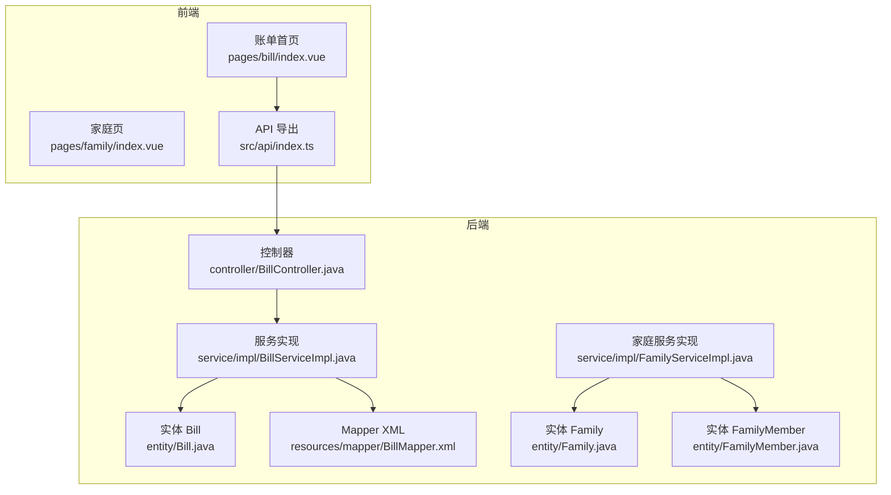
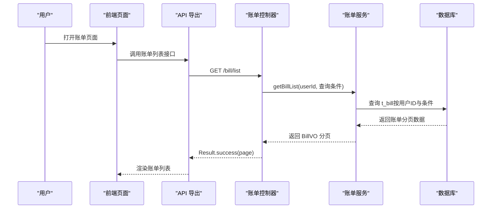
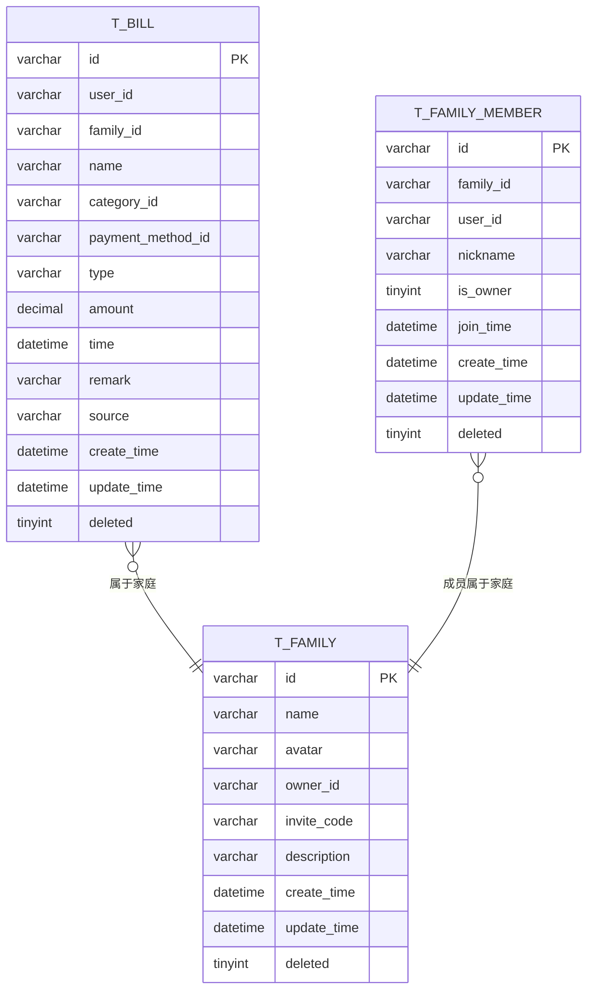
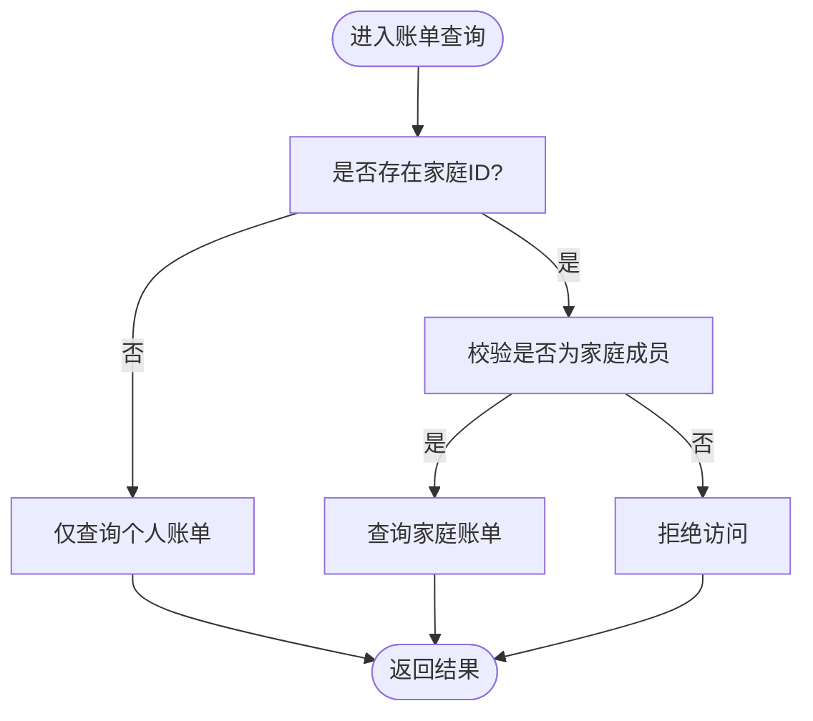
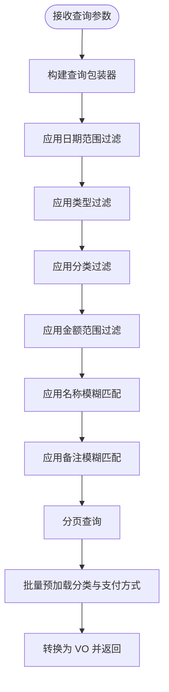
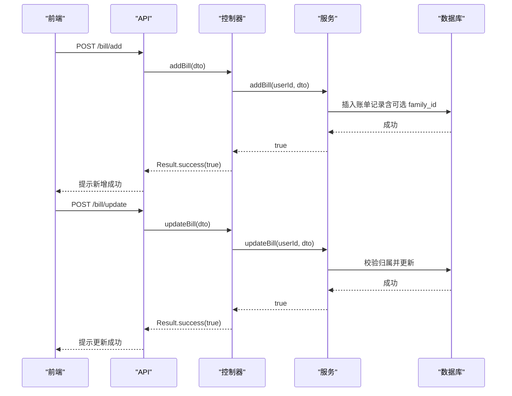
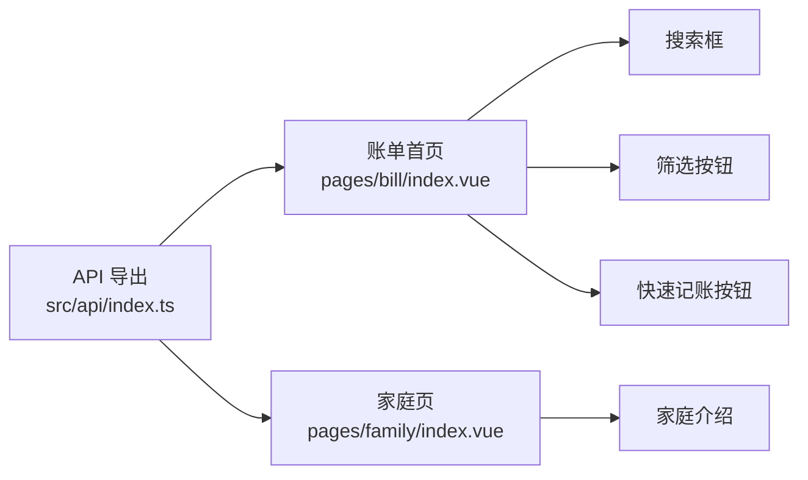
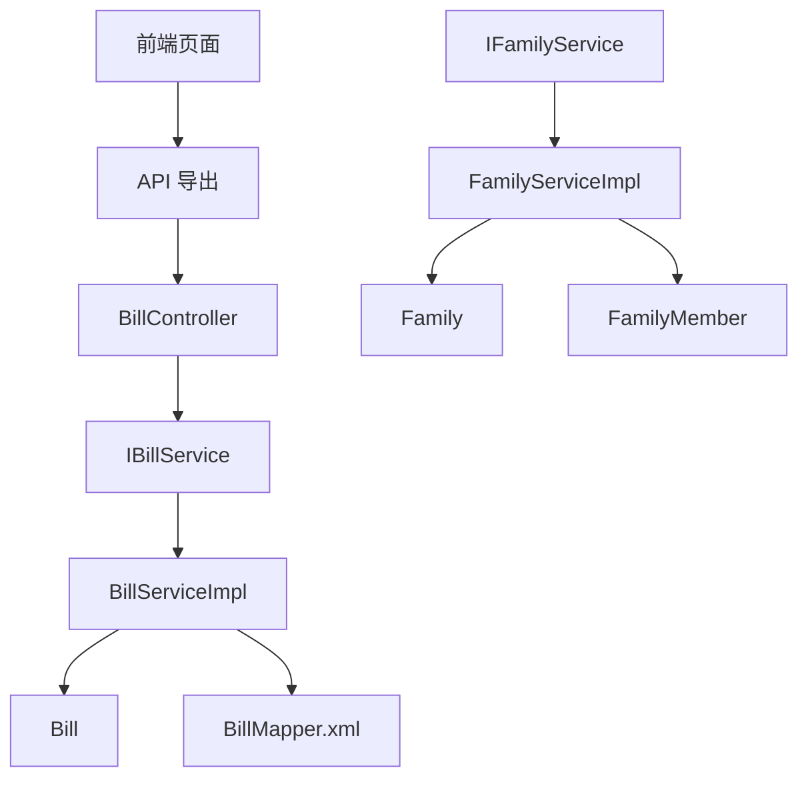

# 共享账单

<cite>
**本文引用的文件**
- [Bill.java](file://chuan-bill-server/src/main/java/com/samoy/chuanbillserver/entity/Bill.java)
- [BillServiceImpl.java](file://chuan-bill-server/src/main/java/com/samoy/chuanbillserver/service/impl/BillServiceImpl.java)
- [BillController.java](file://chuan-bill-server/src/main/java/com/samoy/chuanbillserver/controller/BillController.java)
- [IBillService.java](file://chuan-bill-server/src/main/java/com/samoy/chuanbillserver/service/IBillService.java)
- [BillListDTO.java](file://chuan-bill-server/src/main/java/com/samoy/chuanbillserver/dto/BillListDTO.java)
- [BillVO.java](file://chuan-bill-server/src/main/java/com/samoy/chuanbillserver/vo/BillVO.java)
- [Family.java](file://chuan-bill-server/src/main/java/com/samoy/chuanbillserver/entity/Family.java)
- [FamilyMember.java](file://chuan-bill-server/src/main/java/com/samoy/chuanbillserver/entity/FamilyMember.java)
- [FamilyServiceImpl.java](file://chuan-bill-server/src/main/java/com/samoy/chuanbillserver/service/impl/FamilyServiceImpl.java)
- [IFamilyService.java](file://chuan-bill-server/src/main/java/com/samoy/chuanbillserver/service/IFamilyService.java)
- [BillMapper.xml](file://chuan-bill-server/src/main/resources/mapper/BillMapper.xml)
- [init.sql](file://chuan-bill-server/init.sql)
- [index.vue（账单首页）](file://chuan-bill-app/src/pages/bill/index.vue)
- [index.vue（家庭页）](file://chuan-bill-app/src/pages/family/index.vue)
- [index.ts（API 导出）](file://chuan-bill-app/src/api/index.ts)
</cite>

## 目录
1. [简介](#简介)
2. [项目结构](#项目结构)
3. [核心组件](#核心组件)
4. [架构总览](#架构总览)
5. [详细组件分析](#详细组件分析)
6. [依赖分析](#依赖分析)
7. [性能考虑](#性能考虑)
8. [故障排查指南](#故障排查指南)
9. [结论](#结论)
10. [附录](#附录)

## 简介
本文件围绕“共享账单”能力进行系统化说明，覆盖以下关键主题：
- 共享账单的数据模型与字段扩展（家庭 ID 关联、来源标记等）
- 权限控制与数据隔离机制（个人账单与家庭账单的边界）
- 账单查询与过滤逻辑（按成员、分类、时间段等维度）
- 后端服务的权限验证、数据聚合与性能优化策略
- 前端组件与交互（账单列表、筛选、快速记账等）
- API 接口定义与调用要点

## 项目结构
后端采用 Spring Boot + MyBatis-Plus 架构；前端基于 Vue 3 + UniApp（小程序端）。共享账单涉及的核心模块如下：
- 实体层：账单、家庭、家庭成员
- 服务层：账单服务、家庭服务
- 控制器层：账单控制器
- 数据访问层：Mapper XML（当前为空，逻辑集中在 Service）
- 前端页面：账单首页、家庭页、API 导出入口

图表来源
- [BillController.java:23-90](file://chuan-bill-server/src/main/java/com/samoy/chuanbillserver/controller/BillController.java#L23-L90)
- [BillServiceImpl.java:41-244](file://chuan-bill-server/src/main/java/com/samoy/chuanbillserver/service/impl/BillServiceImpl.java#L41-L244)
- [FamilyServiceImpl.java:17-18](file://chuan-bill-server/src/main/java/com/samoy/chuanbillserver/service/impl/FamilyServiceImpl.java#L17-L18)
- [Bill.java:24-112](file://chuan-bill-server/src/main/java/com/samoy/chuanbillserver/entity/Bill.java#L24-L112)
- [Family.java:23-81](file://chuan-bill-server/src/main/java/com/samoy/chuanbillserver/entity/Family.java#L23-L81)
- [FamilyMember.java:23-81](file://chuan-bill-server/src/main/java/com/samoy/chuanbillserver/entity/FamilyMember.java#L23-L81)
- [BillMapper.xml:3-5](file://chuan-bill-server/src/main/resources/mapper/BillMapper.xml#L3-L5)
- [index.vue（账单首页）:1-54](file://chuan-bill-app/src/pages/bill/index.vue#L1-L54)
- [index.vue（家庭页）:1-23](file://chuan-bill-app/src/pages/family/index.vue#L1-L23)
- [index.ts（API 导出）:1-19](file://chuan-bill-app/src/api/index.ts#L1-L19)

章节来源
- [BillController.java:23-90](file://chuan-bill-server/src/main/java/com/samoy/chuanbillserver/controller/BillController.java#L23-L90)
- [BillServiceImpl.java:41-244](file://chuan-bill-server/src/main/java/com/samoy/chuanbillserver/service/impl/BillServiceImpl.java#L41-L244)
- [FamilyServiceImpl.java:17-18](file://chuan-bill-server/src/main/java/com/samoy/chuanbillserver/service/impl/FamilyServiceImpl.java#L17-L18)
- [Bill.java:24-112](file://chuan-bill-server/src/main/java/com/samoy/chuanbillserver/entity/Bill.java#L24-L112)
- [Family.java:23-81](file://chuan-bill-server/src/main/java/com/samoy/chuanbillserver/entity/Family.java#L23-L81)
- [FamilyMember.java:23-81](file://chuan-bill-server/src/main/java/com/samoy/chuanbillserver/entity/FamilyMember.java#L23-L81)
- [BillMapper.xml:3-5](file://chuan-bill-server/src/main/resources/mapper/BillMapper.xml#L3-L5)
- [index.vue（账单首页）:1-54](file://chuan-bill-app/src/pages/bill/index.vue#L1-L54)
- [index.vue（家庭页）:1-23](file://chuan-bill-app/src/pages/family/index.vue#L1-L23)
- [index.ts（API 导出）:1-19](file://chuan-bill-app/src/api/index.ts#L1-L19)

## 核心组件
- 账单实体扩展：新增家庭 ID 字段，用于标识共享账单归属；同时保留用户 ID 以区分个人账单与共享账单。
- 账单服务：提供列表查询、详情查询、新增、更新、删除等能力，并内置权限校验（仅允许操作本人账单）。
- 家庭实体：包含家庭基本信息与户主标识，为后续扩展“家庭级权限”奠定基础。
- 家庭成员实体：记录成员与家庭的关联、是否户主等信息。

章节来源
- [Bill.java:42-45](file://chuan-bill-server/src/main/java/com/samoy/chuanbillserver/entity/Bill.java#L42-L45)
- [BillServiceImpl.java:50-123](file://chuan-bill-server/src/main/java/com/samoy/chuanbillserver/service/impl/BillServiceImpl.java#L50-L123)
- [Family.java:48-50](file://chuan-bill-server/src/main/java/com/samoy/chuanbillserver/entity/Family.java#L48-L50)
- [FamilyMember.java:36-56](file://chuan-bill-server/src/main/java/com/samoy/chuanbillserver/entity/FamilyMember.java#L36-L56)

## 架构总览
共享账单的实现遵循“个人账单优先、家庭账单扩展”的设计原则：
- 新增账单时，若携带家庭 ID，则该账单为共享账单；否则为个人账单。
- 查询账单时，默认仅返回当前用户本人的账单；家庭账单需通过家庭成员关系与权限控制进行访问。
- 后端通过控制器统一鉴权，服务层执行业务逻辑与权限校验，避免跨用户数据泄露。

图表来源
- [BillController.java:37-42](file://chuan-bill-server/src/main/java/com/samoy/chuanbillserver/controller/BillController.java#L37-L42)
- [BillServiceImpl.java:50-88](file://chuan-bill-server/src/main/java/com/samoy/chuanbillserver/service/impl/BillServiceImpl.java#L50-L88)
- [index.vue（账单首页）:1-54](file://chuan-bill-app/src/pages/bill/index.vue#L1-L54)
- [index.ts（API 导出）:1-19](file://chuan-bill-app/src/api/index.ts#L1-L19)

## 详细组件分析

### 数据模型与字段扩展
- 账单实体新增家庭 ID 字段，用于标识共享账单归属；同时保留用户 ID 与时间索引，保证查询效率。
- 家庭与家庭成员实体提供家庭维度的成员关系与户主标识，为未来扩展“家庭级权限”提供支撑。

图表来源
- [Bill.java:24-112](file://chuan-bill-server/src/main/java/com/samoy/chuanbillserver/entity/Bill.java#L24-L112)
- [Family.java:23-81](file://chuan-bill-server/src/main/java/com/samoy/chuanbillserver/entity/Family.java#L23-L81)
- [FamilyMember.java:23-81](file://chuan-bill-server/src/main/java/com/samoy/chuanbillserver/entity/FamilyMember.java#L23-L81)
- [init.sql:133-158](file://chuan-bill-server/init.sql#L133-L158)
- [init.sql:74-87](file://chuan-bill-server/init.sql#L74-L87)
- [init.sql:92-107](file://chuan-bill-server/init.sql#L92-L107)

章节来源
- [Bill.java:42-45](file://chuan-bill-server/src/main/java/com/samoy/chuanbillserver/entity/Bill.java#L42-L45)
- [Family.java:48-50](file://chuan-bill-server/src/main/java/com/samoy/chuanbillserver/entity/Family.java#L48-L50)
- [FamilyMember.java:54-56](file://chuan-bill-server/src/main/java/com/samoy/chuanbillserver/entity/FamilyMember.java#L54-L56)
- [init.sql:133-158](file://chuan-bill-server/init.sql#L133-L158)
- [init.sql:74-87](file://chuan-bill-server/init.sql#L74-L87)
- [init.sql:92-107](file://chuan-bill-server/init.sql#L92-L107)

### 权限控制与数据隔离
- 当前实现中，账单查询默认仅返回当前用户本人的账单；家庭账单的可见性尚未在服务层强制限制。
- 建议在服务层增加“家庭成员校验”：当账单存在家庭 ID 时，仅允许家庭成员查看；户主可对家庭账单进行更广泛的管理操作。
- 当前更新/删除接口已对账单归属进行校验，防止越权修改他人账单。

图表来源
- [BillServiceImpl.java:50-88](file://chuan-bill-server/src/main/java/com/samoy/chuanbillserver/service/impl/BillServiceImpl.java#L50-L88)
- [BillServiceImpl.java:144-173](file://chuan-bill-server/src/main/java/com/samoy/chuanbillserver/service/impl/BillServiceImpl.java#L144-L173)

章节来源
- [BillServiceImpl.java:50-88](file://chuan-bill-server/src/main/java/com/samoy/chuanbillserver/service/impl/BillServiceImpl.java#L50-L88)
- [BillServiceImpl.java:144-173](file://chuan-bill-server/src/main/java/com/samoy/chuanbillserver/service/impl/BillServiceImpl.java#L144-L173)

### 查询与过滤逻辑
- 支持按时间段（起止日期）、账单类型、分类、金额范围、名称/备注模糊匹配、分页参数等条件组合查询。
- 列表查询时，服务层会批量加载分类与支付方式信息，减少 N+1 查询，提升性能。

图表来源
- [BillServiceImpl.java:50-88](file://chuan-bill-server/src/main/java/com/samoy/chuanbillserver/service/impl/BillServiceImpl.java#L50-L88)
- [BillServiceImpl.java:90-122](file://chuan-bill-server/src/main/java/com/samoy/chuanbillserver/service/impl/BillServiceImpl.java#L90-L122)
- [BillListDTO.java:10-41](file://chuan-bill-server/src/main/java/com/samoy/chuanbillserver/dto/BillListDTO.java#L10-L41)

章节来源
- [BillServiceImpl.java:50-123](file://chuan-bill-server/src/main/java/com/samoy/chuanbillserver/service/impl/BillServiceImpl.java#L50-L123)
- [BillListDTO.java:10-41](file://chuan-bill-server/src/main/java/com/samoy/chuanbillserver/dto/BillListDTO.java#L10-L41)

### 新增、更新、删除流程
- 新增：支持传入家庭 ID，从而创建共享账单；否则为个人账单。
- 更新/删除：严格校验账单归属，仅允许当前用户本人操作，防止越权。

图表来源
- [BillController.java:52-72](file://chuan-bill-server/src/main/java/com/samoy/chuanbillserver/controller/BillController.java#L52-L72)
- [BillServiceImpl.java:125-173](file://chuan-bill-server/src/main/java/com/samoy/chuanbillserver/service/impl/BillServiceImpl.java#L125-L173)

章节来源
- [BillController.java:52-72](file://chuan-bill-server/src/main/java/com/samoy/chuanbillserver/controller/BillController.java#L52-L72)
- [BillServiceImpl.java:125-173](file://chuan-bill-server/src/main/java/com/samoy/chuanbillserver/service/impl/BillServiceImpl.java#L125-L173)

### 前端组件与交互
- 账单首页提供搜索与筛选入口，支持下拉刷新与上拉加载，便于浏览账单列表。
- 家庭页作为家庭功能入口，当前展示基础信息，后续可接入家庭账单与成员管理。
- API 导出模块集中管理请求实例与生成的接口对象，便于在页面中统一调用。

图表来源
- [index.vue（账单首页）:21-42](file://chuan-bill-app/src/pages/bill/index.vue#L21-L42)
- [index.vue（家庭页）:11-21](file://chuan-bill-app/src/pages/family/index.vue#L11-L21)
- [index.ts（API 导出）:1-19](file://chuan-bill-app/src/api/index.ts#L1-L19)

章节来源
- [index.vue（账单首页）:1-54](file://chuan-bill-app/src/pages/bill/index.vue#L1-L54)
- [index.vue（家庭页）:1-23](file://chuan-bill-app/src/pages/family/index.vue#L1-L23)
- [index.ts（API 导出）:1-19](file://chuan-bill-app/src/api/index.ts#L1-L19)

### API 接口说明
- 获取账单列表：支持多种筛选条件与分页，返回分页账单数据。
- 获取账单详情：根据 ID 获取账单详情，内置权限校验。
- 新增/更新/删除账单：均需当前用户身份，且更新/删除需校验归属。
- 获取分类与支付方式：按用户维度返回可用选项。

章节来源
- [BillController.java:37-89](file://chuan-bill-server/src/main/java/com/samoy/chuanbillserver/controller/BillController.java#L37-L89)
- [IBillService.java:19-65](file://chuan-bill-server/src/main/java/com/samoy/chuanbillserver/service/IBillService.java#L19-L65)
- [BillVO.java:11-43](file://chuan-bill-server/src/main/java/com/samoy/chuanbillserver/vo/BillVO.java#L11-L43)

## 依赖分析
- 控制器依赖服务接口，服务实现依赖实体与 Mapper XML（当前为空，逻辑集中在 Service）。
- 家庭服务实现依赖家庭与成员实体，为后续扩展家庭级权限提供基础。
- 前端通过 API 导出模块统一调用后端接口，页面组件负责交互与渲染。

图表来源
- [BillController.java:27-35](file://chuan-bill-server/src/main/java/com/samoy/chuanbillserver/controller/BillController.java#L27-L35)
- [IBillService.java:19-65](file://chuan-bill-server/src/main/java/com/samoy/chuanbillserver/service/IBillService.java#L19-L65)
- [BillServiceImpl.java:41-50](file://chuan-bill-server/src/main/java/com/samoy/chuanbillserver/service/impl/BillServiceImpl.java#L41-L50)
- [BillMapper.xml:3-5](file://chuan-bill-server/src/main/resources/mapper/BillMapper.xml#L3-L5)
- [IFamilyService.java:14-14](file://chuan-bill-server/src/main/java/com/samoy/chuanbillserver/service/IFamilyService.java#L14-L14)
- [FamilyServiceImpl.java:17-18](file://chuan-bill-server/src/main/java/com/samoy/chuanbillserver/service/impl/FamilyServiceImpl.java#L17-L18)
- [Family.java:23-81](file://chuan-bill-server/src/main/java/com/samoy/chuanbillserver/entity/Family.java#L23-L81)
- [FamilyMember.java:23-81](file://chuan-bill-server/src/main/java/com/samoy/chuanbillserver/entity/FamilyMember.java#L23-L81)
- [index.ts（API 导出）:1-19](file://chuan-bill-app/src/api/index.ts#L1-L19)

章节来源
- [BillController.java:27-35](file://chuan-bill-server/src/main/java/com/samoy/chuanbillserver/controller/BillController.java#L27-L35)
- [IBillService.java:19-65](file://chuan-bill-server/src/main/java/com/samoy/chuanbillserver/service/IBillService.java#L19-L65)
- [BillServiceImpl.java:41-50](file://chuan-bill-server/src/main/java/com/samoy/chuanbillserver/service/impl/BillServiceImpl.java#L41-L50)
- [FamilyServiceImpl.java:17-18](file://chuan-bill-server/src/main/java/com/samoy/chuanbillserver/service/impl/FamilyServiceImpl.java#L17-L18)
- [Family.java:23-81](file://chuan-bill-server/src/main/java/com/samoy/chuanbillserver/entity/Family.java#L23-L81)
- [FamilyMember.java:23-81](file://chuan-bill-server/src/main/java/com/samoy/chuanbillserver/entity/FamilyMember.java#L23-L81)
- [index.ts（API 导出）:1-19](file://chuan-bill-app/src/api/index.ts#L1-L19)

## 性能考虑
- 列表查询采用分页与批量预加载分类/支付方式，避免 N+1 查询，提升响应速度。
- 数据库层面为账单表建立了多处索引（用户、家庭、时间等），有利于高效查询与排序。
- 建议后续在家庭账单查询时，结合家庭成员表进行权限过滤，避免全量扫描。

章节来源
- [BillServiceImpl.java:90-122](file://chuan-bill-server/src/main/java/com/samoy/chuanbillserver/service/impl/BillServiceImpl.java#L90-L122)
- [init.sql:149-157](file://chuan-bill-server/init.sql#L149-L157)

## 故障排查指南
- 账单不存在：新增/更新/删除前先校验账单是否存在，避免空指针。
- 权限不足：更新/删除接口会校验账单归属，若失败需检查登录态与用户 ID。
- 查询无结果：确认查询条件是否正确（日期格式、类型值域、金额范围等）。

章节来源
- [BillServiceImpl.java:144-173](file://chuan-bill-server/src/main/java/com/samoy/chuanbillserver/service/impl/BillServiceImpl.java#L144-L173)
- [BillListDTO.java:11-41](file://chuan-bill-server/src/main/java/com/samoy/chuanbillserver/dto/BillListDTO.java#L11-L41)

## 结论
当前实现已具备“共享账单”的基础能力：通过家庭 ID 标识共享账单，服务层对个人账单进行了严格的归属校验。建议下一步增强家庭级权限控制（仅家庭成员可见共享账单），并在查询时结合家庭成员关系进行过滤，进一步完善数据隔离与访问控制。

## 附录
- 数据库初始化脚本包含账单、家庭、成员等核心表结构与索引，为共享账单提供持久化基础。
- 前端页面与 API 导出模块为后续扩展家庭账单列表、成员筛选等功能提供良好基础。

章节来源
- [init.sql:133-158](file://chuan-bill-server/init.sql#L133-L158)
- [init.sql:74-87](file://chuan-bill-server/init.sql#L74-L87)
- [init.sql:92-107](file://chuan-bill-server/init.sql#L92-L107)
- [index.ts（API 导出）:1-19](file://chuan-bill-app/src/api/index.ts#L1-L19)