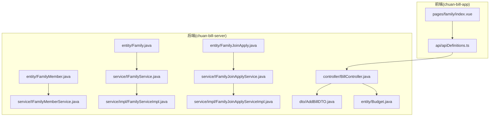
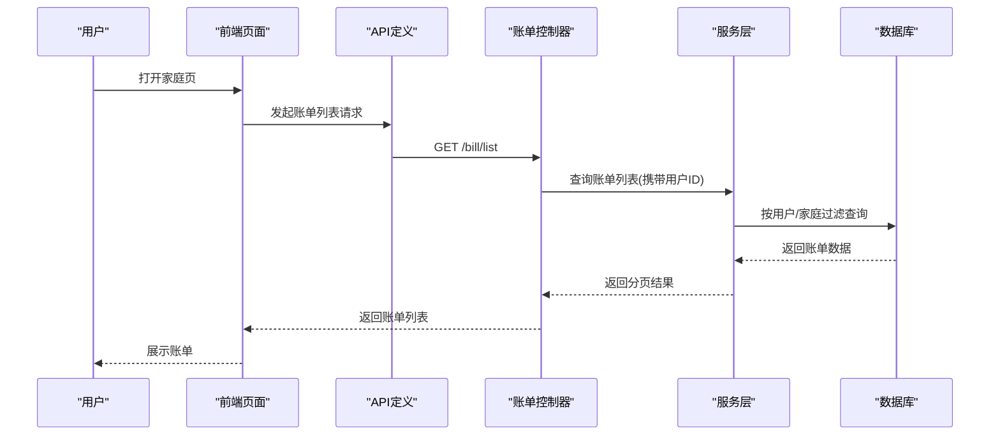
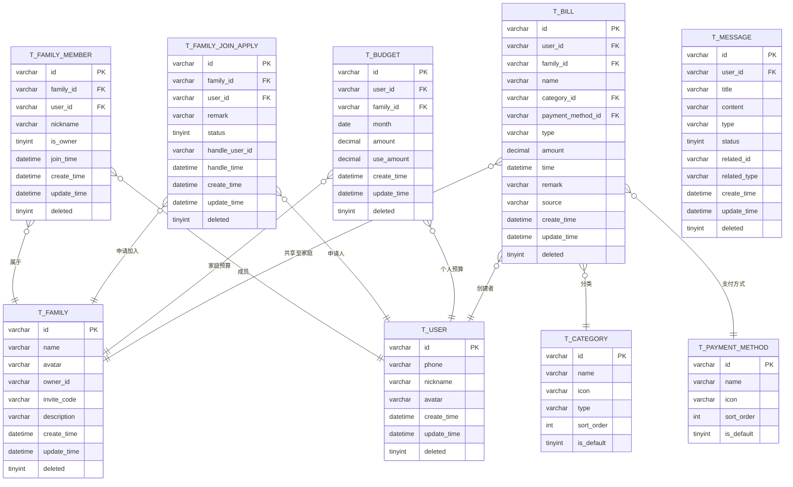
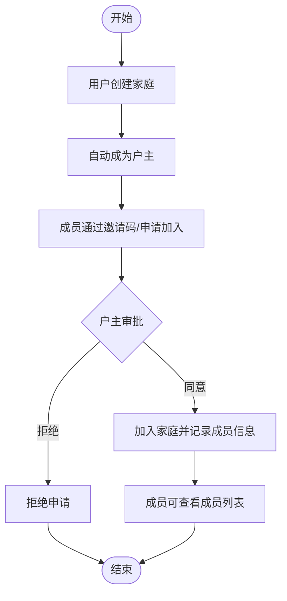
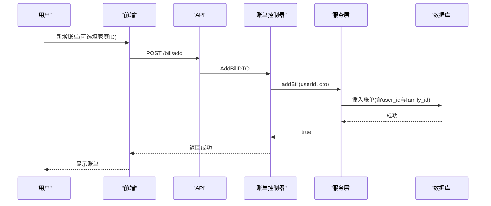
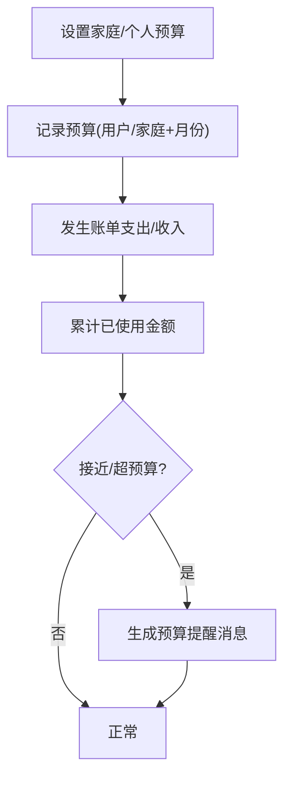
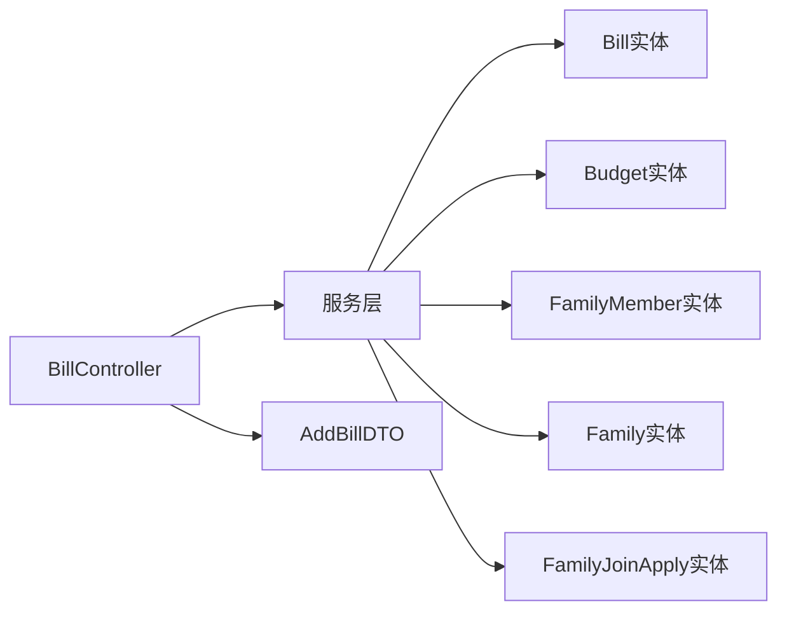

# 家庭共享模块

<cite>
**本文引用的文件**
- [PRD.md](file://PRD.md)
- [init.sql](file://init.sql)
- [Family.java](file://chuan-bill-server/src/main/java/com/samoy/chuanbillserver/entity/Family.java)
- [FamilyMember.java](file://chuan-bill-server/src/main/java/com/samoy/chuanbillserver/entity/FamilyMember.java)
- [FamilyJoinApply.java](file://chuan-bill-server/src/main/java/com/samoy/chuanbillserver/entity/FamilyJoinApply.java)
- [Budget.java](file://chuan-bill-server/src/main/java/com/samoy/chuanbillserver/entity/Budget.java)
- [IFamilyService.java](file://chuan-bill-server/src/main/java/com/samoy/chuanbillserver/service/IFamilyService.java)
- [FamilyServiceImpl.java](file://chuan-bill-server/src/main/java/com/samoy/chuanbillserver/service/impl/FamilyServiceImpl.java)
- [IFamilyMemberService.java](file://chuan-bill-server/src/main/java/com/samoy/chuanbillserver/service/IFamilyMemberService.java)
- [IFamilyJoinApplyService.java](file://chuan-bill-server/src/main/java/com/samoy/chuanbillserver/service/IFamilyJoinApplyService.java)
- [FamilyJoinApplyServiceImpl.java](file://chuan-bill-server/src/main/java/com/samoy/chuanbillserver/service/impl/FamilyJoinApplyServiceImpl.java)
- [BillController.java](file://chuan-bill-server/src/main/java/com/samoy/chuanbillserver/controller/BillController.java)
- [AddBillDTO.java](file://chuan-bill-server/src/main/java/com/samoy/chuanbillserver/dto/AddBillDTO.java)
- [apiDefinitions.ts](file://chuan-bill-app/src/api/apiDefinitions.ts)
- [index.vue](file://chuan-bill-app/src/pages/family/index.vue)
</cite>

## 目录
1. [简介](#简介)
2. [项目结构](#项目结构)
3. [核心组件](#核心组件)
4. [架构总览](#架构总览)
5. [详细组件分析](#详细组件分析)
6. [依赖分析](#依赖分析)
7. [性能考虑](#性能考虑)
8. [故障排查指南](#故障排查指南)
9. [结论](#结论)
10. [附录](#附录)

## 简介
本文件面向“家庭共享模块”的功能与实现，围绕以下目标展开：家庭创建与成员管理、权限控制、共享账单机制、家庭预算管理，并结合后端数据模型与API定义，给出前后端协同的工作流说明与最佳实践。该模块以PRD为功能依据，结合数据库表结构与后端实体/服务/控制器，梳理从页面到服务端的完整链路。

## 项目结构
家庭共享模块涉及前端页面与后端服务两部分：
- 前端：包含家庭页入口与API定义
- 后端：包含家庭、成员、申请、预算等实体与服务层，以及账单控制器

图示来源
- [index.vue:1-23](file://chuan-bill-app/src/pages/family/index.vue#L1-L23)
- [apiDefinitions.ts:19-37](file://chuan-bill-app/src/api/apiDefinitions.ts#L19-L37)
- [Family.java:24-81](file://chuan-bill-server/src/main/java/com/samoy/chuanbillserver/entity/Family.java#L24-L81)
- [FamilyMember.java:24-81](file://chuan-bill-server/src/main/java/com/samoy/chuanbillserver/entity/FamilyMember.java#L24-L81)
- [FamilyJoinApply.java:24-87](file://chuan-bill-server/src/main/java/com/samoy/chuanbillserver/entity/FamilyJoinApply.java#L24-L87)
- [Budget.java:26-83](file://chuan-bill-server/src/main/java/com/samoy/chuanbillserver/entity/Budget.java#L26-L83)
- [IFamilyService.java:1-15](file://chuan-bill-server/src/main/java/com/samoy/chuanbillserver/service/IFamilyService.java#L1-L15)
- [FamilyServiceImpl.java:1-19](file://chuan-bill-server/src/main/java/com/samoy/chuanbillserver/service/impl/FamilyServiceImpl.java#L1-L19)
- [IFamilyMemberService.java:1-15](file://chuan-bill-server/src/main/java/com/samoy/chuanbillserver/service/IFamilyMemberService.java#L1-L15)
- [IFamilyJoinApplyService.java:1-14](file://chuan-bill-server/src/main/java/com/samoy/chuanbillserver/service/IFamilyJoinApplyService.java#L1-L14)
- [FamilyJoinApplyServiceImpl.java:1-19](file://chuan-bill-server/src/main/java/com/samoy/chuanbillserver/service/impl/FamilyJoinApplyServiceImpl.java#L1-L19)
- [BillController.java:26-90](file://chuan-bill-server/src/main/java/com/samoy/chuanbillserver/controller/BillController.java#L26-L90)
- [AddBillDTO.java:12-43](file://chuan-bill-server/src/main/java/com/samoy/chuanbillserver/dto/AddBillDTO.java#L12-L43)

章节来源
- [index.vue:1-23](file://chuan-bill-app/src/pages/family/index.vue#L1-L23)
- [apiDefinitions.ts:19-37](file://chuan-bill-app/src/api/apiDefinitions.ts#L19-L37)

## 核心组件
- 家庭实体：承载家庭基本信息与户主标识
- 家庭成员实体：记录成员归属、昵称、是否户主、加入时间等
- 家庭加入申请实体：记录申请、处理人与状态
- 预算实体：支持个人与家庭两种预算维度
- 账单控制器：提供账单列表、详情、新增、更新、删除与分类/支付方式查询
- DTO：约束账单新增参数，含家庭ID字段

章节来源
- [Family.java:24-81](file://chuan-bill-server/src/main/java/com/samoy/chuanbillserver/entity/Family.java#L24-L81)
- [FamilyMember.java:24-81](file://chuan-bill-server/src/main/java/com/samoy/chuanbillserver/entity/FamilyMember.java#L24-L81)
- [FamilyJoinApply.java:24-87](file://chuan-bill-server/src/main/java/com/samoy/chuanbillserver/entity/FamilyJoinApply.java#L24-L87)
- [Budget.java:26-83](file://chuan-bill-server/src/main/java/com/samoy/chuanbillserver/entity/Budget.java#L26-L83)
- [BillController.java:26-90](file://chuan-bill-server/src/main/java/com/samoy/chuanbillserver/controller/BillController.java#L26-L90)
- [AddBillDTO.java:12-43](file://chuan-bill-server/src/main/java/com/samoy/chuanbillserver/dto/AddBillDTO.java#L12-L43)

## 架构总览
家庭共享模块采用前后端分离架构：
- 前端负责页面展示与用户交互，通过API定义调用后端接口
- 后端提供REST接口，控制器接收请求，服务层处理业务，实体与Mapper映射数据库
- 共享账单通过账单表中的家庭ID字段实现数据隔离与可见性控制

图示来源
- [BillController.java:37-42](file://chuan-bill-server/src/main/java/com/samoy/chuanbillserver/controller/BillController.java#L37-L42)
- [apiDefinitions.ts:33-35](file://chuan-bill-app/src/api/apiDefinitions.ts#L33-L35)

## 详细组件分析

### 数据模型设计
- 家庭表：包含家庭ID、名称、头像、户主ID、邀请码、描述、时间戳与删除标记
- 家庭成员表：唯一约束家庭+用户组合，记录成员昵称、是否户主、加入时间与时间戳
- 家庭加入申请表：记录申请状态、处理人与处理时间，便于户主审批
- 预算表：支持个人与家庭预算，按用户/家庭+月份唯一，记录预算金额与已使用金额
- 账单表：记录账单基础信息及家庭ID字段，用于共享账单的数据隔离

图示来源
- [init.sql:89-128](file://init.sql#L89-L128)
- [init.sql:133-158](file://init.sql#L133-L158)
- [init.sql:163-178](file://init.sql#L163-L178)
- [init.sql:183-201](file://init.sql#L183-L201)

章节来源
- [init.sql:89-128](file://init.sql#L89-L128)
- [init.sql:133-158](file://init.sql#L133-L158)
- [init.sql:163-178](file://init.sql#L163-L178)
- [init.sql:183-201](file://init.sql#L183-L201)

### 家庭创建与成员管理
- 创建条件：由PRD定义，用户创建家庭后自动成为户主
- 初始成员设置：创建成功后，户主自动成为成员
- 成员邀请/申请：通过邀请码或申请加入，户主审批
- 权限分配：户主拥有更高权限（批准加入、转让户主、移除成员、设置家庭预算），普通成员可邀请新成员或自行离开
- 成员列表：所有成员均可查看

章节来源
- [PRD.md:46-56](file://PRD.md#L46-L56)

### 共享账单机制
- 记账选择：新增账单时可选择是否共享到家庭
- 可见性：共享账单对所有家庭成员可见
- 历史保留：成员离开家庭后，历史共享账单仍可查看
- 数据隔离：账单表包含家庭ID字段，查询时按用户与家庭ID联合过滤

图示来源
- [BillController.java:52-57](file://chuan-bill-server/src/main/java/com/samoy/chuanbillserver/controller/BillController.java#L52-L57)
- [AddBillDTO.java:37-38](file://chuan-bill-server/src/main/java/com/samoy/chuanbillserver/dto/AddBillDTO.java#L37-L38)
- [init.sql:133-158](file://init.sql#L133-L158)

章节来源
- [PRD.md:58-63](file://PRD.md#L58-L63)
- [BillController.java:52-57](file://chuan-bill-server/src/main/java/com/samoy/chuanbillserver/controller/BillController.java#L52-L57)
- [AddBillDTO.java:37-38](file://chuan-bill-server/src/main/java/com/samoy/chuanbillserver/dto/AddBillDTO.java#L37-L38)
- [init.sql:133-158](file://init.sql#L133-L158)

### 家庭预算管理
- 预算设置：户主设置家庭当月总预算；个人预算由用户设置
- 预算执行监控：预算表记录已使用金额，结合账单金额进行累计
- 超支提醒：基于预算使用进度与阈值触发消息提醒（消息类型包含预算相关）

章节来源
- [PRD.md:64-76](file://PRD.md#L64-L76)
- [Budget.java:26-83](file://chuan-bill-server/src/main/java/com/samoy/chuanbillserver/entity/Budget.java#L26-L83)
- [init.sql:163-178](file://init.sql#L163-L178)

### API接口说明
- 账单相关
  - GET /bill/list：分页获取账单列表（按用户与可选家庭过滤）
  - GET /bill/detail：获取账单详情
  - POST /bill/add：新增账单（可选familyId）
  - POST /bill/update：更新账单
  - POST /bill/delete：删除账单
  - GET /bill/categories：获取分类列表
  - GET /bill/payment-methods：获取支付方式列表
- 家庭相关
  - 家庭创建、成员管理、申请审批等接口在PRD中定义，具体实现需在后续迭代中完善

章节来源
- [BillController.java:37-89](file://chuan-bill-server/src/main/java/com/samoy/chuanbillserver/controller/BillController.java#L37-L89)
- [apiDefinitions.ts:24-35](file://chuan-bill-app/src/api/apiDefinitions.ts#L24-L35)

### 前端组件实现
- 家庭页入口：提供“家庭”页面，作为家庭功能的统一入口
- API调用：通过apiDefinitions.ts集中管理接口路径，确保前后端一致

章节来源
- [index.vue:1-23](file://chuan-bill-app/src/pages/family/index.vue#L1-L23)
- [apiDefinitions.ts:19-37](file://chuan-bill-app/src/api/apiDefinitions.ts#L19-L37)

## 依赖分析
- 控制器依赖服务层，服务层依赖实体与Mapper
- 家庭、成员、申请、预算实体相互独立但通过外键关联
- 账单控制器依赖DTO与服务层，服务层依赖数据库表结构

图示来源
- [BillController.java:26-90](file://chuan-bill-server/src/main/java/com/samoy/chuanbillserver/controller/BillController.java#L26-L90)
- [AddBillDTO.java:12-43](file://chuan-bill-server/src/main/java/com/samoy/chuanbillserver/dto/AddBillDTO.java#L12-L43)
- [Family.java:24-81](file://chuan-bill-server/src/main/java/com/samoy/chuanbillserver/entity/Family.java#L24-L81)
- [FamilyMember.java:24-81](file://chuan-bill-server/src/main/java/com/samoy/chuanbillserver/entity/FamilyMember.java#L24-L81)
- [FamilyJoinApply.java:24-87](file://chuan-bill-server/src/main/java/com/samoy/chuanbillserver/entity/FamilyJoinApply.java#L24-L87)
- [Budget.java:26-83](file://chuan-bill-server/src/main/java/com/samoy/chuanbillserver/entity/Budget.java#L26-L83)

章节来源
- [IFamilyService.java:1-15](file://chuan-bill-server/src/main/java/com/samoy/chuanbillserver/service/IFamilyService.java#L1-L15)
- [FamilyServiceImpl.java:1-19](file://chuan-bill-server/src/main/java/com/samoy/chuanbillserver/service/impl/FamilyServiceImpl.java#L1-L19)
- [IFamilyMemberService.java:1-15](file://chuan-bill-server/src/main/java/com/samoy/chuanbillserver/service/IFamilyMemberService.java#L1-L15)
- [IFamilyJoinApplyService.java:1-14](file://chuan-bill-server/src/main/java/com/samoy/chuanbillserver/service/IFamilyJoinApplyService.java#L1-L14)
- [FamilyJoinApplyServiceImpl.java:1-19](file://chuan-bill-server/src/main/java/com/samoy/chuanbillserver/service/impl/FamilyJoinApplyServiceImpl.java#L1-L19)

## 性能考虑
- 索引策略：账单表对user_id、family_id、time、create_time建立索引，提升查询效率
- 唯一约束：预算表对用户+月份、家庭+月份建立唯一索引，避免重复预算
- 分页查询：账单列表采用分页返回，降低单次传输量
- 缓存建议：预算使用率与热门账单可引入缓存，减少数据库压力

章节来源
- [init.sql:150-157](file://init.sql#L150-L157)
- [init.sql:174-177](file://init.sql#L174-L177)

## 故障排查指南
- 家庭成员重复加入：检查家庭成员表的唯一约束，确保family_id与user_id组合唯一
- 预算重复设置：检查预算表唯一约束，避免同一用户/家庭同月重复插入
- 账单可见性异常：确认新增账单时是否正确填写familyId，查询时是否按用户与家庭ID过滤
- 申请状态异常：核对申请表状态字段与处理人字段，确保户主审批流程正确

章节来源
- [init.sql:103-106](file://init.sql#L103-L106)
- [init.sql:174-177](file://init.sql#L174-L177)
- [init.sql:113-127](file://init.sql#L113-L127)

## 结论
家庭共享模块以清晰的数据模型与REST接口为基础，实现了家庭创建、成员管理、权限控制与共享账单的核心能力。通过预算表与消息表扩展，可进一步完善预算提醒与社交通知。后续建议补充家庭相关接口的后端实现与前端页面，完善户主审批、成员移除、户主转让等功能。

## 附录
- 功能参考：PRD中对家庭管理、账单共享机制与预算管理的详细描述
- 表结构参考：init.sql中家庭、成员、申请、预算、账单等表的DDL与索引

章节来源
- [PRD.md:46-112](file://PRD.md#L46-L112)
- [init.sql:89-201](file://init.sql#L89-L201)