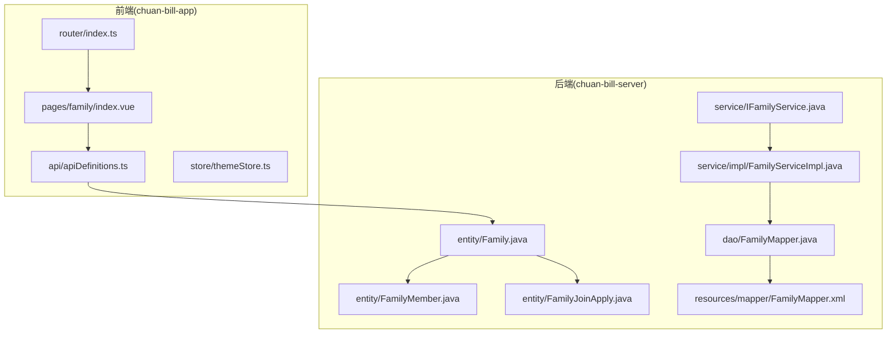
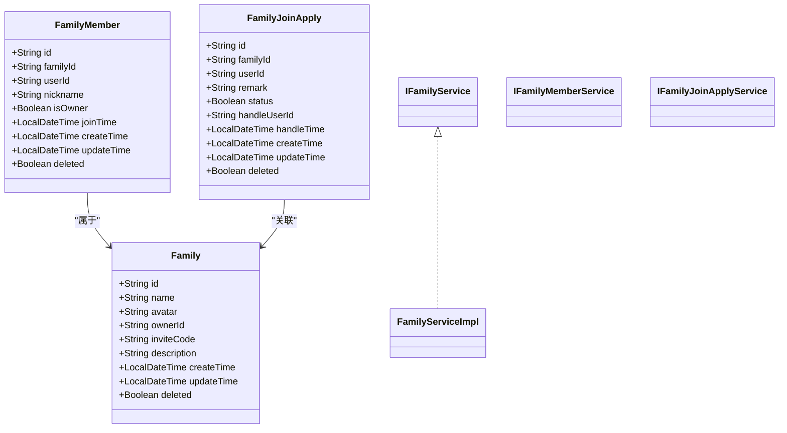
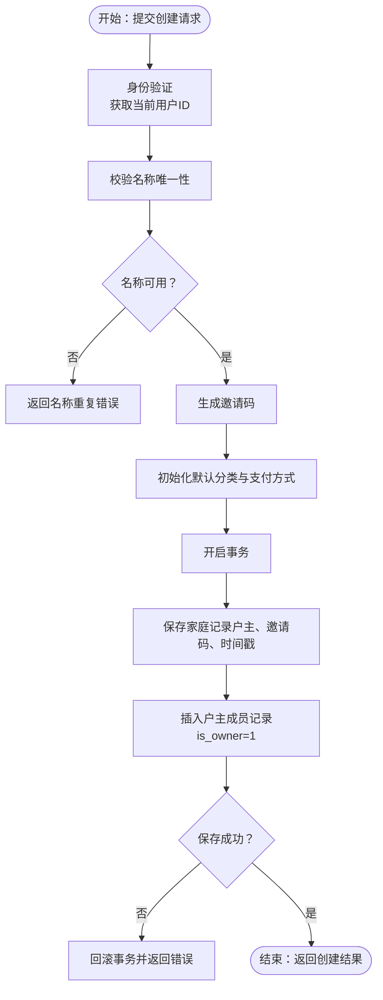
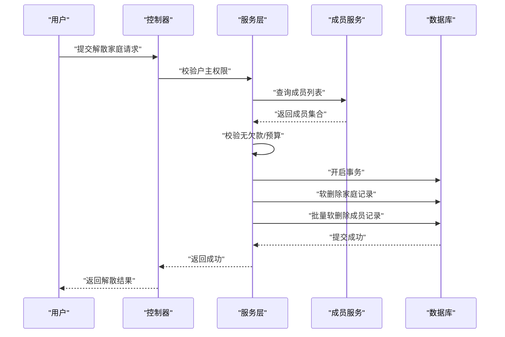
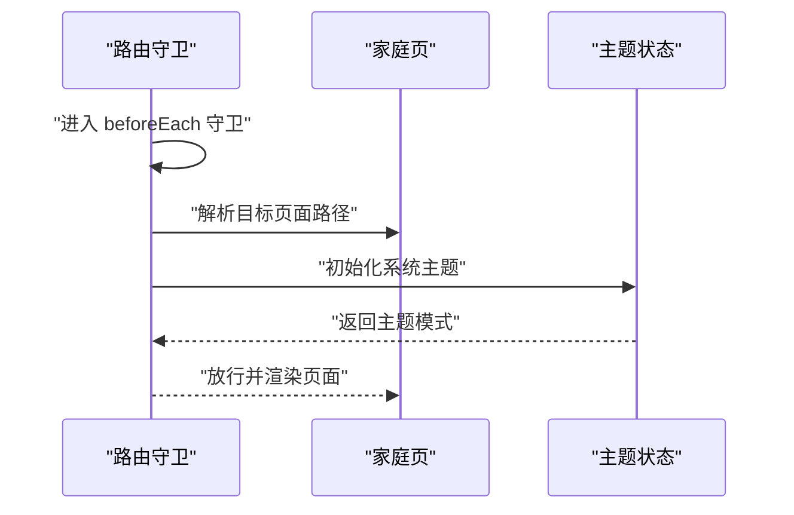
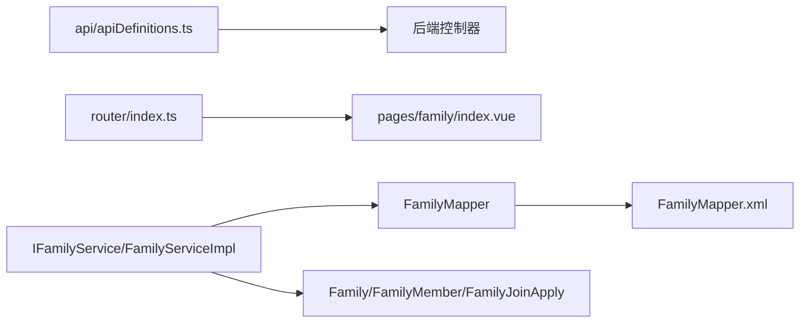

# 家庭创建与管理

<cite>
**本文引用的文件**
- [Family.java](file://chuan-bill-server/src/main/java/com/samoy/chuanbillserver/entity/Family.java)
- [FamilyMapper.java](file://chuan-bill-server/src/main/java/com/samoy/chuanbillserver/dao/FamilyMapper.java)
- [FamilyMapper.xml](file://chuan-bill-server/src/main/resources/mapper/FamilyMapper.xml)
- [IFamilyService.java](file://chuan-bill-server/src/main/java/com/samoy/chuanbillserver/service/IFamilyService.java)
- [FamilyServiceImpl.java](file://chuan-bill-server/src/main/java/com/samoy/chuanbillserver/service/impl/FamilyServiceImpl.java)
- [FamilyMember.java](file://chuan-bill-server/src/main/java/com/samoy/chuanbillserver/entity/FamilyMember.java)
- [FamilyJoinApply.java](file://chuan-bill-server/src/main/java/com/samoy/chuanbillserver/entity/FamilyJoinApply.java)
- [IFamilyMemberService.java](file://chuan-bill-server/src/main/java/com/samoy/chuanbillserver/service/IFamilyMemberService.java)
- [IFamilyJoinApplyService.java](file://chuan-bill-server/src/main/java/com/samoy/chuanbillserver/service/IFamilyJoinApplyService.java)
- [UserController.java](file://chuan-bill-server/src/main/java/com/samoy/chuanbillserver/controller/UserController.java)
- [index.vue（家庭页）](file://chuan-bill-app/src/pages/family/index.vue)
- [apiDefinitions.ts](file://chuan-bill-app/src/api/apiDefinitions.ts)
- [index.ts（路由）](file://chuan-bill-app/src/router/index.ts)
- [themeStore.ts](file://chuan-bill-app/src/store/themeStore.ts)
</cite>

## 目录
1. [简介](#简介)
2. [项目结构](#项目结构)
3. [核心组件](#核心组件)
4. [架构总览](#架构总览)
5. [详细组件分析](#详细组件分析)
6. [依赖分析](#依赖分析)
7. [性能考虑](#性能考虑)
8. [故障排查指南](#故障排查指南)
9. [结论](#结论)
10. [附录](#附录)

## 简介
本文件围绕“家庭创建与管理”功能进行系统化说明，覆盖从数据模型设计、后端服务逻辑、API 接口定义，到前端页面与状态管理的全链路实现。重点阐述家庭创建的业务规则（身份验证、权限校验、名称唯一性与格式校验、初始配置）、家庭信息的维护与解散流程、以及前后端协作的数据一致性保障。

## 项目结构
- 后端采用 Spring Boot + MyBatis-Plus 架构，家庭相关实体与服务位于 chuan-bill-server 模块。
- 前端基于 Vue3 + UniApp（小程序/多端），家庭页面位于 chuan-bill-app 的 pages.family 模块。
- 路由与全局状态管理在前端模块中组织，API 定义集中于 apiDefinitions.ts。

图表来源
- [index.vue（家庭页）:1-23](file://chuan-bill-app/src/pages/family/index.vue#L1-L23)
- [index.ts（路由）:1-80](file://chuan-bill-app/src/router/index.ts#L1-L80)
- [apiDefinitions.ts:1-38](file://chuan-bill-app/src/api/apiDefinitions.ts#L1-L38)
- [Family.java:1-82](file://chuan-bill-server/src/main/java/com/samoy/chuanbillserver/entity/Family.java#L1-L82)
- [FamilyMapper.java:1-15](file://chuan-bill-server/src/main/java/com/samoy/chuanbillserver/dao/FamilyMapper.java#L1-L15)
- [FamilyMapper.xml:1-6](file://chuan-bill-server/src/main/resources/mapper/FamilyMapper.xml#L1-L6)
- [IFamilyService.java:1-15](file://chuan-bill-server/src/main/java/com/samoy/chuanbillserver/service/IFamilyService.java#L1-L15)
- [FamilyServiceImpl.java:1-19](file://chuan-bill-server/src/main/java/com/samoy/chuanbillserver/service/impl/FamilyServiceImpl.java#L1-L19)
- [FamilyMember.java:1-82](file://chuan-bill-server/src/main/java/com/samoy/chuanbillserver/entity/FamilyMember.java#L1-L82)
- [FamilyJoinApply.java:1-88](file://chuan-bill-server/src/main/java/com/samoy/chuanbillserver/entity/FamilyJoinApply.java#L1-L88)

章节来源
- [index.vue（家庭页）:1-23](file://chuan-bill-app/src/pages/family/index.vue#L1-L23)
- [index.ts（路由）:1-80](file://chuan-bill-app/src/router/index.ts#L1-L80)
- [apiDefinitions.ts:1-38](file://chuan-bill-app/src/api/apiDefinitions.ts#L1-L38)
- [Family.java:1-82](file://chuan-bill-server/src/main/java/com/samoy/chuanbillserver/entity/Family.java#L1-L82)
- [FamilyMapper.java:1-15](file://chuan-bill-server/src/main/java/com/samoy/chuanbillserver/dao/FamilyMapper.java#L1-L15)
- [FamilyMapper.xml:1-6](file://chuan-bill-server/src/main/resources/mapper/FamilyMapper.xml#L1-L6)
- [IFamilyService.java:1-15](file://chuan-bill-server/src/main/java/com/samoy/chuanbillserver/service/IFamilyService.java#L1-L15)
- [FamilyServiceImpl.java:1-19](file://chuan-bill-server/src/main/java/com/samoy/chuanbillserver/service/impl/FamilyServiceImpl.java#L1-L19)
- [FamilyMember.java:1-82](file://chuan-bill-server/src/main/java/com/samoy/chuanbillserver/entity/FamilyMember.java#L1-L82)
- [FamilyJoinApply.java:1-88](file://chuan-bill-server/src/main/java/com/samoy/chuanbillserver/entity/FamilyJoinApply.java#L1-L88)

## 核心组件
- 数据模型
  - 家庭实体：包含家庭标识、名称、图标、户主、邀请码、描述、时间戳与删除标记等字段。
  - 家庭成员：记录成员与家庭的关联、成员昵称、是否户主、加入时间等。
  - 家庭加入申请：记录成员申请加入的状态流转与处理人、时间等。
- 服务层
  - 家庭服务接口与实现，基于 MyBatis-Plus 的通用服务封装。
- 控制器与路由
  - 用户控制器提供认证上下文（登录态）能力；前端路由负责页面导航与守卫。
- 前端页面与状态
  - 家庭页占位展示；主题状态管理提供系统主题感知与变量注入。

章节来源
- [Family.java:24-81](file://chuan-bill-server/src/main/java/com/samoy/chuanbillserver/entity/Family.java#L24-L81)
- [FamilyMember.java:24-81](file://chuan-bill-server/src/main/java/com/samoy/chuanbillserver/entity/FamilyMember.java#L24-L81)
- [FamilyJoinApply.java:24-87](file://chuan-bill-server/src/main/java/com/samoy/chuanbillserver/entity/FamilyJoinApply.java#L24-L87)
- [IFamilyService.java:1-15](file://chuan-bill-server/src/main/java/com/samoy/chuanbillserver/service/IFamilyService.java#L1-L15)
- [FamilyServiceImpl.java:1-19](file://chuan-bill-server/src/main/java/com/samoy/chuanbillserver/service/impl/FamilyServiceImpl.java#L1-L19)
- [index.vue（家庭页）:1-23](file://chuan-bill-app/src/pages/family/index.vue#L1-L23)
- [themeStore.ts:1-75](file://chuan-bill-app/src/store/themeStore.ts#L1-L75)

## 架构总览
下图展示了家庭相关的关键对象与交互关系，体现从前端页面到后端实体与服务的映射。

图表来源
- [Family.java:24-81](file://chuan-bill-server/src/main/java/com/samoy/chuanbillserver/entity/Family.java#L24-L81)
- [FamilyMember.java:24-81](file://chuan-bill-server/src/main/java/com/samoy/chuanbillserver/entity/FamilyMember.java#L24-L81)
- [FamilyJoinApply.java:24-87](file://chuan-bill-server/src/main/java/com/samoy/chuanbillserver/entity/FamilyJoinApply.java#L24-L87)
- [IFamilyService.java:1-15](file://chuan-bill-server/src/main/java/com/samoy/chuanbillserver/service/IFamilyService.java#L1-L15)
- [FamilyServiceImpl.java:1-19](file://chuan-bill-server/src/main/java/com/samoy/chuanbillserver/service/impl/FamilyServiceImpl.java#L1-L19)
- [IFamilyMemberService.java:1-15](file://chuan-bill-server/src/main/java/com/samoy/chuanbillserver/service/IFamilyMemberService.java#L1-L15)
- [IFamilyJoinApplyService.java:1-15](file://chuan-bill-server/src/main/java/com/samoy/chuanbillserver/service/IFamilyJoinApplyService.java#L1-L15)

## 详细组件分析

### 数据模型与业务约束
- 家庭实体字段与含义
  - id：家庭唯一标识
  - name：家庭名称（需唯一性校验）
  - avatar：家庭图标
  - ownerId：户主用户ID
  - inviteCode：邀请码（用于成员加入）
  - description：描述
  - createTime/updateTime/deleted：时间戳与软删除标记
- 关联关系
  - 家庭与成员：一对多（一个家庭可有多名成员）
  - 家庭与加入申请：一对多（一个家庭可有多个申请）
- 业务约束
  - 户主权限：仅户主可执行关键操作（如解散家庭、调整成员角色）
  - 成员加入：需通过邀请码或申请并经户主处理
  - 名称唯一性：同系统内家庭名称应唯一（需在服务层实现）

章节来源
- [Family.java:24-81](file://chuan-bill-server/src/main/java/com/samoy/chuanbillserver/entity/Family.java#L24-L81)
- [FamilyMember.java:24-81](file://chuan-bill-server/src/main/java/com/samoy/chuanbillserver/entity/FamilyMember.java#L24-L81)
- [FamilyJoinApply.java:24-87](file://chuan-bill-server/src/main/java/com/samoy/chuanbillserver/entity/FamilyJoinApply.java#L24-L87)

### 家庭创建流程与业务规则
- 创建条件检查
  - 用户身份验证：通过后端登录态（如 Sa-Token）获取当前用户ID
  - 权限验证：仅当前用户可发起创建
- 家庭信息验证
  - 名称唯一性：查询是否存在相同名称且未删除的家庭
  - 格式校验：名称长度、字符集等（建议在 DTO 层或服务层实现）
- 初始配置设置
  - 默认分类：创建时生成默认收支分类
  - 默认支付方式：创建时生成默认支付方式
  - 邀请码生成：随机生成唯一邀请码
  - 户主绑定：创建者自动成为户主
- 事务与一致性
  - 创建家庭与初始化资源应在同一事务中提交，失败回滚
  - 成员表插入户主记录，申请表与消息表（如有）同步初始化

图表来源
- [UserController.java:25-30](file://chuan-bill-server/src/main/java/com/samoy/chuanbillserver/controller/UserController.java#L25-L30)
- [Family.java:24-81](file://chuan-bill-server/src/main/java/com/samoy/chuanbillserver/entity/Family.java#L24-L81)
- [FamilyMember.java:24-81](file://chuan-bill-server/src/main/java/com/samoy/chuanbillserver/entity/FamilyMember.java#L24-L81)

章节来源
- [UserController.java:25-30](file://chuan-bill-server/src/main/java/com/samoy/chuanbillserver/controller/UserController.java#L25-L30)
- [Family.java:24-81](file://chuan-bill-server/src/main/java/com/samoy/chuanbillserver/entity/Family.java#L24-L81)
- [FamilyMember.java:24-81](file://chuan-bill-server/src/main/java/com/samoy/chuanbillserver/entity/FamilyMember.java#L24-L81)

### 家庭信息管理与维护
- 家庭名称修改
  - 权限：仅户主可修改
  - 规则：名称需唯一且符合格式
- 家庭设置调整
  - 图标、描述等元信息修改
  - 邀请码重置（可选）
- 成员管理
  - 新增成员：户主通过邀请码或审批申请
  - 移除成员：户主解绑成员或成员主动退出
  - 角色变更：户主可将其他成员设为户主（需二次确认）
- 解散家庭流程
  - 权限：仅户主可解散
  - 步骤：校验无欠款/预算、通知成员、软删除家庭与成员、清理相关资源
  - 事务：删除操作需原子性，失败回滚

图表来源
- [Family.java:24-81](file://chuan-bill-server/src/main/java/com/samoy/chuanbillserver/entity/Family.java#L24-L81)
- [FamilyMember.java:24-81](file://chuan-bill-server/src/main/java/com/samoy/chuanbillserver/entity/FamilyMember.java#L24-L81)
- [IFamilyService.java:1-15](file://chuan-bill-server/src/main/java/com/samoy/chuanbillserver/service/IFamilyService.java#L1-L15)
- [IFamilyMemberService.java:1-15](file://chuan-bill-server/src/main/java/com/samoy/chuanbillserver/service/IFamilyMemberService.java#L1-L15)

章节来源
- [Family.java:24-81](file://chuan-bill-server/src/main/java/com/samoy/chuanbillserver/entity/Family.java#L24-L81)
- [FamilyMember.java:24-81](file://chuan-bill-server/src/main/java/com/samoy/chuanbillserver/entity/FamilyMember.java#L24-L81)
- [IFamilyService.java:1-15](file://chuan-bill-server/src/main/java/com/samoy/chuanbillserver/service/IFamilyService.java#L1-L15)
- [IFamilyMemberService.java:1-15](file://chuan-bill-server/src/main/java/com/samoy/chuanbillserver/service/IFamilyMemberService.java#L1-L15)

### API 接口说明（与家庭相关）
- 当前仓库中未发现直接以“/family”命名的接口定义。用户相关接口示例（用于说明鉴权与返回结构）：
  - GET /user/profile：获取当前用户资料
  - POST /user/updateProfile：更新用户资料
  - POST /user/updatePasswordByOld：通过旧密码修改密码
  - POST /user/updatePasswordByCode：通过验证码修改密码
  - GET /user/hasPassword：检查是否设置了密码
- 家庭相关接口建议命名规范（按现有风格扩展）：
  - POST /family/create：创建家庭（携带名称、描述等）
  - PUT /family/update：更新家庭信息（户主）
  - DELETE /family/dismiss：解散家庭（户主）
  - GET /family/members：获取成员列表
  - POST /family/join：成员加入（邀请码/申请）
  - POST /family/kick：移除成员（户主）
- 参数与返回
  - 统一使用 Result<T> 包裹，包含状态码、消息与数据体
  - 认证：通过后端登录态（如 Sa-Token）传递用户ID
- 错误处理
  - 未登录：返回 401
  - 权限不足：返回 403
  - 业务异常：返回对应错误码与提示

章节来源
- [apiDefinitions.ts:19-37](file://chuan-bill-app/src/api/apiDefinitions.ts#L19-L37)
- [UserController.java:25-60](file://chuan-bill-server/src/main/java/com/samoy/chuanbillserver/controller/UserController.java#L25-L60)

### 前端组件实现
- 页面与布局
  - 家庭页 index.vue：当前为占位页面，后续可扩展为家庭列表、设置入口等
- 路由与导航
  - 路由守卫：可在 beforeEach 中增加登录态与页面访问控制
- 状态管理
  - 主题状态：themeStore 提供系统主题检测与变量注入，便于统一暗黑/明亮主题样式

图表来源
- [index.ts（路由）:24-59](file://chuan-bill-app/src/router/index.ts#L24-L59)
- [index.vue（家庭页）:1-23](file://chuan-bill-app/src/pages/family/index.vue#L1-L23)
- [themeStore.ts:68-72](file://chuan-bill-app/src/store/themeStore.ts#L68-L72)

章节来源
- [index.vue（家庭页）:1-23](file://chuan-bill-app/src/pages/family/index.vue#L1-L23)
- [index.ts（路由）:1-80](file://chuan-bill-app/src/router/index.ts#L1-L80)
- [themeStore.ts:1-75](file://chuan-bill-app/src/store/themeStore.ts#L1-L75)

### 后端服务逻辑
- 服务层职责
  - 家庭服务接口继承 MyBatis-Plus 通用服务，提供基础 CRUD 能力
  - 业务方法（如创建、解散）在实现类中组合 DAO 与工具类，确保事务边界
- 事务处理
  - 使用注解或编程式事务控制，保证家庭创建/解散的原子性
- 权限验证
  - 结合登录态获取用户ID，校验是否为户主或成员角色
- 数据一致性
  - 软删除策略：deleted 字段避免物理删除造成数据丢失
  - 时间戳：统一 createTime/updateTime，便于审计与排序

章节来源
- [IFamilyService.java:1-15](file://chuan-bill-server/src/main/java/com/samoy/chuanbillserver/service/IFamilyService.java#L1-L15)
- [FamilyServiceImpl.java:1-19](file://chuan-bill-server/src/main/java/com/samoy/chuanbillserver/service/impl/FamilyServiceImpl.java#L1-L19)
- [FamilyMapper.java:1-15](file://chuan-bill-server/src/main/java/com/samoy/chuanbillserver/dao/FamilyMapper.java#L1-L15)
- [FamilyMapper.xml:1-6](file://chuan-bill-server/src/main/resources/mapper/FamilyMapper.xml#L1-L6)

## 依赖分析
- 组件耦合
  - 前端页面依赖路由与 API 定义；路由依赖全局状态管理
  - 后端服务依赖 MyBatis-Plus 通用服务；DAO 映射 XML 承载 SQL
- 外部依赖
  - Sa-Token：提供登录态与权限注解
  - Swagger/OpenAPI：接口文档生成与维护
- 潜在风险
  - 家庭名称唯一性未在现有代码中体现，需在服务层补充校验
  - 缺少“/family”接口定义，需在后端新增控制器与路由

图表来源
- [apiDefinitions.ts:19-37](file://chuan-bill-app/src/api/apiDefinitions.ts#L19-L37)
- [index.ts（路由）:1-80](file://chuan-bill-app/src/router/index.ts#L1-L80)
- [index.vue（家庭页）:1-23](file://chuan-bill-app/src/pages/family/index.vue#L1-L23)
- [IFamilyService.java:1-15](file://chuan-bill-server/src/main/java/com/samoy/chuanbillserver/service/IFamilyService.java#L1-L15)
- [FamilyServiceImpl.java:1-19](file://chuan-bill-server/src/main/java/com/samoy/chuanbillserver/service/impl/FamilyServiceImpl.java#L1-L19)
- [FamilyMapper.java:1-15](file://chuan-bill-server/src/main/java/com/samoy/chuanbillserver/dao/FamilyMapper.java#L1-L15)
- [FamilyMapper.xml:1-6](file://chuan-bill-server/src/main/resources/mapper/FamilyMapper.xml#L1-L6)
- [Family.java:24-81](file://chuan-bill-server/src/main/java/com/samoy/chuanbillserver/entity/Family.java#L24-L81)
- [FamilyMember.java:24-81](file://chuan-bill-server/src/main/java/com/samoy/chuanbillserver/entity/FamilyMember.java#L24-L81)
- [FamilyJoinApply.java:24-87](file://chuan-bill-server/src/main/java/com/samoy/chuanbillserver/entity/FamilyJoinApply.java#L24-L87)

章节来源
- [apiDefinitions.ts:19-37](file://chuan-bill-app/src/api/apiDefinitions.ts#L19-L37)
- [index.ts（路由）:1-80](file://chuan-bill-app/src/router/index.ts#L1-L80)
- [index.vue（家庭页）:1-23](file://chuan-bill-app/src/pages/family/index.vue#L1-L23)
- [IFamilyService.java:1-15](file://chuan-bill-server/src/main/java/com/samoy/chuanbillserver/service/IFamilyService.java#L1-L15)
- [FamilyServiceImpl.java:1-19](file://chuan-bill-server/src/main/java/com/samoy/chuanbillserver/service/impl/FamilyServiceImpl.java#L1-L19)
- [FamilyMapper.java:1-15](file://chuan-bill-server/src/main/java/com/samoy/chuanbillserver/dao/FamilyMapper.java#L1-L15)
- [FamilyMapper.xml:1-6](file://chuan-bill-server/src/main/resources/mapper/FamilyMapper.xml#L1-L6)
- [Family.java:24-81](file://chuan-bill-server/src/main/java/com/samoy/chuanbillserver/entity/Family.java#L24-L81)
- [FamilyMember.java:24-81](file://chuan-bill-server/src/main/java/com/samoy/chuanbillserver/entity/FamilyMember.java#L24-L81)
- [FamilyJoinApply.java:24-87](file://chuan-bill-server/src/main/java/com/samoy/chuanbillserver/entity/FamilyJoinApply.java#L24-L87)

## 性能考虑
- 查询优化
  - 对家庭名称与邀请码建立索引，加速唯一性校验与加入匹配
  - 分页查询成员列表，避免一次性加载过多数据
- 写入优化
  - 批量插入默认分类与支付方式，减少多次往返
  - 事务合并写入，降低锁竞争
- 缓存策略
  - 户主信息与成员数量可短期缓存，结合失效策略
- 前端体验
  - 表单输入防抖与即时校验，减少无效请求
  - 解散家庭等高危操作增加二次确认与加载态

## 故障排查指南
- 常见问题
  - 名称重复：服务层未实现唯一性校验导致创建失败
  - 权限不足：户主校验缺失，非户主尝试解散或修改
  - 事务失败：部分写入成功，部分回滚，导致数据不一致
- 排查步骤
  - 检查登录态与用户ID是否正确传递
  - 核对服务层业务方法是否包裹在事务中
  - 查看数据库日志，确认软删除与时间戳更新
- 建议
  - 在服务层增加显式的唯一性与权限校验
  - 为高危操作增加幂等与二次确认

章节来源
- [IFamilyService.java:1-15](file://chuan-bill-server/src/main/java/com/samoy/chuanbillserver/service/IFamilyService.java#L1-L15)
- [FamilyServiceImpl.java:1-19](file://chuan-bill-server/src/main/java/com/samoy/chuanbillserver/service/impl/FamilyServiceImpl.java#L1-L19)
- [Family.java:24-81](file://chuan-bill-server/src/main/java/com/samoy/chuanbillserver/entity/Family.java#L24-L81)

## 结论
本项目在后端已具备家庭、成员与加入申请的基础数据模型，并通过 MyBatis-Plus 提供了通用服务能力。前端提供了家庭页面与路由框架。为完善“家庭创建与管理”，建议：
- 在服务层补齐名称唯一性与权限校验
- 新增“/family”相关接口与控制器
- 在前端完善家庭设置、成员管理与状态提示
- 强化事务与一致性保障，提升用户体验与数据安全

## 附录
- 开发建议
  - DTO 层：统一输入校验与转换
  - VO 层：统一输出结构与脱敏
  - 日志与监控：关键操作埋点，便于追踪与审计