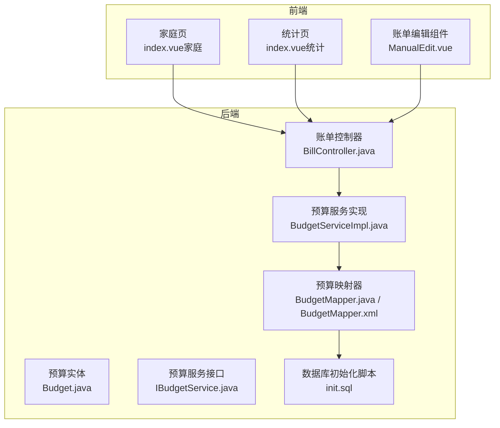
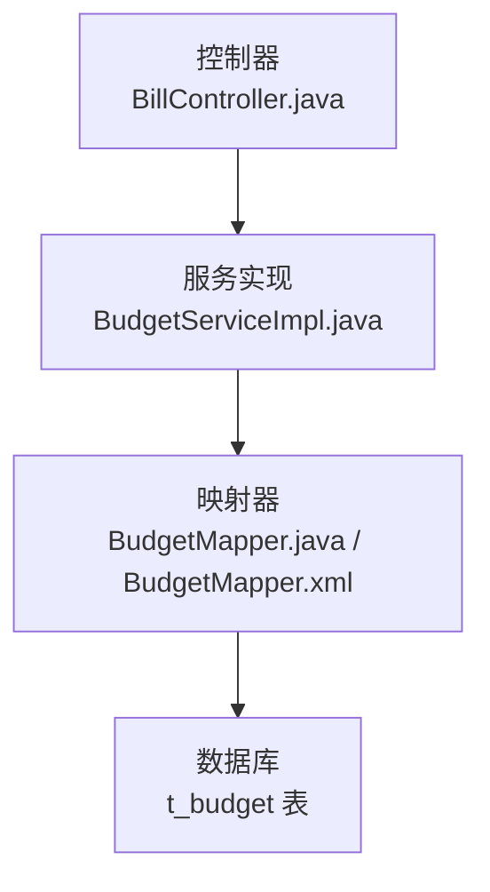
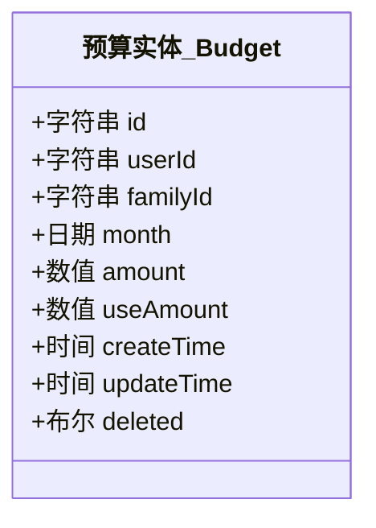
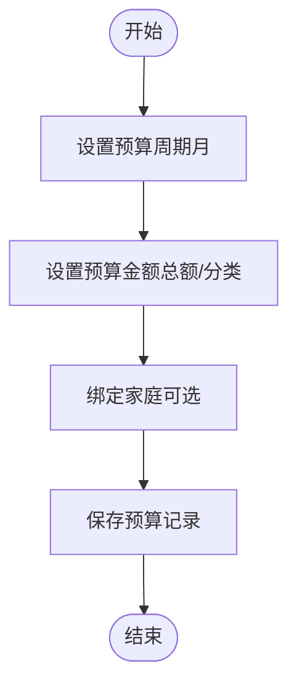
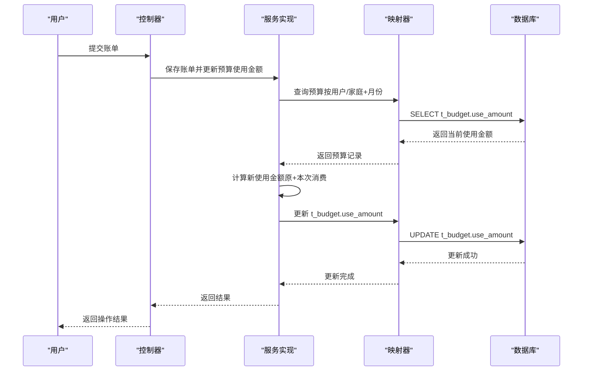
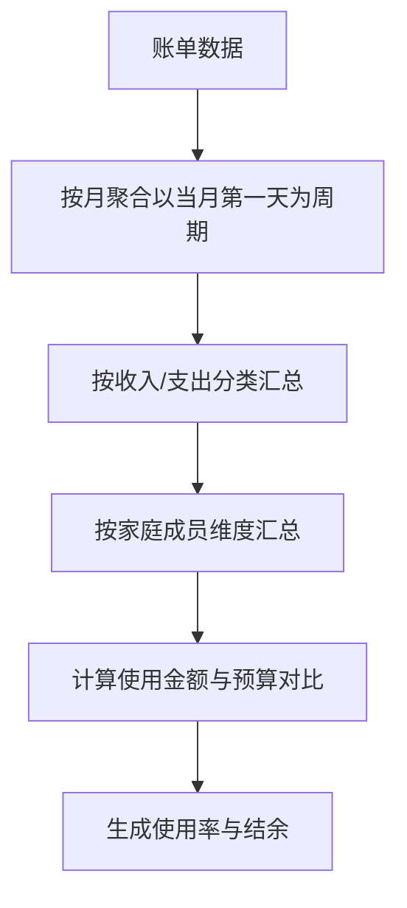
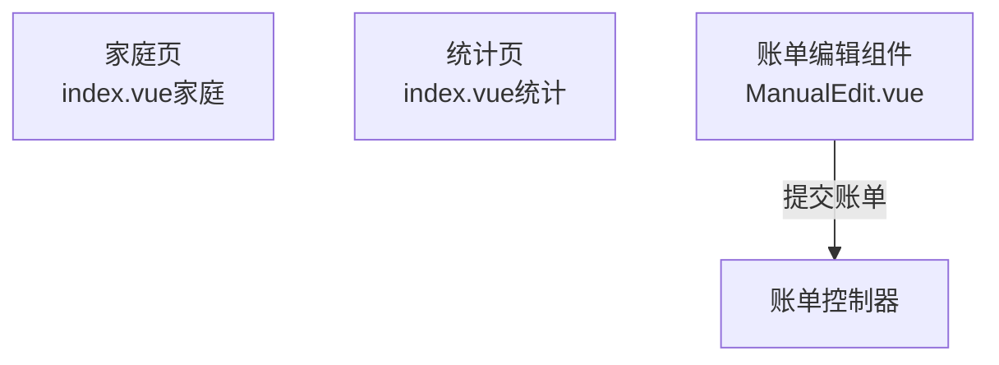
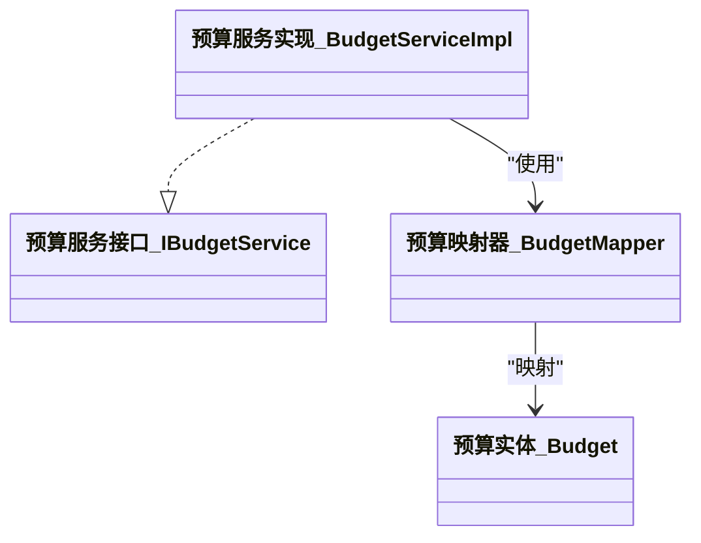
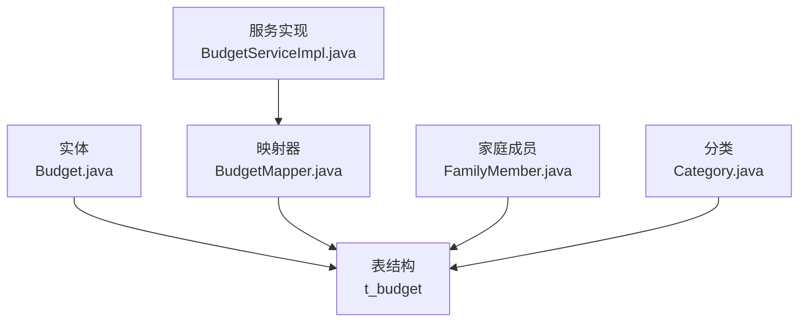

# 家庭预算

<cite>
**本文引用的文件**
- [Budget.java](file://chuan-bill-server/src/main/java/com/samoy/chuanbillserver/entity/Budget.java)
- [IBudgetService.java](file://chuan-bill-server/src/main/java/com/samoy/chuanbillserver/service/IBudgetService.java)
- [BudgetServiceImpl.java](file://chuan-bill-server/src/main/java/com/samoy/chuanbillserver/service/impl/BudgetServiceImpl.java)
- [BudgetMapper.java](file://chuan-bill-server/src/main/java/com/samoy/chuanbillserver/dao/BudgetMapper.java)
- [BudgetMapper.xml](file://chuan-bill-server/src/main/resources/mapper/BudgetMapper.xml)
- [init.sql](file://chuan-bill-server/init.sql)
- [BillController.java](file://chuan-bill-server/src/main/java/com/samoy/chuanbillserver/controller/BillController.java)
- [Category.java](file://chuan-bill-server/src/main/java/com/samoy/chuanbillserver/entity/Category.java)
- [Family.java](file://chuan-bill-server/src/main/java/com/samoy/chuanbillserver/entity/Family.java)
- [FamilyMember.java](file://chuan-bill-server/src/main/java/com/samoy/chuanbillserver/entity/FamilyMember.java)
- [FamilyMapper.java](file://chuan-bill-server/src/main/java/com/samoy/chuanbillserver/dao/FamilyMapper.java)
- [FamilyMemberMapper.java](file://chuan-bill-server/src/main/java/com/samoy/chuanbillserver/dao/FamilyMemberMapper.java)
- [IFamilyService.java](file://chuan-bill-server/src/main/java/com/samoy/chuanbillserver/service/IFamilyService.java)
- [IFamilyMemberService.java](file://chuan-bill-server/src/main/java/com/samoy/chuanbillserver/service/IFamilyMemberService.java)
- [FamilyServiceImpl.java](file://chuan-bill-server/src/main/java/com/samoy/chuanbillserver/service/impl/FamilyServiceImpl.java)
- [FamilyMemberServiceImpl.java](file://chuan-bill-server/src/main/java/com/samoy/chuanbillserver/service/impl/FamilyMemberServiceImpl.java)
- [index.vue（家庭）](file://chuan-bill-app/src/pages/family/index.vue)
- [index.vue（统计）](file://chuan-bill-app/src/pages/statistics/index.vue)
- [ManualEdit.vue](file://chuan-bill-app/src/pages/bill/components/ManualEdit.vue)
</cite>

## 目录
1. [简介](#简介)
2. [项目结构](#项目结构)
3. [核心组件](#核心组件)
4. [架构概览](#架构概览)
5. [详细组件分析](#详细组件分析)
6. [依赖分析](#依赖分析)
7. [性能考虑](#性能考虑)
8. [故障排查指南](#故障排查指南)
9. [结论](#结论)
10. [附录](#附录)

## 简介
本文件围绕“家庭预算”功能进行系统化说明，覆盖以下方面：
- 预算设置与管理：预算周期（月度为主）、预算类别（收入/支出）、预算金额（总额/分类）、生效时间等
- 预算执行监控：实时消费统计（基于账单数据）、预算使用率计算（百分比与金额对比）、超支提醒机制（阈值与通知）
- 数据聚合与统计：按类别、按成员、按时间段的汇总，预算与实际消费对比分析
- 数据模型：Budget 实体的关键字段与约束
- API 接口：预算设置、查询、统计等接口说明
- 前端组件：预算设置界面、预算执行图表、超支提醒等
- 后端服务：数据聚合、定时任务、通知机制等实现思路

## 项目结构
家庭预算功能涉及前后端协同：
- 前端（小程序/UniApp）：家庭页、统计页、账单编辑页等页面与组件
- 后端（Spring Boot）：预算实体、服务层、数据访问层、MyBatis 映射、数据库初始化脚本

**图示来源**
- [index.vue（家庭）:1-23](file://chuan-bill-app/src/pages/family/index.vue#L1-L23)
- [index.vue（统计）:1-23](file://chuan-bill-app/src/pages/statistics/index.vue#L1-L23)
- [ManualEdit.vue:44-88](file://chuan-bill-app/src/pages/bill/components/ManualEdit.vue#L44-L88)
- [BillController.java:59-90](file://chuan-bill-server/src/main/java/com/samoy/chuanbillserver/controller/BillController.java#L59-L90)
- [Budget.java:1-84](file://chuan-bill-server/src/main/java/com/samoy/chuanbillserver/entity/Budget.java#L1-L84)
- [IBudgetService.java:1-14](file://chuan-bill-server/src/main/java/com/samoy/chuanbillserver/service/IBudgetService.java#L1-L14)
- [BudgetServiceImpl.java:1-19](file://chuan-bill-server/src/main/java/com/samoy/chuanbillserver/service/impl/BudgetServiceImpl.java#L1-L19)
- [BudgetMapper.java:1-14](file://chuan-bill-server/src/main/java/com/samoy/chuanbillserver/dao/BudgetMapper.java#L1-L14)
- [BudgetMapper.xml:1-6](file://chuan-bill-server/src/main/resources/mapper/BudgetMapper.xml#L1-L6)
- [init.sql:160-178](file://chuan-bill-server/init.sql#L160-L178)

**章节来源**
- [index.vue（家庭）:1-23](file://chuan-bill-app/src/pages/family/index.vue#L1-L23)
- [index.vue（统计）:1-23](file://chuan-bill-app/src/pages/statistics/index.vue#L1-L23)
- [ManualEdit.vue:44-88](file://chuan-bill-app/src/pages/bill/components/ManualEdit.vue#L44-L88)
- [BillController.java:59-90](file://chuan-bill-server/src/main/java/com/samoy/chuanbillserver/controller/BillController.java#L59-L90)
- [Budget.java:1-84](file://chuan-bill-server/src/main/java/com/samoy/chuanbillserver/entity/Budget.java#L1-L84)
- [init.sql:160-178](file://chuan-bill-server/init.sql#L160-L178)

## 核心组件
- 预算实体（Budget）：包含预算周期、预算金额、已使用金额、家庭/用户关联、时间戳与软删标记
- 预算服务层：提供预算 CRUD 能力（当前为通用基类能力）
- 预算数据访问层：通过 MyBatis 操作 t_budget 表
- 家庭与成员：支持家庭级预算共享与成员维度统计
- 分类体系：收入/支出分类用于预算分类统计
- 前端页面与组件：家庭页、统计页、账单编辑页

**章节来源**
- [Budget.java:1-84](file://chuan-bill-server/src/main/java/com/samoy/chuanbillserver/entity/Budget.java#L1-L84)
- [IBudgetService.java:1-14](file://chuan-bill-server/src/main/java/com/samoy/chuanbillserver/service/IBudgetService.java#L1-L14)
- [BudgetServiceImpl.java:1-19](file://chuan-bill-server/src/main/java/com/samoy/chuanbillserver/service/impl/BudgetServiceImpl.java#L1-L19)
- [BudgetMapper.java:1-14](file://chuan-bill-server/src/main/java/com/samoy/chuanbillserver/dao/BudgetMapper.java#L1-L14)
- [BudgetMapper.xml:1-6](file://chuan-bill-server/src/main/resources/mapper/BudgetMapper.xml#L1-L6)
- [Family.java:1-82](file://chuan-bill-server/src/main/java/com/samoy/chuanbillserver/entity/Family.java#L1-L82)
- [FamilyMember.java:1-82](file://chuan-bill-server/src/main/java/com/samoy/chuanbillserver/entity/FamilyMember.java#L1-L82)
- [Category.java:1-88](file://chuan-bill-server/src/main/java/com/samoy/chuanbillserver/entity/Category.java#L1-L88)
- [index.vue（家庭）:1-23](file://chuan-bill-app/src/pages/family/index.vue#L1-L23)
- [index.vue（统计）:1-23](file://chuan-bill-app/src/pages/statistics/index.vue#L1-L23)
- [ManualEdit.vue:44-88](file://chuan-bill-app/src/pages/bill/components/ManualEdit.vue#L44-L88)

## 架构概览
家庭预算在后端采用分层架构：
- 控制器层：接收请求并调用服务层
- 服务层：封装业务逻辑（当前为通用基类能力）
- 数据访问层：MyBatis 映射 t_budget 表
- 数据库：t_budget 表定义预算周期、金额、家庭/用户关联等字段

**图示来源**
- [BillController.java:59-90](file://chuan-bill-server/src/main/java/com/samoy/chuanbillserver/controller/BillController.java#L59-L90)
- [BudgetServiceImpl.java:1-19](file://chuan-bill-server/src/main/java/com/samoy/chuanbillserver/service/impl/BudgetServiceImpl.java#L1-L19)
- [BudgetMapper.java:1-14](file://chuan-bill-server/src/main/java/com/samoy/chuanbillserver/dao/BudgetMapper.java#L1-L14)
- [BudgetMapper.xml:1-6](file://chuan-bill-server/src/main/resources/mapper/BudgetMapper.xml#L1-L6)
- [init.sql:160-178](file://chuan-bill-server/init.sql#L160-L178)

## 详细组件分析

### 预算实体（Budget）数据模型
- 关键字段
  - 预算ID、用户ID、家庭ID（共享预算时使用）
  - 预算月份（存储为当月第一天）
  - 预算金额、已使用金额
  - 创建/更新时间、软删标记
- 约束与索引
  - 用户+月份唯一索引、家庭+月份唯一索引，确保同一周期内唯一预算
  - 用户ID、家庭ID索引，便于查询与统计

**图示来源**
- [Budget.java:1-84](file://chuan-bill-server/src/main/java/com/samoy/chuanbillserver/entity/Budget.java#L1-L84)
- [init.sql:160-178](file://chuan-bill-server/init.sql#L160-L178)

**章节来源**
- [Budget.java:1-84](file://chuan-bill-server/src/main/java/com/samoy/chuanbillserver/entity/Budget.java#L1-L84)
- [init.sql:160-178](file://chuan-bill-server/init.sql#L160-L178)

### 预算设置与管理流程
- 预算周期：以“当月第一天”作为预算月份标识，支持月度预算
- 预算类别：通过分类体系（收入/支出）进行分类预算
- 预算金额：总额预算与分类预算均可设置；已使用金额用于统计
- 生效时间：由业务规则决定（如月初生效），当前实体未显式存储生效时间字段

**图示来源**
- [Budget.java:1-84](file://chuan-bill-server/src/main/java/com/samoy/chuanbillserver/entity/Budget.java#L1-L84)
- [Category.java:1-88](file://chuan-bill-server/src/main/java/com/samoy/chuanbillserver/entity/Category.java#L1-L88)
- [Family.java:1-82](file://chuan-bill-server/src/main/java/com/samoy/chuanbillserver/entity/Family.java#L1-L82)

**章节来源**
- [Budget.java:1-84](file://chuan-bill-server/src/main/java/com/samoy/chuanbillserver/entity/Budget.java#L1-L84)
- [Category.java:1-88](file://chuan-bill-server/src/main/java/com/samoy/chuanbillserver/entity/Category.java#L1-L88)
- [Family.java:1-82](file://chuan-bill-server/src/main/java/com/samoy/chuanbillserver/entity/Family.java#L1-L82)

### 预算执行监控与统计
- 实时消费统计：基于账单数据按预算周期与分类进行聚合
- 使用率计算：使用金额 / 预算金额 × 100%，并支持金额差值对比
- 超支提醒：阈值触发（如 90%/100%），结合通知机制推送

**图示来源**
- [BillController.java:59-90](file://chuan-bill-server/src/main/java/com/samoy/chuanbillserver/controller/BillController.java#L59-L90)
- [BudgetServiceImpl.java:1-19](file://chuan-bill-server/src/main/java/com/samoy/chuanbillserver/service/impl/BudgetServiceImpl.java#L1-L19)
- [BudgetMapper.java:1-14](file://chuan-bill-server/src/main/java/com/samoy/chuanbillserver/dao/BudgetMapper.java#L1-L14)
- [init.sql:160-178](file://chuan-bill-server/init.sql#L160-L178)

**章节来源**
- [BillController.java:59-90](file://chuan-bill-server/src/main/java/com/samoy/chuanbillserver/controller/BillController.java#L59-L90)
- [BudgetServiceImpl.java:1-19](file://chuan-bill-server/src/main/java/com/samoy/chuanbillserver/service/impl/BudgetServiceImpl.java#L1-L19)
- [BudgetMapper.java:1-14](file://chuan-bill-server/src/main/java/com/samoy/chuanbillserver/dao/BudgetMapper.java#L1-L14)
- [init.sql:160-178](file://chuan-bill-server/init.sql#L160-L178)

### 数据聚合与统计逻辑
- 按类别：对收入/支出分类分别统计消费与预算
- 按成员：通过家庭成员表关联，按成员维度汇总
- 按时间段：以“当月第一天”为周期进行聚合
- 对比分析：预算金额与实际消费对比，生成使用率与结余

**图示来源**
- [init.sql:160-178](file://chuan-bill-server/init.sql#L160-L178)
- [Category.java:1-88](file://chuan-bill-server/src/main/java/com/samoy/chuanbillserver/entity/Category.java#L1-L88)
- [FamilyMember.java:1-82](file://chuan-bill-server/src/main/java/com/samoy/chuanbillserver/entity/FamilyMember.java#L1-L82)

**章节来源**
- [init.sql:160-178](file://chuan-bill-server/init.sql#L160-L178)
- [Category.java:1-88](file://chuan-bill-server/src/main/java/com/samoy/chuanbillserver/entity/Category.java#L1-L88)
- [FamilyMember.java:1-82](file://chuan-bill-server/src/main/java/com/samoy/chuanbillserver/entity/FamilyMember.java#L1-L82)

### 前端组件实现
- 家庭页：展示家庭入口与基础信息
- 统计页：提供预算与消费统计入口
- 账单编辑组件：支持选择分类、支付方式、输入金额等，为预算统计提供数据基础

**图示来源**
- [index.vue（家庭）:1-23](file://chuan-bill-app/src/pages/family/index.vue#L1-L23)
- [index.vue（统计）:1-23](file://chuan-bill-app/src/pages/statistics/index.vue#L1-L23)
- [ManualEdit.vue:44-88](file://chuan-bill-app/src/pages/bill/components/ManualEdit.vue#L44-L88)
- [BillController.java:59-90](file://chuan-bill-server/src/main/java/com/samoy/chuanbillserver/controller/BillController.java#L59-L90)

**章节来源**
- [index.vue（家庭）:1-23](file://chuan-bill-app/src/pages/family/index.vue#L1-L23)
- [index.vue（统计）:1-23](file://chuan-bill-app/src/pages/statistics/index.vue#L1-L23)
- [ManualEdit.vue:44-88](file://chuan-bill-app/src/pages/bill/components/ManualEdit.vue#L44-L88)
- [BillController.java:59-90](file://chuan-bill-server/src/main/java/com/samoy/chuanbillserver/controller/BillController.java#L59-L90)

### 后端服务逻辑
- 服务层：继承通用基类，提供预算 CRUD 能力
- 数据访问层：MyBatis 映射 t_budget 表，支持按用户/家庭+月份查询
- 定时任务与通知：建议在服务层增加定时聚合与超支提醒逻辑（当前仓库未实现）

**图示来源**
- [IBudgetService.java:1-14](file://chuan-bill-server/src/main/java/com/samoy/chuanbillserver/service/IBudgetService.java#L1-L14)
- [BudgetServiceImpl.java:1-19](file://chuan-bill-server/src/main/java/com/samoy/chuanbillserver/service/impl/BudgetServiceImpl.java#L1-L19)
- [BudgetMapper.java:1-14](file://chuan-bill-server/src/main/java/com/samoy/chuanbillserver/dao/BudgetMapper.java#L1-L14)
- [Budget.java:1-84](file://chuan-bill-server/src/main/java/com/samoy/chuanbillserver/entity/Budget.java#L1-L84)

**章节来源**
- [IBudgetService.java:1-14](file://chuan-bill-server/src/main/java/com/samoy/chuanbillserver/service/IBudgetService.java#L1-L14)
- [BudgetServiceImpl.java:1-19](file://chuan-bill-server/src/main/java/com/samoy/chuanbillserver/service/impl/BudgetServiceImpl.java#L1-L19)
- [BudgetMapper.java:1-14](file://chuan-bill-server/src/main/java/com/samoy/chuanbillserver/dao/BudgetMapper.java#L1-L14)
- [Budget.java:1-84](file://chuan-bill-server/src/main/java/com/samoy/chuanbillserver/entity/Budget.java#L1-L84)

## 依赖分析
- 实体与表结构：Budget 实体与 t_budget 表字段一一对应，包含用户/家庭关联、预算金额、使用金额、时间戳与软删
- 服务与映射：服务实现继承通用基类，映射器命名空间指向 BudgetMapper，XML 文件为空，需补充 SQL
- 家庭与成员：家庭表与成员表支持家庭级预算共享与成员维度统计
- 分类体系：分类表支持收入/支出类型，为预算分类统计提供基础

**图示来源**
- [Budget.java:1-84](file://chuan-bill-server/src/main/java/com/samoy/chuanbillserver/entity/Budget.java#L1-L84)
- [init.sql:160-178](file://chuan-bill-server/init.sql#L160-L178)
- [BudgetServiceImpl.java:1-19](file://chuan-bill-server/src/main/java/com/samoy/chuanbillserver/service/impl/BudgetServiceImpl.java#L1-L19)
- [BudgetMapper.java:1-14](file://chuan-bill-server/src/main/java/com/samoy/chuanbillserver/dao/BudgetMapper.java#L1-L14)
- [FamilyMember.java:1-82](file://chuan-bill-server/src/main/java/com/samoy/chuanbillserver/entity/FamilyMember.java#L1-L82)
- [Category.java:1-88](file://chuan-bill-server/src/main/java/com/samoy/chuanbillserver/entity/Category.java#L1-L88)

**章节来源**
- [Budget.java:1-84](file://chuan-bill-server/src/main/java/com/samoy/chuanbillserver/entity/Budget.java#L1-L84)
- [init.sql:160-178](file://chuan-bill-server/init.sql#L160-L178)
- [BudgetServiceImpl.java:1-19](file://chuan-bill-server/src/main/java/com/samoy/chuanbillserver/service/impl/BudgetServiceImpl.java#L1-L19)
- [BudgetMapper.java:1-14](file://chuan-bill-server/src/main/java/com/samoy/chuanbillserver/dao/BudgetMapper.java#L1-L14)
- [FamilyMember.java:1-82](file://chuan-bill-server/src/main/java/com/samoy/chuanbillserver/entity/FamilyMember.java#L1-L82)
- [Category.java:1-88](file://chuan-bill-server/src/main/java/com/samoy/chuanbillserver/entity/Category.java#L1-L88)

## 性能考虑
- 索引优化：t_budget 的用户/家庭+月份唯一索引可避免重复预算；用户ID/家庭ID索引提升查询效率
- 聚合性能：按月聚合与分类汇总建议在数据库层面完成，减少应用层计算压力
- 缓存策略：预算使用金额可短期缓存，结合写入时更新与定时刷新
- 批量更新：批量账单导入时，优先使用批量插入与批量更新，降低事务开销

## 故障排查指南
- 预算重复：检查用户/家庭+月份唯一索引是否被违反
- 金额异常：核对账单类型与分类是否正确，确保消费计入对应预算
- 查询无结果：确认传入的用户/家庭ID与月份参数是否匹配索引
- 服务未生效：确认 BudgetMapper.xml 是否已补充 SQL，否则无法执行查询/更新

**章节来源**
- [init.sql:160-178](file://chuan-bill-server/init.sql#L160-L178)
- [BudgetMapper.xml:1-6](file://chuan-bill-server/src/main/resources/mapper/BudgetMapper.xml#L1-L6)

## 结论
家庭预算功能以“月度预算”为核心，依托分类与家庭成员维度实现多维统计。当前后端提供预算实体与基础服务/映射能力，建议后续完善：
- 在服务层补充预算聚合与超支提醒逻辑
- 在 BudgetMapper.xml 中完善 SQL
- 在前端提供预算设置与执行可视化界面

## 附录

### API 接口说明（基于现有控制器）
- 获取分类列表
  - 方法：GET
  - 路径：/bill/categories
  - 参数：type（可选，income 或 expense）
  - 返回：分类列表
- 获取支付方式列表
  - 方法：GET
  - 路径：/bill/payment-methods
  - 返回：支付方式列表
- 新增/更新/删除账单（与预算统计相关）
  - 方法：POST /bill/update、POST /bill/delete
  - 返回：布尔结果

**章节来源**
- [BillController.java:59-90](file://chuan-bill-server/src/main/java/com/samoy/chuanbillserver/controller/BillController.java#L59-L90)