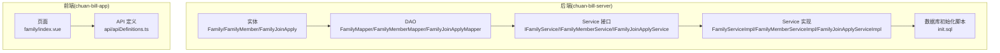
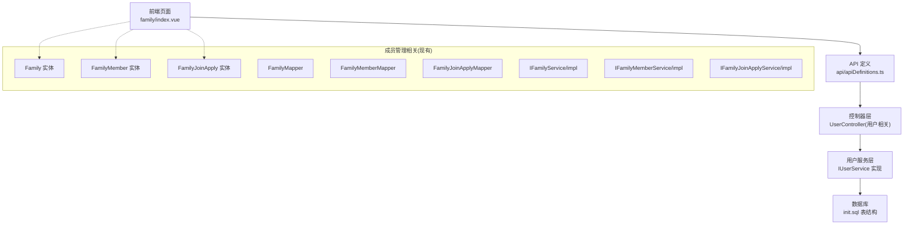
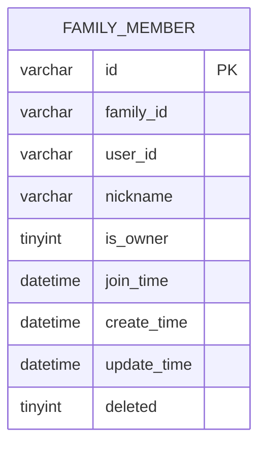
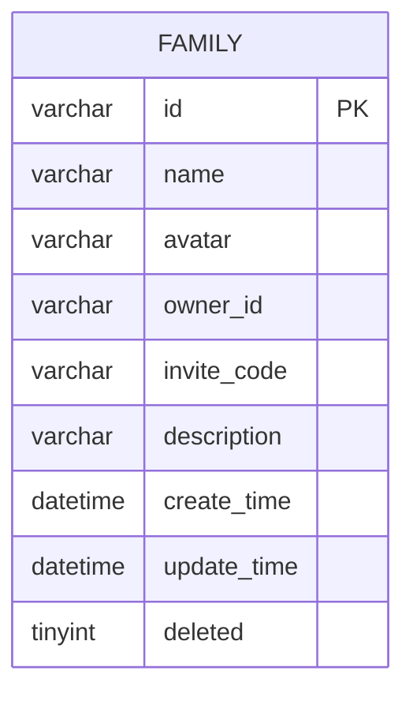
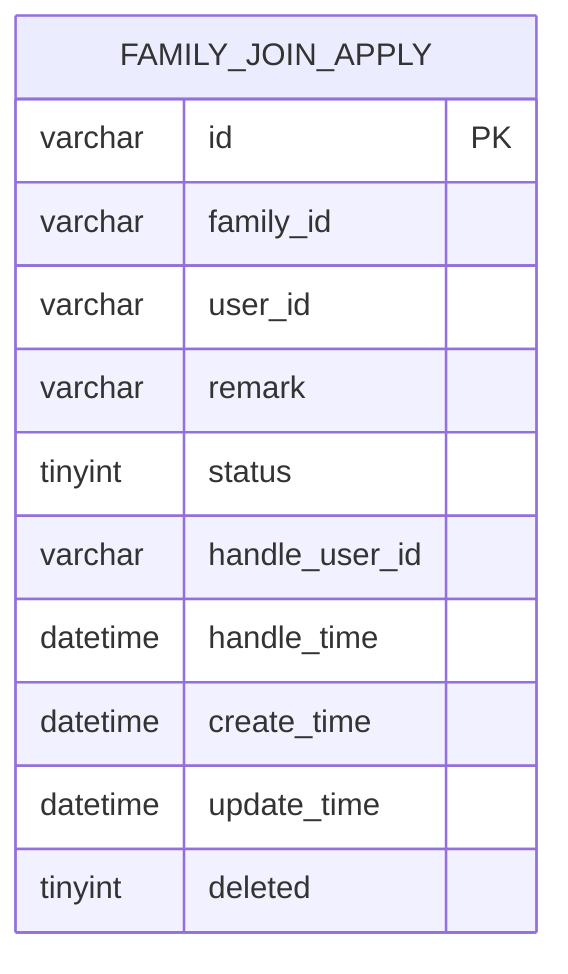
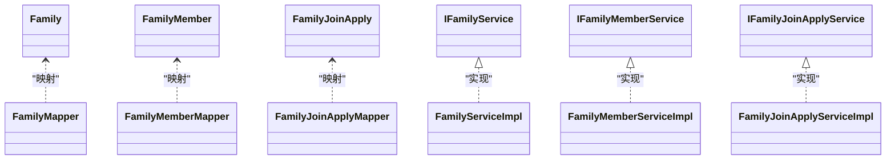

# 成员管理

<cite>
**本文引用的文件**
- [Family.java](file://chuan-bill-server/src/main/java/com/samoy/chuanbillserver/entity/Family.java)
- [FamilyMember.java](file://chuan-bill-server/src/main/java/com/samoy/chuanbillserver/entity/FamilyMember.java)
- [FamilyJoinApply.java](file://chuan-bill-server/src/main/java/com/samoy/chuanbillserver/entity/FamilyJoinApply.java)
- [FamilyMapper.java](file://chuan-bill-server/src/main/java/com/samoy/chuanbillserver/dao/FamilyMapper.java)
- [FamilyMemberMapper.java](file://chuan-bill-server/src/main/java/com/samoy/chuanbillserver/dao/FamilyMemberMapper.java)
- [FamilyJoinApplyMapper.java](file://chuan-bill-server/src/main/java/com/samoy/chuanbillserver/dao/FamilyJoinApplyMapper.java)
- [IFamilyService.java](file://chuan-bill-server/src/main/java/com/samoy/chuanbillserver/service/IFamilyService.java)
- [IFamilyMemberService.java](file://chuan-bill-server/src/main/java/com/samoy/chuanbillserver/service/IFamilyMemberService.java)
- [IFamilyJoinApplyService.java](file://chuan-bill-server/src/main/java/com/samoy/chuanbillserver/service/IFamilyJoinApplyService.java)
- [FamilyServiceImpl.java](file://chuan-bill-server/src/main/java/com/samoy/chuanbillserver/service/impl/FamilyServiceImpl.java)
- [FamilyMemberServiceImpl.java](file://chuan-bill-server/src/main/java/com/samoy/chuanbillserver/service/impl/FamilyMemberServiceImpl.java)
- [FamilyJoinApplyServiceImpl.java](file://chuan-bill-server/src/main/java/com/samoy/chuanbillserver/service/impl/FamilyJoinApplyServiceImpl.java)
- [init.sql](file://chuan-bill-server/init.sql)
- [UserController.java](file://chuan-bill-server/src/main/java/com/samoy/chuanbillserver/controller/UserController.java)
- [apiDefinitions.ts](file://chuan-bill-app/src/api/apiDefinitions.ts)
- [index.vue](file://chuan-bill-app/src/pages/family/index.vue)
</cite>

## 目录
1. [简介](#简介)
2. [项目结构](#项目结构)
3. [核心组件](#核心组件)
4. [架构总览](#架构总览)
5. [详细组件分析](#详细组件分析)
6. [依赖分析](#依赖分析)
7. [性能考虑](#性能考虑)
8. [故障排查指南](#故障排查指南)
9. [结论](#结论)
10. [附录](#附录)

## 简介
本文件围绕“成员管理”功能进行系统化说明，覆盖成员邀请机制、申请加入流程、权限分配、成员移除以及状态管理等完整闭环。同时对 FamilyMember 实体的数据模型进行深入解析，并给出前后端交互的 API 说明与前端组件现状说明，帮助开发者快速理解与扩展。

## 项目结构
成员管理涉及后端数据库表、实体、DAO、Service 层以及前端页面与 API 定义。后端采用 Spring Boot + MyBatis-Plus 架构，数据库初始化脚本定义了家庭、成员、申请三张核心表；前端基于 Vue + UniApp，页面与 API 定义位于 chuan-bill-app 目录。

图表来源
- [Family.java:1-81](file://chuan-bill-server/src/main/java/com/samoy/chuanbillserver/entity/Family.java#L1-L81)
- [FamilyMember.java:1-81](file://chuan-bill-server/src/main/java/com/samoy/chuanbillserver/entity/FamilyMember.java#L1-L81)
- [FamilyJoinApply.java:1-87](file://chuan-bill-server/src/main/java/com/samoy/chuanbillserver/entity/FamilyJoinApply.java#L1-L87)
- [FamilyMapper.java:1-15](file://chuan-bill-server/src/main/java/com/samoy/chuanbillserver/dao/FamilyMapper.java#L1-L15)
- [FamilyMemberMapper.java:1-14](file://chuan-bill-server/src/main/java/com/samoy/chuanbillserver/dao/FamilyMemberMapper.java#L1-L14)
- [FamilyJoinApplyMapper.java:1-14](file://chuan-bill-server/src/main/java/com/samoy/chuanbillserver/dao/FamilyJoinApplyMapper.java#L1-L14)
- [IFamilyService.java:1-15](file://chuan-bill-server/src/main/java/com/samoy/chuanbillserver/service/IFamilyService.java#L1-L15)
- [IFamilyMemberService.java:1-14](file://chuan-bill-server/src/main/java/com/samoy/chuanbillserver/service/IFamilyMemberService.java#L1-L14)
- [IFamilyJoinApplyService.java:1-14](file://chuan-bill-server/src/main/java/com/samoy/chuanbillserver/service/IFamilyJoinApplyService.java#L1-L14)
- [FamilyServiceImpl.java:1-19](file://chuan-bill-server/src/main/java/com/samoy/chuanbillserver/service/impl/FamilyServiceImpl.java#L1-L19)
- [FamilyMemberServiceImpl.java:1-19](file://chuan-bill-server/src/main/java/com/samoy/chuanbillserver/service/impl/FamilyMemberServiceImpl.java#L1-L19)
- [FamilyJoinApplyServiceImpl.java:1-19](file://chuan-bill-server/src/main/java/com/samoy/chuanbillserver/service/impl/FamilyJoinApplyServiceImpl.java#L1-L19)
- [init.sql:71-128](file://chuan-bill-server/init.sql#L71-L128)
- [index.vue:1-23](file://chuan-bill-app/src/pages/family/index.vue#L1-L23)
- [apiDefinitions.ts:1-38](file://chuan-bill-app/src/api/apiDefinitions.ts#L1-L38)

章节来源
- [init.sql:71-128](file://chuan-bill-server/init.sql#L71-L128)
- [Family.java:1-81](file://chuan-bill-server/src/main/java/com/samoy/chuanbillserver/entity/Family.java#L1-L81)
- [FamilyMember.java:1-81](file://chuan-bill-server/src/main/java/com/samoy/chuanbillserver/entity/FamilyMember.java#L1-L81)
- [FamilyJoinApply.java:1-87](file://chuan-bill-server/src/main/java/com/samoy/chuanbillserver/entity/FamilyJoinApply.java#L1-L87)
- [index.vue:1-23](file://chuan-bill-app/src/pages/family/index.vue#L1-L23)
- [apiDefinitions.ts:1-38](file://chuan-bill-app/src/api/apiDefinitions.ts#L1-L38)

## 核心组件
- 家庭表 t_family：存储家庭基本信息与户主标识，提供邀请码用于外部成员加入。
- 家庭成员表 t_family_member：记录成员关系、昵称、是否户主、加入时间与软删标记。
- 家庭加入申请表 t_family_join_apply：记录申请者、家庭、申请状态、处理人与时间等。

这些实体与对应的 DAO/Service 层共同构成成员管理的数据与业务基础。

章节来源
- [init.sql:71-128](file://chuan-bill-server/init.sql#L71-L128)
- [Family.java:1-81](file://chuan-bill-server/src/main/java/com/samoy/chuanbillserver/entity/Family.java#L1-L81)
- [FamilyMember.java:1-81](file://chuan-bill-server/src/main/java/com/samoy/chuanbillserver/entity/FamilyMember.java#L1-L81)
- [FamilyJoinApply.java:1-87](file://chuan-bill-server/src/main/java/com/samoy/chuanbillserver/entity/FamilyJoinApply.java#L1-L87)

## 架构总览
成员管理在后端以“实体-DAO-Service”三层实现，前端通过 API 定义调用后端接口。当前仓库中尚未发现成员管理专用的控制器或完整业务流程实现，但数据模型与接口定义已具备基础能力。

图表来源
- [index.vue:1-23](file://chuan-bill-app/src/pages/family/index.vue#L1-L23)
- [apiDefinitions.ts:1-38](file://chuan-bill-app/src/api/apiDefinitions.ts#L1-L38)
- [UserController.java:1-62](file://chuan-bill-server/src/main/java/com/samoy/chuanbillserver/controller/UserController.java#L1-L62)
- [Family.java:1-81](file://chuan-bill-server/src/main/java/com/samoy/chuanbillserver/entity/Family.java#L1-L81)
- [FamilyMember.java:1-81](file://chuan-bill-server/src/main/java/com/samoy/chuanbillserver/entity/FamilyMember.java#L1-L81)
- [FamilyJoinApply.java:1-87](file://chuan-bill-server/src/main/java/com/samoy/chuanbillserver/entity/FamilyJoinApply.java#L1-L87)
- [FamilyMapper.java:1-15](file://chuan-bill-server/src/main/java/com/samoy/chuanbillserver/dao/FamilyMapper.java#L1-L15)
- [FamilyMemberMapper.java:1-14](file://chuan-bill-server/src/main/java/com/samoy/chuanbillserver/dao/FamilyMemberMapper.java#L1-L14)
- [FamilyJoinApplyMapper.java:1-14](file://chuan-bill-server/src/main/java/com/samoy/chuanbillserver/dao/FamilyJoinApplyMapper.java#L1-L14)
- [IFamilyService.java:1-15](file://chuan-bill-server/src/main/java/com/samoy/chuanbillserver/service/IFamilyService.java#L1-L15)
- [IFamilyMemberService.java:1-14](file://chuan-bill-server/src/main/java/com/samoy/chuanbillserver/service/IFamilyMemberService.java#L1-L14)
- [IFamilyJoinApplyService.java:1-14](file://chuan-bill-server/src/main/java/com/samoy/chuanbillserver/service/IFamilyJoinApplyService.java#L1-L14)
- [FamilyServiceImpl.java:1-19](file://chuan-bill-server/src/main/java/com/samoy/chuanbillserver/service/impl/FamilyServiceImpl.java#L1-L19)
- [FamilyMemberServiceImpl.java:1-19](file://chuan-bill-server/src/main/java/com/samoy/chuanbillserver/service/impl/FamilyMemberServiceImpl.java#L1-L19)
- [FamilyJoinApplyServiceImpl.java:1-19](file://chuan-bill-server/src/main/java/com/samoy/chuanbillserver/service/impl/FamilyJoinApplyServiceImpl.java#L1-L19)
- [init.sql:71-128](file://chuan-bill-server/init.sql#L71-L128)

## 详细组件分析

### 数据模型：FamilyMember 实体
FamilyMember 描述家庭成员关系与状态，关键字段如下：
- 关系标识：family_id、user_id
- 昵称：nickname
- 角色标识：is_owner（户主）
- 时间戳：join_time、create_time、update_time
- 软删：deleted
- 唯一索引：family_id+user_id 组合唯一，避免重复成员

图表来源
- [FamilyMember.java:1-81](file://chuan-bill-server/src/main/java/com/samoy/chuanbillserver/entity/FamilyMember.java#L1-L81)
- [init.sql:92-107](file://chuan-bill-server/init.sql#L92-L107)

章节来源
- [FamilyMember.java:1-81](file://chuan-bill-server/src/main/java/com/samoy/chuanbillserver/entity/FamilyMember.java#L1-L81)
- [init.sql:92-107](file://chuan-bill-server/init.sql#L92-L107)

### 数据模型：Family 实体
Family 提供家庭基本信息与户主标识，其中 invite_code 用于外部成员加入家庭。

图表来源
- [Family.java:1-81](file://chuan-bill-server/src/main/java/com/samoy/chuanbillserver/entity/Family.java#L1-L81)
- [init.sql:74-87](file://chuan-bill-server/init.sql#L74-L87)

章节来源
- [Family.java:1-81](file://chuan-bill-server/src/main/java/com/samoy/chuanbillserver/entity/Family.java#L1-L81)
- [init.sql:74-87](file://chuan-bill-server/init.sql#L74-L87)

### 数据模型：FamilyJoinApply 实体
FamilyJoinApply 记录成员申请加入家庭的状态流转，包括申请者、家庭、状态、处理人与时间等。

图表来源
- [FamilyJoinApply.java:1-87](file://chuan-bill-server/src/main/java/com/samoy/chuanbillserver/entity/FamilyJoinApply.java#L1-L87)
- [init.sql:112-128](file://chuan-bill-server/init.sql#L112-L128)

章节来源
- [FamilyJoinApply.java:1-87](file://chuan-bill-server/src/main/java/com/samoy/chuanbillserver/entity/FamilyJoinApply.java#L1-L87)
- [init.sql:112-128](file://chuan-bill-server/init.sql#L112-L128)

### 成员邀请机制（邀请链接生成、有效期设置、权限控制）
- 邀请链接生成：通过 Family.invite_code 字段标识家庭邀请入口，前端可据此发起加入流程。
- 有效期设置：当前实体未包含邀请码有效期字段，可在扩展时增加 expire_time 字段并在校验时判断。
- 权限控制：仅家庭户主(owner_id)具备邀请与审批权限；当前实现未在实体中体现，需在业务层校验。

章节来源
- [Family.java:1-81](file://chuan-bill-server/src/main/java/com/samoy/chuanbillserver/entity/Family.java#L1-L81)
- [init.sql:74-87](file://chuan-bill-server/init.sql#L74-L87)

### 申请加入流程（申请提交、管理员审批、状态通知）
- 申请提交：前端提交申请到 t_family_join_apply，状态默认待处理。
- 管理员审批：户主或授权管理员更新状态（同意/拒绝），记录处理人与时间。
- 状态通知：当前实体未包含通知字段，可在扩展时增加通知相关字段或通过消息服务异步通知。

章节来源
- [FamilyJoinApply.java:1-87](file://chuan-bill-server/src/main/java/com/samoy/chuanbillserver/entity/FamilyJoinApply.java#L1-L87)
- [init.sql:112-128](file://chuan-bill-server/init.sql#L112-L128)

### 权限分配（管理员角色、普通成员权限、权限变更）
- 角色定义：is_owner=1 表示户主，具备最高权限；普通成员权限较低。
- 权限继承：户主拥有成员管理、审批、邀请等权限；普通成员仅能查看与基本操作。
- 变更流程：户主可将某成员提升为户主或降级为普通成员，需记录变更历史与时间。

章节来源
- [FamilyMember.java:1-81](file://chuan-bill-server/src/main/java/com/samoy/chuanbillserver/entity/FamilyMember.java#L1-L81)
- [init.sql:92-107](file://chuan-bill-server/init.sql#L92-L107)

### 成员移除（主动退出、管理员移除、数据清理）
- 主动退出：成员可自行退出，标记 deleted 并清理相关关联。
- 管理员移除：户主可移除成员，同样标记 deleted 并清理关联。
- 数据清理：软删 deleted=1，避免物理删除影响审计与恢复。

章节来源
- [FamilyMember.java:1-81](file://chuan-bill-server/src/main/java/com/samoy/chuanbillserver/entity/FamilyMember.java#L1-L81)
- [init.sql:92-107](file://chuan-bill-server/init.sql#L92-L107)

### 成员状态管理（有效成员、申请中成员、被拒绝成员、已移除成员）
- 有效成员：deleted=0 且 is_owner 或普通成员。
- 申请中成员：t_family_join_apply.status=0。
- 被拒绝成员：t_family_join_apply.status=2。
- 已移除成员：deleted=1。

章节来源
- [FamilyMember.java:1-81](file://chuan-bill-server/src/main/java/com/samoy/chuanbillserver/entity/FamilyMember.java#L1-L81)
- [FamilyJoinApply.java:1-87](file://chuan-bill-server/src/main/java/com/samoy/chuanbillserver/entity/FamilyJoinApply.java#L1-L87)
- [init.sql:92-128](file://chuan-bill-server/init.sql#L92-L128)

### API 接口说明（基于现有定义）
以下接口与成员管理相关或可复用，具体成员管理接口需在后续扩展中补充：
- 用户资料获取：GET /user/profile
- 更新用户资料：POST /user/updateProfile
- 更新密码（旧密码）：POST /user/updatePasswordByOld
- 更新密码（验证码）：POST /user/updatePasswordByCode
- 检查是否设置密码：GET /user/hasPassword

章节来源
- [apiDefinitions.ts:19-37](file://chuan-bill-app/src/api/apiDefinitions.ts#L19-L37)
- [UserController.java:1-62](file://chuan-bill-server/src/main/java/com/samoy/chuanbillserver/controller/UserController.java#L1-L62)

### 前端组件实现现状
- 页面：family/index.vue 当前仅为占位页面，未包含成员管理相关 UI。
- API：api/apiDefinitions.ts 中未包含成员管理专用接口，建议新增邀请、申请、审批、权限变更等接口定义。

章节来源
- [index.vue:1-23](file://chuan-bill-app/src/pages/family/index.vue#L1-L23)
- [apiDefinitions.ts:1-38](file://chuan-bill-app/src/api/apiDefinitions.ts#L1-L38)

## 依赖分析
后端采用 MyBatis-Plus 的 ServiceImpl 模式，DAO 继承 BaseMapper，Service 接口与实现分别对应三张表。当前成员管理相关 Service 均为空实现，需在后续扩展中注入业务逻辑。

图表来源
- [Family.java:1-81](file://chuan-bill-server/src/main/java/com/samoy/chuanbillserver/entity/Family.java#L1-L81)
- [FamilyMember.java:1-81](file://chuan-bill-server/src/main/java/com/samoy/chuanbillserver/entity/FamilyMember.java#L1-L81)
- [FamilyJoinApply.java:1-87](file://chuan-bill-server/src/main/java/com/samoy/chuanbillserver/entity/FamilyJoinApply.java#L1-L87)
- [FamilyMapper.java:1-15](file://chuan-bill-server/src/main/java/com/samoy/chuanbillserver/dao/FamilyMapper.java#L1-L15)
- [FamilyMemberMapper.java:1-14](file://chuan-bill-server/src/main/java/com/samoy/chuanbillserver/dao/FamilyMemberMapper.java#L1-L14)
- [FamilyJoinApplyMapper.java:1-14](file://chuan-bill-server/src/main/java/com/samoy/chuanbillserver/dao/FamilyJoinApplyMapper.java#L1-L14)
- [IFamilyService.java:1-15](file://chuan-bill-server/src/main/java/com/samoy/chuanbillserver/service/IFamilyService.java#L1-L15)
- [IFamilyMemberService.java:1-14](file://chuan-bill-server/src/main/java/com/samoy/chuanbillserver/service/IFamilyMemberService.java#L1-L14)
- [IFamilyJoinApplyService.java:1-14](file://chuan-bill-server/src/main/java/com/samoy/chuanbillserver/service/IFamilyJoinApplyService.java#L1-L14)
- [FamilyServiceImpl.java:1-19](file://chuan-bill-server/src/main/java/com/samoy/chuanbillserver/service/impl/FamilyServiceImpl.java#L1-L19)
- [FamilyMemberServiceImpl.java:1-19](file://chuan-bill-server/src/main/java/com/samoy/chuanbillserver/service/impl/FamilyMemberServiceImpl.java#L1-L19)
- [FamilyJoinApplyServiceImpl.java:1-19](file://chuan-bill-server/src/main/java/com/samoy/chuanbillserver/service/impl/FamilyJoinApplyServiceImpl.java#L1-L19)

## 性能考虑
- 索引设计：t_family_member 对 (family_id,user_id) 建有唯一索引，避免重复成员；t_family_join_apply 对 status、create_time 建有索引，便于按状态查询与排序。
- 软删策略：deleted 字段统一使用软删，减少全表扫描与数据丢失风险。
- 批量操作：审批与权限变更建议批量处理，结合事务保证一致性。

## 故障排查指南
- 申请状态异常：检查 t_family_join_apply.status 字段是否正确更新，确认 handle_user_id 与 handle_time 是否写入。
- 成员重复：检查 t_family_member 的唯一索引约束是否生效，避免重复插入。
- 权限不足：确认调用方是否为户主或具备相应权限，必要时在业务层增加鉴权校验。
- 数据不一致：核对 create_time、update_time 是否正确更新，确保事务边界清晰。

## 结论
当前仓库已具备成员管理的基础数据模型与接口定义，但缺少完整的成员管理控制器与业务流程实现。建议在现有实体与 Service 基础上，补充成员邀请、申请审批、权限变更与移除等核心流程，并完善前端页面与 API 定义，形成完整的成员管理体系。

## 附录
- 数据库初始化脚本位置：[init.sql:71-128](file://chuan-bill-server/init.sql#L71-L128)
- 前端页面位置：[index.vue:1-23](file://chuan-bill-app/src/pages/family/index.vue#L1-L23)
- API 定义位置：[apiDefinitions.ts:1-38](file://chuan-bill-app/src/api/apiDefinitions.ts#L1-L38)