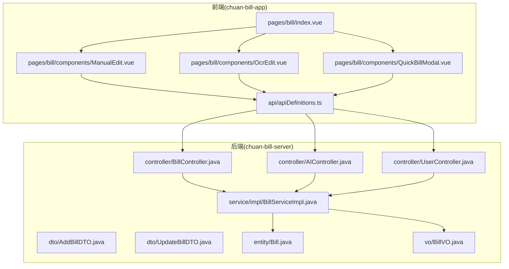
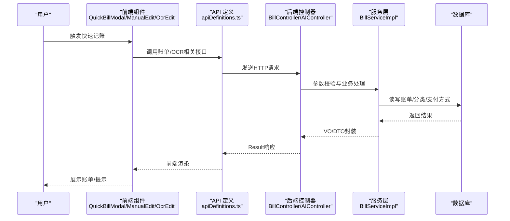
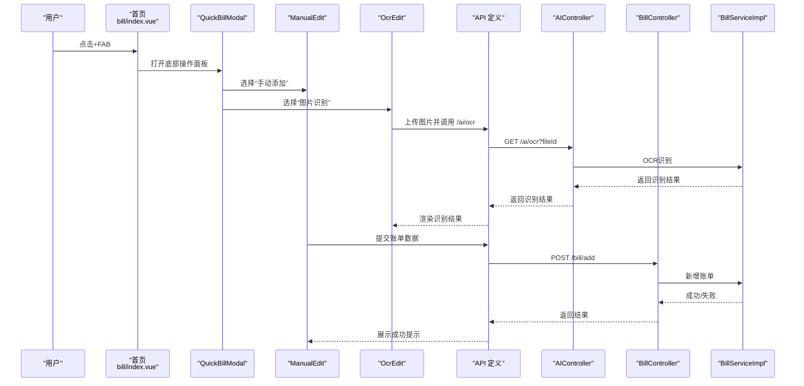
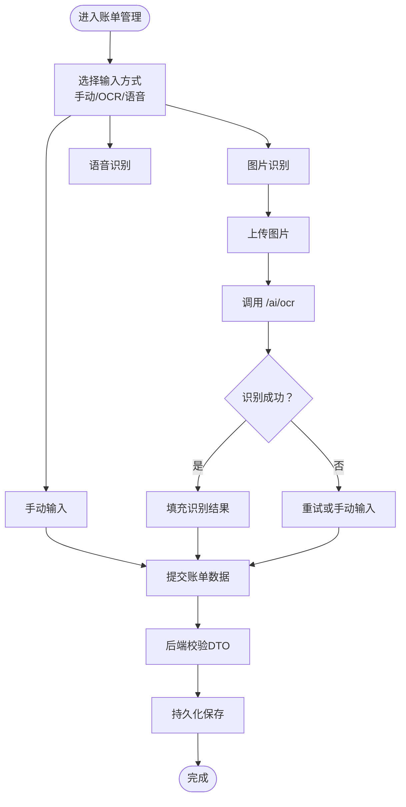
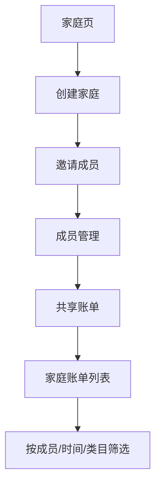
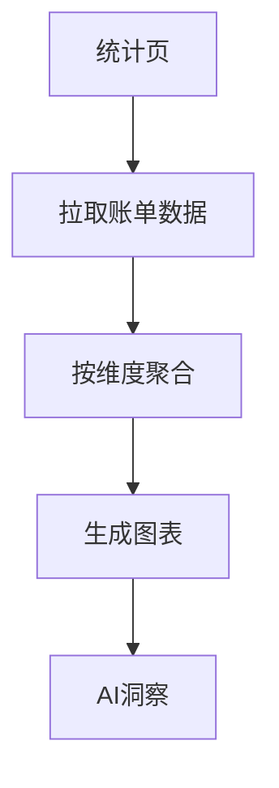
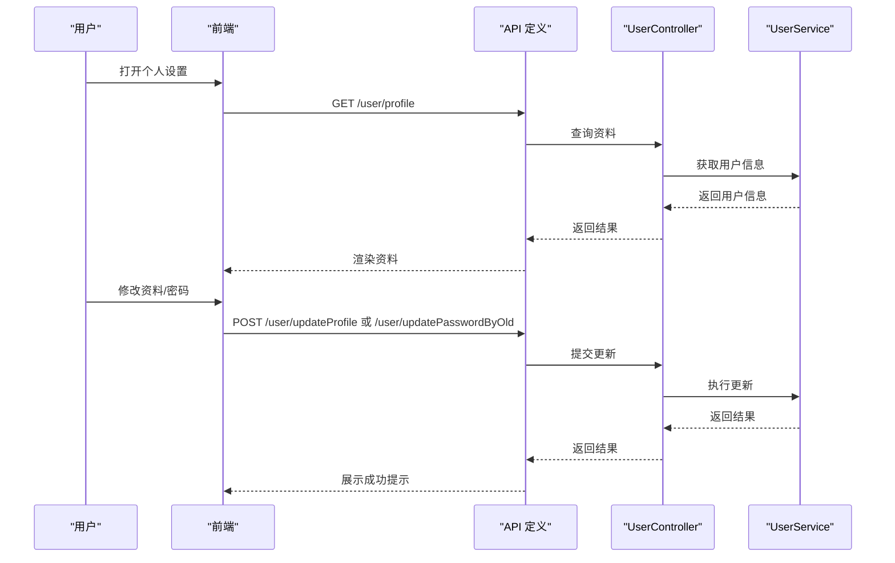
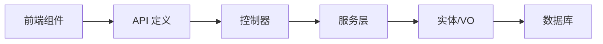

# 核心功能模块

<cite>
**本文引用的文件**
- [index.vue](file://chuan-bill-app/src/pages/bill/index.vue)
- [ManualEdit.vue](file://chuan-bill-app/src/pages/bill/components/ManualEdit.vue)
- [OcrEdit.vue](file://chuan-bill-app/src/pages/bill/components/OcrEdit.vue)
- [QuickBillModal.vue](file://chuan-bill-app/src/pages/bill/components/QuickBillModal.vue)
- [apiDefinitions.ts](file://chuan-bill-app/src/api/apiDefinitions.ts)
- [BillController.java](file://chuan-bill-server/src/main/java/com/samoy/chuanbillserver/controller/BillController.java)
- [AIController.java](file://chuan-bill-server/src/main/java/com/samoy/chuanbillserver/controller/AIController.java)
- [UserController.java](file://chuan-bill-server/src/main/java/com/samoy/chuanbillserver/controller/UserController.java)
- [BillServiceImpl.java](file://chuan-bill-server/src/main/java/com/samoy/chuanbillserver/service/impl/BillServiceImpl.java)
- [AddBillDTO.java](file://chuan-bill-server/src/main/java/com/samoy/chuanbillserver/dto/AddBillDTO.java)
- [UpdateBillDTO.java](file://chuan-bill-server/src/main/java/com/samoy/chuanbillserver/dto/UpdateBillDTO.java)
- [Bill.java](file://chuan-bill-server/src/main/java/com/samoy/chuanbillserver/entity/Bill.java)
- [BillVO.java](file://chuan-bill-server/src/main/java/com/samoy/chuanbillserver/vo/BillVO.java)
- [index.vue](file://chuan-bill-app/src/pages/family/index.vue)
- [index.vue](file://chuan-bill-app/src/pages/statistics/index.vue)
- [index.vue](file://chuan-bill-app/src/pages/mine/index.vue)
</cite>

## 目录
1. [引言](#引言)
2. [项目结构](#项目结构)
3. [核心组件](#核心组件)
4. [架构总览](#架构总览)
5. [详细组件分析](#详细组件分析)
6. [依赖分析](#依赖分析)
7. [性能考虑](#性能考虑)
8. [故障排查指南](#故障排查指南)
9. [结论](#结论)
10. [附录](#附录)

## 引言
本文件面向“小川记账”核心功能模块，系统化梳理四大模块：账单管理、家庭共享、统计分析、用户中心。重点覆盖：
- 账单管理的多种输入方式（手动输入、OCR识别、语音输入、快速记账）的实现原理与使用场景
- 家庭共享功能的家庭创建、成员管理、权限控制、共享账单机制
- 统计分析模块的数据聚合算法、图表可视化实现、AI智能分析功能
- 用户中心的个人设置、账户管理、消息中心等功能特性
- 各模块的API接口说明、数据模型设计、前端组件实现与后端服务逻辑

## 项目结构
项目采用前后端分离架构：
- 前端基于 Vue3 + UniApp，页面位于 chuan-bill-app/src/pages 下，组件位于对应页面的 components 子目录
- 后端基于 Spring Boot，控制器位于 chuan-bill-server/src/main/java/com/samoy/chuanbillserver/controller，服务层位于 service/impl，实体与 VO 位于 entity/vo，DTO 位于 dto

图示来源
- [index.vue:1-54](file://chuan-bill-app/src/pages/bill/index.vue#L1-L54)
- [ManualEdit.vue:1-174](file://chuan-bill-app/src/pages/bill/components/ManualEdit.vue#L1-L174)
- [OcrEdit.vue:1-167](file://chuan-bill-app/src/pages/bill/components/OcrEdit.vue#L1-L167)
- [QuickBillModal.vue:1-64](file://chuan-bill-app/src/pages/bill/components/QuickBillModal.vue#L1-L64)
- [apiDefinitions.ts:1-38](file://chuan-bill-app/src/api/apiDefinitions.ts#L1-L38)
- [BillController.java:1-91](file://chuan-bill-server/src/main/java/com/samoy/chuanbillserver/controller/BillController.java#L1-L91)
- [AIController.java:1-26](file://chuan-bill-server/src/main/java/com/samoy/chuanbillserver/controller/AIController.java#L1-L26)
- [UserController.java:1-62](file://chuan-bill-server/src/main/java/com/samoy/chuanbillserver/controller/UserController.java#L1-L62)
- [BillServiceImpl.java:1-244](file://chuan-bill-server/src/main/java/com/samoy/chuanbillserver/service/impl/BillServiceImpl.java#L1-L244)
- [AddBillDTO.java:1-44](file://chuan-bill-server/src/main/java/com/samoy/chuanbillserver/dto/AddBillDTO.java#L1-L44)
- [UpdateBillDTO.java:1-39](file://chuan-bill-server/src/main/java/com/samoy/chuanbillserver/dto/UpdateBillDTO.java#L1-L39)
- [Bill.java:1-113](file://chuan-bill-server/src/main/java/com/samoy/chuanbillserver/entity/Bill.java#L1-L113)
- [BillVO.java:1-44](file://chuan-bill-server/src/main/java/com/samoy/chuanbillserver/vo/BillVO.java#L1-L44)

章节来源
- [index.vue:1-54](file://chuan-bill-app/src/pages/bill/index.vue#L1-L54)
- [apiDefinitions.ts:1-38](file://chuan-bill-app/src/api/apiDefinitions.ts#L1-L38)

## 核心组件
- 账单管理：提供账单列表、详情、新增、更新、删除、分类与支付方式查询；支持快速记账入口与多种输入方式
- 家庭共享：页面占位，后续扩展家庭创建、成员管理、权限控制与共享账单
- 统计分析：页面占位，后续扩展数据聚合、图表可视化与AI智能分析
- 用户中心：提供用户资料查询与更新、密码修改、是否有密码检查等

章节来源
- [index.vue:1-54](file://chuan-bill-app/src/pages/bill/index.vue#L1-L54)
- [index.vue:1-23](file://chuan-bill-app/src/pages/family/index.vue#L1-L23)
- [index.vue:1-23](file://chuan-bill-app/src/pages/statistics/index.vue#L1-L23)
- [index.vue:1-23](file://chuan-bill-app/src/pages/mine/index.vue#L1-L23)

## 架构总览
整体采用“前端组件 + API 定义 + 后端控制器/服务/实体”的分层设计。前端通过 Alova 的 API 定义调用后端 REST 接口，后端控制器负责鉴权与参数校验，服务层执行业务逻辑并访问数据库。

图示来源
- [QuickBillModal.vue:1-64](file://chuan-bill-app/src/pages/bill/components/QuickBillModal.vue#L1-L64)
- [ManualEdit.vue:1-174](file://chuan-bill-app/src/pages/bill/components/ManualEdit.vue#L1-L174)
- [OcrEdit.vue:1-167](file://chuan-bill-app/src/pages/bill/components/OcrEdit.vue#L1-L167)
- [apiDefinitions.ts:1-38](file://chuan-bill-app/src/api/apiDefinitions.ts#L1-L38)
- [BillController.java:1-91](file://chuan-bill-server/src/main/java/com/samoy/chuanbillserver/controller/BillController.java#L1-L91)
- [AIController.java:1-26](file://chuan-bill-server/src/main/java/com/samoy/chuanbillserver/controller/AIController.java#L1-L26)
- [BillServiceImpl.java:1-244](file://chuan-bill-server/src/main/java/com/samoy/chuanbillserver/service/impl/BillServiceImpl.java#L1-L244)

## 详细组件分析

### 账单管理模块

#### 业务流程与用户交互
- 快速记账入口：首页悬浮按钮触发底部弹出式操作面板，支持“手动添加”“图片识别”“语音识别”
- 手动输入：选择收支类型、金额、名称、时间、类目、支付方式、是否共享到家庭、备注
- 图片识别：上传图片，调用AI OCR接口，展示识别结果或失败重试
- 语音输入：页面占位，后续接入语音识别能力
- 列表与筛选：支持按日期、类型、类目、金额范围、名称/备注模糊搜索

图示来源
- [index.vue:1-54](file://chuan-bill-app/src/pages/bill/index.vue#L1-L54)
- [QuickBillModal.vue:1-64](file://chuan-bill-app/src/pages/bill/components/QuickBillModal.vue#L1-L64)
- [ManualEdit.vue:1-174](file://chuan-bill-app/src/pages/bill/components/ManualEdit.vue#L1-L174)
- [OcrEdit.vue:1-167](file://chuan-bill-app/src/pages/bill/components/OcrEdit.vue#L1-L167)
- [apiDefinitions.ts:1-38](file://chuan-bill-app/src/api/apiDefinitions.ts#L1-L38)
- [AIController.java:1-26](file://chuan-bill-server/src/main/java/com/samoy/chuanbillserver/controller/AIController.java#L1-L26)
- [BillController.java:1-91](file://chuan-bill-server/src/main/java/com/samoy/chuanbillserver/controller/BillController.java#L1-L91)
- [BillServiceImpl.java:1-244](file://chuan-bill-server/src/main/java/com/samoy/chuanbillserver/service/impl/BillServiceImpl.java#L1-L244)

#### 数据模型与API定义
- 请求DTO
  - 添加账单：AddBillDTO（名称、类目ID、支付方式ID、类型、金额、时间、备注、家庭ID、来源）
  - 更新账单：UpdateBillDTO（ID、名称、类目ID、支付方式ID、类型、金额、时间、备注）
- 实体与视图
  - 实体：Bill（包含用户ID、家庭ID、名称、类目ID、支付方式ID、类型、金额、时间、备注、来源、创建/更新时间、删除标记）
  - 视图：BillVO（包含分类与支付方式的简要信息）
- API
  - 账单：GET /bill/list、GET /bill/detail、POST /bill/add、POST /bill/update、POST /bill/delete、GET /bill/categories、GET /bill/payment-methods
  - AI：GET /ai/ocr

章节来源
- [AddBillDTO.java:1-44](file://chuan-bill-server/src/main/java/com/samoy/chuanbillserver/dto/AddBillDTO.java#L1-L44)
- [UpdateBillDTO.java:1-39](file://chuan-bill-server/src/main/java/com/samoy/chuanbillserver/dto/UpdateBillDTO.java#L1-L39)
- [Bill.java:1-113](file://chuan-bill-server/src/main/java/com/samoy/chuanbillserver/entity/Bill.java#L1-L113)
- [BillVO.java:1-44](file://chuan-bill-server/src/main/java/com/samoy/chuanbillserver/vo/BillVO.java#L1-L44)
- [apiDefinitions.ts:1-38](file://chuan-bill-app/src/api/apiDefinitions.ts#L1-L38)
- [BillController.java:1-91](file://chuan-bill-server/src/main/java/com/samoy/chuanbillserver/controller/BillController.java#L1-L91)
- [AIController.java:1-26](file://chuan-bill-server/src/main/java/com/samoy/chuanbillserver/controller/AIController.java#L1-L26)

#### 处理逻辑与权限控制
- 新增账单：服务层将 DTO 映射为实体，可选设置家庭ID，保存至数据库
- 更新/删除/查看：先按ID查询，再进行权限校验（仅允许本人操作），最后执行更新/删除/返回详情
- 列表查询：支持多条件过滤（日期范围、类型、类目、金额范围、名称/备注模糊），批量预加载分类与支付方式，避免N+1查询

图示来源
- [QuickBillModal.vue:1-64](file://chuan-bill-app/src/pages/bill/components/QuickBillModal.vue#L1-L64)
- [ManualEdit.vue:1-174](file://chuan-bill-app/src/pages/bill/components/ManualEdit.vue#L1-L174)
- [OcrEdit.vue:1-167](file://chuan-bill-app/src/pages/bill/components/OcrEdit.vue#L1-L167)
- [BillServiceImpl.java:125-173](file://chuan-bill-server/src/main/java/com/samoy/chuanbillserver/service/impl/BillServiceImpl.java#L125-L173)

章节来源
- [BillServiceImpl.java:50-123](file://chuan-bill-server/src/main/java/com/samoy/chuanbillserver/service/impl/BillServiceImpl.java#L50-L123)

### 家庭共享模块
- 当前状态：页面占位，尚未实现具体功能
- 设计建议（概念性说明）
  - 家庭创建：管理员发起创建，设置家庭名称、初始成员
  - 成员管理：邀请/拉人入群、移除成员、角色权限（管理员/成员）
  - 权限控制：共享账单仅对家庭成员可见，编辑需权限
  - 共享账单：账单创建时可选择共享到家庭，账单列表支持家庭维度筛选

图示来源
- [index.vue:1-23](file://chuan-bill-app/src/pages/family/index.vue#L1-L23)

章节来源
- [index.vue:1-23](file://chuan-bill-app/src/pages/family/index.vue#L1-L23)

### 统计分析模块
- 当前状态：页面占位，尚未实现具体功能
- 设计建议（概念性说明）
  - 数据聚合：按日/周/月/年汇总收支、类目占比、支付方式分布
  - 图表可视化：柱状图、饼图、折线图等
  - AI智能分析：异常消费提醒、趋势预测、预算对比告警

图示来源
- [index.vue:1-23](file://chuan-bill-app/src/pages/statistics/index.vue#L1-L23)

章节来源
- [index.vue:1-23](file://chuan-bill-app/src/pages/statistics/index.vue#L1-L23)

### 用户中心模块
- 功能要点
  - 获取用户资料：GET /user/profile
  - 更新用户资料：POST /user/updateProfile
  - 通过旧密码修改密码：POST /user/updatePasswordByOld
  - 通过验证码修改密码：POST /user/updatePasswordByCode（无需登录）
  - 检查是否设置密码：GET /user/hasPassword

图示来源
- [UserController.java:1-62](file://chuan-bill-server/src/main/java/com/samoy/chuanbillserver/controller/UserController.java#L1-L62)
- [apiDefinitions.ts:1-38](file://chuan-bill-app/src/api/apiDefinitions.ts#L1-L38)

章节来源
- [UserController.java:1-62](file://chuan-bill-server/src/main/java/com/samoy/chuanbillserver/controller/UserController.java#L1-L62)

## 依赖分析
- 前端组件依赖 API 定义，API 定义映射到后端控制器
- 控制器依赖服务层，服务层依赖实体与 VO，并访问数据库
- 账单管理涉及 DTO/VO、实体、控制器、服务层的完整链路
- 家庭共享与统计分析目前为页面占位，暂无后端实现

图示来源
- [apiDefinitions.ts:1-38](file://chuan-bill-app/src/api/apiDefinitions.ts#L1-L38)
- [BillController.java:1-91](file://chuan-bill-server/src/main/java/com/samoy/chuanbillserver/controller/BillController.java#L1-L91)
- [BillServiceImpl.java:1-244](file://chuan-bill-server/src/main/java/com/samoy/chuanbillserver/service/impl/BillServiceImpl.java#L1-L244)
- [Bill.java:1-113](file://chuan-bill-server/src/main/java/com/samoy/chuanbillserver/entity/Bill.java#L1-L113)
- [BillVO.java:1-44](file://chuan-bill-server/src/main/java/com/samoy/chuanbillserver/vo/BillVO.java#L1-L44)

章节来源
- [apiDefinitions.ts:1-38](file://chuan-bill-app/src/api/apiDefinitions.ts#L1-L38)
- [BillController.java:1-91](file://chuan-bill-server/src/main/java/com/samoy/chuanbillserver/controller/BillController.java#L1-L91)
- [BillServiceImpl.java:1-244](file://chuan-bill-server/src/main/java/com/samoy/chuanbillserver/service/impl/BillServiceImpl.java#L1-L244)

## 性能考虑
- 列表查询优化：服务层对分类与支付方式进行批量预加载，减少N+1查询，提升分页性能
- 金额序列化：使用字符串格式输出金额，避免浮点误差
- 日期范围查询：统一格式化时间边界，确保查询准确性
- 前端上传：OCR上传采用一次性限制与预览动画，改善用户体验

章节来源
- [BillServiceImpl.java:90-122](file://chuan-bill-server/src/main/java/com/samoy/chuanbillserver/service/impl/BillServiceImpl.java#L90-L122)
- [BillVO.java:28-32](file://chuan-bill-server/src/main/java/com/samoy/chuanbillserver/vo/BillVO.java#L28-L32)

## 故障排查指南
- OCR识别失败
  - 现象：上传图片后显示失败，提供“重试/手动输入”
  - 排查：确认上传接口可用、fileId有效、AI服务正常
- 权限错误
  - 现象：更新/删除/查看账单时报错
  - 排查：确认当前登录用户与账单所属用户一致
- 参数校验失败
  - 现象：新增/更新账单返回参数错误
  - 排查：核对 DTO 字段约束（必填、长度、金额范围、类型枚举）

章节来源
- [OcrEdit.vue:116-132](file://chuan-bill-app/src/pages/bill/components/OcrEdit.vue#L116-L132)
- [BillServiceImpl.java:144-173](file://chuan-bill-server/src/main/java/com/samoy/chuanbillserver/service/impl/BillServiceImpl.java#L144-L173)
- [AddBillDTO.java:14-42](file://chuan-bill-server/src/main/java/com/samoy/chuanbillserver/dto/AddBillDTO.java#L14-L42)
- [UpdateBillDTO.java:13-37](file://chuan-bill-server/src/main/java/com/samoy/chuanbillserver/dto/UpdateBillDTO.java#L13-L37)

## 结论
- 账单管理模块已完成基础输入与列表能力，OCR识别与语音输入处于可扩展阶段
- 家庭共享与统计分析模块目前为页面占位，后续应完善权限与数据聚合逻辑
- 用户中心提供基础资料与密码管理能力，建议增强消息中心与安全策略
- 建议持续完善测试与监控，保障多输入方式与权限控制的稳定性

## 附录

### API 接口一览（节选）
- 账单
  - GET /bill/list：分页获取账单列表（支持日期、类型、类目、金额、名称/备注筛选）
  - GET /bill/detail：获取账单详情
  - POST /bill/add：新增账单
  - POST /bill/update：更新账单
  - POST /bill/delete：删除账单
  - GET /bill/categories：获取分类列表
  - GET /bill/payment-methods：获取支付方式列表
- AI
  - GET /ai/ocr：OCR识别图片中的账单信息
- 用户
  - GET /user/profile：获取用户资料
  - POST /user/updateProfile：更新用户资料
  - POST /user/updatePasswordByOld：通过旧密码修改密码
  - POST /user/updatePasswordByCode：通过验证码修改密码
  - GET /user/hasPassword：检查是否设置密码

章节来源
- [apiDefinitions.ts:19-37](file://chuan-bill-app/src/api/apiDefinitions.ts#L19-L37)
- [BillController.java:37-89](file://chuan-bill-server/src/main/java/com/samoy/chuanbillserver/controller/BillController.java#L37-L89)
- [AIController.java:20-24](file://chuan-bill-server/src/main/java/com/samoy/chuanbillserver/controller/AIController.java#L20-L24)
- [UserController.java:25-60](file://chuan-bill-server/src/main/java/com/samoy/chuanbillserver/controller/UserController.java#L25-L60)