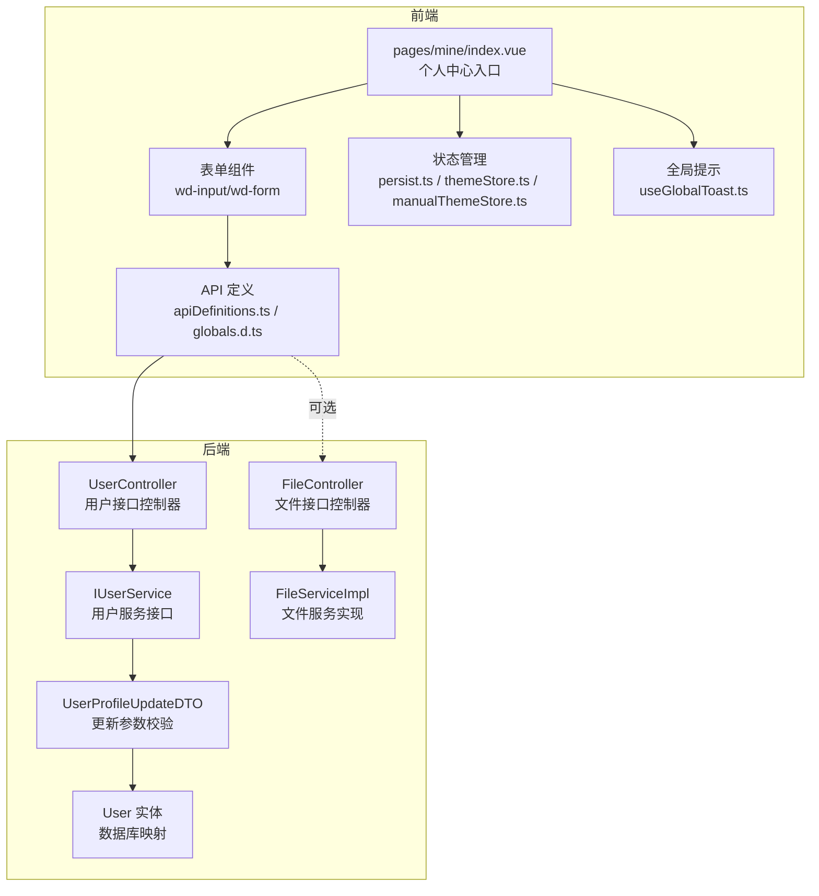
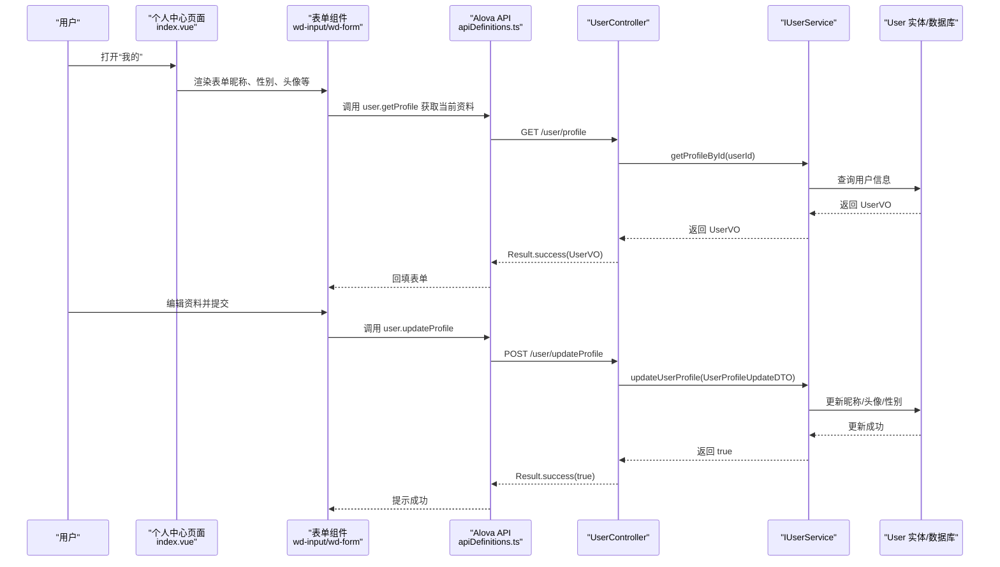
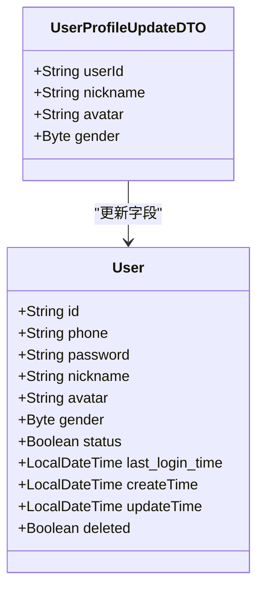
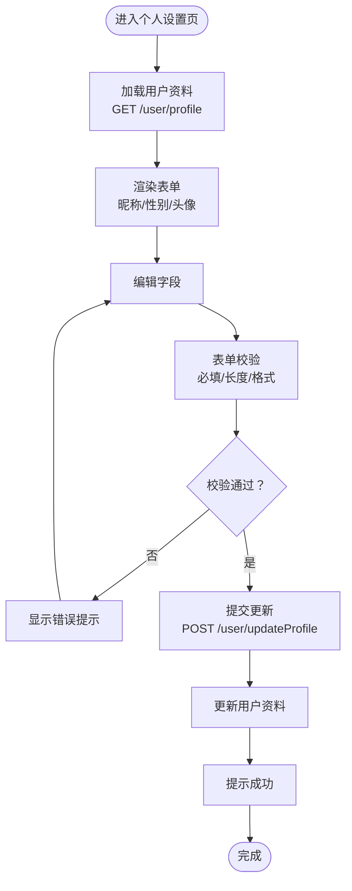
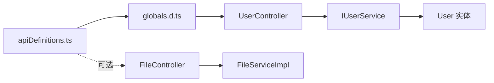

# 个人设置

<cite>
**本文引用的文件**
- [UserController.java](file://chuan-bill-server/src/main/java/com/samoy/chuanbillserver/controller/UserController.java)
- [UserProfileUpdateDTO.java](file://chuan-bill-server/src/main/java/com/samoy/chuanbillserver/dto/UserProfileUpdateDTO.java)
- [User.java](file://chuan-bill-server/src/main/java/com/samoy/chuanbillserver/entity/User.java)
- [IUserService.java](file://chuan-bill-server/src/main/java/com/samoy/chuanbillserver/service/IUserService.java)
- [FileController.java](file://chuan-bill-server/src/main/java/com/samoy/chuanbillserver/controller/FileController.java)
- [FileServiceImpl.java](file://chuan-bill-server/src/main/java/com/samoy/chuanbillserver/service/impl/FileServiceImpl.java)
- [apiDefinitions.ts](file://chuan-bill-app/src/api/apiDefinitions.ts)
- [globals.d.ts](file://chuan-bill-app/src/api/globals.d.ts)
- [index.vue](file://chuan-bill-app/src/pages/mine/index.vue)
- [persist.ts](file://chuan-bill-app/src/store/persist.ts)
- [themeStore.ts](file://chuan-bill-app/src/store/themeStore.ts)
- [manualThemeStore.ts](file://chuan-bill-app/src/store/manualThemeStore.ts)
- [useGlobalToast.ts](file://chuan-bill-app/src/composables/useGlobalToast.ts)
- [PrivacyPopup.vue](file://chuan-bill-app/src/components/PrivacyPopup.vue)
- [wd-input-vendor.js](file://chuan-bill-app/dist/dev/mp-weixin/node-modules/wot-design-uni/components/wd-input/wd-input-vendor.js)
- [wd-form-vendor.js](file://chuan-bill-app/dist/dev/mp-weixin/node-modules/wot-design-uni/components/wd-form/wd-form-vendor.js)
- [init.sql](file://chuan-bill-server/init.sql)
</cite>

## 目录
1. [简介](#简介)
2. [项目结构](#项目结构)
3. [核心组件](#核心组件)
4. [架构总览](#架构总览)
5. [详细组件分析](#详细组件分析)
6. [依赖分析](#依赖分析)
7. [性能考虑](#性能考虑)
8. [故障排查指南](#故障排查指南)
9. [结论](#结论)
10. [附录](#附录)

## 简介
本章节概述“个人设置”功能的目标与范围：围绕用户基本信息编辑、头像上传、联系方式维护、隐私设置等核心能力，说明数据校验规则、更新流程、与系统其他模块（头像显示、消息通知、家庭邀请）的关联关系，以及前后端 API 接口定义与前端页面实现要点。同时给出数据同步与缓存策略建议，帮助实现多设备间的一致性体验。

## 项目结构
个人设置功能涉及前后端协作：
- 前端（小程序/UniApp）负责页面渲染、表单校验、图片上传与本地缓存；通过 Alova API 定义调用后端接口。
- 后端（Spring Boot）提供用户资料查询与更新、临时文件上传等接口，并进行参数校验与业务处理。

图表来源
- [index.vue:1-23](file://chuan-bill-app/src/pages/mine/index.vue#L1-L23)
- [apiDefinitions.ts:19-38](file://chuan-bill-app/src/api/apiDefinitions.ts#L19-L38)
- [globals.d.ts:584-590](file://chuan-bill-app/src/api/globals.d.ts#L584-L590)
- [UserController.java:25-38](file://chuan-bill-server/src/main/java/com/samoy/chuanbillserver/controller/UserController.java#L25-L38)
- [UserProfileUpdateDTO.java:10-22](file://chuan-bill-server/src/main/java/com/samoy/chuanbillserver/dto/UserProfileUpdateDTO.java#L10-L22)
- [User.java:24-62](file://chuan-bill-server/src/main/java/com/samoy/chuanbillserver/entity/User.java#L24-L62)
- [IUserService.java:57-65](file://chuan-bill-server/src/main/java/com/samoy/chuanbillserver/service/IUserService.java#L57-L65)
- [FileController.java:21-25](file://chuan-bill-server/src/main/java/com/samoy/chuanbillserver/controller/FileController.java#L21-L25)
- [FileServiceImpl.java:20-42](file://chuan-bill-server/src/main/java/com/samoy/chuanbillserver/service/impl/FileServiceImpl.java#L20-L42)

章节来源
- [index.vue:1-23](file://chuan-bill-app/src/pages/mine/index.vue#L1-L23)
- [apiDefinitions.ts:19-38](file://chuan-bill-app/src/api/apiDefinitions.ts#L19-L38)
- [UserController.java:25-38](file://chuan-bill-server/src/main/java/com/samoy/chuanbillserver/controller/UserController.java#L25-L38)

## 核心组件
- 用户资料接口
  - 获取资料：GET /user/profile
  - 更新资料：POST /user/updateProfile
  - 密码相关：hasPassword、updatePasswordByOld、updatePasswordByCode
- 文件上传接口
  - 临时文件上传：POST /file/uploadTempFile（用于 OCR 或头像上传前的临时存储）

章节来源
- [apiDefinitions.ts:19-38](file://chuan-bill-app/src/api/apiDefinitions.ts#L19-L38)
- [UserController.java:25-53](file://chuan-bill-server/src/main/java/com/samoy/chuanbillserver/controller/UserController.java#L25-L53)
- [FileController.java:21-25](file://chuan-bill-server/src/main/java/com/samoy/chuanbillserver/controller/FileController.java#L21-L25)

## 架构总览
个人设置的前后端交互流程如下：

图表来源
- [index.vue:1-23](file://chuan-bill-app/src/pages/mine/index.vue#L1-L23)
- [apiDefinitions.ts:19-38](file://chuan-bill-app/src/api/apiDefinitions.ts#L19-L38)
- [globals.d.ts:584-590](file://chuan-bill-app/src/api/globals.d.ts#L584-L590)
- [UserController.java:25-38](file://chuan-bill-server/src/main/java/com/samoy/chuanbillserver/controller/UserController.java#L25-L38)
- [IUserService.java:57-65](file://chuan-bill-server/src/main/java/com/samoy/chuanbillserver/service/IUserService.java#L57-L65)
- [User.java:24-62](file://chuan-bill-server/src/main/java/com/samoy/chuanbillserver/entity/User.java#L24-L62)

## 详细组件分析

### 数据模型与校验规则
- 用户资料更新 DTO
  - 字段：userId、nickname、avatar、gender
  - 校验：昵称长度不超过 50；性别取值 0/1/2；头像为 URL 字符串
- 用户实体
  - 字段：id、phone、password、nickname、avatar、gender、status、last_login_time、create_time、update_time、deleted
- 校验与约束
  - 前端表单组件支持必填、字数限制、错误态等；后端 DTO 使用注解进行长度与格式校验
  - 性别枚举校验避免非法值

图表来源
- [UserProfileUpdateDTO.java:10-22](file://chuan-bill-server/src/main/java/com/samoy/chuanbillserver/dto/UserProfileUpdateDTO.java#L10-L22)
- [User.java:24-62](file://chuan-bill-server/src/main/java/com/samoy/chuanbillserver/entity/User.java#L24-L62)

章节来源
- [UserProfileUpdateDTO.java:10-22](file://chuan-bill-server/src/main/java/com/samoy/chuanbillserver/dto/UserProfileUpdateDTO.java#L10-L22)
- [User.java:24-62](file://chuan-bill-server/src/main/java/com/samoy/chuanbillserver/entity/User.java#L24-L62)
- [wd-input-vendor.js:77-88](file://chuan-bill-app/dist/dev/mp-weixin/node-modules/wot-design-uni/components/wd-input/wd-input-vendor.js#L77-L88)

### 个人设置页面与表单组件
- 页面入口
  - “我的”页面作为入口，承载个人设置相关操作
- 表单组件
  - 使用 wd-input、wd-form 等组件构建表单，支持必填、字数限制、错误提示等
  - 表单校验由 wd-form 驱动，结合后端 DTO 规则保证一致性
- 图片上传
  - 可通过临时文件上传接口（/file/uploadTempFile）实现图片上传，返回 fileId 供后续流程使用
  - 头像 URL 可直接填写或使用上传后返回的地址

图表来源
- [index.vue:1-23](file://chuan-bill-app/src/pages/mine/index.vue#L1-L23)
- [apiDefinitions.ts:19-38](file://chuan-bill-app/src/api/apiDefinitions.ts#L19-L38)
- [globals.d.ts:584-590](file://chuan-bill-app/src/api/globals.d.ts#L584-L590)
- [UserController.java:25-38](file://chuan-bill-server/src/main/java/com/samoy/chuanbillserver/controller/UserController.java#L25-L38)

章节来源
- [index.vue:1-23](file://chuan-bill-app/src/pages/mine/index.vue#L1-L23)
- [wd-input-vendor.js:77-88](file://chuan-bill-app/dist/dev/mp-weixin/node-modules/wot-design-uni/components/wd-input/wd-input-vendor.js#L77-L88)
- [wd-form-vendor.js:33-152](file://chuan-bill-app/dist/dev/mp-weixin/node-modules/wot-design-uni/components/wd-form/wd-form-vendor.js#L33-L152)

### API 接口说明
- 获取用户资料
  - 方法：GET
  - 路径：/user/profile
  - 返回：Result.success(UserVO)
- 更新用户资料
  - 方法：POST
  - 路径：/user/updateProfile
  - 请求体：UserProfileUpdateDTO（包含 userId、nickname、avatar、gender）
  - 返回：Result.success(Boolean)
- 上传临时文件（用于头像或 OCR）
  - 方法：POST
  - 路径：/file/uploadTempFile
  - 参数：multipart/form-data（图片）
  - 返回：Result.success(TempFileVO)

章节来源
- [apiDefinitions.ts:19-38](file://chuan-bill-app/src/api/apiDefinitions.ts#L19-L38)
- [globals.d.ts:584-590](file://chuan-bill-app/src/api/globals.d.ts#L584-L590)
- [globals.d.ts:716-777](file://chuan-bill-app/src/api/globals.d.ts#L716-L777)
- [UserController.java:25-38](file://chuan-bill-server/src/main/java/com/samoy/chuanbillserver/controller/UserController.java#L25-L38)
- [FileController.java:21-25](file://chuan-bill-server/src/main/java/com/samoy/chuanbillserver/controller/FileController.java#L21-L25)

### 与系统其他功能的关联
- 头像显示
  - 用户资料中的 avatar 字段用于头像展示；可在消息、家庭成员列表等场景复用
- 消息通知
  - 用户资料变更可能影响消息中显示的昵称与头像；需在消息模块同步更新
- 家庭邀请
  - 用户昵称与头像会影响家庭成员列表与邀请信息展示；家庭模块应读取最新用户资料

章节来源
- [User.java:24-62](file://chuan-bill-server/src/main/java/com/samoy/chuanbillserver/entity/User.java#L24-L62)
- [init.sql:74-107](file://chuan-bill-server/init.sql#L74-L107)
- [init.sql:183-201](file://chuan-bill-server/init.sql#L183-L201)

## 依赖分析
- 前端依赖
  - Alova API 定义与类型声明驱动接口调用
  - Wot Design Uni 组件提供表单与输入控件
  - Pinia 状态管理与持久化插件保障本地状态与缓存
- 后端依赖
  - Spring MVC 控制器暴露 REST 接口
  - DTO 校验与 MyBatis Plus 实体映射
  - 文件服务实现临时文件上传

图表来源
- [apiDefinitions.ts:19-38](file://chuan-bill-app/src/api/apiDefinitions.ts#L19-L38)
- [globals.d.ts:584-590](file://chuan-bill-app/src/api/globals.d.ts#L584-L590)
- [UserController.java:25-38](file://chuan-bill-server/src/main/java/com/samoy/chuanbillserver/controller/UserController.java#L25-L38)
- [IUserService.java:57-65](file://chuan-bill-server/src/main/java/com/samoy/chuanbillserver/service/IUserService.java#L57-L65)
- [User.java:24-62](file://chuan-bill-server/src/main/java/com/samoy/chuanbillserver/entity/User.java#L24-L62)
- [FileController.java:21-25](file://chuan-bill-server/src/main/java/com/samoy/chuanbillserver/controller/FileController.java#L21-L25)
- [FileServiceImpl.java:20-42](file://chuan-bill-server/src/main/java/com/samoy/chuanbillserver/service/impl/FileServiceImpl.java#L20-L42)

章节来源
- [persist.ts:12-32](file://chuan-bill-app/src/store/persist.ts#L12-L32)
- [themeStore.ts:10-75](file://chuan-bill-app/src/store/themeStore.ts#L10-L75)
- [manualThemeStore.ts:9-151](file://chuan-bill-app/src/store/manualThemeStore.ts#L9-L151)

## 性能考虑
- 前端
  - 表单组件按需渲染，减少不必要的重绘
  - 使用 Alova 的缓存与并发控制，避免重复请求
  - 图片上传采用临时文件方式，降低一次性大体积请求
- 后端
  - DTO 校验前置，尽早失败，减少无效处理
  - 数据库层面针对常用查询字段建立索引（如用户昵称、头像等）
- 缓存与同步
  - 使用 Pinia 持久化插件缓存关键状态，避免频繁拉取
  - 多设备场景下，建议在更新后主动刷新缓存并触发全局广播

## 故障排查指南
- 头像上传失败
  - 现象：上传后无返回或报错
  - 排查步骤：
    - 确认上传的是图片类型（后端仅允许 image/*）
    - 检查文件大小与临时目录权限
    - 查看返回的临时文件 ID 是否正确
- 信息更新不生效
  - 现象：提交后页面未刷新或接口返回失败
  - 排查步骤：
    - 检查表单必填项与字数限制是否满足
    - 核对性别字段是否为 0/1/2
    - 确认已携带正确的用户 ID
    - 查看后端日志定位异常
- 多设备不同步
  - 现象：在 A 设备更新后，B 设备仍显示旧值
  - 排查步骤：
    - 确认前端 Pinia 持久化策略未屏蔽关键状态
    - 在更新成功后主动触发刷新或全局广播
    - 核对后端缓存策略（如有）

章节来源
- [FileServiceImpl.java:20-42](file://chuan-bill-server/src/main/java/com/samoy/chuanbillserver/service/impl/FileServiceImpl.java#L20-L42)
- [UserProfileUpdateDTO.java:14-21](file://chuan-bill-server/src/main/java/com/samoy/chuanbillserver/dto/UserProfileUpdateDTO.java#L14-L21)
- [persist.ts:12-32](file://chuan-bill-app/src/store/persist.ts#L12-L32)

## 结论
个人设置功能通过前后端协同，实现了用户资料的查看与更新、头像上传与临时文件处理。借助表单组件与 DTO 校验，保障了数据质量；通过状态管理与持久化，提升了用户体验。建议在消息与家庭模块中同步用户资料，确保多场景一致展示，并完善多设备同步与缓存策略。

## 附录
- 常用接口速览
  - 获取资料：GET /user/profile
  - 更新资料：POST /user/updateProfile
  - 上传临时文件：POST /file/uploadTempFile
- 相关实体与表
  - 用户表 t_user：包含昵称、头像、性别等字段
  - 家庭表 t_family、家庭成员表 t_family_member、消息表 t_message：用于关联家庭邀请与消息通知

章节来源
- [User.java:24-62](file://chuan-bill-server/src/main/java/com/samoy/chuanbillserver/entity/User.java#L24-L62)
- [init.sql:74-107](file://chuan-bill-server/init.sql#L74-L107)
- [init.sql:183-201](file://chuan-bill-server/init.sql#L183-L201)