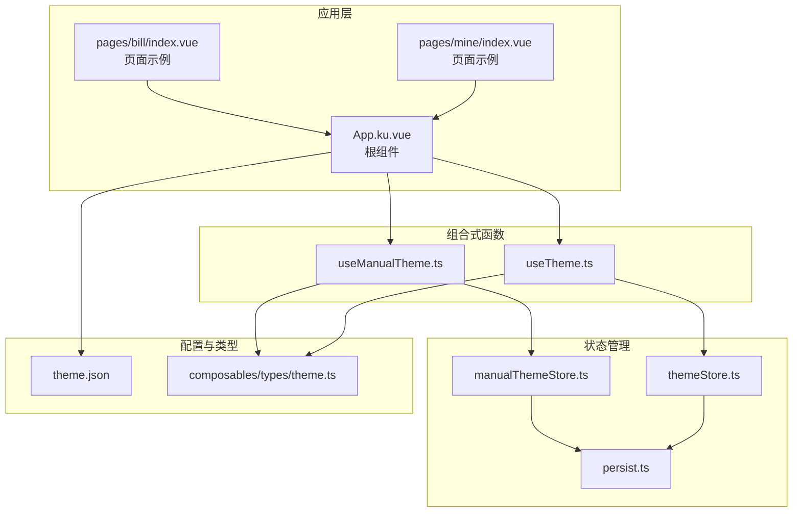
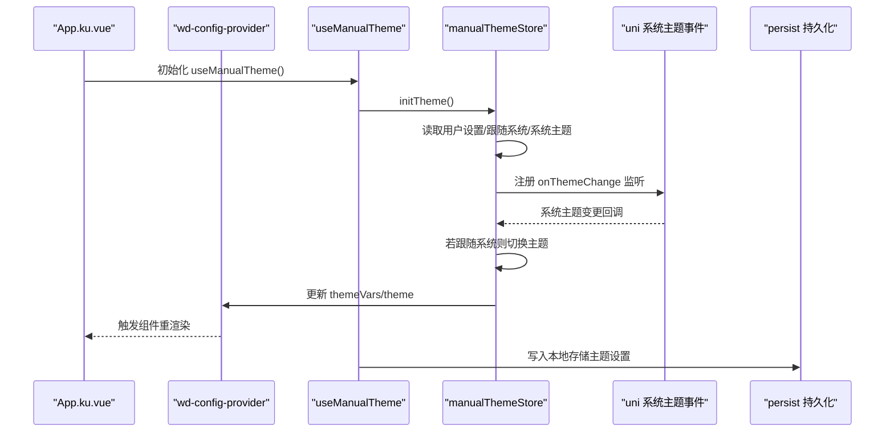
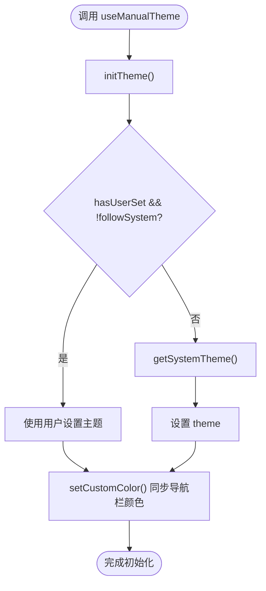
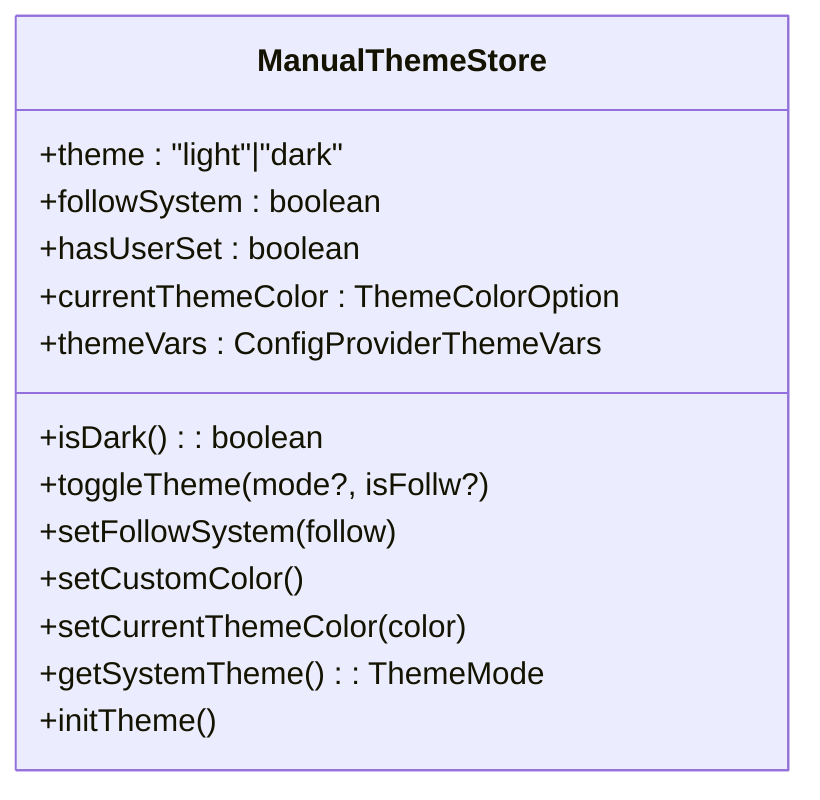
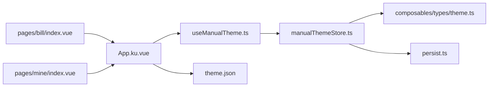

# 主题管理

<cite>
**本文引用的文件**
- [useManualTheme.ts](file://chuan-bill-app/src/composables/useManualTheme.ts)
- [useTheme.ts](file://chuan-bill-app/src/composables/useTheme.ts)
- [manualThemeStore.ts](file://chuan-bill-app/src/store/manualThemeStore.ts)
- [themeStore.ts](file://chuan-bill-app/src/store/themeStore.ts)
- [theme.ts](file://chuan-bill-app/src/composables/types/theme.ts)
- [persist.ts](file://chuan-bill-app/src/store/persist.ts)
- [theme.json](file://chuan-bill-app/src/theme.json)
- [App.ku.vue](file://chuan-bill-app/src/App.ku.vue)
- [index.vue](file://chuan-bill-app/src/pages/bill/index.vue)
- [pages/mine/index.vue](file://chuan-bill-app/src/pages/mine/index.vue)
- [main.ts](file://chuan-bill-app/src/main.ts)
</cite>

## 目录
1. [简介](#简介)
2. [项目结构](#项目结构)
3. [核心组件](#核心组件)
4. [架构总览](#架构总览)
5. [详细组件分析](#详细组件分析)
6. [依赖关系分析](#依赖关系分析)
7. [性能考虑](#性能考虑)
8. [故障排查指南](#故障排查指南)
9. [结论](#结论)
10. [附录](#附录)

## 简介
本文件系统性阐述本项目的主题管理功能，涵盖明暗主题自动切换、手动主题选择、自定义主题配置等核心能力；说明主题数据的存储与持久化机制（Pinia 状态 + 本地存储）；解释主题样式的应用与动态切换逻辑（CSS 变量、样式覆盖、导航栏同步）；详解 useManualTheme 组合式函数的实现原理（状态管理、事件监听、状态同步）；给出主题相关的 API 接口与前端组件使用说明；并提供扩展新主题色板与自定义样式变量的方法及性能优化建议。

## 项目结构
主题管理涉及的关键目录与文件：
- 组合式函数：useManualTheme.ts、useTheme.ts
- 状态管理：manualThemeStore.ts、themeStore.ts、persist.ts
- 类型定义：composables/types/theme.ts
- 主题配置：theme.json
- 应用入口与根组件：main.ts、App.ku.vue
- 页面示例：pages/bill/index.vue、pages/mine/index.vue

图表来源
- [App.ku.vue:1-22](file://chuan-bill-app/src/App.ku.vue#L1-L22)
- [useManualTheme.ts:1-143](file://chuan-bill-app/src/composables/useManualTheme.ts#L1-L143)
- [useTheme.ts:1-71](file://chuan-bill-app/src/composables/useTheme.ts#L1-L71)
- [manualThemeStore.ts:1-151](file://chuan-bill-app/src/store/manualThemeStore.ts#L1-L151)
- [themeStore.ts:1-75](file://chuan-bill-app/src/store/themeStore.ts#L1-L75)
- [persist.ts:1-39](file://chuan-bill-app/src/store/persist.ts#L1-L39)
- [theme.json:1-27](file://chuan-bill-app/src/theme.json#L1-L27)
- [index.vue:1-54](file://chuan-bill-app/src/pages/bill/index.vue#L1-L54)
- [pages/mine/index.vue:1-23](file://chuan-bill-app/src/pages/mine/index.vue#L1-L23)

章节来源
- [main.ts:1-16](file://chuan-bill-app/src/main.ts#L1-L16)
- [theme.json:1-27](file://chuan-bill-app/src/theme.json#L1-L27)

## 核心组件
- useManualTheme：完整版主题管理组合式 API，支持手动切换、主题色选择、跟随系统、导航栏同步、持久化用户设置。
- useTheme：简化版系统主题管理，仅跟随系统主题变化，轻量级实现。
- manualThemeStore：完整版主题状态管理，包含主题模式、跟随系统标记、用户设置标记、当前主题色、主题变量等。
- themeStore：简化版系统主题状态管理，仅维护主题模式与主题变量。
- persist：Pinia 插件，统一处理状态持久化到本地存储。
- theme.json：小程序端主题配置，定义明/暗两套导航栏、标签栏等颜色。
- 类型定义 theme.ts：主题模式、主题状态、主题色选项等类型与常量。

章节来源
- [useManualTheme.ts:1-143](file://chuan-bill-app/src/composables/useManualTheme.ts#L1-L143)
- [useTheme.ts:1-71](file://chuan-bill-app/src/composables/useTheme.ts#L1-L71)
- [manualThemeStore.ts:1-151](file://chuan-bill-app/src/store/manualThemeStore.ts#L1-L151)
- [themeStore.ts:1-75](file://chuan-bill-app/src/store/themeStore.ts#L1-L75)
- [persist.ts:1-39](file://chuan-bill-app/src/store/persist.ts#L1-L39)
- [theme.ts:1-47](file://chuan-bill-app/src/composables/types/theme.ts#L1-L47)

## 架构总览
主题系统采用“组合式函数 + Pinia Store + 类型定义 + 本地持久化”的分层设计。根组件通过 wd-config-provider 注入主题变量与主题模式，页面通过 CSS 变量与组件样式实现动态切换；同时通过 uni.onThemeChange 监听系统主题变化，结合 theme.json 实现导航栏颜色的自动适配。

图表来源
- [App.ku.vue:1-22](file://chuan-bill-app/src/App.ku.vue#L1-L22)
- [useManualTheme.ts:44-115](file://chuan-bill-app/src/composables/useManualTheme.ts#L44-L115)
- [manualThemeStore.ts:99-148](file://chuan-bill-app/src/store/manualThemeStore.ts#L99-L148)
- [persist.ts:29-32](file://chuan-bill-app/src/store/persist.ts#L29-L32)

## 详细组件分析

### useManualTheme 组合式函数
- 职责：封装完整主题管理能力，对外暴露状态与方法，负责生命周期内的事件监听与导航栏颜色同步。
- 关键行为：
  - toggleTheme：手动切换主题或跟随系统切换。
  - setFollowSystem：控制是否跟随系统主题。
  - open/close/selectThemeColor：主题色选择器交互与主题色设置。
  - initTheme：初始化主题，优先使用用户设置，否则跟随系统。
  - 生命周期钩子：onBeforeMount 初始化并监听系统主题；onShow 同步导航栏颜色；onUnmounted 清理监听。
- 与 store 的交互：委托 manualThemeStore 完成状态变更与持久化。

图表来源
- [useManualTheme.ts:83-104](file://chuan-bill-app/src/composables/useManualTheme.ts#L83-L104)
- [manualThemeStore.ts:124-148](file://chuan-bill-app/src/store/manualThemeStore.ts#L124-L148)

章节来源
- [useManualTheme.ts:44-138](file://chuan-bill-app/src/composables/useManualTheme.ts#L44-L138)

### manualThemeStore 状态管理
- 状态字段：theme、followSystem、hasUserSet、currentThemeColor、themeVars。
- 核心动作：
  - toggleTheme：切换主题并标记用户设置、取消跟随系统。
  - setFollowSystem：切换跟随系统并重新初始化。
  - setCustomColor：设置导航栏前景/背景色与部分主题变量。
  - getSystemTheme：跨平台获取系统主题（微信小程序走 getAppBaseInfo，其他平台走 getSystemInfoSync）。
  - initTheme：综合用户设置与系统主题决定最终主题。
- 与持久化的集成：通过 persist 插件自动写入/恢复状态。

图表来源
- [manualThemeStore.ts:9-149](file://chuan-bill-app/src/store/manualThemeStore.ts#L9-L149)
- [theme.ts:18-34](file://chuan-bill-app/src/composables/types/theme.ts#L18-L34)

章节来源
- [manualThemeStore.ts:1-151](file://chuan-bill-app/src/store/manualThemeStore.ts#L1-L151)

### useTheme 简化版主题
- 职责：仅跟随系统主题，不提供手动切换与主题色自定义。
- 行为：初始化系统主题，监听系统主题变化，通过 theme.json 自动处理导航栏颜色。

章节来源
- [useTheme.ts:1-71](file://chuan-bill-app/src/composables/useTheme.ts#L1-L71)
- [themeStore.ts:1-75](file://chuan-bill-app/src/store/themeStore.ts#L1-L75)

### 主题样式应用与动态切换
- 根组件注入：App.ku.vue 使用 wd-config-provider 注入 theme 与 themeVars，并通过 custom-class 与 custom-style 传递主题类名与 CSS 变量。
- 页面样式：页面通过 CSS 变量与组件样式实现深色模式下的边框、背景、文字颜色等差异化表现；部分组件在深色模式下使用 :deep 选择器覆盖内部样式。
- 导航栏颜色：manualThemeStore.setCustomColor 同步导航栏前景/背景色；theme.json 提供明/暗两套导航栏与标签栏颜色，小程序端自动生效。

章节来源
- [App.ku.vue:1-22](file://chuan-bill-app/src/App.ku.vue#L1-L22)
- [index.vue:45-54](file://chuan-bill-app/src/pages/bill/index.vue#L45-L54)
- [pages/mine/index.vue:11-22](file://chuan-bill-app/src/pages/mine/index.vue#L11-L22)
- [manualThemeStore.ts:74-82](file://chuan-bill-app/src/store/manualThemeStore.ts#L74-L82)
- [theme.json:1-27](file://chuan-bill-app/src/theme.json#L1-L27)

### 主题数据存储与同步机制
- Pinia 状态：manualThemeStore 与 themeStore 维护主题状态。
- 本地持久化：persist 插件在状态变更时写入本地存储，在应用启动时恢复状态。
- 全局注册：main.ts 中注册 persist 插件，确保主题状态持久化生效。

章节来源
- [persist.ts:1-39](file://chuan-bill-app/src/store/persist.ts#L1-L39)
- [main.ts:6-7](file://chuan-bill-app/src/main.ts#L6-L7)

### API 接口与前端组件使用说明
- useManualTheme 返回的 API（节选）：
  - 状态：theme、isDark、followSystem、hasUserSet、currentThemeColor、themeVars、showThemeColorSheet、themeColorOptions
  - 方法：initTheme、toggleTheme、setFollowSystem、openThemeColorPicker、closeThemeColorPicker、selectThemeColor
- 使用示例要点：
  - 在根组件中通过 wd-config-provider 注入 theme 与 themeVars。
  - 在页面中使用 CSS 变量与组件样式实现深色适配。
  - 通过按钮调用 toggleTheme 或打开主题色选择器进行切换。

章节来源
- [useManualTheme.ts:117-138](file://chuan-bill-app/src/composables/useManualTheme.ts#L117-L138)
- [App.ku.vue:8-21](file://chuan-bill-app/src/App.ku.vue#L8-L21)

### 扩展机制：新增主题色板与自定义样式变量
- 新增主题色板：
  - 在 theme.ts 的 themeColorOptions 中添加新的 ThemeColorOption。
  - 在 manualThemeStore 的 themeVars 中为 colorTheme 赋值，或在 setCurrentThemeColor 中同步。
- 自定义样式变量：
  - 在 manualThemeStore 的 themeVars 中新增变量，或在页面中通过 CSS 变量覆盖。
  - 在 wd-config-provider 中注入 themeVars 生效。

章节来源
- [theme.ts:36-47](file://chuan-bill-app/src/composables/types/theme.ts#L36-L47)
- [manualThemeStore.ts:15-36](file://chuan-bill-app/src/store/manualThemeStore.ts#L15-L36)

## 依赖关系分析
- 组件耦合：
  - App.ku.vue 依赖 useManualTheme 与 theme.ts。
  - useManualTheme 依赖 manualThemeStore 与 theme.ts。
  - manualThemeStore 依赖 theme.ts 与 persist 插件。
  - 页面组件依赖 App.ku.vue 的主题上下文。
- 外部依赖：
  - uni 系统主题事件（onThemeChange/offThemeChange）。
  - wd-config-provider 主题注入与 CSS 变量映射。

图表来源
- [App.ku.vue:1-22](file://chuan-bill-app/src/App.ku.vue#L1-L22)
- [useManualTheme.ts:1-143](file://chuan-bill-app/src/composables/useManualTheme.ts#L1-L143)
- [manualThemeStore.ts:1-151](file://chuan-bill-app/src/store/manualThemeStore.ts#L1-L151)
- [theme.ts:1-47](file://chuan-bill-app/src/composables/types/theme.ts#L1-L47)
- [persist.ts:1-39](file://chuan-bill-app/src/store/persist.ts#L1-L39)
- [theme.json:1-27](file://chuan-bill-app/src/theme.json#L1-L27)
- [index.vue:1-54](file://chuan-bill-app/src/pages/bill/index.vue#L1-L54)
- [pages/mine/index.vue:1-23](file://chuan-bill-app/src/pages/mine/index.vue#L1-L23)

## 性能考虑
- 样式预加载与懒加载：
  - 将主题变量集中于 wd-config-provider 注入，避免重复计算与多次 DOM 更新。
  - 对于深色模式下的组件覆盖，尽量使用 :deep 一次性声明，减少运行时样式计算。
- 内存管理：
  - 在 onUnmounted 中清理系统主题监听，防止内存泄漏。
- 本地存储：
  - 使用 persist 插件统一持久化，避免频繁 IO；仅保存必要字段，减少存储体积。
- 渲染优化：
  - 将主题切换逻辑集中在 store 中，组件仅消费状态，降低不必要的重渲染。

## 故障排查指南
- 系统主题监听无效：
  - 检查 uni.onThemeChange 是否可用；确认在 onBeforeMount 中注册并在 onUnmounted 中清理。
- 导航栏颜色未同步：
  - 确认 manualThemeStore.setCustomColor 已执行；检查小程序端 theme.json 配置。
- 主题色未生效：
  - 确认 wd-config-provider 已注入 themeVars；检查 CSS 变量命名与作用域。
- 切换后状态未持久化：
  - 检查 persist 插件是否注册；确认 store.$subscribe 是否触发写入。

章节来源
- [useManualTheme.ts:107-115](file://chuan-bill-app/src/composables/useManualTheme.ts#L107-L115)
- [manualThemeStore.ts:74-82](file://chuan-bill-app/src/store/manualThemeStore.ts#L74-L82)
- [persist.ts:29-32](file://chuan-bill-app/src/store/persist.ts#L29-L32)

## 结论
本主题系统以组合式函数与 Pinia Store 为核心，结合本地持久化与小程序端 theme.json，实现了完整的明暗主题自动切换、手动主题选择与主题色自定义能力。通过 wd-config-provider 的主题变量注入与页面 CSS 变量覆盖，实现了平滑的动态切换与良好的用户体验。扩展新主题色板与自定义样式变量的成本低、路径清晰，适合进一步定制化需求。

## 附录
- 关键实现位置索引：
  - useManualTheme：[useManualTheme.ts:44-138](file://chuan-bill-app/src/composables/useManualTheme.ts#L44-L138)
  - manualThemeStore：[manualThemeStore.ts:9-149](file://chuan-bill-app/src/store/manualThemeStore.ts#L9-L149)
  - useTheme：[useTheme.ts:39-70](file://chuan-bill-app/src/composables/useTheme.ts#L39-L70)
  - themeStore：[themeStore.ts:10-75](file://chuan-bill-app/src/store/themeStore.ts#L10-L75)
  - 类型与常量：[theme.ts:1-47](file://chuan-bill-app/src/composables/types/theme.ts#L1-L47)
  - 持久化插件：[persist.ts:1-39](file://chuan-bill-app/src/store/persist.ts#L1-L39)
  - 根组件注入：[App.ku.vue:1-22](file://chuan-bill-app/src/App.ku.vue#L1-L22)
  - 页面样式示例：[index.vue:45-54](file://chuan-bill-app/src/pages/bill/index.vue#L45-L54)、[pages/mine/index.vue:11-22](file://chuan-bill-app/src/pages/mine/index.vue#L11-L22)
  - 小程序主题配置：[theme.json:1-27](file://chuan-bill-app/src/theme.json#L1-L27)
  - 应用入口注册：[main.ts:6-7](file://chuan-bill-app/src/main.ts#L6-L7)