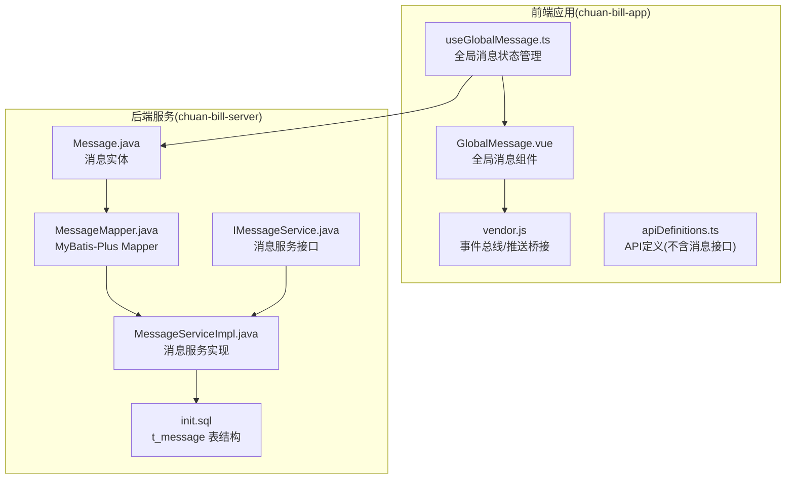
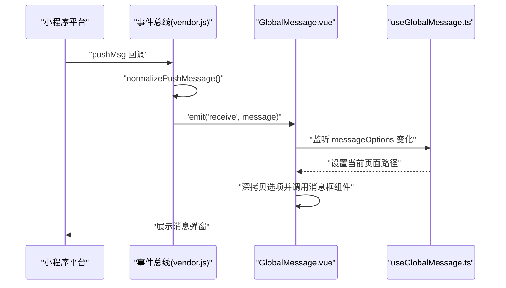
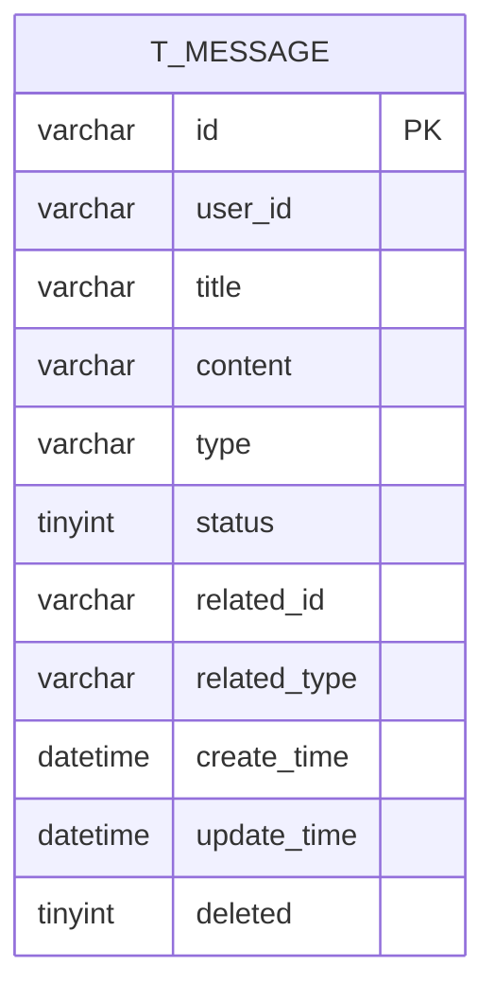
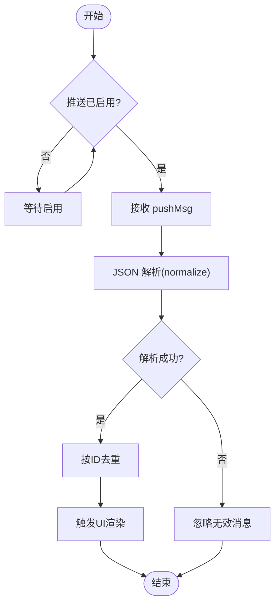
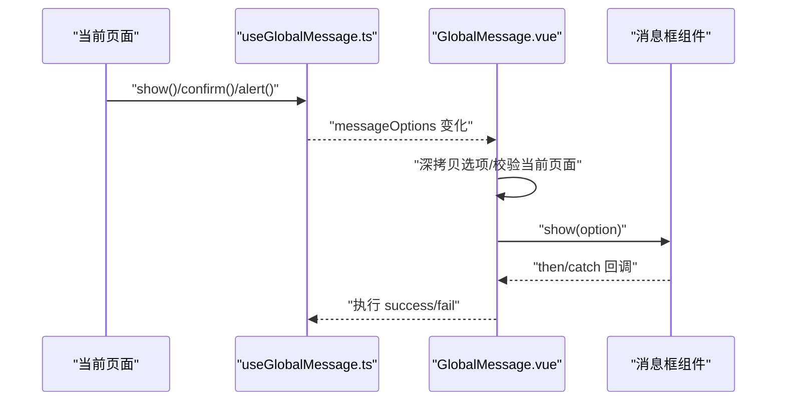
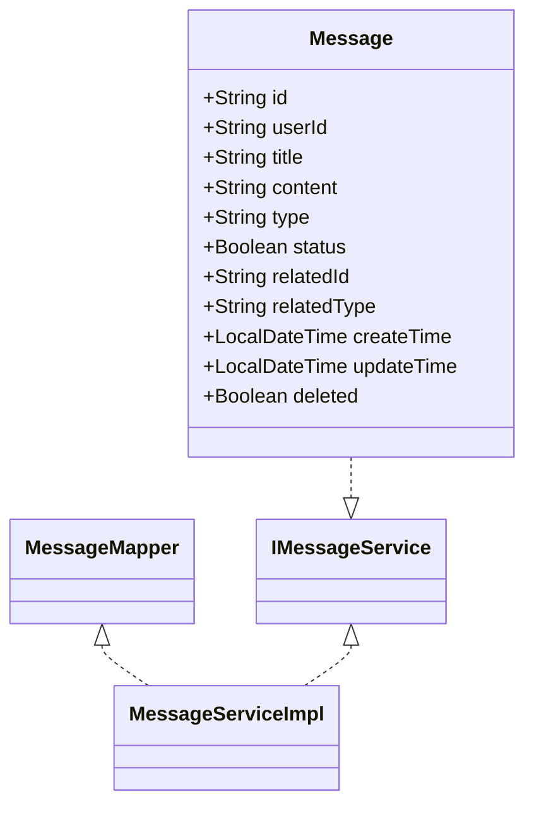

# 消息中心

<cite>
**本文引用的文件**
- [Message.java](file://chuan-bill-server/src/main/java/com/samoy/chuanbillserver/entity/Message.java)
- [MessageMapper.java](file://chuan-bill-server/src/main/java/com/samoy/chuanbillserver/dao/MessageMapper.java)
- [IMessageService.java](file://chuan-bill-server/src/main/java/com/samoy/chuanbillserver/service/IMessageService.java)
- [MessageServiceImpl.java](file://chuan-bill-server/src/main/java/com/samoy/chuanbillserver/service/impl/MessageServiceImpl.java)
- [init.sql](file://chuan-bill-server/init.sql)
- [useGlobalMessage.ts](file://chuan-bill-app/src/composables/useGlobalMessage.ts)
- [GlobalMessage.vue](file://chuan-bill-app/src/components/GlobalMessage.vue)
- [vendor.js](file://chuan-bill-app/dist/dev/mp-weixin/common/vendor.js)
- [apiDefinitions.ts](file://chuan-bill-app/src/api/apiDefinitions.ts)
</cite>

## 目录
1. [简介](#简介)
2. [项目结构](#项目结构)
3. [核心组件](#核心组件)
4. [架构总览](#架构总览)
5. [详细组件分析](#详细组件分析)
6. [依赖关系分析](#依赖关系分析)
7. [性能考虑](#性能考虑)
8. [故障排查指南](#故障排查指南)
9. [结论](#结论)
10. [附录](#附录)

## 简介
本文件围绕“消息中心”功能进行系统化说明，覆盖消息类型（系统公告、家庭邀请、预算提醒、账单通知等）、数据模型与存储结构、推送与接收机制（实时推送、离线消息、消息去重）、前端界面与交互（消息列表、分类筛选、批量操作）、API 接口规范（获取、标记已读、删除）、状态管理（未读数统计、排序、分页）以及性能优化策略（缓存、懒加载、内存管理）。文档以仓库现有代码为依据，确保可追溯性与准确性。

## 项目结构
消息中心涉及前后端协同：后端通过 Spring Boot + MyBatis-Plus 提供消息实体、持久层与服务层；数据库中存在 t_message 表用于存储消息；前端使用 Pinia 管理全局消息弹窗状态，并通过事件总线与小程序平台能力实现推送与消息展示。

图表来源
- [useGlobalMessage.ts:1-53](file://chuan-bill-app/src/composables/useGlobalMessage.ts#L1-L53)
- [GlobalMessage.vue:1-56](file://chuan-bill-app/src/components/GlobalMessage.vue#L1-L56)
- [vendor.js:1014-1065](file://chuan-bill-app/dist/dev/mp-weixin/common/vendor.js#L1014-L1065)
- [apiDefinitions.ts:1-38](file://chuan-bill-app/src/api/apiDefinitions.ts#L1-L38)
- [Message.java:1-94](file://chuan-bill-server/src/main/java/com/samoy/chuanbillserver/entity/Message.java#L1-L94)
- [MessageMapper.java:1-15](file://chuan-bill-server/src/main/java/com/samoy/chuanbillserver/dao/MessageMapper.java#L1-L15)
- [IMessageService.java:1-15](file://chuan-bill-server/src/main/java/com/samoy/chuanbillserver/service/IMessageService.java#L1-L15)
- [MessageServiceImpl.java:1-19](file://chuan-bill-server/src/main/java/com/samoy/chuanbillserver/service/impl/MessageServiceImpl.java#L1-L19)
- [init.sql:180-201](file://chuan-bill-server/init.sql#L180-L201)

章节来源
- [useGlobalMessage.ts:1-53](file://chuan-bill-app/src/composables/useGlobalMessage.ts#L1-L53)
- [GlobalMessage.vue:1-56](file://chuan-bill-app/src/components/GlobalMessage.vue#L1-L56)
- [vendor.js:1014-1065](file://chuan-bill-app/dist/dev/mp-weixin/common/vendor.js#L1014-L1065)
- [apiDefinitions.ts:1-38](file://chuan-bill-app/src/api/apiDefinitions.ts#L1-L38)
- [Message.java:1-94](file://chuan-bill-server/src/main/java/com/samoy/chuanbillserver/entity/Message.java#L1-L94)
- [MessageMapper.java:1-15](file://chuan-bill-server/src/main/java/com/samoy/chuanbillserver/dao/MessageMapper.java#L1-L15)
- [IMessageService.java:1-15](file://chuan-bill-server/src/main/java/com/samoy/chuanbillserver/service/IMessageService.java#L1-L15)
- [MessageServiceImpl.java:1-19](file://chuan-bill-server/src/main/java/com/samoy/chuanbillserver/service/impl/MessageServiceImpl.java#L1-L19)
- [init.sql:180-201](file://chuan-bill-server/init.sql#L180-L201)

## 核心组件
- 后端实体与持久层
  - 实体类定义了消息的字段与注解映射，包含消息 ID、用户 ID、标题、内容、类型、状态、关联对象标识与类型、创建/更新时间、软删除标志等。
  - Mapper 接口继承 MyBatis-Plus 基类，提供通用 CRUD 能力。
  - 服务接口与实现类基于 MyBatis-Plus ServiceImpl，提供消息业务层封装。
- 数据库表结构
  - t_message 表包含主键索引与多字段索引（用户、类型、状态、创建时间、用户+状态），支持高效查询与分页。
- 前端状态与组件
  - useGlobalMessage.ts 使用 Pinia 管理全局消息弹窗状态，提供展示、确认、提示等动作。
  - GlobalMessage.vue 监听状态变化并调用消息框组件显示。
  - vendor.js 中的事件总线与推送回调用于接收平台推送消息并触发本地处理。
- API 定义
  - 当前 API 定义文件未包含消息相关接口，后续需补充消息获取、标记已读、删除等接口。

章节来源
- [Message.java:24-92](file://chuan-bill-server/src/main/java/com/samoy/chuanbillserver/entity/Message.java#L24-L92)
- [MessageMapper.java:14-14](file://chuan-bill-server/src/main/java/com/samoy/chuanbillserver/dao/MessageMapper.java#L14-L14)
- [IMessageService.java:1-15](file://chuan-bill-server/src/main/java/com/samoy/chuanbillserver/service/IMessageService.java#L1-L15)
- [MessageServiceImpl.java:17-18](file://chuan-bill-server/src/main/java/com/samoy/chuanbillserver/service/impl/MessageServiceImpl.java#L17-L18)
- [init.sql:183-201](file://chuan-bill-server/init.sql#L183-L201)
- [useGlobalMessage.ts:14-52](file://chuan-bill-app/src/composables/useGlobalMessage.ts#L14-L52)
- [GlobalMessage.vue:17-35](file://chuan-bill-app/src/components/GlobalMessage.vue#L17-L35)
- [vendor.js:1028-1065](file://chuan-bill-app/dist/dev/mp-weixin/common/vendor.js#L1028-L1065)
- [apiDefinitions.ts:19-37](file://chuan-bill-app/src/api/apiDefinitions.ts#L19-L37)

## 架构总览
消息中心整体采用“后端存储 + 前端展示”的分层架构。后端负责消息实体、持久化与服务层，前端负责状态管理与 UI 展示，并通过事件总线与平台推送能力实现消息接收与去重。

图表来源
- [vendor.js:1049-1065](file://chuan-bill-app/dist/dev/mp-weixin/common/vendor.js#L1049-L1065)
- [GlobalMessage.vue:17-35](file://chuan-bill-app/src/components/GlobalMessage.vue#L17-L35)
- [useGlobalMessage.ts:19-31](file://chuan-bill-app/src/composables/useGlobalMessage.ts#L19-L31)

## 详细组件分析

### 数据模型与存储结构
- 消息实体字段
  - 标识与归属：消息 ID、用户 ID
  - 内容：标题、内容
  - 类型与状态：type（system/family/bill/budget）、status（0 未读/1 已读）
  - 关联对象：related_id、related_type（family/bill/budget）
  - 时间戳：create_time、update_time
  - 软删除：deleted
- 数据库索引
  - 单列索引：user_id、type、status、create_time
  - 复合索引：user_id + status
  - 用途：按用户与状态快速统计未读数、按类型过滤、按时间排序与分页

图表来源
- [init.sql:183-201](file://chuan-bill-server/init.sql#L183-L201)

章节来源
- [Message.java:31-92](file://chuan-bill-server/src/main/java/com/samoy/chuanbillserver/entity/Message.java#L31-L92)
- [init.sql:183-201](file://chuan-bill-server/init.sql#L183-L201)

### 消息类型与处理机制
- 系统公告：type=system，面向全体或特定用户的通知
- 家庭邀请：type=family，携带 related_id 为家庭标识，related_type=family
- 预算提醒：type=budget，携带 related_id 为预算标识，related_type=budget
- 账单通知：type=bill，携带 related_id 为账单标识，related_type=bill
- 处理建议
  - 后端：在生成消息时明确 type 与 related_* 字段，便于前端精准跳转
  - 前端：根据 type 与 related_type 渲染不同入口与路由

章节来源
- [Message.java:54-74](file://chuan-bill-server/src/main/java/com/samoy/chuanbillserver/entity/Message.java#L54-L74)

### 推送与接收机制
- 实时推送
  - 平台侧通过 pushMsg 回调进入事件总线，统一解析消息并触发本地事件
  - 去重策略：通过 clientId 与 enabled 标志位控制推送开关与唯一标识
- 离线消息
  - 建议前端在首次登录或切换账号时拉取历史未读消息，结合服务端分页接口
- 消息去重
  - 基于消息 ID 去重，避免重复展示
  - 前端可在状态中维护已展示集合，收到新消息时先查重再渲染

图表来源
- [vendor.js:1056-1065](file://chuan-bill-app/dist/dev/mp-weixin/common/vendor.js#L1056-L1065)

章节来源
- [vendor.js:1049-1065](file://chuan-bill-app/dist/dev/mp-weixin/common/vendor.js#L1049-L1065)

### 用户界面与交互逻辑
- 全局消息弹窗
  - useGlobalMessage.ts 管理弹窗配置与当前页面路径，避免跨页面误触
  - GlobalMessage.vue 监听状态变化，深拷贝选项并调用消息框组件，支持 alert/confirm/prompt 等模式
- 交互要点
  - 页面切换时自动关闭弹窗，防止状态残留
  - 支持回调 success/fail 分别处理用户确认与取消

图表来源
- [useGlobalMessage.ts:19-50](file://chuan-bill-app/src/composables/useGlobalMessage.ts#L19-L50)
- [GlobalMessage.vue:17-35](file://chuan-bill-app/src/components/GlobalMessage.vue#L17-L35)

章节来源
- [useGlobalMessage.ts:14-52](file://chuan-bill-app/src/composables/useGlobalMessage.ts#L14-L52)
- [GlobalMessage.vue:1-56](file://chuan-bill-app/src/components/GlobalMessage.vue#L1-L56)

### API 接口说明（建议补充）
当前 API 定义文件未包含消息相关接口。建议补充以下接口（参数与响应格式为建议项，具体以后端实现为准）：
- 获取消息列表
  - 方法与路径：GET /message/list
  - 查询参数：userId、type（可选）、status（可选）、page、size、sortBy（create_time desc）、keyword（可选）
  - 响应：分页结果，包含消息数组与总数
- 标记已读
  - 方法与路径：POST /message/read
  - 请求体：messageIds（数组）
  - 响应：布尔值表示是否成功
- 删除消息
  - 方法与路径：POST /message/delete
  - 请求体：messageIds（数组）
  - 响应：布尔值表示是否成功
- 未读数统计
  - 方法与路径：GET /message/unread-count
  - 查询参数：userId、type（可选）
  - 响应：未读数量

章节来源
- [apiDefinitions.ts:19-37](file://chuan-bill-app/src/api/apiDefinitions.ts#L19-L37)

### 状态管理与排序分页
- 未读数统计
  - 建议按用户与状态聚合统计，利用数据库复合索引 user_id+status 提升性能
- 消息排序
  - 默认按 create_time 降序排列，支持前端自定义排序字段
- 分页加载
  - 建议采用游标分页或 offset 分页，结合 type/status 过滤减少无效数据传输
- 内存管理
  - 前端对已读消息可做轻量缓存，未读消息优先渲染，避免一次性加载过多

章节来源
- [init.sql:196-200](file://chuan-bill-server/init.sql#L196-L200)

## 依赖关系分析
- 后端
  - 实体 -> Mapper -> ServiceImpl -> 控制器（控制器未在本文件中出现，但服务层已就绪）
  - 数据库索引服务于查询与分页
- 前端
  - 组件依赖状态管理，状态管理依赖消息框组件
  - 事件总线连接平台推送与组件渲染

图表来源
- [Message.java:24-92](file://chuan-bill-server/src/main/java/com/samoy/chuanbillserver/entity/Message.java#L24-L92)
- [MessageMapper.java:14-14](file://chuan-bill-server/src/main/java/com/samoy/chuanbillserver/dao/MessageMapper.java#L14-L14)
- [IMessageService.java:1-15](file://chuan-bill-server/src/main/java/com/samoy/chuanbillserver/service/IMessageService.java#L1-L15)
- [MessageServiceImpl.java:17-18](file://chuan-bill-server/src/main/java/com/samoy/chuanbillserver/service/impl/MessageServiceImpl.java#L17-L18)

章节来源
- [Message.java:24-92](file://chuan-bill-server/src/main/java/com/samoy/chuanbillserver/entity/Message.java#L24-L92)
- [MessageMapper.java:14-14](file://chuan-bill-server/src/main/java/com/samoy/chuanbillserver/dao/MessageMapper.java#L14-L14)
- [IMessageService.java:1-15](file://chuan-bill-server/src/main/java/com/samoy/chuanbillserver/service/IMessageService.java#L1-L15)
- [MessageServiceImpl.java:17-18](file://chuan-bill-server/src/main/java/com/samoy/chuanbillserver/service/impl/MessageServiceImpl.java#L17-L18)

## 性能考虑
- 存储层
  - 利用索引：user_id、type、status、create_time、user_id+status，提升查询与分页效率
  - 软删除：deleted 字段支持不物理删除，便于审计与恢复
- 应用层
  - 分页与过滤：按 type/status 精准过滤，避免全表扫描
  - 批量操作：标记已读/删除使用数组参数，减少请求次数
- 前端
  - 懒加载：滚动到可视区域再渲染消息卡片
  - 缓存：未读消息短期缓存，已读消息可释放
  - 内存管理：组件销毁时清理定时器与事件监听，避免内存泄漏

## 故障排查指南
- 消息不显示
  - 检查事件总线是否启用与 clientId 是否获取成功
  - 确认消息 ID 去重逻辑是否生效
- 弹窗异常
  - 确认当前页面路径与 messageOptions 的 currentPage 是否一致
  - 检查深拷贝是否正确，避免引用污染
- 数据不一致
  - 核对数据库索引是否存在，必要时重建索引
  - 检查未读数统计逻辑与数据库状态字段

章节来源
- [vendor.js:1056-1065](file://chuan-bill-app/dist/dev/mp-weixin/common/vendor.js#L1056-L1065)
- [useGlobalMessage.ts:19-31](file://chuan-bill-app/src/composables/useGlobalMessage.ts#L19-L31)
- [GlobalMessage.vue:17-35](file://chuan-bill-app/src/components/GlobalMessage.vue#L17-L35)
- [init.sql:196-200](file://chuan-bill-server/init.sql#L196-L200)

## 结论
消息中心以清晰的数据模型与完善的索引设计为基础，结合前端事件总线与全局弹窗组件，实现了从推送、去重到展示的闭环。建议尽快补齐消息相关 API，并在生产环境完善分页、批量操作与未读统计的性能监控与优化。

## 附录
- 消息类型对照
  - system：系统公告
  - family：家庭相关
  - budget：预算相关
  - bill：账单相关
- 关联类型对照
  - family：家庭
  - budget：预算
  - bill：账单