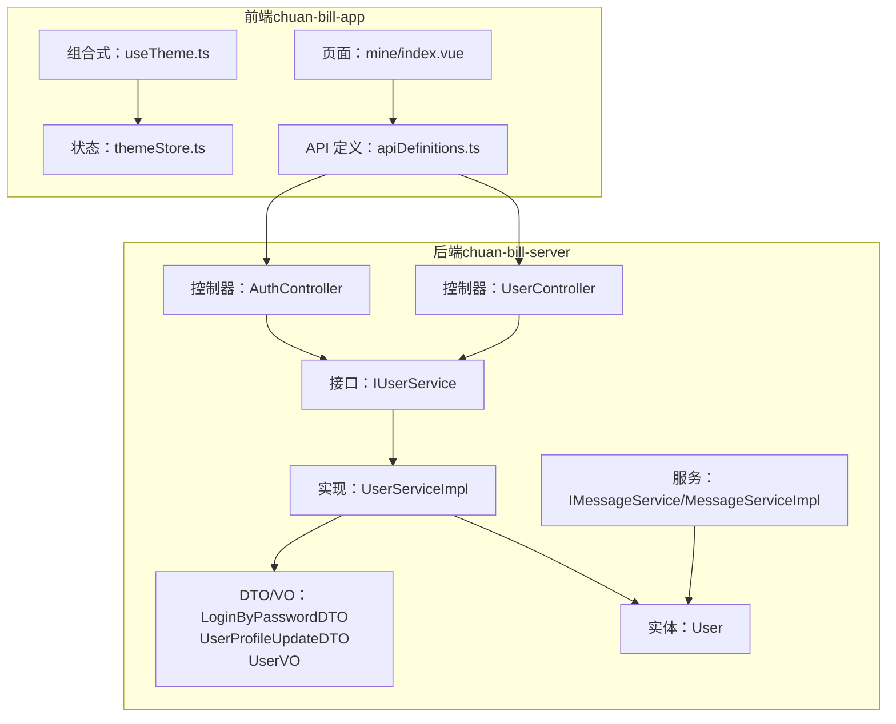
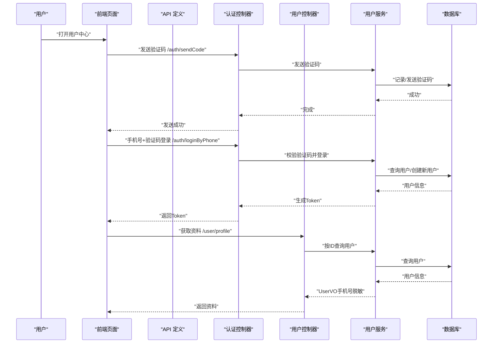
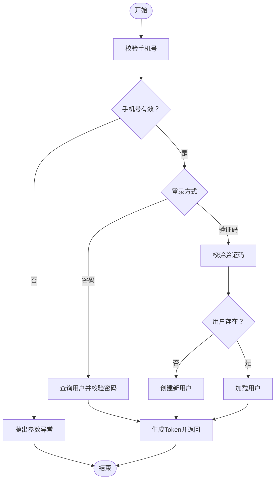
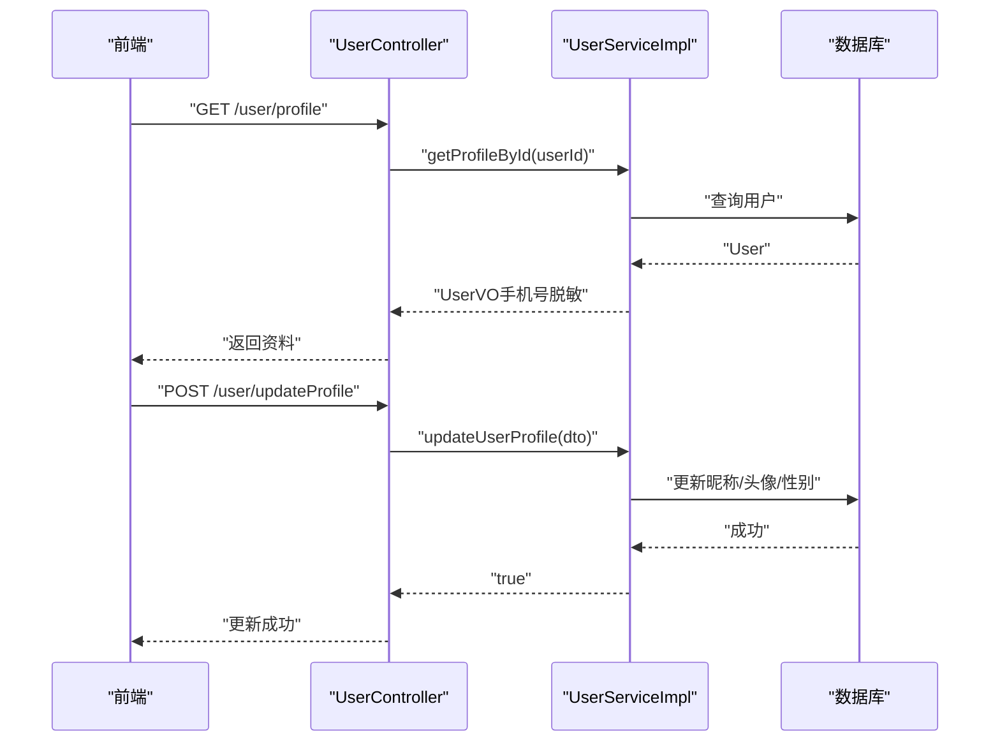
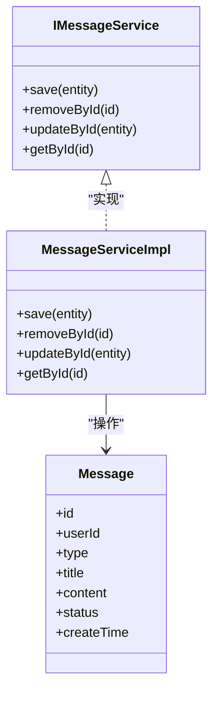
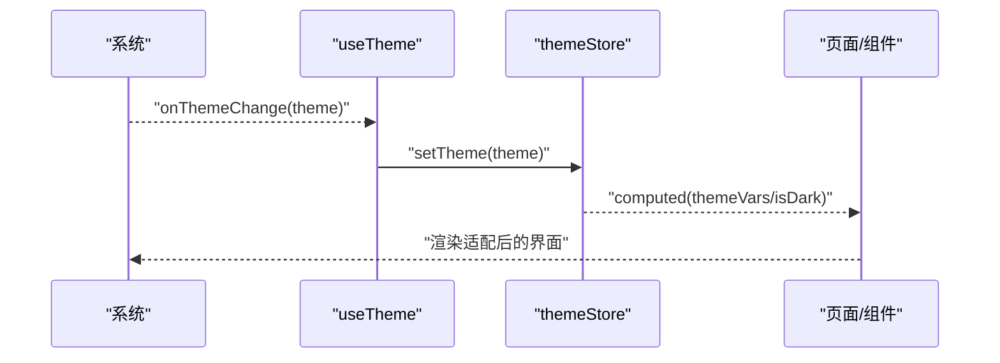
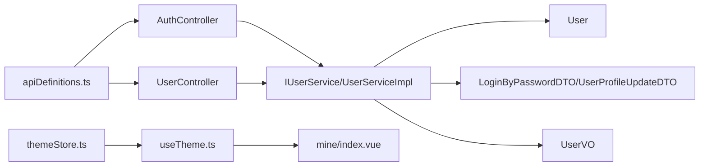

# 用户中心模块

<cite>
**本文引用的文件**
- [index.vue](file://chuan-bill-app/src/pages/mine/index.vue)
- [UserController.java](file://chuan-bill-server/src/main/java/com/samoy/chuanbillserver/controller/UserController.java)
- [IUserService.java](file://chuan-bill-server/src/main/java/com/samoy/chuanbillserver/service/IUserService.java)
- [UserServiceImpl.java](file://chuan-bill-server/src/main/java/com/samoy/chuanbillserver/service/impl/UserServiceImpl.java)
- [AuthController.java](file://chuan-bill-server/src/main/java/com/samoy/chuanbillserver/controller/AuthController.java)
- [IMessageService.java](file://chuan-bill-server/src/main/java/com/samoy/chuanbillserver/service/IMessageService.java)
- [MessageServiceImpl.java](file://chuan-bill-server/src/main/java/com/samoy/chuanbillserver/service/impl/MessageServiceImpl.java)
- [themeStore.ts](file://chuan-bill-app/src/store/themeStore.ts)
- [useTheme.ts](file://chuan-bill-app/src/composables/useTheme.ts)
- [apiDefinitions.ts](file://chuan-bill-app/src/api/apiDefinitions.ts)
- [LoginByPasswordDTO.java](file://chuan-bill-server/src/main/java/com/samoy/chuanbillserver/dto/LoginByPasswordDTO.java)
- [UserProfileUpdateDTO.java](file://chuan-bill-server/src/main/java/com/samoy/chuanbillserver/dto/UserProfileUpdateDTO.java)
- [User.java](file://chuan-bill-server/src/main/java/com/samoy/chuanbillserver/entity/User.java)
- [UserVO.java](file://chuan-bill-server/src/main/java/com/samoy/chuanbillserver/vo/UserVO.java)
</cite>

## 目录
1. [简介](#简介)
2. [项目结构](#项目结构)
3. [核心组件](#核心组件)
4. [架构总览](#架构总览)
5. [详细组件分析](#详细组件分析)
6. [依赖分析](#依赖分析)
7. [性能考虑](#性能考虑)
8. [故障排除指南](#故障排除指南)
9. [结论](#结论)
10. [附录](#附录)

## 简介
本文件为“用户中心模块”的功能文档，覆盖以下范围：
- 用户认证与授权：登录注册流程、密码管理、手机验证码、第三方登录（如需扩展）
- 用户信息管理：个人信息编辑、头像上传、联系方式维护
- 消息中心：系统消息、家庭邀请、预算提醒等消息类型的实现思路
- 主题切换：明暗主题跟随系统、导航栏适配、主题变量传递
- API 接口说明、前端组件实现与后端服务逻辑

当前仓库中用户中心相关能力以“手机号+密码”和“手机号+验证码”两种登录方式为主，并提供密码修改、用户资料查询与更新、主题跟随系统等基础能力。

## 项目结构
用户中心模块涉及前后端协同：
- 前端（小程序/UniApp）：页面入口、主题状态管理、API 定义与调用
- 后端（Spring Boot）：认证控制器、用户服务、消息服务、数据模型与 DTO/VO

图表来源
- [index.vue:1-23](file://chuan-bill-app/src/pages/mine/index.vue#L1-L23)
- [themeStore.ts:1-75](file://chuan-bill-app/src/store/themeStore.ts#L1-L75)
- [useTheme.ts:1-71](file://chuan-bill-app/src/composables/useTheme.ts#L1-L71)
- [apiDefinitions.ts:1-38](file://chuan-bill-app/src/api/apiDefinitions.ts#L1-L38)
- [AuthController.java:1-66](file://chuan-bill-server/src/main/java/com/samoy/chuanbillserver/controller/AuthController.java#L1-L66)
- [UserController.java:1-62](file://chuan-bill-server/src/main/java/com/samoy/chuanbillserver/controller/UserController.java#L1-L62)
- [IMessageService.java:1-15](file://chuan-bill-server/src/main/java/com/samoy/chuanbillserver/service/IMessageService.java#L1-L15)
- [MessageServiceImpl.java:1-19](file://chuan-bill-server/src/main/java/com/samoy/chuanbillserver/service/impl/MessageServiceImpl.java#L1-L19)
- [IUserService.java:1-75](file://chuan-bill-server/src/main/java/com/samoy/chuanbillserver/service/IUserService.java#L1-L75)
- [UserServiceImpl.java:1-192](file://chuan-bill-server/src/main/java/com/samoy/chuanbillserver/service/impl/UserServiceImpl.java#L1-L192)
- [LoginByPasswordDTO.java:1-19](file://chuan-bill-server/src/main/java/com/samoy/chuanbillserver/dto/LoginByPasswordDTO.java#L1-L19)
- [UserProfileUpdateDTO.java:1-23](file://chuan-bill-server/src/main/java/com/samoy/chuanbillserver/dto/UserProfileUpdateDTO.java#L1-L23)
- [User.java:1-94](file://chuan-bill-server/src/main/java/com/samoy/chuanbillserver/entity/User.java#L1-L94)
- [UserVO.java:1-41](file://chuan-bill-server/src/main/java/com/samoy/chuanbillserver/vo/UserVO.java#L1-L41)

章节来源
- [index.vue:1-23](file://chuan-bill-app/src/pages/mine/index.vue#L1-L23)
- [themeStore.ts:1-75](file://chuan-bill-app/src/store/themeStore.ts#L1-L75)
- [useTheme.ts:1-71](file://chuan-bill-app/src/composables/useTheme.ts#L1-L71)
- [apiDefinitions.ts:1-38](file://chuan-bill-app/src/api/apiDefinitions.ts#L1-L38)
- [AuthController.java:1-66](file://chuan-bill-server/src/main/java/com/samoy/chuanbillserver/controller/AuthController.java#L1-L66)
- [UserController.java:1-62](file://chuan-bill-server/src/main/java/com/samoy/chuanbillserver/controller/UserController.java#L1-L62)
- [IMessageService.java:1-15](file://chuan-bill-server/src/main/java/com/samoy/chuanbillserver/service/IMessageService.java#L1-L15)
- [MessageServiceImpl.java:1-19](file://chuan-bill-server/src/main/java/com/samoy/chuanbillserver/service/impl/MessageServiceImpl.java#L1-L19)
- [IUserService.java:1-75](file://chuan-bill-server/src/main/java/com/samoy/chuanbillserver/service/IUserService.java#L1-L75)
- [UserServiceImpl.java:1-192](file://chuan-bill-server/src/main/java/com/samoy/chuanbillserver/service/impl/UserServiceImpl.java#L1-L192)
- [LoginByPasswordDTO.java:1-19](file://chuan-bill-server/src/main/java/com/samoy/chuanbillserver/dto/LoginByPasswordDTO.java#L1-L19)
- [UserProfileUpdateDTO.java:1-23](file://chuan-bill-server/src/main/java/com/samoy/chuanbillserver/dto/UserProfileUpdateDTO.java#L1-L23)
- [User.java:1-94](file://chuan-bill-server/src/main/java/com/samoy/chuanbillserver/entity/User.java#L1-L94)
- [UserVO.java:1-41](file://chuan-bill-server/src/main/java/com/samoy/chuanbillserver/vo/UserVO.java#L1-L41)

## 核心组件
- 认证与授权
  - 登录接口：手机号+密码、手机号+验证码
  - 验证码发送与校验
  - 基于 Sa-Token 的会话与权限标识
- 用户信息管理
  - 获取用户资料（含手机号脱敏）
  - 更新用户资料（昵称、头像、性别）
  - 密码修改（旧密码、验证码）
  - 密码存在性检查
- 消息中心
  - 消息服务接口与实现（用于后续扩展系统消息、家庭邀请、预算提醒等）
- 主题切换
  - 跟随系统主题（明/暗）
  - 主题变量注入到 UI 组件库配置

章节来源
- [AuthController.java:29-64](file://chuan-bill-server/src/main/java/com/samoy/chuanbillserver/controller/AuthController.java#L29-L64)
- [UserController.java:25-60](file://chuan-bill-server/src/main/java/com/samoy/chuanbillserver/controller/UserController.java#L25-L60)
- [IUserService.java:17-74](file://chuan-bill-server/src/main/java/com/samoy/chuanbillserver/service/IUserService.java#L17-L74)
- [UserServiceImpl.java:40-190](file://chuan-bill-server/src/main/java/com/samoy/chuanbillserver/service/impl/UserServiceImpl.java#L40-L190)
- [IMessageService.java:1-15](file://chuan-bill-server/src/main/java/com/samoy/chuanbillserver/service/IMessageService.java#L1-L15)
- [MessageServiceImpl.java:1-19](file://chuan-bill-server/src/main/java/com/samoy/chuanbillserver/service/impl/MessageServiceImpl.java#L1-L19)
- [themeStore.ts:10-75](file://chuan-bill-app/src/store/themeStore.ts#L10-L75)
- [useTheme.ts:39-71](file://chuan-bill-app/src/composables/useTheme.ts#L39-L71)

## 架构总览
用户中心采用前后端分离架构：
- 前端负责页面渲染、主题管理、API 调用
- 后端提供 REST 接口、业务逻辑、数据持久化
- Sa-Token 提供统一的登录态与权限标识
- DTO/VO 作为接口契约，确保前后端数据结构一致

图表来源
- [apiDefinitions.ts:27-31](file://chuan-bill-app/src/api/apiDefinitions.ts#L27-L31)
- [AuthController.java:35-64](file://chuan-bill-server/src/main/java/com/samoy/chuanbillserver/controller/AuthController.java#L35-L64)
- [UserController.java:25-30](file://chuan-bill-server/src/main/java/com/samoy/chuanbillserver/controller/UserController.java#L25-L30)
- [UserServiceImpl.java:64-83](file://chuan-bill-server/src/main/java/com/samoy/chuanbillserver/service/impl/UserServiceImpl.java#L64-L83)
- [UserServiceImpl.java:146-157](file://chuan-bill-server/src/main/java/com/samoy/chuanbillserver/service/impl/UserServiceImpl.java#L146-L157)

## 详细组件分析

### 认证与授权
- 登录方式
  - 手机号+密码：校验参数、查询用户、验证密码、生成 Token
  - 手机号+验证码：校验验证码、查询或创建用户、生成 Token
- 验证码
  - 发送验证码接口，配合服务层进行校验
- 权限标识
  - 使用 Sa-Token 登录并生成 Token，后续接口通过注解鉴权

图表来源
- [AuthController.java:35-51](file://chuan-bill-server/src/main/java/com/samoy/chuanbillserver/controller/AuthController.java#L35-L51)
- [UserServiceImpl.java:40-83](file://chuan-bill-server/src/main/java/com/samoy/chuanbillserver/service/impl/UserServiceImpl.java#L40-L83)
- [LoginByPasswordDTO.java:11-18](file://chuan-bill-server/src/main/java/com/samoy/chuanbillserver/dto/LoginByPasswordDTO.java#L11-L18)

章节来源
- [AuthController.java:29-64](file://chuan-bill-server/src/main/java/com/samoy/chuanbillserver/controller/AuthController.java#L29-L64)
- [UserServiceImpl.java:40-83](file://chuan-bill-server/src/main/java/com/samoy/chuanbillserver/service/impl/UserServiceImpl.java#L40-L83)
- [LoginByPasswordDTO.java:11-18](file://chuan-bill-server/src/main/java/com/samoy/chuanbillserver/dto/LoginByPasswordDTO.java#L11-L18)

### 用户信息管理
- 获取资料
  - 通过登录用户 ID 查询，返回脱敏手机号的 UserVO
- 更新资料
  - 支持昵称、头像、性别字段更新
- 密码管理
  - 旧密码修改：校验旧密码，更新为新密码（BCrypt）
  - 验证码修改：校验验证码，直接更新密码
- 密码存在性
  - 判断用户是否已设置密码

图表来源
- [UserController.java:25-38](file://chuan-bill-server/src/main/java/com/samoy/chuanbillserver/controller/UserController.java#L25-L38)
- [UserServiceImpl.java:127-144](file://chuan-bill-server/src/main/java/com/samoy/chuanbillserver/service/impl/UserServiceImpl.java#L127-L144)
- [UserServiceImpl.java:146-157](file://chuan-bill-server/src/main/java/com/samoy/chuanbillserver/service/impl/UserServiceImpl.java#L146-L157)

章节来源
- [UserController.java:25-60](file://chuan-bill-server/src/main/java/com/samoy/chuanbillserver/controller/UserController.java#L25-L60)
- [UserServiceImpl.java:127-166](file://chuan-bill-server/src/main/java/com/samoy/chuanbillserver/service/impl/UserServiceImpl.java#L127-L166)
- [UserProfileUpdateDTO.java:10-22](file://chuan-bill-server/src/main/java/com/samoy/chuanbillserver/dto/UserProfileUpdateDTO.java#L10-L22)
- [UserVO.java:10-40](file://chuan-bill-server/src/main/java/com/samoy/chuanbillserver/vo/UserVO.java#L10-L40)

### 消息中心
- 当前实现
  - 提供消息服务接口与空实现，便于后续扩展系统消息、家庭邀请、预算提醒等
- 扩展建议
  - 引入消息实体与 Mapper
  - 在服务层实现消息分页查询、状态标记、推送策略
  - 在前端提供消息列表页面与通知入口

图表来源
- [IMessageService.java:1-15](file://chuan-bill-server/src/main/java/com/samoy/chuanbillserver/service/IMessageService.java#L1-L15)
- [MessageServiceImpl.java:1-19](file://chuan-bill-server/src/main/java/com/samoy/chuanbillserver/service/impl/MessageServiceImpl.java#L1-L19)

章节来源
- [IMessageService.java:1-15](file://chuan-bill-server/src/main/java/com/samoy/chuanbillserver/service/IMessageService.java#L1-L15)
- [MessageServiceImpl.java:1-19](file://chuan-bill-server/src/main/java/com/samoy/chuanbillserver/service/impl/MessageServiceImpl.java#L1-L19)

### 主题切换
- 系统主题跟随
  - 通过组合式 API 监听系统主题变化，自动更新 store
  - 在小程序平台使用系统信息接口获取主题
- 主题变量注入
  - 将主题变量传入 UI 组件库配置，实现全局样式适配
- 页面入口
  - 用户中心页面使用主题状态进行内容渲染

图表来源
- [useTheme.ts:39-71](file://chuan-bill-app/src/composables/useTheme.ts#L39-L71)
- [themeStore.ts:37-72](file://chuan-bill-app/src/store/themeStore.ts#L37-L72)
- [index.vue:11-22](file://chuan-bill-app/src/pages/mine/index.vue#L11-L22)

章节来源
- [useTheme.ts:1-71](file://chuan-bill-app/src/composables/useTheme.ts#L1-L71)
- [themeStore.ts:1-75](file://chuan-bill-app/src/store/themeStore.ts#L1-L75)
- [index.vue:1-23](file://chuan-bill-app/src/pages/mine/index.vue#L1-L23)

## 依赖分析
- 前端依赖
  - API 定义集中管理，统一映射后端接口路径
  - 主题状态通过 Pinia 管理，组合式 API 自动响应系统主题变化
- 后端依赖
  - 控制器依赖服务接口，服务实现依赖数据访问层与工具类
  - Sa-Token 提供统一登录态管理

图表来源
- [apiDefinitions.ts:19-37](file://chuan-bill-app/src/api/apiDefinitions.ts#L19-L37)
- [AuthController.java:19-27](file://chuan-bill-server/src/main/java/com/samoy/chuanbillserver/controller/AuthController.java#L19-L27)
- [UserController.java:9-23](file://chuan-bill-server/src/main/java/com/samoy/chuanbillserver/controller/UserController.java#L9-L23)
- [IUserService.java:1-75](file://chuan-bill-server/src/main/java/com/samoy/chuanbillserver/service/IUserService.java#L1-L75)
- [UserServiceImpl.java:1-192](file://chuan-bill-server/src/main/java/com/samoy/chuanbillserver/service/impl/UserServiceImpl.java#L1-L192)
- [User.java:1-94](file://chuan-bill-server/src/main/java/com/samoy/chuanbillserver/entity/User.java#L1-L94)
- [LoginByPasswordDTO.java:1-19](file://chuan-bill-server/src/main/java/com/samoy/chuanbillserver/dto/LoginByPasswordDTO.java#L1-L19)
- [UserProfileUpdateDTO.java:1-23](file://chuan-bill-server/src/main/java/com/samoy/chuanbillserver/dto/UserProfileUpdateDTO.java#L1-L23)
- [UserVO.java:1-41](file://chuan-bill-server/src/main/java/com/samoy/chuanbillserver/vo/UserVO.java#L1-L41)
- [themeStore.ts:1-75](file://chuan-bill-app/src/store/themeStore.ts#L1-L75)
- [useTheme.ts:1-71](file://chuan-bill-app/src/composables/useTheme.ts#L1-L71)
- [index.vue:1-23](file://chuan-bill-app/src/pages/mine/index.vue#L1-L23)

章节来源
- [apiDefinitions.ts:19-37](file://chuan-bill-app/src/api/apiDefinitions.ts#L19-L37)
- [AuthController.java:19-27](file://chuan-bill-server/src/main/java/com/samoy/chuanbillserver/controller/AuthController.java#L19-L27)
- [UserController.java:9-23](file://chuan-bill-server/src/main/java/com/samoy/chuanbillserver/controller/UserController.java#L9-L23)
- [IUserService.java:1-75](file://chuan-bill-server/src/main/java/com/samoy/chuanbillserver/service/IUserService.java#L1-L75)
- [UserServiceImpl.java:1-192](file://chuan-bill-server/src/main/java/com/samoy/chuanbillserver/service/impl/UserServiceImpl.java#L1-L192)
- [User.java:1-94](file://chuan-bill-server/src/main/java/com/samoy/chuanbillserver/entity/User.java#L1-L94)
- [LoginByPasswordDTO.java:1-19](file://chuan-bill-server/src/main/java/com/samoy/chuanbillserver/dto/LoginByPasswordDTO.java#L1-L19)
- [UserProfileUpdateDTO.java:1-23](file://chuan-bill-server/src/main/java/com/samoy/chuanbillserver/dto/UserProfileUpdateDTO.java#L1-L23)
- [UserVO.java:1-41](file://chuan-bill-server/src/main/java/com/samoy/chuanbillserver/vo/UserVO.java#L1-L41)
- [themeStore.ts:1-75](file://chuan-bill-app/src/store/themeStore.ts#L1-L75)
- [useTheme.ts:1-71](file://chuan-bill-app/src/composables/useTheme.ts#L1-L71)
- [index.vue:1-23](file://chuan-bill-app/src/pages/mine/index.vue#L1-L23)

## 性能考虑
- 登录与密码校验
  - 使用 BCrypt 哈希存储密码，避免明文存储；校验失败应快速失败，减少无效计算
- 数据脱敏
  - 返回用户资料时对手机号进行中间部分脱敏，保护隐私
- 主题切换
  - 仅监听系统主题变化，避免频繁重绘；主题变量通过计算属性传递，降低更新成本
- API 调用
  - 统一的 API 定义便于缓存与复用；建议在前端对常用接口进行节流/防抖

## 故障排除指南
- 登录失败
  - 参数缺失：检查手机号与密码/验证码是否为空
  - 用户不存在：确认手机号是否正确，必要时允许自动注册（当前实现为手机号+验证码登录时创建用户）
  - 密码错误：确认旧密码校验与新密码长度规则
- 验证码问题
  - 发送失败：检查验证码服务可用性与手机号格式
  - 校验失败：确认验证码有效期与匹配逻辑
- 密码修改异常
  - 未设置密码：提示用户使用验证码登录后再设置密码
  - 旧密码错误：提示重新输入
- 资料更新失败
  - 用户不存在：确认登录态与用户 ID
  - 字段长度/格式不符：检查昵称长度与性别枚举值

章节来源
- [UserServiceImpl.java:40-105](file://chuan-bill-server/src/main/java/com/samoy/chuanbillserver/service/impl/UserServiceImpl.java#L40-L105)
- [UserServiceImpl.java:107-125](file://chuan-bill-server/src/main/java/com/samoy/chuanbillserver/service/impl/UserServiceImpl.java#L107-L125)
- [UserServiceImpl.java:127-144](file://chuan-bill-server/src/main/java/com/samoy/chuanbillserver/service/impl/UserServiceImpl.java#L127-L144)
- [AuthController.java:59-64](file://chuan-bill-server/src/main/java/com/samoy/chuanbillserver/controller/AuthController.java#L59-L64)

## 结论
用户中心模块以“手机号+密码”和“手机号+验证码”为核心认证方式，结合 Sa-Token 实现统一登录态管理；前端提供主题跟随系统的能力，后端提供用户资料查询与更新、密码修改、验证码发送等基础能力。消息中心目前以接口与实现预留扩展空间，可按需接入系统消息、家庭邀请、预算提醒等类型。整体架构清晰、职责明确，具备良好的扩展性与可维护性。

## 附录

### API 接口一览（摘要）
- 认证相关
  - POST /auth/sendCode：发送验证码
  - POST /auth/loginByPhone：手机号+验证码登录
  - POST /auth/loginByPassword：手机号+密码登录
- 用户相关
  - GET /user/profile：获取用户资料（手机号脱敏）
  - POST /user/updateProfile：更新用户资料
  - POST /user/updatePasswordByOld：旧密码修改密码
  - POST /user/updatePasswordByCode：验证码修改密码
  - GET /user/hasPassword：检查是否设置密码

章节来源
- [apiDefinitions.ts:19-37](file://chuan-bill-app/src/api/apiDefinitions.ts#L19-L37)
- [AuthController.java:29-64](file://chuan-bill-server/src/main/java/com/samoy/chuanbillserver/controller/AuthController.java#L29-L64)
- [UserController.java:25-60](file://chuan-bill-server/src/main/java/com/samoy/chuanbillserver/controller/UserController.java#L25-L60)