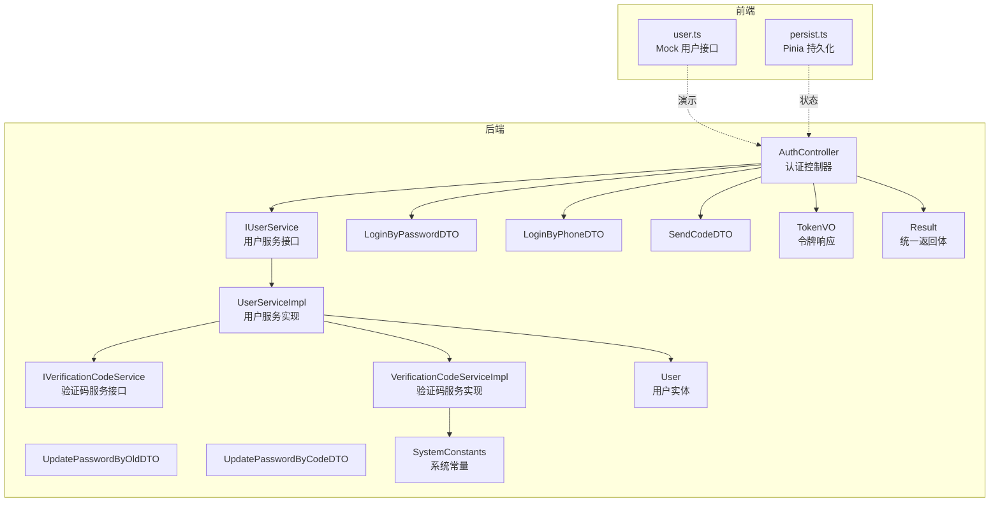
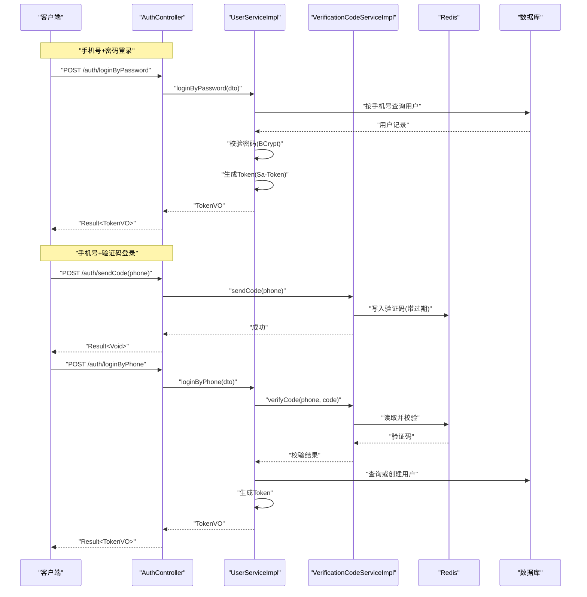
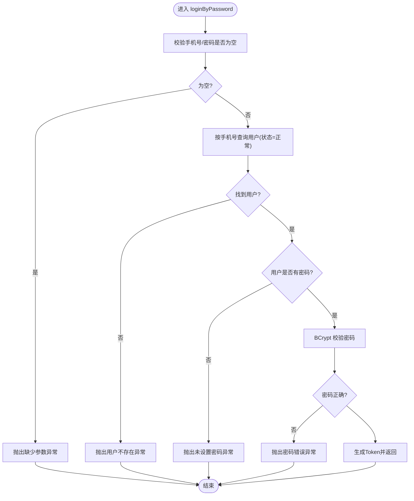
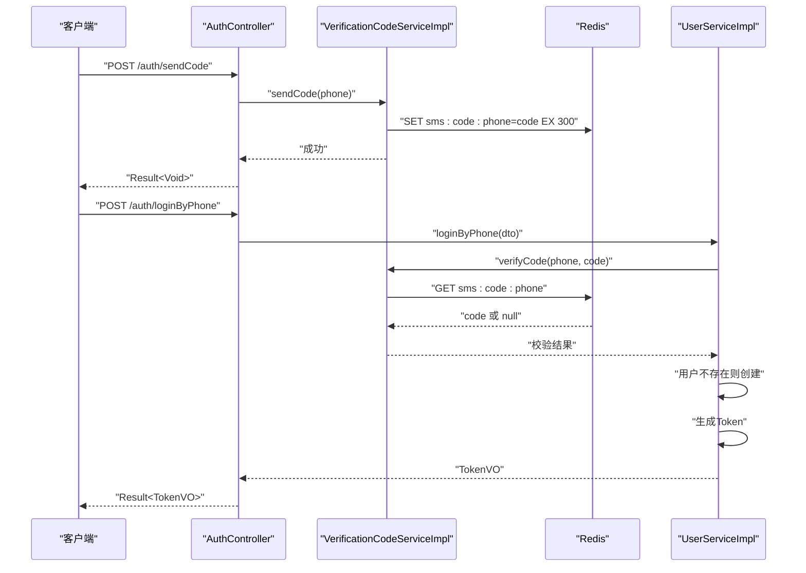
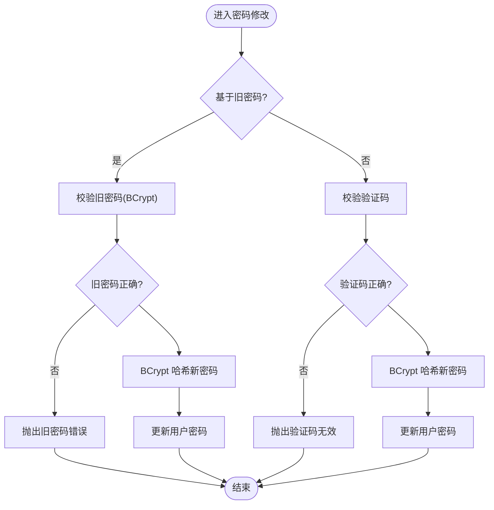
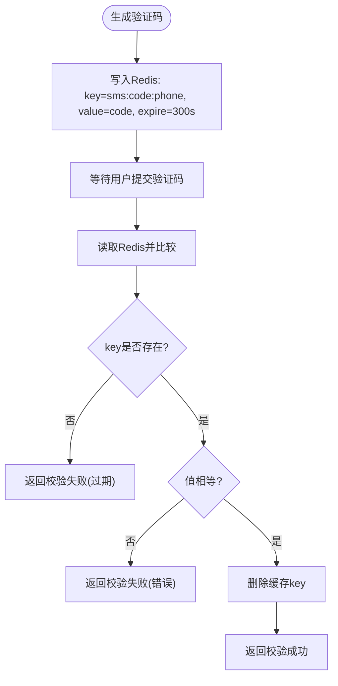
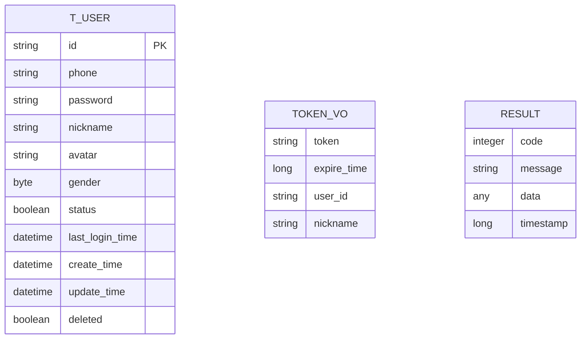
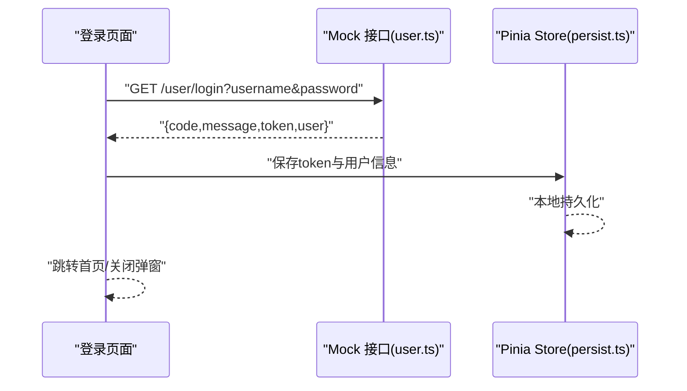
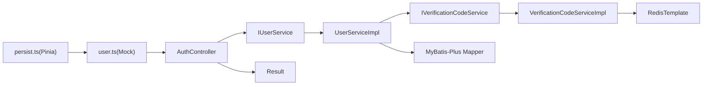

# 用户认证

<cite>
**本文引用的文件**
- [AuthController.java](file://chuan-bill-server/src/main/java/com/samoy/chuanbillserver/controller/AuthController.java)
- [IUserService.java](file://chuan-bill-server/src/main/java/com/samoy/chuanbillserver/service/IUserService.java)
- [UserServiceImpl.java](file://chuan-bill-server/src/main/java/com/samoy/chuanbillserver/service/impl/UserServiceImpl.java)
- [IVerificationCodeService.java](file://chuan-bill-server/src/main/java/com/samoy/chuanbillserver/service/IVerificationCodeService.java)
- [VerificationCodeServiceImpl.java](file://chuan-bill-server/src/main/java/com/samoy/chuanbillserver/service/impl/VerificationCodeServiceImpl.java)
- [LoginByPasswordDTO.java](file://chuan-bill-server/src/main/java/com/samoy/chuanbillserver/dto/LoginByPasswordDTO.java)
- [LoginByPhoneDTO.java](file://chuan-bill-server/src/main/java/com/samoy/chuanbillserver/dto/LoginByPhoneDTO.java)
- [SendCodeDTO.java](file://chuan-bill-server/src/main/java/com/samoy/chuanbillserver/dto/SendCodeDTO.java)
- [UpdatePasswordByOldDTO.java](file://chuan-bill-server/src/main/java/com/samoy/chuanbillserver/dto/UpdatePasswordByOldDTO.java)
- [UpdatePasswordByCodeDTO.java](file://chuan-bill-server/src/main/java/com/samoy/chuanbillserver/dto/UpdatePasswordByCodeDTO.java)
- [User.java](file://chuan-bill-server/src/main/java/com/samoy/chuanbillserver/entity/User.java)
- [TokenVO.java](file://chuan-bill-server/src/main/java/com/samoy/chuanbillserver/vo/TokenVO.java)
- [Result.java](file://chuan-bill-server/src/main/java/com/samoy/chuanbillserver/result/Result.java)
- [SystemConstants.java](file://chuan-bill-server/src/main/java/com/samoy/chuanbillserver/constant/SystemConstants.java)
- [user.ts](file://chuan-bill-app/src/api/mock/modules/user.ts)
- [persist.ts](file://chuan-bill-app/src/store/persist.ts)
</cite>

## 目录
1. [简介](#简介)
2. [项目结构](#项目结构)
3. [核心组件](#核心组件)
4. [架构总览](#架构总览)
5. [详细组件分析](#详细组件分析)
6. [依赖分析](#依赖分析)
7. [性能考虑](#性能考虑)
8. [故障排查指南](#故障排查指南)
9. [结论](#结论)
10. [附录](#附录)

## 简介
本文件系统性梳理用户认证模块的设计与实现，覆盖以下方面：
- 登录流程：手机号+密码、手机号+验证码两种登录方式
- 密码管理：密码加密存储、基于旧密码修改、基于验证码重置
- 验证码服务：短信发送（本地模拟）、验证码校验、过期处理
- 接口定义：统一返回体、鉴权接口路径与参数约束
- 前端实现要点：登录组件、表单校验、登录状态与token存储、持久化方案
- 常见失败场景与处理建议：账号不存在、密码错误、验证码失效等

## 项目结构
认证相关代码主要分布在后端 Spring Boot 工程与前端 UniApp 工程中：
- 后端
  - 控制器层：认证接口入口
  - 业务层：用户服务与验证码服务
  - 数据传输对象：登录、验证码、密码修改等请求参数
  - 实体与值对象：用户实体、令牌响应
  - 结果封装：统一返回体
  - 常量：验证码长度、缓存键前缀、过期时间等
- 前端
  - Mock 接口：用于演示登录、登出、用户信息等
  - 状态持久化：Pinia 持久化插件，支持本地存储

图表来源
- [AuthController.java:19-66](file://chuan-bill-server/src/main/java/com/samoy/chuanbillserver/controller/AuthController.java#L19-L66)
- [IUserService.java:17-74](file://chuan-bill-server/src/main/java/com/samoy/chuanbillserver/service/IUserService.java#L17-L74)
- [UserServiceImpl.java:34-192](file://chuan-bill-server/src/main/java/com/samoy/chuanbillserver/service/impl/UserServiceImpl.java#L34-L192)
- [IVerificationCodeService.java:3-8](file://chuan-bill-server/src/main/java/com/samoy/chuanbillserver/service/IVerificationCodeService.java#L3-L8)
- [VerificationCodeServiceImpl.java:14-63](file://chuan-bill-server/src/main/java/com/samoy/chuanbillserver/service/impl/VerificationCodeServiceImpl.java#L14-L63)
- [LoginByPasswordDTO.java:11-18](file://chuan-bill-server/src/main/java/com/samoy/chuanbillserver/dto/LoginByPasswordDTO.java#L11-L18)
- [LoginByPhoneDTO.java:10-16](file://chuan-bill-server/src/main/java/com/samoy/chuanbillserver/dto/LoginByPhoneDTO.java#L10-L16)
- [SendCodeDTO.java:10-13](file://chuan-bill-server/src/main/java/com/samoy/chuanbillserver/dto/SendCodeDTO.java#L10-L13)
- [UpdatePasswordByOldDTO.java:10-20](file://chuan-bill-server/src/main/java/com/samoy/chuanbillserver/dto/UpdatePasswordByOldDTO.java#L10-L20)
- [UpdatePasswordByCodeDTO.java:10-20](file://chuan-bill-server/src/main/java/com/samoy/chuanbillserver/dto/UpdatePasswordByCodeDTO.java#L10-L20)
- [User.java:24-93](file://chuan-bill-server/src/main/java/com/samoy/chuanbillserver/entity/User.java#L24-L93)
- [TokenVO.java:8-20](file://chuan-bill-server/src/main/java/com/samoy/chuanbillserver/vo/TokenVO.java#L8-L20)
- [Result.java:12-49](file://chuan-bill-server/src/main/java/com/samoy/chuanbillserver/result/Result.java#L12-L49)
- [SystemConstants.java:3-34](file://chuan-bill-server/src/main/java/com/samoy/chuanbillserver/constant/SystemConstants.java#L3-L34)
- [user.ts:102-148](file://chuan-bill-app/src/api/mock/modules/user.ts#L102-L148)
- [persist.ts:10-39](file://chuan-bill-app/src/store/persist.ts#L10-L39)

章节来源
- [AuthController.java:19-66](file://chuan-bill-server/src/main/java/com/samoy/chuanbillserver/controller/AuthController.java#L19-L66)
- [SystemConstants.java:3-34](file://chuan-bill-server/src/main/java/com/samoy/chuanbillserver/constant/SystemConstants.java#L3-L34)

## 核心组件
- 认证控制器：提供 /auth/loginByPassword、/auth/loginByPhone、/auth/sendCode 三个接口，负责接收请求、参数校验与调用服务层并返回统一结果。
- 用户服务：实现密码登录、验证码登录、密码修改（旧密码/验证码）、用户资料更新、查询用户信息、判断是否存在密码等。
- 验证码服务：生成随机验证码（模拟短信发送）、写入 Redis 缓存（带过期时间）、校验验证码并自动清理。
- 数据传输对象：对登录、验证码、密码修改等请求参数进行约束与描述。
- 统一返回体：封装 code、message、data、timestamp，便于前后端一致处理。
- 前端 Mock：提供登录、登出、用户信息等接口的演示数据，便于联调与测试。

章节来源
- [AuthController.java:29-64](file://chuan-bill-server/src/main/java/com/samoy/chuanbillserver/controller/AuthController.java#L29-L64)
- [IUserService.java:17-74](file://chuan-bill-server/src/main/java/com/samoy/chuanbillserver/service/IUserService.java#L17-L74)
- [UserServiceImpl.java:40-192](file://chuan-bill-server/src/main/java/com/samoy/chuanbillserver/service/impl/UserServiceImpl.java#L40-L192)
- [IVerificationCodeService.java:3-8](file://chuan-bill-server/src/main/java/com/samoy/chuanbillserver/service/IVerificationCodeService.java#L3-L8)
- [VerificationCodeServiceImpl.java:20-48](file://chuan-bill-server/src/main/java/com/samoy/chuanbillserver/service/impl/VerificationCodeServiceImpl.java#L20-L48)
- [Result.java:12-49](file://chuan-bill-server/src/main/java/com/samoy/chuanbillserver/result/Result.java#L12-L49)
- [user.ts:102-148](file://chuan-bill-app/src/api/mock/modules/user.ts#L102-L148)

## 架构总览
认证模块采用经典的分层架构：
- 表现层：Spring MVC 控制器暴露 REST 接口
- 领域层：用户服务与验证码服务封装业务规则
- 基础设施层：Redis 存储验证码；数据库查询用户信息
- 前端：通过 Mock 或真实后端接口完成登录与状态管理

图表来源
- [AuthController.java:35-64](file://chuan-bill-server/src/main/java/com/samoy/chuanbillserver/controller/AuthController.java#L35-L64)
- [UserServiceImpl.java:40-83](file://chuan-bill-server/src/main/java/com/samoy/chuanbillserver/service/impl/UserServiceImpl.java#L40-L83)
- [VerificationCodeServiceImpl.java:20-48](file://chuan-bill-server/src/main/java/com/samoy/chuanbillserver/service/impl/VerificationCodeServiceImpl.java#L20-L48)
- [SystemConstants.java:8-18](file://chuan-bill-server/src/main/java/com/samoy/chuanbillserver/constant/SystemConstants.java#L8-L18)

## 详细组件分析

### 登录流程（手机号+密码）
- 参数校验：手机号非空且符合中国大陆手机号格式；密码非空且长度在 6-20 字符之间。
- 用户查询：按手机号与正常状态查询用户。
- 密码校验：使用 BCrypt 校验明文密码与数据库中哈希值。
- 成功后：更新用户最后登录时间，使用 Sa-Token 生成登录态与 token，封装 TokenVO 返回。

图表来源
- [UserServiceImpl.java:40-61](file://chuan-bill-server/src/main/java/com/samoy/chuanbillserver/service/impl/UserServiceImpl.java#L40-L61)
- [LoginByPasswordDTO.java:11-18](file://chuan-bill-server/src/main/java/com/samoy/chuanbillserver/dto/LoginByPasswordDTO.java#L11-L18)

章节来源
- [UserServiceImpl.java:40-61](file://chuan-bill-server/src/main/java/com/samoy/chuanbillserver/service/impl/UserServiceImpl.java#L40-L61)
- [LoginByPasswordDTO.java:11-18](file://chuan-bill-server/src/main/java/com/samoy/chuanbillserver/dto/LoginByPasswordDTO.java#L11-L18)

### 登录流程（手机号+验证码）
- 发送验证码：生成 6 位数字验证码，记录到 Redis，键以固定前缀+手机号命名，过期时间为 5 分钟。
- 验证码登录：先校验验证码（读取 Redis 并比较），校验通过则删除缓存；若用户不存在则自动注册（生成默认昵称）。
- 成功后：更新最后登录时间并生成 Token。

图表来源
- [AuthController.java:59-64](file://chuan-bill-server/src/main/java/com/samoy/chuanbillserver/controller/AuthController.java#L59-L64)
- [VerificationCodeServiceImpl.java:20-48](file://chuan-bill-server/src/main/java/com/samoy/chuanbillserver/service/impl/VerificationCodeServiceImpl.java#L20-L48)
- [UserServiceImpl.java:63-83](file://chuan-bill-server/src/main/java/com/samoy/chuanbillserver/service/impl/UserServiceImpl.java#L63-L83)
- [SystemConstants.java:8-18](file://chuan-bill-server/src/main/java/com/samoy/chuanbillserver/constant/SystemConstants.java#L8-L18)

章节来源
- [VerificationCodeServiceImpl.java:20-48](file://chuan-bill-server/src/main/java/com/samoy/chuanbillserver/service/impl/VerificationCodeServiceImpl.java#L20-L48)
- [UserServiceImpl.java:63-83](file://chuan-bill-server/src/main/java/com/samoy/chuanbillserver/service/impl/UserServiceImpl.java#L63-L83)
- [SendCodeDTO.java:10-13](file://chuan-bill-server/src/main/java/com/samoy/chuanbillserver/dto/SendCodeDTO.java#L10-L13)

### 密码管理
- 基于旧密码修改：校验用户存在与旧密码正确后，使用 BCrypt 对新密码进行哈希并更新。
- 基于验证码重置：按手机号查询用户，校验验证码后对新密码进行哈希并更新。
- 查询用户信息：返回脱敏后的手机号与用户基本信息。

图表来源
- [UserServiceImpl.java:85-125](file://chuan-bill-server/src/main/java/com/samoy/chuanbillserver/service/impl/UserServiceImpl.java#L85-L125)
- [UpdatePasswordByOldDTO.java:10-20](file://chuan-bill-server/src/main/java/com/samoy/chuanbillserver/dto/UpdatePasswordByOldDTO.java#L10-L20)
- [UpdatePasswordByCodeDTO.java:10-20](file://chuan-bill-server/src/main/java/com/samoy/chuanbillserver/dto/UpdatePasswordByCodeDTO.java#L10-L20)

章节来源
- [UserServiceImpl.java:85-125](file://chuan-bill-server/src/main/java/com/samoy/chuanbillserver/service/impl/UserServiceImpl.java#L85-L125)
- [UpdatePasswordByOldDTO.java:10-20](file://chuan-bill-server/src/main/java/com/samoy/chuanbillserver/dto/UpdatePasswordByOldDTO.java#L10-L20)
- [UpdatePasswordByCodeDTO.java:10-20](file://chuan-bill-server/src/main/java/com/samoy/chuanbillserver/dto/UpdatePasswordByCodeDTO.java#L10-L20)

### 验证码服务
- 生成策略：6 位数字随机数。
- 缓存策略：键名前缀 + 手机号，过期时间 5 分钟。
- 校验策略：读取缓存值，若为空则判定过期；匹配成功后删除缓存。

图表来源
- [VerificationCodeServiceImpl.java:20-48](file://chuan-bill-server/src/main/java/com/samoy/chuanbillserver/service/impl/VerificationCodeServiceImpl.java#L20-L48)
- [SystemConstants.java:8-18](file://chuan-bill-server/src/main/java/com/samoy/chuanbillserver/constant/SystemConstants.java#L8-L18)

章节来源
- [VerificationCodeServiceImpl.java:20-48](file://chuan-bill-server/src/main/java/com/samoy/chuanbillserver/service/impl/VerificationCodeServiceImpl.java#L20-L48)
- [SystemConstants.java:8-18](file://chuan-bill-server/src/main/java/com/samoy/chuanbillserver/constant/SystemConstants.java#L8-L18)

### 数据模型与值对象
- 用户实体：包含 id、phone、password、nickname、avatar、gender、status、lastLoginTime、createTime、updateTime、deleted 等字段。
- 令牌响应：包含 token、expireTime、userId、nickname。
- 统一返回体：包含 code、message、data、timestamp。

图表来源
- [User.java:24-93](file://chuan-bill-server/src/main/java/com/samoy/chuanbillserver/entity/User.java#L24-L93)
- [TokenVO.java:8-20](file://chuan-bill-server/src/main/java/com/samoy/chuanbillserver/vo/TokenVO.java#L8-L20)
- [Result.java:12-49](file://chuan-bill-server/src/main/java/com/samoy/chuanbillserver/result/Result.java#L12-L49)

章节来源
- [User.java:24-93](file://chuan-bill-server/src/main/java/com/samoy/chuanbillserver/entity/User.java#L24-L93)
- [TokenVO.java:8-20](file://chuan-bill-server/src/main/java/com/samoy/chuanbillserver/vo/TokenVO.java#L8-L20)
- [Result.java:12-49](file://chuan-bill-server/src/main/java/com/samoy/chuanbillserver/result/Result.java#L12-L49)

### 前端登录组件与状态管理
- Mock 登录：提供 GET /user/login 的登录接口示例，返回 token 与用户信息，便于前端联调。
- 状态持久化：通过 Pinia 持久化插件将 store 写入本地存储，避免刷新丢失。
- 登录组件建议：表单校验（手机号格式、密码长度）、倒计时发送验证码、登录状态与 token 存储、登出清理。

图表来源
- [user.ts:102-148](file://chuan-bill-app/src/api/mock/modules/user.ts#L102-L148)
- [persist.ts:12-32](file://chuan-bill-app/src/store/persist.ts#L12-L32)

章节来源
- [user.ts:102-148](file://chuan-bill-app/src/api/mock/modules/user.ts#L102-L148)
- [persist.ts:12-32](file://chuan-bill-app/src/store/persist.ts#L12-L32)

## 依赖分析
- 控制器依赖服务接口，服务实现依赖验证码服务与数据库访问。
- 验证码服务依赖 RedisTemplate 进行缓存操作。
- 统一返回体 Result 作为所有接口的标准响应载体。
- 前端通过 Mock 接口与持久化插件与后端解耦对接。

图表来源
- [AuthController.java:23-27](file://chuan-bill-server/src/main/java/com/samoy/chuanbillserver/controller/AuthController.java#L23-L27)
- [UserServiceImpl.java:37-38](file://chuan-bill-server/src/main/java/com/samoy/chuanbillserver/service/impl/UserServiceImpl.java#L37-L38)
- [VerificationCodeServiceImpl.java:17-18](file://chuan-bill-server/src/main/java/com/samoy/chuanbillserver/service/impl/VerificationCodeServiceImpl.java#L17-L18)
- [Result.java:12-49](file://chuan-bill-server/src/main/java/com/samoy/chuanbillserver/result/Result.java#L12-L49)
- [user.ts:102-148](file://chuan-bill-app/src/api/mock/modules/user.ts#L102-L148)
- [persist.ts:12-32](file://chuan-bill-app/src/store/persist.ts#L12-L32)

章节来源
- [AuthController.java:23-27](file://chuan-bill-server/src/main/java/com/samoy/chuanbillserver/controller/AuthController.java#L23-L27)
- [UserServiceImpl.java:37-38](file://chuan-bill-server/src/main/java/com/samoy/chuanbillserver/service/impl/UserServiceImpl.java#L37-L38)
- [VerificationCodeServiceImpl.java:17-18](file://chuan-bill-server/src/main/java/com/samoy/chuanbillserver/service/impl/VerificationCodeServiceImpl.java#L17-L18)
- [Result.java:12-49](file://chuan-bill-server/src/main/java/com/samoy/chuanbillserver/result/Result.java#L12-L49)
- [user.ts:102-148](file://chuan-bill-app/src/api/mock/modules/user.ts#L102-L148)
- [persist.ts:12-32](file://chuan-bill-app/src/store/persist.ts#L12-L32)

## 性能考虑
- 验证码缓存：使用 Redis 单机内存存储，注意高并发下可扩展至集群或增加限流。
- 密码校验：BCrypt 哈希成本较高，建议在服务端合理配置线程池与连接池。
- 登录态：Sa-Token 提供高性能的会话管理，结合 Redis 可实现分布式共享。
- 前端：Mock 数据仅用于开发联调，生产环境需替换为真实后端接口。

## 故障排查指南
- 账号不存在
  - 现象：密码登录提示用户不存在；验证码登录若用户不存在会自动创建。
  - 处理：确认手机号是否正确；检查用户状态是否为正常。
- 密码错误
  - 现象：密码登录提示密码错误。
  - 处理：确认密码大小写与特殊字符；确保未开启输入法等干扰。
- 验证码失效
  - 现象：验证码登录提示验证码无效或过期。
  - 处理：重新发送验证码；检查 Redis 是否可用；确认过期时间与网络延迟。
- 缺少参数
  - 现象：接口返回缺少手机号/密码/验证码等提示。
  - 处理：前端完善表单校验与必填提示；后端 DTO 已做参数约束。
- 密码未设置
  - 现象：密码登录提示未设置密码。
  - 处理：引导用户通过验证码登录后设置密码。

章节来源
- [UserServiceImpl.java:40-61](file://chuan-bill-server/src/main/java/com/samoy/chuanbillserver/service/impl/UserServiceImpl.java#L40-L61)
- [VerificationCodeServiceImpl.java:32-48](file://chuan-bill-server/src/main/java/com/samoy/chuanbillserver/service/impl/VerificationCodeServiceImpl.java#L32-L48)
- [LoginByPasswordDTO.java:11-18](file://chuan-bill-server/src/main/java/com/samoy/chuanbillserver/dto/LoginByPasswordDTO.java#L11-L18)
- [LoginByPhoneDTO.java:10-16](file://chuan-bill-server/src/main/java/com/samoy/chuanbillserver/dto/LoginByPhoneDTO.java#L10-L16)
- [SendCodeDTO.java:10-13](file://chuan-bill-server/src/main/java/com/samoy/chuanbillserver/dto/SendCodeDTO.java#L10-L13)

## 结论
本认证模块以清晰的分层设计实现了多种登录方式与完善的密码管理能力，配合验证码服务与统一返回体，满足移动端与微信小程序场景下的基础认证需求。建议在生产环境中接入真实的短信服务与分布式缓存，并完善风控与审计日志。

## 附录

### 接口一览（后端）
- POST /auth/loginByPassword
  - 请求体：手机号、密码
  - 响应：TokenVO（token、expireTime、userId、nickname）
  - 错误：缺少参数、用户不存在、未设置密码、密码错误
- POST /auth/loginByPhone
  - 请求体：手机号、验证码
  - 响应：TokenVO
  - 错误：缺少参数、验证码无效、用户不存在
- POST /auth/sendCode
  - 请求体：手机号
  - 响应：无数据
  - 错误：缺少参数、手机号格式不正确

章节来源
- [AuthController.java:35-64](file://chuan-bill-server/src/main/java/com/samoy/chuanbillserver/controller/AuthController.java#L35-L64)
- [LoginByPasswordDTO.java:11-18](file://chuan-bill-server/src/main/java/com/samoy/chuanbillserver/dto/LoginByPasswordDTO.java#L11-L18)
- [LoginByPhoneDTO.java:10-16](file://chuan-bill-server/src/main/java/com/samoy/chuanbillserver/dto/LoginByPhoneDTO.java#L10-L16)
- [SendCodeDTO.java:10-13](file://chuan-bill-server/src/main/java/com/samoy/chuanbillserver/dto/SendCodeDTO.java#L10-L13)