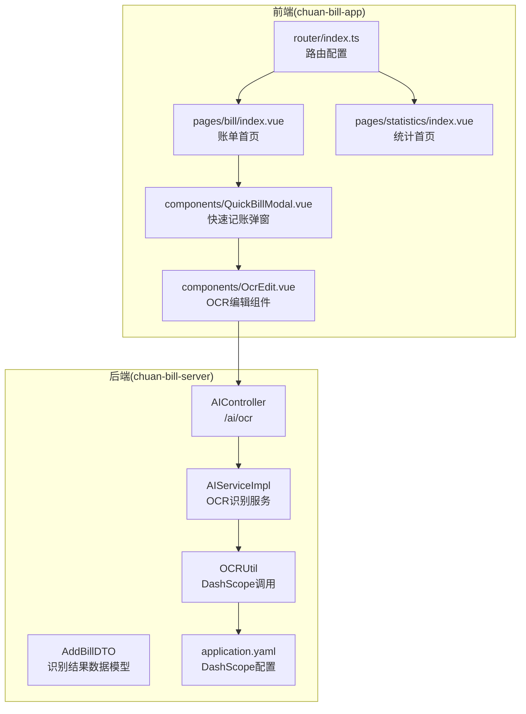
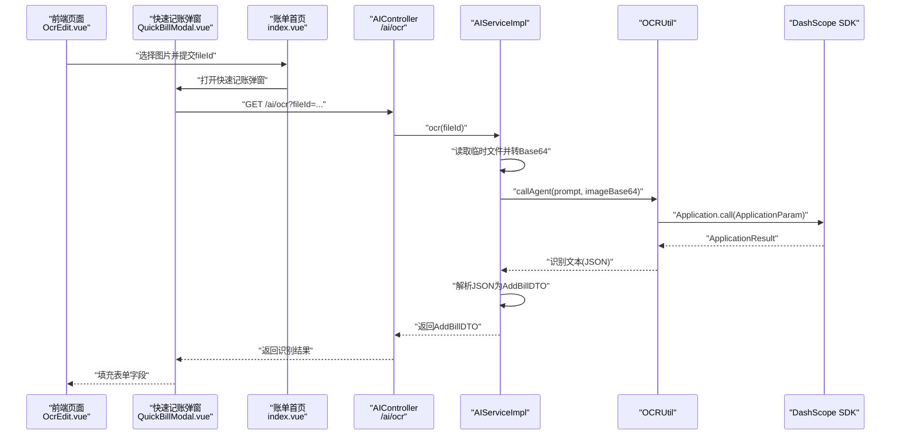
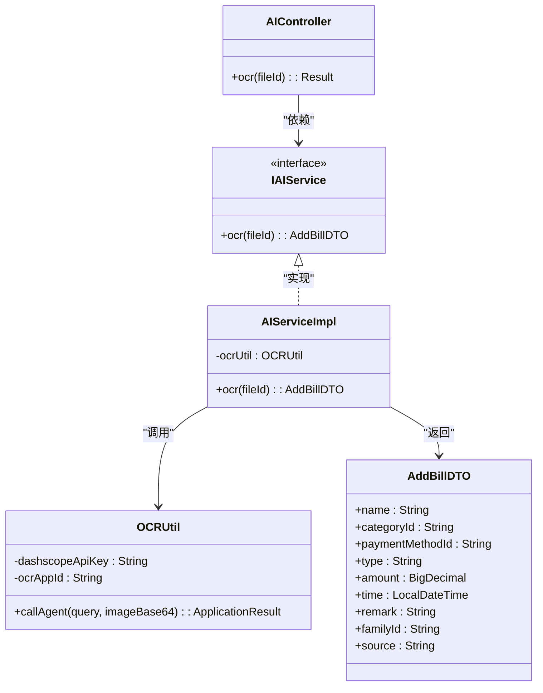
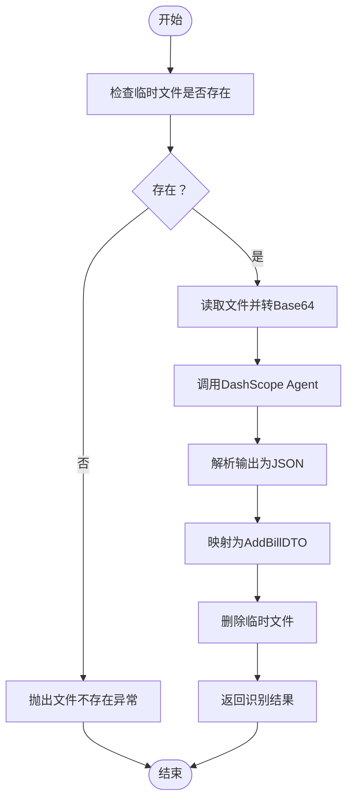
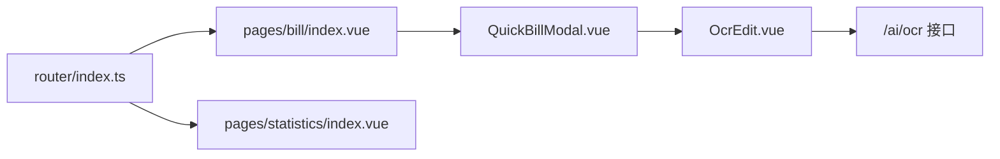
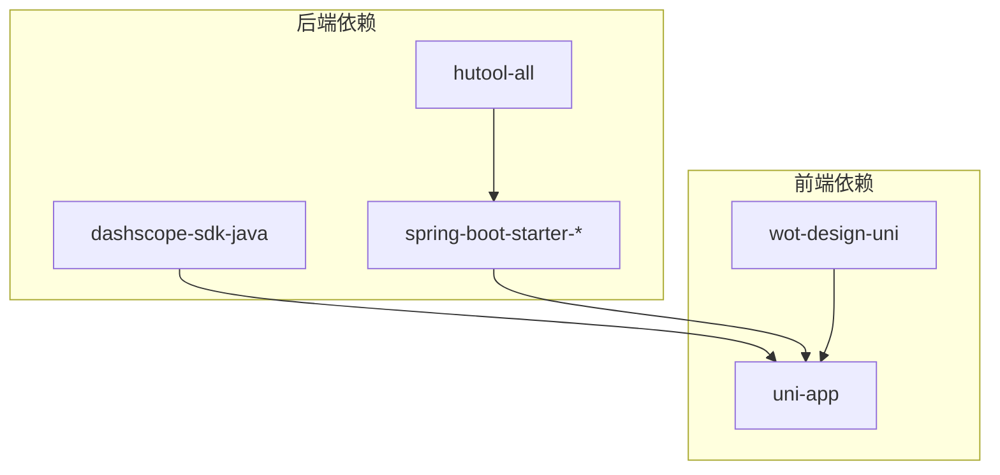

# AI智能分析

<cite>
**本文引用的文件**
- [AIController.java](file://chuan-bill-server/src/main/java/com/samoy/chuanbillserver/controller/AIController.java)
- [IAIService.java](file://chuan-bill-server/src/main/java/com/samoy/chuanbillserver/service/IAIService.java)
- [AIServiceImpl.java](file://chuan-bill-server/src/main/java/com/samoy/chuanbillserver/service/impl/AIServiceImpl.java)
- [OCRUtil.java](file://chuan-bill-server/src/main/java/com/samoy/chuanbillserver/utils/OCRUtil.java)
- [application.yaml](file://chuan-bill-server/src/main/resources/application.yaml)
- [AddBillDTO.java](file://chuan-bill-server/src/main/java/com/samoy/chuanbillserver/dto/AddBillDTO.java)
- [SystemConstants.java](file://chuan-bill-server/src/main/java/com/samoy/chuanbillserver/constant/SystemConstants.java)
- [pom.xml](file://chuan-bill-server/pom.xml)
- [index.vue（账单首页）](file://chuan-bill-app/src/pages/bill/index.vue)
- [index.vue（统计首页）](file://chuan-bill-app/src/pages/statistics/index.vue)
- [QuickBillModal.vue](file://chuan-bill-app/src/pages/bill/components/QuickBillModal.vue)
- [OcrEdit.vue](file://chuan-bill-app/src/pages/bill/components/OcrEdit.vue)
- [router/index.ts](file://chuan-bill-app/src/router/index.ts)
- [PRD.md](file://PRD.md)
</cite>

## 目录
1. [简介](#简介)
2. [项目结构](#项目结构)
3. [核心组件](#核心组件)
4. [架构总览](#架构总览)
5. [详细组件分析](#详细组件分析)
6. [依赖分析](#依赖分析)
7. [性能考虑](#性能考虑)
8. [故障排查指南](#故障排查指南)
9. [结论](#结论)
10. [附录](#附录)

## 简介
本文件围绕“AI智能分析”能力进行系统化说明，重点覆盖以下方面：
- 技术实现：消费行为分析、智能建议生成、预测模型等（当前仓库已实现OCR识别账单信息，智能建议与预测模型为后续扩展预留）
- AI服务集成：DashScope SDK集成、配置参数、调用流程
- 结果生成与展示：识别结果的数据结构、前端组件对接与交互
- API接口：后端OCR接口说明与调用方式
- 前端组件：快速记账弹窗、OCR编辑组件、路由与页面组织

根据PRD文档，统计分析模块包含“AI智能建议”，当前仓库已具备OCR识别基础能力，可作为智能建议的数据输入之一。

## 项目结构
本项目采用前后端分离架构：
- 后端（Spring Boot）：提供AI相关接口、业务服务与DashScope集成
- 前端（uni-app/Vue3）：提供账单录入、统计分析与交互界面

图示来源
- [AIController.java:1-26](file://chuan-bill-server/src/main/java/com/samoy/chuanbillserver/controller/AIController.java#L1-L26)
- [AIServiceImpl.java:1-52](file://chuan-bill-server/src/main/java/com/samoy/chuanbillserver/service/impl/AIServiceImpl.java#L1-L52)
- [OCRUtil.java:1-37](file://chuan-bill-server/src/main/java/com/samoy/chuanbillserver/utils/OCRUtil.java#L1-L37)
- [AddBillDTO.java:1-44](file://chuan-bill-server/src/main/java/com/samoy/chuanbillserver/dto/AddBillDTO.java#L1-L44)
- [application.yaml:41-51](file://chuan-bill-server/src/main/resources/application.yaml#L41-L51)
- [index.vue（账单首页）:1-54](file://chuan-bill-app/src/pages/bill/index.vue#L1-L54)
- [QuickBillModal.vue](file://chuan-bill-app/src/pages/bill/components/QuickBillModal.vue)
- [OcrEdit.vue](file://chuan-bill-app/src/pages/bill/components/OcrEdit.vue)
- [router/index.ts:1-80](file://chuan-bill-app/src/router/index.ts#L1-L80)
- [index.vue（统计首页）:1-23](file://chuan-bill-app/src/pages/statistics/index.vue#L1-L23)

章节来源
- [AIController.java:1-26](file://chuan-bill-server/src/main/java/com/samoy/chuanbillserver/controller/AIController.java#L1-L26)
- [AIServiceImpl.java:1-52](file://chuan-bill-server/src/main/java/com/samoy/chuanbillserver/service/impl/AIServiceImpl.java#L1-L52)
- [OCRUtil.java:1-37](file://chuan-bill-server/src/main/java/com/samoy/chuanbillserver/utils/OCRUtil.java#L1-L37)
- [AddBillDTO.java:1-44](file://chuan-bill-server/src/main/java/com/samoy/chuanbillserver/dto/AddBillDTO.java#L1-L44)
- [application.yaml:41-51](file://chuan-bill-server/src/main/resources/application.yaml#L41-L51)
- [index.vue（账单首页）:1-54](file://chuan-bill-app/src/pages/bill/index.vue#L1-L54)
- [QuickBillModal.vue](file://chuan-bill-app/src/pages/bill/components/QuickBillModal.vue)
- [OcrEdit.vue](file://chuan-bill-app/src/pages/bill/components/OcrEdit.vue)
- [router/index.ts:1-80](file://chuan-bill-app/src/router/index.ts#L1-L80)
- [index.vue（统计首页）:1-23](file://chuan-bill-app/src/pages/statistics/index.vue#L1-L23)

## 核心组件
- 后端控制器：提供OCR识别接口，接收fileId并返回识别结果
- 业务服务：负责读取临时文件、转Base64、调用DashScope OCR Agent，并解析返回结果
- 工具类：封装DashScope SDK调用，注入配置参数
- 数据模型：AddBillDTO用于承载识别后的账单字段
- 前端页面与组件：账单首页、快速记账弹窗、OCR编辑组件、路由配置

章节来源
- [AIController.java:1-26](file://chuan-bill-server/src/main/java/com/samoy/chuanbillserver/controller/AIController.java#L1-L26)
- [AIServiceImpl.java:27-50](file://chuan-bill-server/src/main/java/com/samoy/chuanbillserver/service/impl/AIServiceImpl.java#L27-L50)
- [OCRUtil.java:22-35](file://chuan-bill-server/src/main/java/com/samoy/chuanbillserver/utils/OCRUtil.java#L22-L35)
- [AddBillDTO.java:10-44](file://chuan-bill-server/src/main/java/com/samoy/chuanbillserver/dto/AddBillDTO.java#L10-L44)
- [index.vue（账单首页）:1-54](file://chuan-bill-app/src/pages/bill/index.vue#L1-L54)
- [QuickBillModal.vue](file://chuan-bill-app/src/pages/bill/components/QuickBillModal.vue)
- [OcrEdit.vue](file://chuan-bill-app/src/pages/bill/components/OcrEdit.vue)

## 架构总览
下图展示了从前端发起OCR识别到后端DashScope调用的完整链路：

图示来源
- [AIController.java:20-24](file://chuan-bill-server/src/main/java/com/samoy/chuanbillserver/controller/AIController.java#L20-L24)
- [AIServiceImpl.java:28-49](file://chuan-bill-server/src/main/java/com/samoy/chuanbillserver/service/impl/AIServiceImpl.java#L28-L49)
- [OCRUtil.java:22-35](file://chuan-bill-server/src/main/java/com/samoy/chuanbillserver/utils/OCRUtil.java#L22-L35)
- [AddBillDTO.java:10-44](file://chuan-bill-server/src/main/java/com/samoy/chuanbillserver/dto/AddBillDTO.java#L10-L44)
- [OcrEdit.vue](file://chuan-bill-app/src/pages/bill/components/OcrEdit.vue)
- [QuickBillModal.vue](file://chuan-bill-app/src/pages/bill/components/QuickBillModal.vue)
- [index.vue（账单首页）:1-54](file://chuan-bill-app/src/pages/bill/index.vue#L1-L54)

## 详细组件分析

### 后端：AI控制器与服务
- 控制器提供OCR接口，接收fileId参数，返回识别结果
- 服务层负责：
  - 校验临时文件是否存在
  - 读取文件并编码为Base64（含MIME类型）
  - 调用DashScope Agent，解析输出为AddBillDTO
  - 删除临时文件并返回结果
- 工具类封装DashScope调用，注入apiKey与appId

图示来源
- [AIController.java:1-26](file://chuan-bill-server/src/main/java/com/samoy/chuanbillserver/controller/AIController.java#L1-L26)
- [IAIService.java:1-14](file://chuan-bill-server/src/main/java/com/samoy/chuanbillserver/service/IAIService.java#L1-L14)
- [AIServiceImpl.java:1-52](file://chuan-bill-server/src/main/java/com/samoy/chuanbillserver/service/impl/AIServiceImpl.java#L1-L52)
- [OCRUtil.java:1-37](file://chuan-bill-server/src/main/java/com/samoy/chuanbillserver/utils/OCRUtil.java#L1-L37)
- [AddBillDTO.java:1-44](file://chuan-bill-server/src/main/java/com/samoy/chuanbillserver/dto/AddBillDTO.java#L1-L44)

章节来源
- [AIController.java:1-26](file://chuan-bill-server/src/main/java/com/samoy/chuanbillserver/controller/AIController.java#L1-L26)
- [AIServiceImpl.java:27-50](file://chuan-bill-server/src/main/java/com/samoy/chuanbillserver/service/impl/AIServiceImpl.java#L27-L50)
- [OCRUtil.java:16-35](file://chuan-bill-server/src/main/java/com/samoy/chuanbillserver/utils/OCRUtil.java#L16-L35)
- [AddBillDTO.java:10-44](file://chuan-bill-server/src/main/java/com/samoy/chuanbillserver/dto/AddBillDTO.java#L10-L44)

### DashScope SDK集成与配置
- Maven依赖：引入百炼SDK
- 配置项：
  - dashscope.apiKey：从环境变量注入
  - dashscope.ocr.appId：OCR应用ID
- 工具类通过@Value注入配置，构造ApplicationParam并调用Application.call

章节来源
- [pom.xml:128-134](file://chuan-bill-server/pom.xml#L128-L134)
- [application.yaml:48-51](file://chuan-bill-server/src/main/resources/application.yaml#L48-L51)
- [OCRUtil.java:16-35](file://chuan-bill-server/src/main/java/com/samoy/chuanbillserver/utils/OCRUtil.java#L16-L35)

### 识别流程与错误处理

图示来源
- [AIServiceImpl.java:28-49](file://chuan-bill-server/src/main/java/com/samoy/chuanbillserver/service/impl/AIServiceImpl.java#L28-L49)
- [SystemConstants.java:30-34](file://chuan-bill-server/src/main/java/com/samoy/chuanbillserver/constant/SystemConstants.java#L30-L34)

章节来源
- [AIServiceImpl.java:27-50](file://chuan-bill-server/src/main/java/com/samoy/chuanbillserver/service/impl/AIServiceImpl.java#L27-L50)
- [SystemConstants.java:30-34](file://chuan-bill-server/src/main/java/com/samoy/chuanbillserver/constant/SystemConstants.java#L30-L34)

### 前端：页面与组件
- 账单首页：提供搜索、筛选与快速记账入口
- 快速记账弹窗：承载多种录入方式（手动、OCR、语音）
- OCR编辑组件：负责图片上传、调用后端OCR接口、回填表单
- 路由：自动生成页面路由，支持分包

图示来源
- [index.vue（账单首页）:1-54](file://chuan-bill-app/src/pages/bill/index.vue#L1-L54)
- [QuickBillModal.vue](file://chuan-bill-app/src/pages/bill/components/QuickBillModal.vue)
- [OcrEdit.vue](file://chuan-bill-app/src/pages/bill/components/OcrEdit.vue)
- [router/index.ts:1-80](file://chuan-bill-app/src/router/index.ts#L1-L80)
- [index.vue（统计首页）:1-23](file://chuan-bill-app/src/pages/statistics/index.vue#L1-L23)

章节来源
- [index.vue（账单首页）:1-54](file://chuan-bill-app/src/pages/bill/index.vue#L1-L54)
- [QuickBillModal.vue](file://chuan-bill-app/src/pages/bill/components/QuickBillModal.vue)
- [OcrEdit.vue](file://chuan-bill-app/src/pages/bill/components/OcrEdit.vue)
- [router/index.ts:1-80](file://chuan-bill-app/src/router/index.ts#L1-L80)
- [index.vue（统计首页）:1-23](file://chuan-bill-app/src/pages/statistics/index.vue#L1-L23)

## 依赖分析
- 后端依赖
  - 百炼SDK：用于DashScope调用
  - Hutool：文件读取、Base64编解码
  - Spring Boot Starter：Web、JDBC、Redis、OpenAPI
- 前端依赖
  - uni-app生态：页面、组件、路由
  - 第三方组件库：wot-design-uni

图示来源
- [pom.xml:115-141](file://chuan-bill-server/pom.xml#L115-L141)
- [router/index.ts:1-80](file://chuan-bill-app/src/router/index.ts#L1-L80)

章节来源
- [pom.xml:115-141](file://chuan-bill-server/pom.xml#L115-L141)
- [router/index.ts:1-80](file://chuan-bill-app/src/router/index.ts#L1-L80)

## 性能考虑
- 文件读写与Base64编码：建议限制图片大小与格式，避免超大文件导致内存压力
- DashScope调用：合理设置超时与重试策略，避免阻塞线程
- 临时文件清理：确保识别成功后及时删除，防止磁盘占用
- 前端渲染：OCR识别结果回填时避免频繁重渲染，使用防抖与浅比较

## 故障排查指南
- 缺少配置
  - 确认环境变量DASHSCOPE_API_KEY与DASHSCOPE_OCR_APP_ID已设置
  - 检查application.yaml中dashscope.apiKey与dashscope.ocr.appId是否正确
- 文件不存在
  - 后端会抛出文件不存在异常；前端需提示用户重新上传
- OCR调用失败
  - 检查apiKey与appId是否有效
  - 确认图片格式与大小符合要求
- 结果解析异常
  - 确保DashScope返回的JSON结构与AddBillDTO一致

章节来源
- [application.yaml:48-51](file://chuan-bill-server/src/main/resources/application.yaml#L48-L51)
- [AIServiceImpl.java:31-33](file://chuan-bill-server/src/main/java/com/samoy/chuanbillserver/service/impl/AIServiceImpl.java#L31-L33)
- [OCRUtil.java:22-35](file://chuan-bill-server/src/main/java/com/samoy/chuanbillserver/utils/OCRUtil.java#L22-L35)
- [AddBillDTO.java:10-44](file://chuan-bill-server/src/main/java/com/samoy/chuanbillserver/dto/AddBillDTO.java#L10-L44)

## 结论
当前仓库已完成OCR识别的后端能力与DashScope集成，前端提供了快速记账与OCR编辑组件的基础布局。后续可在现有OCR识别基础上扩展“智能建议生成”与“预测模型”，以消费行为分析为核心，结合历史账单数据，提供预算调整、异常提醒与优化建议等增值功能。

## 附录

### API接口说明
- 地址：GET /ai/ocr
- 请求参数
  - fileId：字符串，必填，临时文件标识
- 响应
  - 成功：返回AddBillDTO对象
  - 失败：返回通用错误码（如文件不存在、OCR识别失败）

章节来源
- [AIController.java:20-24](file://chuan-bill-server/src/main/java/com/samoy/chuanbillserver/controller/AIController.java#L20-L24)
- [AddBillDTO.java:10-44](file://chuan-bill-server/src/main/java/com/samoy/chuanbillserver/dto/AddBillDTO.java#L10-L44)

### 数据模型：AddBillDTO
- 字段说明（节选）
  - name：账单名称
  - categoryId：分类ID
  - paymentMethodId：支付方式ID
  - type：账单类型（income/expense）
  - amount：金额
  - time：时间
  - remark：备注
  - familyId：家庭ID（可选）
  - source：来源（manual/ocr/voice）

章节来源
- [AddBillDTO.java:10-44](file://chuan-bill-server/src/main/java/com/samoy/chuanbillserver/dto/AddBillDTO.java#L10-L44)

### 前端组件实现要点
- 快速记账弹窗：控制显隐，承载多种录入方式
- OCR编辑组件：负责图片上传、调用后端OCR接口、回填表单字段
- 路由配置：自动生成页面路由，支持分包

章节来源
- [QuickBillModal.vue](file://chuan-bill-app/src/pages/bill/components/QuickBillModal.vue)
- [OcrEdit.vue](file://chuan-bill-app/src/pages/bill/components/OcrEdit.vue)
- [router/index.ts:1-80](file://chuan-bill-app/src/router/index.ts#L1-L80)

### AI智能建议与预测模型（扩展建议）
- 消费行为分析：基于历史账单的时间、类别、金额分布，识别消费高峰与异常波动
- 智能建议生成：结合预算阈值与类别占比，给出“减少XX类支出”“调整预算周期”等建议
- 预测模型：基于时间序列或回归模型预测未来支出趋势
- 展示方式：在统计首页新增“智能建议卡片”，点击展开详情与操作按钮

章节来源
- [PRD.md:85-90](file://PRD.md#L85-L90)