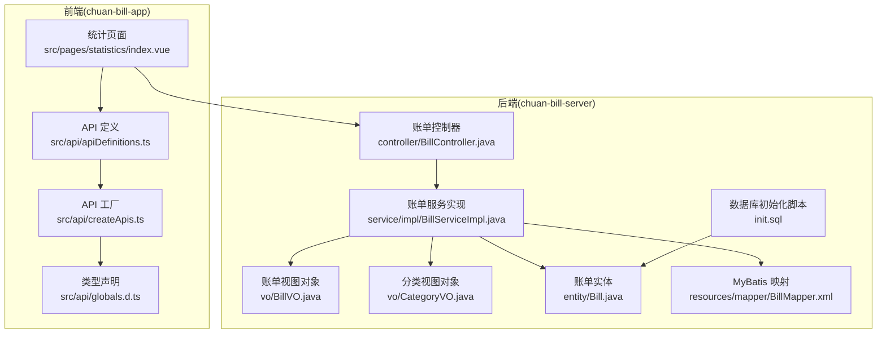
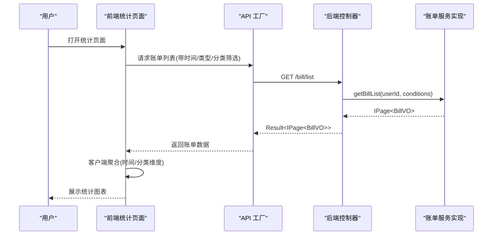
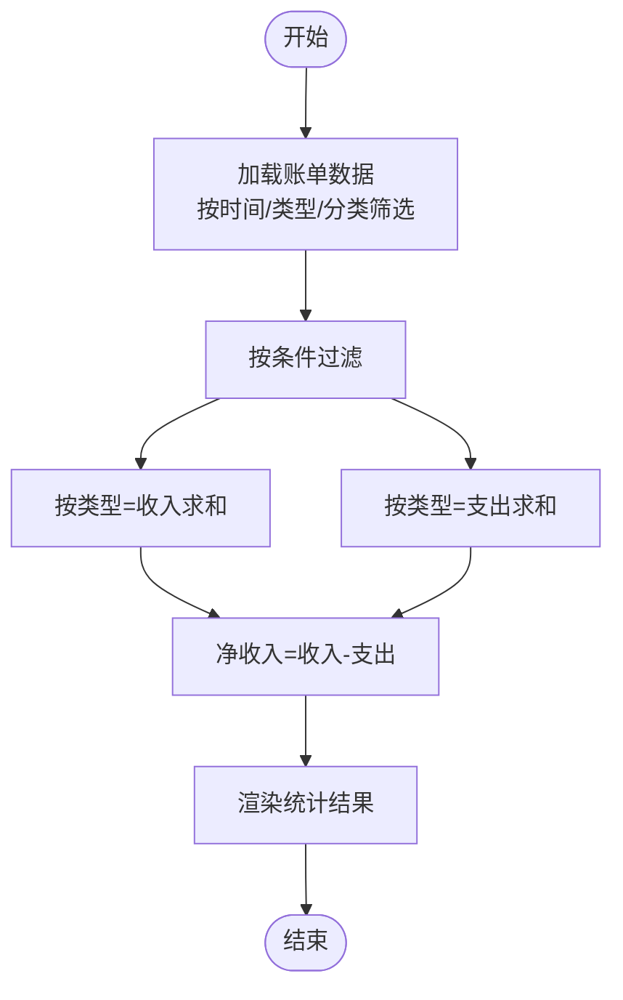
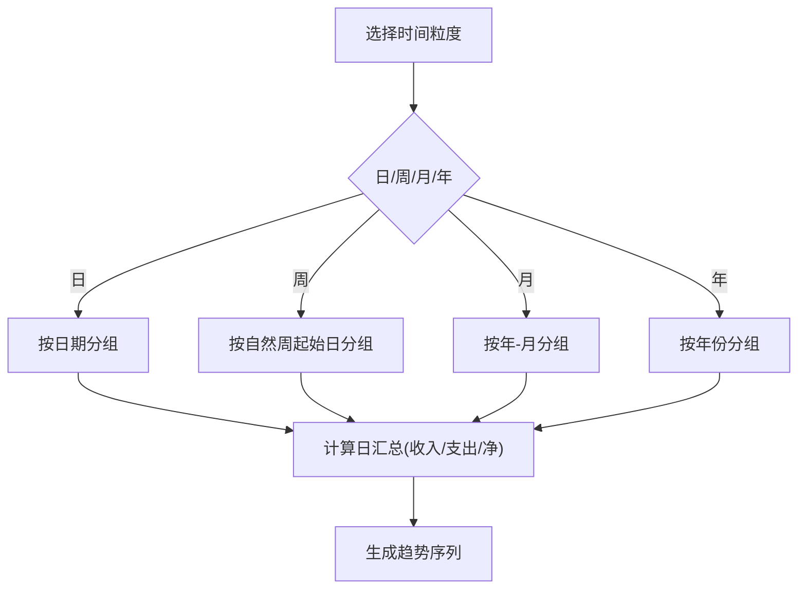
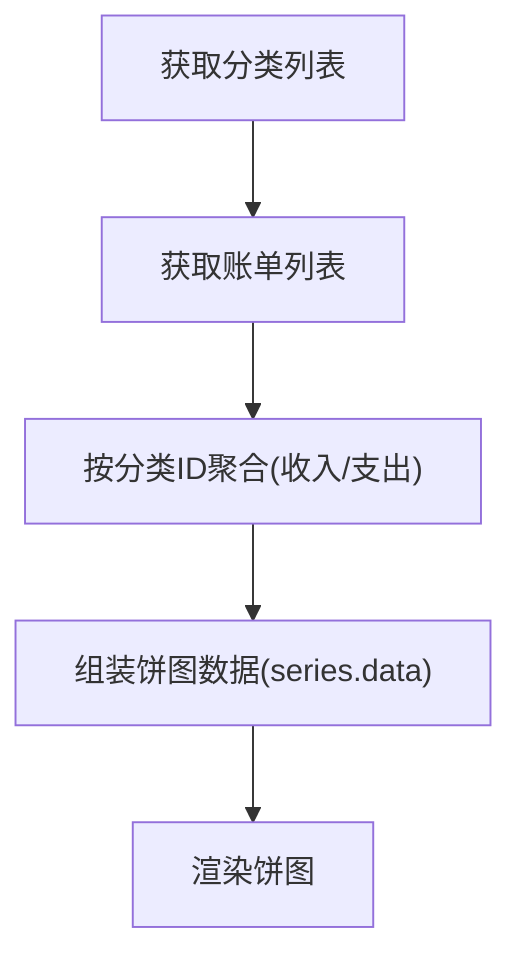
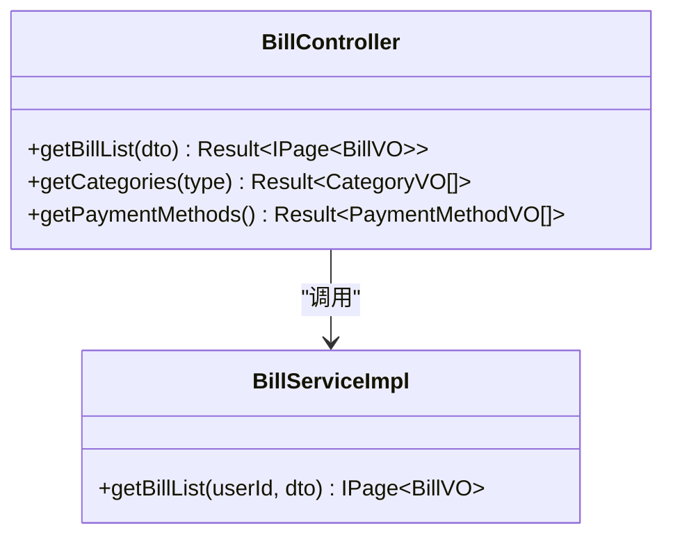
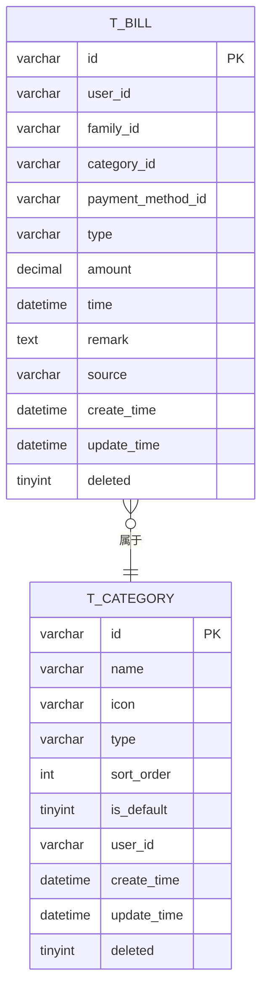

# 收支统计

<cite>
**本文引用的文件**
- [chuan-bill-app/src/pages/statistics/index.vue](file://chuan-bill-app/src/pages/statistics/index.vue)
- [chuan-bill-app/src/api/apiDefinitions.ts](file://chuan-bill-app/src/api/apiDefinitions.ts)
- [chuan-bill-app/src/api/createApis.ts](file://chuan-bill-app/src/api/createApis.ts)
- [chuan-bill-app/src/api/globals.d.ts](file://chuan-bill-app/src/api/globals.d.ts)
- [chuan-bill-server/src/main/java/com/samoy/chuanbillserver/controller/BillController.java](file://chuan-bill-server/src/main/java/com/samoy/chuanbillserver/controller/BillController.java)
- [chuan-bill-server/src/main/java/com/samoy/chuanbillserver/service/impl/BillServiceImpl.java](file://chuan-bill-server/src/main/java/com/samoy/chuanbillserver/service/impl/BillServiceImpl.java)
- [chuan-bill-server/src/main/java/com/samoy/chuanbillserver/vo/BillVO.java](file://chuan-bill-server/src/main/java/com/samoy/chuanbillserver/vo/BillVO.java)
- [chuan-bill-server/src/main/java/com/samoy/chuanbillserver/vo/CategoryVO.java](file://chuan-bill-server/src/main/java/com/samoy/chuanbillserver/vo/CategoryVO.java)
- [chuan-bill-server/src/main/java/com/samoy/chuanbillserver/entity/Bill.java](file://chuan-bill-server/src/main/java/com/samoy/chuanbillserver/entity/Bill.java)
- [chuan-bill-server/src/main/resources/mapper/BillMapper.xml](file://chuan-bill-server/src/main/resources/mapper/BillMapper.xml)
- [chuan-bill-server/init.sql](file://chuan-bill-server/init.sql)
</cite>

## 目录
1. [简介](#简介)
2. [项目结构](#项目结构)
3. [核心组件](#核心组件)
4. [架构概览](#架构概览)
5. [详细组件分析](#详细组件分析)
6. [依赖分析](#依赖分析)
7. [性能考虑](#性能考虑)
8. [故障排查指南](#故障排查指南)
9. [结论](#结论)
10. [附录](#附录)

## 简介
本文件围绕“收支统计”功能进行系统化说明，覆盖以下方面：
- 统计口径与计算逻辑：总收入、总支出、净收入的定义与计算方法
- 时间维度统计：日、周、月、年的聚合策略与实现思路
- 分类维度统计：按类别汇总收支并以饼图展示的方案
- API 接口说明：后端接口能力与前端调用方式
- 前端图表组件实现要点：基于 ECharts 的配置建议与数据准备
- SQL 查询语句与数据聚合算法：数据库层面的统计实现路径
- 实施建议与最佳实践：性能优化、错误处理与扩展方向

## 项目结构
收支统计涉及前后端协作：
- 前端负责统计页面的交互与图表渲染（当前统计页面占位，后续扩展）
- 后端提供账单列表与分类列表接口，前端在此基础上进行二次聚合与可视化

**图表来源**
- [chuan-bill-app/src/pages/statistics/index.vue:1-23](file://chuan-bill-app/src/pages/statistics/index.vue#L1-L23)
- [chuan-bill-app/src/api/apiDefinitions.ts:19-37](file://chuan-bill-app/src/api/apiDefinitions.ts#L19-L37)
- [chuan-bill-app/src/api/createApis.ts:65-76](file://chuan-bill-app/src/api/createApis.ts#L65-L76)
- [chuan-bill-app/src/api/globals.d.ts:488-534](file://chuan-bill-app/src/api/globals.d.ts#L488-L534)
- [chuan-bill-server/src/main/java/com/samoy/chuanbillserver/controller/BillController.java:23-90](file://chuan-bill-server/src/main/java/com/samoy/chuanbillserver/controller/BillController.java#L23-L90)
- [chuan-bill-server/src/main/java/com/samoy/chuanbillserver/service/impl/BillServiceImpl.java:50-123](file://chuan-bill-server/src/main/java/com/samoy/chuanbillserver/service/impl/BillServiceImpl.java#L50-L123)
- [chuan-bill-server/src/main/java/com/samoy/chuanbillserver/vo/BillVO.java:11-43](file://chuan-bill-server/src/main/java/com/samoy/chuanbillserver/vo/BillVO.java#L11-L43)
- [chuan-bill-server/src/main/java/com/samoy/chuanbillserver/vo/CategoryVO.java:8-29](file://chuan-bill-server/src/main/java/com/samoy/chuanbillserver/vo/CategoryVO.java#L8-L29)
- [chuan-bill-server/src/main/java/com/samoy/chuanbillserver/entity/Bill.java:24-81](file://chuan-bill-server/src/main/java/com/samoy/chuanbillserver/entity/Bill.java#L24-L81)
- [chuan-bill-server/src/main/resources/mapper/BillMapper.xml:3-5](file://chuan-bill-server/src/main/resources/mapper/BillMapper.xml#L3-L5)
- [chuan-bill-server/init.sql:133-158](file://chuan-bill-server/init.sql#L133-L158)

**章节来源**
- [chuan-bill-app/src/pages/statistics/index.vue:1-23](file://chuan-bill-app/src/pages/statistics/index.vue#L1-L23)
- [chuan-bill-server/src/main/java/com/samoy/chuanbillserver/controller/BillController.java:23-90](file://chuan-bill-server/src/main/java/com/samoy/chuanbillserver/controller/BillController.java#L23-L90)

## 核心组件
- 统计页面（前端占位）：承载统计入口与图表容器，当前仅包含基础布局与标题
- 账单列表接口：提供按时间、类型、分类、金额范围等条件筛选的账单分页数据
- 分类列表接口：提供收入/支出两类分类，用于统计分类维度
- 数据模型：账单实体与视图对象，包含金额、类型、时间、分类等关键字段

**章节来源**
- [chuan-bill-app/src/pages/statistics/index.vue:1-23](file://chuan-bill-app/src/pages/statistics/index.vue#L1-L23)
- [chuan-bill-server/src/main/java/com/samoy/chuanbillserver/controller/BillController.java:37-89](file://chuan-bill-server/src/main/java/com/samoy/chuanbillserver/controller/BillController.java#L37-L89)
- [chuan-bill-server/src/main/java/com/samoy/chuanbillserver/vo/BillVO.java:11-43](file://chuan-bill-server/src/main/java/com/samoy/chuanbillserver/vo/BillVO.java#L11-L43)
- [chuan-bill-server/src/main/java/com/samoy/chuanbillserver/entity/Bill.java:24-81](file://chuan-bill-server/src/main/java/com/samoy/chuanbillserver/entity/Bill.java#L24-L81)

## 架构概览
统计功能采用“后端数据 + 前端聚合”的模式：
- 后端提供账单列表与分类列表，支持多维筛选
- 前端在客户端完成时间维度聚合与分类维度聚合，并渲染图表

**图表来源**
- [chuan-bill-app/src/api/apiDefinitions.ts:33-35](file://chuan-bill-app/src/api/apiDefinitions.ts#L33-L35)
- [chuan-bill-server/src/main/java/com/samoy/chuanbillserver/controller/BillController.java:37-42](file://chuan-bill-server/src/main/java/com/samoy/chuanbillserver/controller/BillController.java#L37-L42)
- [chuan-bill-server/src/main/java/com/samoy/chuanbillserver/service/impl/BillServiceImpl.java:50-123](file://chuan-bill-server/src/main/java/com/samoy/chuanbillserver/service/impl/BillServiceImpl.java#L50-L123)

## 详细组件分析

### 计算逻辑与展示方式
- 总收入：对账单类型为“收入”的金额求和
- 总支出：对账单类型为“支出”的金额求和
- 净收入：总收入 − 总支出
- 展示形式：数值卡片、趋势折线图、分类饼图

**图表来源**
- [chuan-bill-server/src/main/java/com/samoy/chuanbillserver/service/impl/BillServiceImpl.java:50-123](file://chuan-bill-server/src/main/java/com/samoy/chuanbillserver/service/impl/BillServiceImpl.java#L50-L123)
- [chuan-bill-server/src/main/java/com/samoy/chuanbillserver/vo/BillVO.java:24-29](file://chuan-bill-server/src/main/java/com/samoy/chuanbillserver/vo/BillVO.java#L24-L29)

**章节来源**
- [chuan-bill-server/src/main/java/com/samoy/chuanbillserver/vo/BillVO.java:24-29](file://chuan-bill-server/src/main/java/com/samoy/chuanbillserver/vo/BillVO.java#L24-L29)
- [chuan-bill-server/src/main/java/com/samoy/chuanbillserver/service/impl/BillServiceImpl.java:50-123](file://chuan-bill-server/src/main/java/com/samoy/chuanbillserver/service/impl/BillServiceImpl.java#L50-L123)

### 时间维度统计（日/周/月/年）
- 日：按日期字段分组，统计每日收支与净收入
- 周：将日期映射到所在自然周起始日，再按周分组
- 月：按年-月分组
- 年：按年份分组
- 实现建议：
  - 后端返回按天粒度的明细，前端按需聚合
  - 若需高性能，可在数据库侧按时间维度做预聚合（如新增按日/月汇总表）

**图表来源**
- [chuan-bill-server/src/main/java/com/samoy/chuanbillserver/entity/Bill.java:80-81](file://chuan-bill-server/src/main/java/com/samoy/chuanbillserver/entity/Bill.java#L80-L81)
- [chuan-bill-server/init.sql:149-157](file://chuan-bill-server/init.sql#L149-L157)

**章节来源**
- [chuan-bill-server/src/main/java/com/samoy/chuanbillserver/entity/Bill.java:80-81](file://chuan-bill-server/src/main/java/com/samoy/chuanbillserver/entity/Bill.java#L80-L81)
- [chuan-bill-server/init.sql:149-157](file://chuan-bill-server/init.sql#L149-L157)

### 分类维度统计与饼图展示
- 分类维度：按分类 ID/名称分组，统计各类别收入与支出
- 饼图数据结构：每个分类一个扇区，值为该分类的收支金额
- 前端实现要点：
  - 先获取分类列表，再结合账单数据进行聚合
  - 对于“其他”类目，可合并至“其他”项避免过多细碎扇区

**图表来源**
- [chuan-bill-server/src/main/java/com/samoy/chuanbillserver/controller/BillController.java:74-81](file://chuan-bill-server/src/main/java/com/samoy/chuanbillserver/controller/BillController.java#L74-L81)
- [chuan-bill-server/src/main/java/com/samoy/chuanbillserver/vo/CategoryVO.java:8-29](file://chuan-bill-server/src/main/java/com/samoy/chuanbillserver/vo/CategoryVO.java#L8-L29)

**章节来源**
- [chuan-bill-server/src/main/java/com/samoy/chuanbillserver/controller/BillController.java:74-81](file://chuan-bill-server/src/main/java/com/samoy/chuanbillserver/controller/BillController.java#L74-L81)
- [chuan-bill-server/src/main/java/com/samoy/chuanbillserver/vo/CategoryVO.java:8-29](file://chuan-bill-server/src/main/java/com/samoy/chuanbillserver/vo/CategoryVO.java#L8-L29)

### API 接口说明
- 获取账单列表
  - 方法与路径：GET /bill/list
  - 查询参数：startDate、endDate、type、categoryId、minAmount、maxAmount、name、remark、page、size
  - 返回：分页账单数据（包含分类与支付方式信息）
- 获取分类列表
  - 方法与路径：GET /bill/categories?type={income|expense}
  - 返回：分类列表（含类型、排序、默认标记等）
- 获取支付方式列表
  - 方法与路径：GET /bill/payment-methods
  - 返回：支付方式列表

**图表来源**
- [chuan-bill-server/src/main/java/com/samoy/chuanbillserver/controller/BillController.java:37-89](file://chuan-bill-server/src/main/java/com/samoy/chuanbillserver/controller/BillController.java#L37-L89)
- [chuan-bill-server/src/main/java/com/samoy/chuanbillserver/service/impl/BillServiceImpl.java:50-123](file://chuan-bill-server/src/main/java/com/samoy/chuanbillserver/service/impl/BillServiceImpl.java#L50-L123)

**章节来源**
- [chuan-bill-server/src/main/java/com/samoy/chuanbillserver/controller/BillController.java:37-89](file://chuan-bill-server/src/main/java/com/samoy/chuanbillserver/controller/BillController.java#L37-L89)
- [chuan-bill-app/src/api/apiDefinitions.ts:33-35](file://chuan-bill-app/src/api/apiDefinitions.ts#L33-L35)
- [chuan-bill-app/src/api/globals.d.ts:986-1035](file://chuan-bill-app/src/api/globals.d.ts#L986-L1035)

### 前端图表组件实现细节（ECharts）
- 数据准备
  - 时间序列：按日/周/月/年聚合后的数组，元素包含时间与对应收支/净收入
  - 分类饼图：数组，元素包含分类名称与金额
- 建议配置
  - 折线图：开启平滑曲线、双轴（收入/支出）、工具箱（缩放、复位）
  - 饼图：百分比标签、点击高亮、图例开关
- 交互与刷新
  - 通过时间选择器与筛选器触发重新拉取数据并刷新图表

[本节为通用实现建议，不直接分析具体源码文件，故无“章节来源”]

### SQL 查询语句与数据聚合算法
- 账单表索引设计
  - 关键索引：user_id、family_id、category_id、payment_method_id、type、time、create_time
  - 复合索引：(user_id, time)、(family_id, time)
- 时间维度聚合（示例思路）
  - 日：SELECT DATE(time) AS day, SUM(amount) AS total FROM t_bill WHERE type='income' GROUP BY day ORDER BY day
  - 月：SELECT DATE_FORMAT(time, '%Y-%m') AS month, SUM(amount) AS total FROM t_bill WHERE type='expense' GROUP BY month ORDER BY month
- 分类维度聚合（示例思路）
  - SELECT c.name, SUM(b.amount) AS total FROM t_bill b JOIN t_category c ON b.category_id=c.id WHERE b.type='income' GROUP BY c.name ORDER BY total DESC
- 算法复杂度
  - 单表扫描 + 分组聚合：O(n log n)，受索引与数据量影响
  - 建议：对高频统计字段建立合适索引；必要时引入物化视图或汇总表

**章节来源**
- [chuan-bill-server/init.sql:133-158](file://chuan-bill-server/init.sql#L133-L158)
- [chuan-bill-server/init.sql:206-312](file://chuan-bill-server/init.sql#L206-L312)

## 依赖分析
- 前端依赖后端接口：统计页面依赖账单列表与分类列表
- 后端依赖数据库：账单服务依赖账单表与分类表，索引支撑高效查询
- 耦合性与内聚性：控制器职责清晰，服务层封装查询与聚合逻辑

**图表来源**
- [chuan-bill-app/src/pages/statistics/index.vue:1-23](file://chuan-bill-app/src/pages/statistics/index.vue#L1-L23)
- [chuan-bill-app/src/api/apiDefinitions.ts:33-35](file://chuan-bill-app/src/api/apiDefinitions.ts#L33-L35)
- [chuan-bill-server/src/main/java/com/samoy/chuanbillserver/controller/BillController.java:37-89](file://chuan-bill-server/src/main/java/com/samoy/chuanbillserver/controller/BillController.java#L37-L89)
- [chuan-bill-server/init.sql:133-158](file://chuan-bill-server/init.sql#L133-L158)

**章节来源**
- [chuan-bill-server/src/main/java/com/samoy/chuanbillserver/controller/BillController.java:23-90](file://chuan-bill-server/src/main/java/com/samoy/chuanbillserver/controller/BillController.java#L23-L90)
- [chuan-bill-server/src/main/java/com/samoy/chuanbillserver/service/impl/BillServiceImpl.java:50-123](file://chuan-bill-server/src/main/java/com/samoy/chuanbillserver/service/impl/BillServiceImpl.java#L50-L123)

## 性能考虑
- 索引优化：确保按 user_id/time/type 等常用查询字段建立索引
- 分页与筛选：优先在后端分页与过滤，减少前端传输与渲染压力
- 缓存策略：对热门分类与常用时间段的统计结果进行短期缓存
- 聚合策略：高频时间维度统计可考虑数据库侧预聚合或定时任务生成汇总表

[本节为通用性能建议，不直接分析具体源码文件，故无“章节来源”]

## 故障排查指南
- 无数据或数据异常
  - 检查筛选条件（时间范围、类型、分类）是否正确
  - 确认登录用户与数据归属一致
- 性能问题
  - 检查数据库索引是否存在
  - 评估查询范围是否过大，必要时缩小时间范围
- 接口报错
  - 核对接口路径与参数类型（参考 API 定义与类型声明）
  - 查看后端控制器返回的统一结果包装

**章节来源**
- [chuan-bill-app/src/api/globals.d.ts:986-1035](file://chuan-bill-app/src/api/globals.d.ts#L986-L1035)
- [chuan-bill-server/src/main/java/com/samoy/chuanbillserver/controller/BillController.java:37-89](file://chuan-bill-server/src/main/java/com/samoy/chuanbillserver/controller/BillController.java#L37-L89)

## 结论
收支统计功能以“后端提供明细 + 前端聚合可视化”为核心路径。当前仓库已具备账单列表与分类列表的基础能力，后续可在前端统计页面中实现时间与分类维度的聚合与图表渲染，并按需引入数据库侧预聚合以提升性能。

[本节为总结性内容，不直接分析具体源码文件，故无“章节来源”]

## 附录

### 数据模型关系

**图表来源**
- [chuan-bill-server/init.sql:133-158](file://chuan-bill-server/init.sql#L133-L158)
- [chuan-bill-server/init.sql:36-51](file://chuan-bill-server/init.sql#L36-L51)