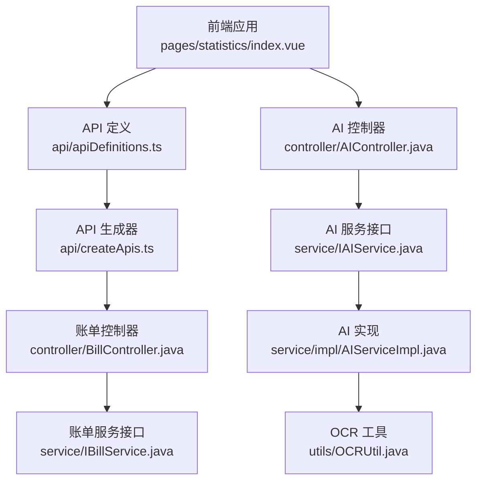
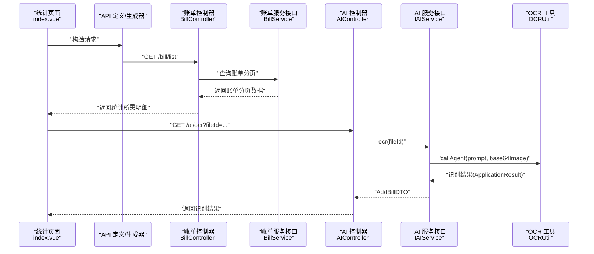
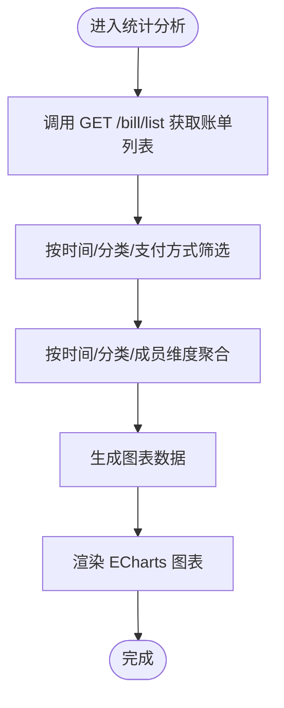
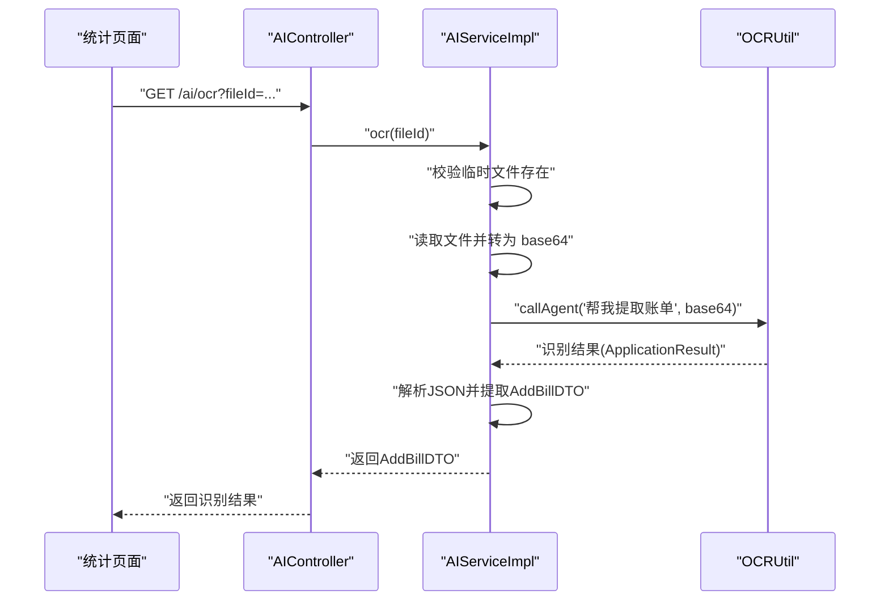
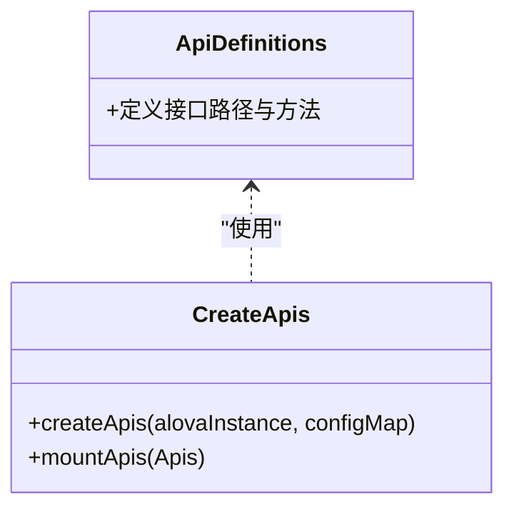
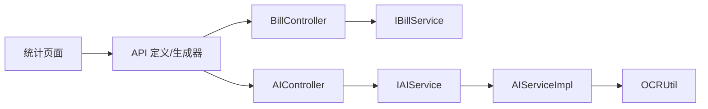

# 统计分析模块

<cite>
**本文引用的文件**
- [chuan-bill-app/src/pages/statistics/index.vue](file://chuan-bill-app/src/pages/statistics/index.vue)
- [chuan-bill-app/src/api/apiDefinitions.ts](file://chuan-bill-app/src/api/apiDefinitions.ts)
- [chuan-bill-app/src/api/createApis.ts](file://chuan-bill-app/src/api/createApis.ts)
- [chuan-bill-server/src/main/java/com/samoy/chuanbillserver/controller/AIController.java](file://chuan-bill-server/src/main/java/com/samoy/chuanbillserver/controller/AIController.java)
- [chuan-bill-server/src/main/java/com/samoy/chuanbillserver/controller/BillController.java](file://chuan-bill-server/src/main/java/com/samoy/chuanbillserver/controller/BillController.java)
- [chuan-bill-server/src/main/java/com/samoy/chuanbillserver/service/IAIService.java](file://chuan-bill-server/src/main/java/com/samoy/chuanbillserver/service/IAIService.java)
- [chuan-bill-server/src/main/java/com/samoy/chuanbillserver/service/impl/AIServiceImpl.java](file://chuan-bill-server/src/main/java/com/samoy/chuanbillserver/service/impl/AIServiceImpl.java)
- [chuan-bill-server/src/main/java/com/samoy/chuanbillserver/service/IBillService.java](file://chuan-bill-server/src/main/java/com/samoy/chuanbillserver/service/IBillService.java)
- [chuan-bill-server/src/main/java/com/samoy/chuanbillserver/utils/OCRUtil.java](file://chuan-bill-server/src/main/java/com/samoy/chuanbillserver/utils/OCRUtil.java)
</cite>

## 目录
1. [简介](#简介)
2. [项目结构](#项目结构)
3. [核心组件](#核心组件)
4. [架构总览](#架构总览)
5. [详细组件分析](#详细组件分析)
6. [依赖分析](#依赖分析)
7. [性能考虑](#性能考虑)
8. [故障排查指南](#故障排查指南)
9. [结论](#结论)
10. [附录](#附录)

## 简介
本文件面向“统计分析模块”的功能与实现，结合当前仓库中已有的账单管理、AI识别（OCR）能力，系统性梳理统计分析的现状、可扩展方向与实现路径。当前仓库中统计分析页面尚未包含具体图表与报表逻辑，但已具备以下关键能力：
- 账单数据查询与分页接口，支持多维筛选（时间、分类、支付方式等）
- AI OCR 识别图片中的账单信息，返回结构化数据
- 前端通过 Alova API 定义与生成器完成接口调用

基于以上能力，统计分析模块可围绕以下目标展开：
- 收支统计：按时间维度（日/周/月/年）、分类维度、成员维度进行聚合
- 趋势分析：基于时间序列的收支变化趋势
- 预算执行情况：预算与实际支出对比
- AI 智能建议：基于消费行为的洞察与建议
- 报表生成与展示：以 ECharts 图表呈现统计结果

## 项目结构
统计分析模块涉及前后端协作：
- 前端负责页面渲染、图表展示、交互控制与 API 调用
- 后端提供账单数据查询、AI OCR 识别等服务

**图示来源**
- [chuan-bill-app/src/pages/statistics/index.vue:1-23](file://chuan-bill-app/src/pages/statistics/index.vue#L1-L23)
- [chuan-bill-app/src/api/apiDefinitions.ts:19-37](file://chuan-bill-app/src/api/apiDefinitions.ts#L19-L37)
- [chuan-bill-app/src/api/createApis.ts:65-76](file://chuan-bill-app/src/api/createApis.ts#L65-L76)
- [chuan-bill-server/src/main/java/com/samoy/chuanbillserver/controller/BillController.java:23-91](file://chuan-bill-server/src/main/java/com/samoy/chuanbillserver/controller/BillController.java#L23-L91)
- [chuan-bill-server/src/main/java/com/samoy/chuanbillserver/controller/AIController.java:13-26](file://chuan-bill-server/src/main/java/com/samoy/chuanbillserver/controller/AIController.java#L13-L26)
- [chuan-bill-server/src/main/java/com/samoy/chuanbillserver/service/IAIService.java:5-14](file://chuan-bill-server/src/main/java/com/samoy/chuanbillserver/service/IAIService.java#L5-L14)
- [chuan-bill-server/src/main/java/com/samoy/chuanbillserver/service/impl/AIServiceImpl.java:21-52](file://chuan-bill-server/src/main/java/com/samoy/chuanbillserver/service/impl/AIServiceImpl.java#L21-L52)
- [chuan-bill-server/src/main/java/com/samoy/chuanbillserver/utils/OCRUtil.java:13-37](file://chuan-bill-server/src/main/java/com/samoy/chuanbillserver/utils/OCRUtil.java#L13-L37)

**章节来源**
- [chuan-bill-app/src/pages/statistics/index.vue:1-23](file://chuan-bill-app/src/pages/statistics/index.vue#L1-L23)
- [chuan-bill-app/src/api/apiDefinitions.ts:19-37](file://chuan-bill-app/src/api/apiDefinitions.ts#L19-L37)
- [chuan-bill-app/src/api/createApis.ts:65-76](file://chuan-bill-app/src/api/createApis.ts#L65-L76)
- [chuan-bill-server/src/main/java/com/samoy/chuanbillserver/controller/BillController.java:23-91](file://chuan-bill-server/src/main/java/com/samoy/chuanbillserver/controller/BillController.java#L23-L91)
- [chuan-bill-server/src/main/java/com/samoy/chuanbillserver/controller/AIController.java:13-26](file://chuan-bill-server/src/main/java/com/samoy/chuanbillserver/controller/AIController.java#L13-L26)
- [chuan-bill-server/src/main/java/com/samoy/chuanbillserver/service/IAIService.java:5-14](file://chuan-bill-server/src/main/java/com/samoy/chuanbillserver/service/IAIService.java#L5-L14)
- [chuan-bill-server/src/main/java/com/samoy/chuanbillserver/service/impl/AIServiceImpl.java:21-52](file://chuan-bill-server/src/main/java/com/samoy/chuanbillserver/service/impl/AIServiceImpl.java#L21-L52)
- [chuan-bill-server/src/main/java/com/samoy/chuanbillserver/utils/OCRUtil.java:13-37](file://chuan-bill-server/src/main/java/com/samoy/chuanbillserver/utils/OCRUtil.java#L13-L37)

## 核心组件
- 统计分析页面：当前仅占位页面，后续需接入图表与报表组件
- 账单查询接口：提供分页账单列表、详情、分类与支付方式查询
- AI OCR 接口：通过 DashScope 应用调用识别图片中的账单信息
- API 定义与生成器：统一管理接口路径与参数，便于前端调用

**章节来源**
- [chuan-bill-app/src/pages/statistics/index.vue:1-23](file://chuan-bill-app/src/pages/statistics/index.vue#L1-L23)
- [chuan-bill-server/src/main/java/com/samoy/chuanbillserver/controller/BillController.java:37-91](file://chuan-bill-server/src/main/java/com/samoy/chuanbillserver/controller/BillController.java#L37-L91)
- [chuan-bill-server/src/main/java/com/samoy/chuanbillserver/controller/AIController.java:20-24](file://chuan-bill-server/src/main/java/com/samoy/chuanbillserver/controller/AIController.java#L20-L24)
- [chuan-bill-app/src/api/apiDefinitions.ts:19-37](file://chuan-bill-app/src/api/apiDefinitions.ts#L19-L37)
- [chuan-bill-app/src/api/createApis.ts:65-76](file://chuan-bill-app/src/api/createApis.ts#L65-L76)

## 架构总览
统计分析模块的典型工作流如下：
- 前端统计页面发起请求，调用账单查询接口获取原始数据
- 可选：上传图片触发 AI OCR 接口，返回结构化账单数据
- 后端返回数据后，前端进行聚合与可视化展示（ECharts）

**图示来源**
- [chuan-bill-app/src/pages/statistics/index.vue:1-23](file://chuan-bill-app/src/pages/statistics/index.vue#L1-L23)
- [chuan-bill-app/src/api/apiDefinitions.ts:36](file://chuan-bill-app/src/api/apiDefinitions.ts#L36)
- [chuan-bill-server/src/main/java/com/samoy/chuanbillserver/controller/BillController.java:37-42](file://chuan-bill-server/src/main/java/com/samoy/chuanbillserver/controller/BillController.java#L37-L42)
- [chuan-bill-server/src/main/java/com/samoy/chuanbillserver/controller/AIController.java:20-24](file://chuan-bill-server/src/main/java/com/samoy/chuanbillserver/controller/AIController.java#L20-L24)
- [chuan-bill-server/src/main/java/com/samoy/chuanbillserver/service/IAIService.java:12](file://chuan-bill-server/src/main/java/com/samoy/chuanbillserver/service/IAIService.java#L12)
- [chuan-bill-server/src/main/java/com/samoy/chuanbillserver/utils/OCRUtil.java:22-35](file://chuan-bill-server/src/main/java/com/samoy/chuanbillserver/utils/OCRUtil.java#L22-L35)

## 详细组件分析

### 统计分析页面（占位）
- 当前页面为占位布局，标题为“统计”，后续应接入图表与报表组件，并绑定数据源。

**章节来源**
- [chuan-bill-app/src/pages/statistics/index.vue:1-23](file://chuan-bill-app/src/pages/statistics/index.vue#L1-L23)

### 账单查询接口
- 列表查询：支持分页与多维筛选（如时间范围、分类、支付方式），返回账单分页视图对象
- 详情查询：按账单 ID 查询详情
- 分类与支付方式：获取分类列表与支付方式列表

**图示来源**
- [chuan-bill-server/src/main/java/com/samoy/chuanbillserver/controller/BillController.java:37-91](file://chuan-bill-server/src/main/java/com/samoy/chuanbillserver/controller/BillController.java#L37-L91)

**章节来源**
- [chuan-bill-server/src/main/java/com/samoy/chuanbillserver/controller/BillController.java:37-91](file://chuan-bill-server/src/main/java/com/samoy/chuanbillserver/controller/BillController.java#L37-L91)

### AI OCR 识别接口
- 接口路径：GET /ai/ocr
- 输入：fileId（临时文件标识）
- 处理流程：
  1) 校验临时文件是否存在
  2) 读取文件并转为 base64
  3) 调用 DashScope 应用进行 OCR 识别
  4) 解析输出 JSON，提取识别结果
  5) 成功后删除临时文件
- 异常处理：未配置密钥或输入缺失时抛出业务异常

**图示来源**
- [chuan-bill-server/src/main/java/com/samoy/chuanbillserver/controller/AIController.java:20-24](file://chuan-bill-server/src/main/java/com/samoy/chuanbillserver/controller/AIController.java#L20-L24)
- [chuan-bill-server/src/main/java/com/samoy/chuanbillserver/service/impl/AIServiceImpl.java:27-50](file://chuan-bill-server/src/main/java/com/samoy/chuanbillserver/service/impl/AIServiceImpl.java#L27-L50)
- [chuan-bill-server/src/main/java/com/samoy/chuanbillserver/utils/OCRUtil.java:22-35](file://chuan-bill-server/src/main/java/com/samoy/chuanbillserver/utils/OCRUtil.java#L22-L35)

**章节来源**
- [chuan-bill-server/src/main/java/com/samoy/chuanbillserver/controller/AIController.java:13-26](file://chuan-bill-server/src/main/java/com/samoy/chuanbillserver/controller/AIController.java#L13-L26)
- [chuan-bill-server/src/main/java/com/samoy/chuanbillserver/service/IAIService.java:5-14](file://chuan-bill-server/src/main/java/com/samoy/chuanbillserver/service/IAIService.java#L5-L14)
- [chuan-bill-server/src/main/java/com/samoy/chuanbillserver/service/impl/AIServiceImpl.java:21-52](file://chuan-bill-server/src/main/java/com/samoy/chuanbillserver/service/impl/AIServiceImpl.java#L21-L52)
- [chuan-bill-server/src/main/java/com/samoy/chuanbillserver/utils/OCRUtil.java:13-37](file://chuan-bill-server/src/main/java/com/samoy/chuanbillserver/utils/OCRUtil.java#L13-L37)

### API 定义与生成器
- API 定义文件集中声明了接口路径与方法
- 生成器根据定义动态构建请求方法，自动处理路径参数与表单数据

**图示来源**
- [chuan-bill-app/src/api/apiDefinitions.ts:19-37](file://chuan-bill-app/src/api/apiDefinitions.ts#L19-L37)
- [chuan-bill-app/src/api/createApis.ts:65-76](file://chuan-bill-app/src/api/createApis.ts#L65-L76)

**章节来源**
- [chuan-bill-app/src/api/apiDefinitions.ts:19-37](file://chuan-bill-app/src/api/apiDefinitions.ts#L19-L37)
- [chuan-bill-app/src/api/createApis.ts:65-76](file://chuan-bill-app/src/api/createApis.ts#L65-L76)

## 依赖分析
- 前端依赖关系：页面 -> API 定义 -> 生成器 -> 控制器/服务
- 后端依赖关系：控制器 -> 服务接口 -> 实现类 -> 工具类
- 关键耦合点：
  - 统计页面与账单查询接口的耦合度较低，便于扩展
  - AI OCR 依赖 DashScope 配置，需确保密钥与应用 ID 正确

**图示来源**
- [chuan-bill-app/src/pages/statistics/index.vue:1-23](file://chuan-bill-app/src/pages/statistics/index.vue#L1-L23)
- [chuan-bill-app/src/api/apiDefinitions.ts:19-37](file://chuan-bill-app/src/api/apiDefinitions.ts#L19-L37)
- [chuan-bill-app/src/api/createApis.ts:65-76](file://chuan-bill-app/src/api/createApis.ts#L65-L76)
- [chuan-bill-server/src/main/java/com/samoy/chuanbillserver/controller/BillController.java:23-91](file://chuan-bill-server/src/main/java/com/samoy/chuanbillserver/controller/BillController.java#L23-L91)
- [chuan-bill-server/src/main/java/com/samoy/chuanbillserver/controller/AIController.java:13-26](file://chuan-bill-server/src/main/java/com/samoy/chuanbillserver/controller/AIController.java#L13-L26)
- [chuan-bill-server/src/main/java/com/samoy/chuanbillserver/service/IBillService.java:19-66](file://chuan-bill-server/src/main/java/com/samoy/chuanbillserver/service/IBillService.java#L19-L66)
- [chuan-bill-server/src/main/java/com/samoy/chuanbillserver/service/IAIService.java:5-14](file://chuan-bill-server/src/main/java/com/samoy/chuanbillserver/service/IAIService.java#L5-L14)
- [chuan-bill-server/src/main/java/com/samoy/chuanbillserver/service/impl/AIServiceImpl.java:21-52](file://chuan-bill-server/src/main/java/com/samoy/chuanbillserver/service/impl/AIServiceImpl.java#L21-L52)
- [chuan-bill-server/src/main/java/com/samoy/chuanbillserver/utils/OCRUtil.java:13-37](file://chuan-bill-server/src/main/java/com/samoy/chuanbillserver/utils/OCRUtil.java#L13-L37)

**章节来源**
- [chuan-bill-server/src/main/java/com/samoy/chuanbillserver/service/impl/AIServiceImpl.java:21-52](file://chuan-bill-server/src/main/java/com/samoy/chuanbillserver/service/impl/AIServiceImpl.java#L21-L52)

## 性能考虑
- 数据量大时优先使用后端分页与筛选，避免一次性传输过多明细
- 图表渲染前进行数据聚合，减少前端计算压力
- OCR 请求建议异步处理，避免阻塞 UI
- 缓存常用配置（分类、支付方式列表）降低重复请求

## 故障排查指南
- OCR 失败
  - 现象：返回业务异常，提示 OCR 失败
  - 可能原因：DashScope 密钥未配置、应用 ID 错误、图片为空或格式不支持
  - 处理建议：检查配置项与网络连通性，确认临时文件存在且可读
- 文件不存在
  - 现象：业务异常提示文件未找到
  - 处理建议：确认 fileId 对应的临时文件是否上传成功
- 接口路径错误
  - 现象：前端报错找不到 API 路径
  - 处理建议：核对 apiDefinitions 中的路径与控制器映射一致

**章节来源**
- [chuan-bill-server/src/main/java/com/samoy/chuanbillserver/service/impl/AIServiceImpl.java:31-33](file://chuan-bill-server/src/main/java/com/samoy/chuanbillserver/service/impl/AIServiceImpl.java#L31-L33)
- [chuan-bill-server/src/main/java/com/samoy/chuanbillserver/service/impl/AIServiceImpl.java:47-49](file://chuan-bill-server/src/main/java/com/samoy/chuanbillserver/service/impl/AIServiceImpl.java#L47-L49)
- [chuan-bill-app/src/api/apiDefinitions.ts:36](file://chuan-bill-app/src/api/apiDefinitions.ts#L36)

## 结论
当前仓库已具备统计分析的基础能力：账单查询接口与 AI OCR 能力。统计分析模块的下一步工作重点在于：
- 在统计页面中接入图表组件（ECharts），完成数据聚合与可视化
- 扩展多维度聚合算法（时间、分类、成员），完善趋势与预算分析
- 将 OCR 识别结果与账单录入流程打通，提升数据采集效率
- 提供报表导出与分享能力，增强用户体验

## 附录
- API 接口清单（节选）
  - GET /bill/list：获取账单列表（支持分页与筛选）
  - GET /bill/detail：获取账单详情
  - GET /ai/ocr：OCR 识别图片中的账单信息
- 建议的统计维度
  - 时间维度：日/周/月/年
  - 分类维度：收入/支出类别
  - 成员维度：家庭成员
- 可视化建议
  - 收支趋势折线图
  - 支出构成饼图/环图
  - 预算执行进度条
  - 消费行为热力图（按日/分类）