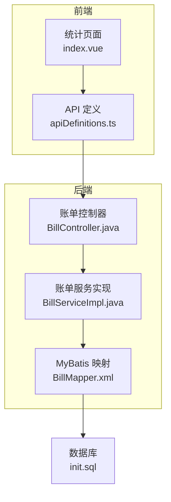
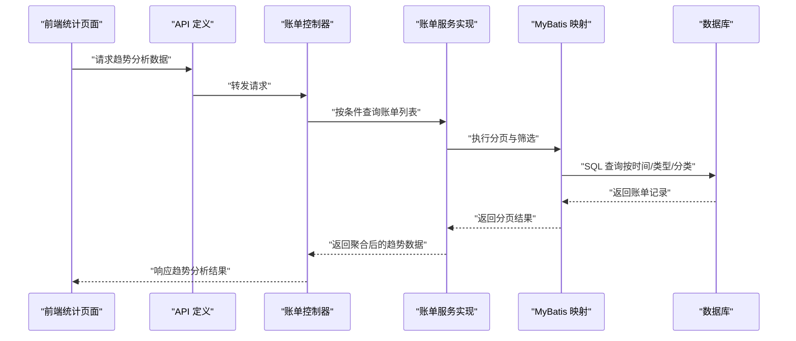
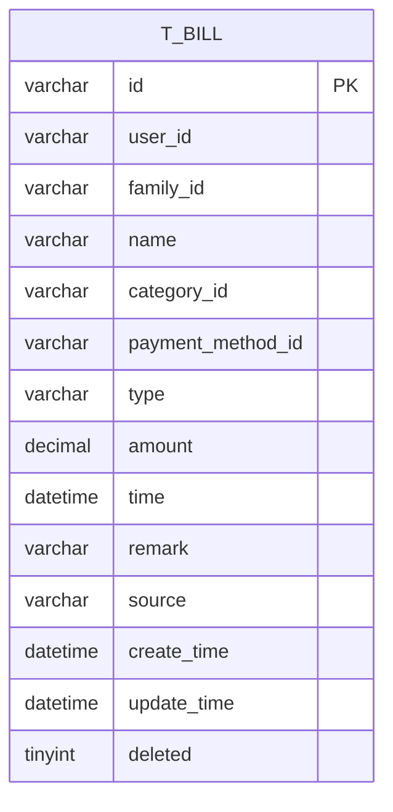
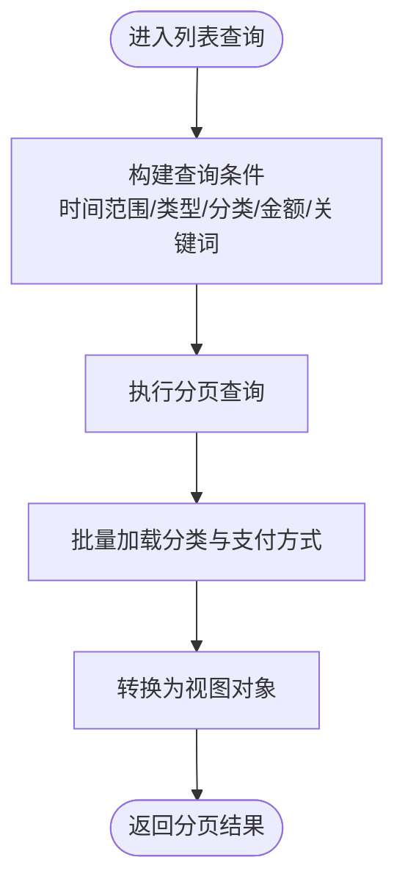

# 趋势分析

<cite>
**本文引用的文件**
- [PRD.md](file://PRD.md)
- [init.sql](file://chuan-bill-server/init.sql)
- [BillController.java](file://chuan-bill-server/src/main/java/com/samoy/chuanbillserver/controller/BillController.java)
- [BillServiceImpl.java](file://chuan-bill-server/src/main/java/com/samoy/chuanbillserver/service/impl/BillServiceImpl.java)
- [BillMapper.xml](file://chuan-bill-server/src/main/resources/mapper/BillMapper.xml)
- [apiDefinitions.ts](file://chuan-bill-app/src/api/apiDefinitions.ts)
- [index.vue](file://chuan-bill-app/src/pages/statistics/index.vue)
- [index.json](file://chuan-bill-app/dist/dev/mp-weixin/pages/statistics/index.json)
- [index.js](file://chuan-bill-app/dist/dev/mp-weixin/pages/statistics/index.js)
</cite>

## 目录
1. [简介](#简介)
2. [项目结构](#项目结构)
3. [核心组件](#核心组件)
4. [架构概览](#架构概览)
5. [详细组件分析](#详细组件分析)
6. [依赖分析](#依赖分析)
7. [性能考虑](#性能考虑)
8. [故障排查指南](#故障排查指南)
9. [结论](#结论)
10. [附录](#附录)

## 简介
本章节面向“趋势分析”功能，系统阐述其在财务规划中的定位与价值，并结合当前仓库中已实现的数据模型与接口能力，给出可落地的实现路径与扩展建议。趋势分析旨在通过对时间序列数据的聚合与计算，生成趋势线与同比/环比指标，辅助用户理解收支变化规律，支撑预算制定与消费优化。

## 项目结构
统计分析模块位于前端统计页面，后端提供账单列表与详情接口，数据库具备按时间字段分组与聚合的基础能力。当前统计页面为占位页，后续可在此基础上集成趋势图表与分析逻辑。

**图表来源**
- [index.vue:1-23](file://chuan-bill-app/src/pages/statistics/index.vue#L1-L23)
- [apiDefinitions.ts:1-38](file://chuan-bill-app/src/api/apiDefinitions.ts#L1-L38)
- [BillController.java:23-91](file://chuan-bill-server/src/main/java/com/samoy/chuanbillserver/controller/BillController.java#L23-L91)
- [BillServiceImpl.java:50-123](file://chuan-bill-server/src/main/java/com/samoy/chuanbillserver/service/impl/BillServiceImpl.java#L50-L123)
- [BillMapper.xml:1-6](file://chuan-bill-server/src/main/resources/mapper/BillMapper.xml#L1-L6)
- [init.sql:130-158](file://chuan-bill-server/init.sql#L130-L158)

**章节来源**
- [index.vue:1-23](file://chuan-bill-app/src/pages/statistics/index.vue#L1-L23)
- [index.json:1-4](file://chuan-bill-app/dist/dev/mp-weixin/pages/statistics/index.json#L1-L4)
- [index.js:1-4](file://chuan-bill-app/dist/dev/mp-weixin/pages/statistics/index.js#L1-L4)
- [apiDefinitions.ts:1-38](file://chuan-bill-app/src/api/apiDefinitions.ts#L1-L38)
- [BillController.java:23-91](file://chuan-bill-server/src/main/java/com/samoy/chuanbillserver/controller/BillController.java#L23-L91)
- [BillServiceImpl.java:50-123](file://chuan-bill-server/src/main/java/com/samoy/chuanbillserver/service/impl/BillServiceImpl.java#L50-L123)
- [BillMapper.xml:1-6](file://chuan-bill-server/src/main/resources/mapper/BillMapper.xml#L1-L6)
- [init.sql:130-158](file://chuan-bill-server/init.sql#L130-L158)

## 核心组件
- 前端统计页面：承载趋势图表与交互入口，当前为占位页，后续扩展趋势分析视图。
- 后端账单接口：提供账单列表与详情查询，支持按时间范围、类型、分类等筛选，满足趋势分析的数据需求。
- 数据库模型：账单表包含金额、类型、时间等关键字段，具备按时间索引，便于聚合与分组统计。

**章节来源**
- [index.vue:1-23](file://chuan-bill-app/src/pages/statistics/index.vue#L1-L23)
- [BillController.java:37-89](file://chuan-bill-server/src/main/java/com/samoy/chuanbillserver/controller/BillController.java#L37-L89)
- [init.sql:130-158](file://chuan-bill-server/init.sql#L130-L158)

## 架构概览
趋势分析的端到端流程如下：前端发起趋势分析请求（含时间范围、粒度、维度），后端根据筛选条件查询账单数据，返回聚合结果，前端渲染趋势图表。

**图表来源**
- [apiDefinitions.ts:1-38](file://chuan-bill-app/src/api/apiDefinitions.ts#L1-L38)
- [BillController.java:37-89](file://chuan-bill-server/src/main/java/com/samoy/chuanbillserver/controller/BillController.java#L37-L89)
- [BillServiceImpl.java:50-123](file://chuan-bill-server/src/main/java/com/samoy/chuanbillserver/service/impl/BillServiceImpl.java#L50-L123)
- [BillMapper.xml:1-6](file://chuan-bill-server/src/main/resources/mapper/BillMapper.xml#L1-L6)
- [init.sql:130-158](file://chuan-bill-server/init.sql#L130-L158)

## 详细组件分析

### 数据模型与时间序列基础
- 账单表包含金额、类型、时间等字段，且对时间字段建立索引，便于按时间范围与粒度进行聚合。
- 支持按用户或家庭维度查询，满足个人与家庭共享场景的趋势分析需求。

**图表来源**
- [init.sql:130-158](file://chuan-bill-server/init.sql#L130-L158)

**章节来源**
- [init.sql:130-158](file://chuan-bill-server/init.sql#L130-L158)

### 后端接口与筛选能力
- 列表接口支持按开始/结束时间、类型、分类、金额范围、名称/备注模糊查询，满足趋势分析的时间范围与维度筛选。
- 服务层对分类与支付方式进行了批量预加载，避免 N+1 查询，提升趋势聚合性能。

**图表来源**
- [BillController.java:37-89](file://chuan-bill-server/src/main/java/com/samoy/chuanbillserver/controller/BillController.java#L37-L89)
- [BillServiceImpl.java:50-123](file://chuan-bill-server/src/main/java/com/samoy/chuanbillserver/service/impl/BillServiceImpl.java#L50-L123)

**章节来源**
- [BillController.java:37-89](file://chuan-bill-server/src/main/java/com/samoy/chuanbillserver/controller/BillController.java#L37-L89)
- [BillServiceImpl.java:50-123](file://chuan-bill-server/src/main/java/com/samoy/chuanbillserver/service/impl/BillServiceImpl.java#L50-L123)

### 前端统计页面与图表集成
- 当前统计页面为占位页，后续可在该页面内集成趋势图表组件（如 ECharts），并调用后端趋势分析接口获取数据。
- 页面配置与运行由小程序框架负责，后续可在此基础上扩展趋势分析视图与交互。

**章节来源**
- [index.vue:1-23](file://chuan-bill-app/src/pages/statistics/index.vue#L1-L23)
- [index.json:1-4](file://chuan-bill-app/dist/dev/mp-weixin/pages/statistics/index.json#L1-L4)
- [index.js:1-4](file://chuan-bill-app/dist/dev/mp-weixin/pages/statistics/index.js#L1-L4)

### 趋势分析实现要点（基于现有能力的扩展建议）
- 时间序列数据处理
  - 粒度选择：日/周/月/年，依据时间字段进行分组聚合。
  - 范围选择：前端传入开始/结束日期，后端按时间范围筛选。
  - 维度选择：按类型（收入/支出）或分类聚合，支持多维组合。
- 趋势线计算
  - 移动平均：对时间序列进行滑动窗口平均，平滑短期波动。
  - 线性回归：拟合趋势线，输出斜率与方向，辅助判断长期走势。
- 同比/环比分析
  - 同比：与去年同期对应时间段对比，关注季节性变化。
  - 环比：与上一周期对比，关注短期变化。
- 数据格式转换
  - 将后端返回的分页账单记录转换为时间序列数组，统一为 [时间戳, 金额] 或 [日期字符串, 金额] 的格式。
  - 对缺失周期进行补零或插值，保证趋势图连续性。
- 图表类型选择
  - 折线图：展示趋势变化，适合时间序列。
  - 面积图：强调总量累积，适合累计趋势。
  - 柱状图：突出周期对比，适合同比/环比对比。

**章节来源**
- [PRD.md:77-95](file://PRD.md#L77-L95)
- [BillController.java:37-89](file://chuan-bill-server/src/main/java/com/samoy/chuanbillserver/controller/BillController.java#L37-L89)
- [BillServiceImpl.java:50-123](file://chuan-bill-server/src/main/java/com/samoy/chuanbillserver/service/impl/BillServiceImpl.java#L50-L123)

### 财务规划中的应用场景与价值
- 预算执行监控：通过趋势线判断实际支出偏离预算的速度，提前预警。
- 季节性消费预测：利用同比分析识别节假日、促销等周期性影响，优化预算分配。
- 消费行为洞察：通过环比变化发现突发性支出，辅助调整消费习惯。
- 家庭共享分析：在家庭维度下对比各成员趋势，促进协同理财。

**章节来源**
- [PRD.md:77-95](file://PRD.md#L77-L95)

### API 接口说明（基于现有接口的扩展建议）
- 获取账单列表（支持趋势分析筛选）
  - 方法与路径：GET /bill/list
  - 查询参数（建议新增）：
    - startDate：开始日期（YYYY-MM-DD）
    - endDate：结束日期（YYYY-MM-DD）
    - granularity：时间粒度（day/week/month/year）
    - dimension：分析维度（type/category）
    - familyId：家庭ID（可选，用于家庭趋势）
  - 返回：分页账单记录，前端据此生成时间序列与趋势指标。
- 获取账单详情（用于单条记录回溯）
  - 方法与路径：GET /bill/detail?id={id}
  - 返回：单条账单详情，便于趋势异常点标注与钻取。

**章节来源**
- [apiDefinitions.ts:33-35](file://chuan-bill-app/src/api/apiDefinitions.ts#L33-L35)
- [BillController.java:37-89](file://chuan-bill-server/src/main/java/com/samoy/chuanbillserver/controller/BillController.java#L37-L89)

### 前端图表组件实现细节（概念性指导）
- 组件职责
  - 接收筛选参数（时间范围、粒度、维度），调用趋势分析接口。
  - 解析后端返回的聚合数据，转换为图表所需格式。
  - 渲染折线图/面积图/柱状图，并支持同比/环比切换。
- ECharts 配置要点（概念性说明）
  - xAxis：时间轴（按粒度渲染）
  - series：趋势线（可叠加多条，如收入与支出）
  - 工具箱：数据区域缩放、动态类型切换
  - 提示框：数值与同比/环比信息
- 交互与联动
  - 支持点击趋势图钻取到账单列表
  - 支持拖拽缩放时间范围，动态刷新趋势

[本节为概念性指导，不直接分析具体源文件，故无“章节来源”]

## 依赖分析
- 前端依赖后端接口，后端依赖数据库模型与索引；当前统计页面为占位页，后续需在前端页面中集成趋势图表组件并与后端接口对接。
- 服务层已具备按时间范围与多维筛选的能力，为趋势分析提供了良好的数据基础。

**图表来源**
- [index.vue:1-23](file://chuan-bill-app/src/pages/statistics/index.vue#L1-L23)
- [apiDefinitions.ts:1-38](file://chuan-bill-app/src/api/apiDefinitions.ts#L1-L38)
- [BillController.java:23-91](file://chuan-bill-server/src/main/java/com/samoy/chuanbillserver/controller/BillController.java#L23-L91)
- [BillServiceImpl.java:50-123](file://chuan-bill-server/src/main/java/com/samoy/chuanbillserver/service/impl/BillServiceImpl.java#L50-L123)
- [init.sql:130-158](file://chuan-bill-server/init.sql#L130-L158)

**章节来源**
- [index.vue:1-23](file://chuan-bill-app/src/pages/statistics/index.vue#L1-L23)
- [apiDefinitions.ts:1-38](file://chuan-bill-app/src/api/apiDefinitions.ts#L1-L38)
- [BillController.java:23-91](file://chuan-bill-server/src/main/java/com/samoy/chuanbillserver/controller/BillController.java#L23-L91)
- [BillServiceImpl.java:50-123](file://chuan-bill-server/src/main/java/com/samoy/chuanbillserver/service/impl/BillServiceImpl.java#L50-L123)
- [init.sql:130-158](file://chuan-bill-server/init.sql#L130-L158)

## 性能考虑
- 查询优化：利用时间字段索引与复合索引（如 user_id+time、family_id+time）减少全表扫描。
- 分页与批量加载：服务层已采用分页与批量预加载，避免 N+1 查询，提升趋势聚合效率。
- 前端渲染：对大量时间点进行采样或降采样，避免一次性渲染过多数据导致卡顿。
- 缓存策略：对常用时间范围与维度的聚合结果进行缓存，降低重复计算成本。

[本节提供通用性能建议，不直接分析具体源文件，故无“章节来源”]

## 故障排查指南
- 接口返回空数据
  - 检查时间范围是否正确传入，确认后端按开始/结束日期进行边界处理。
  - 确认筛选维度（类型/分类）是否与数据匹配。
- 趋势图显示异常
  - 检查前端数据格式转换逻辑，确保时间轴与数值一一对应。
  - 确认缺失周期是否补零或插值。
- 性能问题
  - 检查数据库索引是否生效，必要时增加复合索引。
  - 评估分页大小与查询粒度，避免一次性返回过多数据。

[本节提供通用排查建议，不直接分析具体源文件，故无“章节来源”]

## 结论
当前项目已具备趋势分析所需的基础数据模型与接口能力。建议在统计页面中集成趋势图表组件，结合后端提供的账单列表筛选能力，实现按时间粒度与维度的聚合分析，并通过同比/环比指标增强趋势解读。后续可进一步完善算法与交互细节，持续优化性能与用户体验。

[本节为总结性内容，不直接分析具体源文件，故无“章节来源”]

## 附录
- 相关 PRD 要求：统计分析模块包含趋势分析能力，支持个人与家庭维度。
- 数据库建模：账单表包含时间、金额、类型等关键字段，满足趋势分析基础。

**章节来源**
- [PRD.md:77-95](file://PRD.md#L77-L95)
- [init.sql:130-158](file://chuan-bill-server/init.sql#L130-L158)