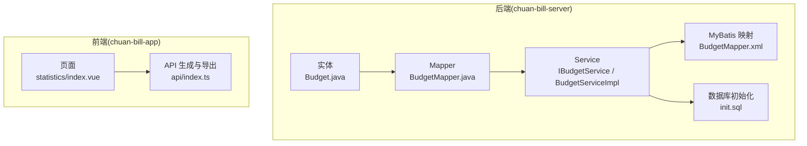
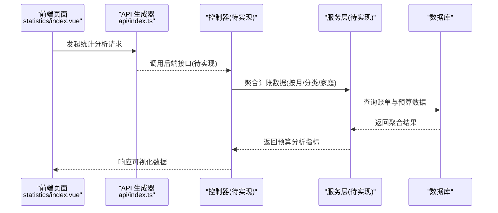
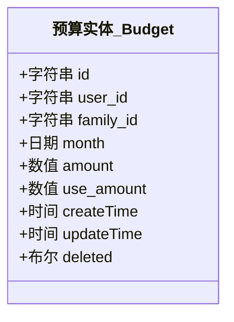
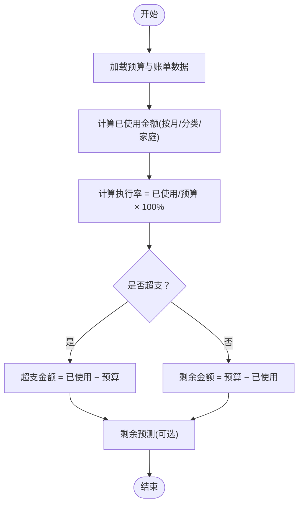

# 预算分析

<cite>
**本文引用的文件**
- [Budget.java](file://chuan-bill-server/src/main/java/com/samoy/chuanbillserver/entity/Budget.java)
- [BudgetMapper.java](file://chuan-bill-server/src/main/java/com/samoy/chuanbillserver/dao/BudgetMapper.java)
- [IBudgetService.java](file://chuan-bill-server/src/main/java/com/samoy/chuanbillserver/service/IBudgetService.java)
- [BudgetServiceImpl.java](file://chuan-bill-server/src/main/java/com/samoy/chuanbillserver/service/impl/BudgetServiceImpl.java)
- [BudgetMapper.xml](file://chuan-bill-server/src/main/resources/mapper/BudgetMapper.xml)
- [init.sql](file://chuan-bill-server/init.sql)
- [Bill.java](file://chuan-bill-server/src/main/java/com/samoy/chuanbillserver/entity/Bill.java)
- [BillController.java](file://chuan-bill-server/src/main/java/com/samoy/chuanbillserver/controller/BillController.java)
- [BillServiceImpl.java](file://chuan-bill-server/src/main/java/com/samoy/chuanbillserver/service/impl/BillServiceImpl.java)
- [IBillService.java](file://chuan-bill-server/src/main/java/com/samoy/chuanbillserver/service/IBillService.java)
- [PRD.md](file://PRD.md)
- [index.vue](file://chuan-bill-app/src/pages/statistics/index.vue)
- [index.ts](file://chuan-bill-app/src/api/index.ts)
</cite>

## 目录
1. [简介](#简介)
2. [项目结构](#项目结构)
3. [核心组件](#核心组件)
4. [架构概览](#架构概览)
5. [详细组件分析](#详细组件分析)
6. [依赖关系分析](#依赖关系分析)
7. [性能考虑](#性能考虑)
8. [故障排查指南](#故障排查指南)
9. [结论](#结论)
10. [附录](#附录)

## 简介
本文件围绕“预算分析”功能进行系统化技术文档编写，目标是帮助开发者与产品人员理解预算分析在后端数据模型、服务层、接口设计以及前端页面中的实现与集成方式。重点覆盖以下方面：
- 预算数据模型与数据库结构
- 预算执行率计算、超支分析、预算剩余预测的算法思路
- 预算数据聚合与统计指标
- 预算分析结果的可视化展示路径
- 相关API接口说明与前端组件实现要点
- 进度条组件的实现思路与参考路径

说明：当前仓库中预算分析的后端接口尚未实现，但数据模型与统计分析的PRD已明确。本文将基于现有实体与PRD，给出完整的实现蓝图与落地建议。

## 项目结构
预算分析涉及前后端协作：
- 后端：预算实体、预算Mapper/Service、MyBatis XML映射、数据库初始化脚本
- 前端：统计页面占位、API生成器与调用入口

图示来源
- [Budget.java:1-83](file://chuan-bill-server/src/main/java/com/samoy/chuanbillserver/entity/Budget.java#L1-L83)
- [BudgetMapper.java:1-14](file://chuan-bill-server/src/main/java/com/samoy/chuanbillserver/dao/BudgetMapper.java#L1-L14)
- [IBudgetService.java:1-14](file://chuan-bill-server/src/main/java/com/samoy/chuanbillserver/service/IBudgetService.java#L1-L14)
- [BudgetServiceImpl.java:1-18](file://chuan-bill-server/src/main/java/com/samoy/chuanbillserver/service/impl/BudgetServiceImpl.java#L1-L18)
- [BudgetMapper.xml:1-5](file://chuan-bill-server/src/main/resources/mapper/BudgetMapper.xml#L1-L5)
- [init.sql:160-178](file://chuan-bill-server/init.sql#L160-L178)
- [index.vue:1-23](file://chuan-bill-app/src/pages/statistics/index.vue#L1-L23)
- [index.ts:1-19](file://chuan-bill-app/src/api/index.ts#L1-L19)

章节来源
- [Budget.java:1-83](file://chuan-bill-server/src/main/java/com/samoy/chuanbillserver/entity/Budget.java#L1-L83)
- [init.sql:160-178](file://chuan-bill-server/init.sql#L160-L178)
- [index.vue:1-23](file://chuan-bill-app/src/pages/statistics/index.vue#L1-L23)
- [index.ts:1-19](file://chuan-bill-app/src/api/index.ts#L1-L19)

## 核心组件
- 预算实体 Budget：定义预算ID、用户ID/家庭ID、预算月份、预算金额、已使用金额、时间戳与删除标记等字段
- 预算Mapper/Service：提供预算数据的持久化与业务处理能力
- MyBatis XML：承载预算相关SQL（当前为空，后续扩展）
- 数据库初始化：创建预算表及索引
- 统计页面与API：前端统计页面占位与API生成入口

章节来源
- [Budget.java:26-83](file://chuan-bill-server/src/main/java/com/samoy/chuanbillserver/entity/Budget.java#L26-L83)
- [BudgetMapper.java:1-14](file://chuan-bill-server/src/main/java/com/samoy/chuanbillserver/dao/BudgetMapper.java#L1-L14)
- [IBudgetService.java:1-14](file://chuan-bill-server/src/main/java/com/samoy/chuanbillserver/service/IBudgetService.java#L1-L14)
- [BudgetServiceImpl.java:1-18](file://chuan-bill-server/src/main/java/com/samoy/chuanbillserver/service/impl/BudgetServiceImpl.java#L1-L18)
- [BudgetMapper.xml:1-5](file://chuan-bill-server/src/main/resources/mapper/BudgetMapper.xml#L1-L5)
- [init.sql:160-178](file://chuan-bill-server/init.sql#L160-L178)
- [index.vue:1-23](file://chuan-bill-app/src/pages/statistics/index.vue#L1-L23)
- [index.ts:1-19](file://chuan-bill-app/src/api/index.ts#L1-L19)

## 架构概览
预算分析的整体流程：
- 前端请求统计分析数据（当前页面占位，后续接入预算分析API）
- 后端根据用户/家庭维度与时间范围聚合账单数据
- 计算预算执行率、剩余预算、超支金额等指标
- 返回可视化所需的数据结构（如执行率、剩余、超支、分类占比等）

图示来源
- [index.vue:1-23](file://chuan-bill-app/src/pages/statistics/index.vue#L1-L23)
- [index.ts:1-19](file://chuan-bill-app/src/api/index.ts#L1-L19)

## 详细组件分析

### 预算实体与数据模型
- 字段说明
  - 预算ID、用户ID、家庭ID、预算月份、预算金额、已使用金额、创建/更新时间、删除标记
- 关键约束
  - 用户与月份唯一、家庭与月份唯一，保证同一周期内预算唯一
- 数据类型与精度
  - 金额采用高精度十进制，确保财务计算准确性

图示来源
- [Budget.java:26-83](file://chuan-bill-server/src/main/java/com/samoy/chuanbillserver/entity/Budget.java#L26-L83)

章节来源
- [Budget.java:26-83](file://chuan-bill-server/src/main/java/com/samoy/chuanbillserver/entity/Budget.java#L26-L83)
- [init.sql:160-178](file://chuan-bill-server/init.sql#L160-L178)

### 预算执行率计算与超支分析
- 预算执行率
  - 公式：执行率 = 已使用金额 / 预算金额 × 100%
  - 用于直观展示预算使用进度
- 超支分析
  - 当已使用金额 > 预算金额时，判定为超支
  - 超支金额 = 已使用金额 − 预算金额
- 预算剩余预测
  - 基于当前日期与预算周期，估算剩余天数内的平均支出，推导剩余可用预算
  - 可选：剩余可用预算 ≈ 预算金额 − 已使用金额 + 日均支出 × 剩余天数

图示来源
- [Budget.java:56-64](file://chuan-bill-server/src/main/java/com/samoy/chuanbillserver/entity/Budget.java#L56-L64)
- [Bill.java:74-81](file://chuan-bill-server/src/main/java/com/samoy/chuanbillserver/entity/Bill.java#L74-L81)

章节来源
- [Budget.java:56-64](file://chuan-bill-server/src/main/java/com/samoy/chuanbillserver/entity/Budget.java#L56-L64)
- [Bill.java:74-81](file://chuan-bill-server/src/main/java/com/samoy/chuanbillserver/entity/Bill.java#L74-L81)

### 预算数据聚合与统计指标
- 聚合维度
  - 时间：按自然月聚合（以预算月份为粒度）
  - 对象：个人预算 vs 家庭预算（通过家庭ID区分）
  - 类目：可扩展按支出类目聚合，辅助分析超支来源
- 统计指标
  - 总预算、总已使用、总剩余、执行率、超支金额
  - 可视化指标：执行率百分比、剩余金额、超支状态标识、分类占比饼图/柱状图

章节来源
- [PRD.md:64-95](file://PRD.md#L64-L95)

### 预算分析结果的可视化展示
- 页面占位
  - 统计页面目前为空白占位，后续接入预算分析数据
- 可视化建议
  - 执行进度：进度条组件展示执行率
  - 超支提示：颜色警示与数值提示
  - 剩余预测：剩余金额与预计可用天数
  - 分类对比：按类目展示支出占比与预算对比

章节来源
- [index.vue:1-23](file://chuan-bill-app/src/pages/statistics/index.vue#L1-L23)
- [PRD.md:77-95](file://PRD.md#L77-L95)

### API 接口说明（待实现）
- 设计原则
  - 以“统计分析”为主题，提供预算执行率、超支、剩余、分类占比等指标
  - 支持时间范围、家庭维度、类目过滤等参数
- 请求参数（示意）
  - 时间范围：startDate、endDate
  - 维度：userId、familyId
  - 类目：categoryId（可选）
- 响应结构（示意）
  - 预算汇总：预算金额、已使用、剩余、执行率、超支金额
  - 分类明细：各分类的预算、使用、剩余、执行率
  - 预测指标：剩余可用预算、预计可用天数（可选）

章节来源
- [PRD.md:77-95](file://PRD.md#L77-L95)

### 前端组件实现细节（进度条组件思路）
- 组件职责
  - 接收执行率数值，渲染进度条与百分比标签
  - 超支状态高亮（颜色与文案提示）
- 实现路径
  - 在统计页面引入进度条组件
  - 通过API返回的执行率动态更新进度条
  - 超支时切换样式与提示文案

章节来源
- [index.vue:1-23](file://chuan-bill-app/src/pages/statistics/index.vue#L1-L23)
- [index.ts:1-19](file://chuan-bill-app/src/api/index.ts#L1-L19)

## 依赖关系分析
- 后端依赖链
  - 实体 → Mapper → Service → 控制器（待实现）
  - MyBatis XML 作为SQL映射层
  - 数据库初始化脚本提供表结构与索引
- 前端依赖链
  - 统计页面 → API 生成器 → 后端接口（待实现）

图示来源
- [index.vue:1-23](file://chuan-bill-app/src/pages/statistics/index.vue#L1-L23)
- [index.ts:1-19](file://chuan-bill-app/src/api/index.ts#L1-L19)
- [BudgetMapper.xml:1-5](file://chuan-bill-server/src/main/resources/mapper/BudgetMapper.xml#L1-L5)

章节来源
- [BudgetMapper.xml:1-5](file://chuan-bill-server/src/main/resources/mapper/BudgetMapper.xml#L1-L5)
- [index.vue:1-23](file://chuan-bill-app/src/pages/statistics/index.vue#L1-L23)
- [index.ts:1-19](file://chuan-bill-app/src/api/index.ts#L1-L19)

## 性能考虑
- 数据库层面
  - 预算表按用户/家庭+月份建立唯一索引，避免重复预算
  - 账单表按用户/家庭+时间建立索引，提升聚合查询效率
- 服务层层面
  - 聚合查询尽量一次性完成，减少多次往返
  - 使用批量查询与缓存映射（如分类、支付方式）降低N+1查询
- 前端层面
  - 进度条组件仅做轻量渲染，避免频繁重排
  - 可对超支状态进行节流提示，避免频繁闪烁

章节来源
- [init.sql:160-178](file://chuan-bill-server/init.sql#L160-L178)
- [BillServiceImpl.java:90-122](file://chuan-bill-server/src/main/java/com/samoy/chuanbillserver/service/impl/BillServiceImpl.java#L90-L122)

## 故障排查指南
- 预算未生效
  - 检查预算表是否存在对应月份的预算记录
  - 核对用户ID/家庭ID是否正确
- 执行率异常
  - 核对已使用金额是否包含共享账单
  - 检查时间范围是否正确
- 超支判断不准确
  - 确认预算金额与已使用金额均为正数
  - 检查是否存在未计入的账单或退款
- 前端进度条不显示
  - 确认API已返回执行率数据
  - 检查组件是否正确接收并渲染数值

章节来源
- [Budget.java:56-64](file://chuan-bill-server/src/main/java/com/samoy/chuanbillserver/entity/Budget.java#L56-L64)
- [Bill.java:74-81](file://chuan-bill-server/src/main/java/com/samoy/chuanbillserver/entity/Bill.java#L74-L81)
- [index.vue:1-23](file://chuan-bill-app/src/pages/statistics/index.vue#L1-L23)

## 结论
- 预算分析功能在后端具备完善的实体与表结构基础，可在现有基础上快速扩展统计分析接口
- 前端统计页面目前为空白占位，后续接入预算分析API即可实现执行率、超支、剩余预测与分类对比等可视化
- 建议优先实现“预算执行率”与“超支分析”，再逐步扩展“剩余预测”与“分类占比”

## 附录
- 相关PRD章节
  - 预算管理模块：预算设置、预算提醒
  - 统计分析模块：数据分析维度、AI智能建议、分析范围选择

章节来源
- [PRD.md:64-112](file://PRD.md#L64-L112)