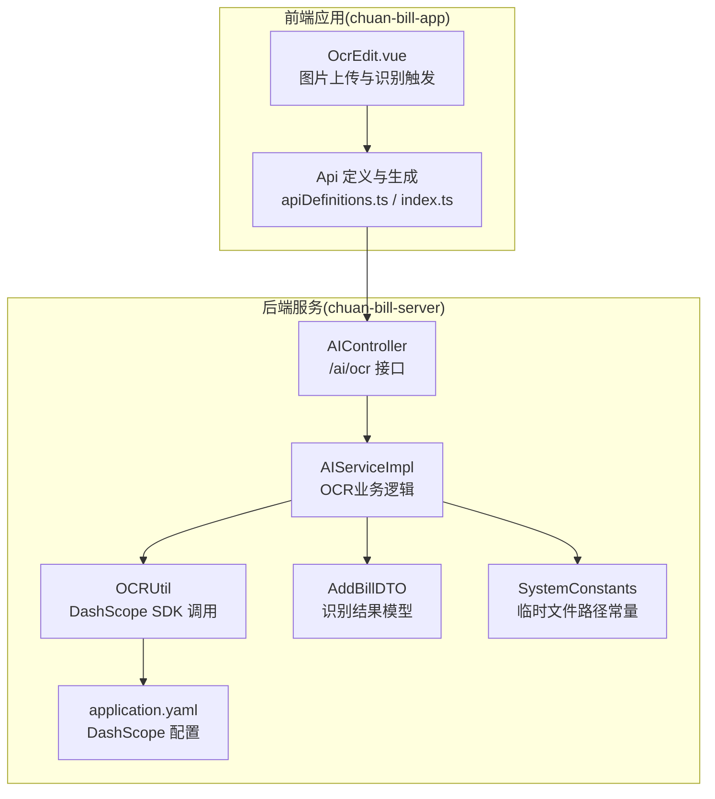
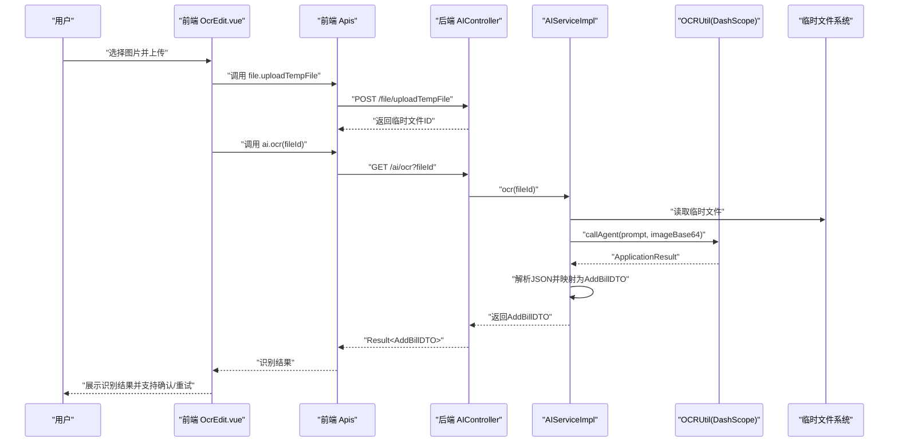
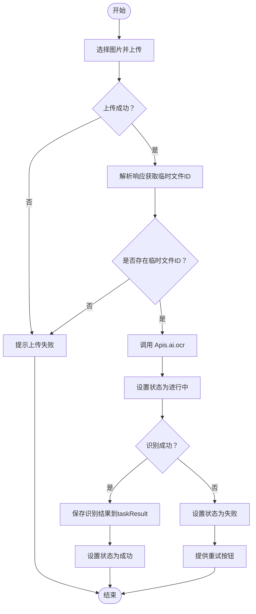
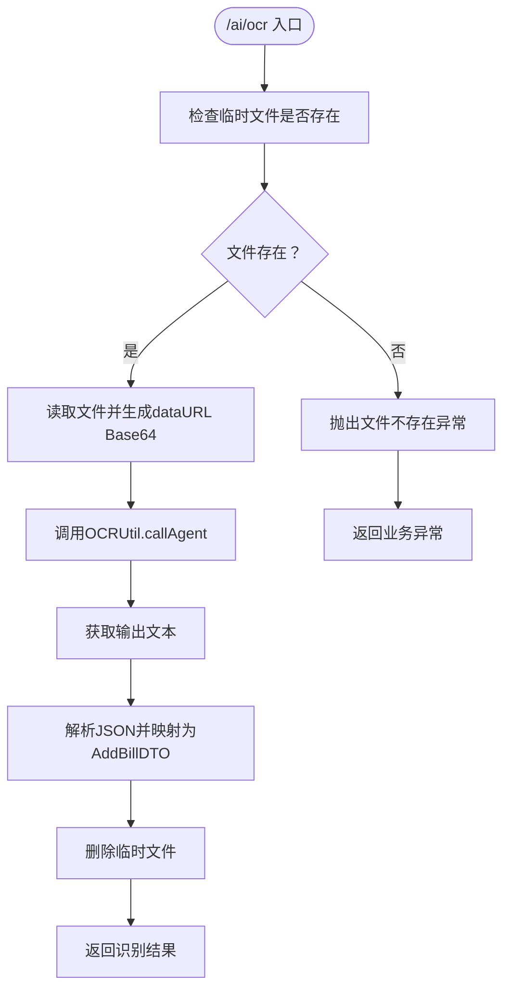
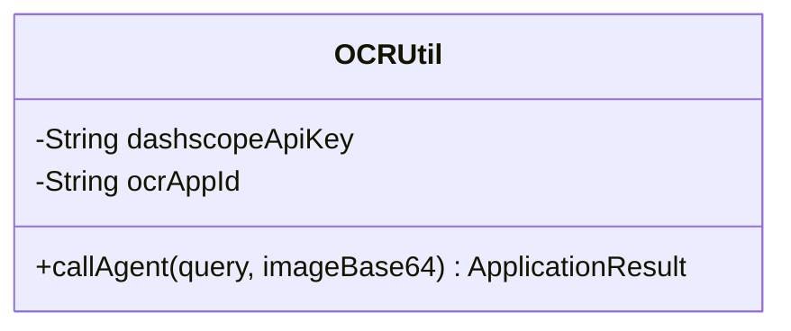
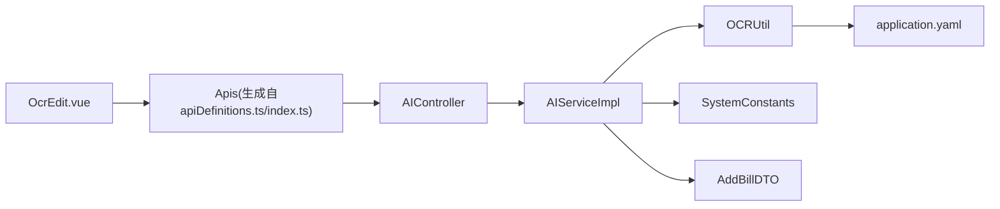

# OCR识别

<cite>
**本文引用的文件**
- [OcrEdit.vue](file://chuan-bill-app/src/pages/bill/components/OcrEdit.vue)
- [apiDefinitions.ts](file://chuan-bill-app/src/api/apiDefinitions.ts)
- [index.ts](file://chuan-bill-app/src/api/index.ts)
- [AIController.java](file://chuan-bill-server/src/main/java/com/samoy/chuanbillserver/controller/AIController.java)
- [AIServiceImpl.java](file://chuan-bill-server/src/main/java/com/samoy/chuanbillserver/service/impl/AIServiceImpl.java)
- [OCRUtil.java](file://chuan-bill-server/src/main/java/com/samoy/chuanbillserver/utils/OCRUtil.java)
- [AddBillDTO.java](file://chuan-bill-server/src/main/java/com/samoy/chuanbillserver/dto/AddBillDTO.java)
- [SystemConstants.java](file://chuan-bill-server/src/main/java/com/samoy/chuanbillserver/constant/SystemConstants.java)
- [application.yaml](file://chuan-bill-server/src/main/resources/application.yaml)
</cite>

## 目录
1. [简介](#简介)
2. [项目结构](#项目结构)
3. [核心组件](#核心组件)
4. [架构总览](#架构总览)
5. [详细组件分析](#详细组件分析)
6. [依赖关系分析](#依赖关系分析)
7. [性能考虑](#性能考虑)
8. [故障排查指南](#故障排查指南)
9. [结论](#结论)
10. [附录](#附录)

## 简介
本章节概述OCR识别功能的整体目标与范围，包括图片上传、图像预处理、文字识别、结果解析与后续账单录入流程。该功能通过前端上传图片并调用后端AI接口，由后端基于百炼DashScope SDK调用OCR Agent完成识别，并将结构化账单信息返回给前端，供用户确认或继续编辑。

## 项目结构
OCR识别功能涉及前后端协作：
- 前端负责图片上传与交互提示，调用后端AI接口触发识别任务。
- 后端接收临时文件ID，读取临时文件并转为Base64，调用DashScope OCR Agent，解析输出并返回结构化账单数据。

图表来源
- [OcrEdit.vue:1-167](file://chuan-bill-app/src/pages/bill/components/OcrEdit.vue#L1-L167)
- [apiDefinitions.ts:19-37](file://chuan-bill-app/src/api/apiDefinitions.ts#L19-L37)
- [index.ts:1-19](file://chuan-bill-app/src/api/index.ts#L1-L19)
- [AIController.java:1-26](file://chuan-bill-server/src/main/java/com/samoy/chuanbillserver/controller/AIController.java#L1-L26)
- [AIServiceImpl.java:1-52](file://chuan-bill-server/src/main/java/com/samoy/chuanbillserver/service/impl/AIServiceImpl.java#L1-L52)
- [OCRUtil.java:1-37](file://chuan-bill-server/src/main/java/com/samoy/chuanbillserver/utils/OCRUtil.java#L1-L37)
- [AddBillDTO.java:1-44](file://chuan-bill-server/src/main/java/com/samoy/chuanbillserver/dto/AddBillDTO.java#L1-L44)
- [SystemConstants.java:30-34](file://chuan-bill-server/src/main/java/com/samoy/chuanbillserver/constant/SystemConstants.java#L30-L34)
- [application.yaml:41-51](file://chuan-bill-server/src/main/resources/application.yaml#L41-L51)

章节来源
- [OcrEdit.vue:1-167](file://chuan-bill-app/src/pages/bill/components/OcrEdit.vue#L1-L167)
- [apiDefinitions.ts:19-37](file://chuan-bill-app/src/api/apiDefinitions.ts#L19-L37)
- [index.ts:1-19](file://chuan-bill-app/src/api/index.ts#L1-L19)
- [AIController.java:1-26](file://chuan-bill-server/src/main/java/com/samoy/chuanbillserver/controller/AIController.java#L1-L26)
- [AIServiceImpl.java:1-52](file://chuan-bill-server/src/main/java/com/samoy/chuanbillserver/service/impl/AIServiceImpl.java#L1-L52)
- [OCRUtil.java:1-37](file://chuan-bill-server/src/main/java/com/samoy/chuanbillserver/utils/OCRUtil.java#L1-L37)
- [AddBillDTO.java:1-44](file://chuan-bill-server/src/main/java/com/samoy/chuanbillserver/dto/AddBillDTO.java#L1-L44)
- [SystemConstants.java:30-34](file://chuan-bill-server/src/main/java/com/samoy/chuanbillserver/constant/SystemConstants.java#L30-L34)
- [application.yaml:41-51](file://chuan-bill-server/src/main/resources/application.yaml#L41-L51)

## 核心组件
- 前端组件：OcrEdit.vue 负责图片上传、识别状态管理、结果展示与失败重试。
- API定义与生成：apiDefinitions.ts 定义后端接口；index.ts 生成 Apis 对象用于调用。
- 后端控制器：AIController 提供 /ai/ocr 接口，接收临时文件ID并返回识别结果。
- 业务服务：AIServiceImpl 实现OCR流程，包含文件读取、Base64封装、调用OCR、解析JSON、清理临时文件。
- OCR工具：OCRUtil 封装DashScope SDK调用，读取配置并发起Agent请求。
- 数据模型：AddBillDTO 描述识别后的账单结构化字段。
- 配置与常量：application.yaml 提供DashScope密钥与AppId；SystemConstants 提供临时文件目录。

章节来源
- [OcrEdit.vue:1-167](file://chuan-bill-app/src/pages/bill/components/OcrEdit.vue#L1-L167)
- [apiDefinitions.ts:19-37](file://chuan-bill-app/src/api/apiDefinitions.ts#L19-L37)
- [index.ts:1-19](file://chuan-bill-app/src/api/index.ts#L1-L19)
- [AIController.java:1-26](file://chuan-bill-server/src/main/java/com/samoy/chuanbillserver/controller/AIController.java#L1-L26)
- [AIServiceImpl.java:27-50](file://chuan-bill-server/src/main/java/com/samoy/chuanbillserver/service/impl/AIServiceImpl.java#L27-L50)
- [OCRUtil.java:22-35](file://chuan-bill-server/src/main/java/com/samoy/chuanbillserver/utils/OCRUtil.java#L22-L35)
- [AddBillDTO.java:10-44](file://chuan-bill-server/src/main/java/com/samoy/chuanbillserver/dto/AddBillDTO.java#L10-L44)
- [SystemConstants.java:30-34](file://chuan-bill-server/src/main/java/com/samoy/chuanbillserver/constant/SystemConstants.java#L30-L34)
- [application.yaml:41-51](file://chuan-bill-server/src/main/resources/application.yaml#L41-L51)

## 架构总览
OCR识别采用“前端上传 -> 后端识别 -> 结果返回”的分层架构。前端通过wd-upload组件上传图片到临时文件接口，获得临时文件ID后调用AI接口触发OCR；后端读取临时文件，封装为Base64并调用DashScope Agent，解析返回的JSON结构化结果，最终以AddBillDTO形式返回。

图表来源
- [OcrEdit.vue:27-69](file://chuan-bill-app/src/pages/bill/components/OcrEdit.vue#L27-L69)
- [apiDefinitions.ts:23-36](file://chuan-bill-app/src/api/apiDefinitions.ts#L23-L36)
- [AIController.java:20-24](file://chuan-bill-server/src/main/java/com/samoy/chuanbillserver/controller/AIController.java#L20-L24)
- [AIServiceImpl.java:27-50](file://chuan-bill-server/src/main/java/com/samoy/chuanbillserver/service/impl/AIServiceImpl.java#L27-L50)
- [OCRUtil.java:22-35](file://chuan-bill-server/src/main/java/com/samoy/chuanbillserver/utils/OCRUtil.java#L22-L35)
- [SystemConstants.java:30-34](file://chuan-bill-server/src/main/java/com/samoy/chuanbillserver/constant/SystemConstants.java#L30-L34)

## 详细组件分析

### 前端组件：OcrEdit.vue
- 功能职责
  - 图片上传：使用wd-upload组件，限制为图片类型、单文件上传，支持重新上传。
  - 识别触发：上传成功后读取临时文件ID，调用 Apis.ai.ocr 触发识别任务。
  - 状态管理：维护任务状态（初始化/进行中/成功/失败），根据状态渲染UI与提示。
  - 错误处理：识别失败时提供重试按钮与手动输入入口。
- 关键流程
  - 上传成功回调解析响应，提取临时文件信息，若存在则进入识别流程。
  - 识别过程中显示扫描动画与加载提示；成功后将结果保存至taskResult，失败则展示失败面板。
- 交互细节
  - 上传区域在识别进行中时改变边框样式与遮罩层，增强视觉反馈。
  - 使用全局Toast进行上传失败提示。

图表来源
- [OcrEdit.vue:27-69](file://chuan-bill-app/src/pages/bill/components/OcrEdit.vue#L27-L69)

章节来源
- [OcrEdit.vue:1-167](file://chuan-bill-app/src/pages/bill/components/OcrEdit.vue#L1-L167)

### 后端接口：AIController 与 AIServiceImpl
- 接口定义
  - GET /ai/ocr：接收临时文件ID，返回识别结果AddBillDTO。
- 业务流程
  - 参数校验：检查临时文件是否存在。
  - 文件读取与编码：读取临时文件内容并封装为dataURL格式的Base64字符串。
  - OCR调用：通过OCRUtil调用DashScope Agent，传入提示词与图片Base64。
  - 结果解析：从ApplicationResult中提取文本，解析为JSON并映射为AddBillDTO。
  - 清理资源：识别成功后删除临时文件。
  - 异常处理：对缺失密钥或输入异常进行捕获并抛出业务异常。

图表来源
- [AIController.java:20-24](file://chuan-bill-server/src/main/java/com/samoy/chuanbillserver/controller/AIController.java#L20-L24)
- [AIServiceImpl.java:27-50](file://chuan-bill-server/src/main/java/com/samoy/chuanbillserver/service/impl/AIServiceImpl.java#L27-L50)
- [OCRUtil.java:22-35](file://chuan-bill-server/src/main/java/com/samoy/chuanbillserver/utils/OCRUtil.java#L22-L35)
- [SystemConstants.java:30-34](file://chuan-bill-server/src/main/java/com/samoy/chuanbillserver/constant/SystemConstants.java#L30-L34)

章节来源
- [AIController.java:1-26](file://chuan-bill-server/src/main/java/com/samoy/chuanbillserver/controller/AIController.java#L1-L26)
- [AIServiceImpl.java:27-50](file://chuan-bill-server/src/main/java/com/samoy/chuanbillserver/service/impl/AIServiceImpl.java#L27-L50)

### OCR工具：OCRUtil 与 DashScope SDK
- 集成要点
  - 从配置文件读取DashScope API密钥与OCR AppId。
  - 构造ApplicationParam，设置提示词、图片Base64、开启推理过程记录。
  - 调用Application.call并返回结果。
- 配置参数
  - dashscope.apiKey：API密钥。
  - dashscope.ocr.appId：OCR应用ID。

图表来源
- [OCRUtil.java:15-35](file://chuan-bill-server/src/main/java/com/samoy/chuanbillserver/utils/OCRUtil.java#L15-L35)
- [application.yaml:48-51](file://chuan-bill-server/src/main/resources/application.yaml#L48-L51)

章节来源
- [OCRUtil.java:1-37](file://chuan-bill-server/src/main/java/com/samoy/chuanbillserver/utils/OCRUtil.java#L1-L37)
- [application.yaml:41-51](file://chuan-bill-server/src/main/resources/application.yaml#L41-L51)

### 数据模型：AddBillDTO
- 字段说明
  - name：账单名称（必填，1-50字符）
  - categoryId：分类ID（必填）
  - paymentMethodId：支付方式ID（可选）
  - type：账单类型（必填，"income"或"expense"）
  - amount：金额（必填，正数，最多10位整数+2位小数）
  - time：时间（必填，yyyy-MM-dd HH:mm）
  - remark：备注（可选，最多500字符）
  - familyId：家庭ID（可选）
  - source：来源（必填，"manual"|"ocr"|"voice"）
- 用途：作为OCR识别结果的标准化载体，便于前端展示与后续账单创建。

章节来源
- [AddBillDTO.java:10-44](file://chuan-bill-server/src/main/java/com/samoy/chuanbillserver/dto/AddBillDTO.java#L10-L44)

### API接口说明
- 临时文件上传
  - 方法与路径：POST /file/uploadTempFile
  - 请求体参数：file（二进制文件）
  - 响应：包含临时文件ID与文件大小
- OCR识别
  - 方法与路径：GET /ai/ocr
  - 查询参数：fileId（临时文件ID）
  - 响应：识别结果AddBillDTO

章节来源
- [apiDefinitions.ts:23-36](file://chuan-bill-app/src/api/apiDefinitions.ts#L23-L36)
- [AIController.java:20-24](file://chuan-bill-server/src/main/java/com/samoy/chuanbillserver/controller/AIController.java#L20-L24)

## 依赖关系分析
- 前端依赖
  - Apis对象由apiDefinitions.ts与index.ts共同生成，统一管理接口路径与方法。
  - OcrEdit.vue依赖wd-upload组件与全局Toast，负责上传与提示。
- 后端依赖
  - AIController依赖IAIService接口实现。
  - AIServiceImpl依赖OCRUtil、SystemConstants与AddBillDTO。
  - OCRUtil依赖DashScope SDK与application.yaml中的配置。

图表来源
- [OcrEdit.vue:1-167](file://chuan-bill-app/src/pages/bill/components/OcrEdit.vue#L1-L167)
- [apiDefinitions.ts:19-37](file://chuan-bill-app/src/api/apiDefinitions.ts#L19-L37)
- [index.ts:1-19](file://chuan-bill-app/src/api/index.ts#L1-L19)
- [AIController.java:1-26](file://chuan-bill-server/src/main/java/com/samoy/chuanbillserver/controller/AIController.java#L1-L26)
- [AIServiceImpl.java:1-52](file://chuan-bill-server/src/main/java/com/samoy/chuanbillserver/service/impl/AIServiceImpl.java#L1-L52)
- [OCRUtil.java:1-37](file://chuan-bill-server/src/main/java/com/samoy/chuanbillserver/utils/OCRUtil.java#L1-L37)
- [SystemConstants.java:30-34](file://chuan-bill-server/src/main/java/com/samoy/chuanbillserver/constant/SystemConstants.java#L30-L34)
- [application.yaml:41-51](file://chuan-bill-server/src/main/resources/application.yaml#L41-L51)

章节来源
- [OcrEdit.vue:1-167](file://chuan-bill-app/src/pages/bill/components/OcrEdit.vue#L1-L167)
- [apiDefinitions.ts:19-37](file://chuan-bill-app/src/api/apiDefinitions.ts#L19-L37)
- [index.ts:1-19](file://chuan-bill-app/src/api/index.ts#L1-L19)
- [AIController.java:1-26](file://chuan-bill-server/src/main/java/com/samoy/chuanbillserver/controller/AIController.java#L1-L26)
- [AIServiceImpl.java:1-52](file://chuan-bill-server/src/main/java/com/samoy/chuanbillserver/service/impl/AIServiceImpl.java#L1-L52)
- [OCRUtil.java:1-37](file://chuan-bill-server/src/main/java/com/samoy/chuanbillserver/utils/OCRUtil.java#L1-L37)
- [SystemConstants.java:30-34](file://chuan-bill-server/src/main/java/com/samoy/chuanbillserver/constant/SystemConstants.java#L30-L34)
- [application.yaml:41-51](file://chuan-bill-server/src/main/resources/application.yaml#L41-L51)

## 性能考虑
- 图片压缩与尺寸控制
  - 在上传前对图片进行压缩与尺寸限制，减少Base64体积，降低网络传输与OCR处理时间。
- 并发与队列
  - 控制同时进行的OCR任务数量，避免DashScope配额或服务端压力过大。
- 缓存与复用
  - 对于重复图片或相似场景，可在前端或网关层引入缓存，命中则直接返回上次结果。
- 临时文件清理
  - 识别成功后及时删除临时文件，避免磁盘占用增长。
- 超时与重试
  - 设置合理的请求超时与指数退避重试策略，提升失败恢复能力。
- 日志与监控
  - 记录OCR耗时、成功率与错误类型，便于定位瓶颈与异常。

## 故障排查指南
- 常见问题与定位
  - 上传失败：检查上传接口返回与前端Toast提示；确认临时文件目录权限与磁盘空间。
  - 识别失败：查看后端日志中DashScope调用是否抛出密钥或输入异常；核对配置文件中的API密钥与AppId。
  - 结果为空或字段缺失：检查OCR提示词与图片质量；确认返回JSON结构与AddBillDTO映射路径一致。
- 快速修复建议
  - 重新上传图片并重试识别。
  - 校验环境变量与配置文件，确保DashScope密钥与AppId正确。
  - 若为网络波动导致的超时，适当延长超时时间并启用重试。

章节来源
- [AIServiceImpl.java:47-49](file://chuan-bill-server/src/main/java/com/samoy/chuanbillserver/service/impl/AIServiceImpl.java#L47-L49)
- [OCRUtil.java:22-35](file://chuan-bill-server/src/main/java/com/samoy/chuanbillserver/utils/OCRUtil.java#L22-L35)
- [application.yaml:48-51](file://chuan-bill-server/src/main/resources/application.yaml#L48-L51)

## 结论
本OCR识别方案通过前后端协同，实现了从图片上传到结构化账单识别的完整闭环。前端提供直观的上传与状态反馈，后端基于DashScope SDK完成智能识别并将结果标准化为AddBillDTO，便于后续账单录入与编辑。通过合理的配置与性能优化策略，可进一步提升识别准确率与用户体验。

## 附录
- 配置项清单
  - dashscope.apiKey：DashScope API密钥
  - dashscope.ocr.appId：OCR应用ID
  - 临时文件目录：temp/upload/（SystemConstants中定义）

章节来源
- [application.yaml:48-51](file://chuan-bill-server/src/main/resources/application.yaml#L48-L51)
- [SystemConstants.java:30-34](file://chuan-bill-server/src/main/java/com/samoy/chuanbillserver/constant/SystemConstants.java#L30-L34)