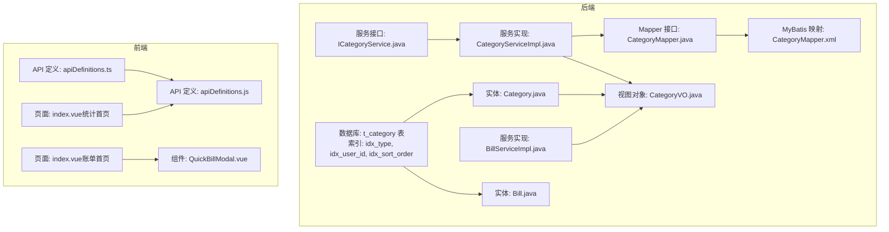
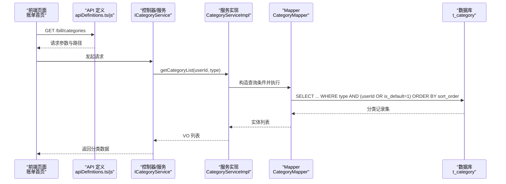
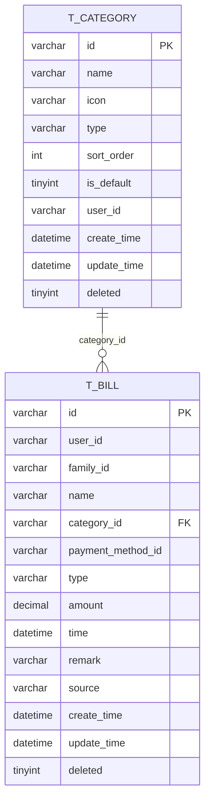
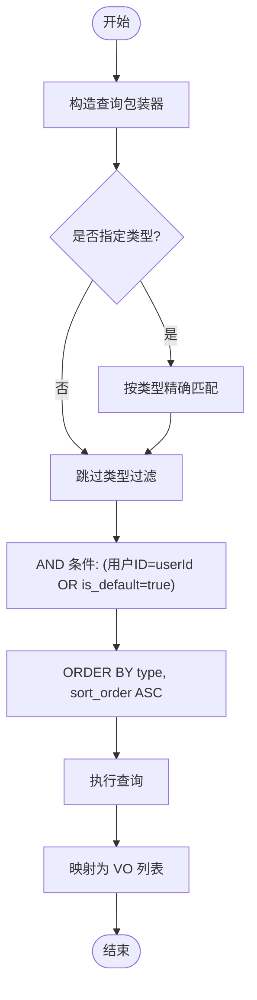
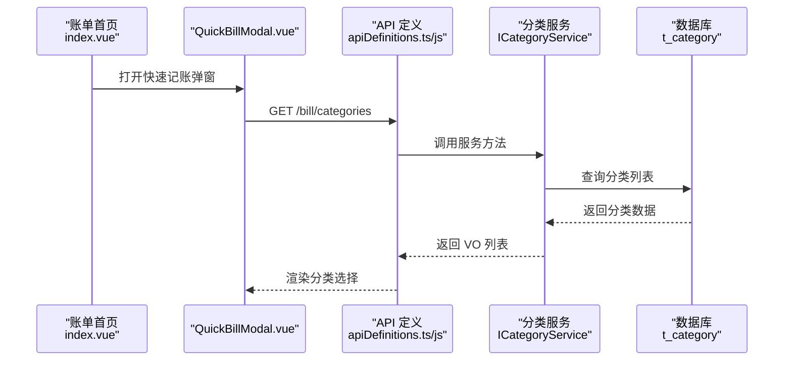
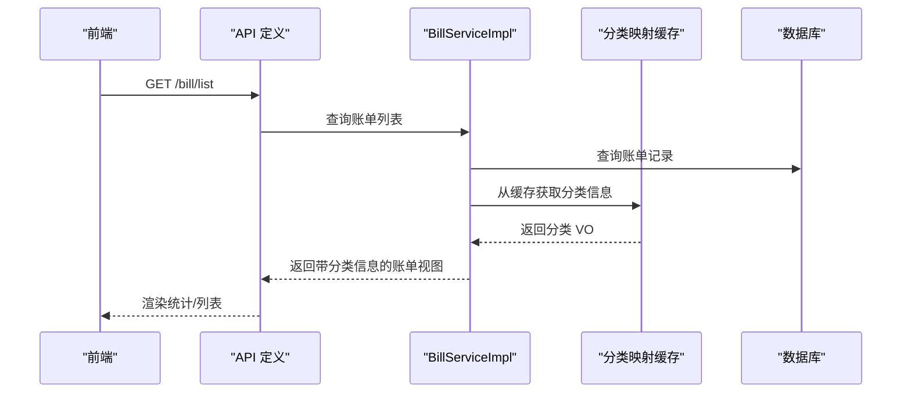
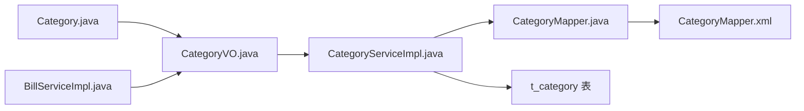

# 分类管理

<cite>
**本文引用的文件**
- [Category.java](file://chuan-bill-server/src/main/java/com/samoy/chuanbillserver/entity/Category.java)
- [CategoryVO.java](file://chuan-bill-server/src/main/java/com/samoy/chuanbillserver/vo/CategoryVO.java)
- [ICategoryService.java](file://chuan-bill-server/src/main/java/com/samoy/chuanbillserver/service/ICategoryService.java)
- [CategoryServiceImpl.java](file://chuan-bill-server/src/main/java/com/samoy/chuanbillserver/service/impl/CategoryServiceImpl.java)
- [CategoryMapper.java](file://chuan-bill-server/src/main/java/com/samoy/chuanbillserver/dao/CategoryMapper.java)
- [CategoryMapper.xml](file://chuan-bill-server/src/main/resources/mapper/CategoryMapper.xml)
- [init.sql](file://chuan-bill-server/init.sql)
- [Bill.java](file://chuan-bill-server/src/main/java/com/samoy/chuanbillserver/entity/Bill.java)
- [BillServiceImpl.java](file://chuan-bill-server/src/main/java/com/samoy/chuanbillserver/service/impl/BillServiceImpl.java)
- [apiDefinitions.ts](file://chuan-bill-app/src/api/apiDefinitions.ts)
- [apiDefinitions.js](file://chuan-bill-app/dist/dev/mp-weixin/api/apiDefinitions.js)
- [QuickBillModal.vue](file://chuan-bill-app/src/pages/bill/components/QuickBillModal.vue)
- [index.vue（账单首页）](file://chuan-bill-app/src/pages/bill/index.vue)
- [index.vue（统计首页）](file://chuan-bill-app/src/pages/statistics/index.vue)
</cite>

## 目录
1. [简介](#简介)
2. [项目结构](#项目结构)
3. [核心组件](#核心组件)
4. [架构总览](#架构总览)
5. [详细组件分析](#详细组件分析)
6. [依赖分析](#依赖分析)
7. [性能考虑](#性能考虑)
8. [故障排查指南](#故障排查指南)
9. [结论](#结论)
10. [附录](#附录)

## 简介
本章节面向“分类管理”功能，系统性阐述账单分类体系的设计与实现，覆盖分类的层级结构、分类类型（收入/支出）、增删改查能力边界、数据模型与业务规则、在账单录入与统计分析中的作用、API 接口说明以及前端组件实现要点，并给出性能优化策略与常见问题排查建议。

## 项目结构
分类管理涉及后端领域模型与服务层、数据库初始化脚本，以及前端账单页面与记账入口组件。整体结构如下：

图表来源
- [Category.java:1-87](file://chuan-bill-server/src/main/java/com/samoy/chuanbillserver/entity/Category.java#L1-L87)
- [CategoryVO.java:1-29](file://chuan-bill-server/src/main/java/com/samoy/chuanbillserver/vo/CategoryVO.java#L1-L29)
- [ICategoryService.java:1-26](file://chuan-bill-server/src/main/java/com/samoy/chuanbillserver/service/ICategoryService.java#L1-L26)
- [CategoryServiceImpl.java:1-48](file://chuan-bill-server/src/main/java/com/samoy/chuanbillserver/service/impl/CategoryServiceImpl.java#L1-L48)
- [CategoryMapper.java:1-14](file://chuan-bill-server/src/main/java/com/samoy/chuanbillserver/dao/CategoryMapper.java#L1-L14)
- [CategoryMapper.xml:1-6](file://chuan-bill-server/src/main/resources/mapper/CategoryMapper.xml#L1-L6)
- [init.sql:33-51](file://chuan-bill-server/init.sql#L33-L51)
- [Bill.java:1-81](file://chuan-bill-server/src/main/java/com/samoy/chuanbillserver/entity/Bill.java#L1-L81)
- [BillServiceImpl.java:221-242](file://chuan-bill-server/src/main/java/com/samoy/chuanbillserver/service/impl/BillServiceImpl.java#L221-L242)
- [apiDefinitions.ts:19-37](file://chuan-bill-app/src/api/apiDefinitions.ts#L19-L37)
- [apiDefinitions.js:1-19](file://chuan-bill-app/dist/dev/mp-weixin/api/apiDefinitions.js#L1-L19)
- [QuickBillModal.vue:1-64](file://chuan-bill-app/src/pages/bill/components/QuickBillModal.vue#L1-L64)
- [index.vue（账单首页）:1-54](file://chuan-bill-app/src/pages/bill/index.vue#L1-L54)
- [index.vue（统计首页）:1-23](file://chuan-bill-app/src/pages/statistics/index.vue#L1-L23)

章节来源
- [Category.java:1-87](file://chuan-bill-server/src/main/java/com/samoy/chuanbillserver/entity/Category.java#L1-L87)
- [CategoryServiceImpl.java:22-46](file://chuan-bill-server/src/main/java/com/samoy/chuanbillserver/service/impl/CategoryServiceImpl.java#L22-L46)
- [init.sql:33-51](file://chuan-bill-server/init.sql#L33-L51)
- [apiDefinitions.ts:19-37](file://chuan-bill-app/src/api/apiDefinitions.ts#L19-L37)
- [QuickBillModal.vue:1-64](file://chuan-bill-app/src/pages/bill/components/QuickBillModal.vue#L1-L64)

## 核心组件
- 数据模型与业务规则
  - 分类实体包含分类标识、名称、图标、类型（收入/支出）、排序权重、是否默认、归属用户、软删除标记及时间戳等字段。
  - 分类类型通过字符串枚举值区分收入与支出两类，排序权重用于界面展示顺序。
  - 默认分类由系统预置，用户自定义分类与默认分类共同参与查询。
- 服务层
  - 提供按用户与类型过滤的分类列表查询能力，支持排序与默认分类合并逻辑。
- 前端集成
  - 账单首页提供快速记账入口，调用后端分类接口以渲染分类选择。
  - 统计页面预留扩展点，未来可基于分类进行统计分析。

章节来源
- [Category.java:28-86](file://chuan-bill-server/src/main/java/com/samoy/chuanbillserver/entity/Category.java#L28-L86)
- [CategoryServiceImpl.java:22-46](file://chuan-bill-server/src/main/java/com/samoy/chuanbillserver/service/impl/CategoryServiceImpl.java#L22-L46)
- [apiDefinitions.ts:35](file://chuan-bill-app/src/api/apiDefinitions.ts#L35)
- [QuickBillModal.vue:14-18](file://chuan-bill-app/src/pages/bill/components/QuickBillModal.vue#L14-L18)

## 架构总览
分类管理遵循经典的分层架构：前端通过 Alova 发起请求，后端以 MyBatis Plus 访问数据库，服务层负责业务规则与数据转换。

图表来源
- [apiDefinitions.ts:35](file://chuan-bill-app/src/api/apiDefinitions.ts#L35)
- [apiDefinitions.js:17](file://chuan-bill-app/dist/dev/mp-weixin/api/apiDefinitions.js#L17)
- [ICategoryService.java:24](file://chuan-bill-server/src/main/java/com/samoy/chuanbillserver/service/ICategoryService.java#L24)
- [CategoryServiceImpl.java:22-46](file://chuan-bill-server/src/main/java/com/samoy/chuanbillserver/service/impl/CategoryServiceImpl.java#L22-L46)
- [CategoryMapper.java:1-14](file://chuan-bill-server/src/main/java/com/samoy/chuanbillserver/dao/CategoryMapper.java#L1-L14)
- [init.sql:33-51](file://chuan-bill-server/init.sql#L33-L51)

## 详细组件分析

### 数据模型与业务规则
- 字段说明
  - 分类标识：唯一键，用于账单关联与前端渲染。
  - 名称与图标：用于界面展示与识别。
  - 类型：收入/支出，决定分类在不同场景下的可见范围。
  - 排序权重：数值越小越靠前，用于稳定展示顺序。
  - 是否默认：系统预置分类，对所有用户可见；用户自定义分类仅对本人可见。
  - 归属用户：为空表示系统默认分类，否则为用户自定义。
  - 软删除与时间戳：统一采用软删除与自动时间戳。
- 关系与约束
  - 分类与账单通过分类标识建立一对多关系，账单实体中包含分类标识字段。
  - 数据库为类型、用户、排序字段建立索引，提升查询效率。

图表来源
- [init.sql:33-51](file://chuan-bill-server/init.sql#L33-L51)
- [init.sql:133-158](file://chuan-bill-server/init.sql#L133-L158)
- [Category.java:28-86](file://chuan-bill-server/src/main/java/com/samoy/chuanbillserver/entity/Category.java#L28-L86)
- [Bill.java:29-81](file://chuan-bill-server/src/main/java/com/samoy/chuanbillserver/entity/Bill.java#L29-L81)

章节来源
- [Category.java:28-86](file://chuan-bill-server/src/main/java/com/samoy/chuanbillserver/entity/Category.java#L28-L86)
- [Bill.java:29-81](file://chuan-bill-server/src/main/java/com/samoy/chuanbillserver/entity/Bill.java#L29-L81)
- [init.sql:33-51](file://chuan-bill-server/init.sql#L33-L51)

### 服务层与查询逻辑
- 查询条件
  - 可按类型过滤（收入/支出），若未指定则不过滤类型。
  - 合并用户自定义分类与系统默认分类：用户 ID 匹配或默认分类标志为真。
  - 排序：先按类型再按排序权重升序。
- 结果映射
  - 将实体列表映射为视图对象，便于前端消费。

图表来源
- [CategoryServiceImpl.java:22-46](file://chuan-bill-server/src/main/java/com/samoy/chuanbillserver/service/impl/CategoryServiceImpl.java#L22-L46)

章节来源
- [ICategoryService.java:16-24](file://chuan-bill-server/src/main/java/com/samoy/chuanbillserver/service/ICategoryService.java#L16-L24)
- [CategoryServiceImpl.java:22-46](file://chuan-bill-server/src/main/java/com/samoy/chuanbillserver/service/impl/CategoryServiceImpl.java#L22-L46)

### 前端组件与交互
- 快速记账入口
  - 账单首页提供悬浮按钮，打开底部弹窗，支持多种记账方式（手动/图片/语音）。
  - 底部弹窗内包含分类选择区域，用于在新增账单时绑定分类。
- API 使用
  - 前端通过 Alova 的 API 定义发起请求，调用后端分类接口获取分类列表。
  - 开发环境与构建产物分别提供 TypeScript 与 JavaScript 的 API 定义文件。

图表来源
- [index.vue（账单首页）:14-18](file://chuan-bill-app/src/pages/bill/index.vue#L14-L18)
- [QuickBillModal.vue:26-52](file://chuan-bill-app/src/pages/bill/components/QuickBillModal.vue#L26-L52)
- [apiDefinitions.ts:35](file://chuan-bill-app/src/api/apiDefinitions.ts#L35)
- [apiDefinitions.js:17](file://chuan-bill-app/dist/dev/mp-weixin/api/apiDefinitions.js#L17)
- [ICategoryService.java:24](file://chuan-bill-server/src/main/java/com/samoy/chuanbillserver/service/ICategoryService.java#L24)

章节来源
- [QuickBillModal.vue:14-18](file://chuan-bill-app/src/pages/bill/components/QuickBillModal.vue#L14-L18)
- [apiDefinitions.ts:35](file://chuan-bill-app/src/api/apiDefinitions.ts#L35)
- [apiDefinitions.js:17](file://chuan-bill-app/dist/dev/mp-weixin/api/apiDefinitions.js#L17)

### 在账单录入与统计中的作用
- 账单录入
  - 新增账单时，前端从分类接口获取分类列表，用户选择分类后提交到后端。
  - 后端服务层在查询分类时会合并默认分类与用户自定义分类，确保用户看到完整且有序的分类集合。
- 统计分析
  - 统计页面可基于分类维度进行聚合分析（如按分类汇总支出/收入）。
  - 账单服务在批量转换账单为视图对象时，会从缓存的分类映射中读取分类信息，避免 N+1 查询问题。

图表来源
- [BillServiceImpl.java:221-242](file://chuan-bill-server/src/main/java/com/samoy/chuanbillserver/service/impl/BillServiceImpl.java#L221-L242)
- [index.vue（统计首页）:1-23](file://chuan-bill-app/src/pages/statistics/index.vue#L1-L23)

章节来源
- [BillServiceImpl.java:221-242](file://chuan-bill-server/src/main/java/com/samoy/chuanbillserver/service/impl/BillServiceImpl.java#L221-L242)

## 依赖分析
- 组件耦合
  - 服务实现依赖 Mapper 接口，Mapper 通过 XML 映射执行 SQL。
  - 实体与视图对象之间存在一对一映射关系，服务层负责转换。
- 外部依赖
  - MyBatis Plus 提供 ORM 能力与分页查询支持。
  - Alova 作为前端 HTTP 客户端，负责 API 调用与参数封装。
- 潜在循环依赖
  - 当前模块未发现循环依赖迹象，各层职责清晰。

图表来源
- [CategoryServiceImpl.java:22-46](file://chuan-bill-server/src/main/java/com/samoy/chuanbillserver/service/impl/CategoryServiceImpl.java#L22-L46)
- [CategoryMapper.java:1-14](file://chuan-bill-server/src/main/java/com/samoy/chuanbillserver/dao/CategoryMapper.java#L1-L14)
- [CategoryMapper.xml:1-6](file://chuan-bill-server/src/main/resources/mapper/CategoryMapper.xml#L1-L6)
- [Category.java:28-86](file://chuan-bill-server/src/main/java/com/samoy/chuanbillserver/entity/Category.java#L28-L86)
- [BillServiceImpl.java:221-242](file://chuan-bill-server/src/main/java/com/samoy/chuanbillserver/service/impl/BillServiceImpl.java#L221-L242)

章节来源
- [CategoryServiceImpl.java:22-46](file://chuan-bill-server/src/main/java/com/samoy/chuanbillserver/service/impl/CategoryServiceImpl.java#L22-L46)
- [CategoryMapper.java:1-14](file://chuan-bill-server/src/main/java/com/samoy/chuanbillserver/dao/CategoryMapper.java#L1-L14)
- [CategoryMapper.xml:1-6](file://chuan-bill-server/src/main/resources/mapper/CategoryMapper.xml#L1-L6)
- [BillServiceImpl.java:221-242](file://chuan-bill-server/src/main/java/com/samoy/chuanbillserver/service/impl/BillServiceImpl.java#L221-L242)

## 性能考虑
- 分类树缓存
  - 建议在应用启动或用户登录后，将默认分类与用户自定义分类合并后的结果缓存于内存或 Redis，减少重复查询。
  - 缓存失效策略：用户修改分类顺序或新增/删除分类时触发失效。
- 批量操作
  - 对账单列表渲染时，使用一次性查询分类映射并缓存，避免逐条查询导致的 N+1 问题（已在账单服务中体现）。
- 权限控制
  - 查询时严格限定用户 ID 与默认分类标志，防止越权访问他人私有分类。
- 索引优化
  - 已在类型、用户、排序字段建立索引，满足常见查询模式；如需更复杂筛选，可评估增加复合索引。

章节来源
- [CategoryServiceImpl.java:22-46](file://chuan-bill-server/src/main/java/com/samoy/chuanbillserver/service/impl/CategoryServiceImpl.java#L22-L46)
- [BillServiceImpl.java:221-242](file://chuan-bill-server/src/main/java/com/samoy/chuanbillserver/service/impl/BillServiceImpl.java#L221-L242)
- [init.sql:33-51](file://chuan-bill-server/init.sql#L33-L51)

## 故障排查指南
- 常见问题
  - 分类列表为空：检查用户 ID 参数是否正确传递，确认默认分类是否存在。
  - 分类排序异常：检查排序权重字段是否正确设置，确认查询是否按排序权重升序排列。
  - 账单详情缺少分类信息：确认账单服务在转换时是否从缓存映射中读取分类。
- 排查步骤
  - 后端：核对服务层查询条件与排序逻辑，确认数据库索引生效。
  - 前端：核对 API 调用路径与参数，确认弹窗组件正确渲染分类列表。
- 日志与监控
  - 建议在服务层记录关键查询日志，定位慢查询与异常返回。

章节来源
- [ICategoryService.java:16-24](file://chuan-bill-server/src/main/java/com/samoy/chuanbillserver/service/ICategoryService.java#L16-L24)
- [CategoryServiceImpl.java:22-46](file://chuan-bill-server/src/main/java/com/samoy/chuanbillserver/service/impl/CategoryServiceImpl.java#L22-L46)
- [BillServiceImpl.java:221-242](file://chuan-bill-server/src/main/java/com/samoy/chuanbillserver/service/impl/BillServiceImpl.java#L221-L242)

## 结论
分类管理以清晰的数据模型与稳定的查询逻辑为基础，结合前端快速记账入口与统计页面扩展点，形成完整的账单分类体系。通过缓存、批量映射与权限控制等手段，可在保证用户体验的同时提升系统性能与安全性。

## 附录
- API 接口定义
  - 获取分类列表：GET /bill/categories
  - 前端定义参考：[apiDefinitions.ts](file://chuan-bill-app/src/api/apiDefinitions.ts#L35)、[apiDefinitions.js](file://chuan-bill-app/dist/dev/mp-weixin/api/apiDefinitions.js#L17)
- 数据库初始化
  - 分类表结构与索引：[init.sql:33-51](file://chuan-bill-server/init.sql#L33-L51)
  - 系统默认分类初始化：[init.sql:207-312](file://chuan-bill-server/init.sql#L207-L312)