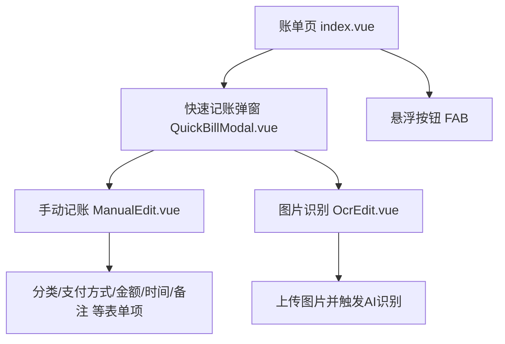
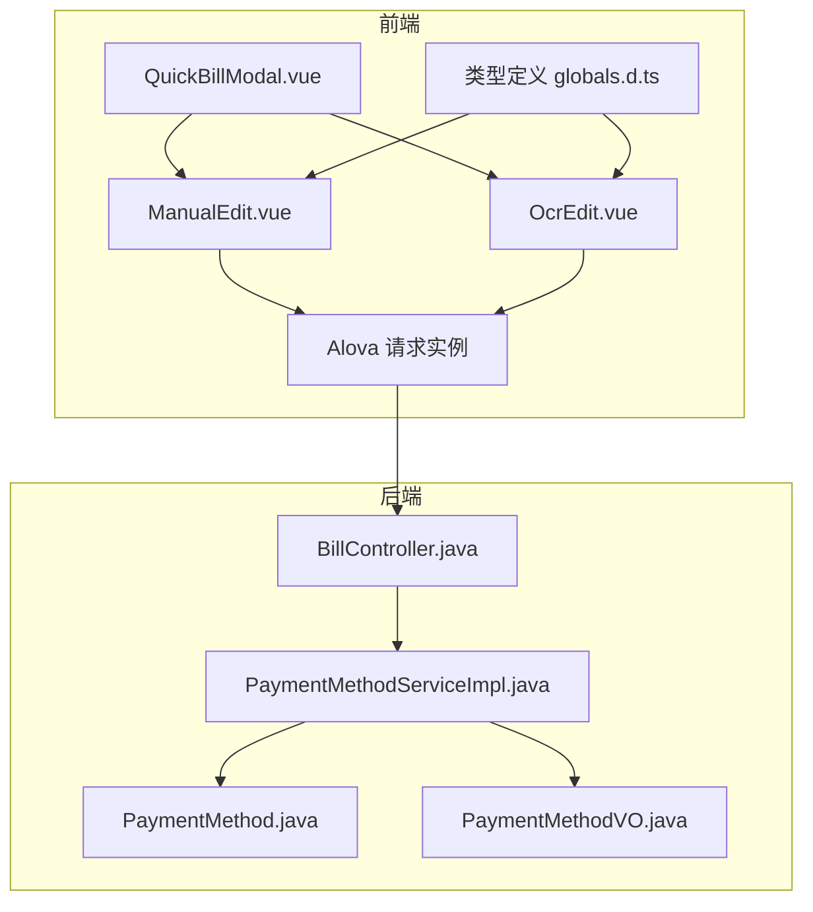
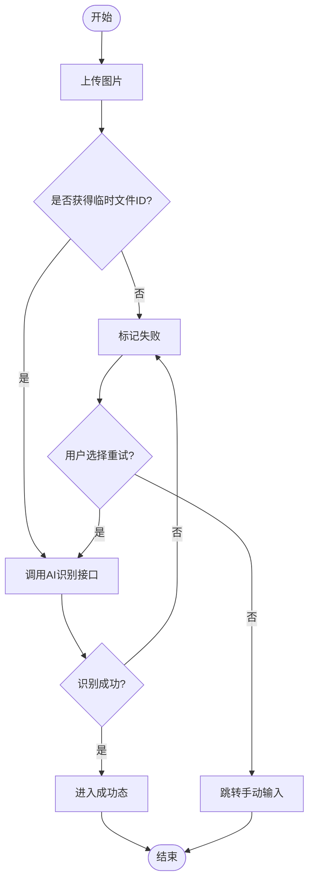
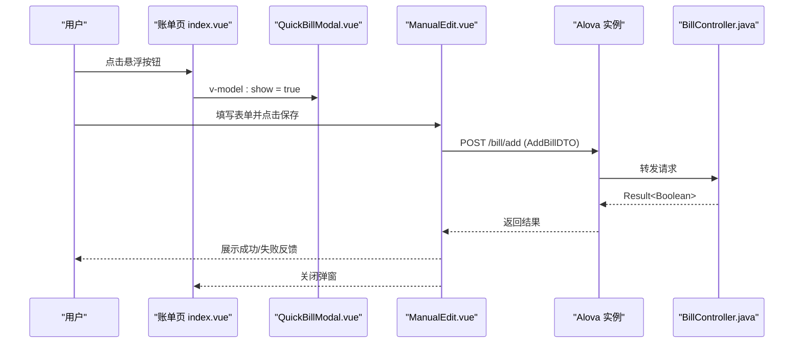
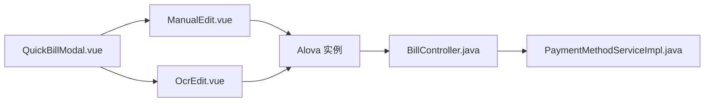

# 快速记账

<cite>
**本文引用的文件**
- [QuickBillModal.vue](file://chuan-bill-app/src/pages/bill/components/QuickBillModal.vue)
- [index.vue（账单页）](file://chuan-bill-app/src/pages/bill/index.vue)
- [ManualEdit.vue](file://chuan-bill-app/src/pages/bill/components/ManualEdit.vue)
- [OcrEdit.vue](file://chuan-bill-app/src/pages/bill/components/OcrEdit.vue)
- [apiDefinitions.ts](file://chuan-bill-app/src/api/apiDefinitions.ts)
- [createApis.ts](file://chuan-bill-app/src/api/createApis.ts)
- [instance.ts（前端请求实例）](file://chuan-bill-app/src/api/core/instance.ts)
- [BillController.java](file://chuan-bill-server/src/main/java/com/samoy/chuanbillserver/controller/BillController.java)
- [PaymentMethodServiceImpl.java](file://chuan-bill-server/src/main/java/com/samoy/chuanbillserver/service/impl/PaymentMethodServiceImpl.java)
- [PaymentMethod.java](file://chuan-bill-server/src/main/java/com/samoy/chuanbillserver/entity/PaymentMethod.java)
- [PaymentMethodVO.java](file://chuan-bill-server/src/main/java/com/samoy/chuanbillserver/vo/PaymentMethodVO.java)
- [init.sql](file://chuan-bill-server/init.sql)
- [globals.d.ts（类型定义）](file://chuan-bill-app/src/api/globals.d.ts)
- [persist.ts（状态持久化插件）](file://chuan-bill-app/src/store/persist.ts)
</cite>

## 目录
1. [简介](#简介)
2. [项目结构](#项目结构)
3. [核心组件](#核心组件)
4. [架构总览](#架构总览)
5. [详细组件分析](#详细组件分析)
6. [依赖关系分析](#依赖关系分析)
7. [性能考量](#性能考量)
8. [故障排查指南](#故障排查指南)
9. [结论](#结论)
10. [附录](#附录)

## 简介
本章节面向“快速记账”功能，系统性阐述其快捷操作设计与实现原理，覆盖默认值设置、一键提交、快速分类、弹窗交互体验、与多输入方式的数据流转关系（默认分类、最近使用的支付方式、常用备注模板等），并给出API接口说明与前端组件实现要点、典型使用场景与最佳实践。

## 项目结构
快速记账位于账单页面，采用底部弹出式动作面板承载三种记账入口：手动添加、图片识别、语音识别。其中手动添加与图片识别已实现，语音识别预留入口。

图表来源
- [index.vue（账单页）:1-54](file://chuan-bill-app/src/pages/bill/index.vue#L1-L54)
- [QuickBillModal.vue:1-64](file://chuan-bill-app/src/pages/bill/components/QuickBillModal.vue#L1-L64)
- [ManualEdit.vue:1-174](file://chuan-bill-app/src/pages/bill/components/ManualEdit.vue#L1-L174)
- [OcrEdit.vue:1-167](file://chuan-bill-app/src/pages/bill/components/OcrEdit.vue#L1-L167)

章节来源
- [index.vue（账单页）:1-54](file://chuan-bill-app/src/pages/bill/index.vue#L1-L54)
- [QuickBillModal.vue:1-64](file://chuan-bill-app/src/pages/bill/components/QuickBillModal.vue#L1-L64)

## 核心组件
- 快速记账弹窗（QuickBillModal）：底部弹出的动作面板，包含“手动添加/图片识别/语音识别”三段式切换；默认选中“手动添加”，打开时自动初始化分段样式。
- 手动记账（ManualEdit）：提供金额、名称、时间、类目、支付方式、共享到家庭、备注等字段；默认类型为“支出”，金额输入为数字键盘，时间默认当前时间；类目按收支类型动态切换；支付方式来自后端列表。
- 图片识别（OcrEdit）：支持上传图片，调用AI识别接口解析账单关键信息，展示加载动画与失败提示，失败时提供“重试/手动输入”入口。
- 账单页（bill/index.vue）：页面内含悬浮按钮，点击打开快速记账弹窗。

章节来源
- [QuickBillModal.vue:1-64](file://chuan-bill-app/src/pages/bill/components/QuickBillModal.vue#L1-L64)
- [ManualEdit.vue:1-174](file://chuan-bill-app/src/pages/bill/components/ManualEdit.vue#L1-L174)
- [OcrEdit.vue:1-167](file://chuan-bill-app/src/pages/bill/components/OcrEdit.vue#L1-L167)
- [index.vue（账单页）:1-54](file://chuan-bill-app/src/pages/bill/index.vue#L1-L54)

## 架构总览
前端通过 Alova 统一发起请求，后端提供账单、分类、支付方式、AI识别等接口。支付方式列表包含系统默认项与用户自定义项，按排序字段升序排列。

图表来源
- [QuickBillModal.vue:1-64](file://chuan-bill-app/src/pages/bill/components/QuickBillModal.vue#L1-L64)
- [ManualEdit.vue:1-174](file://chuan-bill-app/src/pages/bill/components/ManualEdit.vue#L1-L174)
- [OcrEdit.vue:1-167](file://chuan-bill-app/src/pages/bill/components/OcrEdit.vue#L1-L167)
- [instance.ts（前端请求实例）:1-63](file://chuan-bill-app/src/api/core/instance.ts#L1-L63)
- [BillController.java:1-91](file://chuan-bill-server/src/main/java/com/samoy/chuanbillserver/controller/BillController.java#L1-L91)
- [PaymentMethodServiceImpl.java:1-44](file://chuan-bill-server/src/main/java/com/samoy/chuanbillserver/service/impl/PaymentMethodServiceImpl.java#L1-L44)
- [PaymentMethod.java:1-81](file://chuan-bill-server/src/main/java/com/samoy/chuanbillserver/entity/PaymentMethod.java#L1-L81)
- [PaymentMethodVO.java:1-26](file://chuan-bill-server/src/main/java/com/samoy/chuanbillserver/vo/PaymentMethodVO.java#L1-L26)
- [globals.d.ts（类型定义）:214-251](file://chuan-bill-app/src/api/globals.d.ts#L214-L251)

## 详细组件分析

### 快速记账弹窗（QuickBillModal）
- 设计要点
  - 底部弹出动作面板，标题为“记一笔”，默认不点击遮罩关闭。
  - 顶部分段选择器（Segmented）提供“手动添加/图片识别/语音识别”三通道，默认选中“手动添加”。
  - 打开时自动更新分段样式，确保视觉一致。
- 交互逻辑
  - 切换 source 值以渲染对应子组件（ManualEdit 或 OcrEdit）。
  - 通过 v-model:show 控制显示/隐藏。
- 用户体验优化
  - 圆角设计与最大高度限制，适配不同设备屏幕。
  - 分段标签内嵌图标与文字，提升识别度。

章节来源
- [QuickBillModal.vue:1-64](file://chuan-bill-app/src/pages/bill/components/QuickBillModal.vue#L1-L64)

### 手动记账（ManualEdit）
- 默认值与快速分类
  - 类型默认“支出”，金额、时间默认空与当前时间；类目随类型动态切换（收入/支出）。
  - 支付方式默认空，列表由后端返回，按排序字段升序排列。
- 一键提交
  - 表单底部提供“保存”按钮，用于提交 AddBillDTO。
  - 提交前建议进行必填校验（名称、金额、时间、类目等）。
- 数据模型
  - 使用 AddBillDTO，包含名称、分类、支付方式、类型、金额、时间、备注、家庭ID、来源等字段。

章节来源
- [ManualEdit.vue:1-174](file://chuan-bill-app/src/pages/bill/components/ManualEdit.vue#L1-L174)
- [globals.d.ts（类型定义）:214-251](file://chuan-bill-app/src/api/globals.d.ts#L214-L251)

### 图片识别（OcrEdit）
- 流程概览
  - 上传图片至临时文件接口，成功后获取临时文件ID。
  - 调用AI识别接口，返回识别结果（AddBillDTO）。
  - 成功后进入识别结果态，失败则展示失败态与重试/手动输入入口。
- 动画与反馈
  - 上传中展示扫描线动画与遮罩角标，增强等待体验。
  - 失败时提供“重试/手动输入”按钮，便于降级处理。
- 关键状态
  - Init/Pending/Success/Failed 四态管理，避免重复触发任务。

图表来源
- [OcrEdit.vue:1-167](file://chuan-bill-app/src/pages/bill/components/OcrEdit.vue#L1-L167)

章节来源
- [OcrEdit.vue:1-167](file://chuan-bill-app/src/pages/bill/components/OcrEdit.vue#L1-L167)

### 账单页（bill/index.vue）
- 快捷入口
  - 页面右下角悬浮按钮（FAB），点击打开快速记账弹窗。
  - 弹窗通过 v-model:show 控制显示状态。
- 布局适配
  - 通过安全区底部间距调整悬浮按钮位置，适配刘海屏/圆角屏。

章节来源
- [index.vue（账单页）:1-54](file://chuan-bill-app/src/pages/bill/index.vue#L1-L54)

### 支付方式与默认值策略
- 后端策略
  - 返回列表包含系统默认支付方式与用户自定义项，按 sort_order 升序排列。
  - 系统默认支付方式示例：微信、支付宝、现金、银行卡、信用卡、花呗、其他。
- 前端消费
  - ManualEdit 中直接使用后端返回的支付方式列表作为选择项。
  - 若需“最近使用优先”，可在前端本地维护使用频次并二次排序（当前仓库未实现，建议参考状态持久化插件思路）。

章节来源
- [PaymentMethodServiceImpl.java:23-43](file://chuan-bill-server/src/main/java/com/samoy/chuanbillserver/service/impl/PaymentMethodServiceImpl.java#L23-L43)
- [PaymentMethod.java:24-81](file://chuan-bill-server/src/main/java/com/samoy/chuanbillserver/entity/PaymentMethod.java#L24-L81)
- [PaymentMethodVO.java:1-26](file://chuan-bill-server/src/main/java/com/samoy/chuanbillserver/vo/PaymentMethodVO.java#L1-L26)
- [init.sql:317-326](file://chuan-bill-server/init.sql#L317-L326)

### API 接口说明
- 前端接口定义
  - 文件：api/apiDefinitions.ts
  - 包含账单增删改查、分类列表、支付方式列表、AI识别等接口映射。
- 请求封装
  - 文件：api/core/instance.ts
  - Alova 实例统一设置 base URL、请求头、Content-Type、GET防缓存参数、错误/成功回调。
- 类型约束
  - 文件：api/globals.d.ts
  - 定义 AddBillDTO、BillVO、PaymentMethodVO、TempFileVO 等类型，确保前后端契约一致。

章节来源
- [apiDefinitions.ts:19-37](file://chuan-bill-app/src/api/apiDefinitions.ts#L19-L37)
- [instance.ts（前端请求实例）:1-63](file://chuan-bill-app/src/api/core/instance.ts#L1-L63)
- [globals.d.ts（类型定义）:214-251](file://chuan-bill-app/src/api/globals.d.ts#L214-L251)

### 数据流与交互序列
以下序列图展示“手动记账保存”的典型流程：

图表来源
- [index.vue（账单页）:1-54](file://chuan-bill-app/src/pages/bill/index.vue#L1-L54)
- [QuickBillModal.vue:1-64](file://chuan-bill-app/src/pages/bill/components/QuickBillModal.vue#L1-L64)
- [ManualEdit.vue:1-174](file://chuan-bill-app/src/pages/bill/components/ManualEdit.vue#L1-L174)
- [BillController.java:52-57](file://chuan-bill-server/src/main/java/com/samoy/chuanbillserver/controller/BillController.java#L52-L57)

## 依赖关系分析
- 组件耦合
  - QuickBillModal 仅负责弹窗与子组件切换，低耦合。
  - ManualEdit 与 OcrEdit 独立，互不影响。
- 外部依赖
  - Wot Design Uni 组件库（ActionSheet、Segmented、Form、Picker、DatetimePicker、Upload 等）。
  - Alova 请求库，统一处理请求/响应/错误。
- 数据依赖
  - ManualEdit 依赖后端分类与支付方式列表。
  - OcrEdit 依赖临时文件上传与AI识别接口。

图表来源
- [QuickBillModal.vue:1-64](file://chuan-bill-app/src/pages/bill/components/QuickBillModal.vue#L1-L64)
- [ManualEdit.vue:1-174](file://chuan-bill-app/src/pages/bill/components/ManualEdit.vue#L1-L174)
- [OcrEdit.vue:1-167](file://chuan-bill-app/src/pages/bill/components/OcrEdit.vue#L1-L167)
- [BillController.java:1-91](file://chuan-bill-server/src/main/java/com/samoy/chuanbillserver/controller/BillController.java#L1-L91)
- [PaymentMethodServiceImpl.java:1-44](file://chuan-bill-server/src/main/java/com/samoy/chuanbillserver/service/impl/PaymentMethodServiceImpl.java#L1-L44)

## 性能考量
- 请求缓存
  - 当前 Alova 实例已关闭缓存（cacheFor=null），避免历史数据干扰，适合高频变更的账单数据。
- 防抖与节流
  - 金额输入建议使用数字键盘，减少格式化开销。
  - 上传图片建议在选择后立即触发，避免重复上传。
- 视图渲染
  - 弹窗采用底部弹出，内容区域最大高度限制，降低长列表滚动压力。
- 网络优化
  - GET 请求自动附加时间戳参数防止缓存，保证数据实时性。

章节来源
- [instance.ts（前端请求实例）:56-60](file://chuan-bill-app/src/api/core/instance.ts#L56-L60)

## 故障排查指南
- 图片识别失败
  - 症状：上传成功但识别失败，弹出失败提示与“重试/手动输入”按钮。
  - 排查：确认临时文件ID存在、AI识别接口可用、网络稳定。
  - 建议：提供“手动输入”直达入口，缩短失败路径。
- 支付方式为空
  - 症状：支付方式下拉为空。
  - 排查：检查后端返回列表、排序字段、用户登录状态。
- 保存失败
  - 症状：点击保存无响应或报错。
  - 排查：检查必填字段、网络状态、后端日志。

章节来源
- [OcrEdit.vue:116-133](file://chuan-bill-app/src/pages/bill/components/OcrEdit.vue#L116-L133)
- [ManualEdit.vue:1-174](file://chuan-bill-app/src/pages/bill/components/ManualEdit.vue#L1-L174)
- [BillController.java:52-57](file://chuan-bill-server/src/main/java/com/samoy/chuanbillserver/controller/BillController.java#L52-L57)

## 结论
快速记账通过“底部弹窗+三通道入口”的设计，兼顾了易用性与扩展性。手动输入与图片识别两条主路径覆盖高频场景，语音识别预留通道便于未来拓展。前端通过 Alova 统一请求与类型约束，后端提供支付方式与分类列表，整体架构清晰、职责明确。建议后续引入“最近使用支付方式”“常用备注模板”等能力，进一步提升效率与一致性。

## 附录

### 快速记账使用场景与最佳实践
- 使用场景
  - 快速记录日常支出/收入，避免繁琐步骤。
  - 扫码/拍照后自动识别，减少手输成本。
- 最佳实践
  - 金额输入优先使用数字键盘，避免格式错误。
  - 识别失败时优先引导“手动输入”，缩短路径。
  - 支付方式建议按使用频率排序，必要时在前端做二次排序（参考状态持久化插件思路）。
  - 备注建议使用简短模板，结合“最近使用”提升效率。

### 与多输入方式的关系与数据流转
- 默认分类设置
  - 分类列表按类型（收入/支出）拆分，ManualEdit 根据类型动态切换。
- 最近使用的支付方式
  - 当前未实现，建议在前端 store 中维护使用频次并二次排序。
- 常用备注模板
  - 当前未实现，建议在前端 store 中维护模板列表，支持快速插入。

章节来源
- [ManualEdit.vue:31-66](file://chuan-bill-app/src/pages/bill/components/ManualEdit.vue#L31-L66)
- [persist.ts（状态持久化插件）:1-39](file://chuan-bill-app/src/store/persist.ts#L1-L39)