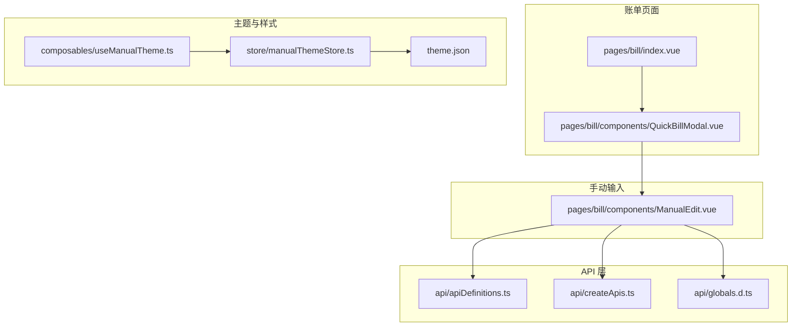
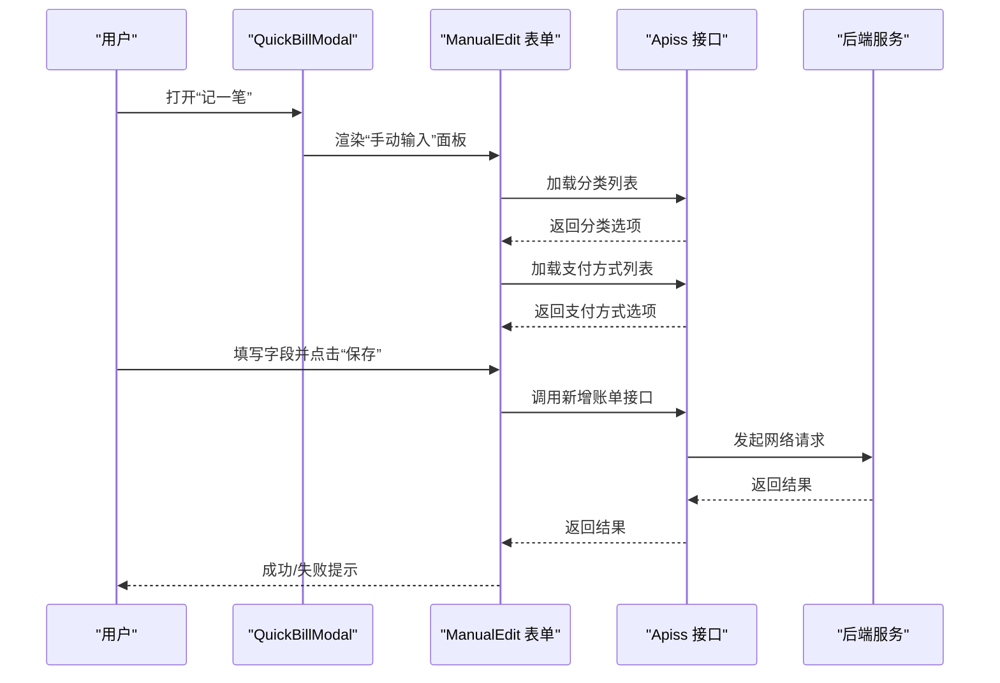
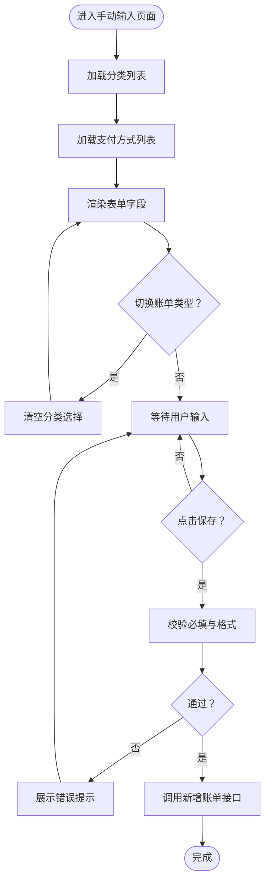
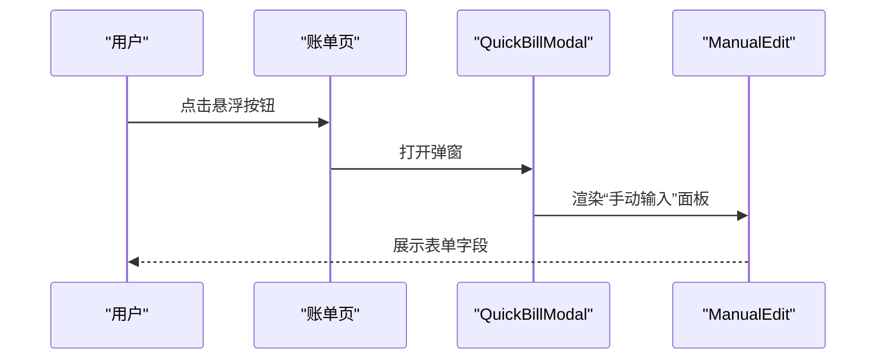
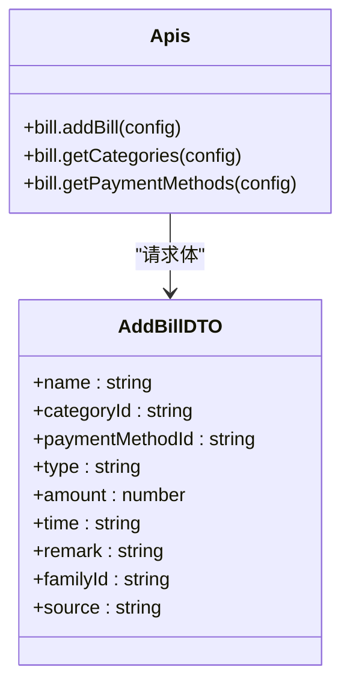
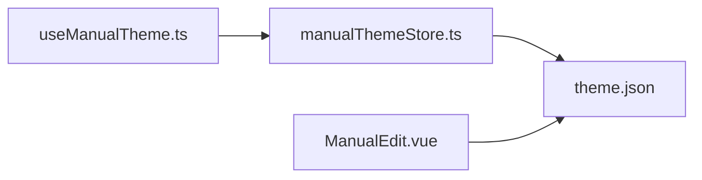
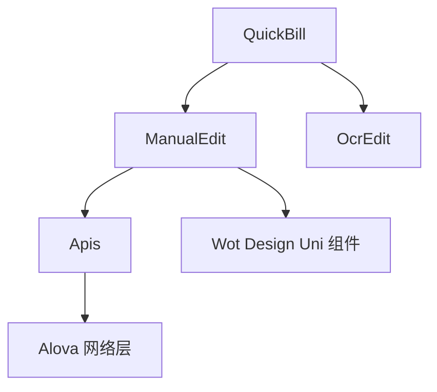

# 手动输入

<cite>
**本文档引用的文件**
- [ManualEdit.vue](file://chuan-bill-app/src/pages/bill/components/ManualEdit.vue)
- [QuickBillModal.vue](file://chuan-bill-app/src/pages/bill/components/QuickBillModal.vue)
- [index.vue](file://chuan-bill-app/src/pages/bill/index.vue)
- [apiDefinitions.ts](file://chuan-bill-app/src/api/apiDefinitions.ts)
- [globals.d.ts](file://chuan-bill-app/src/api/globals.d.ts)
- [createApis.ts](file://chuan-bill-app/src/api/createApis.ts)
- [OcrEdit.vue](file://chuan-bill-app/src/pages/bill/components/OcrEdit.vue)
- [useManualTheme.ts](file://chuan-bill-app/src/composables/useManualTheme.ts)
- [manualThemeStore.ts](file://chuan-bill-app/src/store/manualThemeStore.ts)
- [theme.json](file://chuan-bill-app/src/theme.json)
</cite>

## 目录
1. [简介](#简介)
2. [项目结构](#项目结构)
3. [核心组件](#核心组件)
4. [架构总览](#架构总览)
5. [详细组件分析](#详细组件分析)
6. [依赖关系分析](#依赖关系分析)
7. [性能考量](#性能考量)
8. [故障排查指南](#故障排查指南)
9. [结论](#结论)
10. [附录](#附录)

## 简介
本章节概述“手动输入”功能的整体目标与定位：为用户提供一个简洁直观的手工录入账单界面，支持金额、分类、支付方式、时间、备注等关键字段的输入与校验；同时提供“共享到家庭”的可选能力。该功能通过统一的表单模型驱动数据流，结合后端接口完成数据持久化，并在前端层面提供良好的交互反馈与主题适配。

## 项目结构
“手动输入”功能主要由以下模块构成：
- 快速记账弹窗：承载“手动输入”和“图片识别”两种入口，负责切换与容器渲染
- 手动输入表单：负责金额、分类、支付方式、时间、备注等字段的输入与联动
- API 定义与生成：基于 OpenAPI 定义生成强类型的调用方法
- 主题与样式：提供深浅色主题、主题色切换与导航栏颜色同步

**图表来源**
- [index.vue:1-54](file://chuan-bill-app/src/pages/bill/index.vue#L1-L54)
- [QuickBillModal.vue:1-64](file://chuan-bill-app/src/pages/bill/components/QuickBillModal.vue#L1-L64)
- [ManualEdit.vue:1-174](file://chuan-bill-app/src/pages/bill/components/ManualEdit.vue#L1-L174)
- [apiDefinitions.ts:19-37](file://chuan-bill-app/src/api/apiDefinitions.ts#L19-L37)
- [createApis.ts:65-76](file://chuan-bill-app/src/api/createApis.ts#L65-L76)
- [globals.d.ts:545-1399](file://chuan-bill-app/src/api/globals.d.ts#L545-L1399)
- [useManualTheme.ts:44-138](file://chuan-bill-app/src/composables/useManualTheme.ts#L44-L138)
- [manualThemeStore.ts:9-151](file://chuan-bill-app/src/store/manualThemeStore.ts#L9-L151)
- [theme.json:1-27](file://chuan-bill-app/src/theme.json#L1-L27)

**章节来源**
- [index.vue:1-54](file://chuan-bill-app/src/pages/bill/index.vue#L1-L54)
- [QuickBillModal.vue:1-64](file://chuan-bill-app/src/pages/bill/components/QuickBillModal.vue#L1-L64)
- [ManualEdit.vue:1-174](file://chuan-bill-app/src/pages/bill/components/ManualEdit.vue#L1-L174)
- [apiDefinitions.ts:19-37](file://chuan-bill-app/src/api/apiDefinitions.ts#L19-L37)
- [createApis.ts:65-76](file://chuan-bill-app/src/api/createApis.ts#L65-L76)
- [globals.d.ts:545-1399](file://chuan-bill-app/src/api/globals.d.ts#L545-L1399)
- [useManualTheme.ts:44-138](file://chuan-bill-app/src/composables/useManualTheme.ts#L44-L138)
- [manualThemeStore.ts:9-151](file://chuan-bill-app/src/store/manualThemeStore.ts#L9-L151)
- [theme.json:1-27](file://chuan-bill-app/src/theme.json#L1-L27)

## 核心组件
- 快速记账弹窗（QuickBillModal）：提供“手动添加”“图片识别”入口，内部通过分段控件切换内容区，当前聚焦“手动输入”
- 手动输入表单（ManualEdit）：包含账单类型（收入/支出）、金额、名称、时间、分类、支付方式、共享开关、备注等字段
- API 生成与类型（createApis + globals.d.ts + apiDefinitions.ts）：提供强类型接口调用，覆盖账单新增、分类与支付方式获取等
- 主题与样式（useManualTheme + manualThemeStore + theme.json）：提供主题色与深浅色切换、导航栏颜色同步

**章节来源**
- [QuickBillModal.vue:1-64](file://chuan-bill-app/src/pages/bill/components/QuickBillModal.vue#L1-L64)
- [ManualEdit.vue:1-174](file://chuan-bill-app/src/pages/bill/components/ManualEdit.vue#L1-L174)
- [createApis.ts:65-76](file://chuan-bill-app/src/api/createApis.ts#L65-L76)
- [globals.d.ts:545-1399](file://chuan-bill-app/src/api/globals.d.ts#L545-L1399)
- [apiDefinitions.ts:19-37](file://chuan-bill-app/src/api/apiDefinitions.ts#L19-L37)
- [useManualTheme.ts:44-138](file://chuan-bill-app/src/composables/useManualTheme.ts#L44-L138)
- [manualThemeStore.ts:9-151](file://chuan-bill-app/src/store/manualThemeStore.ts#L9-L151)
- [theme.json:1-27](file://chuan-bill-app/src/theme.json#L1-L27)

## 架构总览
“手动输入”采用“视图组件 + API 生成层 + 类型约束 + 主题管理”的分层架构。表单通过响应式数据绑定驱动 UI，异步加载分类与支付方式，最终通过强类型 API 提交新增账单请求。

**图表来源**
- [QuickBillModal.vue:26-52](file://chuan-bill-app/src/pages/bill/components/QuickBillModal.vue#L26-L52)
- [ManualEdit.vue:31-66](file://chuan-bill-app/src/pages/bill/components/ManualEdit.vue#L31-L66)
- [apiDefinitions.ts:26-36](file://chuan-bill-app/src/api/apiDefinitions.ts#L26-L36)
- [globals.d.ts:880-932](file://chuan-bill-app/src/api/globals.d.ts#L880-L932)

**章节来源**
- [QuickBillModal.vue:1-64](file://chuan-bill-app/src/pages/bill/components/QuickBillModal.vue#L1-L64)
- [ManualEdit.vue:1-174](file://chuan-bill-app/src/pages/bill/components/ManualEdit.vue#L1-L174)
- [apiDefinitions.ts:19-37](file://chuan-bill-app/src/api/apiDefinitions.ts#L19-L37)
- [globals.d.ts:880-932](file://chuan-bill-app/src/api/globals.d.ts#L880-L932)

## 详细组件分析

### 手动输入表单（ManualEdit）
- 数据模型
  - 使用响应式对象承载表单数据，包含名称、类型、金额、时间、分类、支付方式、备注、家庭共享标识等字段
  - 通过分类映射（按收入/支出拆分）与支付方式列表进行联动
- 字段与交互
  - 账单类型：单选按钮组，切换时联动分类选项
  - 金额：数字输入框，支持输入法与格式化
  - 名称：文本输入，限制长度
  - 时间：日期时间选择器，默认值为当前时间
  - 分类：选择器，随类型动态切换
  - 支付方式：选择器
  - 共享开关：开关控件，开启后显示家庭选择器
  - 备注：多行文本输入，带字数统计
- 状态管理
  - 表单初始加载时拉取分类与支付方式列表
  - 类型切换时清空对应选择值，避免脏数据
- 数据提交
  - 当前模板未包含提交按钮事件绑定与提交流程代码片段，建议在保存按钮处绑定提交逻辑，调用新增账单接口并处理成功/失败反馈

**图表来源**
- [ManualEdit.vue:31-66](file://chuan-bill-app/src/pages/bill/components/ManualEdit.vue#L31-L66)
- [ManualEdit.vue:69-135](file://chuan-bill-app/src/pages/bill/components/ManualEdit.vue#L69-L135)

**章节来源**
- [ManualEdit.vue:1-174](file://chuan-bill-app/src/pages/bill/components/ManualEdit.vue#L1-L174)

### 快速记账弹窗（QuickBillModal）
- 功能概览
  - 提供“手动添加”“图片识别”入口，通过分段控件切换内容
  - “手动添加”直接渲染 ManualEdit 组件
- 交互要点
  - 弹窗底部展示，支持关闭遮罩层
  - 内容区高度限制，配合滚动容器

**图表来源**
- [index.vue:39-42](file://chuan-bill-app/src/pages/bill/index.vue#L39-L42)
- [QuickBillModal.vue:26-52](file://chuan-bill-app/src/pages/bill/components/QuickBillModal.vue#L26-L52)
- [ManualEdit.vue:69-135](file://chuan-bill-app/src/pages/bill/components/ManualEdit.vue#L69-L135)

**章节来源**
- [index.vue:1-54](file://chuan-bill-app/src/pages/bill/index.vue#L1-L54)
- [QuickBillModal.vue:1-64](file://chuan-bill-app/src/pages/bill/components/QuickBillModal.vue#L1-L64)

### API 接口与类型约束
- 接口定义
  - 新增账单：POST /bill/add
  - 获取分类列表：GET /bill/categories
  - 获取支付方式列表：GET /bill/payment-methods
- 类型约束
  - 新增账单请求体类型：AddBillDTO
  - 分类与支付方式响应类型：CategoryVO、PaymentMethodVO
- API 生成
  - 基于 apiDefinitions.ts 的键值对生成强类型方法，便于在组件中直接调用

**图表来源**
- [apiDefinitions.ts:26-36](file://chuan-bill-app/src/api/apiDefinitions.ts#L26-L36)
- [globals.d.ts:214-251](file://chuan-bill-app/src/api/globals.d.ts#L214-L251)
- [createApis.ts:65-76](file://chuan-bill-app/src/api/createApis.ts#L65-L76)

**章节来源**
- [apiDefinitions.ts:19-37](file://chuan-bill-app/src/api/apiDefinitions.ts#L19-L37)
- [globals.d.ts:214-251](file://chuan-bill-app/src/api/globals.d.ts#L214-L251)
- [createApis.ts:65-76](file://chuan-bill-app/src/api/createApis.ts#L65-L76)

### 主题与样式
- 主题管理
  - 支持手动切换深浅色、跟随系统主题、主题色选择
  - 导航栏颜色根据主题自动同步
- 样式适配
  - 表单控件在深色模式下的背景与边框适配
  - 金额输入框字号与加粗样式提升可读性

**图表来源**
- [useManualTheme.ts:44-138](file://chuan-bill-app/src/composables/useManualTheme.ts#L44-L138)
- [manualThemeStore.ts:9-151](file://chuan-bill-app/src/store/manualThemeStore.ts#L9-L151)
- [theme.json:1-27](file://chuan-bill-app/src/theme.json#L1-L27)
- [ManualEdit.vue:137-173](file://chuan-bill-app/src/pages/bill/components/ManualEdit.vue#L137-L173)

**章节来源**
- [useManualTheme.ts:44-138](file://chuan-bill-app/src/composables/useManualTheme.ts#L44-L138)
- [manualThemeStore.ts:9-151](file://chuan-bill-app/src/store/manualThemeStore.ts#L9-L151)
- [theme.json:1-27](file://chuan-bill-app/src/theme.json#L1-L27)
- [ManualEdit.vue:137-173](file://chuan-bill-app/src/pages/bill/components/ManualEdit.vue#L137-L173)

## 依赖关系分析
- 组件耦合
  - QuickBillModal 作为容器，依赖 ManualEdit 与 OcrEdit
  - ManualEdit 依赖 Apis（通过全局变量）进行数据加载与提交
- 外部依赖
  - Wot Design Uni 组件库（表单、选择器、日期时间、弹窗等）
  - Alova 用于网络请求与方法生成
- 潜在风险
  - ManualEdit 中的提交逻辑未在现有代码中体现，需补充保存按钮事件绑定与错误处理
  - 分类与支付方式的加载顺序与缓存策略需明确，避免重复请求

**图表来源**
- [ManualEdit.vue:31-66](file://chuan-bill-app/src/pages/bill/components/ManualEdit.vue#L31-L66)
- [QuickBillModal.vue:2-3](file://chuan-bill-app/src/pages/bill/components/QuickBillModal.vue#L2-L3)
- [OcrEdit.vue:1-167](file://chuan-bill-app/src/pages/bill/components/OcrEdit.vue#L1-L167)
- [createApis.ts:65-76](file://chuan-bill-app/src/api/createApis.ts#L65-L76)

**章节来源**
- [ManualEdit.vue:1-174](file://chuan-bill-app/src/pages/bill/components/ManualEdit.vue#L1-L174)
- [QuickBillModal.vue:1-64](file://chuan-bill-app/src/pages/bill/components/QuickBillModal.vue#L1-L64)
- [OcrEdit.vue:1-167](file://chuan-bill-app/src/pages/bill/components/OcrEdit.vue#L1-L167)
- [createApis.ts:65-76](file://chuan-bill-app/src/api/createApis.ts#L65-L76)

## 性能考量
- 请求去重与缓存
  - 分类与支付方式列表建议缓存，避免频繁请求
- 渲染优化
  - 选择器与日期时间控件在弹窗内滚动，注意避免不必要的重渲染
- 输入体验
  - 数字输入框仅允许合法数值字符，减少无效重绘
  - 备注输入启用字数统计，降低后端压力

[本节为通用指导，无需特定文件引用]

## 故障排查指南
- 分类/支付方式未显示
  - 检查接口返回与列表赋值逻辑
  - 确认类型切换后是否正确清空分类选择
- 金额输入异常
  - 确认数字输入框类型与格式化策略
  - 检查是否存在前置零或多余小数点
- 提交失败
  - 检查请求体字段是否符合 AddBillDTO 类型
  - 查看网络层日志与后端返回状态码
- 主题不生效
  - 确认 useManualTheme 初始化与 store 同步
  - 检查导航栏颜色设置是否被其他逻辑覆盖

**章节来源**
- [ManualEdit.vue:31-66](file://chuan-bill-app/src/pages/bill/components/ManualEdit.vue#L31-L66)
- [globals.d.ts:214-251](file://chuan-bill-app/src/api/globals.d.ts#L214-L251)
- [useManualTheme.ts:83-104](file://chuan-bill-app/src/composables/useManualTheme.ts#L83-L104)

## 结论
“手动输入”功能通过清晰的组件分层与强类型 API，实现了从数据加载到提交的完整闭环。建议后续完善保存按钮的提交流程与错误处理，并持续优化主题与输入体验，以提升用户效率与满意度。

[本节为总结性内容，无需特定文件引用]

## 附录

### 字段与验证规则（基于类型约束）
- 必填项
  - 名称：字符串，最大长度 100
  - 类型：枚举（income/expense）
  - 金额：数值，单位通常为元
  - 时间：日期时间字符串
  - 分类：字符串（分类 ID）
- 可选项
  - 支付方式：字符串（支付方式 ID）
  - 备注：字符串，最大长度 500
  - 家庭共享：布尔值，开启时需要家庭 ID
- 格式与范围
  - 金额应为非负数值
  - 时间不应晚于未来时间（可由后端约束）

**章节来源**
- [globals.d.ts:214-251](file://chuan-bill-app/src/api/globals.d.ts#L214-L251)
- [ManualEdit.vue:82-129](file://chuan-bill-app/src/pages/bill/components/ManualEdit.vue#L82-L129)

### 提交流程（建议实现）
- 触发保存按钮
- 校验必填与格式
- 组装 AddBillDTO 请求体
- 调用 Apis.bill.addBill 提交
- 处理成功/失败反馈并关闭弹窗

**章节来源**
- [apiDefinitions.ts:26-26](file://chuan-bill-app/src/api/apiDefinitions.ts#L26-L26)
- [globals.d.ts:880-932](file://chuan-bill-app/src/api/globals.d.ts#L880-L932)
- [ManualEdit.vue:131-133](file://chuan-bill-app/src/pages/bill/components/ManualEdit.vue#L131-L133)