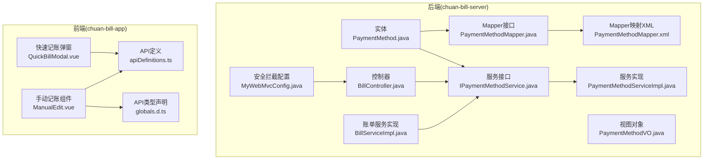
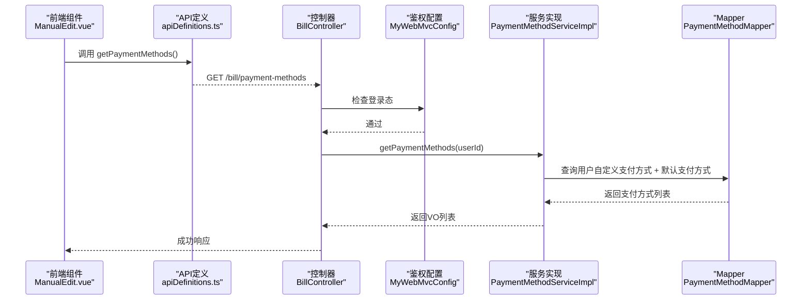
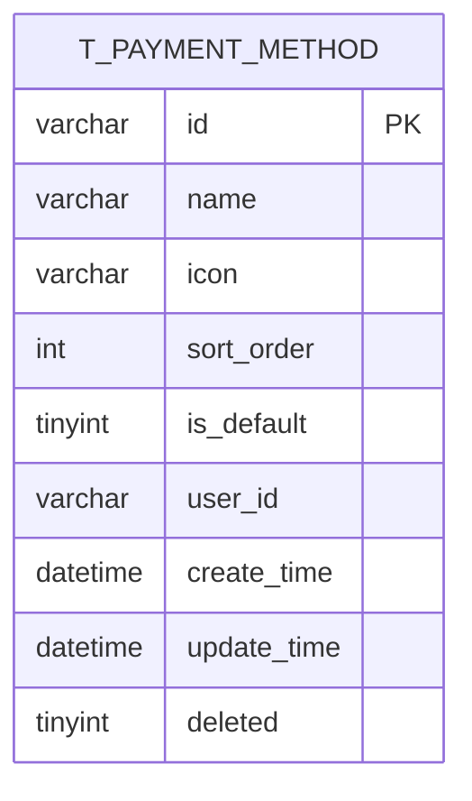
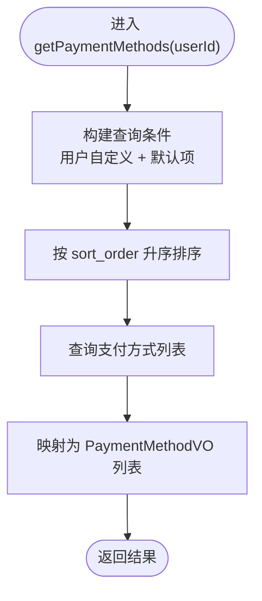
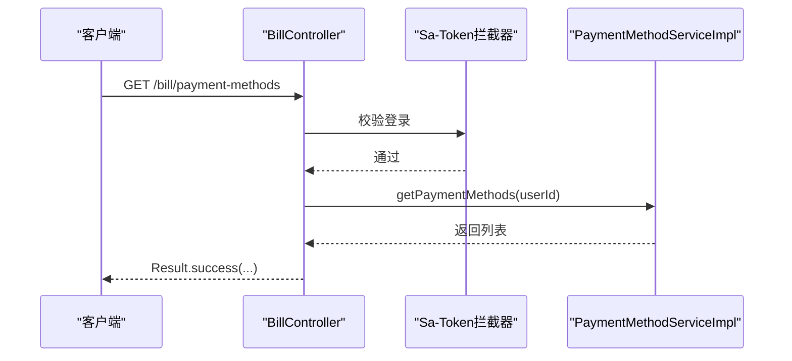
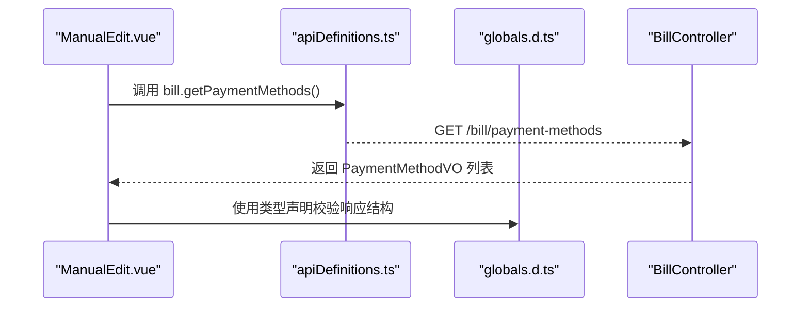
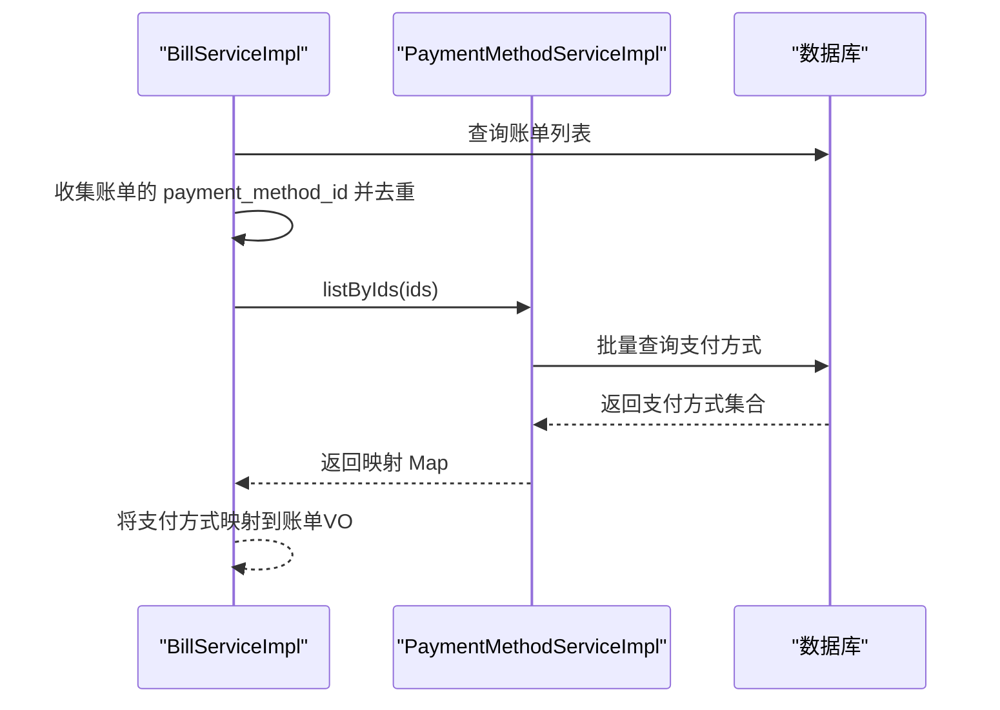
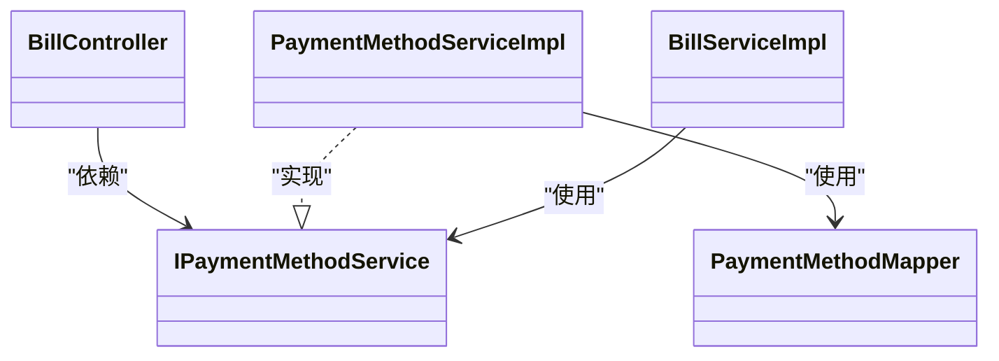

# 支付方式管理

<cite>
**本文引用的文件**   
- [PaymentMethod.java](file://chuan-bill-server/src/main/java/com/samoy/chuanbillserver/entity/PaymentMethod.java)
- [IPaymentMethodService.java](file://chuan-bill-server/src/main/java/com/samoy/chuanbillserver/service/IPaymentMethodService.java)
- [PaymentMethodServiceImpl.java](file://chuan-bill-server/src/main/java/com/samoy/chuanbillserver/service/impl/PaymentMethodServiceImpl.java)
- [PaymentMethodMapper.java](file://chuan-bill-server/src/main/java/com/samoy/chuanbillserver/dao/PaymentMethodMapper.java)
- [PaymentMethodMapper.xml](file://chuan-bill-server/src/main/resources/mapper/PaymentMethodMapper.xml)
- [PaymentMethodVO.java](file://chuan-bill-server/src/main/java/com/samoy/chuanbillserver/vo/PaymentMethodVO.java)
- [BillController.java](file://chuan-bill-server/src/main/java/com/samoy/chuanbillserver/controller/BillController.java)
- [BillServiceImpl.java](file://chuan-bill-server/src/main/java/com/samoy/chuanbillserver/service/impl/BillServiceImpl.java)
- [init.sql](file://chuan-bill-server/init.sql)
- [apiDefinitions.ts](file://chuan-bill-app/src/api/apiDefinitions.ts)
- [globals.d.ts](file://chuan-bill-app/src/api/globals.d.ts)
- [ManualEdit.vue](file://chuan-bill-app/src/pages/bill/components/ManualEdit.vue)
- [QuickBillModal.vue](file://chuan-bill-app/src/pages/bill/components/QuickBillModal.vue)
- [MyWebMvcConfig.java](file://chuan-bill-server/src/main/java/com/samoy/chuanbillserver/config/MyWebMvcConfig.java)
- [AuthController.java](file://chuan-bill-server/src/main/java/com/samoy/chuanbillserver/controller/AuthController.java)
- [UserController.java](file://chuan-bill-server/src/main/java/com/samoy/chuanbillserver/controller/UserController.java)
</cite>

## 目录
1. [简介](#简介)
2. [项目结构](#项目结构)
3. [核心组件](#核心组件)
4. [架构总览](#架构总览)
5. [详细组件分析](#详细组件分析)
6. [依赖关系分析](#依赖关系分析)
7. [性能考量](#性能考量)
8. [故障排查指南](#故障排查指南)
9. [结论](#结论)
10. [附录](#附录)

## 简介
本章节概述支付方式管理功能的目标与范围：定义支付方式的数据模型与业务规则，提供支付方式的增删改查能力，并说明其在账单录入流程中的应用与数据关联。重点覆盖以下方面：
- 支付方式类型与业务含义（示例：现金、银行卡、移动支付等）
- 支付方式的优先级与默认策略
- 在账单录入中的选择与绑定
- 后端服务层与控制器层的实现要点
- 前端组件如何调用后端接口并展示支付方式列表
- 安全与权限控制、审计与日志建议

## 项目结构
支付方式管理涉及后端实体与服务层、数据库映射、控制器接口，以及前端页面组件与API定义。整体结构如下：

图表来源
- [PaymentMethod.java:24-81](file://chuan-bill-server/src/main/java/com/samoy/chuanbillserver/entity/PaymentMethod.java#L24-L81)
- [PaymentMethodMapper.java:1-14](file://chuan-bill-server/src/main/java/com/samoy/chuanbillserver/dao/PaymentMethodMapper.java#L1-L14)
- [PaymentMethodMapper.xml:1-5](file://chuan-bill-server/src/main/resources/mapper/PaymentMethodMapper.xml#L1-L5)
- [IPaymentMethodService.java:16-25](file://chuan-bill-server/src/main/java/com/samoy/chuanbillserver/service/IPaymentMethodService.java#L16-L25)
- [PaymentMethodServiceImpl.java:20-44](file://chuan-bill-server/src/main/java/com/samoy/chuanbillserver/service/impl/PaymentMethodServiceImpl.java#L20-L44)
- [BillController.java:23-90](file://chuan-bill-server/src/main/java/com/samoy/chuanbillserver/controller/BillController.java#L23-L90)
- [BillServiceImpl.java:100-123](file://chuan-bill-server/src/main/java/com/samoy/chuanbillserver/service/impl/BillServiceImpl.java#L100-L123)
- [ManualEdit.vue:50-61](file://chuan-bill-app/src/pages/bill/components/ManualEdit.vue#L50-L61)
- [QuickBillModal.vue:1-23](file://chuan-bill-app/src/pages/bill/components/QuickBillModal.vue#L1-L23)
- [apiDefinitions.ts:19-37](file://chuan-bill-app/src/api/apiDefinitions.ts#L19-L37)
- [globals.d.ts:937-971](file://chuan-bill-app/src/api/globals.d.ts#L937-L971)

章节来源
- [BillController.java:23-90](file://chuan-bill-server/src/main/java/com/samoy/chuanbillserver/controller/BillController.java#L23-L90)
- [PaymentMethodServiceImpl.java:20-44](file://chuan-bill-server/src/main/java/com/samoy/chuanbillserver/service/impl/PaymentMethodServiceImpl.java#L20-L44)
- [ManualEdit.vue:50-61](file://chuan-bill-app/src/pages/bill/components/ManualEdit.vue#L50-L61)

## 核心组件
- 支付方式实体：承载支付方式的标识、名称、图标、排序、默认标记、所属用户、时间戳与逻辑删除等字段。
- 支付方式服务：提供按用户过滤与全局默认项合并的列表查询能力，并按排序升序返回。
- 控制器接口：对外暴露“获取支付方式列表”的REST接口，结合鉴权中间件确保登录态。
- 前端组件：在账单录入页面加载支付方式列表，作为记账时的支付方式选择项。
- 账单服务：在批量/单条账单查询时，按需预加载支付方式映射，避免N+1查询。

章节来源
- [PaymentMethod.java:24-81](file://chuan-bill-server/src/main/java/com/samoy/chuanbillserver/entity/PaymentMethod.java#L24-L81)
- [IPaymentMethodService.java:16-25](file://chuan-bill-server/src/main/java/com/samoy/chuanbillserver/service/IPaymentMethodService.java#L16-L25)
- [PaymentMethodServiceImpl.java:24-43](file://chuan-bill-server/src/main/java/com/samoy/chuanbillserver/service/impl/PaymentMethodServiceImpl.java#L24-L43)
- [BillController.java:83-89](file://chuan-bill-server/src/main/java/com/samoy/chuanbillserver/controller/BillController.java#L83-L89)
- [BillServiceImpl.java:106-122](file://chuan-bill-server/src/main/java/com/samoy/chuanbillserver/service/impl/BillServiceImpl.java#L106-L122)
- [ManualEdit.vue:50-61](file://chuan-bill-app/src/pages/bill/components/ManualEdit.vue#L50-L61)

## 架构总览
支付方式管理采用经典的分层架构：前端通过API定义发起请求，控制器接收并鉴权，服务层执行业务逻辑，持久层访问数据库。账单模块在查询账单列表时，会批量预取支付方式信息，减少数据库往返次数。

图表来源
- [ManualEdit.vue:50-61](file://chuan-bill-app/src/pages/bill/components/ManualEdit.vue#L50-L61)
- [apiDefinitions.ts:32](file://chuan-bill-app/src/api/apiDefinitions.ts#L32)
- [BillController.java:83-89](file://chuan-bill-server/src/main/java/com/samoy/chuanbillserver/controller/BillController.java#L83-L89)
- [MyWebMvcConfig.java:10-20](file://chuan-bill-server/src/main/java/com/samoy/chuanbillserver/config/MyWebMvcConfig.java#L10-L20)
- [PaymentMethodServiceImpl.java:24-43](file://chuan-bill-server/src/main/java/com/samoy/chuanbillserver/service/impl/PaymentMethodServiceImpl.java#L24-L43)

## 详细组件分析

### 数据模型与业务规则
- 表结构与字段
  - 主键：支付方式ID
  - 名称：显示名称
  - 图标：图标URL
  - 排序：数值越小越靠前
  - 默认：是否为系统默认支付方式
  - 用户ID：为空表示系统预设，非空表示用户自定义
  - 时间戳：创建/更新时间
  - 逻辑删除：0未删除，1已删除
- 业务规则
  - 用户可见的支付方式 = 用户自定义 + 系统默认
  - 列表按排序升序排列
  - 系统默认支付方式在初始化脚本中预置多类（如微信、支付宝、现金、银行卡、信用卡、花呗、其他）

图表来源
- [PaymentMethod.java:24-81](file://chuan-bill-server/src/main/java/com/samoy/chuanbillserver/entity/PaymentMethod.java#L24-L81)
- [init.sql:54-69](file://chuan-bill-server/init.sql#L54-L69)

章节来源
- [PaymentMethod.java:24-81](file://chuan-bill-server/src/main/java/com/samoy/chuanbillserver/entity/PaymentPaymentMethod.java#L24-L81)
- [init.sql:314-326](file://chuan-bill-server/init.sql#L314-L326)

### 服务层实现与查询逻辑
- 查询策略
  - 过滤条件：用户ID匹配 或 默认项
  - 排序：按sort_order升序
  - 映射：将实体映射为VO，便于前端渲染
- 性能优化
  - 批量预加载：账单服务在分页查询时，先收集所有账单涉及的支付方式ID，再一次性查询并建立映射，避免N+1查询

图表来源
- [PaymentMethodServiceImpl.java:24-43](file://chuan-bill-server/src/main/java/com/samoy/chuanbillserver/service/impl/PaymentMethodServiceImpl.java#L24-L43)

章节来源
- [PaymentMethodServiceImpl.java:24-43](file://chuan-bill-server/src/main/java/com/samoy/chuanbillserver/service/impl/PaymentMethodServiceImpl.java#L24-L43)
- [BillServiceImpl.java:106-122](file://chuan-bill-server/src/main/java/com/samoy/chuanbillserver/service/impl/BillServiceImpl.java#L106-L122)

### 控制器接口与鉴权
- 接口定义
  - GET /bill/payment-methods：返回当前用户可用的支付方式列表
- 鉴权机制
  - 通过拦截器统一校验登录态，除认证相关路径外，所有接口均需登录

图表来源
- [BillController.java:83-89](file://chuan-bill-server/src/main/java/com/samoy/chuanbillserver/controller/BillController.java#L83-L89)
- [MyWebMvcConfig.java:10-20](file://chuan-bill-server/src/main/java/com/samoy/chuanbillserver/config/MyWebMvcConfig.java#L10-L20)

章节来源
- [BillController.java:83-89](file://chuan-bill-server/src/main/java/com/samoy/chuanbillserver/controller/BillController.java#L83-L89)
- [MyWebMvcConfig.java:10-20](file://chuan-bill-server/src/main/java/com/samoy/chuanbillserver/config/MyWebMvcConfig.java#L10-L20)

### 前端组件与API集成
- 组件职责
  - ManualEdit.vue：在账单录入页面加载支付方式列表，作为支付方式选择器的数据源
  - QuickBillModal.vue：提供快速记账入口，内部包含多种记账方式（手动、OCR、语音）
- API调用
  - 通过apiDefinitions.ts定义的路径调用后端接口
  - globals.d.ts中声明了返回结构，包括支付方式ID、名称、图标、排序、默认标记、用户ID等字段

图表来源
- [ManualEdit.vue:50-61](file://chuan-bill-app/src/pages/bill/components/ManualEdit.vue#L50-L61)
- [apiDefinitions.ts:32](file://chuan-bill-app/src/api/apiDefinitions.ts#L32)
- [globals.d.ts:937-971](file://chuan-bill-app/src/api/globals.d.ts#L937-L971)

章节来源
- [ManualEdit.vue:50-61](file://chuan-bill-app/src/pages/bill/components/ManualEdit.vue#L50-L61)
- [apiDefinitions.ts:32](file://chuan-bill-app/src/api/apiDefinitions.ts#L32)
- [globals.d.ts:937-971](file://chuan-bill-app/src/api/globals.d.ts#L937-L971)

### 账单录入中的应用与数据关联
- 关联关系
  - 账单表包含payment_method_id字段，用于关联支付方式
  - 在账单详情与列表中，通过支付方式ID回显支付方式名称与图标
- 查询优化
  - 列表分页时，先收集所有账单的支付方式ID，一次性查询并建立映射，避免逐条查询

图表来源
- [BillServiceImpl.java:106-122](file://chuan-bill-server/src/main/java/com/samoy/chuanbillserver/service/impl/BillServiceImpl.java#L106-L122)
- [BillServiceImpl.java:191-215](file://chuan-bill-server/src/main/java/com/samoy/chuanbillserver/service/impl/BillServiceImpl.java#L191-L215)
- [BillServiceImpl.java:221-242](file://chuan-bill-server/src/main/java/com/samoy/chuanbillserver/service/impl/BillServiceImpl.java#L221-L242)

章节来源
- [BillServiceImpl.java:106-122](file://chuan-bill-server/src/main/java/com/samoy/chuanbillserver/service/impl/BillServiceImpl.java#L106-L122)
- [BillServiceImpl.java:191-215](file://chuan-bill-server/src/main/java/com/samoy/chuanbillserver/service/impl/BillServiceImpl.java#L191-L215)
- [BillServiceImpl.java:221-242](file://chuan-bill-server/src/main/java/com/samoy/chuanbillserver/service/impl/BillServiceImpl.java#L221-L242)

## 依赖关系分析
- 组件耦合
  - BillController依赖IPaymentMethodService
  - PaymentMethodServiceImpl依赖PaymentMethodMapper
  - BillServiceImpl依赖IPaymentMethodService进行支付方式信息回显
- 外部依赖
  - Sa-Token用于统一鉴权
  - MyBatis-Plus用于ORM与分页

图表来源
- [BillController.java:23-90](file://chuan-bill-server/src/main/java/com/samoy/chuanbillserver/controller/BillController.java#L23-L90)
- [IPaymentMethodService.java:16-25](file://chuan-bill-server/src/main/java/com/samoy/chuanbillserver/service/IPaymentMethodService.java#L16-L25)
- [PaymentMethodServiceImpl.java:20-44](file://chuan-bill-server/src/main/java/com/samoy/chuanbillserver/service/impl/PaymentMethodServiceImpl.java#L20-L44)
- [PaymentMethodMapper.java:1-14](file://chuan-bill-server/src/main/java/com/samoy/chuanbillserver/dao/PaymentMethodMapper.java#L1-L14)
- [BillServiceImpl.java:100-123](file://chuan-bill-server/src/main/java/com/samoy/chuanbillserver/service/impl/BillServiceImpl.java#L100-L123)

章节来源
- [BillController.java:23-90](file://chuan-bill-server/src/main/java/com/samoy/chuanbillserver/controller/BillController.java#L23-L90)
- [IPaymentMethodService.java:16-25](file://chuan-bill-server/src/main/java/com/samoy/chuanbillserver/service/IPaymentMethodService.java#L16-L25)
- [PaymentMethodServiceImpl.java:20-44](file://chuan-bill-server/src/main/java/com/samoy/chuanbillserver/service/impl/PaymentMethodServiceImpl.java#L20-L44)
- [PaymentMethodMapper.java:1-14](file://chuan-bill-server/src/main/java/com/samoy/chuanbillserver/dao/PaymentMethodMapper.java#L1-L14)
- [BillServiceImpl.java:100-123](file://chuan-bill-server/src/main/java/com/samoy/chuanbillserver/service/impl/BillServiceImpl.java#L100-L123)

## 性能考量
- 查询优化
  - 批量预加载：在账单列表查询中，先收集支付方式ID，再一次性查询，避免N+1查询
  - 排序索引：数据库对sort_order建立索引，保证排序查询高效
- 缓存建议
  - 对于高频访问的支付方式列表，可在服务层增加短期缓存（如Redis），降低数据库压力
- 分页与过滤
  - 控制器层已提供分页查询账单的能力，建议在支付方式列表也支持分页与过滤（当前接口未实现，可扩展）

章节来源
- [BillServiceImpl.java:106-122](file://chuan-bill-server/src/main/java/com/samoy/chuanbillserver/service/impl/BillServiceImpl.java#L106-L122)
- [init.sql:67-68](file://chuan-bill-server/init.sql#L67-L68)

## 故障排查指南
- 常见问题
  - 无法获取支付方式列表：确认是否已登录；检查鉴权拦截器是否正确配置
  - 支付方式排序异常：检查数据库sort_order字段是否正确更新
  - 账单详情缺少支付方式信息：确认账单表payment_method_id是否有效，且对应支付方式存在
- 日志与监控
  - 建议在控制器与服务层增加关键操作的日志输出，便于定位问题
  - 对鉴权失败、查询异常等情况，统一捕获并返回标准错误码

章节来源
- [MyWebMvcConfig.java:10-20](file://chuan-bill-server/src/main/java/com/samoy/chuanbillserver/config/MyWebMvcConfig.java#L10-L20)
- [BillController.java:83-89](file://chuan-bill-server/src/main/java/com/samoy/chuanbillserver/controller/BillController.java#L83-L89)
- [BillServiceImpl.java:191-215](file://chuan-bill-server/src/main/java/com/samoy/chuanbillserver/service/impl/BillServiceImpl.java#L191-L215)

## 结论
支付方式管理功能围绕“用户自定义 + 系统默认”的双轨策略设计，通过服务层统一查询与排序，配合前端组件完成账单录入时的支付方式选择。后端采用批量预加载策略优化查询性能，前端通过API定义与类型声明保障交互一致性。后续可在鉴权、缓存与分页等方面进一步完善。

## 附录

### API接口说明
- 获取支付方式列表
  - 方法：GET
  - 路径：/bill/payment-methods
  - 请求参数：无
  - 响应：PaymentMethodVO数组，包含字段：id、name、icon、sortOrder、isDefault、userId
  - 示例路径参考：[apiDefinitions.ts](file://chuan-bill-app/src/api/apiDefinitions.ts#L32)
  - 类型声明参考：[globals.d.ts:937-971](file://chuan-bill-app/src/api/globals.d.ts#L937-L971)

章节来源
- [apiDefinitions.ts:32](file://chuan-bill-app/src/api/apiDefinitions.ts#L32)
- [globals.d.ts:937-971](file://chuan-bill-app/src/api/globals.d.ts#L937-L971)

### 数据模型字段说明
- id：支付方式唯一标识
- name：显示名称
- icon：图标URL
- sortOrder：排序值，越小越靠前
- isDefault：是否为系统默认支付方式
- userId：所属用户ID，为空表示系统预设
- createTime/updateTime/deleted：时间戳与逻辑删除

章节来源
- [PaymentMethod.java:24-81](file://chuan-bill-server/src/main/java/com/samoy/chuanbillserver/entity/PaymentMethod.java#L24-L81)
- [init.sql:54-69](file://chuan-bill-server/init.sql#L54-L69)

### 安全与权限控制
- 鉴权
  - 通过Sa-Token拦截器统一校验登录态，除认证相关接口外，其余接口均需登录
- 权限
  - 账单服务在更新/删除/查看时，会对账单归属用户进行校验，防止越权访问
- 建议
  - 对支付方式相关接口增加细粒度权限控制
  - 对敏感操作（如删除默认支付方式）增加二次确认与审计日志

章节来源
- [MyWebMvcConfig.java:10-20](file://chuan-bill-server/src/main/java/com/samoy/chuanbillserver/config/MyWebMvcConfig.java#L10-L20)
- [BillServiceImpl.java:144-161](file://chuan-bill-server/src/main/java/com/samoy/chuanbillserver/service/impl/BillServiceImpl.java#L144-L161)
- [BillServiceImpl.java:164-173](file://chuan-bill-server/src/main/java/com/samoy/chuanbillserver/service/impl/BillServiceImpl.java#L164-L173)
- [BillServiceImpl.java:175-186](file://chuan-bill-server/src/main/java/com/samoy/chuanbillserver/service/impl/BillServiceImpl.java#L175-L186)