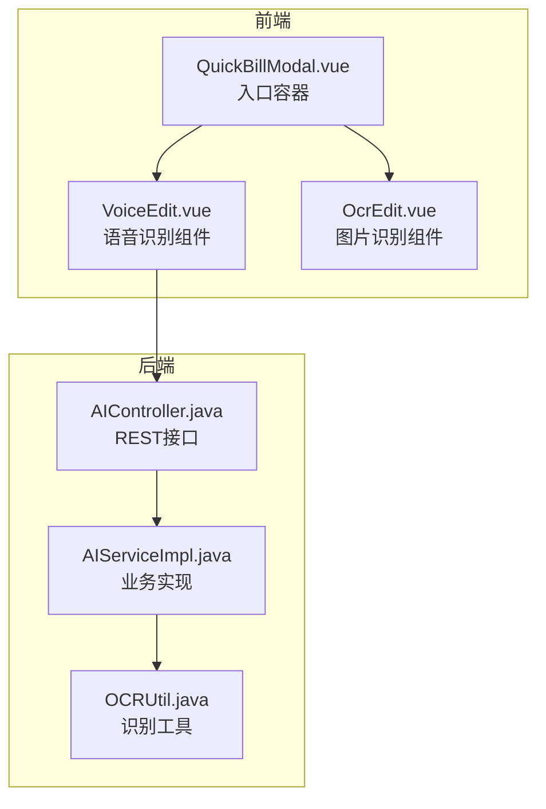
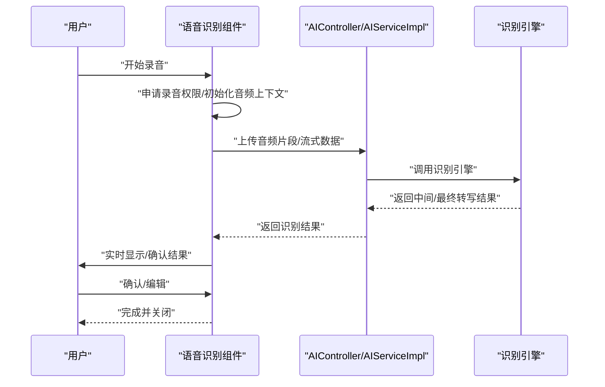
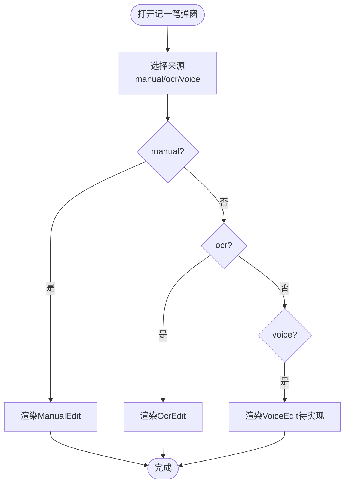
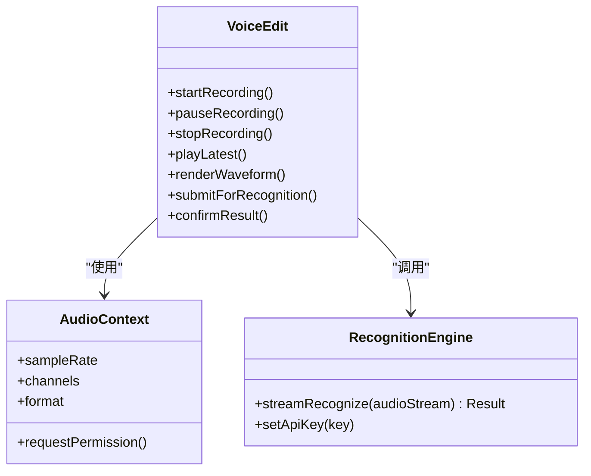
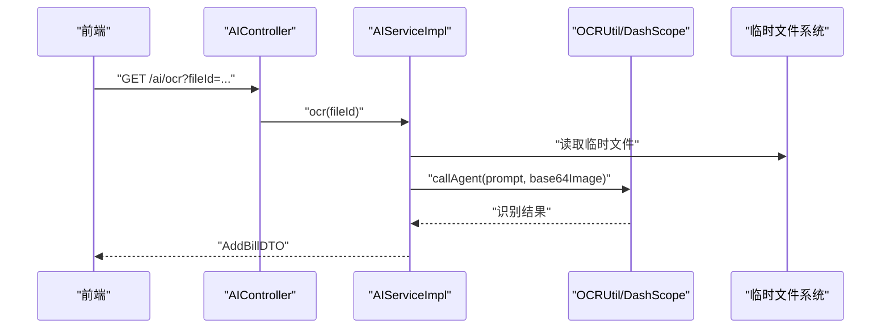
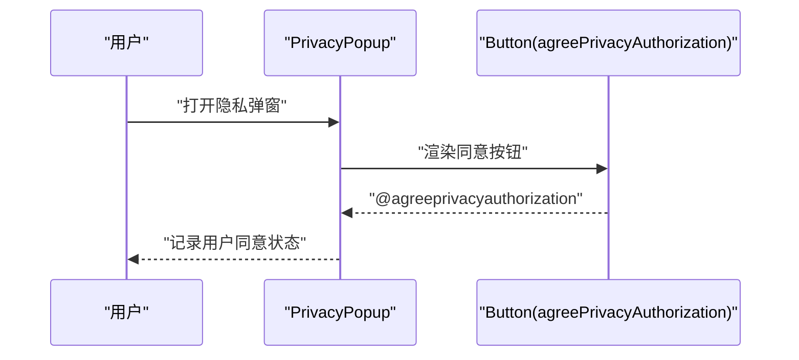
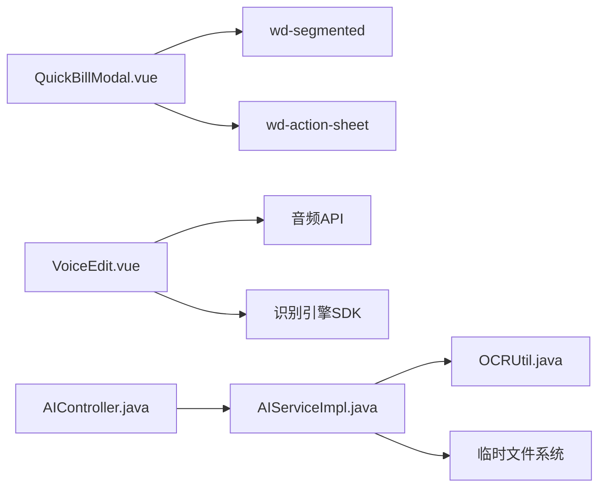

# 语音输入

<cite>
**本文引用的文件**
- [QuickBillModal.vue](file://chuan-bill-app/src/pages/bill/components/QuickBillModal.vue)
- [QuickBillModal-vendor.js](file://chuan-bill-app/dist/dev/mp-weixin/pages/bill/components/QuickBillModal-vendor.js)
- [OcrEdit.vue](file://chuan-bill-app/src/pages/bill/components/OcrEdit.vue)
- [AIController.java](file://chuan-bill-server/src/main/java/com/samoy/chuanbillserver/controller/AIController.java)
- [IAIService.java](file://chuan-bill-server/src/main/java/com/samoy/chuanbillserver/service/IAIService.java)
- [AIServiceImpl.java](file://chuan-bill-server/src/main/java/com/samoy/chuanbillserver/service/impl/AIServiceImpl.java)
- [OCRUtil.java](file://chuan-bill-server/src/main/java/com/samoy/chuanbillserver/utils/OCRUtil.java)
- [manifest.config.ts](file://chuan-bill-app/manifest.config.ts)
- [manifest.json](file://chuan-bill-app/src/manifest.json)
- [PrivacyPopup.wxml](file://chuan-bill-app/dist/dev/mp-weixin/components/PrivacyPopup.wxml)
- [wd-button-vendor.js](file://chuan-bill-app/dist/dev/mp-weixin/node-modules/wot-design-uni/components/wd-button/wd-button-vendor.js)
- [button.md](file://chuan-bill-app/.claude/skills/wot-ui/references/button.md)
- [use-upload.md](file://chuan-bill-app/.claude/skills/wot-ui/references/use-upload.md)
</cite>

## 目录
1. [简介](#简介)
2. [项目结构](#项目结构)
3. [核心组件](#核心组件)
4. [架构总览](#架构总览)
5. [详细组件分析](#详细组件分析)
6. [依赖关系分析](#依赖关系分析)
7. [性能考虑](#性能考虑)
8. [故障排除指南](#故障排除指南)
9. [结论](#结论)
10. [附录](#附录)

## 简介
本文件围绕语音输入功能进行全面技术文档化，涵盖音频录制、语音转文字、实时显示与结果确认机制；说明语音识别服务的集成与配置（录音权限、音频格式、识别引擎）；解释用户体验设计与交互逻辑（录音按钮状态、波形显示、实时转写、结果编辑）；提供相关API与前端组件实现细节；分析性能优化策略（录音质量、识别准确率、延迟）以及兼容性问题与解决方案。

当前仓库中已存在“语音识别”入口项，但尚未实现具体的语音识别组件与后端服务对接。本文将基于现有结构，给出完整的实现方案与最佳实践，帮助团队快速落地语音输入功能。

## 项目结构
语音输入功能涉及前端页面组件与后端AI服务两个层面：
- 前端：QuickBillModal作为入口容器，承载“语音识别”选项；需要新增语音识别子组件以完成录音、转写、结果编辑流程。
- 后端：AI模块提供OCR能力，可作为语音识别的参考实现模式（如文件上传、DashScope调用、结果解析与清理）。

图表来源
- [QuickBillModal.vue:14-18](file://chuan-bill-app/src/pages/bill/components/QuickBillModal.vue#L14-L18)
- [OcrEdit.vue:102-134](file://chuan-bill-app/src/pages/bill/components/OcrEdit.vue#L102-L134)
- [AIController.java:14-24](file://chuan-bill-server/src/main/java/com/samoy/chuanbillserver/controller/AIController.java#L14-L24)
- [AIServiceImpl.java:22-51](file://chuan-bill-server/src/main/java/com/samoy/chuanbillserver/service/impl/AIServiceImpl.java#L22-L51)
- [OCRUtil.java](file://chuan-bill-server/src/main/java/com/samoy/chuanbillserver/utils/OCRUtil.java)

章节来源
- [QuickBillModal.vue:1-64](file://chuan-bill-app/src/pages/bill/components/QuickBillModal.vue#L1-L64)
- [QuickBillModal-vendor.js:30-34](file://chuan-bill-app/dist/dev/mp-weixin/pages/bill/components/QuickBillModal-vendor.js#L30-L34)

## 核心组件
- QuickBillModal：提供底部弹窗，包含“手动添加”“图片识别”“语音识别”三个选项卡。当前已包含“语音识别”选项，但尚未绑定对应组件。
- OcrEdit：图片识别组件，展示了任务状态管理与失败重试的UI模式，可借鉴其状态机与交互设计。
- AIController/AIServiceImpl/OCRUtil：后端AI服务，提供OCR识别流程，可作为语音识别的参考实现模板。

章节来源
- [QuickBillModal.vue:14-18](file://chuan-bill-app/src/pages/bill/components/QuickBillModal.vue#L14-L18)
- [OcrEdit.vue:102-134](file://chuan-bill-app/src/pages/bill/components/OcrEdit.vue#L102-L134)
- [AIController.java:14-24](file://chuan-bill-server/src/main/java/com/samoy/chuanbillserver/controller/AIController.java#L14-L24)
- [AIServiceImpl.java:22-51](file://chuan-bill-server/src/main/java/com/samoy/chuanbillserver/service/impl/AIServiceImpl.java#L22-L51)

## 架构总览
语音输入的整体架构分为三层：
- 前端采集层：录音权限申请、音频采集、实时波形显示、暂停/停止控制。
- 前端处理层：音频格式预处理（采样率、编码、分片）、实时转写（WebSocket/长连接）、结果展示与编辑。
- 后端服务层：接收音频/文本、调用识别引擎（如DashScope）、返回结构化结果并清理临时资源。

图表来源
- [AIController.java:14-24](file://chuan-bill-server/src/main/java/com/samoy/chuanbillserver/controller/AIController.java#L14-L24)
- [AIServiceImpl.java:27-50](file://chuan-bill-server/src/main/java/com/samoy/chuanbillserver/service/impl/AIServiceImpl.java#L27-L50)

## 详细组件分析

### QuickBillModal 组件分析
- 功能职责：作为底部弹窗入口，提供三种记账方式的切换（手动、图片、语音）。
- 当前状态：已包含“语音识别”选项，但未绑定具体组件。
- 建议扩展：新增VoiceEdit组件，并在source为"voice"时渲染该组件。

图表来源
- [QuickBillModal.vue:25-52](file://chuan-bill-app/src/pages/bill/components/QuickBillModal.vue#L25-L52)
- [QuickBillModal-vendor.js:30-34](file://chuan-bill-app/dist/dev/mp-weixin/pages/bill/components/QuickBillModal-vendor.js#L30-L34)

章节来源
- [QuickBillModal.vue:14-18](file://chuan-bill-app/src/pages/bill/components/QuickBillModal.vue#L14-L18)
- [QuickBillModal-vendor.js:30-34](file://chuan-bill-app/dist/dev/mp-weixin/pages/bill/components/QuickBillModal-vendor.js#L30-L34)

### 语音识别组件（VoiceEdit）设计
- 录音权限与初始化
  - 申请录音权限，失败时引导用户前往设置开启。
  - 初始化音频上下文（采样率、声道数、编码格式），确保与识别引擎匹配。
- 录音控制
  - 开始/暂停/停止按钮状态管理。
  - 长按触发录音，短按播放最近一次录音。
- 实时转写
  - 使用WebSocket或长连接推送音频片段至后端。
  - 支持流式返回中间结果与最终结果。
- 结果展示与编辑
  - 实时显示转写文本，支持编辑修正。
  - 提供“复制/清空/确认”操作。
- 波形可视化（可选）
  - 基于音频能量计算绘制波形，增强用户感知。

（本图为概念示意，非现有代码结构）

### 后端AI服务集成（参考OCR实现）
- 文件上传与校验：根据fileId定位临时文件，校验存在性与类型。
- 数据准备：读取二进制数据并转换为Base64，拼接dataURL头。
- 引擎调用：调用DashScope Agent或其他识别服务，捕获异常（如缺少API Key、输入为空）。
- 结果解析与清理：解析输出JSON，提取所需字段，删除临时文件。

图表来源
- [AIController.java:20-24](file://chuan-bill-server/src/main/java/com/samoy/chuanbillserver/controller/AIController.java#L20-L24)
- [AIServiceImpl.java:27-50](file://chuan-bill-server/src/main/java/com/samoy/chuanbillserver/service/impl/AIServiceImpl.java#L27-L50)

章节来源
- [AIController.java:14-24](file://chuan-bill-server/src/main/java/com/samoy/chuanbillserver/controller/AIController.java#L14-L24)
- [AIServiceImpl.java:22-51](file://chuan-bill-server/src/main/java/com/samoy/chuanbillserver/service/impl/AIServiceImpl.java#L22-L51)

### 权限与隐私弹窗
- 隐私弹窗：提供“同意/拒绝”按钮，使用开放能力open-type="agreePrivacyAuthorization"监听用户同意事件。
- 录音权限：在首次录音时请求权限，若被拒绝则引导用户前往系统设置开启。

图表来源
- [PrivacyPopup.wxml:1-1](file://chuan-bill-app/dist/dev/mp-weixin/components/PrivacyPopup.wxml#L1-L1)
- [wd-button-vendor.js:18-28](file://chuan-bill-app/dist/dev/mp-weixin/node-modules/wot-design-uni/components/wd-button/wd-button-vendor.js#L18-L28)
- [button.md:152-168](file://chuan-bill-app/.claude/skills/wot-ui/references/button.md#L152-L168)

章节来源
- [PrivacyPopup.wxml:1-1](file://chuan-bill-app/dist/dev/mp-weixin/components/PrivacyPopup.wxml#L1-L1)
- [wd-button-vendor.js:18-28](file://chuan-bill-app/dist/dev/mp-weixin/node-modules/wot-design-uni/components/wd-button/wd-button-vendor.js#L18-L28)
- [button.md:152-168](file://chuan-bill-app/.claude/skills/wot-ui/references/button.md#L152-L168)

## 依赖关系分析
- 前端依赖
  - QuickBillModal依赖Wot Design Uni的wd-segmented与wd-action-sheet组件。
  - 语音识别组件依赖音频API与识别引擎SDK。
- 后端依赖
  - AIServiceImpl依赖OCRUtil与DashScope SDK。
  - 临时文件系统用于存储上传的音频/图片文件。

图表来源
- [QuickBillModal.vue:26-51](file://chuan-bill-app/src/pages/bill/components/QuickBillModal.vue#L26-L51)
- [AIController.java:14-24](file://chuan-bill-server/src/main/java/com/samoy/chuanbillserver/controller/AIController.java#L14-L24)
- [AIServiceImpl.java:22-51](file://chuan-bill-server/src/main/java/com/samoy/chuanbillserver/service/impl/AIServiceImpl.java#L22-L51)

章节来源
- [QuickBillModal.vue:26-51](file://chuan-bill-app/src/pages/bill/components/QuickBillModal.vue#L26-L51)
- [AIController.java:14-24](file://chuan-bill-server/src/main/java/com/samoy/chuanbillserver/controller/AIController.java#L14-L24)

## 性能考虑
- 录音质量控制
  - 采样率与比特深度：建议44.1kHz/16bit或更高，满足通用识别需求。
  - 单声道：降低带宽与处理复杂度，适合语音场景。
  - 音量增益与降噪：前端进行简单增益与噪声抑制，减少无效数据。
- 识别准确率提升
  - 语义提示词：为识别引擎提供领域化提示（如“账单金额、日期、商户名称”）。
  - 分段识别：将长语音切分为适中片段，提高鲁棒性。
  - 流式结果：优先展示中间结果，缩短感知延迟。
- 延迟优化
  - WebSocket长连接：避免频繁握手开销。
  - 前端缓存：对已识别片段进行缓存，支持断点续识。
  - 后端并发：识别队列与并发控制，避免阻塞。
- 资源管理
  - 及时释放音频上下文与引擎实例。
  - 上传完成后立即删除临时文件，避免磁盘占用。

## 故障排除指南
- 录音权限被拒绝
  - 引导用户前往系统设置开启麦克风权限。
  - 提示“请在设置中允许录音权限”。
- 识别引擎异常
  - 缺少API Key：提示用户配置Key或联系管理员。
  - 输入为空/格式错误：检查音频编码与采样率是否符合要求。
- 网络不稳定
  - 采用重试与断线重连机制，必要时回退到离线识别（如可用）。
- 临时文件缺失
  - 后端抛出文件不存在异常时，提示用户重新上传或刷新页面。

章节来源
- [AIServiceImpl.java:31-33](file://chuan-bill-server/src/main/java/com/samoy/chuanbillserver/service/impl/AIServiceImpl.java#L31-L33)
- [AIServiceImpl.java:47-49](file://chuan-bill-server/src/main/java/com/samoy/chuanbillserver/service/impl/AIServiceImpl.java#L47-L49)

## 结论
语音输入功能需要从前端录音与转写、后端识别服务两条主线协同实现。当前项目已在入口处预留“语音识别”选项，建议尽快完成VoiceEdit组件开发，并复用后端AI服务的通用模式（文件校验、数据准备、引擎调用、结果解析与清理）。通过合理的权限管理、流式转写与性能优化，可显著提升用户体验与识别效果。

## 附录

### API接口说明（参考）
- GET /ai/ocr
  - 功能：通过文件ID进行OCR识别
  - 查询参数：fileId（字符串）
  - 返回：识别结果对象
  - 示例：见AIController中的接口定义

章节来源
- [AIController.java:20-24](file://chuan-bill-server/src/main/java/com/samoy/chuanbillserver/controller/AIController.java#L20-L24)

### 前端组件实现要点
- 录音权限与隐私弹窗
  - 使用隐私弹窗组件与Button的agreePrivacyAuthorization事件。
- 上传与状态管理
  - 参考use-upload.md中的文件上传选项与回调，结合任务状态机设计。
- UI交互
  - 可借鉴OcrEdit的状态与按钮布局，统一视觉风格与交互反馈。

章节来源
- [PrivacyPopup.wxml:1-1](file://chuan-bill-app/dist/dev/mp-weixin/components/PrivacyPopup.wxml#L1-L1)
- [wd-button-vendor.js:18-28](file://chuan-bill-app/dist/dev/mp-weixin/node-modules/wot-design-uni/components/wd-button/wd-button-vendor.js#L18-L28)
- [use-upload.md:57-88](file://chuan-bill-app/.claude/skills/wot-ui/references/use-upload.md#L57-L88)

### 兼容性与权限配置
- Android权限
  - manifest.config.ts中声明了相机等权限，录音权限需补充android.permission.RECORD_AUDIO。
- 小程序平台
  - mp-weixin中设置urlCheck=false便于开发调试，生产环境需调整。
- 隐私与合规
  - 首次录音时弹出隐私弹窗，明确告知权限用途与数据处理规则。

章节来源
- [manifest.config.ts:35-52](file://chuan-bill-app/manifest.config.ts#L35-L52)
- [manifest.json:21-31](file://chuan-bill-app/src/manifest.json#L21-L31)
- [PrivacyPopup.wxml:1-1](file://chuan-bill-app/dist/dev/mp-weixin/components/PrivacyPopup.wxml#L1-L1)